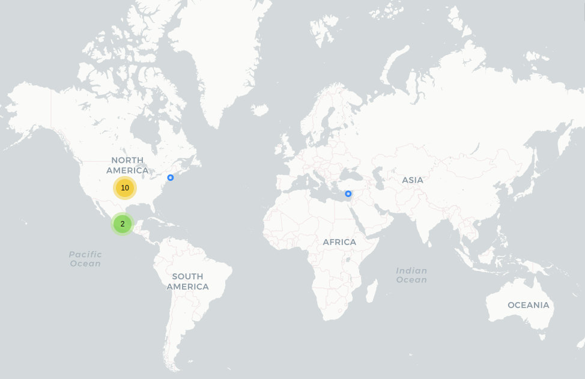

# 9-1-1 Emergencias

## Fechas de análisis

- **Análisis estático (mediante Exodus Privacy):** 30 marzo 2022    
- **Análisis dinámico (mediante análisis de tráfico de red):** 18 abril 2022    
- **Análisis posteriores:**

## Archivos analizados

- [apk versión 2.0](http://cloud.datavoros.org/index.php/s/iJKcXzL3JPMyxt6)   
- [pcap versión 2.0](http://cloud.datavoros.org/index.php/s/Zf3QDo42A2LgASd)

## Descripción de la aplicación

- **Tipo:** Aplicación de emergencias Nacional   
- **Costo:** Gratuito   
- **Enlace de descarga:** [https://play.google.com/store/apps/details?id=gob.sesnsp.emergencia911](https://play.google.com/store/apps/details?id=gob.sesnsp.emergencia911&hl=es)   
- **Descargas:** 100,000+   
- **Fecha de actualización:** 17 Septiembre 2019  
- **Versión:** 2.0   
- **Desarrollador:** [https://www.gob.mx/911](https://www.gob.mx/911)   
- **Firma:** Secretariado, CNI, SEGOB   
- **Contacto:** sesnpcni@gmail.com       
- **Política de privacidad:**   
  - [https://www.gob.mx/911/es/articulos/app-9-1-1-emergencias?idiom=es](https://www.gob.mx/911/es/articulos/app-9-1-1-emergencias?idiom=es)
  - [https://www.gob.mx/911/documentos/aviso-de-privacidad-de-la-app-9-1-1-emergencia](https://www.gob.mx/911/documentos/aviso-de-privacidad-de-la-app-9-1-1-emergencia)

- **Descripción en PlayStore:**   
~~~
La aplicación 9-1-1 es la aplicación móvil que ofrece un servicio nacional a través del cual la población
puede reportar una situación de emergencia desde cualquier ubicación del país, favoreciendo una
mejor atención al minimizar el tiempo de respuesta, ya que de manera automática el operador obtiene
la ubicación y el nombre del usuario, utilizando la información proporcionada por el dispositivo
móvil.
~~~

## Rastreadores identificados (mediante Exodus Privacy)

- [Google Admob](https://admob.google.com/home/) (Incluye Admob Mediation y Google DoubleClick)   
- [Google Analytics](https://marketingplatform.google.com/about/analytics/)   
- [Google Crashlytics](https://firebase.google.com/products/crashlytics/)   
- [Google Firebase Analytics](https://firebase.google.com/)   
- [Google Tag Manager](https://marketingplatform.google.com/about/tag-manager/)

Enlace al [reporte](https://reports.exodus-privacy.eu.org/es/reports/gob.sesnsp.emergencia911/latest/).

## Empresas relacionadas con esta aplicación

- [Alphabet](https://abc.xyz/) a través de Google (Rastreadores y servicio de ubicación)
- [Alestra](https://www.alestra.mx/) (Servidor donde está guardada la aplicación)

## Permisos
- **Según la Playstore:** 17 permisos.
- **Según Exodus Privacy:** 24 permisos.
- **Según prueba de uso:** 8 permisos que se piden de manera explícita.   

### Permisos según la PlayStore

Esta aplicación tiene acceso a:   

- 
Contactos

 - Leer tus contactos

- 
Ubicación

  - Ubicación precisa (según el GPS y la red)

- 
SMS
 - Enviar mensajes SMS

- 
Teléfono

    - Llamar directamente a números de teléfono
    - Llamar directamente a cualquier número de teléfono
    - Leer la identidad y el estado del dispositivo

- 
Fotos/datos multimedia/archivos

    - Leer el contenido del dispositivo USB
    - Modificar o eliminar el contenido del almacenamiento USB

- 
Almacenamiento

    - Leer el contenido del dispositivo USB
    - Modificar o eliminar el contenido del almacenamiento USB

- 
Cámara

    - Tomar fotografías y grabar videos

- 
Micrófono

    - Grabar audio

- 
ID de dispositivo y datos de llamadas

    - Leer la identidad y el estado del dispositivo

- :grey_question:Otro

    - Licencia completa para interactuar con los usuarios
    - Recibir datos desde Internet
    - Ver conexiones de red
    - Acceso completo a la red
    - Mostrar sobre otras aplicaciones
    - Impedir que el dispositivo entre en modo de suspensión
    - Modificar la configuración del sistema
    - Leer la configuración de servicio de Google

### Permisos según Exodus Privacy

- :exclamation:
ACCESS_FINE_LOCATION    
 _Access precise location (GPS and network-based)_

- ACCESS_NETWORK_STATE    
_View network connections_

- ACCESS_NOTIFICATION_POLICY    
_Access Do Not Disturb_

- ACTION_DIAL

- :exclamation:
CALL_PHONE    
_Directly call phone numbers_

- CALL_PRIVILEGED

- :exclamation:
CAMERA    
_Take pictures and videos_

- COARSE_LOCATION

- INTERACT_ACROSS_USERS_FULL

- INTERNET    
_Have full network access_

- :exclamation:
READ_CONTACTS    
_Read your contacts_

- :exclamation:
READ_EXTERNAL_STORAGE    
_read the contents of your SD card_

- :exclamation:
READ_PHONE_STATE    
_read phone status and identity_

- :exclamation:
RECORD_AUDIO    
_record audio_

- RECORD_VIDEO

- :exclamation:
SEND_SMS    
_send and view SMS messages_

- SYSTEM_ALERT_WINDOW    
_This app can appear on top of other apps_

- WAKE_LOCK    
_prevent phone from sleeping_

- :exclamation:
WRITE_EXTERNAL_STORAGE    
_modify or delete the contents of your SD card_

- :exclamation:WRITE_SETTINGS    
_modify system settings_

- RECEIVE

- READ_GSERVICES

- ACTION_MANAGE_WRITE_SETTINGS

- C2D_MESSAGE

El icono :exclamation: indica un nivel 'Peligroso' o 'Especial' de acuerdo a los [niveles de protección de Google](https://developer.android.com/guide/topics/permissions/overview).

### Permisos solicitados al usuario durante el uso de la aplicación

- :red_circle: Acceso a Ubicación (Si se niega, funciona en segundo plano)
- :blue_circle: Acceso a llamadas telefónicas
- :blue_circle: Acceso a Contactos
- :blue_circle: Acceso a Grabar Audio
- :blue_circle: Acceso a Tomar Fotos y Video
- :blue_circle: Acceso a fotos, archivos multimedia y archivos
- :blue_circle: Acceso a "No molestar"
- :blue_circle: Acceso a SMS

:red_circle: Este ícono indica un permiso obligatorio   
:blue_circle: Este ícono indica un permiso opcional pero se pierde una funcionalidad particular

## Datos

### Datos solicitados al usuario durante el uso de la aplicación

- :red_circle: Número de celular
- :red_circle: Compañía telefónica
- :red_circle: Nombre
- :red_circle: Apellido Paterno
- :red_circle: Apellido Materno
- :red_circle: Correo Electrónico
- :blue_circle: Fecha de nacimiento
- :red_circle: Sexo
- :red_circle: Domicilio
- :red_circle: Estado
- :red_circle: Municipio
- :red_circle: Colonia
- :red_circle: C.P.
- :blue_circle: Contactos de emergencia (Máx. 5)
- :blue_circle: Perfil médico que incluye:
  - Peso
  - Estatura
  - Padecimientos
  - Alergias y reacciones
  - Medicamentos actuales
  - Tipo de sangre   

:red_circle: Este ícono indica que se debe ingresar este dato de manera obligatoria.   
:blue_circle: Este ícono indica que estos datos son opcionales.

### Tabla de conexiones realizadas durante el uso de la aplicación

| Dirección IP    | Número de paquetes | País          | Ciudad                | Número AS | Organización AS             |
|-----------------|--------------------|---------------|-----------------------|-----------|-----------------------------|
|  64.233.185.120 |                 19 | United States |                       |     15169 | GOOGLE                      |
| 142.250.68.106  |                 36 | United States |                       |     15169 | GOOGLE                      |
| 142.250.72.138  |                 36 | United States |                       |     15169 | GOOGLE                      |
| 142.250.72.174  |               1485 | United States |                       |     15169 | GOOGLE                      |
| 142.250.176.4   |                 55 | United States |                       |     15169 | GOOGLE                      |
| 142.250.176.10  |                172 | United States |                       |     15169 | GOOGLE                      |
| 142.250.199.131 |                 26 | United States |                       |     15169 | GOOGLE                      |
| 142.251.40.35   |                  5 | United States |                       |     15169 | GOOGLE                      |
| 142.251.40.42   |                 32 | United States |                       |     15169 | GOOGLE                      |
| 142.251.40.46   |                 26 | United States |                       |     15169 | GOOGLE                      |
| 201.151.6.27    |                234 | México        | Mineral de la Reforma |     11172 | Alestra, S. de R.L. de C.V. |

### 

### Notas sobre datos recolectados

- Cuando se instala la app, se manda un identificador a Google.
- La aplicación contacta a los servidores de google por dos razones: los mapas y la geolocalización y por los rastreadores de Firebase, Analytics, Crashlytics, Tag Manager y Admob. Firebase recolecta toda una serie de eventos realizados en la aplicación. Aquí los enlaces a todos los eventos y datos que, de manera estándar se recolectan [1](https://support.google.com/firebase/answer/9234069?hl=en&ref_topic=6317484&visit_id=637859685880636053-1936242821&rd=1), [2](https://support.google.com/firebase/answer/9268042?hl=en&ref_topic=6317484&visit_id=637859685880636053-1936242821&rd=1), [3](https://support.google.com/firebase/answer/7029846?hl=en&ref_topic=7029512).
- Los rastreadores [Crashlytics](https://firebase.google.com/docs/crashlytics) y [Analytics](https://firebase.google.com/docs/analytics) son dos subrastreadores de Firebase. El primero tiene la función de mejorar la aplicación al mandar reportes de cierres inesperados de la apliación, el segundo otorga información sobre su uso, lo que no necesariamente es malo. Sin embargo AdMob es un rastreadores para mostrar banners de publicidad dentro de la aplicación mientras que TagManager es un rastreador que permite etiquetar secciones de código.
- En el análisis no notamos envíos de datos más que de Tag Manager. Puede ser que los otros rastreadores, a pesar de estar presentes, tengan varias de sus funciones desactivadas o tengan temporizadores u otro tipo de activadores.
- Se contacta el servidor clients4.google.com. No hay mucha información sobre este dominio y su utilidad. En este caso tiene que ver probablemente con algún rastreador. Sabemos que se manda el sistema operativo y su versión, pero nada más.
- El servidor 201.151.6.27 de Alestra es el _Host_ de esta aplicación. Todas las llamadas que se hacen a ese servidor están cifradas.
- Cuando se hace una llamada al 911, se envía automáticamente la ubicación y el número de teléfono.
- El reporte de incidente envía:
  - archivo
  - teléfono
  - Ubicación
  - Id de incidente
  - Estado de la república
  - Municipio
  - Descripción
  - Dirección

- Además se asigna un folio al reporte que se puede revisar.
- El botón de Alerta de Pánico envía:
  - Fecha
  - Ubicación
  - Teléfono

## Tabla de relación entre permisos y funciones

| permisos  | Funciones relacionadas  |
|---|---|
| ACCESS_FINE_LOCATION  | Servicio de ubicación  |
| ACCESS_NETWORK_STATE  | Internet  |
| ACCESS_NOTIFICATION_POLICY  | Botón de pánico  |
| ACTION_DIAL  | Llamada 911  |
| CALL_PHONE  | Llamada 911  |
| CALL_PRIVILEGED  | Llamada 911  |
| CAMERA  | Notificación de emergencia  |
| COARSE_LOCATION  | Servicio de ubicación   |
| INTERACT_ACROSS_USERS_FULL  | No sabemos para qué sirve  |
| INTERNET  | Internet  |
| READ_CONTACTS  | Red de contactos  |
| READ_EXTERNAL_STORAGE  | Notificación médica  |
| READ_PHONE_STATE  | Llamada 911  |
| RECORD_AUDIO  | Notificación de emergencia  |
| RECORD_VIDEO  | Notificación de emergencia |
| SEND_SMS  |Manadar a contactos de emergencia un sms   |
| SYSTEM_ALERT_WINDOW  | No sabemos para qué se usa  |
| WAKE_LOCK  | Botón de pánico  |
| WRITE_EXTERNAL_STORAGE  | Notificaciones de emergencia  |
| WRITE_SETTINGS  | Para bajar la luminosidad de la pantalla en un 80% en una llamada de botón de pánico  |
| RECEIVE  | Push Notifications  |
| READ_GSERVICES  | Servicio de ubicación  |
| ACTION_MANAGE_WRITE_SETTINGS  | Para bajar la luminosidad de la pantalla en un 80% en una llamada de botón de pánico  |
| C2D_MESSAGE  | Push Notifications  |

### Funciones específicas de la aplicación
- N/A

## Notas

- El número de teléfono se guarda y queda asociado a un usuario. Sin embargo, para recuperar el propio perfil, deberían mandar un código vía correo electrónico, pero nunca llega.

## Conclusiones

- Esta app no tiene problemas flagrantes de seguridad.
- Consideramos que hay un uso excesivo de rastreadores, en particular la presencia de Google AdMob.
- La relación de permisos y funciones es bastante simétrica y el permiso _system_alert_window_ no resulta peligroso.
- No se puede borrar ni recuperar el propio perfil, de tal manera que una vez desinstalada la aplicación, es imposible volver a instalarla a menos que se tenga un nuevo número de teléfono.
