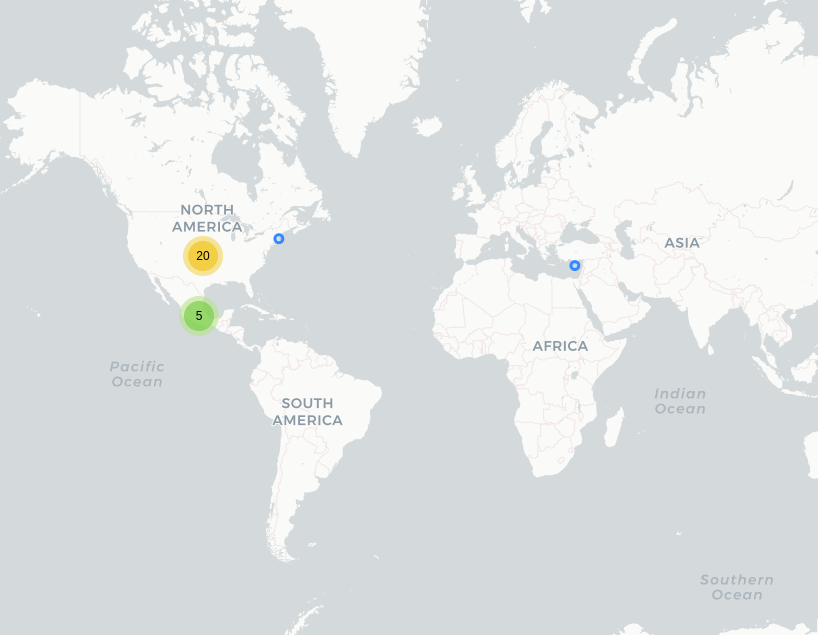

# 911 CDMX

## Fecha de análisis

- **Análisis estático (mediante Exodus Privacy):** 30 marzo 2022   
- **Análisis dinámico (mediante captura de tráfico de red):** 28 abril 2022   
- **Análisis posteriores:**

## Archivos analizados
[apk versión 1.3.5](http://cloud.datavoros.org/index.php/s/eeoTJKzEGPxpBFW)   
[pcap versión 1.3.5](http://cloud.datavoros.org/index.php/s/gde2mT24t8AXjTZ)

## Descripción de la aplicación

- **Tipo:** Aplicación de emergencias de la CDMX   
- **Costo:** Gratuito   
- **Enlace de descarga:** [https://play.google.com/store/apps/details?id=com.desarrollo.c5.app_066_android_2&hl=es](https://play.google.com/store/apps/details?id=com.desarrollo.c5.app_066_android_2&hl=es)       
- **Descargas:** 1,000,000+   
- **Fecha de actualización:** 22 Mayo 2020   
- **Versión:** 1.3.5   
- **Desarrollador:** [https://www.c5.cdmx.gob.mx/](https://www.c5.cdmx.gob.mx/)   
- **Firma:** CAEPCCM    
- **Contacto:** ciudadsegura@cdmx.gob.mx   
- **Condiciones de uso y Política de privacidad:**  
  - [https://www.c5.cdmx.gob.mx/terminos911cdmx](https://www.c5.cdmx.gob.mx/terminos911cdmx)

- **Uso según la PlayStore:**

~~~
La aplicación informática para el uso del Servicio de Atención de Llamadas de
Emergencia 911 en dispositivos móviles Android, es un proyecto que el Gobierno
de la Ciudad de México, a través del Centro de Comando, Control, Cómputo,
Comunicaciones y Contacto Ciudadano de la Ciudad de México, desarrolló,
implementó y opera, con el objeto de poner a disposición de la población en la
Ciudad de México, una herramienta tecnológica que facilite solicitar auxilio
a las autoridades locales, en caso de una emergencia.
~~~

## Rastreadores identificados (mediante Exodus Privacy)

- [Google Crashlytics](https://firebase.google.com/products/crashlytics)   
- [Google Firebase Analytics](https://firebase.google.com/products/analytics)

Enlace a [reporte](https://reports.exodus-privacy.eu.org/es/reports/com.desarrollo.c5.app_066_android_2/latest/)   

## Empresas relacionadas con esta aplicación

- [Alphabet](https://abc.xyz/) a través de Google (Rastreadores y servicio de ubicación)(Rastreadores y ubicación)
- [Twitter](https://about.twitter.com/es) (Función de notificaciones sobre temblores)
- Uninet ([Telmex](https://telmex.com/)) (Servidores donde está albergada la aplicación)
- Edgecast (comprada por [edg.io](https://edg.io/))(Servidor relacionado con Twitter)

## Permisos

- **Según la Playstore:** 11 permisos
- **Según Exodus Privacy:** 14 permisos.   
- **Según prueba de uso:** 7 permisos que se piden de manera explícita.

### Permisos según la PlayStore

Esta aplicación tiene acceso a:

- ID de dispositivo y datos de llamadas

  - Leer la identidad y el estado del dispositivo

-  Fotos/datos multimedia/archivos

  - Leer el contenido del dispositivo USB
  - Modificar o eliminar el contenido del almacenamiento USB

-  Cámara

  - Tomar fotografías y grabar videos

-  Contactos

  - Leer tus contactos

-  Almacenamiento

  - Leer el contenido del dispositivo USB
  - Modificar o eliminar el contenido del almacenamiento USB

- Ubicación

  - Ubicación precisa (según el GPS y la red)

- Teléfono

  - Leer la identidad y el estado del dispositivo
  - Llamar directamente a números de teléfono

- ❔Otro

  - Recibir datos desde Internet
  - Impedir que el dispositivo entre en modo de suspensión
  - Ver conexiones de red
  - Acceso completo a la red

### Permisos según Exodus Privacy

- :exclamation:ACCESS_FINE_LOCATION   
_Access precise location (GPS and network-based)_

- ACCESS_NETWORK_STATE   
_View network connections_

- ACCESS_NOTIFICATION_POLICY   
_Access Do Not Disturb_

- :exclamation:CALL_PHONE   
_Directly call phone numbers_

- :exclamation:CAMERA   
_Take pictures and videos_

- FOREGROUND_SERVICE   
_Run foreground service_

- INTERNET   
_Have full network access_

- :exclamation:READ_CONTACTS   
_read your contacts_

- :exclamation:READ_EXTERNAL_STORAGE   
_read the contents of your SD card_

- :exclamation:READ_PHONE_STATE   
_read phone status and identity_

- WAKE_LOCK   
_prevent phone from sleeping_

- :exclamation:WRITE_EXTERNAL_STORAGE   
_modify or delete the contents of your SD card_

- RECEIVE

- BIND_GET_INSTALL_REFERRER_SERVICE

### Permisos solicitados durante el uso de la aplicación

- :blue_circle: Acceso a ubicación
- :blue_circle: Acceso a llamadas telefónicas
- :blue_circle: Acceso a contactos

:blue_circle: Este ícono indica un permiso opcional pero se pierde una funcionalidad particular

## Datos

### Datos solicitados al usuario durante el uso de la aplicación

- :red_circle: Número de celular
- :blue_circle: Compañía telefónica
- :red_circle: Nombre
- :red_circle: Apellido Paterno
- :red_circle: Apellido Materno
- :blue_circle: Fecha de nacimiento
- :red_circle: Correo electrónico
- :blue_circle: Calle
- :blue_circle: Número
- :blue_circle: Colonia
- :blue_circle: Delegación
- :blue_circle: C.P.
- :blue_circle: Ficha de salud
  - :red_circle: Edad
  - :blue_circle: Sexo
  - :blue_circle: Tipo de sangre
  - :blue_circle: Padecimiento
  - :red_circle: Enfermedad crónica
  - :red_circle: Alergias
  - :red_circle: Suministro de medicamentos

:red_circle: Este ícono indica que se debe ingresar este dato de manera obligatoria.   
:blue_circle: Este ícono indica que estos datos son opcionales.

### Tabla de conexiones realizadas durante el uso de la Aplicación

| Dirección IP    | Paquetes | País          | Ciudad        | Número AS | Organización AS     |
|-----------------|----------|---------------|---------------|-----------|---------------------|
| 104.244.42.8    |      100 | United States |               |     13414 | TWITTER             |
| 104.244.42.130  |      125 | United States |               |     13414 | TWITTER             |
| 142.250.123.188 |        2 | United States |               |     15169 | GOOGLE              |
| 142.250.190.3   |       20 | United States |               |     15169 | GOOGLE              |
| 142.250.190.10  |        3 | United States |               |     15169 | GOOGLE              |
| 142.250.190.42  |       92 | United States |               |     15169 | GOOGLE              |
| 142.250.190.74  |      899 | United States |               |     15169 | GOOGLE              |
| 142.250.190.78  |      478 | United States |               |     15169 | GOOGLE              |
| 142.250.190.138 |       53 | United States |               |     15169 | GOOGLE              |
| 142.250.191.170 |      144 | United States |               |     15169 | GOOGLE              |
| 142.250.191.202 |       25 | United States |               |     15169 | GOOGLE              |
| 142.250.191.206 |       34 | United States |               |     15169 | GOOGLE              |
| 142.250.191.227 |        3 | United States |               |     15169 | GOOGLE              |
| 142.250.191.238 |       38 | United States |               |     15169 | GOOGLE              |
| 142.251.4.188   |       28 | United States |               |     15169 | GOOGLE              |
| 142.251.16.92   |       22 | United States |               |     15169 | GOOGLE              |
| 142.251.32.10   |      719 | United States |               |     15169 | GOOGLE              |
| 172.217.1.106   |        6 | United States |               |     15169 | GOOGLE              |
| 172.217.2.46    |       26 | United States |               |     15169 | GOOGLE              |
| 187.174.224.151 |      178 | México        | Mexicaltzingo |      8151 | Uninet S.A. de C.V. |
| 189.247.22.77   |     2047 | México        |               |      8151 | Uninet S.A. de C.V. |
| 189.247.22.78   |     1431 | México        |               |      8151 | Uninet S.A. de C.V. |
| 189.247.22.81   |     1371 | México        |               |      8151 | Uninet S.A. de C.V. |
| 192.229.173.16  |       34 | United States |               |     15133 | EDGECAST            |

### 

### Notas sobre datos recolectados

- La aplicación contacta a los servidores de google por dos razones: los mapas y la geolocalización y por los rastreadores de Firebase y Crashlytics. Firebase asigna [firebaseinstallations](https://firebase.google.com/docs/reference/android/com/google/firebase/installations/FirebaseInstallations) una id particular a la instalación de la app. De ahí recolecta, a través de app-measurement.com toda una serie de eventos realizados en la aplicación. Aquí los enlaces a todos los eventos y datos que, de manera estándar se recolectan [1](https://support.google.com/firebase/answer/9234069?hl=en&ref_topic=6317484&visit_id=637859685880636053-1936242821&rd=1), [2](https://support.google.com/firebase/answer/9268042?hl=en&ref_topic=6317484&visit_id=637859685880636053-1936242821&rd=1), [3](https://support.google.com/firebase/answer/7029846?hl=en&ref_topic=7029512).
- Los servidores de Twitter son contactados por la función de notificaciones sobre temblores.
- El servidor de Edgecast está relacionado con Twitter.
- En el servidor 189.174.224.151 de Uninet sirve para el registro de los usuarios. Las llamadas a este servidor son en HTTP, es decir que no están cifradas. Los datos que se mandan son los datos de registro del usuario además del tipo de sistema operativo, un identificador de telefonía y el modelo del celular. Asimismo el token de autenticación y la llave son también mandados en texto plano.
- En este mismo servidor, también en HTTP, se almacenan y mandan en texto plano los datos del usuario que uno agrega en la sección de la *Ficha de salud* y los datos del seguro médico.
- En el servidor arriba mencionado se mandan también en texto plano las modificaciones de las opciones de servicios de *Anuncios Públicos*, *Llamadas de extorsión* y *Alerta sísmica*. Además los datos de la *Red de contactos de emergencia*.
- También en texto plano se mandan los datos cuando uno hace una llamada de emergencia con el botón de auxilio. 

## Tabla de relación entre permisos y funciones

| Permisos  | Funciones relacionadas  |
|---|---|
| ACCESS_FINE_LOCATION  | Servicio de ubicación  |
| ACCESS_NETWORK_STATE  | Servicio de ubicación  |
| ACCESS_NOTIFICATION_POLICY  | Alarma sísmica  |
| CALL_PHONE  | Llamada 911  |
| CAMERA  | Chat  |
| FOREGROUND_SERVICE  | Botón de pánico  |
| INTERNET | Internet  |
| READ_CONTACTS  | Mi red emergencias  |
| READ_EXTERNAL_STORAGE  | Chat  |
| READ_PHONE_STATE  | Llamada 911  |
| WAKE_LOCK  | Botón de pánico  |
| WRITE_EXTERNAL_STORAGE  | Chat  |
| RECEIVE  | Push Notifications  |
| BIND_GET_INSTALL_REFERRER_SERVICE  | Rastreador Firebase  |

### Funciones específicas de la aplicación

- Alerta sísmica
- Anuncios Públicos
- Llamadas de extorsión
- Widgets: chat de emergencia, llamada 911, llamada silenciosa

## Notas

- La Leyenda de tratamiento de datos debe ser aceptada de manera expresa.
- El enlace a la página de Políticas de privacidad en la Playstore está mal.
- Intentamos agregar un contacto a la red de emergencias pero no se pudo. Aunque el contacto tenía la aplicación instalada (requerimiento necesario), la aplicación no identificó que ese contacto la tenía instalada.
- Si el usuario instala la aplicación y luego la desinstala, no es posible volver a registrarse. Se tiene que hacer un restablecimiento de fábrica del celular para poder hacerlo.
- El registro no siempre funciona a la primera, a veces hay que abrir y cerrar la aplicación varias veces.
- El aviso de emergencia por chat no funcionó.
- La función *Llamada silenciosa* simplemente abre una llamada a 911.
- En un celular la función de localización no funcionó, en otro sí.
- La función de chat no funcionó.

## Conclusiones

- La aplicación hace las llamadas al servidor de Uninet 187.174.224.151 en texto plano, es decir que no está cifrado. Todos los datos que el usuario otorga de manera voluntaria además de un identificador de telefonía, el sistema operativo, el modelo del celular y la llave y el token de autenticación, no están cifrados. Las llamadas de emergencia a través del botón de pánico, tampoco. Esto es un problema de seguridad mayúsculo.
- La relación entre permisos y funciones es simétrica y no hay nada fuera de lo normal.
- El uso de rastreadores no es excesivo, aunque nos preocupa la integración con Twitter en la información sísmica. No estamos seguros de que esto sea necesariamente un problema de privacidad, pero existe dicha posibilidad debido a las prácticas agresivas de rastreo que tiene esa empresa.
- Hay varias funciones que no sirven o sirven a medias y está el _bug_ (error) que niega la posibilidad de instalar la aplicación dos veces en un mismo celular sin antes tener que revertirlo a sus configuraciones de fábrica.
