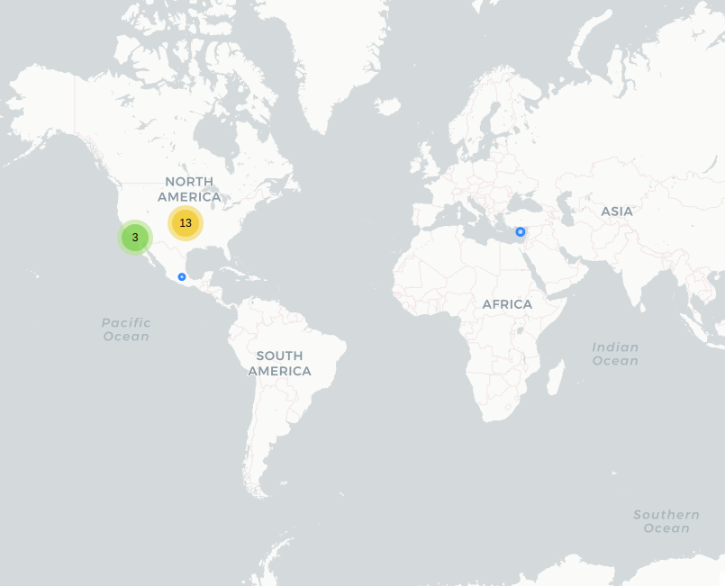

# 911MóvilBC

## Fecha de análisis

- **Análisis estático (mediante Exodus Privacy):** 12 abril 2022    
- **Análisis dinámico (mediante captura de tráfico de red):** 18 abril 2022    
- **Análisis posteriores:** 20 mayo 2022 / 07 septiembre 2022 / 17 octubre 2022 

## Archivos analizados

[apk versión 5.5.4.1](http://cloud.datavoros.org/index.php/s/LTpiCEmbR9RSEje)   
[pcap versión 5.5.4.1](http://cloud.datavoros.org/index.php/s/bxLwToxq778R3M2)      

[apk versión 5.6.0](http://cloud.datavoros.org/index.php/s/NQB6fxnqRBz8FL3)   
[pcap versión 5.6.0](http://cloud.datavoros.org/index.php/s/rmLnnWgGnLDjzLG)      

[apk versión 5.7.1](http://cloud.datavoros.org/index.php/s/r2QMLHD5eAoYGj3)   
[pcap versión 5.7.1](http://cloud.datavoros.org/index.php/s/sYJLByXJfKg83jQ)   

## Descripción de la aplicación

- **Tipo:** Aplicación de emergencias de Baja California   
- **Costo:** Gratuito   
- **Link:** [https://play.google.com/store/apps/details?id=com.c4bc.alerta066m](https://play.google.com/store/apps/details?id=com.c4bc.alerta066m)        
- **Descargas:** 50,000+  
- **Fechas de actualización:** 03 Diciembre 2021 / 19 Abril 2022 / 26 Septiembre 2022   
- **Versión:**  5.5.14/ 5.6.0/ 5.7.1  
- **Desarrollador:**  [http://www.seguridadbc.gob.mx/](http://www.seguridadbc.gob.mx/)  
- **Firma:**  C4       
- **Contacto:**  911movilbc@seguridadbc.gob.mx   
- **Condiciones de uso y Política de privacidad:**  
  - [http://www.seguridadbc.gob.mx/contenidos/movilpp.php](http://www.seguridadbc.gob.mx/contenidos/movilpp.php)  

- **Descripción en la PlayStore:**       
~~~
Por sus funcionalidades y casos de éxito es GANADORA DE RECONOCIMIENTOS ESTATALES Y NACIONALES:

1. Premio I+T GOB 2015 - Entregado por el Comite de Informática de la Administración Pública
Estatal y Municipal (CIAPEM) el 1-Dic-2015
2. Premio Más Innovadoras Sector Público 2015 - Entregado por la revista InnovationWeek el 5-Nov-2015
3. Premio Estatal de Ciencia y Tecnología 2014 - Entregado por el Consejo de Ciencia y Tecnología
de Baja California (COCYTBC) el 4-Dic-2014

El Gobierno del Estado de Baja California a través de la Secretaría de Seguridad Ciudadana, pone a
disposición de sus ciudadanos y visitantes el aplicativo denominado “911MovilBC” que permite a los usuarios
de teléfonos móviles realizar peticiones de atención de emergencias a través de la red de datos y
línea telefónica.

Realiza una llamada al número 911 enviando tu ubicación de forma automática a través la red
de datos permitiendo un ahorro importante en los tiempos para la atención de la emergencia y con
ello facilitar la atención por parte de las instituciones encargadas de brindar la atención.

*A través de esta aplicación puedes realizar las siguientes funciones:

1. Llamada al 911 con ubicación (GPS).
2. Conversación mediante texto (Chat) para contactar a un operador telefónico con ubicación (GPS).
3. Botón de Emergencia con ubicación (GPS).
4. Notificaciones de Alerta Amber, Menores y Personas Desaparecidas.
5. Guías Informativas (Que hacer en caso de emergencias y prevención de delitos)
6. Perfil Médico para Alerta066-Persona Vulnerable.

Ejemplos de uso de la herramienta:

- Accidentes de tránsito   
- Incendios   
- Delitos en progreso   
- Fugas de materiales peligrosos   
- Lesiones   

Te invitamos a realizar un uso adecuado de este servicio.
~~~

## Trackers identificados (mediante Exodus Privacy)

- [Google Firebse Analytics](https://firebase.google.com/products/analytics)

Enlace al [reporte](https://reports.exodus-privacy.eu.org/es/reports/com.c4bc.alerta066m/latest/)

## Empresas relacionadas con esta aplicación

- [Alphabet](https://abc.xyz/) a través de Google (Trackers y servicio de ubicación)(Trackers y ubicación)
- [Teléfonos del Noroeste](https://www.telnor.com/) (Servidor donde está almacenada la aplicación)

## Permisos

- **Según la Playstore:** 20 permisos.  
- **Según Exodus Privacy:** 22 permisos.   
- **Según prueba de uso:** 7 permisos que se piden de manera explícita.   

### Permisos según la PlayStore

Esta aplicación tiene acceso a:   

- :
Ubicación

    - Ubicación aproximada (según la red)
    - Ubicación precisa (según el GPS y la red)

- 
Teléfono

    - Llamar directamente a números de teléfono
    - Consultar la identidad y el estado del dispositivo

- 
Fotos/datos multimedia/archivos

    - Leer el contenido del dispositivo USB
    - Modificar o eliminar el contenido del almacenamiento USB

- 
Almacenamiento

    - Leer el contenido del dispositivo USB
    - Modificar o eliminar el contenido del almacenamiento USB

- 
Cámara

    - Realizar fotografías y grabar videos

- 
Micrófono

    - Grabar sonido

- 
ID de dispositivo y datos de llamadas

    - Consultar la identidad y el estado del teléfono

- ❔ Otro

    - Recibir datos desde Internet
    - Ver conexiones de red
    - Acceso completo a la red
    - Cambiar tu configuración de audio
    - Ejecutarse al inicio
    - Mostrar sobre otras aplicaciones
    - Controlar vibración
    - Impedir que el dispositivo entre en modo de suspensión
    - Leer la configuración de los servicios de Google

### Permisos según Exodus Privacy

- :exclamation:
ACCESS_COARSE_LOCATION   
_Access approximate location (network-based)_

- :exclamation:
ACCESS_FINE_LOCATION   
_Access precise location (GPS and network-based)_

- ACCESS_NETWORK_STATE   
_View network connections_

- ACCESS_NOTIFICATION_POLICY   
_Access Do Not Disturb_

- :exclamation:
ANSWER_PHONE_CALLS   
_Answer phone calls_

- :exclamation:
CALL_PHONE    
_Directly call phone numbers_

- :exclamation:
CAMERA    
_Take pictures and videos_

- FOREGROUND_SERVICE    
_Run foreground service_

- INTERNET   
_Have full network access_

- MODIFY_AUDIO_SETTINGS    
_Change your audio settings_

- :exclamation:
READ_EXTERNAL_STORAGE    
_Read the contents of your SD card_

- :exclamation:
READ_PHONE_STATE    
_Read phone status and identity_

- RECEIVE_BOOT_COMPLETED    
_Run at startup_

- :exclamation:
RECORD_AUDIO   
_Record audio_

- :exclamation:SYSTEM_ALERT_WINDOW   
_This app can appear on top of other apps_

- VIBRATE   
_Control vibration_

- WAKE_LOCK   
_Prevent phone from sleeping_

- :exclamation:
WRITE_EXTERNAL_STORAGE   
_Modify or delete the contents of your SD card_

- MAPS_RECEIVE   

- RECEIVE   

- BIND_GET_INSTALL_REFERRER_SERVICE   

- READ_GSERVICES    

El icono :exclamation: indica un nivel 'Peligroso' o 'Especial' de acuerdo a los [niveles de protección de Google](https://developer.android.com/guide/topics/permissions/overview).

### Permisos solicitados al usuario durante el uso de la aplicación

*Antes de aceptarlos aparece una leyenda que informa al usuario que de no aceptarlos, la aplicación no funcionará. Las notificaciones aparecen una tras otras solicitando los permisos*

- :red_circle: Acceso a tomar Fotos y Vídeos
- :red_circle: Acceso a ubicación
- :red_circle: Acceso a grabar audio
- :red_circle: Acceso a realizar y administrar llamadas
- :red_circle: Acceso a fotos y contenido multimedia
- :red_circle: Acceso a poner en modo silencioso
- :red_circle: Acceso a mostrar sobre otras apps

:red_circle: Este ícono indica un permiso obligatorio

## Datos

### Datos solicitados al usuario durante el uso de la Aplicación

- :red_circle: Número de teléfono
- :red_circle: Correo Electrónico
- :red_circle: Nombre
- :red_circle: Apellido Paterno
- :blue_circle: Apellido Materno
- :red_circle: Municipio *Sólo están disponibles los de Baja California*
- :red_circle: Sexo
- :red_circle: Fecha de nacimiento
- :blue_circle: Perfil Médico
  - Tipo de sangre (Incorporado en la última versión, _5.6.0_)
  - Alergias a medicamentos
  - Alergias a alimentos
  - Padecimientos
  - Medicamentos
  - Información adicional   

:red_circle: Este ícono indica que se debe ingresar este dato de manera obligatoria.   
:blue_circle: Este ícono indica que estos datos son opcionales.

### Tabla de conexiones realizadas durante el uso de la aplicación

| Dirección IP   | Número de paquetes | País          | Ciudad  | Número AS | Organización AS                      |
|----------------|--------------------|---------------|---------|-----------|--------------------------------------|
| 142.250.68.10  |                 88 | United States |         |     15169 | GOOGLE                               |
| 142.250.72.142 |                 45 | United States |         |     15169 | GOOGLE                               |
| 142.250.72.174 |               1979 | United States |         |     15169 | GOOGLE                               |
| 142.250.72.227 |                212 | United States |         |     15169 | GOOGLE                               |
| 142.250.72.234 |                 98 | United States |         |     15169 | GOOGLE                               |
| 142.250.176.10 |                 23 | United States |         |     15169 | GOOGLE                               |
| 142.250.189.10 |                 36 | United States |         |     15169 | GOOGLE                               |
| 142.250.200.3  |                 21 | United States |         |     15169 | GOOGLE                               |
| 142.251.34.170 |                 31 | United States |         |     15169 | GOOGLE                               |
| 142.251.40.35  |                 47 | United States |         |     15169 | GOOGLE                               |
| 142.251.40.42  |                 92 | United States |         |     15169 | GOOGLE                               |
| 142.251.40.46  |                 29 | United States |         |     15169 | GOOGLE                               |
| 142.251.132.3  |                 65 | United States |         |     15169 | GOOGLE                               |
| 200.76.246.116 |              13556 | México        | Tijuana |      6332 | Telefonos del Noroeste, S.A. de C.V. |
| 200.76.246.123 |                503 | México        | Tijuana |      6332 | Telefonos del Noroeste, S.A. de C.V. |
| 216.239.32.3   |                 17 | United States |         |     15169 | GOOGLE                               |

### 

### Notas sobre datos recolectados

- La aplicación contacta a los servidores de google por dos razones: los mapas y la geolocalización y por el tracker de Firebase. Firebase recolecta toda una serie de eventos realizados en la aplicación. Aquí los enlaces a todos los eventos y datos que, de manera estándar se recolectan [1](https://support.google.com/firebase/answer/9234069?hl=en&ref_topic=6317484&visit_id=637859685880636053-1936242821&rd=1), [2](https://support.google.com/firebase/answer/9268042?hl=en&ref_topic=6317484&visit_id=637859685880636053-1936242821&rd=1), [3](https://support.google.com/firebase/answer/7029846?hl=en&ref_topic=7029512).

- El servidor 066movilbc.seguridadbc.gob.mx con IP: 200.76.246.123 200.76.246.116 son el _Host_ de la app. Todos los datos que el usuario debe introducir son guardados ahí. Las llamadas se hacen en texto plano, HTTP, lo que implica una brecha de seguridad enorme. Se pueden ver los siguientes datos (además de los proporcionados por el usuario) en las llamadas http:
   - ID de usuario
   - Nuevo Equipo (si al acceder con un número ya registrado, se está accediendo desde otro equipo al original)
Número de teléfono
   - Número de confirmación que se usa para acceder a la aplicación y si este fue aceptado por el servidor de manera correcta.
   - Marca del celular
   - Modelo del celular
   - Sistema Operativo
   - Versión del sistema Operativo  
   - Firebase Token
- Las notificaciones de emergencia hechas con el botón Violencia de Género (_Botón Violeta_ en la nueva versión) y el Botón de Pánico, se hacen mediante HTML y tampoco están cifradas. Incluyen estos datos:
   - Número de teléfono
   - Ubicación
   - Dirección (aunque no existe esta función)
   - Si el número desde el que se mandó la alerta pertenece a una empresa de seguridad privada.
   - Número de incidente
- :no_entry_sign: La página [www.seguridadbc.gob.mx](https://www.seguridadbc.gob.mx/), en la cual están las funciones de "Estadísticas", "Desaparición de menores" y "Qué hacer", a veces está cifrada con HTTPS, y a veces no

*Las secciones marcadas con :no_entry_sign: son secciones que ya no aplican porque cambiaron en una versión más reciente. Las mantenemos por objetividad en la documentación*

### Seguridad de datos de la PlayStore

**Seguridad de datos**
- El desarrollador indica que esta aplicación no recoge ni comparte datos de usuario.

**No se comparten datos con terceros**
- El desarrollador indica que esta aplicación no comparte datos de usuario con otras empresas u organizaciones.

**No se recogen datos**
- El desarrollador indica que esta aplicación no recoge datos de usuario.

## Tabla de relación entre permisos y funciones

| Permisos  | Función relacionada  |
|---|---|
| ACCESS_COARSE_LOCATION  | Servicio de ubicación  |
| ACCESS_FINE_LOCATION  | Servicio de ubicación  |
| ACCESS_NETWORK_STATE  | Internet  |
| ACCESS_NOTIFICATION_POLICY | Botón de pánico  |
| ANSWER_PHONE_CALLS  | LLamada 911  |
| CALL_PHONE  | Llamadas 911  |
| CAMERA  | Chat (Suponemos esto, debido a funciones similares en otras apps) |
| FOREGROUND_SERVICE  | Llamadas de extorsión, Botón de pánico  |
| INTERNET  | Internet  |
| MODIFY_AUDIO_SETTINGS  | Botón de pánico, chat.  |
| READ_EXTERNAL_STORAGE  | Subit fotos al chat  |
| READ_PHONE_STATE  | Llamada 911  |
| RECEIVE_BOOT_COMPLETED  | Llamada de extorsión  |
| RECORD_AUDIO  | Botón de pánico   |
| SYSTEM_ALERT_WINDOW  | Llamadas de extorsión  |
| VIBRATE  | Botón de pánico   |
| WAKE_LOCK  | Botón de pánico  |
| WRITE_EXTERNAL_STORAGE  | Chat  |
| MAPS_RECEIVE  | Permiso innecesario  |
| RECEIVE  | Push notifications  |
| BIND_GET_INSTALL_REFERRER_SERVICE  | Permiso relacionado con el tracker de Firebase  |
| READ_GSERVICES  | Servicio de ubicación  |

### Funciones específicas de la aplicación

- Tiene una función de activar el perfil de Seguridad Privada cuando el número registrado sea de un empresa de Seguridad Privada.
- La función "Estadísticas" remite a la página [www.seguridadbc.gob.mx/ExtorsionTelefonica/engano.php](https://www.seguridadbc.gob.mx/ExtorsionTelefonica/engano.php) donde se pueden revisar los números denunciados por extorsión, las zonas de donde provienen y otros datos.
- Función "Menores desaparecidos" permite el acceso a la base datos de menores desaparecidos en sus categorías de Alerta Amber, Regionales, Nacionales y casos resueltos.
- La función "Qué hacer" remite a una serie de guías de la página de la Secretaria de Seguridad Ciudadana.

## Notas

- Dentro de la función "Perfil Médico", la función de Contactos (que son probablemente contactos de emergencia), cierra la app.
- La función de números de extorsión se queda activa aunque uno cierre sesión en la aplicación, o la cierre por completo.
- No se probó la función chat por estar fuera del área de servicio, lo mismo con el botón de pánico, la llamada a 911 y el _botón violeta_. Sin embargo sabemos que estas se hacen en HTTP y no HTTPS.
- No se probó la función Apoyo a cuentahbiente ya que sólo está disponible en Tijuana.

## Conclusiones

- La aplicación tiene un problema de seguridad enorme al no cifrar las comunicaciones entre el usuario y el servidor _host_ de la app. Esto, además, implica la pregunta obvia de si los datos que almacenan de los usuarios están cifrados o no y quién tiene acceso a ellos.
- La relación entre permisos y funciones es simétrica salvo el permiso _maps_receive_ que ya no es necesario para el funcionamiento de google maps desde la versión 3.1.59 de Google Services.
- Para reiniciar sesión solamente se requiere el número de teléfono y proporcionar un email (que no necesariamente tiene que ser con el que se registró un usuario), de tal manera que uno puede acceder a los datos de un usuario ya registrado con sólo conocer su número de teléfono.  
- :no_entry_sign: A pesar que maneja datos sensibles (según la ley de Privacidad de datos de México), no pide en ningún momento aceptar de manera expresa la política de privacidad o los Términos de uso.  

## Adenda actualización versión 5.6.0
- Se agregó la opción de Botón Violeta. 
- No realizamos ningún nuevo análisis.

## Adenda actualización versión 5.7.1
- Agregamos la sección de Seguridad de datos que ahora aparece en la PlayStore.
- Hicimos un análisis de tráfico de red. Los problemas de cifrado no han sido arreglados.
- La sección Guía ¿Qué hacer? Ahora tiene nuevas secciones (revisar captura de pantalla). No todas las secciones reidirigen a la página dela SSC. Varias entradas no sirven todavía.
- El aviso de privacidad se tiene que aceptar de manera expresa.
- Persiste la falla de seguridad de reinicio de sesión. 
- La lista de conexiones se mantiene igual, por eso no agregamos una nueva tabla de conexiones. 