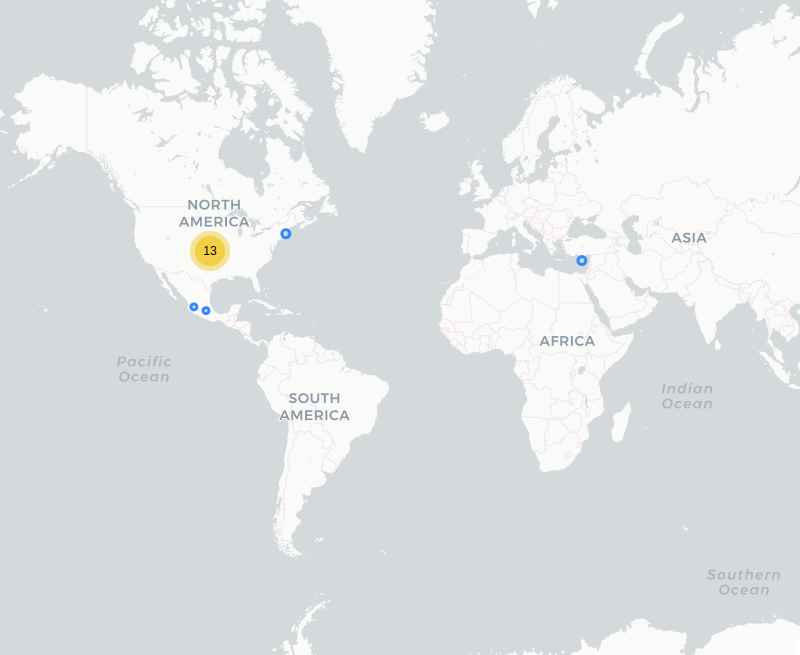

# Botón de Auxilio Jalisco

## Fecha de análisis

- **Análisis estático (mediante Exodus Privacy):** 12 abril 2022    
- **Análisis dinámico (mediante análisis de tráfico de red):** 12 abril 2022  
- **Análisis posteriores:** 9 agosto 2022 / 17 octubre 2022 / 23 octubre 2023

## Archivos analizados
[apk versión 94](http://cloud.datavoros.org/index.php/s/23wJc5E9QcMoNXy)   
[pcap versión 94](http://cloud.datavoros.org/index.php/s/Km2p6tCHFkkPMgx)

[apk versión 95](http://cloud.datavoros.org/index.php/s/qzfHWRKXTMBxDnn)   
[pcap versión 95](http://cloud.datavoros.org/index.php/s/qdJSGPot6KqbJz7)

[apk versión 96](http://cloud.datavoros.org/index.php/s/HW7YjLeYTPTjPmx)   
[pcap versión 96](http://cloud.datavoros.org/index.php/s/FLTBnHWgyetSWiK)   

[apk versión 105]
[pcap versión 105]

## Descripción de la aplicación

- **Tipo:** Aplicación de emergencia del estado de Jalisco   
- **Costo:** Gratuito   
- **Link:** [https://play.google.com/store/apps/details?id=com.jpriskcorp.botonpanicoapp.jal](https://play.google.com/store/apps/details?id=com.jpriskcorp.botonpanicoapp.jal)      
- **Descargas:** 50,000+  
- **Fecha de actualización:** 13 Enero 2022 / 16 Agosto 2022 / 2 octubre 2023
- **Versión:**  94 / 95 / 96 /105
- **Desarrollador:**  [https://c5jalisco.gob.mx/](https://c5jalisco.gob.mx/)  
- **Firma:**  riskcorp@yahoo.com.mx
- **Contacto:**  operativaceinco@gmail.com   
- **Condiciones de uso y Política de privacidad:**  
  - [https://fge.jalisco.gob.mx/content/terminos-y-politicas-boton-de-panico](https://fge.jalisco.gob.mx/content/terminos-y-politicas-boton-de-panico)  
  - **Wayback Machine**: [https://web.archive.org/web/20231023172144/https://fge.jalisco.gob.mx/content/terminos-y-politicas-boton-de-panico](https://web.archive.org/web/20231023172144/https://fge.jalisco.gob.mx/content/terminos-y-politicas-boton-de-panico)

- **Descripción en PlayStore**
~~~
El Botón de Auxilio Jalisco es una aplicación para smartphones del Estado de Jalisco que
permite que el usuario registrado pueda enviar una alerta inmediata al Centro de Coordinación,
Comando, Control, Comunicaciones, y Cómputo del Estado de Jalisco (Escudo Urbano C5 Jalisco).

La aplicación envía directamente la alerta al Escudo Urbano C5, en donde personal calificado recibe
el caso y efectúa todos los pasos establecidos para dar curso a la situación y resolver el problema
de manera rápida y efectiva.
~~~
~~Recuerde en casos de emergencia se sugiere llamar a la línea 9-1-1. En caso que esto no sea posible,
esta aplicación surge como una vía alternativa de contacto con las autoridades para denunciar un
caso de emergencia. Tan sólo presionando el botón de pánico sus datos previamente registrados en el
sistema y su geolocalización son enviadas automáticamente al Escudo Urbano C5.
Utiliza esta aplicación con responsabilidad.~~       

## Rastreadores identificados (mediante Exodus Privacy)

- ~~[Google Admob](https://admob.google.com/home/)~~
- ~~[Google Analytics](https://marketingplatform.google.com/about/analytics/)~~  
- ~~[Google Crashlytics](https://firebase.google.com/products/crashlytics/)~~
- ~~[Google Firebase Analytics](https://firebase.google.com/)~~
- ~~[Google Tag Manager](https://marketingplatform.google.com/about/tag-manager/)~~

** Desde la versión 95 ya no hay rastreadores y se mantiene así hasta la versión 105**   
Enlace a los reportes:    
- Versión 94 [reporte](https://reports.exodus-privacy.eu.org/es/reports/249402/)   
- Versión 95 [reporte](https://reports.exodus-privacy.eu.org/es/reports/280672/)    
- Versión 96 [reporte](https://reports.exodus-privacy.eu.org/es/reports/301588/)   
- Versión 105 [reporte](https://reports.exodus-privacy.eu.org/es/reports/394384/)   

## Empresas relacionadas con esta aplicación

- [Alphabet](https://abc.xyz/) a través de Google (Trackers y servicio de ubicación)(Trackers y ubicación)
- [Coeficiente comunicaciones](https://coeficientemx.com/) (Servidor donde está almacenada la aplicación)

## Permisos

- **Según la Playstore:** :no_entry_sign: 12 permisos --> 15 permisos.
- **Según Exodus Privacy:** :no_entry_sign: 15 permisos --> 14 permisos.
- **Según prueba de uso:** 5 permisos que se piden de manera explícita.

**Las secciones marcadas con :no_entry_sign: son secciones que ya no aplican porque cambiaron en una versión más reciente. Las mantenemos por objetividad en la documentación*

### Permisos según la PlayStore

Esta aplicación puede acceder a:   

- 
Contactos

    - Consultar tus contactos

- 
Ubicación

    - Ubicación aproximada (basada en red)
    - Ubicación precisa (basada en red y GPS)

- 
Teléfono

    - Llamar directamente a números de teléfono
    - Consultar la identidad y el estado del teléfono

- 
Fotos/multimedia/archivos

    - Leer el contenido de tu almacenamiento USB
    - :no_entry_sign: Modificar o eliminar contenido del almacenamiento USB

- 
Almacenamiento

    - Leer el contenido de tu almacenamiento USB
    - Modificar o eliminar contenido del almacenamiento USB

- 
ID de dispositivo e información de llamada

    - Consultar la identidad y el estado del teléfono

- ❔ Otro

    - :no_entry_sign: Recibir datos de Internet
    - Ver conexiones de red
    - Acceso completo a red
    - Mostrar sobre otras aplicaciones 
    - Controlar la vibración
    - Impedir que el dispositivo entre en modo de suspensión
    - Leer la configuración de los servicios de Google

### Permisos según Exodus Privacy

- :exclamation:
ACCESS_COARSE_LOCATION   
_Access approximate location (network-based)_

- :exclamation:
ACCESS_FINE_LOCATION   
_Access precise location (GPS and network-based)_

- ACCESS_NETWORK_STATE   
_View network connections_

- :exclamation:
CALL_PHONE   
_Directly call phone numbers_

- FOREGROUND_SERVICE   
_Run foreground service_

- INTERNET   
_Have full network access_

- :exclamation:
READ_CONTACTS   
_Read your contacts_

- :exclamation:
READ_PHONE_STATE   
_Read phone status and identity_

- :exclamation:SYSTEM_ALERT_WINDOW
_This app can appear on top of other apps_ **(Este es un nuevo permiso necesario para una nueva función)**

- VIBRATE   
_Control vibration_

- WAKE_LOCK   
_Prevent phone from sleeping_

- :exclamation:
WRITE_EXTERNAL_STORAGE   
_Modify or delete the contents of your SD card_

- :no_entry_sign: RECEIVE

- READ_GSERVICES   

- :no_entry_sign: C2D_MESSAGE 

- MAPS_RECEIVE   

El icono :exclamation: indica un nivel 'Peligroso' o 'Especial' de acuerdo a los [niveles de protección de Google](https://developer.android.com/guide/topics/permissions/overview).

### Permisos solicitados durante el uso de la aplicación

- 🔴 Acceso a Ubicación
- :large_blue_circle: Acceso a Contactos 
- :large_blue_circle: Acceso a Llamadas 
- 🔴 Acceso a Almacenamiento 
- 🔴 Acceso a Estado del Teléfono 

🔴 Este ícono indica un permiso obligatorio

## Datos

### Datos solicitados al usuario durante el uso

- :red_circle: Nombre
- :red_circle: Apellido Paterno
- :large_blue_circle: Apellido Materno
- :red_circle: Correo electrónico
- :red_circle: Número de teléfono
- :red_circle: Número de contacto
- :large_blure_circle: ~~Dirección~~
- :large_blue_circle: Riesgos 
- :large_blue_circle: Padecimientos
- :large_blue_circle: ~~Si se es sordo o no~~
- :large_blue_circle: Tipo de usuario ~~(Incluye: particular, transporte público, transporte privado, escuela, tienda de conveniencia, nave industrial, otro).~~
- :large_blue_cirlce: ~~Puesto en caso de haber seleccionado alguna empresa en la pregunta anterior.~~

**Notas de la actualización 105**: 
- Se pueden registrar dos tipos de personas usuarias, particulares y ganaderos. 
- Se tiene que aceptar de manera directa los Términos de uso antes de poder registrarse
- Se tiene que aceptar de manera directa el Aviso de privacidad antes de poder registrarse. Este es distinto dentro de la aplicación que el que aparece en la página de la PlayStore.
- Se tiene que aceptar de manera directa la Carta de consentimiento tratamiento de datos personales sensibles y de terceros.
- Ahora existe el campo "Riesgos" que es libre a rellenar por la persona usuaria separado del campo "Padecimientos" que incluye los siguientes:
    - Ninguno
    - Sordo(a)
    - Mudo(a)
    - Sordomudo(a)
    - Otro
- Ahora se pueden editar los datos de la cuenta y en estos se puede agregar tipo de usuario, que ahora es una campo libre y no un despegable de lista.

🔴 Este ícono indica que se debe ingresar este dato de manera obligatoria.   
⚪ Este ícono indica que estos datos son opcionales.

### Tabla de conexiones realizadas durante el uso de la aplicación

| Dirección IP    | Número de paquetes | País          | Ciudad  | Número AS | Organización AS                     |
|-----------------|--------------------|---------------|---------|-----------|-------------------------------------|
| 131.196.248.8   |                140 | México        | Zapopan |    265524 | COEFICIENTE COMUNICACIONES SA DE CV |
| 142.250.68.42   |                 62 | United States |         |     15169 | GOOGLE                              |
| 142.250.68.74   |                 76 | United States |         |     15169 | GOOGLE                              |
| 142.250.72.174  |                858 | United States |         |     15169 | GOOGLE                              |
| 142.250.101.188 |                  2 | United States |         |     15169 | GOOGLE                              |
| 142.250.141.188 |                 36 | United States |         |     15169 | GOOGLE                              |
| 142.250.176.3   |                 23 | United States |         |     15169 | GOOGLE                              |
| 142.250.176.4   |                 80 | United States |         |     15169 | GOOGLE                              |
| 142.250.188.234 |                 27 | United States |         |     15169 | GOOGLE                              |
| 142.250.189.10  |                 39 | United States |         |     15169 | GOOGLE                              |
| 142.251.40.35   |                 23 | United States |         |     15169 | GOOGLE                              |
| 142.251.40.42   |               1066 | United States |         |     15169 | GOOGLE                              |
| 142.251.40.46   |                  3 | United States |         |     15169 | GOOGLE                              |
| 172.217.14.74   |                 33 | United States |         |     15169 | GOOGLE                              |

### 

### Notas sobre datos recolectados

- :no_entry_sign: El servidor de Coeficiente Comunicaciones es el _Host_ de la app. Los datos de las llamadas de emergencia hechos a través de los botones de auxilio se mandan en texto plano. También los datos de registro del usuario mencionados en la sección "Datos solicitados al usuario durante el uso" son enviados en texto plano (http sin cifrar). 

- :no_entry_sign: La aplicación contacta a los servidores de Google por dos razones: los mapas y la geolocalización y por los trackers de Firebase, Analytics, Crashlytics, Tag Manager y Admob. Firebase recolecta toda una serie de eventos realizados en la aplicación. Aquí los enlaces a todos los eventos y datos que, de manera estándar se recolectan [1](https://support.google.com/firebase/answer/9234069?hl=en&ref_topic=6317484&visit_id=637859685880636053-1936242821&rd=1), [2](https://support.google.com/firebase/answer/9268042?hl=en&ref_topic=6317484&visit_id=637859685880636053-1936242821&rd=1), [3](https://support.google.com/firebase/answer/7029846?hl=en&ref_topic=7029512).

- :no_entry_sign: Los trackers [Crashlytics](https://firebase.google.com/docs/crashlytics) y [Analytics](https://firebase.google.com/docs/analytics) son dos subtrackers de Firebase. El primero tiene la función de mejorar la aplicación al mandar reportes de cierres inesperados de la aplicación, el segundo otorga información sobre su uso, lo que no necesariamente es malo. Sin embargo AdMob es un tracker para mostrar banners de publicidad dentro de la aplicación mientras que TagManager es un tracker que permite etiquetar secciones de código.

## Tabla de relación entre permisos y funciones

| Permisos   | Función relacionada  |
|---|---|
| ACCESS_COARSE_LOCATION  | Servicio de ubicación  |
| ACCESS_FINE_LOCATION  | Servicio de ubicación  |
| ACCESS_NETWORK_STATE  | Internet  |
| CALL_PHONE  | Llamadas 911 |
| FOREGROUND_SERVICE  | Botón de pánico  |
| INTERNET  | Internet  |
| READ_CONTACTS  | Agregar contactos de emergencia  |
| READ_PHONE_STATE  | Llamada 911  |
| VIBRATE  | Botón de pánico  |
| WAKE_LOCK  | Botón de pánico    |
| SYSTEM_ALERT_WINDOW | Función de Acceso rápido |
| WRITE_EXTERNAL_STORAGE  | No sabemos para qué lo necesita  |
| :no_entry_sign:RECEIVE  | Push notifications |
| READ_GSERVICES  | Servicio de ubicación  |
| :no_entry_sign:C2D_MESSAGE  | Push Notifications  |
| MAPS_RECEIVE  | Permiso innecesario  |

### Funciones específicas de la aplicación

- Tiene un botón "Prueba de Servicio" que permite verificar que todo funciona sin que se haga una llamada o notificación real de emergencia.
- Incluye Auxilio Ciudadano (Policía); Bomberos; Médicos y llamada directa a 911.
- Incluye botón de acceso rápido (3 toques seguidos del botón de apagado o bloqueo). Con esto, según la documentación, se hace un aviso de emergencia de manera automática. Como la prueba se hizo fuera de Jalisco, no pudimos probar esta funcionalidad. Esta función, en la nueva versión está implementada de una manera distinta. 
- Permite modificar los datos, la contraseña y darse de baja de la cuenta.

## Notas

- La aplicación no funciona si no se le concede el permiso de ubicación precisa.
- La aplicación no funciona si no se tienen datos y una tarjeta SIM en el celular. Con WiFi no funciona. 
- :no_entry_sign: No logramos darnos de baja. Decía que el teléfono o la contraseña estaban mal.

## Conclusiones

- :exlamation: ~~La cantidad de trackers presentes es demasiada. En particular la presencia de AdMob, que sirve para mostrar anuncios, no se explica.~~
- :exclamation: ~~Como las llamadas al servidor de Coeficiente Comunicaciones no están cifradas, tenemos un serio problema de seguridad, ya que los datos de perfil del usuario, y las llamadas de emergencia hechas por los botones de pánico, están en texto plano. También nos hace preguntarnos si los datos de los usuarios en el servidor están cifrados.~~
- Nos queda la duda si, al darse un usuario de baja, los datos de dicho usuario se quedan o no almacenados. En todo caso, es la única aplicación analizada que hasta ahora tiene esa función.
- La relación entre permisos y funciones es relativamente simétrica. Fuera de _maps_receive_ que ya no es un permiso necesario para Google maps desde la versión 3.1.59 de Google Services, nos queda la duda la utilidad del permiso _write_external_storage_

## Adenda actualización versión 95

- La nueva versión tiene algunos cambios en la interfaz. Según la bitácora de cambios de la PlayStore, lo que cambiaron fue esto:
    - Nueva imagen
    - Botón para elegir el tipo de alerta (Seguridad, bomberos, médica). Eso ya estaba en la versión anterior.
    - Términos y condiciones
    - Las personas sordas podrán enviar mensajes de texto 
- Volvimos a comprobar, con la actualización para ver si las llamadas al servidor de Coeficiente Comunicaciones siguen sin estar cifradas y, en efecto, así fue.
- En la nueva versión ya no hay ningún tracker.
- En esta versión la función darse de baja no funcionó.

## Adenda actualización 96

- Después de haberles mencionado el problema de seguridad sobre los datos no cifrados, actualizaron la aplicación a esta versión y ahora ya están cifrados. 
- La función para darse de baja ya sirvió.

## Adenda actualización 105

- La aplicación manda un código de activación a la hora de registrarse al correo electrónico proporcionado. Si se pone mal, manda un mensaje de que hay problemas con la conexión a Internet.
- El acceso al permiso de contactos es sólo necesario si se quieren agregar nuevos contactos además del necesario para el registro.
- El acceso al permiso de  llamadas es sólo necesario si se quiere hacer una llamada directa a 911.
- Pudimos darnos de baja del servicio. 
- :exclamation: Esta aplicación dejará de funcionar el 2 de noviembre de 2023 y ahora hay una nueva [Botón de Auxilio Escudo Urbano](https://play.google.com/store/apps/details?id=com.c5.boton_auxilio_jalisco_flutter&hl=en_US) que la suplirá. En las aplicaciones analizadas del 25N se encuentra esta nueva aplicación. 
- Las lamadas al servidor dns están cifradas.

**Tabla de conexiones**
| Dirección     | País          | Ciudad  | Número AS | Organización AS          | Rastreador o dominio contactado |
|---------------|---------------|---------|-----------|--------------------------|---------------------------------|
| 142.251.34.36 | United States | Queens  |     15169 | GOOGLE                   | www.google.com                  |
| 142.251.34.46 | United States | Queens  |     15169 | GOOGLE                   | clients4.google.com             |
| 177.240.2.242 | Mexico        | Zapopan |    262916 | Mega Cable, S.A. de C.V. | botondepanico.jalisco.gob.mx    |

**Notas**: Originalmente la aplicación estaba guardada en los servidores de Coeficiente Comunicaciones, ahora es en Megacable. 