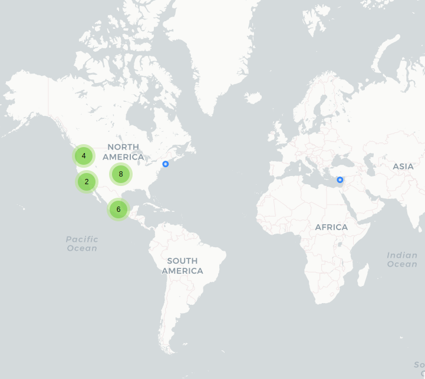
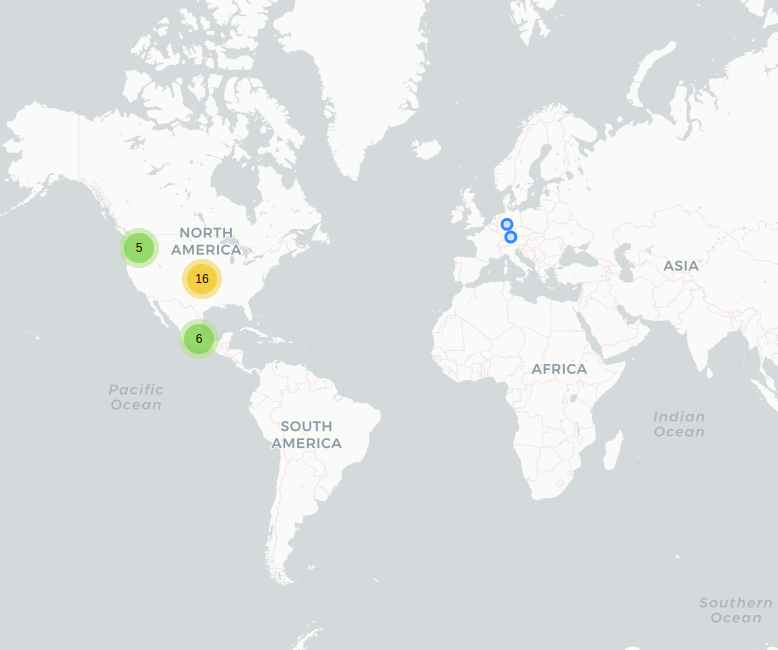

# Mi policía

## Fechas de análisis

- **Análisis estático (mediante Exodus Privacy):** 11 abril 2022
- **Análisis dinámico (mediante análisis de tráfico de red):** 12 abril 2022
- **Análisis Posteriores:** 9 agosto 2022 / 30 agosto 2022 / 17 octubre 2022 / 17 noviembre 2022

## Archivos analizados 
[apk versión 3.0.2](http://cloud.datavoros.org/index.php/s/iT7P3xBjdYsBdZp)   
[pcap versión 3.0.2](http://cloud.datavoros.org/index.php/s/7LGFgjSK7ABYzFy)

[apk versión 3.0.8](http://cloud.datavoros.org/index.php/s/Nj2XoTYcfzoiSYT)   
[pcap versión 3.0.8](http://cloud.datavoros.org/index.php/s/4sCexFkbQ9CSrzw)

[apk versión 3.0.9](http://cloud.datavoros.org/index.php/s/aiycwFjzy733jHR)   
[pcap versión 3.0.9](http://cloud.datavoros.org/index.php/s/kbXc2JsA9nxbY4b)

[apk versión 3.0.10](http://cloud.datavoros.org/index.php/s/FHa2mwGNEfS5ynS)   
[pcap versión 3.0.10](http://cloud.datavoros.org/index.php/s/5GWHc2AT5gC2dLE)

[apk versión 3.0.13](http://cloud.datavoros.org/index.php/s/Dc9n9zCFXwZqSLm)   
[pcap versión 3.0.13](http://cloud.datavoros.org/index.php/s/KyknSfdjcjs9xrq)   


## Descripción de la aplicación

- **Tipo:** Aplicación de emergencias de la CDMX   
- **Costo:** Gratuito   
- **Link de descarga:** [https://play.google.com/store/apps/details?id=com.moobky.MiPolicia](https://play.google.com/store/apps/details?id=com.moobky.MiPolicia)
- **Descargas:** 500,000+
- **Ultima fecha de actualización:** 8 septiembre 2022
- **Versión:** 3.0.2 / 3.0.8 / 3.0.10 / 3.0.13
- **Desarrollador:** [https://www.ssc.cdmx.gob.mx/](https://www.ssc.cdmx.gob.mx/)
- **Firma:** Saul Espinosa Ruiz
- **Contacto:** mipolicia@ssp.df.gob.mx
- **Condiciones de uso y Política de privacidad:**
    - [https://www.ssc.cdmx.gob.mx/ciudadania/mi-policia/condiciones-de-uso-y-aviso-de-privacidad](https://www.ssc.cdmx.gob.mx/ciudadania/mi-policia/condiciones-de-uso-y-aviso-de-privacidad)

- **Descripción en PlayStore:**
```
La Policía de la Ciudad de México, ofrece una estrategia operativa, denominada
“Cuadrantes”, orientada a lograr una mayor eficiencia del personal y cercanía
con los ciudadanos, y que representa al mismo tiempo la fase final en el proceso
de reestructuración integral.
Es así cómo se crea "Mi Policía", aplicación que acerca al ciudadano de manera
interactiva a la información de su respectivo Cuadrante, proporcionando una manera
rápida de hacer un llamado en caso de emergencia y conocer gráficamente la
ubicación de los Cuadrantes de la Ciudad de México.

Novedades:
La aplicación Mi Policía es una herramienta tecnológica diseñada, pensada y creada por    
la Secretaría de Seguridad Ciudadana de la Ciudad de México, con una interfaz de fácil uso,    
logrando mediante la implementación de las nuevas tecnologías, crear un vínculo y acercamiento    
entre la ciudadanía y la policía de proximidad de la Ciudad de México.    
Modulos nuevos:(PT, PC, Z. Wifi, Rev. Proximidad) Favor de mantener    
actualizada la aplicación para poder utilizar los servicios que ofrece App Mi policía
```

## Trackers identificados (mediante Exodus Privacy)

- **Esta aplicación no contiene trackers.**

Enlace al [reporte](https://reports.exodus-privacy.eu.org/es/reports/com.moobky.MiPolicia/latest/)   

## Empresas relacionadas con esta aplicación

- [Alphabet](https://abc.xyz/) a través de Google (Se envía información necesaria para el funcionamiento de la app, un ejemplo son conexiones a Playstore Google Services)
- Uninet ([Telmex](https://telmex.com/)) (Servidor donde está albergada documentación de la app)
- [Operbes](https://mx.linkedin.com/company/operbes-s.a.-de-c.v.) (Se usa para hacer las *Denuncias ciudadanas*)
- [Amazon](https://www.aboutamazon.com/) (Tiene los servdiores para la empresa de localización Here) 
- [Here](https://www.here.com/) (Servicio de ubicación)
- [Akamai](https://www.akamai.com/es) (Se extraen visuales para los mapas)


## Permisos   

- **Según la Playstore:** 12 permisos.
- **Según Exodus Privacy:** 9 permisos.
- **Según prueba de uso:** 3 permisos que se piden de manera explícita.


### Permisos según la PlayStore   

- 
Ubicación
    - Ubicación aproximada (según la red)
    - Ubicación precisa (según el GPS y la red)
- 
Fotos/datos multimedia/archivos
    - Modificar o eliminar el contenido del almacenamiento USB
    - Leer el contenido de tu almacenamiento USB
- 
Almacenamiento
    - Modificar o eliminar el contenido de tu almacenamiento USB
    - Leer el contenido del dispositivo USB
- 
Cámara
    - Realizar fotografías y grabar videos
- 
Teléfono
    - Llamar directamente a números de teléfono


- ❔Otro
    - Emparejar con dispositivos Bluetooth
    - Ver conexiones de red
    - Controlar linterna
    - Acceso completo a la red

### Permisos según Exodus Privacy

- ACCESS_BACKGROUND_LOCATION
- :exclamation:
ACCESS_COARSE_LOCATION
    - *Access approximate location (network-based)*
- :exclamation:
ACCESS_FINE_LOCATION   
    - *Access precise location (GPS and network-based)*
- ACCESS_NETWORK_STATE
    - *View network connections*
- :exclamation:
CALL_PHONE
    - *Directly call phone numbers*
- :exclamation:
CAMERA
    - *Take pictures and videos*
- FLASHLIGHT
- FOREGROUND_SERVICE
    - *Run foreground service*
- INTERNET
    - *Have full network access*

El icono :exclamation: indica un nivel 'Peligroso' o 'Especial' de acuerdo a los [niveles de protección de Google](https://developer.android.com/guide/topics/permissions/overview).

### Permisos solicitados durante el uso de la aplicación

- 🔴 Acceso ubicación (para la función botón de pánico)
- 🔵 Acceso a llamadas telefónicas (para realizar llamadas desde la aplicación)
- 🔵 Acceso a cámara (para escanear el número de placa del policía)
- *Puede acceder a Whatsapp para la *Sección Policía Turística. Aunque esto como tal no es un permiso*

🔴 Este ícono indica un permiso obligatorio   
🔵 Este ícono indica un permiso opcional pero se pierde una funcionalidad particular

## Datos

### Datos solicitados al usuario durante el uso de la aplicación

- ⚪ Para los reportes de Asistencia ciudadana:
    - 🔴 Nombre 
    - ⚪ Apellido
    - 🔴 Número de contacto 
    - ⚪ Correo Electrónico
    - 🔴 Dirección 
    

🔴 Este ícono indica que se debe ingresar este dato de manera obligatoria.   
⚪ Este ícono indica que estos datos son opcionales.


### Tabla de conexiones realizadas durante el uso de la aplicación

| Dirección IP    | Número de Paquetes | País          | Ciudad/Zona | Número AS | Organización AS       |
|-----------------|--------------------|---------------|-------------|-----------|-----------------------|
| 52.36.74.154    |                 25 | United States | Boardman    |     16509 | AMAZON-02             |
| 52.38.74.42     |                  6 | United States | Boardman    |     16509 | AMAZON-02             |
| 52.88.155.1     |                 22 | United States | Boardman    |     16509 | AMAZON-02             |
| 52.89.181.193   |                 19 | United States | Boardman    |     16509 | AMAZON-02             |
| 104.110.129.127 |                 25 | United States | Los Angeles |     16625 | AKAMAI-AS             |
| 142.250.72.138  |                 20 | United States |             |     15169 | GOOGLE                |
| 142.250.101.188 |                  8 | United States |             |     15169 | GOOGLE                |
| 142.250.188.227 |                 15 | United States |             |     15169 | GOOGLE                |
| 142.250.189.10  |                 38 | United States |             |     15169 | GOOGLE                |
| 142.250.207.67  |                 27 | United States |             |     15169 | GOOGLE                |
| 142.250.217.138 |                 44 | United States |             |     15169 | GOOGLE                |
| 172.217.14.78   |               2809 | United States |             |     15169 | GOOGLE                |
| 172.217.14.110  |                 13 | United States |             |     15169 | GOOGLE                |
| 189.240.234.174 |              15858 | México        | CDMX        |      8151 | Uninet S.A. de C.V.   |
| 201.140.100.130 |                145 | México        | Tepic       |     18734 | Operbes, S.A. de C.V. |
| 201.140.100.131 |                 52 | México        | Tepic       |     18734 | Operbes, S.A. de C.V. |
| 201.140.100.136 |                 82 | México        | Tepic       |     18734 | Operbes, S.A. de C.V. |
| 201.140.100.138 |                 20 | México        | Tepic       |     18734 | Operbes, S.A. de C.V. |
| 216.239.32.3    |                 17 | United States |             |     15169 | GOOGLE                |

### 


### Notas sobre datos recolectados

- Los servidores de Amazon contactados, son _Host_ de una empresa llamada [Here](https://www.here.com/). Esta empresa, entre otras cosas, desarrolla una API que permite buscar lugares y dar información al respecto. En esta app eso es usado para la función *Localizar tu cuadrante*. Por la [documentación pública](https://developer.here.com/documentation/geocoder/dev_guide/topics/example-reverse-geocoding.html), sabemos que este servicio recolecta:
    - País
    - Estado
    - Ciudad
    - Distrito
    - Calle
    - Código postal
    - Coordenadas exactas de localización
- Los servidores de Google contactados son necesarios para el funcionamiento de la aplicación. Recopilan información mínima y básica de funcionamiento.
- Los servidores de Operbes se corresponden con la funcionalidad de búsqueda de policias y sus placas y empresas privadas. Además con el corralón.
- En los servidores de Uninet están guardados tanto el vídeo del alcoholímetro, como el PDF con el reglamento de tránsito. :no_entry_sign: Se usa además para la denuncia ciudadana. Es el servidor de la Secretaría de Seguridad Ciudadana.
- El servidor de Akamai está directamente relacionado con el servicio de Here, y de ahí se extraen íconos y visuales.

**Las secciones marcadas con :no_entry_sign: son secciones que ya no aplican porque cambiaron en una versión más reciente. Las mantenemos por objetividad en la documentación*

### Seguridad de datos de la PlayStore

**No se comparten datos con terceros**
- El desarrollador indica que esta aplicación no comparte datos de usuario con otras empresas u organizaciones.

**No se recogen datos**
- El desarrollador indica que esta aplicación no recoge datos de usuario

**Prácticas de seguridad:**
- Los datos se cifran en tránsito
- Puedes solicitar que se eliminen los datos

## Tabla de relación entre permisos y funciones

| Permisos  | Funciones relacionadas  |
|---|---|
| ACCESS_BACKGROUND_LOCATION  | Servicio de ubicación  |
| ACCESS_COARSE_LOCATION  | Servicio de ubicación  |
| ACCESS_FINE_LOCATION  | Servicio de ubicación  |
| CALL_PHONE  | Llamadas a los diferentes servicios (policía turística, cuentahabientes, etc.)   |
| CAMERA  | Escaneo de placa policial  |
| FLASHLIGHT  | Escaneo de placa policial  |
| FOREGROUND_SERVICE  | Botón de pánico  |
| INTERNET  | Internet  |

### Funciones específicas de la aplicación

- Escaneo de placa de un policía para ver si tiene derecho a levantar infracciones de tránsito
- Revisar por nombre o número de placa si un policía tiene el derecho a levantar infracciones de tránsito
- Video explicativo sobre el funcionamiento del Alcoholímetro e información general
- Denuncias de *Asistencia Ciudadana*
- Contacto con policía turística
- PDF con el reglamento de tránsito
- Se puede revisar si un vehículo se encuentra en el corralón
- Se puede comprobar si una empresa de Seguridad Privada está inscrita en el padrón de la CDMX
- Acompañamiento a cuentahabientes
- Buscar el cuadrante policial que le corresponde a uno según la dirección ingresada
- Teléfono a la unidad de contacto del Secretario de Seguridad Pública de la CDMX
- Denuncia con la Policía Cibernética
- Zonas de Wifi gratuito proporcionado por la CDMX
- Revista "Proximidad"

## Notas
- :no_entry_sign: La función de denuncia ciudadana no funcionó.
- No hemos probado el escáner de placa policial en vivo.
- La opción *Agenda de movilizaciones* descarga un PDF con la información del día.
- Mientras la app está en uso, está activado el acceso a la ubicación en segundo plano.

## Conclusiones

- Aplaudimos que sea la única aplicación analizada que no contiene trackers.
- La relación entre permisos y funciones es exacta y tiene, en general pocos permisos en comparación con las funciones que tiene. Lo que nos hace creer que la implementación de los desarrolladores es particularmente buena en comparación con las otras aplicaciones.
- Los permisos de la PlayStore tienen una correlación directa con los encontrados por Exodus Privacy.

## Adenda actualización versión 308-309

- En el análisis dinámico aparecen ahora conexiones a servidores de Microsoft, Twitter y As Choopa y Fastly. Ya no aparecen conexiones a Akamai. (Mostramos aquí la tabla de conexiones de la actualización 309)

| Dirección IP    | Número de Paquetes | País          | Ciudad/Zona           | Número AS | Organización AS             |
|-----------------|--------------------|---------------|-----------------------|-----------|-----------------------------|
| 35.160.76.3     |                  8 | United States | Boardman              |     16509 | AMAZON-02                   |
|  35.161.108.207 |                 56 | United States | Boardman              |     16509 | AMAZON-02                   |
| 44.240.85.186   |                 66 | United States | Boardman              |     16509 | AMAZON-02                   |
| 45.77.78.214    |                  3 | United States | Piscataway            |     20473 | AS-CHOOPA                   |
| 52.36.30.136    |                 24 | United States | Boardman              |     16509 | AMAZON-02                   |
| 52.41.30.231    |                 52 | United States | Boardman              |     16509 | AMAZON-02                   |
| 52.239.169.4    |                 29 | United States | Tappahannock          |      8075 | MICROSOFT-CORP-MSN-AS-BLOCK |
|  54.184.158.119 |                 22 | United States | Boardman              |     16509 | AMAZON-02                   |
| 65.9.149.11     |                 36 | United States |                       |     16509 | AMAZON-02                   |
| 65.9.149.16     |                 58 | United States |                       |     16509 | AMAZON-02                   |
| 65.9.149.20     |                  6 | United States |                       |     16509 | AMAZON-02                   |
| 104.244.42.1    |                 45 | United States |                       |     13414 | TWITTER                     |
| 104.244.42.67   |                 28 | United States |                       |     13414 | TWITTER                     |
| 104.244.42.129  |                 43 | United States |                       |     13414 | TWITTER                     |
| 104.244.42.131  |                 27 | United States |                       |     13414 | TWITTER                     |
| 108.61.191.133  |                 66 | United States | Piscataway            |     20473 | AS-CHOOPA                   |
| 142.250.65.110  |               1565 | United States |                       |     15169 | GOOGLE                      |
| 142.250.65.132  |                 30 | United States |                       |     15169 | GOOGLE                      |
| 142.250.65.138  |                 42 | United States |                       |     15169 | GOOGLE                      |
| 142.250.113.188 |                  4 | United States |                       |     15169 | GOOGLE                      |
| 142.251.33.234  |                 41 | United States |                       |     15169 | GOOGLE                      |
| 142.251.34.13   |                 26 | United States |                       |     15169 | GOOGLE                      |
| 142.251.34.14   |                351 | United States |                       |     15169 | GOOGLE                      |
| 142.251.34.46   |                 62 | United States |                       |     15169 | GOOGLE                      |
| 142.251.34.206  |               1298 | United States |                       |     15169 | GOOGLE                      |
| 142.251.34.234  |                852 | United States |                       |     15169 | GOOGLE                      |
| 142.251.35.10   |                 29 | United States |                       |     15169 | GOOGLE                      |
| 146.75.104.159  |                 80 | United States |                       |     54113 | FASTLY                      |
| 172.217.2.131   |                  6 | United States |                       |     15169 | GOOGLE                      |
| 172.217.2.138   |                  3 | United States |                       |     15169 | GOOGLE                      |
| 172.217.3.131   |                 63 | United States |                       |     15169 | GOOGLE                      |
| 172.217.3.142   |                  4 | United States |                       |     15169 | GOOGLE                      |
| 172.217.4.174   |                 16 | United States |                       |     15169 | GOOGLE                      |
| 189.240.234.174 |              21245 | Mexico        | Gustavo Adolfo Madero |      8151 | Uninet S.A. de C.V.         |
| 201.140.100.130 |                 91 | Mexico        | Chalco                |     18734 | Operbes, S.A. de C.V.       |
| 201.140.100.131 |                 77 | Mexico        | Chalco                |     18734 | Operbes, S.A. de C.V.       |
| 201.140.100.136 |                 34 | Mexico        | Chalco                |     18734 | Operbes, S.A. de C.V.       |
| 201.140.100.154 |                 91 | Mexico        | Chalco                |     18734 | Operbes, S.A. de C.V.       |
| 201.140.100.160 |                258 | Mexico        | Chalco                |     18734 | Operbes, S.A. de C.V.       |

## 
- Las denuncias ciudadanas ahora tienen opción de agregar los siguientes datos que son obligatorios para poder mandarla:
    - Dirección
    - Tipo de denuncia
    - Institución
- Nuevo módulo de Policía de ciberseguridad que incluye denuncias por teléfono, presenciales, por mail y telefónicas. Además incluye información de interés.
- Nuevo módulo de zonas wifi gratuitas de la CDMX.
- Nuevo módulo para descargar la Revista de proximidad.
- Agregamos la sección de Seguridad de datos que ahora aparece en la PlayStore.

### Adenda actualización 3010

- Desaparecieron las conexiones a Twitter.
- Las conexiones a los servidores de Operbes esta vez no están cifrados. En particular, los datos de la función Denuncia Ciudadana, que contienen información personal del usuario están en texto plano. Esto es un problema mayúsculo de seguridad.
- Para hacer la Denuncia Ciudadana es obligatoria la Dirección.

| Dirección       | Número de paquetes | País          | Ciudad                | Número AS | Organización AS       |
|-----------------|--------------------|---------------|-----------------------|-----------|-----------------------|
|  34.215.112.171 |                 58 | United States | Boardman              |     16509 | AMAZON-02             |
|  35.160.123.136 |                 68 | United States | Boardman              |     16509 | AMAZON-02             |
|  35.161.108.207 |                 27 | United States | Boardman              |     16509 | AMAZON-02             |
| 50.112.162.72   |                  6 | United States | Boardman              |     16509 | AMAZON-02             |
| 52.36.30.136    |                 30 | United States | Boardman              |     16509 | AMAZON-02             |
| 65.9.149.11     |                 15 | United States |                       |     16509 | AMAZON-02             |
| 65.9.149.16     |                 72 | United States |                       |     16509 | AMAZON-02             |
| 142.250.65.131  |                 11 | United States |                       |     15169 | GOOGLE                |
| 142.250.115.188 |                  4 | United States |                       |     15169 | GOOGLE                |
| 142.251.33.238  |                185 | United States |                       |     15169 | GOOGLE                |
| 142.251.34.46   |                107 | United States |                       |     15169 | GOOGLE                |
| 142.251.34.138  |                 43 | United States |                       |     15169 | GOOGLE                |
| 142.251.34.142  |                144 | United States |                       |     15169 | GOOGLE                |
| 142.251.34.163  |                 26 | United States |                       |     15169 | GOOGLE                |
| 142.251.34.202  |                 48 | United States |                       |     15169 | GOOGLE                |
| 142.251.34.206  |                887 | United States |                       |     15169 | GOOGLE                |
| 142.251.34.238  |                 11 | United States |                       |     15169 | GOOGLE                |
| 142.251.35.10   |                 21 | United States |                       |     15169 | GOOGLE                |
| 172.217.3.138   |                 43 | United States |                       |     15169 | GOOGLE                |
| 172.217.168.227 |                  4 | United States |                       |     15169 | GOOGLE                |
| 189.240.234.174 |               2097 | Mexico        | Gustavo Adolfo Madero |      8151 | Uninet S.A. de C.V.   |
| 201.140.100.130 |                183 | Mexico        | Chalco                |     18734 | Operbes, S.A. de C.V. |
| 201.140.100.131 |                 70 | Mexico        | Chalco                |     18734 | Operbes, S.A. de C.V. |
| 201.140.100.136 |                 22 | Mexico        | Chalco                |     18734 | Operbes, S.A. de C.V. |
| 201.140.100.154 |                141 | Mexico        | Chalco                |     18734 | Operbes, S.A. de C.V. |
| 201.140.100.160 |               5582 | Mexico        | Chalco                |     18734 | Operbes, S.A. de C.V. |

## 

### Adenda actualización 3.0.13
- Después de notificarles del problema de cifrado de datos en la versión 3.0.10, arreglaron ese problema. 