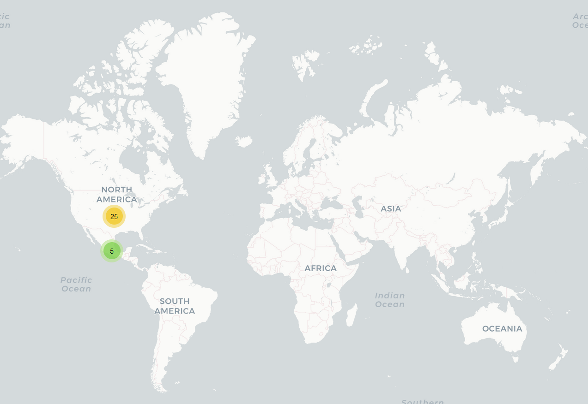

# Alerta Veracruz Mujer

## Fechas de análisis

- **Análisis estático (mediante Exodus Privacy/MobFS):** 13/03/2023 
- **Análisis dinámico (mediante análisis de tráfico de red):** 13/03/2023
- **Análisis Posteriores:** 

## Archivos analizados
- [Apk versión 1.79](https://cloud.datavoros.org/index.php/s/DsMzcMdpJxtj8bS)
- [Pcap versión 1.79](https://cloud.datavoros.org/index.php/s/Sz49TpWeMAY3bR3)

## Descripción de la aplicación
- **Tipo:** Botón de pánico   
- **Costo:** Gratis   
- **Enlace de descarga:** https://play.google.com/store/apps/details?id=com.artech.nuevoalerta.alertamujer&hl=es 
- **Descargas:** 50,000+
- **Ultima fecha de actualización:** 10/09/2021
- **Versión:** 1.79
- **Desarrollador:** http://www.veracruz.gob.mx/seguridad
- **Firma:** Armtech Consultores --> [GeneXus](https://www.genexus.com/es/)
- **Contacto:** appveracruz@sspver.gob.mx
- **Condiciones de uso y Política de privacidad:** https://alertagenero.sspver.gob.mx/alerta/avisoprivacidadmujeralerta.pdf   
Wayback Machine: https://web.archive.org/web/20230314140705/https://alertagenero.sspver.gob.mx/alerta/avisoprivacidadmujeralerta.pdf
    
- **Descripción en PlayStore:**
~~~
Veracruz Mujer Alerta es una aplicación móvil del Gobierno del Estado de Veracruz en coordinación con la Secretaría de Seguridad Pública, dirigida a todas las mujeres veracruzanas para brindar asesoría y asistencia con base a la Declaratoria Alerta de Violencia de Género establecida en la actualidad, cuya finalidad es:

1. Identificar los Tipos y modalidades de la violencia contra la mujer.
2. Ubicar los lugares a los cuales se puede recurrir para su asesoría y denunciar estos actos en tu municipio.
3. Botón para generar una alerta cuando se encuentre en situación de violencia, estará enlazada con el Centro Estatal de Control, Comando, Comunicaciones y Cómputo (C4), quienes atenderán la situación y ubicación para procesar en tiempo y forma el apoyo de las alertas que sean emitidas.

Para el uso de esta aplicación se requieren conexión a datos móviles y geolocalización.

Trabajamos para una vida libre de violencia de género.
~~~

## Rastreadores identificados (mediante Exodus Privacy)
- No hay rastreadores identificados

Enlace al [reporte](https://reports.exodus-privacy.eu.org/es/reports/338596/) de Exodus Privacy   

## Empresas relacionadas con esta aplicación:
- [GeneXus](https://www.genexus.com/es/) --> Artech Consultores. Desarrolladores de la aplicación
- [Alphabet](https://abc.xyz/) --> Google --> Sistema Android
- [Qualcomm](https://www.qualcomm.com/home) --> [Servicios de geolocalización](https://www.qualcomm.com/site/privacy/services) (vienen como parte del dispositivo)
- [Amazon](https://www.aboutamazon.com/) --> Almacenamiento en la nube
- [Cloudflare](https://www.cloudflare.com/) --> Almacenamiento de los servidofres de la aplicación. 
- [Uninet](https://telmex.com/web/acerca-de-telmex/uninet) --> Almacenamiento de dominios de Google
### Dominios integrados al código de la app que no pertecen directamente a los rastreadores y que son de interés

- Nada que reportar

## Permisos   

- **Según Exodus Privacy/MobFS:** 16
- **Según prueba de uso:** 1

### Permisos según Exodus Privacy

:round_pushpin::exclamation:ACCESS_BACKGROUND_LOCATION   
*Access location in the background*

:round_pushpin::exclamation:ACCESS_COARSE_LOCATION   
*Access approximate location only in the foreground*

:round_pushpin::exclamation:ACCESS_FINE_LOCATION   
*Access precise location only in the foreground*

ACCESS_NETWORK_STATE   
*View network connections*

ACCESS_WIFI_STATE   
*View Wi-Fi connections*

CHANGE_NETWORK_STATE   
*Change network connectivity*

FOREGROUND_SERVICE   
*Run foreground service*

INTERNET   
*Have full network access*

:exclamation::busts_in_silhouette:READ_CONTACTS   
*Read your contacts*

VIBRATE   
*Control vibration*

WAKE_LOCK   
*Prevent phone from sleeping*

:exclamation::busts_in_silhouette:WRITE_CONTACTS    
*Modify your contacts*

:exclamation::file_folder:WRITE_EXTERNAL_STORAGE   
*Modify or delete the contents of your shared storage*

C2D_MESSAGE

RECEIVE

READ_GSERVICES

El icono :exclamation: indica un nivel 'Peligroso' o 'Especial' de acuerdo a los [niveles de protección de Google](https://developer.android.com/guide/topics/permissions/overview). 

### Permisos según la Playstore

:busts_in_silhouette:Contactos
- consultar tus contactos
- modificar tus contactos

:round_pushpin:Ubicación
- ubicación aproximada (basada en red)
- ubicación precisa (basada en red y GPS)

:camera:Fotos/Multimedia/Archivos
- leer el contenido de tu almacenamiento USB
- modificar o eliminar 

:file_folder:Almacenamiento
- leer el contenido de tu almacenamiento USB
- modificar o eliminar contenido del almacenamiento USB

Información sobre la conexión WI-Fi
- ver conexiones Wi-Fi

:grey_question:Otro motivo
- recibir datos de Internet
- ver conexiones de red
- cambiar conectividad de red
- acceso completo a red
- controlar vibración
- impedir que el disositivo entre en modo de suspensión
- leer la configuración de los servicios de Google

### Permisos solicitados durante el uso de la aplicación

- :red_circle: Acceso a la ubicación

:red_circle: Este ícono indica un permiso obligatorio   

## Datos

### Datos solicitados al usuario durante el uso de la aplicación

- :red_circle: Número de teléfono
- :red_circle: Nombre
- :red_circle: Apellido
- :red_circle: Fecha de nacimiento
- :red_circle: Contacto de emergencia y número
- :blue_circle: Segundo contacto de emergencia
- :blue_circle: Foto: como archivo o a través de la cámara

    
:red_circle: Este ícono indica que se debe ingresar este dato de manera obligatoria.   
:blue_circle: Este ícono indica que estos datos son opcionales.

### Tabla de conexiones realizadas durante el uso de la aplicación

| Dirección IP    | Número de paquetes | País          | Ciudad        | Número AS | Organización AS     | Dominio contactado         |
|-----------------|--------------------|---------------|---------------|-----------|---------------------|----------------------------|
| 104.21.64.97    |               3777 | United States | San Francisco |     13335 | CLOUDFLARENET       | alertagenero.sspver.gob.mx |
| 108.156.211.37  |                 50 | United States |               |     16509 | AMAZON-02           | izatcloud.net              |
| 142.250.65.110  |                 48 | United States |               |     15169 | GOOGLE              | googleapis.com             |
| 142.250.65.138  |                 52 | United States |               |     15169 | GOOGLE              | googleapis.com             |
| 142.250.65.142  |                330 | United States |               |     15169 | GOOGLE              | googleapis.com             |
| 142.250.69.54   |                138 | United States |               |     15169 | GOOGLE              | googleusercontent.com      |
| 142.250.113.188 |                 59 | United States |               |     15169 | GOOGLE              | mtalk.google.com           |
| 142.250.114.188 |                 23 | United States |               |     15169 | GOOGLE              | mtalk.google.com           |
| 142.250.115.188 |                 70 | United States |               |     15169 | GOOGLE              | mtalk.google.com           |
| 142.251.33.227  |                100 | United States |               |     15169 | GOOGLE              | gstatic.com                |
| 142.251.33.234  |                  6 | United States |               |     15169 | GOOGLE              | googleapis.com             |
| 142.251.34.3    |                 32 | United States |               |     15169 | GOOGLE              | googleapis.com             |
| 142.251.34.10   |                260 | United States |               |     15169 | GOOGLE              | googleapis.com             |
| 142.251.34.42   |                  4 | United States |               |     15169 | GOOGLE              | googleapis.com             |
| 142.251.34.106  |                 39 | United States |               |     15169 | GOOGLE              | googleapis.com             |
| 142.251.34.138  |                 45 | United States |               |     15169 | GOOGLE              | googleapis.com             |
| 142.251.34.142  |                743 | United States |               |     15169 | GOOGLE              | clientes.l.google.com      |
| 142.251.34.202  |                 63 | United States |               |     15169 | GOOGLE              | googleapis.com             |
| 142.251.34.234  |                 85 | United States |               |     15169 | GOOGLE              | googleapis.com             |
| 142.251.34.238  |                280 | United States |               |     15169 | GOOGLE              | clients.google.com         |
| 142.251.35.14   |                 28 | United States |               |     15169 | GOOGLE              | clients.google.com         |
| 142.251.218.138 |                149 | United States |               |     15169 | GOOGLE              | googleapis.com             |
| 172.67.180.234  |               2244 | United States | San Francisco |     13335 | CLOUDFLARENET       | alertagenero.sspver.gob.mx |
| 172.217.1.227   |                100 | United States |               |     15169 | GOOGLE              | gvt2.com                   |
| 172.217.2.138   |                 46 | United States |               |     15169 | GOOGLE              | googleapis.com             |
| 189.247.22.14   |                393 | Mexico        |               |      8151 | Uninet S.A. de C.V. | gvt1.com                   |
| 189.247.22.17   |               1786 | Mexico        |               |      8151 | Uninet S.A. de C.V. | gvt1.com                   |
| 189.247.22.18   |                109 | Mexico        |               |      8151 | Uninet S.A. de C.V. | gvt1.com                   |
| 189.247.22.78   |               5058 | Mexico        |               |      8151 | Uninet S.A. de C.V. | gvt1.com                   |
| 189.247.22.80   |                321 | Mexico        |               |      8151 | Uninet S.A. de C.V. | gvt1.com                   |
| 216.58.195.234  |               3206 | United States |               |     15169 | GOOGLE              | googleapis.com             |

- Según esta [página](https://www.geolocation.com/es?ip=104.21.64.97#ipresult) la localización del servidor con dirección 104.21.64.97 (que es host de la aplicación) es San Francisco, California, Estados Unidos.
- Lo [mismo](https://www.geolocation.com/es?ip=172.67.180.234#ipresult) para el servidor con dirección ip 172.67.180.234 (el otro servidor de la aplicación). 
- Los dominios contactados de Uninet en México pertencen a Google. 

### Mapa de conexiones realizadas durante el uso de la aplicación

### Datos compartidos y uso según la Playstore:

- Como esta aplicación no se ha actualizado desde septiembre de 2021, no han agregado estos datos en la PlayStore.

### Datos recopilados y uso según la Política de privacidad

- En la [política de privacidad](https://alertagenero.sspver.gob.mx/alerta/avisoprivacidadmujeralerta.pdf) no se indican qué datos recaban de la persona usuaria, solamente su uso:
    - Prevención y detección de violencia de género
    - Brindar información sobre los tipos y modalidades de violencia de género
    - Recabar datos estadísticos sobre la violencia de género en el estado de Veracruz
    - Brindar atención y/o orientación a las v+ictimas
    - Estadísticas de control interno
    - Brindar atención en momentos de emergencia
    - Envío de mensajes emergentes con información sobre tipos y modalidades de la violencia de género

- Los datos personales serán compartidos con autoridades distintas al responsable de la aplicación. Para revisar esto, redirige al [aviso de privacidad integral](http://www.veracruz.gob.mx/seguridad/avisos-de-privacidad-y-sistemas-de-datos-personales-de-las-diferentes-areas/) (el de la aplicación y el de la PlayStore son simplificados). Este aviso no aparece en la página. 

### Otros datos recolectados:

- Sabemos, gracias a analizar el tráfico de red, que los servidores de la aplicación también recolectan:
    - Lugar
    - Idioma
    - Versión Android
    - Generan un ID del dispositivo
    - Nombre del dispositivo (cada dispositivo tiene un nombre que no es comercial para identificar cada versión, en este caso "doha")

## Funciones particulares de la aplicación:
- La aplicación cuenta con variada información que incluye:
    - Qué es la alerta de género
    - Tipos de violencia de género
    - Modalidades de dicha violencia
    - Un directorio que permite localizar, de acuerdo al municipio de Veracruz que se necesite, oficinas para hacer denuncias
    - Números de teléfono de atención
    - Violentómetro
    - Parecería además tener una suerte de historial de las alarmas de género hechas por la persona usuaria (no sirve)
    - A la hora de activar el botón de pánico se puede mandar un mensaje y agregar una imagen. 

### Notas importantes sobre seguridad y privacidad:

- La aplicación fue firmada por una empresa uruguaya llamada originalmente Artech Consultores y ahora llamada [Genexus](https://www.genexus.com/es/)
- Las comunicaciones a los servidores de la aplicación (104.21.64.97 y 172.67.180.234), que pertenecen a CloudFlare, no están cifradas. Pruebas [1](./captura-pantalla-sin-cifrado/alerta-mujer-registro.png),[2](./captura-pantalla-sin-cifrado/alerta-mujer-datospersonales2.png). Esto quiere decir que los datos personales de los usuarios (todos aquellos usados para el registro y que son enviados al servidor 104.21.64.97) además de las alertas de pánico [3](./captura-pantalla-sin-cifrado/alerta-mujer-alerta.png) son susceptibles de ser interceptados por un atacante. A este servidor también se mandan datos de la geolocalización de la persona usuaria y tampoco están cifrados [4](./captura-pantalla-sin-cifrado/alerta-mujer-geolo.png) 
- Tampoco los metadatos (de la sección "otros datos recolectados") están cifrados como se ve en la captura de pantalla número 2. 
- Hay dos permisos, leer contactos y modificar contactos que pudieran ser de peligro, y la aplicación ni siquiera los utiliza, ya que no tienen ninguna función asociada.
- Para registrarse en la aplicación, la persona usuaria no recibe ningún mensaje por SMS para validar el número de celular. Nosotros nos registramos con un número inventado.
- Una vez registrado, la persona usuaria puede cambiar el número con el que se registró. La propia aplicación otorga, como se ve en [esta](./captura-pantalla/mujer-alerta-veracruz%20(29).png) captura de pantalla, el código de verificación. Esto permite registrar cualquier número de celular. 
- Mandamos una alerta y se guardó con un folio [5](./captura-pantalla/mujer-alerta-veracruz%20(31).png). Después de activar la alarma, esta se puede desactivar [6](./captura-pantalla/mujer-alerta-veracruz%20(32).png). El problema es que no se puede volver a activar en 30 min. Comprobamos y, en efecto, después de 30 minutos ya se pudo volver a utilizar. 
- Instalamos y desinstalamaos la aplicación varias veces y ya no nos volvió a solicitar ningún registro. De hecho, cambiamos la SIM, y fue igual. Una vez instalada se puede cambiar el número registrado sin ningún problema, y se puede reinstalar varias veces y los datos se mantienen. Parecería que la instalación se asocia con el dispositivo, más que con el número de teléfono.  
- Si no se tiene Google Maps instalado, la aplicación no puede mostrar mapas.
- Aplicación debería solo funcionar para Android versión 10 y anteriores como lo indica el [análisis](./captura-pantalla/alerta-mujer-sdk.png) de MobSF, pero logramos instalarla en versiones posteriores (12 y 13). De hecho, en la versión con Android 10 nunca logramos activar la alarma. 
- Los datos personales de las personas usuarias son guardados en servidores que están fuera de la República Mexicana.
- Cuando uno no ha mandado todavía ninguna alerta, la función de "Mis alertas" primero muestra un mapa del mundo; la segunda vez que entramos a esta función muestra una serie de alertas a lo largo de la República Mexicana.  
- Los servidores de Uninet contactados tienen dominios de Google. 

## Conclusiones

- Las comunicaciones no cifradas representan un riesgo muy alto de seguridad. Las personas usuarias podrían ser víctimas de un "ataque de hombre en el medio".
- La posibilidad de registrar cualquier número de celular y cambiarlo sin ningún tipo de validación podría representar un riesgo de seguridad.
- Consideramos que el no poder activar la alarma de nuevo en un espacio de 30 min. es un problema de seguridad para las personas usuarias ya que si por algún error desactivaron la primera alarma, ya no pueden usar la aplicación. 
- El hecho de que la aplicación no nos haya funcionado en Android 10 (no pudimos probarlo en otros celulares) podría ser un problema si no se le avisa a la población de este problema (si es que realmente existe y no fue un problema relacionado directamnete con nuestros equipos). 
- No hay rastreadores, lo que es bueno, y los datos enviados a otras empresas son mínimos y coinciden con los estándares de las aplicaciones en Android. 
- La falta de rastreadores que analicen fallos en la aplicación podría suponer un problema en la calidad del desarrollo de la aplicación.
