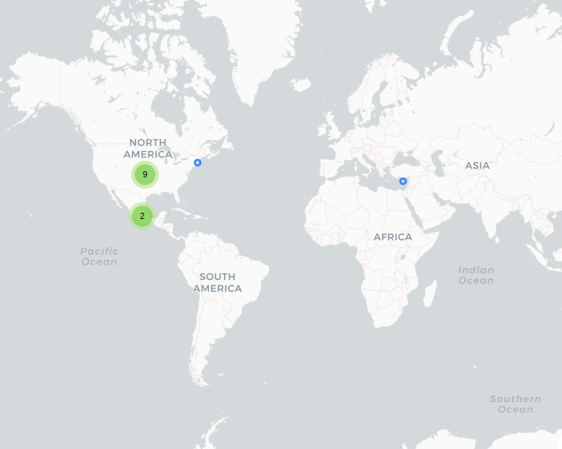

# Mujeres Segura

## Fecha de análisis

- **Análisis estático (mediante Exodus Privacy):** 12 abril 2022   
- **Análisis dinámico (mediante análisis de tráfico de red):** 18 abril 2022   
- **Análisis Posteriores:** 19 abril 2022 / 9 agosto 2022   

## Archivos analizados

[apk versión 2.0.0](http://cloud.datavoros.org/index.php/s/YWFZR9jsEHyHZe8)   
[pcap versión 2.0.0](http://cloud.datavoros.org/index.php/s/k3G8zmCrJboMeDk)

[apk versión 2.0.3](http://cloud.datavoros.org/index.php/s/78KmCZP7d9LjZqz)   
[pcap versión 2.0.3](http://cloud.datavoros.org/index.php/s/fxtEat2xCDWYQnx)   

## Descripción de la aplicación

- **Tipo:** Aplicación de emergencia para mujeres del estado de Sonora   
- **Costo:** Gratuito   
- **Link:** [https://play.google.com/store/apps/details?id=mx.gob.segobsonora.mujersegura](https://play.google.com/store/apps/details?id=mx.gob.segobsonora.mujersegura)   
- **Descargas:** 50,000+
- **Fecha de actualización:** 7 Enero 2022 / 13 jun 2022  
- **Versión:** 2.0.0  / 2.0.3
**Desarrollador:** [https://mujeresseguras.sonora.gob.mx/](https://mujeresseguras.sonora.gob.mx/)    
- **Firma:** Android, Google Inc.   
- **Contacto:** sistema.estatal@sspsonora.gob.mx  
- **Condiciones de uso y Política de privacidad:**
  - [https://www.sonora.gob.mx/politica-de-uso.html](https://www.sonora.gob.mx/politica-de-uso.html)

- **Descripción en playstore:**   
~~~
Aplicación móvil para las mujeres con el objetivo de erradicar la violencia de género, que contiene
botón de ayuda en caso de encontrarse en riesgo dentro del Estado de Sonora.
Está conectada directamente al Centro de Control, Comando, Comunicación, Cómputo, Coordinación
e Inteligencia C5i enviando ubicación georreferenciada así como número telefónico en la cual las
autoridades acudirán de forma inmediata en auxilio. De igual manera, se notificará a la red de
confianza.

Ademas cuenta con el servicio de datos patrocinados que te permitirá utilizar el botón de alerta
aunque no cuentes con datos móviles.
~~~  

## Trackers identificados (mediante Exodus Privacy)  

- [Google Firebase Analytics](https://firebase.google.com/)  

Enlace al [reporte](https://reports.exodus-privacy.eu.org/es/reports/mx.gob.segobsonora.mujersegura/latest/).   

## Empresas relacionadas con esta aplicación

- [Alphabet](https://abc.xyz/) a través de Google (Trackers y servicio de ubicación)
- [Total Play Telecomunicaciones](https://www.totalplay.com.mx/) (Servidor donde está almacenada la aplicación)

## Permisos   

- **Según la Playstore:** 17 permisos.
- **Según Exodus Privacy:** 23 permisos.
- **Según prueba de uso:** 3 permisos que se piden de manera explícita.   

### Permisos según la PlayStore

Esta aplicación puede acceder a:   

- Identidad   
    - Buscar cuentas en el dispositivo

- 
Contactos

    - Buscar cuentas en el dispositivo
    - Consultar tus contactos
    - Modificar tus contactos

- 
Ubicación

    - Ubicación aproximada (basada en red)
    - Ubicación precisa (basada en red y GPS)
    - Acceder a comandos de proveedor de ubicación adicional

- 
Teléfono

    - Llamar directamente a números de teléfono
    - Consultar la identidad y el estado del teléfono

- 
Fotos/multimedia/archivos

    - Leer el contenido de tu almacenamiento USB
    - Modificar o eliminar contenido del almacenamiento USB

- 
Almacenamiento

    - Leer el contenido de tu almacenamiento USB
    - Modificar o eliminar contenido del almacenamiento USB

- 
ID de dispositivo e información de llamada

    - Consultar la identidad y el estado del teléfono

- ❔Otro motivo

    - Recibir datos de Internet
    - Ver conexiones de red
    - Crear cuentas y establecer contraseñas
    - Emparejar con dispositivos Bluetooth
    - Acceso completo a red
    - Leer la configuración de sincronización
    - Ejecutarse al inicio
    - Controlar la vibración
    - Impedir que el dispositivo entre en modo de suspensión
    - Activar y desactivar la sincronización

### Permisos según Exodus Privacy

- :exclamation:
ACCESS_COARSE_LOCATION   
_Access approximate location (network-based)_

- :exclamation:
ACCESS_FINE_LOCATION   
_Access precise location (GPS and network-based)_

- ACCESS_LOCATION_EXTRA_COMMANDS   
_Access extra location provider commands_

- ACCESS_NETWORK_STATE   
_View network connections_

- AUTHENTICATE_ACCOUNTS   

- BLUETOOTH   
_Pair with Bluetooth devices_

- :exclamation:
CALL_PHONE   
_Directly call phone numbers_

- FOREGROUND_SERVICE   
_Run foreground service_

- :exclamation:
GET_ACCOUNTS   
_Find accounts on the device_

- INTERNET   
_Have full network access_

- :exclamation:
READ_CONTACTS   
_Read your contacts_

- :exclamation: READ_EXTERNAL_STORAGE
_Read the contents of your shared storage_ **(Permiso nuevo)**

- :exclamation:
READ_PHONE_STATE   
_Read phone status and identity_

- READ_SYNC_SETTINGS   
_Read sync settings_

- RECEIVE_BOOT_COMPLETED   
_Run at startup_

- VIBRATE   
_Control vibration_

- WAKE_LOCK   
_Prevent phone from sleeping_

- :exclamation:
WRITE_CONTACTS   
_Modify your contacts_

- :exclamation:
WRITE_EXTERNAL_STORAGE   
_Modify or delete the contents of your SD card_

- WRITE_SYNC_SETTINGS    
_Toggle sync on and off_

- RECEIVE   

- BIND_GET_INSTALL_REFERRER_SERVICE   

- ACTIVITY_RECOGNITION   

El icono :exclamation: indica un nivel 'Peligroso' o 'Especial' de acuerdo a los [niveles de protección de Google](https://developer.android.com/guide/topics/permissions/overview).    

### Permisos solicitados al usuario durante el uso de la aplicación

- 🔵 Acceso a Llamadas telefónicas
- 🔴 Acceso a Ubicación
- 🔵 Acceso a contactos  

🔴 Este ícono indica un permiso obligatorio   
🔵 Este ícono indica un permiso opcional pero se pierde una funcionalidad particular

## Datos

### Datos solicitados al usuario durante el uso de la aplicación

- 🔴 Nombre
- 🔴 Apellido Paterno
- ⚪ Apellido Materno
- 🔴 Número de teléfono
- ⚪ Fecha de nacimiento
- ⚪ Género
- ⚪ Discapacidad
- ⚪ Indígena o perteneciente a una etnia
- ⚪ Correo Electrónico   

🔴 Este ícono indica que se debe ingresar este dato de manera obligatoria.   
⚪ Este ícono indica que estos datos son opcionales.

### Tabla de conexiones realizadas durante el uso de la aplicación

| Dirección IP    | Número de paquetes | País          | Ciudad  | Número AS | Organización AS                        |
|-----------------|--------------------|---------------|---------|-----------|----------------------------------------|
| 142.250.68.10   |                 28 | United States |         |     15169 | GOOGLE                                 |
| 142.250.68.42   |                126 | United States |         |     15169 | GOOGLE                                 |
| 142.250.68.74   |                282 | United States |         |     15169 | GOOGLE                                 |
| 142.250.68.106  |                 49 | United States |         |     15169 | GOOGLE                                 |
| 142.250.72.170  |                 24 | United States |         |     15169 | GOOGLE                                 |
| 142.250.72.174  |                 29 | United States |         |     15169 | GOOGLE                                 |
| 142.250.217.138 |                 29 | United States |         |     15169 | GOOGLE                                 |
| 142.251.40.35   |                  5 | United States |         |     15169 | GOOGLE                                 |
| 142.251.40.46   |                 27 | United States |         |     15169 | GOOGLE                                 |
| 187.189.158.27  |                136 | México        | Navojoa |     22884 | TOTAL PLAY TELECOMUNICACIONES SA DE CV |

### 

_Pendiente_

### Notas sobre datos recolectados

- La aplicación contacta a los servidores de google por dos razones: los mapas y la geolocalización y por el tracker de Firebase. Este último asigna, a través de otro tracker, [firebaseinstallations](https://firebase.google.com/docs/reference/android/com/google/firebase/installations/FirebaseInstallations), una id particular a la instalación de la app. De ahí recolecta, a través de app-measurement.com toda una serie de eventos realizados en la aplicación. Aquí los enlaces a todos los eventos y datos que, de manera estándar se recolectan [1](https://support.google.com/firebase/answer/9234069?hl=en&ref_topic=6317484&visit_id=637859685880636053-1936242821&rd=1), [2](https://support.google.com/firebase/answer/9268042?hl=en&ref_topic=6317484&visit_id=637859685880636053-1936242821&rd=1), [3](https://support.google.com/firebase/answer/7029846?hl=en&ref_topic=7029512).
- El servidor perteneciente a Total Play es el host de la aplicación: servicios.sspsonora.gob.mx. Todas las comunicaciones están cifradas y es en este servidor donde se procesan las alertas de pánico. Estas son enviadas en formato JSON y cuentan con ID de alerta, un número de folio y la ubicación.
- En este servidor también se guardan los contactos de emergencia en formato JSON: id de contacto, nombre y teléfono.
- En este servidor se guarda la información de contacto que proporciona el usuario.

### Seguridad de datos de la Playstore

**Datos compartidos:** 
- Ubicación precisa
- Contactos

**Datos recogidos:**
- El desarrollador indica que esta aplicación no recoge datos de usuario

**Prácticas de seguridad:**
- Los datos se cifran en tránsito
- Los datos no se pueden eliminar

## Tabla de relación entre permisos y funciones

| Permisos  | Función relacionada  |
|---|---|
| ACCESS_COARSE_LOCATION  | Servicio de ubicación  |
| ACCESS_FINE_LOCATION  | Servicio de ubicación  |
| ACCESS_LOCATION_EXTRA_COMMANDS  | No sabemos para qué se usa  |
| ACCESS_NETWORK_STATE  | Internet  |
| AUTHENTICATE_ACCOUNTS  | No sabemos para qué se usa  |
| CALL_PHONE  | Llamadas a los centros del ISM  |
| FOREGROUND_SERVICE  | Botón de pánico   |
| GET_ACCOUNTS  | No sabemos para qué sirve  |
| INTERNET  |Internet   |
| READ_CONTACTS  | Agregar contactos a la red de emergencia   |
| READ_PHONE_STATE  | Llamadas a los centros del ISM   |
| READ_SYNC_SETTINGS  | Suponemos que esto permite que los contactos de emergencia siempre estén sincronizados, pero es sólo una suposición  |
| RECEIVE_BOOT_COMPLETED  | No sabemos para qué se usa   |
| VIBRATE  |Botón de pánico   |
| WAKE_LOCK  | Botón de pánico   |
| WRITE_CONTACTS  |No sabemos para qué se usa   |
| WRITE_EXTERNAL_STORAGE  | No sabemos para qué se usa  |
| WRITE_SYNC_SETTINGS  | No sabemos para qué se usa  |
| RECEIVE  | Push Notifications  |
| BIND_GET_INSTALL_REFERRER_SERVICE  |  Firebase tracker  |
| ACTIVITY_RECOGNITION  |No sabemos para qué se usa   |

###  Funciones específicas de la aplicación

- Tiene la función de datos patrocinados (si la persona no tiene datos, aun así puede hacer uso de la app). No está comprobado.
- Cuenta con contactos de red de confianza. Pueden ser agregados de manera manual o accediendo a la libreta de contactos de la cuenta de Google. Además estos contactos deben tener la app instalada. No está comprobado.
- Tiene una función de Falsa Alarma.
- Es opcional, pero se puede realizar una encuesta de violencia de pareja a la cual otorgan un resultado y una recomendación.
- Acceso al directorio de centros ISM (Instituto Sonorense de la Mujer).
- Acceso a un violentómetro.

## Notas

- La app está firmada por Google.

## Conclusiones

- En cuanto a los permisos que solicita la app, son muchos y no encontramos ninguna relación simétrica con las funciones que tiene la aplicación. _Access_location_extra_commands_ permite modificar y manipular el _gps_. El permiso de _authenticate_accounts_ permite, por ejemplo, crear cuentas en el dispositivo y ponerles passwords. Tampoco entendemos para qué sirve el permiso _get_accounts_ que permite identificar las diferentes cuentas del dispositivo. Creemos que no es necesario el permiso _write_contacts_ que permite modificar los datos de los contactos. Y tenemos casos similares con _read_sync_settings_, _receive_boot_complete_ (sirve para iniciar la app de manera automática cuando se reinicia el dispositivo), _write_external_storage_, _write_sync_settings_, y _activity_recognition_ (permite acceder a los sensores del dispositivo cuando los haya). No sabemos cómo funciona y si sirven los datos patrocinados, pero suponemos que tal vez alguno de estos permisos tenga que ver con ello, aún así, nos parece que esta app solicita permisos raros (por no estar presentes en las otras apps de botón de pánico) y excesivos.
- En cuanto a datos, nos preocupa el hecho de que perfile personas en términos de si son indígenas o pertenecientes a alguna etnia. Este dato podría ser de ayuda y al mismo tiempo un dato particularmente peligroso.
- No tiene fallas de seguridad flagrantes ni parece haber un uso excesivo de trackers (si bien podría, en el mejor de los casos, no haber ninguno).

## Adenda de actualización versión 2.0.3
- La nueva versión 2.0.3 tiene cambios mínimos en la interfaz. 
- Agrega la etiqueta de opcional a los datos personales que puede proporcionar el usuario. 
- Según el log de cambios en la Playstore sólo se corrigieron errores menores. Debido a esto no realizamos un nuevo análisis. - Agregamos la sección sobre "Seguridad de datos" de la Playstore a este reporte.
- Se agregó el permiso READ_EXTERNAL_STORAGE. No sabemos para qué lo usa la aplicación. 