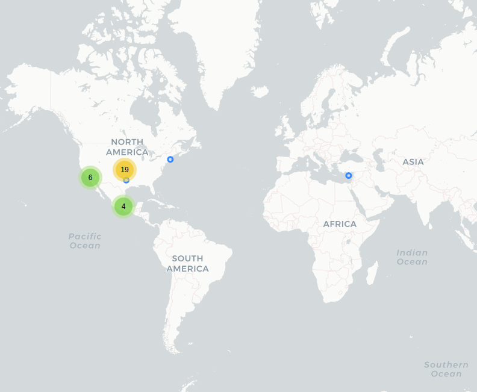
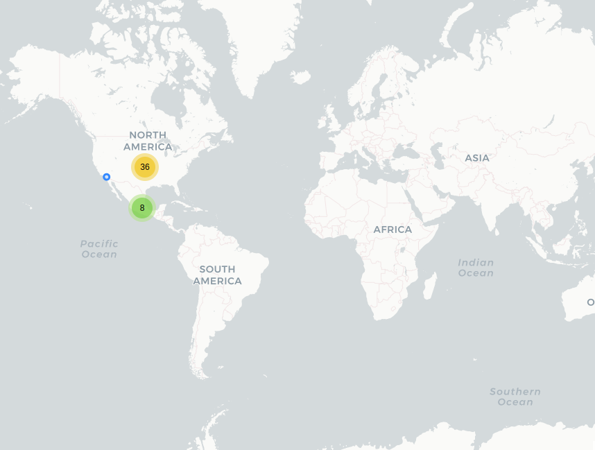
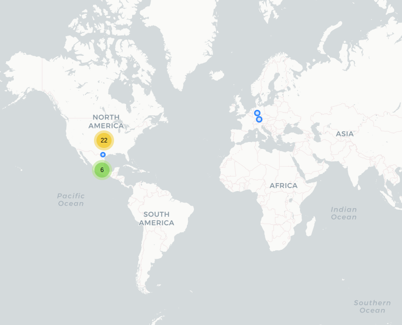

# Seguridad Incluyente / Escudo Puebla

## Fecha de análisis

- **Análisis estático (mediante Exodus Privacy):** 12 abril 2022    
- **Análisis dinámico (mediante captura de tráfico de red):** 18 abril 2022    
- **Análisis posteriores:** 10 agosto 2022 / 18 octubre 2022

## Archivos analizados

[apk seguridad incluyente versión 1.2.4.1](http://cloud.datavoros.org/index.php/s/b7z5Knrpk5jgMqs)   
[pcap seguridad incluyente versión 1.2.4.1](http://cloud.datavoros.org/index.php/s/2P9r8mRdbQHiSeE)

[apk escudo puebla versión 1.2.5](http://cloud.datavoros.org/index.php/s/YTS3kjFSnYH8Src)   
[pcap escudo puebla versión 1.2.5](http://cloud.datavoros.org/index.php/s/oHarQcNkgqjXixN)

[apk versión 1.2.8](http://cloud.datavoros.org/index.php/s/TBLJoaHpa5jAkBC)   
[pcap versión 1.2.8](http://cloud.datavoros.org/index.php/s/ffgRTrWPaMcywHG)   

## Descripción de la aplicación

- **Tipo:** Emergencias estado de Puebla   
- **Costo:** Gratis   
- **Link:** [https://play.google.com/store/apps/details?id=net.garagecoders.deri](https://play.google.com/store/apps/details?id=net.garagecoders.deri)       
- **Descargas:** 50,000+  
- **Fecha de actualización:** 7 septiembre 2022
- **Versión:**  1.2.4.1 / 1.2.5 / 1.2.8
- **Desarrollador:**  [http://sscmpuebla.gob.mx/](http://sscmpuebla.gob.mx/) 
- **Firma:**  [Garage Coders](https://www.garagecoders.net/)       
- **Contacto:** :no_entry_sign: magdalena.cuellar@pueblaciudadincluyente.gob.mx 
escudo.puebla@ayuntamientopuebla.gob.mx   
- **Condiciones de uso y Política de privacidad:**  
  - ~~[https://gobiernoabierto.pueblacapital.gob.mx/avisos-de-privacidad/secretaria-de-seguridad-ciudadana/item/download/22003_a78fe1764c8000f8fc4e6354ac442e3e](https://gobiernoabierto.pueblacapital.gob.mx/avisos-de-privacidad/secretaria-de-seguridad-ciudadana/item/download/22003_a78fe1764c8000f8fc4e6354ac442e3e)~~    
  [https://gobiernoabierto.pueblacapital.gob.mx/participacion-y-colaboracion/item/6863aplicacion-escudo-puebla](https://gobiernoabierto.pueblacapital.gob.mx/participacion-y-colaboracion/item/6863aplicacion-escudo-puebla)

  **Las secciones marcadas con :no_entry_sign: son secciones que ya no aplican porque cambiaron en una versión más reciente. Las mantenemos por objetividad en la documentación*

- **Descripción en la PlayStore:**       
~~~
Aplicación de la Secretaría de Seguridad Ciudadana (SSC) del Municipio de Puebla, destinada a
brindar atención oportuna ante situaciones que pongan en riesgo la integridad o patrimonio de las
personas. Como parte de la Estrategia de Vectores de Proximidad, la ciudadanía podrá solicitar el
apoyo de la Policía Municipal mediante la activación de un botón virtual y observará en tiempo real
el arribo de la unidad, al lugar indicado, en un lapso no mayor a los cinco minutos. También, el
usuario podrá comunicarse, vía telefónica, con el Policía de Vector más cercano a su ubicación,
mismo que dará respuesta inmediata ante cualquier solicitud emitida. Esta aplicación brindará además
los siguientes servicios:
- Verificación de estatus de unidades ingresadas al Depósito Vehicular del Municipio.
- Acceso al tabulador de tarifas por faltas al Reglamento de Tránsito, Movilidad y Seguridad Vial.
- Servicio de atención telefónica, disponible las 24 horas, para resolver dudas sobre faltas al
Reglamento de Tránsito, Movilidad y Seguridad Vial.
- Ingreso al portal oficial de la Secretaría de Seguridad Ciudadana (SSC) que, a su vez cuenta con
información de interés para el turista.
- Emisión de felicitaciones o quejas sobre el actuar policial, mismas que serán recibidas por la
Dirección de Asuntos Internos de la corporación.

El Gobierno Municipal pone a disposición de las familias esta herramienta tecnológica, con la
finalidad de fortalecer acciones enfocadas a la prevención del delito y la construcción de entornos
más seguros.
~~~

## Trackers identificados (mediante Exodus Privacy)

- [Google Firebase Analytics](https://firebase.google.com/products/analytics)   
- [Google Crashlytics](https://firebase.google.com/products/crashlytics/)

Enlace al [reporte](https://reports.exodus-privacy.eu.org/es/reports/net.garagecoders.deri/latest/).   

## Empresas relacionadas con esta aplicación

- [Alphabet](https://abc.xyz/) a través de Google (Trackers y servicio de ubicación)
- :no_entry_sign: Radiomovil Dipsa ([Telcel](https://www.telcel.com/)) (Servidor donde está guardada la aplicación)
- [Twitter](https://about.twitter.com/es) (Presente en la página web (la aplicación actúa como explorador) del aviso de privacidad)
- [Meta](https://about.meta.com/ltam/) a través de Facebook (Presente en la página web (la aplicación actúa como explorador) del aviso de privacidad)
- [Cloudflarenet](https://www.cloudflare.com/) (presente en la página de seguridad ciudadana (la aplicación actúa como explorador)
- [Megacable](https://www.megacable.com.mx/) (presente en la página de seguridad ciudadana (la aplicación actúa como explorador))
- [Sucuri-sec](https://sucuri.net/) (Presente en la página web (la aplicación actúa como explorador) del aviso de privacidad)
- [Akamai](https://www.akamai.com/es) 
- Edgecast comprada por [edg.io](https://edg.io/)

## Permisos

- **Según la Playstore:** :no_entry_sign: 6 permisos --> 7 permisos   
- **Según Exodus Privacy:** :no_entry_sign: 8 permisos / :no_entry_sign: 10 permisos / 11 permisos   
- **Según prueba de uso:** 1 permisos que se piden de manera explícita.   

### Permisos según la PlayStore

Esta aplicación puede acceder a:   

- 
Ubicación

    - Ubicación precisa (basada en red y GPS)
    - Ubicación (basada en red)

- ❔Otro motivo

    - Recibir datos de Internet
    - Ver conexiones de red
    - Acceso completo a red
    - Ejecutarse al inicio
    - Impedir que el dispositivo entre en modo de suspensión

### Permisos según Exodus Privacy

- :exclamation:ACCESS_FINE_LOCATION   
_Access precise location (GPS and network-based)_

- :exclamation:ACCESS_COARSE_LOCATION   
_Access approximate location only in the foreground_

- ACCESS_NETWORK_STATE   
_View network connections_

- FOREGROUND_SERVICE   
_Run foreground service_

- INTERNET   
_Have full network access_

- POST_NOTIFICATIONS

- RECEIVE_BOOT_COMPLETED   
_Run at startup_

- WAKE_LOCK   
_Prevent phone from sleeping_

- RECEIVE   

- BIND_GET_INSTALL_REFERRER_SERVICE

- AD_ID

### Permisos solicitados al usuario durante el uso de la aplicación

- 🔴 Ubicación (Para el botón de pánico. Se recopila, según la documentación de la aplicación, aunque la app no se esté usando durante la incidencia reportada)   

🔴 Este ícono indica un permiso obligatorio

## Datos

### Datos solicitados al usuario durante el uso de la aplicación

- 🔴 Nombre
- 🔴 Apellido Paterno
- ⚪ Apellido Materno
- 🔴 Correo Electrónico
- ⚪ Dirección
- ⚪ Capacidad auditiva (CheckBox)
Cuando se marca la checkbox de discapacidad auditiva, permite agregar un contacto de emergencia:
  - 🔴 Nombre
  - 🔴 Apellido Paterno
  - 🔴 Teléfono
  - ⚪ Dirección

🔴 Este ícono indica que se debe ingresar este dato de manera obligatoria.   
⚪ Este ícono indica que estos datos son opcionales.   

### Tabla de conexiones realizadas durante el uso de la Aplicación

| Dirección IP    | Número de paquetes | País          | Ciudad             | Número AS | Organización AS                |
|-----------------|--------------------|---------------|--------------------|-----------|--------------------------------|
| 72.247.96.120   |                312 | United States | Los Angeles        |     16625 | AKAMAI-AS                      |
| 104.16.87.20    |                 61 |               |                    |     13335 | CLOUDFLARENET                  |
| 104.244.42.72   |                 74 | United States |                    |     13414 | TWITTER                        |
| 142.250.68.42   |                  1 | United States |                    |     15169 | GOOGLE                         |
| 142.250.72.138  |                 58 | United States |                    |     15169 | GOOGLE                         |
| 142.250.72.142  |                  6 | United States |                    |     15169 | GOOGLE                         |
| 142.250.72.170  |                 71 | United States |                    |     15169 | GOOGLE                         |
| 142.250.72.174  |                644 | United States |                    |     15169 | GOOGLE                         |
| 142.250.72.232  |                 58 | United States |                    |     15169 | GOOGLE                         |
| 142.250.72.234  |                115 | United States |                    |     15169 | GOOGLE                         |
| 142.250.141.188 |                  4 | United States |                    |     15169 | GOOGLE                         |
| 142.250.176.3   |                120 | United States |                    |     15169 | GOOGLE                         |
| 142.250.176.4   |               1334 | United States |                    |     15169 | GOOGLE                         |
| 142.250.188.227 |                106 | United States |                    |     15169 | GOOGLE                         |
| 142.250.188.238 |               1112 | United States |                    |     15169 | GOOGLE                         |
| 142.250.189.3   |                131 | United States |                    |     15169 | GOOGLE                         |
| 142.250.189.13  |                 87 | United States |                    |     15169 | GOOGLE                         |
| 142.251.34.234  |                  9 | United States |                    |     15169 | GOOGLE                         |
| 142.251.40.35   |                461 | United States |                    |     15169 | GOOGLE                         |
| 142.251.40.46   |                480 | United States |                    |     15169 | GOOGLE                         |
| 157.240.11.22   |                204 | United States | Los Angeles        |     32934 | FACEBOOK                       |
| 157.240.11.35   |                103 | United States | Los Angeles        |     32934 | FACEBOOK                       |
| 172.217.14.106  |                544 | United States |                    |     15169 | GOOGLE                         |
| 187.216.248.254 |                175 | México        | San Andres Cholula |     28403 | RadioMovil Dipsa, S.A. de C.V. |
| 189.199.68.17   |               2192 | México        | Puebla City        |    262916 | Mega Cable, S.A. de C.V.       |
| 192.124.249.31  |                 12 | United States | Menifee            |     30148 | SUCURI-SEC                     |
| 192.124.249.36  |                 11 | United States | Menifee            |     30148 | SUCURI-SEC                     |
| 192.229.163.25  |                103 | United States |                    |     15133 | EDGECAST                       |
| 200.92.215.35   |                366 | México        | Puebla City        |     13999 | Mega Cable, S.A. de C.V.       |
| 216.239.32.3    |                 78 | United States |                    |     15169 | GOOGLE                         |

### 

### Notas sobre datos recolectados

- La aplicación contacta a los servidores de google por tres razones: los mapas y la geolocalización; el archivo PDF de "Tabulador de multas e infracciones" (En la versión actual, esta función queda en blanco); y por el tracker de Firebase y el de Crashlytics. El tracker de Firebase, asigna través de [firebaseinstallations](https://firebase.google.com/docs/reference/android/com/google/firebase/installations/FirebaseInstallations), una id particular a la instalación de la app. De ahí recolecta, a través de app-measurement.com toda una serie de eventos realizados en la aplicación. Aquí los enlaces a todos los eventos y datos que, de manera estándar se recolectan [1](https://support.google.com/firebase/answer/9234069?hl=en&ref_topic=6317484&visit_id=637859685880636053-1936242821&rd=1), [2](https://support.google.com/firebase/answer/9268042?hl=en&ref_topic=6317484&visit_id=637859685880636053-1936242821&rd=1), [3](https://support.google.com/firebase/answer/7029846?hl=en&ref_topic=7029512).
- Las conexiones a Twitter y Facebook son trackers que tienen que ver con la página de información del aviso de Privacidad :no_entry_sign: (En la cual no se muestra el aviso).
- El servidor de Cloudflare está relacionado con la página en construcción de la Secretaría de seguridad ciudadana (en la última versión esto ya no es así).
- Los mensajes de quejas y felicitaciones van al servidor de RadioMóvil Dipsa, a esta [página](https://deridev.com/auth/login). También la función sobre revisar si un coche está en el corralón dirige a este servidor.
- El servidor de RadioMóvil Dipasa es el _Host_ de la aplicación. Ahí se guardan todos los datos de registro. 
- Las conexiones a [Sucuri-sec](https://sucuri.net/) son llamadas en HTTP. Es un servicio que revisa que las páginas web no tengan malware y estén seguras. Es prudente suponer que estas conexiones tienen que ver con la misma página del aviso de privacidad.
- La conexión a Mega Cable es la página (en construcción) de la Secretaría de Seguridad Ciudadana. Esta conexión está en HTTP. En la nueva versión, esta ip, ya no se puede visitar. No sabemos para qué sirve esta conexión.

### Seguridad de datos de la PlayStore

**No se comparten datos con terceros**
- El desarrollador indica que esta aplicación no comparte datos de usuario con otras empresas u organizaciones.

**Datos que se recogen**
- Información personal
  - Nombre
  - Correo electrónico
  - Dirección
  - Número de Teléfono
- Actividad en la aplicación
  - Interacciones con la aplicación
- Información y rendimiento de aplicaciones
  - Registro de fallos 
  - Diagnósticos

**Prácticas de seguridad:**
- Los datos se cifran en tránsito
- Los datos no se pueden eliminar

 

## Tabla de relación entre permisos y funciones

| Permisos  | Funciones relacionadas  |
|---|---|
| ACCESS_FINE_LOCATION  | Servicio de ubicación  |
| ACCESS_NETWORK_STATE  | Internet  |
| FOREGROUND_SERVICE  | Botón de pánico  |
| INTERNET  | Internet  |
| POST_NOTIFICATIONS | Permite las notificacions emergentes |
| RECEIVE_BOOT_COMPLETED  | Iniciar aplicación al iniciar el dispositivo|
| WAKE_LOCK  | Botón de pánico  |
| RECEIVE  | Push Notifications  |
| BIND_GET_INSTALL_REFERRER_SERVICE  | Tracker Firebase  |
| AD_ID | Recolecta el ID de pubicidad del dispositivo |

### Funciones específicas de la aplicación

- Se puede revisar si un coche se encuentra en el corralón.
- Se pueden mandar quejas, sugerencias y felicitaciones a la Policía.
- Tiene las siguientes funciones que abren la instancia de llamada en Android:
  - Acompañamiento Bancario
  - Dudas sobre Infracciones
  - Grúa
- Página con dirección del Ayuntamiento de Puebla y otros datos.
- Consulta del tabulador de Infracciones

## Notas

- :no_entry_sign: El link provisto por la PlayStore a la política de privacidad no es el correcto. :no_entry_sign: Lo mismo con la redirección al aviso de privacidad dentro de la aplicación.
- La función a la página de la Secretaría de Seguridad Ciudadana no funciona.
- La función de tabulador de multas no funciona.
- :no_entry_sign: La función de búsqueda del corralón no funciona.
- Botón de auxilio no funciona por estar fuera de Puebla, pero permite hacer una llamada directa a servicios de emergencia.
- En la última versión se agregó el permiso de acceso para el identificador de publicidad de Android. 

## Conclusiones

- La relación entre permisos y funciones es simétrica con excepción del permiso _receive_boot_completed_ que permite que una aplicación se inicie de manera automática cuando se reinicia el teléfono, cosa que no sucede con esta app. Al mismo tiempo, no entendemos la razón de que tengan acceso al permiso del identificador del de publicidad de Android.  
- No tiene problemas flagrantes de seguridad.
- Lo que nos preocupa un poco es que da acceso a varias páginas que tienen trackers de Facebook y Twitter. Páginas que, además que no deberían tener esos trackers ya que son del gobierno del estado de Puebla, pueden hacer que un usuario sea rastreado en su móvil al utilizar esta aplicación.
- Tiene dos trackers, Firebase y Crashlytics. Si bien, en el mejor de los casos, no deberían estar, tampoco es una aplicación que presenta trackers en exceso.

### Adenda actualización Escudo Puebla
- Cambió de nombre: de Seguridad Inlcuyente, pasó a Escudo Puebla.
- Hay nuevas empresas relacionadas a esta aplicación:
  - [Addthis](https://www.addthis.com/) - A través de Fastly y Akamai
  - [Moat](https://www.moat.com/)
  - Fastly (CDN)
  - Uninet (Host de la aplicación)
  - Universidad Autónoma de Yucatán
  - Akamai funciona como CDN de las empresas Addthis y Moat. 
- En la nueva versión, se agregó el permiso AD_ID, este permiso le da acceso a la aplicación al Android Advertising ID, un identificador único de publicidad. Si relacionamos este permiso, con los dos servidores de Akamai que hacen referencia al servicio [AddThis](https://www.addthis.com/) y a [MOAT](https://www.moat.com/), dos servicios de publicidad, nos parece muy grave que una aplicación del gobierno esté rastreando y dando datos a estos servicios. 
- Un nuevo permiso ACCESS_COARSE_LOCATION
- Consulta del tabulador de Infracciones no funcionó.
- La función de búsquedas de autos en el corralón no funcionó.
- Ya no existe conexión al servdior de Cloudflarenet.
- El servidor de Uninet que tiene la ip: 187.217.17.168 es el nuevo host de la aplicación y hace referencia al dominio gobiernoabierto.pueblacapital.mx.
- La conexión a Edgecast ya no existe.
- Agregamos la sección de Seguridad de datos que ahora aparece en la PlayStore.
- La nueva tabla de conexiones:

| Dirección       | Número de paquetes | País          | Ciudad         | Número AS | Organización AS                 |
|-----------------|--------------------|---------------|----------------|-----------|---------------------------------|
| 23.41.24.125    |                283 | México        | CDMX           |     16625 | AKAMAI-AS                       |
| 23.41.25.152    |                 30 | México        | CDMX           |     16625 | AKAMAI-AS                       |
| 31.13.89.35     |                 44 | México        | CDMX           |     32934 | FACEBOOK                        |
| 104.244.42.72   |                 62 | United States |                |     13414 | TWITTER                         |
| 142.250.65.98   |                 23 | United States |                |     15169 | GOOGLE                          |
| 142.250.65.106  |                 36 | United States |                |     15169 | GOOGLE                          |
| 142.250.65.110  |                222 | United States |                |     15169 | GOOGLE                          |
| 142.250.65.131  |                 84 | United States |                |     15169 | GOOGLE                          |
| 142.250.65.138  |                 66 | United States |                |     15169 | GOOGLE                          |
| 142.250.65.141  |                 23 | United States |                |     15169 | GOOGLE                          |
| 142.250.138.188 |                 32 | United States |                |     15169 | GOOGLE                          |
| 142.251.33.234  |                 96 | United States |                |     15169 | GOOGLE                          |
| 142.251.34.3    |                 78 | United States |                |     15169 | GOOGLE                          |
| 142.251.34.8    |                 70 | United States |                |     15169 | GOOGLE                          |
| 142.251.34.10   |                145 | United States |                |     15169 | GOOGLE                          |
| 142.251.34.14   |                360 | United States |                |     15169 | GOOGLE                          |
| 142.251.34.42   |                107 | United States |                |     15169 | GOOGLE                          |
| 142.251.34.46   |                 31 | United States |                |     15169 | GOOGLE                          |
| 142.251.34.138  |                 25 | United States |                |     15169 | GOOGLE                          |
| 142.251.34.142  |                 95 | United States |                |     15169 | GOOGLE                          |
| 142.251.34.170  |                 44 | United States |                |     15169 | GOOGLE                          |
| 142.251.34.174  |                 64 | United States |                |     15169 | GOOGLE                          |
| 142.251.34.195  |                 25 | United States |                |     15169 | GOOGLE                          |
| 142.251.34.202  |                 57 | United States |                |     15169 | GOOGLE                          |
| 142.251.34.206  |                 20 | United States |                |     15169 | GOOGLE                          |
| 142.251.34.228  |                  4 | United States |                |     15169 | GOOGLE                          |
| 142.251.34.234  |                 54 | United States |                |     15169 | GOOGLE                          |
| 142.251.34.238  |                 28 | United States |                |     15169 | GOOGLE                          |
| 142.251.35.10   |                 42 | United States |                |     15169 | GOOGLE                          |
| 146.75.104.157  |                202 | United States |                |     54113 | FASTLY                          |
| 157.240.25.13   |                310 | México        | Querétaro      |     32934 | FACEBOOK                        |
| 157.240.25.35   |                 52 | México        | Querétaro      |     32934 | FACEBOOK                        |
| 172.217.2.131   |                 32 | United States |                |     15169 | GOOGLE                          |
| 172.217.2.142   |                 66 | United States |                |     15169 | GOOGLE                          |
| 172.217.3.131   |                971 | United States |                |     15169 | GOOGLE                          |
| 172.217.3.138   |                339 | United States |                |     15169 | GOOGLE                          |
| 172.217.3.141   |                 31 | United States |                |     15169 | GOOGLE                          |
| 172.217.15.3    |                 12 | United States |                |     15169 | GOOGLE                          |
| 172.217.15.14   |               1835 | United States |                |     15169 | GOOGLE                          |
| 187.216.248.254 |                189 | México        | Puebla         |     22122 | Universidad Autonoma de Yucatan |
| 187.217.17.168  |               1474 | México        | Puebla         |      8151 | Uninet S.A. de C.V.             |
| 192.124.249.36  |                 11 | United States | Menifee        |     30148 | SUCURI-SEC                      |
| 200.92.215.35   |                 14 | México        | Puebla         |     13999 | Mega Cable, S.A. de C.V.        |
| 216.58.195.238  |                 21 | United States |                |     15169 | GOOGLE                          |

## 

### Adenda Escudo Puebla versión 1.2.8

- Los servicios de Addthis, y Moat se mantienen, junto con Facebook y Twitter. Esto está relacionado con la página de Seguridad Ciudadana.
- Fastly y Akamai son los hosts de los servicios arriba mencionados y forman parte de la página de seguridad ciudadana. 
- No existen ya el servicio de Uninet, ahora la información de la app está guardada en un servidor perteneciente a Microsoft.
- El servicio de Sucurisec ha desaparecido.

| Dirección       | Número de paquetes | País          | Ciudad         | Número AS | Organización AS                 |
|-----------------|--------------------|---------------|----------------|-----------|---------------------------------|
| 13.85.31.242    |               2369 | United States | San Antonio    |      8075 | MICROSOFT-CORP-MSN-AS-BLOCK     |
| 23.41.24.125    |                259 | Mexico        | Mexico City    |     16625 | AKAMAI-AS                       |
| 23.41.25.152    |                 24 | Mexico        | Mexico City    |     16625 | AKAMAI-AS                       |
| 31.13.89.26     |                332 | Mexico        | Querétaro City |     32934 | FACEBOOK                        |
| 31.13.89.35     |                116 | Mexico        | Querétaro City |     32934 | FACEBOOK                        |
| 104.244.42.136  |                 52 | United States |                |     13414 | TWITTER                         |
| 142.250.65.106  |                 72 | United States |                |     15169 | GOOGLE                          |
| 142.250.65.141  |                 66 | United States |                |     15169 | GOOGLE                          |
| 142.250.115.188 |                  4 | United States |                |     15169 | GOOGLE                          |
| 142.251.34.14   |                 46 | United States |                |     15169 | GOOGLE                          |
| 142.251.34.35   |                142 | United States |                |     15169 | GOOGLE                          |
| 142.251.34.46   |                423 | United States |                |     15169 | GOOGLE                          |
| 142.251.34.132  |                 52 | United States |                |     15169 | GOOGLE                          |
| 142.251.34.138  |                369 | United States |                |     15169 | GOOGLE                          |
| 142.251.34.163  |                400 | United States |                |     15169 | GOOGLE                          |
| 142.251.34.202  |                420 | United States |                |     15169 | GOOGLE                          |
| 142.251.34.232  |                 74 | United States |                |     15169 | GOOGLE                          |
| 142.251.34.234  |                 21 | United States |                |     15169 | GOOGLE                          |
| 142.251.35.3    |                233 | United States |                |     15169 | GOOGLE                          |
| 142.251.35.14   |                 84 | United States |                |     15169 | GOOGLE                          |
| 146.75.104.157  |                172 | United States |                |     54113 | FASTLY                          |
| 172.217.2.138   |                 27 | United States |                |     15169 | GOOGLE                          |
| 172.217.2.142   |                 69 | United States |                |     15169 | GOOGLE                          |
| 172.217.3.142   |               3362 | United States |                |     15169 | GOOGLE                          |
| 172.217.4.170   |                 36 | United States |                |     15169 | GOOGLE                          |
| 187.216.248.254 |                122 | Mexico        | Puebla City    |     22122 | Universidad Autonoma de Yucatan |
| 200.92.215.35   |                 14 | Mexico        | Puebla City    |     13999 | Mega Cable, S.A. de C.V.        |
| 216.58.195.234  |                138 | United States |                |     15169 | GOOGLE                          |

## 