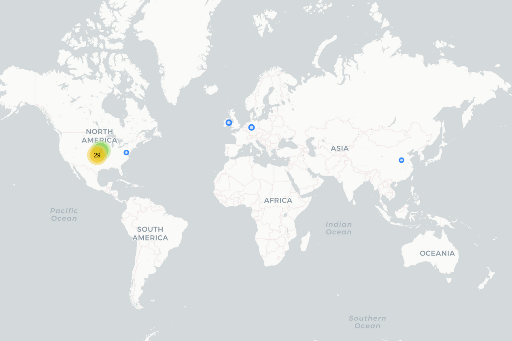

# Canva

## Fecha de análisis

- **Análisis estático (mediante Exodus Privacy/MobFS):** 03/11/2022
- **Análisis dinámico (mediante análisis de tráfico de red):** 03/11/2022
- **Análisis Posteriores:** 

## Links a los archivos analizados

- [Apk versión 2.190.0](https://cloud.datavoros.org/index.php/s/3i3TRtDNSx554fZ)
- [Pcap versión 2.190.0](https://cloud.datavoros.org/index.php/s/2WXJp3bDK4LEBQM)

## Descripción de la aplicación
- **Tipo:** Editor de fotos y video 
- **Costo:** Freemium  
- **Link de descarga:** https://play.google.com/store/apps/details?id=com.canva.editor&gl=US
- **Descargas:** 100M+
- **Ultima fecha de actualización:** 01/11/2022
- **Versión:** 2.190.0
- **Desarrollador:** Canva
- **Firma:** Canva
- **Contacto:** android-app@canva.com
- **Condiciones de uso y Política de privacidad:** https://www.canva.com/policies/privacy-policy/
    
- **Descripción en PlayStore:**
~~~
Canva es una app de diseño gratuita para editar fotos y videos al instante. Crea posts para redes sociales, videos, tarjetas, volantes, collages y más. Con solo tocar la pantalla, agrega animaciones y música a tus historias de Instagram o collages de videos.

¿No tienes experiencia en diseño? ¡No hay problema! Desde editar fotos hasta crear collages o logos, Canva pone el poder del diseño a tu alcance.

PLANTILLAS GRATUITAS: creatividad sin límites
• Inspírate con miles de plantillas personalizables.
• Crea posts parade Facebook, layouts, historias y posts para IG, y mood boards divertidos.
• Diseña invitaciones, volantes, certificados de regalo y más diseños de calidad profesional para impulsar tu negocio.
• Usa el creador de logos y destaca tu producto.
• Visualiza datos con plantillas de presentación elegantes o crea slideshows.

EDITOR DE FOTOS: gratis, sin anuncios ni marcas de agua
• Recorta, gira y edita fotos.
• Ajusta el brillo, el contraste, la saturación, el matiz, el enfoque y más
• Desenfoca el fondo y destaca lo importante con el Autofoco.
• Aplica filtros y efectos según tu estilo (Retro, Pixelar, Licuar, etc.)
• Destácate con texto y stickers.
• Crea cuadrículas y collages divertido.s
• Diseña en una pantalla pequeña sin anuncios.

EDITOR DE VIDEOS: crea videos impactantes con solo tocar la pantalla
• Crea videos profesionales en tu celular.
• Recorta, une y divide pistas de audio y video.
• Redimensiona y gira imágenes y videos.
• Aplica dinamismo a tus imágenes con animaciones y transiciones.
• Incorpora varias pistas de audio, efectos de sonido y doblajes.
• Crea collages y diapositivas.

REDES SOCIALES: destácate con contenido que se volverá viral
• Descubre miles de plantillas para Instagram, TikTok, Facebook, Twitter, YouTube, Snapchat, LinkedIn y más.
• Programa todas tus publicaciones del mes con el con el Planificador de contenido de Canva Pro.
• Crea layouts llamativos para Instagram con el editor de fotos.
• Diseña banners atractivos como miniaturas y anuncios.
• Crea cuadrículas con el editor de videos y el creador de collages.

BIBLIOTECA GRATUITA: más de 2 millones de recursos
• Paquete completo con todo lo que necesitas.
• Más de 2 millones de imágenes gratis.
• Miles de videos sin marca de agua.
• Más de 25,000 pistas de audio y música con licencia.
• Más de 500 fuentes y efectos de texto (Curvar, Neón, etc.).
• Miles de elementos gráficos (ilustraciones, stickers, marcos, etc.).
• Gráficas, diagramas y tablas con animaciones geniales.

SMARTMOCKUPS: inserta tu diseño en camisetas o pósters
• Visualiza tus diseños en una variedad de productos.
• Mockups en alta resolución para celulares, laptops, pósters y más.

COLABORACIÓN EN TIEMPO REAL: trabaja con quien quieras, estés donde estéso
• Edita proyectos y presentaciones dondequiera que estés.
• Empieza tu diseño en el celular y termínalo en la computadora.
• Colabora en tiempo real, edita y agrega comentarios.

CANVA PRO: más funciones y contenido a un precio imperdible
• Accede a plantillas, imágenes, videos, audios y más recursos prémium.
• Quitafondos: elimina fondos en un solo clic.
• Redimensión mágica: cambia el formato de tu foto o video en un solo clic.
• Kit de marca: define logos, fuentes y colores para mantener el estilo de tu marca.
• Programa publicaciones para Instagram, Facebook y más.

EL PODER DEL DISEÑO A TU ALCANCE
• Uso personal: crea diseños para fines creativos y profesionales, como plantillas para Instagram, CV, collages y más.
• Emprendedoress: impulsa tu negocio con el creador de logos, el editor de videos, el creador de pósters, etc.
• Estudiantes y docentes: presentaciones y ejercicios increíbles.
• Community managers y creadoras de contenido: crea contenido visual y mood boards uniformes con el editor de fotos y el creador de collages.
~~~

## Trackers identificados (mediante Exodus Privacy)

|Tracker|Tipo|
|---|---| 
|[AppsFlyer](https://support.appsflyer.com/hc/es/categories/201114756-Integraci%C3%B3n-de-SDK-)|Analítica|
|[Branch](https://branch.io/)|Analítica|
|[Braze](https://www.braze.com/)|Analítica, Publicidad, Localización|
|[Facebook Login](https://developers.facebook.com/docs/facebook-login)|Identificación|
|[Facebook Share](https://developers.facebook.com/docs/sharing)|Compartir|
|[Google AdMob](https://admob.google.com/home/)|Publicidad|
|[Google Crashlytics](https://firebase.google.com/products/crashlytics)|Reporte de crash|
|[Google Firebase Analytics](https://firebase.google.com/)|Analítica|
|[Google Tag Manager](https://marketingplatform.google.com/about/tag-manager/)|Analítica|
|[Segment](https://segment.com/docs/connections/spec/mobile-packaging-sdks/)|Analítica y perfilamiento|
|[Opentelemetry](https://opentelemetry.io/)|Analítica y Perfilamiento| 

Enlace al [reporte](https://reports.exodus-privacy.eu.org/en/reports/308425/) de Exodus Privacy   

## Empresas relacionadas con esta aplicación:

- [Canva](https://www.canva.com/about/)
- [Appsflyer](https://www.appsflyer.com/es/) - Marketing
- [Alphabet](https://abc.xyz/) --> Google - Publicidad, Crashes, Analítica, Monitoreo de código
- [Branch](https://branch.io/) - Anlítica, Monetización
- [Braze](https://www.braze.com/) - Marketing
- [Meta](https://about.facebook.com/ltam/meta/) --> Facebook
- [Segment](https://segment.com/) --> [Twilio](https://www.twilio.com/) - Minado y procesamiento de datos
- [Sentry](https://sentry.io/welcome/) - Monitoreo de código
- [Castle](https://castle.io/) - Seguridad
- [Tokenex](https://www.tokenex.com/) - Pagos digitales
- [Smartmockups](https://smartmockups.com/) - Mockups de productos
- [Chinanet](https://en.wikipedia.org/wiki/China_Telecommunications_Corporation) - Data Storage
- [Microsoft](https://www.microsoft.com/en-us/) - Data Storage
- [Amazon](https://aws.amazon.com/) - Data Storage
- [Cloudflare](https://www.cloudflare.com/) - Data Storage
- [Fastly](https://www.fastly.com/) - CDN, Data Storage
- [Opentelemetry](https://opentelemetry.io/) --> [CloudNative](https://www.cncf.io/) - Minado y procesamiento de datos

### Provedores de servicios de terceros para pagos, identificación y redes sociales:

- [Facebook](https://www.facebook.com/)
- [Instagram](https://www.instagram.com/)
- [Google Account](https://www.google.com/account/about/)
- [Huawei](https://consumer.huawei.com/mx/mobileservices/appgallery/) - AppGallery
- [WeChat](https://www.wechat.com/es/)

### Dominios integrados al código de la app que no pertecen directamente a los trackers

- No hay

## Permisos   

- **Según Exodus Privacy/MobFS:** 15
- **Según prueba de uso:** 3

### Permisos según Exodus Privacy

- ACCESS_NETWORK_STATE
_View network connections_

- ACCESS_WIFI_STATE
_View Wi-Fi connections_

- :camera::exclamation:CAMERA
_Take pictures and videos_

-  FOREGROUND_SERVICE
_Run foreground service_

- INTERNET
_Have full network access_

- :exclamation:READ_EXTERNAL_STORAGE
_Read the contents of your shared storage_

- RECEIVE_BOOT_COMPLETED
_Run at startup_

- VIBRATE
_Control vibration_

- WAKE_LOCK
_Prevent phone from sleeping_

- :exclamation:WRITE_EXTERNAL_STORAGE
_Modify or delete the contents of your shared storage_

- BILLING

- RECEIVE

- BIND_GET_INSTALL_REFERRER_SERVICE

- AD_ID

- GET_COMMON_DATA

El icono :exclamation: indica un nivel 'Peligroso' o 'Especial' de acuerdo a los [niveles de protección de Google](https://developer.android.com/guide/topics/permissions/overview). 

### Permisos solicitados durante el uso de la aplicación

- :red_circle: Acceso a Fotos y Multimedia 
- :red_circle: Acceso a tomar fotos y grabar video
- :blue_circle: Grabar audio para videos

:red_circle: Este ícono indica un permiso obligatorio   
:blue_circle: Este ícono indica un permiso opcional pero se pierde una funcionalidad particular

## Datos

### Datos solicitados al usuario durante el uso de la aplicación

- Inicio de cuenta en Google (opcional)
- Inicio de cuenta en Facebook (opcional)
    

### Tabla de conexiones realizadas durante el uso de la aplicación

| Dirección       | Número de paquetes | País          | Ciudad         | Número AS | Organización AS             | Dominio o Tracker contactado |
|-----------------|--------------------|---------------|----------------|-----------|-----------------------------|------------------------------|
| 34.120.195.249  | 185                | United States | Kansas City    | 396982    | GOOGLE-CLOUD-PLATFORM       | Sentry.io                    |
| 35.188.42.15    | 476                | United States | Council Bluffs | 396982    | GOOGLE-CLOUD-PLATFORM       | Sentry.io                    |
| 52.236.24.40    | 51                 | Ireland       | Dublin         | 8075      | MICROSOFT-CORP-MSN-AS-BLOCK | Tokenex.com                  |
| 54.242.255.79   | 35                 | United States | Ashburn        | 14618     | AMAZON-AES                  | Castle.io                    |
| 61.150.74.205   | 112                | China         |                | 4134      | Chinanet                    |                              |
| 65.9.149.14     | 30                 | United States |                | 16509     | AMAZON-02                   | Appsflyer                    |
| 65.9.149.17     | 72                 | United States |                | 16509     | AMAZON-02                   | Branch                       |
| 65.9.149.21     | 56                 | United States |                | 16509     | AMAZON-02                   | Appsflyer                    |
| 65.9.149.60     | 30                 | United States |                | 16509     | AMAZON-02                   | Appsflyer                    |
| 65.9.149.64     | 27                 | United States |                | 16509     | AMAZON-02                   | Appsflyer                    |
| 65.9.149.66     | 34                 | United States |                | 16509     | AMAZON-02                   | Appsflyer                    |
| 65.9.149.75     | 30                 | United States |                | 16509     | AMAZON-02                   | Branch                       |
| 65.9.149.81     | 51                 | United States |                | 16509     | AMAZON-02                   | Branch                       |
| 65.9.149.129    | 38                 | United States |                | 16509     | AMAZON-02                   | Appslfyer                    |
| 65.9.156.152    | 37                 | United States |                | 16509     | AMAZON-02                   | Cloudfront.net               |
| 104.16.56.101   | 46                 |               |                | 13335     | CLOUDFLARENET               | Cloudflareinsights           |
| 104.17.51.4     | 63                 |               |                | 13335     | CLOUDFLARENET               | Appboy                       |
| 104.17.114.17   | 9440               |               |                | 13335     | CLOUDFLARENET               | Canva                        |
| 104.17.115.17   | 13314              |               |                | 13335     | CLOUDFLARENET               | Canva                        |
| 104.18.14.84    | 1606               |               |                | 13335     | CLOUDFLARENET               | Canva                        |
| 104.18.22.10    | 22                 |               |                | 13335     | CLOUDFLARENET               | Appsflyer                    |
| 104.18.29.220   | 234                |               |                | 13335     | CLOUDFLARENET               | smatmockups.com              |
| 104.19.153.69   | 1429               |               |                | 13335     | CLOUDFLARENET               | Braze                        |
| 142.250.65.110  | 21                 | United States |                | 15169     | GOOGLE                      |                              |
| 142.250.65.138  | 71                 | United States |                | 15169     | GOOGLE                      | Firebase                     |
| 142.250.69.10   | 54                 | United States |                | 15169     | GOOGLE                      | Firebase                     |
| 142.250.115.188 | 8                  | United States |                | 15169     | GOOGLE                      |                              |
| 142.251.34.14   | 26                 | United States |                | 15169     | GOOGLE                      | appmeasurement               |
| 142.251.34.42   | 26                 | United States |                | 15169     | GOOGLE                      | Firebase                     |
| 142.251.34.138  | 9                  | United States |                | 15169     | GOOGLE                      | Firebase                     |
| 142.251.34.174  | 151                | United States |                | 15169     | GOOGLE                      |                              |
| 142.251.34.195  | 33                 | United States |                | 15169     | GOOGLE                      |                              |
| 142.251.34.234  | 82                 | United States |                | 15169     | GOOGLE                      | Firebase                     |
| 142.251.34.238  | 63                 | United States |                | 15169     | GOOGLE                      | Google Analytics             |
| 142.251.35.14   | 30                 | United States |                | 15169     | GOOGLE                      |                              |
| 142.251.35.22   | 26                 | United States |                | 15169     | GOOGLE                      |                              |
| 151.101.1.208   | 426                | United States |                | 54113     | FASTLY                      | Braze                        |
| 172.217.3.130   | 23                 | United States |                | 15169     | GOOGLE                      |                              |
| 172.217.4.170   | 29                 | United States |                | 15169     | GOOGLE                      | Firebase                     |
| 172.217.15.3    | 28                 | United States |                | 15169     | GOOGLE                      | Crashlytics                  |

**Los dominios o trackers contactados son solicitudes de conexión de la aplicación establecidas a través del DNS. Conocer esto no siempre es posible, ya que muchas veces dichas comunicaciones están cifradas. Sólo ennumeramos aquellas que tienen un interés puntual para este proyecto, a saber, trackers y empresas no relacionadas con los trackers.**

### Mapa de conexiones realizadas durante el uso de la aplicación

### Datos compartidos y uso según la Playstore:

- No se comparten datos con terceros.     

Recordamos aquí que los datos anónimos o anonimizados no se encuentran entre los datos a terceros que el desarrollador debe divulgar. Tampoco los datos que divulga al gobierno o agencias del gobierno. 

### Datos recopilados y uso según la Playstore

|Datos|Uso|
|---|---|
|Nombre (opcional)|Comunicaciones del desarrollador, publicidad o marketing, personalización y gestión de cuentas| 
|Correo electrónico(opcional)| Funcionalidades de la aplicación, Comunicaciones del desarrollador, Publicidad o marketing, Personalización y Gestión de cuentas| 
ID de usuario (opcional)|Funcionalidad de la aplicación|
|Dirección (opcional)|Funcionalidad de la aplicación|  
|Número de teléfono (opcional)|Funcionalidad de la aplicación y Gestión de cuentas|Funcionalidad de la aplicación|
|Otros mensajes en aplicaciones|Funcionalidad de la aplicación|
|Fotos (opcional)|Funcionalidad de la aplicación|
|Video (opcional)|Funcionalidad de la aplicación|
|Grabaciones de voz o de sonido (Opcional)|Funcionalidad de la aplicación|
|Archivos de música (opcional)|Funcionalidad de la aplicación|
|Otros archivos de audio (opcional)|Funcionalidad de la aplicación|
|Archivos y documentos (opcional)|Funcionalidad de la aplicación|
|Interacciones de la aplicación|Funcionalidad de la aplicación|
|Historial de búsquedas en la aplicación|Funcionalidad de la aplicación|
|Registros de fallos|Funcionalidad de la aplicación|
|Diagnósticos|Funcionalidad de la aplicación|
|Otros datos de rendimiento de aplicaciones|Funcionalidad de la aplicación|
|IDs de dispositivo o de otro tipo|Funcionalidad de la aplicación|
|Historial de compras|Funcionalidad de la aplicación|

### Datos recopilados y uso según la Política de privacidad

|Datos|Uso|
|---|---|
|Al crear una cuenta: nombre, apellido, nombre de usuario, fecha de nacimiento, número de teléfono, profesión y dirección y email.|El uso es para operar, mantener y ofrecer características y funcionalidad del servicio, así como para poder comunicarse con el usuario.|
|Mensajes enviados al desarrollador a través del servicio; y fotos y textos subidos a la sección User Content.| El uso es para operar, mantener y ofrecer características y funcionalidad del servicio, así como para poder comunicarse con el usuario.|
|Información obtenida a través de terceros si se usan para crear una cuenta, como por ejemplo: Facebook UID y toda la información que el usuario permita a Facebook dar a Canva|
|Información obtenida a través de terceros si, por ejemplo, uno sigue la página de Canva en Facebook o le da like o comenta, o postea en su página videos o fotos|
|:bangbang:Información obtenida de fuentes públicas como redes sociales (Facebook, Twitter, LinkeIN, etc.) y servicios de datos e información (léase servicios que usan trackers). Ejemplo de estos datos pueden ser: compañía, tamaño de la compañía, posición laboral, industria y otra información de perfil. Además pueden cruzar esta información con información proporcionada por el usuario para hacer un perfil más completo.|Se utiliza para poder proporcionar ofertas, publicidad y otros servicios de manera personalizada.|
|Información sobre comportamiento al respecto de los anuncios y productos anunciados por parte de las empresas de publicidad que trabajan con Canvas.|Se usa para conocer la efectividad de los anuncios y poder pagar las cuotas que les son obligatorias.|
|Información recolectada de manera automática por herramientas de análisis de terceros.|Para poder medir "trends" de uso y formas de uso de su servicio.|
|Cada vez que usa la aplicación o su servicio web, recolectan estadísticas de uso anónima como el tipo de explorador, referencias (si uno llega a la página a través de otra), número de clicks e interacciones con los links.|
|Utilizan GIFs (web beacons), para rastrear anónimamente los patrones de comportamiento de los usuarios. Además los usan en emails que le mandan a los usuarios para ver qué links han abierto desde su email.|Se usa para conocer mejor el uso que se le da a su servicio y poder mejorarlo.|
|Si se accede a través de una app o el celular, recopilan y monitorean más de uno de los identificadores únicos, como puede ser el UUID (universal, unique identifier), en Android es el Android Advertising ID.|Para mejorar el servicio.|
|:bangbang:Geolocalización a través de: dirección ip, terceros, terceros con los que se realizan pagos y cuando el usuario proporciona la ubicación de manera expedita.|Localizar usuarios y personalizar el contenido; obedecer las leyes locales; analítica; formas de uso de la aplicación: doméstica, educacional o empresarial (léase, saben si el usuario está en su casa, en la escuela o en el trabajo); mejorar publicidad y mejor estimar los impuestos.|
|Contenido generado por el usuario en la aplicación|

- El uso general que le dan a la información incluye:   
    - Proporcionar el servicio   
    - Mejorar el servicio a través del análisis de datos de uso y patrones demográficos.   
    - _Predictive analytics_: utilizan algoritmos que, a través del análisis del uso de la aplicación, pueden predecir el uso que le dará el usuario, de tal manera que es más fácil personalizar y mejorar el servicio para cada usuario. Al mismo tiempo, toda esta información "entrena" cada vez mejor al propio algoritmo, una suerte de círculo virtuoso. La información que usan y cómo la usan incluye:   
        - Etiquetar y detectar componenetes en las imágenes (ojos, fondos, etc.).   
        - Etiquetas generales (Persona con perro).   
        - Detectar contenido prohibido.   
        - Traducir pistas de audio.   
        - Predecir la mejor suscripción o producto para un usuario.   
        - Términos de búsqueda.   
        - Promover un mayor uso (_engagement_) de la aplicación.   
        - Publicidad.   
        - Felicidad del usuario. Datos que les son enviados a su equipo de felicidad del usuario para mejorar o solucionar problemas.      
        - Seguridad.   

Comparten la información del usuario con terceros sólo para poder brindar el servicio y sólo en la medida estrictamente necesaria. El servicio incluye:   
- Pagos   
- Atención al cliente   
- Email   
- Alojamiento de datos   
- Análisis de datos y _predictive analysis_   
- Etiquetamiento de datos   
- Seguridad   
- Publicidad y marketing   
- Registro de dominio     
- Envío de productos físicos   
- Otros proveedores de servicios   

- Si el usuario no quiere que su información no se use para fines pubilicitarios, de marketing o perfilamiento, se puede mandar un email a privacy@canva.com   

*El ícono :bangbang: denota, lo que creemos que es algo importante a tomar en cuenta sobre la privacidad del usuario.*   
        

### Notas importantes sobre seguridad y privacidad:

- Esta aplicación no tiene problemas flagrantes de seguridad.

## Conclusiones

- En comparación con otras apps analizadas (SweetSelfie, Sticker.ly, B612 y Picsart) esta aplicación es mejor en cuanto a privacidad que las otras ya que tiene menos rastreadores. 

