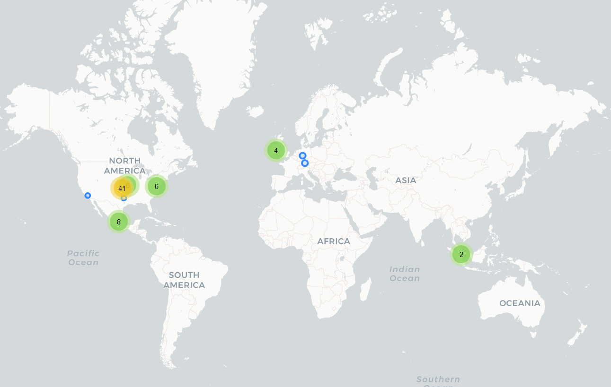

# Picsart

## Fecha de análisis

- **Análisis estático (mediante Exodus Privacy/MobFS):** 04/11/2022
- **Análisis dinámico (mediante análisis de tráfico de red):** 03/11/2022
- **Análisis Posteriores:** 

## Links a los archivos analizados

- [Apk versión 2.8.5](https://cloud.datavoros.org/index.php/s/dZ6XpbFfspbo9ea)
- [Pcap versión 2.8.5](https://cloud.datavoros.org/index.php/s/QYeJJiMowpkXYdA)

## Descripción de la aplicación
- **Tipo:** Editor de fotos, video y red social   
- **Costo:** Freemium  
- **Link de descarga:** [https://play.google.com/store/apps/details?id=com.picsart.studio](https://play.google.com/store/apps/details?id=com.picsart.studio)
- **Descargas:** 500M+
- **Ultima fecha de actualización:** 03/11/2022
- **Versión:** 20.9.4
- **Desarrollador:** Picsart
- **Firma:** sourc.io
- **Contacto:** support@picsart.com
- **Condiciones de uso y Política de privacidad:** [https://picsart.com/privacy-policy](https://picsart.com/privacy-policy)
    
- **Descripción en PlayStore:**
~~~
Join the Picsart community of over 150 million creators around the world. With the Picsart photo editor and video editor, you can bring your creativity to life. Make professional-level collages, design and add stickers, quickly remove and swap backgrounds, try popular edits like Golden Hour, Mirror Selfies, and retro VHS or Y2K filters. Picsart is your go-to, all-in-one editor & collage maker with all the tools you need to give your content a personal flair and make it stand out.

Picsart Features:

PHOTO EDITOR
• Try trending filters for pictures and popular photo effects
• Use the Background Eraser to erase and replace backgrounds
• Clean up pics and remove unwanted objects with the Remove Object tool
• Use millions of curated, free images or edit your own pictures
• Add text to photos with 200+ designer fonts
• Retouch selfies with hair color changer, makeup stickers & more
• Blur backgrounds with our AI-powered smart selection tool
• Quickly flip & crop photos
• Add stickers to pictures and create your own stickers

VIDEO EDITOR
• Create and edit videos with our easy-to-use video editor with music
• Take your IG Stories, TikToks & Reels to the next level
• Add music to your videos using our extensive video editor music library
• Crop video clips to the perfect dimensions and ratios
• Try Glitch video effects and other trendy filters in the video editor
• Trim videos or use smart video merger to blend videos
• Design using the slideshow maker with music
• Add your best moments to a video collage

COLLAGE MAKER
• Create on-trend photo collages with your favorite pictures
• Try photo grid collage, freestyle collage, scrapbook, and frames for pictures
• Go viral with our meme generator & share with friends
• Use the Story Maker and level up your Instagram game with Story templates

STICKER MAKER + FREE STICKERS
• Discover over 60+ million Picsart stickers
• Add stickers to pictures to turn up the fun level on your edits
• Download any sticker for free and use it instantly
• Make your own clipart and create unique custom stickers

PHOTO EFFECTS & FILTERS
• Outline selfies with the popular Sketch effects
• Turn portraits into artistic masterpieces with Canvas effects
• Make Drip Art with dripping effect stickers & customize the blend mode
• Cartoon yourself in seconds with amazing Magic effects

DRAWING TOOL
• Use Picsart Draw with customizable brushes, layers, & pro drawing tools
• Doodle on pictures and create a transparent clothes effect
• Start with a blank canvas to create art and illustrations from scratch
• Play with Doodle Art and scribble away for hours

REPLAY
• Recreate trending edits in a couple of taps. Cut editing time in half with easy customizable steps
• Edit multiple pictures in the same style.
• Keep your IG feed on-trend and consistent by creating personal presets

PICSART GOLD
• The Picsart Gold subscription grants access to NEW EXCLUSIVE content all the time. Get all the top features with an ad-free editing experience.
---
Start your Picsart Gold membership with a free trial - limited to one per Google Play account. Once the trial is over, you’ll be charged a nominal subscription fee. Your Gold subscription will automatically renew unless auto-renew is turned off at least 24 hours before the end of the current period. If your subscription is subject to any promotional discount, the discount will expire upon the end of the current period & you’ll be charged the standard rate upon renewal. Go to your Google Play account to manage your membership & to turn auto-renew off. Your Google Play account will be charged when the purchase is confirmed.
~~~

## Trackers identificados (mediante Exodus Privacy)

|Tracker|Tipo|
|---|---|
|[Amazon Advertisement](https://aps.amazon.com/aps/index.html)|Publcidad|
|[AppLovin](https://www.applovin.com/)| Publicidad, Analítica, Identificación, Perfilamiento|
|[AppsFlyer](https://www.appsflyer.com/)|Analítica|
|[Branch](https://branch.io/)|Analítica|
|[Braze](https://www.braze.com/)|Analítica, Ubicación, Publicidad|
|[Bugsnag](https://www.bugsnag.com/)|Reporte de crash|
|[Facebook Ads](https://www.facebook.com/business/ads)|Publicidad|
|[Facebook Analytics](https://developers.facebook.com/docs/app-events)|Analítica|
|[Facebook Login](https://developers.facebook.com/docs/facebook-login)|Identificación|
|[Facebook Share](https://developers.facebook.com/docs/sharing)|Compartir|
|[Fyber](https://developer.fyber.com/hc/en-us/articles/360010079178-User-Activity)|Publicidad|
|[Google AdMob](https://admob.google.com/home/)|Publicidad|
|[Google Crashlytics](https://firebase.google.com/products/crashlytics)|Reporte de crash|
|[Google Firebase Analytics](https://firebase.google.com/)|Analítica|
|[IAB Open Measurement](https://iabtechlab.com/standards/open-measurement-sdk/)|Identificación, Publicidad|
|[Inmobi](https://www.inmobi.com/sdk)|Publicidad|
|[Smaato](https://www.smaato.com/)|Publicidad| 
|[VKontakte SDK](https://vksdk.github.io/vk-sdk-android/)|Identificación|

- Según MobFS, existe el tracker VerizonAds. No detectamos ninguna conexión a este en el análisis dinámico. Además no encontramos información en Internet a este respecto. Verizon Ads nos remite a Yahoo. En el análisis estático hay código que justifica que exista este tracker, pero parece ser que es un código obsoleto. 
- Está presente el SnapKit SDK. Creemos que esto es un tracker. 
- Además hay otro tracker, bttracker, que pertenece a [Bidtellect](https://bidtellect.com/).

Enlace al [reporte](https://reports.exodus-privacy.eu.org/en/reports/308249/) de Exodus Privacy   

## Empresas relacionadas con esta aplicación:
- [AppLovin Corporation](https://www.applovin.com/) 
- [AppsFlyer.Inc](https://www.appsflyer.com/)
- [Branch](https://branch.io/)
- [Braze](https://www.braze.com/)
- [Bidtellect](https://bidtellect.com/)
- [SmartBear](https://smartbear.com/company/about-us/) --> Bugsnag
- [Meta](https://about.facebook.com/ltam/meta/) --> Facebook
- [Digital Turbine](https://www.digitalturbine.com/about/), [Appreciate](https://appreciate.mobi/)(DSP) --> [Fyber](https://www.fyber.com/fyber-marketplace/)
- [Google](https://about.google/intl/ALL_mx/) --> [Alphabet](https://abc.xyz/)
- [IAB Tech Lab](https://iabtechlab.com/) --> IAB OpenMeasurement
- [Inmobi](https://www.inmobi.com/) - Publicidad
- [VK](https://vk.company/en/company/about/) --> VKontakte. VK es además una [red social](https://vk.com/about) basada en Rusia. 
- [Media Games Invest](https://mgi.group/) dueña de [Verve Group](https://verve.com/) --> Smaato
- [Liftoff.io/Vungle](https://liftoff.io/company/about-us/)
- [Cloudflare](https://www.cloudflare.com/es-es/) - Data Storage
- [Amazon](https://aws.amazon.com/)
- [Microsoft](hhttps://www.microsoft.com/es-mx/about) - Data Storage 
- [Akamai](https://www.akamai.com/es) - CDN
- [Fastly](https://www.fastly.com/es/) - CDN
- [Stackpath](https://www.stackpath.com/) - CDN
- [Bidswitch](https://www.bidswitch.com/) - DSP
- [Impact](https://impact.com/) - Partner solutions
- [Ethyca](https://ethyca.com/) - Privacy
- [Bidtellect](https://bidtellect.com/)
- [OneTrust](https://www.onetrust.com/) - Privacy, Geolocation
- [Pinterest](https://pinterest.com) 
- [Snap Inc](https://www.snap.com/en-US)
- [ServerCentral](https://deft.com/), ahora Deft - Data Storage, CDN
- [Impact](https://impact.com/) - Marketing 
- [CookieLaw](https://www.cookielaw.org/) - Privacidad

### Provedores de servicios de terceros para pagos, identificación y redes sociales:
- [Google](https://about.google/intl/ALL_mx/) --> Alphabet
- [Youtube](https://about.youtube/) --> Alphabet
- [Instagram](https://instagram.com) --> Meta
- [Facebook](https://facebook.com) --> Meta
- [Dropbox](https://www.dropbox.com/es/about) 
- [Snapchat](https://www.snapchat.com/es-MX) 
- [Whatsapp](https://www.whatsapp.com/) --> Meta
- [Pinterest](https://pinterest.com/)
- [LINE](https://line.me/en/) - Mensajería (Revisar [Line Corporation](https://en.wikipedia.org/wiki/Line_Corporation))
- [WeChat](https://www.wechat.com/es/) --> [Tencent](https://www.tencent.com/en-us/)  
- [QQ](https://im.qq.com/index) --> [Tencent](https://www.tencent.com/en-us/) 
- [TikTok](https://www.tiktok.com/about?lang=es) --> [ByteDance](https://www.bytedance.com/en/)
- [VK](https://vk.com/about) 
- [KAKAO](https://www.kakaocorp.com/page/service/service/KakaoTalk?lang=en) --> [KAKAO Corporation](https://www.kakaocorp.com/page/) 

### Dominios integrados al código de la app que no pertecen directamente a los trackers

- https://nexage.com/ --> Yahoo.
- https://weibo.com/
- https://adturns.com/
- inneractive-assets.s3-eu-west-1.amazonaws.com --> Maltrail lo marcó como dominio malicioso
- https://itunes.apple.com/

## Permisos   

- **Según Exodus Privacy/MobFS:** 28
- **Según prueba de uso:** 3

### Permisos según Exodus Privacy

- :pushpin::exclamation: ACCESS_COARSE_LOCATION
_Access approximate location only in the foreground_

- :pushpin::exclamation:ACCESS_FINE_LOCATION
_Access precise location only in the foreground_

- ACCESS_NETWORK_STATE
_View network connections_

- ACCESS_WIFI_STATE
_View Wi-Fi connections_

- BIND_WALLPAPER

- :camera::exclamation:CAMERA
_Take pictures and videos_

- FOREGROUND_SERVICE
_Run foreground service_

- INTERNET
_Have full network access_

- POST_NOTIFICATIONS

- :exclamation:READ_CONTACTS
_Read your contacts_

- RECEIVE_BOOT_COMPLETED
_Run at startup_

- :microphone::exclamation:RECORD_AUDIO
_Record audio_

- WAKE_LOCK
_Prevent phone from sleeping_

- :exclamation:WRITE_EXTERNAL_STORAGE
_Modify or delete the contents of your shared storage_

- UPDATE_COUNT

- BILLING

- RECEIVE

- BIND_GET_INSTALL_REFERRER_SERVICE

- ACTIVITY_RECOGNITION

- AD_ID

- READ_GSERVICES

- READ_SETTINGS

- UPDATE_SHORTCUT

- MAPS_RECEIVE

- BILLING

- READ

- WRITE

- BROADCAST_BADGE 

El icono :exclamation: indica un nivel 'Peligroso' o 'Especial' de acuerdo a los [niveles de protección de Google](https://developer.android.com/guide/topics/permissions/overview). 

### Permisos solicitados durante el uso de la aplicación

- :blue_circle: Acceso a Fotos y Multimedia 
- :blue_circle: Acceso a tomar fotos y grabar video
- :blue_circle: Acceso a contactos

:blue_circle: Este ícono indica un permiso opcional pero se pierde una funcionalidad particular

## Datos

### Datos solicitados al usuario durante el uso de la aplicación

- Acceso con cuenta de Google (opcional)
    

### Tabla de conexiones realizadas durante el uso de la aplicación

| Dirección       | Número de paquetes | País          | Ciudad         | Número AS | Organización AS                      | Dominios o Trackers contactados |
|-----------------|--------------------|---------------|----------------|-----------|--------------------------------------|---------------------------------|
| 13.225.41.27    | 30                 | United States |                | 16509     | AMAZON-02                            | Appsflyer                       |
| 18.203.13.19    | 31                 | Ireland       | Dublin         | 16509     | AMAZON-02                            | onelink.me                      |
| 23.41.24.199    | 125                | Mexico        | Mexico City    | 16625     | AKAMAI-AS                            | Pinterest                       |
| 31.13.89.19     | 54                 | Mexico        | Querétaro City | 32934     | FACEBOOK                             |                                 |
| 31.13.89.35     | 29                 | Mexico        | Querétaro City | 32934     | FACEBOOK                             |                                 |
| 34.110.179.88   | 30                 | United States | Kansas City    | 15169     | GOOGLE                               | AppLovin                        |
| 34.149.159.73   | 107                | United States | Kansas City    | 15169     | GOOGLE                               | AppLovin                        |
| 34.198.135.175  | 261                | United States | Ashburn        | 14618     | AMAZON-AES                           | Ethyca.com                      |
| 35.186.249.72   | 42                 | United States | Kansas City    | 15169     | GOOGLE                               | Impactradius                    |
| 35.190.88.7     | 28                 | United States | Kansas City    | 15169     | GOOGLE                               | Bugsnag                         |
| 35.227.249.185  | 303                | United States | Kansas City    | 15169     | GOOGLE                               | Applovin                        |
| 35.244.142.80   | 29                 | United States | Kansas City    | 15169     | GOOGLE                               | pdst.fm                         |
| 43.156.222.103  | 31                 | Singapore     | Singapore      | 132203    | Tencent Building, Kejizhongyi Avenue | qq.com                          |
| 52.0.251.219    | 444                | United States | Ashburn        | 14618     | AMAZON-AES                           | Ethyca.com                      |
| 52.186.42.194   | 26                 | United States | Tappahannock   | 8075      | MICROSOFT-CORP-MSN-AS-BLOCK          | Inmobi                          |
| 52.210.184.209  | 26                 | Ireland       | Dublin         | 16509     | AMAZON-02                            | Appsflyer                       |
| 52.212.190.143  | 41                 | Ireland       | Dublin         | 16509     | AMAZON-02                            | Appsflyer                       |
| 52.218.105.3    | 61                 | Ireland       | Dublin         | 16509     | AMAZON-02                            | inneractive assets              |
| 54.161.151.209  | 32                 | United States |                | 14618     | AMAZON-AES                           | inner-active.mobi               |
| 54.236.148.207  | 58                 | United States | Ashburn        | 14618     | AMAZON-AES                           | Ethyca.com                      |
| 65.9.149.14     | 149                | United States |                | 16509     | AMAZON-02                            | Appsflyer                       |
| 65.9.149.21     | 37                 | United States |                | 16509     | AMAZON-02                            | Appsflyer                       |
| 65.9.149.43     | 27                 | United States |                | 16509     | AMAZON-02                            | Appsflyer                       |
| 65.9.149.63     | 32                 | United States |                | 16509     | AMAZON-02                            | Appsflyer                       |
| 65.9.149.81     | 47                 | United States |                | 16509     | AMAZON-02                            | Branch.io                       |
| 65.9.149.98     | 96                 | United States |                | 16509     | AMAZON-02                            | Liftoff.io                      |
| 65.9.149.120    | 105                | United States |                | 16509     | AMAZON-02                            | Branch.io                       |
| 65.9.149.124    | 124                | United States |                | 16509     | AMAZON-02                            | Appsflyer/Liftoff.io            |
| 66.225.218.140  | 118                | United States |                | 23352     | SERVERCENTRAL                        | Picsart Privacy                 |
| 66.225.218.143  | 151                | United States |                | 23352     | SERVERCENTRAL                        | Picsart Analytics               |
| 69.16.175.10    | 37                 | United States |                | 20446     | STACKPATH-CDN                        | Bttrack cookie - Bidtellect     |
| 101.32.171.32   | 23                 | Singapore     | Singapore      | 132203    | Tencent Building, Kejizhongyi Avenue |                                 |
| 104.16.149.64   | 242                |               |                | 13335     | CLOUDFLARENET                        |                                 |
| 104.18.22.10    | 20                 |               |                | 13335     | CLOUDFLARENET                        | Appsflyer                       |
| 104.45.180.93   | 85                 | United States | Tappahannock   | 8075      | MICROSOFT-CORP-MSN-AS-BLOCK          | Inmobi                          |
| 142.250.65.138  | 27                 | United States |                | 15169     | GOOGLE                               | Firebase                        |
| 142.250.69.2    | 45                 | United States |                | 15169     | GOOGLE                               | AdMob                           |
| 142.250.69.10   | 65                 | United States |                | 15169     | GOOGLE                               | Firebase                        |
| 142.250.81.74   | 9                  | United States |                | 15169     | GOOGLE                               | Firebase                        |
| 142.250.113.156 | 33                 | United States |                | 15169     | GOOGLE                               | AdmMob                          |
| 142.250.115.188 | 4                  | United States |                | 15169     | GOOGLE                               |                                 |
| 142.251.33.226  | 540                | United States |                | 15169     | GOOGLE                               | Admob                           |
| 142.251.33.238  | 164                | United States |                | 15169     | GOOGLE                               |                                 |
| 142.251.34.3    | 129                | United States |                | 15169     | GOOGLE                               |                                 |
| 142.251.34.14   | 85                 | United States |                | 15169     | GOOGLE                               |                                 |
| 142.251.34.131  | 118                | United States |                | 15169     | GOOGLE                               |                                 |
| 142.251.34.142  | 187                | United States |                | 15169     | GOOGLE                               | Google Analytics                |
| 142.251.34.170  | 31                 | United States |                | 15169     | GOOGLE                               | Firebase                        |
| 142.251.34.173  | 62                 | United States |                | 15169     | GOOGLE                               |                                 |
| 142.251.34.195  | 244                | United States |                | 15169     | GOOGLE                               | Crashlytics                     |
| 142.251.35.1    | 209                | United States |                | 15169     | GOOGLE                               |                                 |
| 142.251.35.2    | 64                 | United States |                | 15169     | GOOGLE                               | AdMob                           |
| 143.204.165.127 | 62                 | United States |                | 16509     | AMAZON-02                            | Appsflyer                       |
| 151.101.1.208   | 518                | United States |                | 54113     | FASTLY                               | Braze                           |
| 157.240.19.19   | 69                 | United States | Dallas         | 32934     | FACEBOOK                             |                                 |
| 157.240.25.1    | 296                | Mexico        | Querétaro City | 32934     | FACEBOOK                             |                                 |
| 157.240.25.13   | 334                | Mexico        | Querétaro City | 32934     | FACEBOOK                             |                                 |
| 157.240.25.35   | 108                | Mexico        | Querétaro City | 32934     | FACEBOOK                             |                                 |
| 162.159.136.44  | 52239              |               |                | 13335     | CLOUDFLARENET                        | Picsart                         |
| 162.159.137.44  | 21048              |               |                | 13335     | CLOUDFLARENET                        | Picsart                         |
| 172.64.146.158  | 51                 | United States |                | 13335     | CLOUDFLARENET                        | Onetrust.com                    |
| 172.217.3.132   | 138                | United States |                | 15169     | GOOGLE                               |                                 |
| 172.217.3.138   | 40                 | United States |                | 15169     | GOOGLE                               | Firebase                        |
| 172.217.4.168   | 223                | United States |                | 15169     | GOOGLE                               | Google TagManager               |
| 172.217.15.10   | 13                 | United States |                | 15169     | GOOGLE                               | Firebase                        |
| 189.247.197.16  | 125                | Mexico        |                | 20940     | Akamai International B.V.            | inner-active.mobi               |
| 189.247.217.163 | 55                 | Mexico        |                | 20940     | Akamai International B.V.            |                                 |
| 192.132.33.46   | 141                | United States |                | 18568     | BIDTELLECT                           | Bttrack                         |
| 216.58.195.234  | 65                 | United States |                | 15169     | GOOGLE                               |                                 |
| 216.58.195.243  | 39                 | United States |                | 15169     | GOOGLE                               | Snapkit                         |
| 216.58.217.3    | 87                 | United States |                | 15169     | GOOGLE                               |                                 |
| 216.239.36.54   | 97                 | United States |                | 15169     | GOOGLE                               |                                 |

**Los dominios o trackers contactados son solicitudes de conexión de la aplicación establecidas a través del DNS. Conocer esto no siempre es posible, ya que muchas veces dichas comunicaciones están cifradas. Sólo ennumeramos aquellas que tienen un interés puntual para este proyecto, a saber, trackers y empresas no relacionadas con los trackers.**

- Hay dos dominios interesantes. inner-active.mobi (también inneractiveassets). Pareciera que estos pertenecen a un tracker, pero no sabemos a cuál. El otro dominio es onelink.me. Está registrado a través de [Godaddy](https://www.godaddy.com/es) y, por lo mismo, la empresa que lo registró es anónima. 

### Mapa de conexiones realizadas durante el uso de la aplicación

### Datos compartidos y uso según la Playstore:

|Datos|Uso|
|---|---|
|Ubicación aproximada|Publicidad o Marketing y Personalización|
|Nombre|Funciones de la app, Comunicaciones del desarrollador, Publicidad o Marketing y Personalización|
|Dirección de correo electrónico|Funciones de la app, Estadísticas, Comunicaciones del desarrollador, Publicidad o marketing, Seguridad, cumplimiento y prevención de fraudes, Personalización y Administración de la cuenta|
|ID de usuario|Funciones de la app, Estadísticas, Comunicaciones del desarrollador, Publicidad o marketing, Seguridad, cumplimiento y prevención de fraudes, Personalización y Administración de la cuenta|
|Fotos|Funciones de la app|
|Video|Funciones de la app|
|Grabaciones de voz o sonido|Funciones de la app|
|Archivos de música|Funciones de la app|
Otros archivos de audio|Funciones de la app|
|Archivos y Documentos|Funciones de la app|
|Interacciones en la app|Funciones de la app, Estadísticas, Comunicaciones del desarrollador y Personalización|
|Registro de fallas|Estadísticas|
|Diagnóstico|Estadísticas|
|Dispositivo u otros ID|Funciones de la app, Estadísticas, Comunicaciones del desarrollador, Publicidad o marketing y Seguridad, cumplimiento y prevención de fraudes|

### Datos recopilados y uso según la Playstore

|Datos|Uso|
|---|---|
|Ubicación aproximada|Funciones de la app, Estadísticas, Comunicaciones del desarrollador, Publicidad o marketing, Seguridad, cumplimiento y prevención de fraudes y Personalización|
|Ubicación Precisa|Funciones de la app y Personalización|
|Nombre|Funciones de la app, Comunicaciones del desarrollador, Publicidad o marketing, Seguridad, cumplimiento y prevención de fraudes, Personalización y Administración de la cuenta|
|Dirección de correo electrónico|Funciones de la app, Estadísticas, Comunicaciones del desarrollador, Publicidad o marketing, Seguridad, cumplimiento y prevención de fraudes, Personalización y Administración de la cuenta|
|ID de usuario|Funciones de la app, Estadísticas, Comunicaciones del desarrollador, Publicidad o marketing, Seguridad, cumplimiento y prevención de fraudes, Personalización y Administración de la cuenta|
|Fotos|Funciones de la app, Estadísticas, Comunicaciones del desarrollador, Seguridad, cumplimiento y prevención de fraudes y Personalización|
|Videos|Funciones de la app, Estadísticas, Comunicaciones del desarrollador, Seguridad, cumplimiento y prevención de fraudes y Personalización|
|Grabaciones de voz o sonido|Funciones de la app|
|Archivos de música|Funciones de la app|
|Otros archivos de audio|Funciones de la app|
|Archivos y documentos|Funciones de la app|
|Contactos (Opcional)|Funciones de la app y Personalización|
|Interacciones en la app|Funciones de la app, Estadísticas, Comunicaciones del desarrollador y Personalización|
|Historial de búsqueda en la app|Funciones de la app y Estadísticas|
|Otro contenido generado por usuarios|Funciones de la app|
|Otras acciones|Funciones de la app, Estadísticas y Personalización|
|Registros de fallas|Estadísticas|
|Diagnóstico|Estadísticas|
|Dispositivo u otros ID|Funciones de la app, Estadísticas, Comunicaciones del desarrollador, Publicidad o marketing, Seguridad, cumplimiento y prevención de fraudes, Personalización y Administración de la cuenta|

### Datos recopilados y uso según la Política de privacidad

|Datos|Uso|
|---|---|
|Nombre|Creación de cuenta|
|Apellido|Creación de cuenta|
|Email|Creación de cuenta|
|Nombre de usuario|Creación de cuenta|
|Password|Creación de cuenta|
|Ubicación (a través de la dirección IP o GPS)|Creación de cuenta|
|Género (opcional)|Personalización|
|Edad (opcional)|Personalización|
|Idioma preferido|Personalización|
|Información visual a través del análisis de las fotos que se suben, incluyendo la foto de perfil|No especificado|
|Contactos (opcional)|Encontrar amigos y compartir|
|Información de servicios de terceros para la creación de cuenta (opcional), que incluyen: nombre de usuario, amigos y contactos|Encontrar amigos y compartir|
|Información de otras personas si se distribuye contenido sobre ellas (opcional), incluyendo nombre, imagen e información de contacto| No especificado|
|Información sobre terceros a través del acceso a la información de otros servicios utilizados para crear una cuenta|No especificado|
|Log data que incluye (dependiendo de si se accede a través de la web o la app): dirección IP, tipo de navegador y configuraciones, fecha y hora, búsquedas, elementos más utilizados en sus servicios, información sobre el dispositivo, datos de cookies| Mejorar experiencia en PicsArt, Seguridad, Operar el servicio y mejorar rendimiento|
|Información recolectada a través de cookies|Ver arriba|
|Información del dispositivo: qué dispositivos se usan para acceder a una cuenta e información sobre el uso y la actividad del dispositivo|Ver arriba|
|Metadata asociada al contenido generado por el usuario: hastags en fotos, comentarios, geolocalización|Mejorar interacción y resultado de búsqueda de otros usuarios|

- En la explicación de uso de los datos y el procesamiento de los mismos, tenemos estas categorías:
    - Recibir, procesar y confirmar la suscripción o registro y establecer comunicación con el usuario
    - Permitir acceso a la cuenta
    - Verificar la identidad
    - Proveer el servicio al usuario
    - Ayuda en las solicitudes por parte del usuario
    - Proteger a PicsArt, a sus servicios y a la comunidad de fradues, abusos y otras conductas ilegales o dañinas
    - Diagnosticar problemas con el servicio y administrarlo
    - :bangbang: Llevar a cabo investigación y desarrollo para mejorar los productos de PicsArt y crear nuevos productos
    - Promover la cuenta del usuario para que tenga mayor visibilidad
    - :bangbang: Entener cómo el usuario utiliza el servicio para crear una mejor experiencia. Esto incluye hacer inferencias sobre qué contenido le puede interesar más al usuario.
    - :bangbang: Con el consentimiento expreso del usuario, recibir "tarageted advertising". Esto puede ser cambiado en las preferencias de privacidad
    - Uso de cookies. Esto puede ser cambiado en las preferencias de privacidad

- En la explicación de qué datos se comparten con terceros, tenemos estas categorías:
    - Toda la información que el usuario comparte en sus "posts" es de acceso público, incluyendo comentarios, likes y personas a las que sigue.
    - Con servicios de terceros utilizados y conectados por el usuario. Estos servicios incluyen:
        - Facebook, Google, Instagram y Dropbox, según el aviso de privacidad.
    - :bangbang:Proveedores de servicios utilizados por PicsArt para poder otorgar el servicio como WebHosting, Data Storage, Spam Filtering, etc.
    - :bangbang:El gobierno y sus agencias de seguridad cuando es legal hacerlo.
    - Subsidiarios y afiliados.
    - :bangbang:Servicios de terceros de análisis de datos (Analytics):
        - Google Analytics
        - Google Crashlytics
        - Facebook
    - :bangbang:Servicios de terceros para marketing o publicidad (léase trackers).

    *El ícono :bangbang: denota, lo que creemos que es algo importante a tomar en cuenta sobre la privacidad del usuario.*
        

### Notas importantes sobre seguridad y privacidad:
- Si las fotos que uno sube tienen metadatos, como por ejemplo, geolocalización, esta información se mantiene en las fotos y puede ser revisada con los programas adecuados por cualquiera que baje la foto.
- Hay una opción que permite pedir que no se venda la información personal.
- Hay una opción que permite borrar todos los datos compartidos en la plataforma. (No queda claro si, al cerrar una cuenta, esto se hace de manera automática).
- Hay ciertas imágenes como los *backgrounds*, *flares* y otras más que son descaragadas via HTTP sin cifrado desde la dirección: 162.159.137.44. Aquí se encuentra almacenado parte del servicio de Picsart. La otra dirección donde se encuentran elementos de Picsart es 162.159.136.44, en esta dirección las conexiones sí están cifradas con HTTPS. Probablemente esto no represente ningún problema de seguridad para el usuario, o al menos es mínimo. 

    

## Conclusiones

- Siendo una red social, no debería sorprendernos que en el contexto de privacidad, esta app sea pésima. La relación que tiene con muchísimas empresas hace imposible rastrear exactamente quién tiene tus datos. Para los usuarios de esta aplicación y red, sólo podemos recomendar que tengan mucho cuidado con aquello que comparten y cómo lo comparten. Crear una cuenta con Google, Facebook, Instagram o Dropbox, por ejemplo, permite que Picsart y este otro servicio intercambien datos. Compartir las fotos hechas en esta aplicación mediante un servicios de tercero: Instagram, KAKAO, Snapchat u otros, también permite el intercambio de datos entre esas plataformas. Entre más plataformas utilice el usuario, más complejo se vuelve el manejo de los datos. En este sentido, recomendamos crear una cuenta con un email exclusivo para Picsart (o utilizar algún servicio como Firefox Relay o SimpleLogin). 
- Como recomendación de seguridad, lo mejor es evitar tener activada la geolocalización del celular a la hora de hacer fotos para  que éstas no tengan esa información en sus metadatos.
- Hay opciones de privacidad que permiten limitar el uso que hace picsart de los propios datos. 
- En general la política de privacidad es muy clara, concisa y no es muy extensa. Recomendamos al usuario leerla detenidamente.
- No hay fallas de seguridad que no encontremos en otras aplicaciones.
- El número de trackers es muy elevado en comparación de apps similares.

