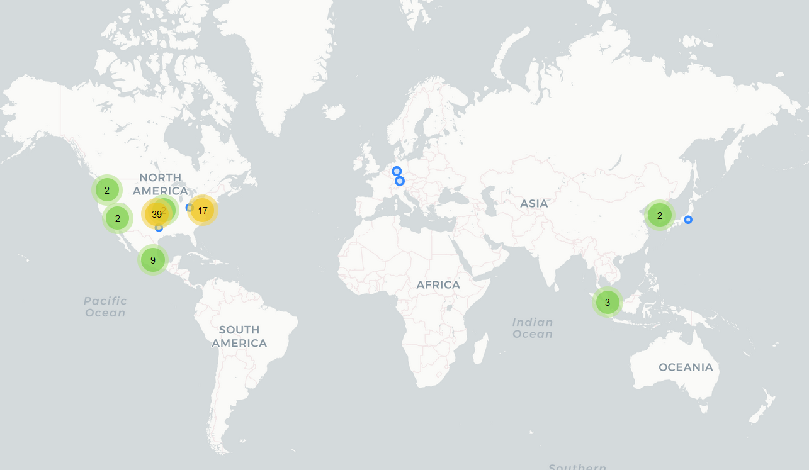

# Sticker.ly

## Fecha de análisis

- **Análisis estático (mediante Exodus Privacy/MobFS):** 31/10/2022
- **Análisis dinámico (mediante análisis de tráfico de red):** 02/11/2022
- **Análisis Posteriores:** 

## Links a los archivos analizados

- [Apk versión 2.8.2](https://cloud.datavoros.org/index.php/s/ZspzEapfsCFstfG)
- [Pcap versión 2.8.2](https://cloud.datavoros.org/index.php/s/TWBga3TmtfW8zYf)

## Descripción de la aplicación
- **Tipo:** Creador de stickers
- **Costo:** Gratis  
- **Link de descarga:** [https://play.google.com/store/apps/details?id=com.snowcorp.stickerly.android](https://play.google.com/store/apps/details?id=com.snowcorp.stickerly.android)
- **Descargas:** 100M+
- **Ultima fecha de actualización:** 03/10/2022
- **Versión:** 2.8.2
- **Desarrollador:** SNOW,Inc. (Es parte de [SNOW Corporation](https://snowcorp.com/en/))
- **Firma:** No está firmado o el certificado no cumple con las reglas de RFC
- **Contacto:** support@sticker.ly
- **Condiciones de uso y Política de privacidad:** [https://www.notion.so/stickerlyapp/Sticker-ly-Privacy-Policy-c40b0b551f9c442aaaa74fcc202a22a8](https://www.notion.so/stickerlyapp/Sticker-ly-Privacy-Policy-c40b0b551f9c442aaaa74fcc202a22a8) (Hay que tener una cuenta en Notion para poder acceder)
    
- **Descripción en PlayStore:**
~~~
Descubre millones de stickers divertidos de WhatsApp y crea tus propios stickers.
- Explora millones de stickers divertidos y úsalos en tus chats y tu estado
- Siga a sus creadores favoritos y obtenga nuevos stickers ahora
- Crea stickers de tus fotos con la nueva tecnología Auto Cut
- Exporta fácilmente tus stickers a WhatsApp (WAStickerApps)
- Comparte tus paquetes de stickers con amigos a través de enlaces personalizados
- Construya su marca y hágala crecer con Sticker.ly

Cómo crear un paquete de stickers para WhatsApp.
1. Nombra tu paquete de stickers.
2. Selecciona fotos y recorta stickers de tus fotos.
3. Elige títulos para personalizar tus stickers.
4. Exporta tus stickers a WhatsApp y envíalos a tus amigos.

¡Atento a las novedades de Sticker.ly!
- Sitio web oficial: http://www.sticker.ly
- Síguenos en Instagram: https://instagram.com/stickerly_official
- Sticker.ly Consulta: https://bit.ly/StickerlyInquiry

Tecnología de procesamiento de imágenes de SenseTime.

* Are you looking for funny WhatsApp animated stickers and video status?
Try this Sticker.ly app - Sticker Maker & Video Status for WhatApp and Telegram - including more than 500,000 animated sticker packs and thousands of video status! TV Shows & Movies, Celebrities & Models, Animals, Sports, Anime, Funny memes, Beautiful illustrations & Graphics, Lyrics, Quotes, Typo, Emojis and so on!

* Create WhatsApp Stickers with Sticker.ly - Sticker Maker & Video Status for WhatsApp and Telegram!
Sticker.ly is free animated sticker maker for WhatsApp and Telegram that can easily turn your photos into stickers. We are super smart and clean sticker maker app for WhatsApp and Telegram.

* Customize your stickers with WhatsApp Sticker Maker!
Sticker.ly is all-in-one sticker maker to customize stickers for WhatsApp and Telegram. You can adjust the position, size and angle of your sticker. You can also add captions on each sticker. With this WhatsApp sticker maker, you can create unlimited custom stickers for WhatsApp and Telegram.
~~~

## Trackers identificados (mediante Exodus Privacy)

|Tracker|Tipo|
|---|---| 
|[Adjust](https://www.adjust.com/)|Analítica y Retargeting|
|[Amazon Advertisement](https://advertising.amazon.com/)|Publicidad|
|[Facebook Ads](https://www.facebook.com/business/ads)|Publicidad|
|[Facebook Login](https://developers.facebook.com/docs/facebook-login)|Identificación|
|[Facebook Share](https://developers.facebook.com/docs/sharing)|Compartir|
|[Google AdMob](https://admob.google.com/home/)|Publicidad|
|[Google Crashlytics](https://firebase.google.com/docs/crashlytics/)|Rastreo de crashes|
|[Google Firebase Analytics](https://firebase.google.com/)|Analítica|
|[Inmobi](https://www.inmobi.com/)|Publicidad|
|[Moat](https://www.oracle.com/cx/advertising/measurement/analytics/)|Analítica y Publicidad|
|[Unity3dAds](https://unity.com/products/unity-ads)|Publicidad|

Enlace al [reporte](https://reports.exodus-privacy.eu.org/en/reports/307153/) de Exodus Privacy   

## Empresas relacionadas con esta aplicación

- [Snow Corporation](https://snowcorp.com/es_419/) - Dueño de la aplicación y desarrollador. Pertenece a [Line Corporation](https://en.wikipedia.org/wiki/Line_Corporation) y a su vez está relacionado con [Naver](https://www.navercorp.com/en/naver/company).
- [Alphabet](https://abc.xyz/) --> Google - Publicidad, Crashes, Analítica
- [Meta](https://about.facebook.com/ltam/meta/) --> Facebook
- [Unity](https://unity.com/) --> Unity3ads - Publicidad
- [Cloudflare](https://www.cloudflare.com/es-es/) - Data Storage
- [Oribi](https://oribi.io) --> [Linkedin](https://www.linkedin.com/) --> [Microsoft](https://www.microsoft.com/es-mx/about) - Marketing Analytics
- [Amazon](https://www.aboutamazon.com/) - Data Storage, Publicidad --> Amazon Advertisemet
- [Akamai](https://www.akamai.com/es) - CDN
- [Fastly](https://www.fastly.com/es/) - CDN
- [Stackpath](https://www.stackpath.com/) - CDN
- [Liftoff](https://liftoff.io/) --> Emparentada con [Vungle](https://vungle.com/) - Analítica, Monetización
- [Pixalate](https://www.pixalate.com/) - Publicidad, Analítica
- [Sentry](https://sentry.io/welcome/) - Monitoreo de crashes y performance
- [Intercom](https://www.intercom.com) - Ventas, Marketing
- [Moloco](https://www.moloco.com) - Machine Learning, Publicidad, Marketing
- [Loggly.com](https://www.loggly.com/) --> [SolarWinds](https://www.solarwinds.com/) - Análisis de Logs y Seguridad
- [Pubmatic](https://pubmatic.com/) - Publicidad
- [Marketo](https://www.marketo.com/) --> [Adobe](https://www.adobe.com) - Publicidad
- [Clearbit](https://clearbit.com/) - Marketing
- [DigitalOcean](https://www.digitalocean.com/products/spaces) - Data Storage, CDN
- [Tenor](https://tenor.com/about-us) - Proveedora de GIFs
- [Adjust](https://www.adjust.com/) --> [Applovin](https://www.applovin.com/)
- [Omniture](https://en.wikipedia.org/wiki/Omniture) --> [Adobe](https://www.adobe.com) - Marketing, Analytics, Publicidad
- [Notion](https://www.notion.so/) - Aviso de uso y de Privacidad (Compañía que ofrece Blocs de notas online)
- [Moat](https://www.moat.com/) --> [Oracle](https://www.oracle.com/) - Analítica, Publicidad
- [Unity](https://unity.com/products/unity-ads) - Publicidad

### Provedores de servicios de terceros para pagos, identificación y redes sociales

 - [Instagram](https://instagram.com) --> Meta
 - [Facebook](https://facebook.com) --> Meta
 - [Twitter](https://twitter.com)
 - [Whatsapp](https://www.whatsapp.com/?lang=es) --> Meta
 - [Telegram](https://telegram.org/)
 - [Snapchat](https://www.snapchat.com/)

### Dominios integrados al código de la app que no pertecen directamente a los trackers y que son de interés

- itunes.apple.com

## Permisos   

- **Según Exodus Privacy/MobFS:** 13
- **Según prueba de uso:** 0

### Permisos según Exodus Privacy

- ACCESS_NETWORK_STATE
_View network connections_

- ACCESS_WIFI_STATE
_View Wi-Fi connections_

- FOREGROUND_SERVICE
_run foregorund services_

- INTERNET
_Have full network access_

- POST_NOTIFICATIONS

- :exclamation:READ_EXTERNAL_STORAGE
_Read the contents of your shared storage_

- RECEIVE_BOOT_COMPLETED
_Run at startup_

- VIBRATE
_Control vibration_

- WAKE_LOCK
_Prevent phone from sleeping_

- :exclamation:WRITE_EXTERNAL_STORAGE
_Modify or delete the contents of your shared storage_

- RECEIVE

- BIND_GET_INSTALL_REFERRER_SERVICE

- AD_ID

El icono :exclamation: indica un nivel 'Peligroso' o 'Especial' de acuerdo a los [niveles de protección de Google](https://developer.android.com/guide/topics/permissions/overview). 

### Permisos solicitados durante el uso de la aplicación

Ninguno

## Datos

### Datos solicitados al usuario durante el uso de la aplicación

- Inicio de cuenta en Facebook (opcional)
- Inicio de cuenta en Google (opcional)

### Tabla de conexiones realizadas durante el uso de la aplicación

| Dirección       | Número de paquetes | País          | Ciudad         | Número AS | Organización AS             |Dominio |
|-----------------|--------------------|---------------|----------------|-----------|-----------------------------|--------|
| 3.141.92.115    |                294 | United States | Columbus       |     16509 | AMAZON-02                   |clearbit.com|
| 3.214.234.9     |                 51 | United States | Ashburn        |     14618 | AMAZON-AES                  |Pixalate|
| 8.8.4.4         |                470 | United States |                |     15169 | GOOGLE                      |
| 13.107.42.14    |                 67 | United States |                |      8068 | MICROSOFT-CORP-MSN-AS-BLOCK |
| 18.182.170.114  |                 44 | Japan         | Tokyo          |     16509 | AMAZON-02                   |
| 23.41.24.34     |                 37 | Mexico        | Mexico City    |     16625 | AKAMAI-AS                   |
| 23.41.24.188    |                 82 | Mexico        | Mexico City    |     16625 | AKAMAI-AS                   |
| 23.41.24.198    |              81715 | Mexico        | Mexico City    |     16625 | AKAMAI-AS                   |
| 31.13.89.19     |                 23 | Mexico        | Querétaro City |     32934 | FACEBOOK                    |
| 31.13.89.35     |                 59 | Mexico        | Querétaro City |     32934 | FACEBOOK                    |
| 34.120.195.249  |                117 | United States | Kansas City    |    396982 | GOOGLE-CLOUD-PLATFORM       |Sentry.io|
| 35.174.127.31   |                112 | United States | Ashburn        |     14618 | AMAZON-AES                  |intercom.io
| 44.235.0.194    |                 44 | United States | Boardman       |     16509 | AMAZON-02                   |
| 52.10.127.183   |                 68 | United States | Boardman       |     16509 | AMAZON-02                   |Loggly.com|
| 52.46.128.144   |                392 | United States | Ashburn        |     16509 | AMAZON-02                   |Amazon AdSystem|
| 52.46.143.56    |                 26 | United States | Ashburn        |     16509 | AMAZON-02                   |Amazon AdSystem|
| 52.46.151.128   |                223 | United States | Ashburn        |     16509 | AMAZON-02                   |Amazon AdSystem|
| 52.46.154.145   |                 45 | United States | Ashburn        |     16509 | AMAZON-02                   |Amazon AdSystem|
| 52.46.155.104   |                 26 | United States | Ashburn        |     16509 | AMAZON-02                   |Amazon AdSystem|
| 52.46.155.118   |                178 | United States | Ashburn        |     16509 | AMAZON-02                   |Amazon AdSystem|
| 52.94.224.25    |                 25 | United States | Ashburn        |     16509 | AMAZON-02                   |Amazon AdSystem|
| 52.94.236.25    |                 24 | United States | Ashburn        |     16509 | AMAZON-02                   |Amazon AdSystem|
| 54.83.134.198   |                 41 | United States | Ashburn        |     14618 | AMAZON-AES                  |Pixalate|
| 54.175.168.65   |                 72 | United States | Ashburn        |     14618 | AMAZON-AES                  |Intercom.io|
| 54.208.226.135  |                128 | United States | Ashburn        |     14618 | AMAZON-AES                  |
| 65.9.149.18     |                 60 | United States |                |     16509 | AMAZON-02                   |Linkedin, Oribi.io|
| 65.9.149.27     |                 53 | United States |                |     16509 | AMAZON-02                   |
| 65.9.149.36     |                240 | United States |                |     16509 | AMAZON-02                   |
| 65.9.149.51     |                200 | United States |                |     16509 | AMAZON-02                   |Liftoff.io
| 65.9.149.72     |                341 | United States |                |     16509 | AMAZON-02                   |Intercom.io
| 65.9.149.81     |                 38 | United States |                |     16509 | AMAZON-02                   |Pixalate
| 65.9.157.57     |                 88 | United States |                |     16509 | AMAZON-02                   |Amazon AdSystem|
| 104.18.6.183    |               6333 |               |                |     13335 | CLOUDFLARENET               |Notion|
| 104.18.7.183    |                563 |               |                |     13335 | CLOUDFLARENET               |Notion|
| 104.36.113.18   |                 29 | United States |                |     62713 | AS-PUBMATIC                 |Pubmatic
| 104.99.40.207   |                 37 | United States |                |     20940 | Akamai International B.V.   |Marketo.com|
| 107.178.251.134 |                 79 | United States | Kansas City    |     15169 | GOOGLE                      |Adsmoloco|
| 142.250.65.98   |                167 | United States |                |     15169 | GOOGLE                      |Admob|
| 142.250.65.138  |                 29 | United States |                |     15169 | GOOGLE                      |Firebase|
| 142.251.33.226  |                691 | United States |                |     15169 | GOOGLE                      |Admob|
| 142.251.34.2    |                252 | United States |                |     15169 | GOOGLE                      |Admob|
| 142.251.34.3    |                 39 | United States |                |     15169 | GOOGLE                      |
| 142.251.34.10   |               1404 | United States |                |     15169 | GOOGLE                      |Firebase, Tenor.com|
| 142.251.34.14   |                 54 | United States |                |     15169 | GOOGLE                      |AppMeasurement|
| 142.251.34.33   |                129 | United States |                |     15169 | GOOGLE                      |
| 142.251.34.34   |                 23 | United States |                |     15169 | GOOGLE                      |Tenor.com|
| 142.251.34.42   |                 53 | United States |                |     15169 | GOOGLE                      |Firebase|
| 142.251.34.130  |                147 | United States |                |     15169 | GOOGLE                      |
| 142.251.34.131  |                 25 | United States |                |     15169 | GOOGLE                      |
| 142.251.34.138  |                100 | United States |                |     15169 | GOOGLE                      |Firebase|
| 142.251.34.170  |                166 | United States |                |     15169 | GOOGLE                      |Firebase, Tenor.com|
| 142.251.34.202  |                 46 | United States |                |     15169 | GOOGLE                      |Firebase, Tenor.com|
| 142.251.34.226  |                 26 | United States |                |     15169 | GOOGLE                      |
| 142.251.34.232  |                194 | United States |                |     15169 | GOOGLE                      |Tagmanager|
| 142.251.34.234  |                 26 | United States |                |     15169 | GOOGLE                      |Firebase, Tenor.com|
| 142.251.34.238  |                 34 | United States |                |     15169 | GOOGLE                      |App Measurement|
| 157.240.25.1    |                100 | Mexico        | Querétaro City |     32934 | FACEBOOK                    |
| 157.240.25.13   |                183 | Mexico        | Querétaro City |     32934 | FACEBOOK                    |
| 172.64.154.24   |               2147 | United States |                |     13335 | CLOUDFLARENET               |Notion/Stickerly|
| 172.217.2.130   |                 43 | United States |                |     15169 | GOOGLE                      |Firebase|
| 172.217.2.131   |                 49 | United States |                |     15169 | GOOGLE                      |
| 173.223.108.206 |                370 | United States | Dallas         |     16625 | AKAMAI-AS                   |Stickerly|
| 185.151.204.6   |                 74 | United States |                |     61273 | Adjust GmbH                 |
| 185.151.204.13  |                 26 | United States |                |     61273 | Adjust GmbH                 |
| 189.247.217.16  |                 39 | Mexico        |                |     20940 | Akamai International B.V.   |Linkedin
| 189.247.217.48  |                 45 | Mexico        |                |     20940 | Akamai International B.V.   |LinkedIn
| 192.28.147.68   |                 39 | United States |                |     15224 | OMNITURE                    |marketo.com|
| 199.232.210.110 |                 94 | United States |                |     54113 | FASTLY                      |AdsMoloco|
| 203.104.164.20  |               2298 | Singapore     |                |     23576 | NAVER Cloud Corp.           |Stickerly|
| 203.104.166.47  |               7316 | Singapore     |                |     23576 | NAVER Cloud Corp.           |
| 203.104.167.129 |               1884 | Singapore     |                |     23576 | NAVER Cloud Corp.           |
| 205.185.216.10  |                150 | United States |                |     20446 | STACKPATH-CDN               |Inmobi, Digitaloceanspaces.com|
| 205.185.216.42  |                 42 | United States |                |     20446 | STACKPATH-CDN               |Inmobi, Digitalocenspaces.com, Highwinds|
| 209.54.180.61   |                307 | United States | Ashburn        |     16509 | AMAZON-02                   |Amazon AdSystem
| 209.54.180.72   |                108 | United States | Ashburn        |     16509 | AMAZON-02                   |Amazon AdSystem|
| 209.54.181.15   |                 37 | United States | Ashburn        |     16509 | AMAZON-02                   |Amazon AdSystem|
| 209.54.181.42   |                229 | United States | Ashburn        |     16509 | AMAZON-02                   |amazon AdSytem|
| 210.89.168.190  |                 18 | South Korea   |                |     23576 | NAVER Cloud Corp.           |SNOW|
| 210.89.168.191  |                159 | South Korea   |                |     23576 | NAVER Cloud Corp.           |SNOW|
| 216.58.195.234  |                 24 | United States |                |     15169 | GOOGLE                      |
| 216.58.195.238  |                 29 | United States |                |     15169 | GOOGLE                      |

**La columna de Dominio son solicitudes de conexión de la aplicación establecidas a través del DNS. Conocer esto no siempre es posible, ya que muchas veces dichas comunicaciones están cifradas. Sólo ennumeramos aquellas que tienen un interés puntual para este proyecto, a saber, rastreadores y empresas no relacionadas con los rastreadores.**

### Mapa de conexiones realizadas durante el uso de la aplicación

### Datos compartidos y uso según la Playstore:
|Datos|Uso|
|---|---|
|Interacciones en la aplicación|Funcionalidad de la aplicación y análisis|
|Otras acciones|Funcionalidad de la aplicación y anális|
|ID's de dispotivo o de otro tipo|Funcionalidad de la aplicación y análisis|

### Datos recopilados y uso según la Playstore

|Datos|Uso|
|---|---|
|Nombre|Funcionalidad de la aplicación|
|Correo electrónico (opcional)|Gestión de cuentas|
|ID's de usuario|Funcionalidad de la aplicación, Prevención de fraudes, seguridad y cumplimiento y Gestión de cuentas|
|Otra información (opcional)|Funcionalidad de la aplicación|
|Fotos(opcional)|Funcionalidad de la aplicación, Análisis y Prevención de fraudes, seguridad y cumplimiento|
|Videos(opcional)|Funcionalidad de la aplicación, Análisis y Prevención de fraudes, seguridad y cumplimiento|
|Interacciones con la aplicación|Análisis|
|Aplicaciones instaladas|Análisis|
|Otro contenido generado por usuarios (opcional)|Funcionalidad de la aplicación|
|Otras acciones (opcional)|Funcionalidad de la aplicación|
|Registro de fallos(opcional)|Análisis|
|Diagnósticos(opcional)|Análisis|
|ID's de dispositivo o de otro tipo|Funcionalidad de la aplicación, Análisis, Prevención de fraudes, seguridad y cumplimiento, Personalización y Gestión de cuentas|

### Prácticas de seguridad

- Los datos se cifran en tránsito
- Puedes solicitar que se eliminen los datos

### Datos recopilados y uso según la Política de privacidad

|Datos|Uso|
|---|---|
|:bangbang:Nombre|Funcionalidad|
|:bangbang:Nombre de usuario|Funcionalidad|
|:bangbang:email|Funcionalidad|
|:bangbang:Información de cuentas de social media|Funcionalidad|
|:bangbang:Foto de perfil|Funcionalidad|
|Estadísticas de uso de la aplicación que pueden incluir: hora, fecha, stickers vistos, stickers creados, y los logs correspondientes generados por la app|Funcionalidad|
|Información derivada de cruzar los datos de uso, identificación y otros|Funcionalidad|
|Información sobre el dispositivo: modelo, sistema operativo y versión, explorador, idioma, información de la red, apps instaladas|Funcionalidad y crashes|
|

### Datos compartidos según la Política de privacidad
|Datos|Uso|¿Con quién?|
|---|---|---|
|App ID, Token de acceso y URL|Funcionlidad|Social Media|
|:bangbang:Nombre, Nombre de usuario, imagen de perfil, contenido generado por el usuario|Funcionalidad|Otros usuarios|
|Información no especificada|No se especifica|Otras entidades dentro de SNOW Corp|
|Información no especificada|Funcionalidad|Terceros contratados por ellos para ofrecer parte del servicio|
|Información no especificada|Por Ley|Agencias de seguridad|

- No recopilan identificadores únicos como IMEI o MAC
- Dicen que no usan trackers o cookies que no sean Google Analytics y Adjust
- El acceso a cámara y video es exclusivamente para funcionalidad de la aplicación
- :bangbang:Mantienen la información recogida hasta que se pide eliminar de manera explícita

*El ícono :bangbang: denota, lo que creemos que es algo importante a tomar en cuenta sobre la privacidad del usuario.*
        

### Notas importantes sobre seguridad y privacidad:

- Esta app no tiene problemas de seguridad flagrantes. 
- Recomendamos no iniciar sesión en esta aplicación para no otorgar datos extras. 

## Conclusiones

- El ecosistema alrededor de esta aplicación pertenciente a todas las empresas que guardan, transmiten y minan los datos, es enorme. Es muy difícil de rastrear y resulta sorprendente la cantidad de empresas involucradas de las cuales el usuario no sabe absolutamente nada. 
