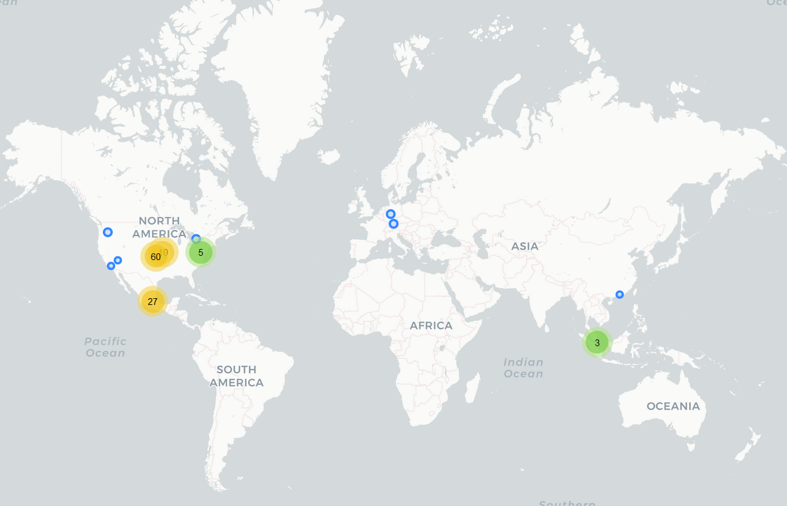

# Sweet Selfie- Cámara & Editor

## Fecha de análisis

- **Análisis estático (mediante Exodus Privacy/MobFS):** 02/11/2022
- **Análisis dinámico (mediante análisis de tráfico de red):** 02/11/2022
- **Análisis Posteriores:** 

## Links a archivos analizados:

- [Apk versión 5.1.1493](https://cloud.datavoros.org/index.php/s/APgw9QzaMPr7kEx)
- [Pcap versión 5.1.1493](https://cloud.datavoros.org/index.php/s/dWaxwkSpaTpRk8p)

## Descripción de la aplicación
- **Tipo:** Editor de fotos, creador de stickers, videos
- **Costo:** Freemium 
- **Link de descarga:** [https://play.google.com/store/apps/details?id=com.cam001.selfie](https://play.google.com/store/apps/details?id=com.cam001.selfie)
- **Descargas:** 100M+
- **Ultima fecha de actualización:** 18/10/2022
- **Versión:** 5.1.1493
- **Desarrollador:** http://www.ufotosoft.com
- **Firma:** Thundersoft
- **Contacto:** support@ufotosoft.com
- **Condiciones de uso y Política de privacidad:** [http://res.ufotosoft.com/aboutus/src/selfie.policy.html](http://res.ufotosoft.com/aboutus/src/selfie.policy.html)
    
- **Descripción en PlayStore:**
~~~
Imagen de icono
Cámara & Editor - Sweet Selfie
Información de la aplicación
🔥 ¡Top 3 en Google Play en más de 40 países!
📷 La mejor aplicación de cámara de belleza y editor de fotos 2021
😍 300,000,000 usuarios en todo el mundo se toman selfies todos los días con Sweet Selfie

Sweet Selfie - cámara con filtros de belleza y El editor de fotos para editar fotos todo en uno con efectos para fotos. La cámara de belleza funciona al instante para aplicar make up a tus selfies. Editar será más facil y rápido con las magníficas herramientas de edición y cámara con filtros para fotos gratis. puede eliminar las espinillas y el acné, suavizar la piel, aclarar los ojos, blanquear los dientes, cambiar el color de la piel, agregar filtros faciales y efectos fotográficos de maquillaje, desenfocar el fondo de las fotos y mucho más. ¡Comparte tus selfies perfectas en Instagram, Facebook, Whatsapp, Telegram, Snapchat, Tik Tok, Tumblr, Flickr, Twitter y Pinterest!

📸
Cámara de belleza con filtros y efectos

• ¡El fabuloso editor y cámara con filtros proporciona una hermosa selfie instantánea usando diversos filtros y efectos directamente en tu rostro!
• ¡La cámara de belleza con make up suaviza tu rostro y suaviza tu piel al instante! Cara fácil de adelgazar, eliminar el acné incluso blanquear los dientes.

💋
Editor de rostro foto

• Eliminar acné: ¡Elimina el acné y otros problemas de la piel como espinillas y puntos negros fácilmente en cada foto!
• Blanqueador de dientes: ¡Nuestra cámara de belleza con filtros elimina los dientes amarillos fácilmente para tener una sonrisa brillante con dientes blancos!
• Suavizador de piel: ¡Dale belleza a tu rostro con los efectos para fotos de tonalidades y suavizador la piel para un rostro hermoso!
• Maquillaje personalizado: Retoca selfies con una super cámara con filtros de maquillaje de belleza. Elige un color de labios entre la paleta del foto editor, agrega estilos de rímel y obtén ojos impresionantes en todas tus selfies.
• Estilizador de labios: Afina tus labios, dales volumen o tu estilo favorito, aplica lápiz labial, gloss o brillo y voilá! Una selfie perfecta.
• Cambiador de color de piel: cambie el color de piel / tono de piel para que se vea más joven.

💯
Editor de fotos profissional

• Cortar pegar editor de fotos: recorta / recorta el fondo de la foto y cambia el fondo de la foto.
• Borrão na foto: el cambiador de borrador de fondo es un borrador automático de foto de fondo
• Blur imagem: elija un efecto de desenfoque radical y lineal para desenfocar el fondo de la imagem con un toque.
• Filtros de fotos: efectos para fotos brillantes y elegantes filtros de fotos para alegrar su día. Acceso rápido a tus filtros de fotos favoritos e filtros do instagram.
• Efectos para fotos: una biblioteca completa de filtros de fotos artísticos y filtros de cámara para imágenes, filtros de fotos, marcos fotográficos, efecto de desenfoque de fondo, bordes blancos y más. Efectos para fotos de alta calidad perfectos para selfies o cualquier ocasión.

🖼️
Creador de collage de fotos

• Toneladas de plantillas preestablecidas gratuitas.
• Crear muchas imagenes increíbles con espirales de neón efecto de para diseñar tu collage.
• Puedes elegir el diseño que más te guste, editar collage con filtro, fondo, pegatinas, texto y mucho más.

Sweet Selfie es la app para editar fotos que estabas buscando, cámara con filtros, diseños, efectos y filtros profesionales. No olvides usar nuestro foto editor con tus imagenes favoritas y compartir tus diseños en Facebook, Telegram, Whatsapp, Snapchat, TikTok, Tumblr, Flickr, Twitter y Pinterest.

📞 CONTÁCTENOS
Facebook ： @Sweet Selfie
Instagram: @Sweetselfie_official
Youtube ： @Sweet Selfie
Correo electrónico: support@ufotosoft.com
~~~

## Trackers identificados (mediante Exodus Privacy)

|Tracker|Tipo|
|---|---|
|[Adjust](https://www.adjust.com/)|Analítica y Retargeting|
|[Amazon Advertisement](https://advertising.amazon.com/)|Publicidad
|[AppLovin](https://www.applovin.com/)| Publicidad, Analítica, Identificación, Perfilamiento|
|[Facebook Ads](https://www.facebook.com/business/ads)|Publicidad|
|[Facebook Analytics](https://developers.facebook.com/docs/app-events)|Analítica|
|[Facebook Login](https://developers.facebook.com/docs/facebook-login)|Identificación|
|[Facebook Share](https://developers.facebook.com/docs/sharing)|Compartir|
|[Google AdMob](https://admob.google.com/home/)|Publicidad|
|[Google Crashlytics](https://firebase.google.com/docs/crashlytics/)|Rastreo de crashes|
|[Google Firebase Analytics](https://firebase.google.com/)|Analítica|
|[IAB Open Measurement](https://iabtechlab.com/standards/open-measurement-sdk/)|Identificación, Publicidad|
|[Inmobi](https://www.inmobi.com/)|Publicidad|
|[Pangle](https://www.pangleglobal.com/)|Publicidad|

- Creemos que existe otro tracker en esta aplicación com.bytedance.sdk que, de todos modos, está relacionado con el tracker de Pangle y pertence a [Bytedance]([ByteDance](https://www.bytedance.com/en/)). 
- También creemos que el dominio anythinktech.com, perteneciente a [Alibaba]([Alibaba](https://www.alibaba.com/)), es usado para recibir información del usuario como las aplicaciones instaladas, sim, ubicación, etc. de tal manera que pertence a un tracker. 

Enlace al [reporte](https://reports.exodus-privacy.eu.org/en/reports/com.cam001.selfie/latest/) de Exodus Privacy   

## Empresas relacionadas con esta aplicación

- [Ufotosoft](https://ufotosoft.com/en/about_en.html) --> [Wondershare](https://www.wondershare.com/)
- [Alphabet](https://abc.xyz/) --> Google - Publicidad, Crashes, Analítica
- [Adjust](https://www.adjust.com/) - Analítica
- [Meta](https://about.facebook.com/ltam/meta/) --> Facebook
- [Amazon](https://www.aboutamazon.com/) - Data Storage, Publicidad
- [Akamai](https://www.akamai.com/es) - CDN, Data Storage
- [Liftoff](https://liftoff.io/) --> Emparentada con [Vungle](https://vungle.com/) - Analítica, Monetización
- [Moat](https://www.moat.com/) --> [Oracle](https://www.oracle.com/) - Analítica, Publicidad
- [Mozilla](https://www.mozilla.org/)
- [Pangle](https://www.pangleglobal.com/) --> [TikTok](https://www.tiktok.com/) --> [ByteDance](https://www.bytedance.com/en/) - Publicidad
- [Alibaba](https://www.alibaba.com/) - CDN, Data Storage
- [AnythinkTech](https://www.anythinktech.com) --> [Alibaba](https://www.alibaba.com/)
- [AppLovin](https://www.applovin.com/) - Analítica, Monetización, Publicidad
- [IAB Open Measurement](https://iabtechlab.com/standards/open-measurement-sdk/) - Publcidad, Analítica
- [Inmobi](https://www.inmobi.com/) - Publicidad
- [Uninet](https://es.wikipedia.org/wiki/Telmex) --> [Telmex](https://www.telmex.com/) - Data Storage
- [CasaleMedia](https://www.casalemedia.com/) - Publicidad
- [Kochava](https://www.kochava.com/) - Analítica, Publicidad, Marketing
- [OpenX](https://www.openx.com/) - Publicidad
- [Teads](https://www.teads.com/) - Publicidad
- [AppNexus](https://www.appnexustech.com/) - Desarrollo de Software
- [Tencent](https://www.tencent.com) - Content provider

### Provedores de servicios de terceros para pagos, identificación y redes sociales

 - [Instagram](https://instagram.com) --> Meta
 - [Facebook](https://facebook.com) --> Meta

### Dominios integrados al código de la app que no pertecen directamente a los trackers y que son de interés

- adx.anythinktech.com
- da.anythinktech.com - Marcado como Malware por [Maltrail](https://github.com/stamparm/maltrail)
- [wiseoel.com](http://wiseoel.com/)
- [rayjump.com](http://www.rayjump.com/)
- [appsflyer.com](https://www.appsflyer.com/)
- [toponad.com](https://www.toponad.com/en) 

## Permisos   

- **Según Exodus Privacy/MobFS:** 21
- **Según prueba de uso:** 3

### Permisos según Exodus Privacy

- ACCESS_NETWORK_STATE
_View network connections_

- ACCESS_WIFI_STATE
_View Wi-Fi connections_

- :camera::exclamation:CAMERA
_Take pictures and videos_

- FLASHLIGHT

- FOREGROUND_SERVICE
_run foregorund services_

- INTERNET
_Have full network access_

- KILL_BACKGROUND_PROCESS
_Close other apps_

- POST_NOTIFICATIONS

- :exclamation:READ_EXTERNAL_STORAGE
_Read the contents of your shared storage_

- RECEIVE_BOOT_COMPLETED
_Run at startup_

- :microphone:.exclamation:RECORD_AUDIO
_Record audio_

- VIBRATE
_Control vibration_

- WAKE_LOCK
_Prevent phone from sleeping_

- :exclamation:WRITE_EXTERNAL_STORAGE
_Modify or delete the contents of your shared storage_

- INSTALL_SHORTCUT
_Install shortcuts_

- READ_SETTINGS

- BILLING

- RECEIVE

- BIND_GET_INSTALL_REFERRER_SERVICE

- AD_ID

- READ_GSERVICES

El icono :exclamation: indica un nivel 'Peligroso' o 'Especial' de acuerdo a los [niveles de protección de Google](https://developer.android.com/guide/topics/permissions/overview). 

### Permisos solicitados durante el uso de la aplicación

- :red_circle: Acceso a Fotos y Multimedia 
- :red_circle: Acceso a tomar fotos y grabar video
- :red_circle: Grabar audio para videos

:red_circle: Este ícono indica un permiso obligatorio   
:blue_circle: Este ícono indica un permiso opcional pero se pierde una funcionalidad particular

## Datos

### Datos solicitados al usuario durante el uso de la aplicación

- Ninguno

### Tabla de conexiones realizadas durante el uso de la aplicación

| Dirección       | Número de paquetes | País          | Ciudad         | Número AS | Organización AS                       |Dominio o tracker contactado|
|-----------------|--------------------|---------------|----------------|-----------|---------------------------------------|---|
| 8.219.3.226     |                161 | Singapore     |                |     45102 | Alibaba US Technology Co., Ltd.       |Anythinktech.com|
| 8.219.105.74    |                 75 | Singapore     |                |     45102 | Alibaba US Technology Co., Ltd.       |Anythinktech.com|
| 18.235.204.9    |                177 | United States | Ashburn        |     14618 | AMAZON-AES                            |Liftoff.io|
| 23.41.25.55     |                 53 | Mexico        | Mexico City    |     16625 | AKAMAI-AS                             |Moat, Teads|
| 23.41.25.152    |                165 | Mexico        | Mexico City    |     16625 | AKAMAI-AS                             |Moat
| 31.13.89.19     |                230 | Mexico        | Querétaro City |     32934 | FACEBOOK                              |
| 31.13.89.35     |                 26 | Mexico        | Querétaro City |     32934 | FACEBOOK                              |
| 34.107.221.82   |                 34 | United States | Kansas City    |     15169 | GOOGLE                                |
| 34.110.179.88   |                153 | United States | Kansas City    |     15169 | GOOGLE                                |AppLovin|
| 34.117.237.239 |                 39 | United States | Kansas City    |    396982 | GOOGLE-CLOUD-PLATFORM                 |Mozilla|
| 34.120.175.182 |                611 | United States | Kansas City    |    396982 | GOOGLE-CLOUD-PLATFORM                 |AppLovin|
| 34.149.159.73   |                232 | United States | Kansas City    |     15169 | GOOGLE                                |AppLovin|
| 34.160.119.165 |                 77 | United States | Kansas City    |     15169 | GOOGLE                                |AppLovin
| 34.160.254.144 |                 49 | United States | Kansas City    |     15169 | GOOGLE                                |AppLovin|
| 34.224.219.197 |                120 | United States | Ashburn        |     14618 | AMAZON-AES                            |Liftoff.io|
| 35.153.165.166 |                 25 | United States | Ashburn        |     14618 | AMAZON-AES                            |Liftoff.io|
| 35.186.207.75   |                 54 | United States | Kansas City    |     15169 | GOOGLE                                |kochava.com|
| 35.227.249.185 |               1242 | United States | Kansas City    |     15169 | GOOGLE                                |Applovin|
| 35.244.159.8    |                 71 | United States | Kansas City    |     15169 | GOOGLE                                |OpenX.com|
| 47.115.0.205    |                 22 | China         | Shenzhen       |     37963 | Hangzhou Alibaba Advertising Co.,Ltd. |Anythinktech.com|
| 52.89.255.30    |                 12 | United States | Boardman       |     16509 | AMAZON-02                             |
| 54.209.11.84    |                 57 | United States | Ashburn        |     14618 | AMAZON-AES                            |Anythinktech.com|
| 65.9.149.3      |                 32 | United States |                |     16509 | AMAZON-02                             |
| 65.9.149.7      |                584 | United States |                |     16509 | AMAZON-02                             |Ufotosoft|
| 65.9.149.24     |                 71 | United States |                |     16509 | AMAZON-02                             |
| 65.9.149.40     |                147 | United States |                |     16509 | AMAZON-02                             |Ufotosoft|
| 65.9.149.44     |                865 | United States |                |     16509 | AMAZON-02                             |Ufotosoft|
| 65.9.149.45     |                542 | United States |                |     16509 | AMAZON-02                             |Ufotosoft|
| 65.9.149.48     |                132 | United States |                |     16509 | AMAZON-02                             |Ufotosoft
| 65.9.149.61     |                 30 | United States |                |     16509 | AMAZON-02                             |Ufotosoft.com|
| 65.9.149.80     |                126 | United States |                |     16509 | AMAZON-02                             |Ufotosoft|
| 65.9.149.96     |                148 | United States |                |     16509 | AMAZON-02                             |Ufotosoft|
| 65.9.149.98     |               1975 | United States |                |     16509 | AMAZON-02                             |Liftoff.io|
| 65.9.149.103    |                121 | United States |                |     16509 | AMAZON-02                             |impression.link --> Mozilla|
| 65.9.149.108    |                499 | United States |                |     16509 | AMAZON-02                             |Ufotosoft|
| 65.9.149.110    |                188 | United States |                |     16509 | AMAZON-02                             |Ufotosoft|
| 65.9.149.123    |                361 | United States |                |     16509 | AMAZON-02                             |
| 65.9.149.124    |               1694 | United States |                |     16509 | AMAZON-02                             |Liftoff.io|
| 65.9.156.190    |                710 | United States |                |     16509 | AMAZON-02                             |
| 104.254.150.228 |                 95 | United States | Los Angeles    |     29990 | ASN-APPNEX                            |
| 107.21.8.75     |                266 | United States | Ashburn        |     14618 | AMAZON-AES                            |Anythinktech.com|
| 108.177.12.188  |                  4 | United States |                |     15169 | GOOGLE                                |
| 142.250.65.98   |                 95 | United States |                |     15169 | GOOGLE                                |
| 142.250.65.102  |                 72 | United States |                |     15169 | GOOGLE                                |AdMob|
| 142.250.65.106  |                107 | United States |                |     15169 | GOOGLE                                |
| 142.250.65.138  |                 25 | United States |                |     15169 | GOOGLE                                |Firebase|
| 142.250.81.65   |                134 | United States |                |     15169 | GOOGLE                                |
| 142.250.81.74   |                103 | United States |                |     15169 | GOOGLE                                |Firebase|
| 142.250.115.101 |                 53 | United States |                |     15169 | GOOGLE                                |Youtube|
| 142.250.186.35  |                 54 | United States |                |     15169 | GOOGLE                                |
| 142.251.33.225  |                555 | United States |                |     15169 | GOOGLE                                |
| 142.251.33.226  |                230 | United States |                |     15169 | GOOGLE                                |AdMob|
| 142.251.34.2    |                193 | United States |                |     15169 | GOOGLE                                |AdMob
| 142.251.34.3    |                 62 | United States |                |     15169 | GOOGLE                                |Firebase|
| 142.251.34.10   |                287 | United States |                |     15169 | GOOGLE                                |Firebase|
| 142.251.34.14   |                 59 | United States |                |     15169 | GOOGLE                                |
| 142.251.34.35   |                591 | United States |                |     15169 | GOOGLE                                |
| 142.251.34.46   |                 65 | United States |                |     15169 | GOOGLE                                |
| 142.251.34.129  |                 34 | United States |                |     15169 | GOOGLE                                |
| 142.251.34.131  |                154 | United States |                |     15169 | GOOGLE                                |
| 142.251.34.142  |                 94 | United States |                |     15169 | GOOGLE                                |
| 142.251.34.161  |                293 | United States |                |     15169 | GOOGLE                                |
| 142.251.34.162  |               2616 | United States |                |     15169 | GOOGLE                                |AdMob|
| 142.251.34.163  |                239 | United States |                |     15169 | GOOGLE                                |
| 142.251.34.194  |                224 | United States |                |     15169 | GOOGLE                                |AdMob|
| 142.251.34.202  |                 19 | United States |                |     15169 | GOOGLE                                |
| 142.251.34.206  |                 36 | United States |                |     15169 | GOOGLE                                |
| 142.251.34.225  |                 34 | United States |                |     15169 | GOOGLE                                |
| 142.251.34.226  |                702 | United States |                |     15169 | GOOGLE                                |AdMob|
| 142.251.34.227  |                218 | United States |                |     15169 | GOOGLE                                |
| 142.251.34.230  |                674 | United States |                |     15169 | GOOGLE                                |
| 142.251.34.238  |                 34 | United States |                |     15169 | GOOGLE                                |
| 142.251.35.2    |                 45 | United States |                |     15169 | GOOGLE                                |AdMob
| 142.251.35.10   |                 25 | United States |                |     15169 | GOOGLE                                |Firebase|
| 157.240.25.35   |                 29 | Mexico        | Querétaro City |     32934 | FACEBOOK                              |
| 161.117.225.180 |                673 | Singapore     | Singapore      |     45102 | Alibaba US Technology Co., Ltd.       |Anythinktech.com|
| 172.217.2.35    |                 66 | United States |                |     15169 | GOOGLE                                |
| 172.217.2.138   |                237 | United States |                |     15169 | GOOGLE                                |Firebase|
| 172.217.4.162   |                129 | United States |                |     15169 | GOOGLE                                |
| 172.217.15.3    |                 73 | United States |                |     15169 | GOOGLE                                |crashlytics|
| 172.217.15.14   |                104 | United States |                |     15169 | GOOGLE                                |
| 172.217.30.195  |                111 | United States |                |     15169 | GOOGLE                                |
| 185.151.204.7   |                396 | United States |                |     61273 | Adjust GmbH                           |
| 189.247.22.18   |                191 | Mexico        |                |      8151 | Uninet S.A. de C.V.                   |
| 189.247.22.19   |                240 | Mexico        |                |      8151 | Uninet S.A. de C.V.                   |GoogleVideo|
| 189.247.22.77   |                144 | Mexico        |                |      8151 | Uninet S.A. de C.V.                   |Google Video|
| 189.247.22.80   |               2021 | Mexico        |                |      8151 | Uninet S.A. de C.V.                   |Google Video|
| 189.247.197.9   |                 27 | Mexico        |                |     20940 | Akamai International B.V.             |Pangle.io|
| 189.247.197.10  |                464 | Mexico        |                |     20940 | Akamai International B.V.             |Pangle.com|
| 189.247.197.11  |                 35 | Mexico        |                |     20940 | Akamai International B.V.             |Pangle.com|
| 189.247.197.18  |               1004 | Mexico        |                |     20940 | Akamai International B.V.             |Pangle.io|
| 189.247.197.19  |                421 | Mexico        |                |     20940 | Akamai International B.V.             |Pangle.io|
| 189.247.197.24  |                961 | Mexico        |                |     20940 | Akamai International B.V.             |Pangle.io|
| 189.247.217.10  |                116 | Mexico        |                |     20940 | Akamai International B.V.             |
| 189.247.217.17  |                966 | Mexico        |                |     20940 | Akamai International B.V.             |
| 189.247.217.24  |               2307 | Mexico        |                |     20940 | Akamai International B.V.             |Pangle.com, Bytedance|
| 189.247.217.25  |                628 | Mexico        |                |     20940 | Akamai International B.V.             |
| 189.247.217.26  |                861 | Mexico        |                |     20940 | Akamai International B.V.             |Bytedance
| 189.247.217.57  |                239 | Mexico        |                |     20940 | Akamai International B.V.             |
| 189.247.217.58  |                 69 | Mexico        |                |     20940 | Akamai International B.V.             |
| 189.247.217.147 |                 84 | Mexico        |                |     20940 | Akamai International B.V.             |TikTok|
| 189.247.217.160 |                 38 | Mexico        |                |     20940 | Akamai International B.V.             |TikTok|
| 189.247.217.178 |                 50 | Mexico        |                |     20940 | Akamai International B.V.             |TikTok|
| 189.247.217.192 |                 74 | Mexico        |                |     20940 | Akamai International B.V.             |TikTok|
| 189.247.217.232 |                 30 | Mexico        |                |     20940 | Akamai International B.V.             |
| 192.40.32.241   |                 87 | Canada        |                |     27381 | CASALE-MEDIA                          |
| 209.85.200.120  |                166 | United States |                |     15169 | GOOGLE                                |
| 216.58.195.238  |                138 | United States |                |     15169 | GOOGLE                                |
| 216.58.217.2    |                108 | United States |                |     15169 | GOOGLE                                |Admob|

**Los dominios o trackers contactados son solicitudes de conexión de la aplicación establecidas a través del DNS. Conocer esto no siempre es posible, ya que muchas veces dichas comunicaciones están cifradas. Sólo ennumeramos aquellas que tienen un interés puntual para este proyecto, a saber, trackers y empresas no relacionadas con los trackers.**

### Mapa de conexiones realizadas durante el uso de la aplicación

### Datos compartidos y uso según la Playstore:
|Datos|Uso|
|---|---|
|Interacciones en la aplicación|Análisis|
|Registro de fallos|Análisis|
|Diagnóstico|Análisis
|Otros datos de rendimiento de aplicaciones|Análisis|
|ID's de dispotivo o de otro tipo|Análisis y Publicidad o Marketing|   
   
   
### Datos recopilados y uso según la Playstore

|Datos|Uso|
|---|---|
|Interacciones en la aplicación|Análisis|
|Registro de fallos|Análisis|
|Diagnóstico|Análisis|
|Otros datos de rendimiento de aplicaciones|Análisis|
|ID's de dispotivo o de otro tipo|Análisis y Publicidad o Marketing|

### Prácticas de seguridad

- Los datos se cifran en tránsito
- Los datos no se pueden eliminar

### Datos recopilados y uso según la Política de privacidad

|Datos|Uso|
|---|---|
|:bangbang:Información proporcionada por el usuario: credenciales de login, fecha de nacimiento e identidad de género|Funcionalidad, Seguridad,|
|:bangbang:Información proporcionada por el usuario cuando se completa el perfil: personalidad, estilo de vida, intereses, fotos y videos|Funcionalidad|
|:bangbang: Información de pago: número de tarjeta de crédito y otra información financiera|Funcionalidad|
|Información si el usuario decide participar en encuestas, grupos de control, eventos y promociones|Funcionalidad|
|Información proporcionada por el usuario si contacta al servicio de atención al cliente|Mejoras del servicio|
|Información de otros usuarios o personas contactadas por el usuario|Funcionalidad|
|Fotos y videos|Funcionalidad|
|Ubicación|Funcionalidad|
|Información recibida por terceros (otros usuarios, social media, otros servicios, ubicación)|Funcionalidad y Publicidad|
|Información de uso y analítica|Mejoras del servicio, Publicidad|
|Información del dispositivo: modelo, sistema operativo y versión, identificadores únicos como MAC e IMEI, tipo de explorador, número de celular, información de la red móvil, otras apps instaladas|Mejoras en el servicio, Crashes|
|Metadata de fotos y videos|Reconocimiento facial y otras funcionalidades de la aplicación para la edición de fotos y videos|

### Datos compartidos según la Política de privacidad
|Datos|Uso|¿Con quién?|
|---|---|---|
|:bangbang:Información compartida voluntariamente con otros usuarios|Funcionlidad|Otros usuarios|
|Información necesesaria con servicios de terceros|Funcionalidad|Plataformas de Data Storage, Analítica, Satisfacción del cliente, Publicidad, Procesamiento de pagos y Seguridad|
|Información con otras empresas emparentadas a Ufoto|Funcionalidad|Data Storage, Analítica, Satisfacción del cliente, Publicidad, Procesamiento de pagos y Seguridad|
|Información necesaria para transacciones empresariales|Compra y Venta de empresas|Empresas que puedan adquirir el servicio de SweetSelfie y otros|
|Información anonimizada|Perfilamiento para publicidad|Terceros|

- No se puede eliminar la información recolectada a solicitud del usuario, pero si este elimina su cuenta, esta se retiene por 12 meses aunque, especifican, este lapso puede ser menor o mayor debido a requerimientos técnicos.
- Los datos otorgados para transacciones pagadas se mantienen por 6 años. 
- Existe la transferencia de datos entre jurisdicciones y países.
- Tienen una lista de los terceros con los que trabajan:
    - Plataformas de publicidad:

    Admob [https://www.google.co.uk/about/company/consenthelpstaging.html](https://www.google.co.uk/about/company/consenthelpstaging.html)   
    Facebook [https://www.facebook.com/about/privacy/update](https://www.google.co.uk/about/company/consenthelpstaging.html)

    - Plataformas de analítica:

    Google Analytics [https://www.google.com/analytics/terms/us.html/](https://www.google.com/analytics/terms/us.html/)   
    Firebase [https://firebase.google.com/terms/](https://firebase.google.com/terms/)   
    Facebook [https://www.facebook.com/full_data_use_policy/](https://www.facebook.com/full_data_use_policy/)   
    Flurry Analytics by Yahoo [https://policies.oath.com/us/en/oath/privacy/products/developer/index.html](https://policies.oath.com/us/en/oath/privacy/products/developer/index.html)   

*El ícono :bangbang: denota, lo que creemos que es algo importante a tomar en cuenta sobre la privacidad del usuario.*
        

### Notas importantes sobre seguridad y privacidad:

- El aviso de privacidad es muy general y abarca una serie de datos que, dentro de las funciones de la aplicación, el usuario nunca otorga.
- La lista de terceros con quienes dicen trabajar no está completa. Esto se puede verificar observando los trackers.
- Las llamadas al dominio anythinktech.com son servidores pertenecientes a Alibaba. Al mismo tiempo, creemos que este dominio es usado por un tracker, probablemente denominado anythinktech. 
- Esta app no tiene problemas de seguridad flagrantes.

## Conclusiones

- El aviso de privacidad, como tantos otros, es un aviso genérico y probablemente abarca muchas de las aplicaciones que desarrolla esta empresa, de tal manera que no todo se puede aplicar a esta app en particular. 
- El ecosistema de empresas involucrado en el guradado, transferencia y minado de datos es muy complejo y difícil de descifrar.
- Esta app pareciera tener dos trackers no identificados en Exodus, anythinktech y bytedance.sdk. Este primero, incluso fue identificado como dominio malicioso. 

