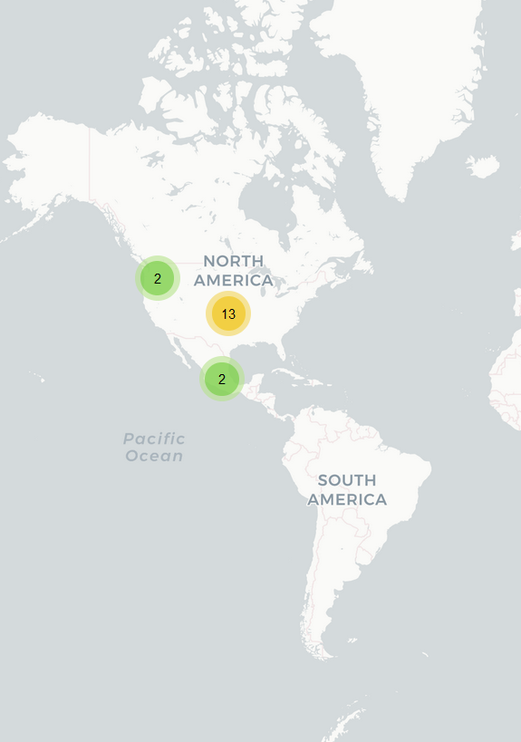

# CreditoLana

- **Esta aplicación ya no está disponible en la Playstore. Dejamos los enlaces aunque estén caídos a modo de registro.**
- **No comprobamos todas las funcionalidades de la aplicación porque no seguimos todo el proceso para pedir un préstamo debido a las consideraciones de seguridad de las personas que hicimos el análisis** 

## Fecha de análisis

- **Análisis estático (mediante Exodus Privacy/MobFS):** 14/11/2022
- **Análisis dinámico (mediante análisis de tráfico de red):** 11/11/2022
- **Análisis Posteriores:** 

## Archivos analizados:

- [apk Versión 1.2.7](https://cloud.datavoros.org/index.php/s/HKnLCr4eNEccZRr)
- [pcap versión 1.2.7](https://cloud.datavoros.org/index.php/s/6neaF5wSzwWYCbF)   
- [Capturas de pantalla](https://cloud.datavoros.org/index.php/s/ZPy3Ag86kFzsq4p)    

## Descripción de la aplicación
- **Tipo:** Préstamos rápidos
- **Costo:** Gratis  
- **Enlace de descarga:** [https://play.google.com/store/apps/details?id=uni.UNI0450796](https://play.google.com/store/apps/details?id=uni.UNI0450796)
- **Descargas:** 1M+
- **Ultima fecha de actualización:** 7/11/2022
- **Versión:** 1.2.7
- **Desarrollador:** [https://www.creditolanamx.com/](https://www.creditolanamx.com/)
- **Firma:** Google.Inc
- **Contacto:** cs@creditolanamx.com
- **Condiciones de uso y Política de privacidad:** [https://www.creditolanamx.com/creditolanas/index.html](https://www.creditolanamx.com/creditolanas/index.html)   
Wayback Machine: [https://web.archive.org/web/20230000000000*/https://www.creditolanamx.com/creditolanas/index.html](https://web.archive.org/web/20230000000000*/https://www.creditolanamx.com/creditolanas/index.html)
    
- **Descripción en PlayStore:**
~~~
Descarga la aplicación de CreditoLana.
Completa tu solicitud de crédito.
¡Al finalizar tu solicitud conocerás la respuesta a tu préstamo en minutos!
Si tu crédito fue aprobado, estará disponible inmediatamente para transferencia a tu cuenta bancaria.

Formas de pago
• Puedes realizar tu pago en tiendas OXXO al número de referencia que aparece en tu aplicación.
• A través de transferencia electrónica desde tu banca móvil. Los datos de pago de tu crédito los encontrarás siempre disponibles en la aplicación.

Programa Va de Vuelta
¡Gana dinero al pagar a tiempo tus préstamos!
• Paga tus préstamos a tiempo: A partir de tu 3er préstamo, cada vez que pagues puntualmente, te bonificaremos la mitad de los intereses pagados.
• Acumula dinero: Una vez que acumules más de $500, lo podrás retirar en efectivo

NOTAS IMPORTANTES:
a. Todos los préstamos están sujetos a aprobación de crédito.
b. El tiempo máximo de validación es de 1 día hábil en primer préstamo.
c. El pago puntual del préstamo puede abrirte nuevos plazos y montos mayores.
d. Todos tus datos están protegidos por nuestro Aviso de Privacidad y no serán compartidos a nadie sin tu consentimiento.

Condiciones del préstamo
• Edad: Mayor de 18+ años

Los detalles del préstamo son los siguientes:
1. Plazo del préstamo: 91-180 días
2. Monto del préstamo: $ 5,000 a $ 100,000
3. Tasa máxima de tarifa anual (APR): 35% por año
4. Tarifa de servicio mensual: 0.42%

Para un préstamo de $ 1.000.000 con un plazo de 3 meses, las tarifas que se cobran son las siguientes:
Interés total: $ 1.000.000*30%/12*3= $ 75.000
Tarifa de servicio total：$ 1,000,000*0.42%*3=$ 12,600
Tarifa de reembolso total: $ 1,000,000+ $ 1,000,000*30%/12*3+$ 1,000,000*0.42%*3= $ 1,087,600
Monto de pago mensual: $ 1.087.600/3 = $ 362.533,33

Contáctanos:
Email: cs@creditolanamx.com
Dirección: Zamora 187, Col. Condesa, Del. Cuauhtémoc, CDMX, CP 06140

Atención al cliente: Lunes a Viernes de 8:30 am a 21:30 pm, Sábados y Domingos de 10:00 am a 19:00 pm

CreditoLana: Préstamos más cerca.
~~~

## Rastreadores identificados (mediante Exodus Privacy)

|Rastreador|Tipo|
|---|---| 
|[Branch](https://branch.io/)|Analítica|
|[Facebook Login](https://developers.facebook.com/docs/facebook-login)|Identificación|
|[Facebook Share](https://developers.facebook.com/docs/sharing)|Compartir|
|[Google Firebase Analytics](https://firebase.google.com/)|Analítica|

Enlace al [reporte](https://reports.exodus-privacy.eu.org/en/reports/311000/) de Exodus Privacy   

## Empresas relacionadas con esta aplicación
- Lana International Holdings Mexico, SAPI de C.V.
- [Alphabet](https://abc.xyz/) --> Google - Publicidad, Crashes, Analítica
- [Meta](https://about.facebook.com/ltam/meta/) --> Facebook

### Provedores de servicios de terceros para pagos, identificación y redes sociales

- Facebook

### Dominios integrados al código de la app que no pertecen directamente a los rastreadores y que son de interés
 
 - Nada que reportar

## Permisos   

- **Según Exodus Privacy:** 19
- **Según prueba de uso:** 7

### Permisos según Exodus Privacy

- :exclamation:
ACCESS_COARSE_LOCATION    
 _Acces approximate location only in the foregorund_

- ACCESS_NETWORK_STATE
_View network connections_

- ACCESS_WIFI_STATE
_View Wi-Fi connections_

- :exclamation:
CAMERA    
_Take pictures and videos_

- :exclamation:
GET_ACCOUNTS   
_Find accounts on the device_

- INTERNET
_Have full network access_

- POST_NOTIFICATIONS

- :calendar::exclamation:READ_CALENDAR
_Read calendar events and details_

- :exclamation:
READ_CONTACTS    
_Read your contacts_

- :exclamation:READ_EXTERNAL_STORAGE
_Read the contents of your shared storage_

- :exclamation:
READ_PHONE_STATE   
_Read phone status and identity_

- READ_PRIVILEGED_PHONE_STATE

- :page_facing_up::exclamation:READ_SMS
_Read text messages (SMS or MMS)_

- WAKE_LOCK
_Prevent phone from sleeping_

- :calendar::exclamation:WRITE_CALENDAR
_Read calendar events and details_

- :exclamation:WRITE_EXTERNAL_STORAGE
_Modify or delete the contents of your shared storage_

- RECEIVE

- BIND_GET_INSTALL_REFERRER_SERVICE

- AD_ID

El icono :exclamation: indica un nivel 'Peligroso' o 'Especial' de acuerdo a los [niveles de protección de Google](https://developer.android.com/guide/topics/permissions/overview). 

### Permisos según la Playstore

- :bust_in_silhouette:Identidad
    - Buscar cuentas en el dispositivo

- :calendar:Calendar
    - Agregar o modificar eventos y mandar emails a otros usuarios sin el conocimiento del usuario
    - Leer eventos de calendario e información confidencial

- 
Contactos
    - Consultar tus contactos
    - Buscar cuentas en el dispositivo

- Ubicación
    - Ubicación aproximada (basada en red)
    
- :page_facing_up:SMS
    - Leer tus mensajes de texto (SMS o MMS)

- 
Teléfono
    - Consultar la identidad y el estado del teléfono

- 
Fotos/multimedia/archivos
    - Leer el contenido de tu almacenamiento USB
    - Modificar o eliminar contenido del almacenamiento USB

- 
Almacenamiento
    - Leer el contenido de tu almacenamiento USB
    - Modificar o eliminar contenido del almacenamiento USB

- 
Cámara
    -Realizar fotografías y vídeos

- Información sobre la conexión Wi-Fi
    - Ver conexiones Wi-Fi

- :iphone:ID de dispositivo e información de llamada
    - Consultar la identidad y el estado del teléfono

- :grey_question:Otro motivo
    - Recibir datos de internet
    - Acceso completo a red
    - Impedir que el dispositivo entre en modo de suspensión
    - Ver conexiones de red
  

### Permisos solicitados durante el uso de la aplicación

- :red_circle:Acceso a fotos y multimedia
- :red_circle:Enviar y mandar mensajes SMS
- :red_circle:Administrar las llamadas telefónicas
- :red_circle:Acceso a contactos
- :red_circle:Acceso al calendario
- :red_circle:Acceso a la ubicación
- :red_circle:Grabar y tomar videos

:red_circle: Este ícono indica un permiso obligatorio
:blue_circle: Este ícono indica un permiso opcional pero se pierde una funcionalidad particular

## Datos

### Datos solicitados al usuario durante el uso de la aplicación

- Número de celular
- Nombre de la empresa donde trabaja
- Número de la empresa donde trabaja
- Día del primer pago
- Día del segundo pago
- Email
- Dirección de casa
- 2 Contactos de emergencia con nombre, teléfono y relación
- Datos bancarios: banco, CLABE y tipo de cuenta.
- Identificación INE (fotografía)

### Tabla de conexiones realizadas durante el uso de la aplicación

| Dirección       | Número de paquetes | País          | Ciudad         | Número AS | Organización AS     |
|-----------------|--------------------|---------------|----------------|-----------|---------------------|
| 31.13.89.19     |                161 | Mexico        | Querétaro City |     32934 | FACEBOOK            |
| 54.186.40.60    |                168 | United States | Boardman       |     16509 | AMAZON-02           |
| 54.213.200.48   |                800 | United States | Boardman       |     16509 | AMAZON-02           |
| 65.9.149.17     |                136 | United States |                |     16509 | AMAZON-02           |
| 65.9.149.127    |                 68 | United States |                |     16509 | AMAZON-02           |
| 142.250.65.110  |                 33 | United States |                |     15169 | GOOGLE              |
| 142.250.65.142  |                 31 | United States |                |     15169 | GOOGLE              |
| 142.250.69.3    |                 35 | United States |                |     15169 | GOOGLE              |
| 142.250.81.74   |                 41 | United States |                |     15169 | GOOGLE              |
| 142.250.113.188 |                  9 | United States |                |     15169 | GOOGLE              |
| 142.251.35.10   |                 24 | United States |                |     15169 | GOOGLE              |
| 142.251.35.14   |                 16 | United States |                |     15169 | GOOGLE              |
| 172.217.2.138   |                 68 | United States |                |     15169 | GOOGLE              |
| 172.217.3.131   |                 39 | United States |                |     15169 | GOOGLE              |
| 172.217.3.138   |                 35 | United States |                |     15169 | GOOGLE              |
| 189.247.22.12   |                  1 | Mexico        |                |      8151 | Uninet S.A. de C.V. |

**En este análisis no pudimos revisar los registros DNS porque están cifrados**

### Mapa de conexiones realizadas durante el uso de la aplicación

### Datos compartidos y uso según la Playstore:

- No se comparten datos con terceros

### Datos recopilados y uso según la Playstore
**Esta tabla muestra los datos que, según la PlayStore recopila esta aplicación, y para qué se recopilan (su uso). Hay que recordar que estos campos en la PlayStore son llenados por los propios desarrolladores.**

|Datos|Uso|
|---|---|
|Ubicación aproximada y precisa|Fraude, seguridad y legislación|
|Nombre|Fraude, seguridad y legislación|
|Email|Fraude, seguridad y legislación|
|ID de usuario|Fraude, seguridad y legislación|
|Dirección|Fraude, seguridad y legislación|
|Número de teléfono|Fraude, seguridad y legislación|
|Otra información|Fraude, seguridad y legislación|
|Información de pago|Fraude, seguridad y legislación|
|Calificación crediticia (opcional)|Fraude, seguridad y legislación|
|Otra información financiera|Fraude, seguridad y legislación|
|SMS o MMS|Fraude, seguridad y legislación|
|Fotos(opcional)|Fraude, seguridad y legislación|
|Archivos y documentos|Fraude, seguridad y legislación|
|Eventos de calendario|Fraude, seguridad y legislación|
|Contactos|Fraude, seguridad y legislación|
|Interacciones con aplicaciones|Fraude, seguridad y legislación|
|Aplicaciones instaladas|Fraude, seguridad y legislación|
|Otro contenido generado por el usuario|Fraude, seguridad y legislación|
|Diagnósticos|Fraude, seguridad y legislación|
|ID del dispositivo|Fraude, seguridad y legislación|

### Prácticas de seguridad

- Los datos están cifrados en tránsito
- Puedes solicitar que tus datos sean borrados (aunque no nos consta).

### Datos recopilados y uso según la Política de privacidad

|Datos|
|---|
|Nombre completo|
|Domicilio|
|Correo electrónico|
|Fecha y lugar de nacimiento|
|Nacionalidad|
|Número de teléfono|
|RFC|
|CURP|
|Estado civil|
|Datos de identificación y contacto|
|Geolocalización|
|Datos de redes sociales (opcional)|
|Datos patrimoniales|
|Ingresos y egresos a través de acceso a su cuenta del Servicio de Administración Tributaria y/o cuentas bancarias|
|Mótivo del crédito solicitado|
|Tipo de negocio|
|Datos biométricos (reconocimiento facial)| Para corroborar identidad|
|Localización|
|Información del registro de llamadas|
|Calendario|
|Lista de apps instaladas|
|Mensajes de texto|
|IMEI|
|Cámara|
|Lista de contactos (dicen que se borran y filtran los datos personales de esos contactos)|
|Información básica del teléfono móvil|

Las razones de uso de estos datos son varias:

- Cumplir con la relación contractual 
- Verificar, confirmar y validar la identidad del titular y los datos que proporciona
- Gestionar, operar y dar seguimiento a los servicios que solicite el usuario
- Analizar la información proporcionada por el usuario a fin de determinar el nivel de riesgo y su capacidad de pago. 

### Datos compartidos según la Política de privacidad

No se comparten
        

### Notas importantes sobre seguridad y privacidad:
- Los datos enviados por esta aplicación están cifrados en tránsito
- En el aviso de privacidad se especifica que los datos se suben a dos servidores, aquellos de www.creditolanamx.com y https://api2.branch.io. Este último servidor pertenece al rastreador de Branch y, hasta donde sabemos, esta empresa no proporciona servicios de guardado de datos. Esto nos hace dudar si, en efecto, le están vendiendo estos datos a esta empresa de analítica.
- Leyendo el manifiesto de la aplicación, descubrimos que aparecen relaciones con otra app analizada aquí: [iFectivo](./captura_pantalla/creditolana%20ifectivo%202.png). En esta captura de pantalla se muestra una sección del manifiesto de la aplicación, ciertas actividades, tienen el nombre ifectivo.
- El dominio creditolanamx.com está registrado a nombre de alguien en China. **Actualización: esto ya cambió, y ahora aparece en [Whois](./captura_pantalla/creditolanawhois.png) un registrante anónonimo de Gran Bretaña. En la página [Whoxy.com](https://www.whoxy.com/creditolanamx.com#history) se puede revisar quién era dueño de este dominio con anterioridad, aquí una captura de [pantalla](./captura_pantalla/creditolanawhoishistory.png).**

## Conclusiones
- No pudimos averiguar si la empresa a la que pertenece CreditoLana (Lana International Holdings Mexico, SAPI de C.V.) está vinculada con otras empresas de manera directa, ya que no existe información en Internet. Esto ya debería hacernos dudar de la legitimidad de la misma. Además no está registrada en Condusef.  
- El hecho de que utilicen la app de iFectivo como plantilla nos hace sospechar si estas dos empresas no están conectadas de alguna manera, sobre todo porque sabemos por algunos [reportajes](https://politica.expansion.mx/cdmx/2022/08/17/la-cdmx-detiene-a-27-personas-relacionadas-con-23-aplicaciones-montadeudas), que una misma célula de estafadores maneja más de una aplicación. Asimismo sospechamos que, como iFectivo y Okrédito están íntimamente relacionadas, también, por transferencia, lo está esta aplicación con aquellas dos. 
- La aplicación no parece ser maliciosa y probablemente no tenga ningún tipo de peligros técnicos inherentes. 
- Ni los rastreadores, ni la extensa recolección de datos (que es perfectamente congruente con ser un aplicación para conseguir préstamos) parecería indicar algún problema.  
- Un indicador de riesgo sí son los permisos solicitados, ya que el acceso a los contactos de la persona usuaria, el acceso a lectura y escritura del almacenamiento y el acceso al estado del teléfono, así como al calendario y a los SMS, son permisos de alto riesgo. 
- En conclusión, el peligro de esta aplicación tiene que ver con que parece completamente legítima y fuera que la empresa que está detrás, Lana International Holdings Mexico, SAPI de C.V., no está registrada con la Condusef, y el exceso de permisos, no hay muchos más indicios que permitan creer que quien está detrás de esta aplicación sean personas cometiendo fraudes financieros.    