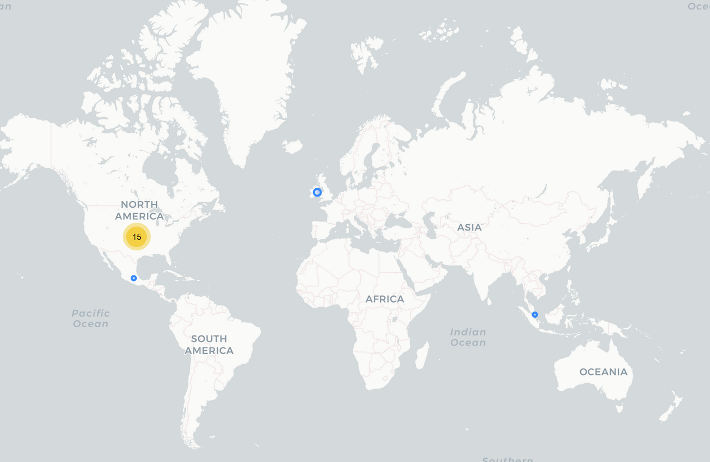

# iFectivo

**Esta aplicación parece estar zombie. Los dominios a la política de privacidad y a la página están caídos, aunque sigue presente en la PlayStore**

## Fecha de análisis

- **Análisis estático (mediante Exodus Privacy/MobFS):** 14/11/2022
- **Análisis dinámico (mediante análisis de tráfico de red):** 11/11/2022
- **Análisis Posteriores:** 

## Archivos analizados

- [Apk versión 1.6.2](https://cloud.datavoros.org/index.php/s/R7CLzCQrq9kHkaf)
- [Pcap versión 1.6.2](https://cloud.datavoros.org/index.php/s/PezDNJEzSKD8aMZ)   
- [Capturas de pantalla](https://cloud.datavoros.org/index.php/s/sQfA2GMP25XNxQY)

## Descripción de la aplicación
- **Tipo:** Préstamos rápidos
- **Costo:** Gratis  
- **Enlace de descarga:**[https://play.google.com/store/apps/details?id=com.loan.credit.branch.tala.fast.efectivo.mexico](https://play.google.com/store/apps/details?id=com.loan.credit.branch.tala.fast.efectivo.mexico)
- **Descargas:** 5M+
- **Ultima fecha de actualización:** 25/09/2022
- **Versión:** 1.6.2
- **Desarrollador:** [https://www.ifectivo.mx/](https://www.ifectivo.mx/)
- **Firma:** Mexico Financial2
- **Contacto:** ifectivo.developer@gmail.com
- **Condiciones de uso y Política de privacidad:** [https://www.ifectivo.mx/index/agreement](https://www.ifectivo.mx/index/agreement)   
Wayback Machine: [https://web.archive.org/web/20220827223037/https://www.ifectivo.mx/index/agreement](https://web.archive.org/web/20220827223037/https://www.ifectivo.mx/index/agreement)
    
- **Descripción en PlayStore:**
~~~
About loans:
-Credit limit: From $300 to $20,000 pesos
-Commission: 5%—10%;
-Duration: 91 to 120 days
-Interest: 0.09% per day (Annual Percentage Rate up to 33%)
-VAT: 8%
-CAT : 149.7% -315%
-APR: up to 33%

For example: The loan is for $12,000 pesos and the term of the loan is 91 days. You only have to pay 982.8 pesos of interest (12,000*0.09%*91=982.8), 1200 pesos(12,000*10%=1,200) of commission and 174.6 pesos ((Commission 1,200 + interest 982.8) * 8% = 174.6) of VAT. The total amount to pay would be $ 14,356. You only need to pay $4785 every month. Total Annual Cost (CAT): 197.9%

Use the iFectivo application on your mobile phone to meet your daily and temporary financial needs. iFective, the more we understand each other, the more we value each other.

What is needed to request a loan?
-Mexican nationality and have your INE/IFE.
-Have a debit account in Mexico.
-Download the app.

How to apply for a loan? It is very simple:
-Download iCash
-Fill out a short application through the app.
-We will verify your identity through a protected and secure system.
-We deposit the loan money directly into your bank account. If you do not have a bank account, it is recommended to open an account at Banco Azteca or OXXO Saldazo. This step is simple and effective.
-Remember the payment date, develop the habit of paying on time and you will be able to increase the amount of your next loan faster and you will be able to extend the term of your payment.
-Mainly provide 91/120 days products

How to pay?
-Go to your application in the app, click on payment and follow the instructions
-You can make your payment online through the bank (SPEI)
-You can also pay with the referral at your nearest OXXO. You can also choose any OXXO referral payment.

About privacy:
iFectivo protects the information of all our users. We will never provide your information to anyone without your permission.

Personal loans give you better support when you need them. Just like Moneyman, we lend you cash immediately
No mortgage, faster approval than Moneyman, Kueski and Paaympai etc.
Request a quick loan with immediate approval and economic interest.

Contact:
Our hours are Monday through Friday from 9 a.m. to 5 p.m. to 7 p.m.
Email: hola@ifectivo.mx
WhatsApp:55-6498-6797
Company address: Calle Río Tiber 70, Cuauhtémoc, 06500 Mexico City, CDMX
~~~

## Rastreadores identificados (mediante Exodus Privacy)

|Rastreador|Tipo|
|---|---| 
|[AppsFlyer](https://support.appsflyer.com/hc/es/categories/201114756-Integraci%C3%B3n-de-SDK-)|Analítica|
|[Facebook Analytics](https://developers.facebook.com/docs/app-events)|Analítica|
|[Facebook Login](https://developers.facebook.com/docs/facebook-login)|Identificación|
|[Facebook Share](https://developers.facebook.com/docs/sharing)|Compartir|
|[Google AdMob](https://admob.google.com/home/)|Publicidad|
|[Google Crashlytics](https://firebase.google.com/docs/crashlytics/)|Rastreo de crashes|
|[Google Firebase Analytics](https://firebase.google.com/)|Analítica|
|[Opentelemetry](https://opentelemetry.io/)|Analítica y Perfilamiento| 
|[Pangle](https://www.pangleglobal.com/)|Publicidad|

Enlace al [reporte](https://reports.exodus-privacy.eu.org/en/reports/311000/) de Exodus Privacy   

## Empresas relacionadas con esta aplicación
- Collection Center Media, S.A. de C.V
- [Alphabet](https://abc.xyz/) --> Google - Publicidad, Crashes, Analítica
- [Appsflyer](https://www.appsflyer.com/es/) - Rastreador de analítica
- [Meta](https://about.facebook.com/ltam/meta/) --> Facebook
- [Pangle](https://www.pangleglobal.com/) --> [TikTok](https://www.tiktok.com/) --> [ByteDance](https://www.bytedance.com/en/) - Publicidad
- [Opentelemetry](https://opentelemetry.io/) --> [CloudNative](https://www.cncf.io/) - Minado y procesamiento de datos
- [Megvii](https://en.megvii.com/solutions/FaceID) --> Detección de rostro (FaceID) y de identificación (Usado para reconocer las identificaciones como la del INE)
- [Moor](http://moor.com) - ¿Emails?
- [Opay](https://opayweb.com/) --> [Opera Norway AS Group](https://en.wikipedia.org/wiki/Opera_(company)) --> [Kunlun](http://www1.kunlun.com/en/) -->  Pagos digitales
- [Huawei](https://www.huawei.com/en/) --> Data Storage
- [Cloudflarenet](https://www.cloudflare.com/) --> CDN, Data Storage
- [Amazon](https://www.aboutamazon.com/) - Data Storage

### Provedores de servicios de terceros para pagos, identificación y redes sociales
- Facebook (No pudimos comprobarlo, lo sabemos por los rastreadores y el manifiesto)
- Google (No pudimos comprobarlo, lo sabemos por los rastreadores y el manifiesto)
- Whatsapp (No pudimos comprobarlo, lo sabemos por los rastreadores y el manifiesto)

### Dominios integrados al código de la app que no pertecen directamente a los rastreadores y que son de interés

- ab-test.opayweb.com
- whatsapp.com
- faceid.com
- databyterangers.com.cn
- cscenter-mexico.i.o-kash.com
- moor.com (y subdominios)x
- tobapplog.itobsnssdk.com (y subdominios)
- tianxiadengcang.com
- qbox.me
- baidu.com
- megvii.com
- log.byteoversea.com (y subdominios)
- log.isnssdk.com (y subdominios)
- onelink.me

## Permisos   

- **Según Exodus Privacy:** 23
- **Según prueba de uso:** 5

### Permisos según Exodus Privacy

- :exclamation:
ACCESS_COARSE_LOCATION    
 _Acces approximate location only in the foregorund_

- :exclamation:
ACCESS_FINE_LOCATION    
 _Access precise location (GPS and network-based)_

- ACCESS_NETWORK_STATE
_View network connections_

- ACCESS_WIFI_STATE
_View Wi-Fi connections_

- :exclamation:
CAMERA    
_Take pictures and videos_

- FLASHLIGHT

- FOREGROUND_SERVICE
_run foregorund services_

- INTERNET
_Have full network access_

- MOUNT_UNMOUNT_FILESYSTEM

- QUERY_ALL_PACKAGES
_Query all packages_

- :calendar::exclamation:READ_CALENDAR
_Read calendar events and details_

- :exclamation:READ_EXTERNAL_STORAGE
_Read the contents of your shared storage_

- :exclamation:
READ_PHONE_STATE   
_Read phone status and identity_

- :page_facing_up::exclamation:READ_SMS
_Read text messages (SMS or MMS)_

- RECEIVE_BOOT_COMPLETED
_Run at startup_

- :page_facing_up::exclamation:RECEIVE_SMS
_Receive text messages (SMS)_

- VIBRATE
_Prevent phone from sleeping_

- WAKE_LOCK
_Prevent phone from sleeping_

- :calendar::exclamation:WRITE_CALENDAR
_Read calendar events and details_

- :exclamation:WRITE_EXTERNAL_STORAGE
_Modify or delete the contents of your shared storage_

- RECEIVE

- BIND_GET_INSTALL_REFERRER_SERVICE

- AD_ID

El icono :exclamation: indica un nivel 'Peligroso' o 'Especial' de acuerdo a los [niveles de protección de Google](https://developer.android.com/guide/topics/permissions/overview). 

### Permisos según la Playstore

- :calendar:Calendar
    - Agregar o modificar eventos y mandar emails a otros usuarios sin el conocimiento del usuario
    - Leer eventos de calendario e información confidencial

- 
Teléfono
    - Consultar la identidad y el estado del teléfono

- :microphone:Micrófono
    - Grabar audio

- :page_facing_up:SMS
    - Recibir mensajes de texto (SMS)
    - Leer tus mensajes de texto (SMS o MMS)

- 
Fotos/multimedia/archivos
    - Leer el contenido de tu almacenamiento USB
    - Modificar o eliminar contenido del almacenamiento USB

- 
Cámara
    -Realizar fotografías y vídeos

- :iphone:ID de dispositivo e información de llamada
    - Consultar la identidad y el estado del teléfono

- 
Almacenamiento
    - Leer el contenido de tu almacenamiento USB
    - Modificar o eliminar contenido del almacenamiento USB

- Ubicación
    - Ubicación aproximada (basada en red)
    - Ubicación precisa (basada en red y GPS)

- Información sobre la conexión Wi-Fi
    - Ver conexiones Wi-Fi

- :grey_question:Otro motivo
    - Recibir datos de internet
    - Ejecutarse al inicio
    - Controlar vibración
    - Acceso completo a red
    - Impedir que el dispositivo entre en modo de suspensión
    - Controlar el flash
    - Ver conexiones de red
  

### Permisos solicitados durante el uso de la aplicación

- :red_circle:Acceso a fotos y multimedia
- :red_circle:Enviar y mandar mensajes SMS
- :red_circle:Administrar las llamadas telefónicas
- :red_circle:Acceso a la ubicación
- :red_circle:Tomar y grabar videos

:red_circle: Este ícono indica un permiso obligatorio
:blue_circle: Este ícono indica un permiso opcional pero se pierde una funcionalidad particular

## Datos

### Datos solicitados al usuario durante el uso de la aplicación

**No pudimos registrarnos nunca en la aplicación, existe algún problema de red que no pudimos identificar. Pero haciendo un análisis de las cadenas (strings) podemos saber que, a la hora de pedir un préstamos recopilan los siguientes datos:

- Nombre completo
- Número de teléfono celular
- Número de teléfono de casa
- Antigüedad en el trabajo actual
- Compañía donde se trabaja
- Datos tarjeta bancaria
- Otros contactos y su relación parental con el usuario y su número de celular
- Ciudad 
- Estado
- Estado de cuenta o recibo de nómina
- CLABE
- Nacionalidad
- Número de hijos
- Género
- Dirección de domicilio
- Comprobante de domicilio
- Foto de cara
- Horario laboral
- CURP
- Email
- Fotos del INE por delante y por detrás
- RFC
- Video
- URL de Facebook
- Días del pago del salario
- Nivel de estudios 

### Tabla de conexiones realizadas durante el uso de la aplicación

| Dirección       | Número de paquetes | País          | Ciudad      | Número AS | Organización AS |
|-----------------|--------------------|---------------|-------------|-----------|-----------------|
|  52.210.184.209 |                 26 | Ireland       | Dublin      |     16509 | AMAZON-02       | AppsFlyer                    |
| 65.9.149.43     |                 62 | United States |             |     16509 | AMAZON-02       | AppsFlyer                    |
| 65.9.149.124    |                 29 | United States |             |     16509 | AMAZON-02       | Appsflyer                    |
| 94.74.77.131    |                216 | Mexico        | Mexico City |    136907 | HUAWEI CLOUDS   | iFectivo                     |
| 104.18.22.10    |                 20 |               |             |     13335 | CLOUDFLARENET   |                              |
| 142.250.69.10   |                 18 | United States |             |     15169 | GOOGLE          | Firebase                     |
| 142.251.34.10   |                 26 | United States |             |     15169 | GOOGLE          | Firebase                     |
| 142.251.34.14   |                  9 | United States |             |     15169 | GOOGLE          |                              |
| 142.251.34.42   |                 51 | United States |             |     15169 | GOOGLE          | Firebase                     |
| 142.251.34.131  |                 28 | United States |             |     15169 | GOOGLE          | Crashlytics                  |
| 142.251.34.174  |                 12 | United States |             |     15169 | GOOGLE          |                              |
| 142.251.34.238  |                 12 | United States |             |     15169 | GOOGLE          |                              |
| 142.251.35.3    |                  5 | United States |             |     15169 | GOOGLE          |                              |
| 159.138.164.168 |                 42 | Singapore     |             |    136907 | HUAWEI CLOUDS   | OPay                         |
| 172.217.2.130   |                217 | United States |             |     15169 | GOOGLE          | AdMob                        |
| 172.217.15.3    |                  4 | United States |             |     15169 | GOOGLE          |                              |
| 216.58.217.3    |                  4 | United States |             |     15169 | GOOGLE          |                              |

**Esta es la lista de conexiones que logramos obtener del poco uso de la aplicación**

### Mapa de conexiones realizadas durante el uso de la aplicación

### Datos compartidos y uso según la Playstore:
- No se comparten datos con terceros

### Datos recopilados y uso según la Playstore
**Esta tabla muestra los datos que, según la PlayStore recopila esta aplicación, y para qué se recopilan (su uso). Hay que recordar que estos campos en la PlayStore son llenados por los propios desarrolladores.**

|Datos|Uso|
|---|---|
|Ubicación (opcional)|Fraude, seguridad y legislación|
|Nombre|Fraude, seguridad y legislación|
|ID de usuario|Fraude, seguridad y legislación|
|Dirección|Fraude, seguridad y legislación|
|Número de teléfono|Fraude, seguridad y legislación|
|Otra información|Fraude, seguridad y legislación|
|Información de pago|Fraude, seguridad y legislación|
|Historial de compras (opcional)|Fraude, seguridad y legislación|
|Calificación crediticia (opcional)|Fraude, seguridad y legislación|
|SMS o MMS (opcional)|Fraude, seguridad y legislación|
|Fotos(opcional)|Fraude, seguridad y legislación|
|Contactos (opcional)|Fraude, seguridad y legislación|
|Aplicaciones instaladas|Fraude, seguridad y legislación|
|Logs de crashes|Analítica|
|ID del dispositivo|Fraude, seguridad y legislación|

### Prácticas de seguridad

- Los datos están cifrados en tránsito
- Puedes solicitar que tus datos sean borrados (aunque no nos consta)

### Datos recopilados y uso según la Política de privacidad

|Datos|
|---|
|Nombre completo|
|Género|
|Domicilio|
|Correo electrónico|
|Fecha y lugar de nacimiento|
|Nacionalidad|
|Número de teléfono|
|RFC|
|CURP|
|Estado civil|
|Datos de identificación y contacto|
|Geolocalización|
|Datos de redes sociales (opcional)|
|Datos patrimoniales|
|Mótivo del crédito solicitado|
|Ocupación|
|Datos biométricos incluido el reconocimiento de voz| Para corroborar identidad|
|Cámara|
|Calendario|
|Lista de contactos|
|Mensajes de texto
|Micrófono|
|INE|
|Perfil transaccional|
|Recibos de nómina|
|Almacenamiento| Para corroborar identidad|
|ID del dispositivo|
|Comprobante de domicilio|
|Datos derivados del uso de nuestros servicios|
|Datos de las características de su dispositivo (atributos, operaciones, identificadores, señales, configuración, red, aplicaciones instaladas, conexiones y cookies)|

Las razones de uso de estos datos son varias:

- El cumplimiento de la relación contractual derivado de la solicitud y/o contratación de los Servicios.

- Administrar, operar y dar seguimiento a los Servicios que solicita o contrata.

- Realizar el análisis de la información proporcionada por el Titular, a fin de determinar conforme a las disposiciones legales vigentes el nivel de riesgo, viabilidad de pago, perfil transaccional, y cualquier otra evaluación que sea requerida por la normativa para el otorgamiento de los Servicios.

- Formalizar la relación contractual entre IFectivo y el Titular.

- Incluirlo en nuestra base de datos, integrar expedientes, de manera directa o a través de un tercero.

- Procesar las solicitudes que realice por medio de nuestros Medios Electrónicos.

- Crear su perfil como usuario en la App.

- Consultar y realizar investigaciones crediticias ante sociedades de información crediticia que estime conveniente.

- Ofrecer una ampliación o mejora de los Servicios contratados.

- Informar sobre actualizaciones de Servicios.

- Para el cumplimiento de las obligaciones de IFectivo contenidas en la legislación mexicana aplicable.

- Enviar todo tipo de notificaciones a través de cualquier medio para requerir el cumplimiento de sus obligaciones derivadas de la solicitud o el Contrato celebrado entre IFectivo y el Titular.

- Llevar a cabo inteligencia comercial, realizar investigaciones de mercado, darle visibilidad a su actividad en nuestros Medios Electrónicos, seguimiento de calidad de nuestros Medios Electrónicos, evaluación y mejora de nuestros Medios Electrónicos.

- Envío de publicidad, telemarketing, mercadotecnia, ofertas, promociones, boletín de noticias y ofertas o eventos especiales que puedan ser de interés del Titular, así como servicios o productos ofrecidos por socios comerciales.

- Mercadotecnia o publicitaria.

- Prospección comercial. 

### Datos compartidos según la Política de privacidad

- iFectivo no transfiere los datos personales de los usuarios a personas físicas o morales que no pertenezcan a iFectivo o empresas filiales o terceros. Se comparten estos datos con:

    - Cualquier sociedad de nuestro grupo corporativo

    - Con autoridades competentes, en caso de ser solicitados, en términos de la legislación aplicable

    - Con la(s) sociedad(es) de información crediticia con la(s) cual(es) IFectivo haya contratado Sociedades o compañías encargadas de cobranza y recolección de pagos

    - Con otras empresas en caso de ser adquiridos, fusionados o cualquier otra operación similar por esa compañía

    - Con otras sociedades que provean infraestructura y/o servicios para la prestación de servicios de IFectivo (encargados)

    - Terceros incluidos entidades financieras, para cesión o descuento de cartera de crédito, endoso o cualquier otra forma de negociación de la cartera crediticia

    - Socios comerciales con quien se tengan celebrados contratos para la comercialización de productos y/o servicios en beneficio del Titular.

- Además iFectivo pueden compartir y enviar los datos personales fuera del país con las sociedades que se requiera, así como las pertenecientes a COLLECTION CENTER MEDIA, S.A. DE C.V. y aquellas a las que pertecene esta entidad. 

        

### Notas importantes sobre seguridad y privacidad:
 - Los datos enviados por esta aplicación están cifrados en tránsito, es decir que se utiliza un certificado SSL.
 - Existe un problema de seguridad en la medida en que no utiliza la tecnología SSL Pinning. Esta tecnología evita que los certificados SSL utilizados para cifrar los datos en tránsito no puedan ser suplantados por otros. Como no está implementada esta tecnología, la aplicación es vulnerable a un ataque MITM (Hombre en el medio), lo que podría suponer un peligro enorme para los usuarios, visto que los datos enviados son tantos y tan críticos.
- El aviso de privacidad es una copia del aviso de otra app: Okrédito

## Conclusiones

- No pudimos registrarnos en esta aplicación por un error de red. Esto limita nuestras posibilidades de análisis dinámico. Aun así, basta con el análisis técnico y de la política de privacidad para entender que recolectan absolutamente todos los datos relevantes del usuario para pedir un préstamo.
- No pudimos averiguar si la empresa a la que pertenece iFectivo (Collection Center Media) está vinculada con otras empresas de manera directa, ya que no existe información en Internet. Sabemos que no está registrada en la Condusef, y esto ya debería hacernos dudar de la legitimidad de la misma. Al mismo tiempo, el hecho de que usen servidores Huawei y servicios como Opay, que son chinos, nos da a entender que probablemente haya una relación con empresas chinas.
- La tecnología de reconocimiento facial que utilizan, faceid.com, es una empresa china Megvii), y otros dominios que están en el código son chinos también: 
    - faceid.com
    - databyterangers.com.cn
    - tianxiadengcang.com
    - baidu.com
    - megvii.com
    - log.byteoversea.com (y variantes) --> pertenece a TikTok
- La mayoría de los dominios son idénticos a los de la aplicación Okredito:

|                              | iFectivo | Okredito |
|------------------------------|----------|----------|
| ab-test.opayweb.com          | x        | x        |
| whatsapp.com                 | x        | x        |
| megvii.com                   | x        | x        |
| faceid.com                   | x        |          |
| databyterangers.com.cn       | x        | x        |
| cscenter-mexico.i.o-kash.com | x        | x        |
| moor.com                     | x        | x        |
| tobapplog.itobsnssdk.com     | x        | x        |
| tianxiadengcang.com          | x        | x        |
| qbox.me                      | x        | x        |
| baidu.com                    | x        | x        |
| log.byteoversea.com          | x        | x        |
| log.sgsnssdk.com             |          | x        |
| log.isnssdk.com              | x        |          |
| onelink.me                   | x        | x        |
| sgfp.tongdun.net             | x        | x        |
| twitter.com                  |          | x        |
- Como el aviso de privacidad es idéntico al de Okredito, parece ser que sencillamente esta aplicación está emparentada y pertenece a las mismas personas que desarrollaron Okrédito. Por algunos [reportajes](https://politica.expansion.mx/cdmx/2022/08/17/la-cdmx-detiene-a-27-personas-relacionadas-con-23-aplicaciones-montadeudas) sabemos que una misma célula de personas manejan distintas aplicaciones.
- Para abonar al argumento anterior, los nombres de esta aplicación y de Okredito son muy similares:
    - **iFectivo:** com.loan.credit.branch.tala.fast.efectivo.mexico
    - **Okredito:** com.loan.cash.credit.branch.tala.fast.lending.mexico 
- Como está dicho en el reporte de CreditoLana, esa aplicación tiene indicios de estar altamente relacionada con esta.
- La aplicación no parece ser maliciosa y probablemente no tenga ningún tipo de peligros técnicos inherentes. 
- Ni los rastreadores, ni la extensa recolección de datos (que es perfectamente congruente con ser un aplicación para conseguir préstamos) parecería indicar algún problema.
- Un indicador de riesgo sí son los permisos solicitados, ya que  el acceso a lectura y escritura del almacenamiento y el acceso al estado del teléfono, así como al calendario y a los SMS, son permisos de alto riesgo. 
- Creemos que las aplicaciones de Okredito, CreditoLana y esta, están hechas por las mismas personas debido a los indicios ya mencionados. 
- En conclusión, el peligro de esta aplicación tiene que ver con que parece completamente legítima y fuera que la empresa que está detrás, Collection Center Media, no está registrada con la Condusef, y el exceso de permisos, no hay muchos más indicios que permitan creer que quien está detrás de esta aplicación sean personas cometiendo fraudes financieros.   

