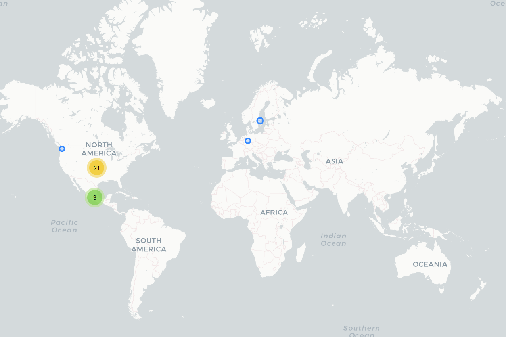

# Superapoyo

## Fecha de análisis

- **Análisis estático (mediante Exodus Privacy/MobFS):** 14/11/2022
- **Análisis dinámico (mediante análisis de tráfico de red):** 14/11/2022
- **Análisis Posteriores:** 

## Links a archivos analizados

- [Apk versión 1.0.89](https://cloud.datavoros.org/index.php/s/xTBetPb5wr8aFNr)
- [Pcap versión 1.0.89](https://cloud.datavoros.org/index.php/s/sn7LJPH87bHAc48)

## Descripción de la aplicación
- **Tipo:** Préstamos rápidos
- **Costo:** Gratis  
- **Link de descarga:** [https://play.google.com/store/apps/details?id=credit.prestamos.personale.cash.efectivo&gl=MX](https://play.google.com/store/apps/details?id=credit.prestamos.personale.cash.efectivo&gl=MX)
- **Descargas:** 1M+
- **Ultima fecha de actualización:** 14/09/2022
- **Versión:** 1.0.89
- **Desarrollador:** [http://www.superapoyo.com/](http://www.superapoyo.com/)
- **Firma:** superapoyo
- **Contacto:** servicio@superapoyo.com
- **Condiciones de uso y Política de privacidad:** [https://www.superapooyo.com/notice](https://www.superapooyo.com/notice)   
Wayback Machine: [https://web.archive.org/web/20230000000000*/https://www.superapooyo.com/notice](https://web.archive.org/web/20230000000000*/https://www.superapooyo.com/notice)
    
- **Descripción en PlayStore:**
~~~
🌸Ventaja exclusiva: No accede tu listín! Respete la privacidad de los usuarios y protege sus derechos e intereses.
🌸Superapoyo ofrece servicios de préstamo de crédito personal en línea seguro y confiable, y su información estará protegida al más alto nivel.

🥇Selección de 1,000,000+ usuarios
Más de 1 Millón de descargas.
🥇Solicitud gratuita
Todos los procesos de Superapoyo son gratuitos.
🥇100% proceso en línea
El celular puede completar todos los procesos y no se requieren documentos en papel.
🥇Proceso sencillo
Puede obtener su préstamo en unos pocos pasos.
🥇100% protección de seguridad de dato
Superapoyo garantiza la seguridad de sus datos las 24 horas del día, proporcionando el nivel más alto de seguridad de sus datos y de su privacidad.
🥇Servico de calidad
Ofrecemos servicios de 7*24h.

📝Detalles del préstamo
-Término del préstamo: 91 a 120 días.
-Monto del préstamo: Desde $450 hasta $20,000 pesos.
-Interés: 0.01%~0.1% por día (Tasa de interés anual 3.6%~36%)
-Comisión: 5% -20% del monto
-IVA：16% del comisión e intereses
- CAT: 270%~540%
-Por ejemplo: El préstamo es de $ 1,000 pesos y El termino del préstamo es de 91 días. Solo debe pagar 91 pesos de intereses (1000*0.1%*91=91), 145 pesos (1000*14.5%=145) de comisión y 38 pesos (Comisión 145+intereses 91)*16%=38) de IVA.
El monto total de pago sería $1,274. Solo necesita pagar $ 425 cada mes. Valor CAT correspondiente: 343%

😄Solo 3 pasos para obtener un préstamo:
(1) Descargar la aplicación.
(2) Ser mayor de edad: contar con INE y cuenta bancaria a su nombre.
(3) Llenar un breve formulario.

😄 Forma de pago flexible:
(1) Puede pagar con transferencia interbancaria (SPEI) las 7*24 horas del día sin comisión adicional. 💳💳
(2) También puede hacer su pago en la tienda de OXXO más cercana con el número de referencia proporcionado 🏪🏪

🎁OFERTAS EXCLUSIVAS🎁
(1) Si paga a tiempo y mantiene un buen crédito, puede obtener un monto de préstamo más alto y un plazo de pago más largo.
(2) Mantener un buen crédito puede ayudarle a tener la oportunidad de pedir prestado hasta 20,000 pesos.

❓¿Cómo solicitar un préstamo?
（1) Descargar SUPERAPOYO en Google Play.
（2) Solo cuatro pasos y no más de tres minutos para completar la información de su solicitud de préstamo.
(3) Se deposita a su cuenta bancaria de 16 dígitos o número CLABE de 18 dígitos directamente.

🔒🔒Para Superapoyo, la seguridad de su información es lo más importante. Contamos con estrictos procedimientos de verificación y protección de datos, y nunca proporcionaremos su información a un tercero sin su consentimiento.

🔖 Contáctanos:
📞 Atención al cliente：55 4440 7595
📧 Email：servicio@superapoyo.mx
🗨Whatsapp：55 4440 7595
💡Sitio web: https://www.superapooyo.com/home
🕋 Dirección de la oficina: Versalles No.30,201,Cuauhtémoc,ciudad de mexico
🕘 Tiempo laboral：
De lunes a viernes 9:00-18:30
De sábado a domingo 9:00-14:30

💰💰💰💰Superapoyo está listo para brindarle el mayor apoyo y asistencia en cualquier momento
~~~

## Trackers identificados (mediante MobSF) 
- **No pudimos realizar al análisis en Exodus porque arroja el problema: Unable to compute APK fingerprint**

- No hay trackers presentes según MobSF, pero nosotros identificamos en el manifiesto:

|Tracker|Tipo|
|---|---| 
|[AppsFlyer](https://support.appsflyer.com/hc/es/categories/201114756-Integraci%C3%B3n-de-SDK-)|Analítica|
|[Google Firebase Analytics](https://firebase.google.com/)|Analítica|

## Empresas relacionadas con esta aplicación
- TIK IN, S.A. de C.V.
- [Alphabet](https://abc.xyz/) --> Google - Publicidad, Crashes, Analítica
- [Appsflyer](https://www.appsflyer.com/es/) - Tracker de analítica
- [Qualcomm](https://www.qualcomm.com/home) --> A través del dominio [izatcloud.net](http://izatcloud.net/) - Localización
- [Sohu](https://www.sohu.com/)
- [Microsoft](https://www.microsoft.com/es-mx) - Data Storage
- [Huawei](https://consumer.huawei.com/mx/) - Data Storage
- [Amazon](https://www.aboutamazon.com/) - Data Storage
- [CloudFlare](https://www.cloudflare.com/) - CDN
- [Svensk Teleutveckling & Produktinnovation, STUPI AB](http://www.stupi.se/) - DNS

### Provedores de servicios de terceros para pagos, identificación y redes sociales

- Nada que reportar

### Dominios integrados al código de la app que no pertecen directamente a los trackers y que son de interés
 
- Nada que reportar

## Permisos   

- **Según MobSF:** 26 
- **Según prueba de uso:** 7

### Permisos según Exodus Privacy

- :exclamation:
ACCESS_COARSE_LOCATION    
 _Acces approximate location only in the foregorund_

 - :exclamation:
ACCESS_FINE_LOCATION    
 _Access precise location (GPS and network-based)_

- ACCESS_NETWORK_STATE
_View network connections_

- ACCESS_WIFI_STATE
_View Wi-Fi connections_

- :exclamation:
CAMERA    
_Take pictures and videos_

- CHANGE_WIFI_STATE

- FOREGROUNDSERVICE

- :exclamation:
GET_ACCOUNTS   
_Find accounts on the device_

- INTERNET
_Have full network access_

- :exclamation:MANAGE_ACCOUNTS

- PACKAGE_USAGE_STATS

- :calendar::exclamation:READ_CALENDAR
_Read calendar events and details_

- - :exclamation:READ_EXTERNAL_STORAGE
_Read the contents of your shared storage_

- :exclamation:READ_PHONE_NUMBERS

- :exclamation:
READ_PHONE_STATE   
_Read phone status and identity_

- READ_PRIVILEGED_PHONE_STATE

- :page_facing_up::exclamation:READ_SMS
_Read text messages (SMS or MMS)_

- RECEIVE_BOOT_COMPLETED

- :page_facing_up::exclamation:RECEIVE_SMS
_Receive text messages (SMS or MMS)_

- VIBRATE

- WAKE_LOCK
_Prevent phone from sleeping_

- :calendar::exclamation:WRITE_CALENDAR
_Read calendar events and details_

- - :exclamation:WRITE_EXTERNAL_STORAGE
_Modify or delete the contents of your shared storage_

- RECEIVE

- BIND_GET_INSTALL_REFERRER_SERVICE

- AD_ID

El icono :exclamation: indica un nivel 'Peligroso' o 'Especial' de acuerdo a los [niveles de protección de Google](https://developer.android.com/guide/topics/permissions/overview). 

### Permisos según la Playstore

- :bust_in_silhouette:Identidad
    - Buscar cuentas en el dispositivo
    - Agregar o borrar cuentas

- :calendar:Calendar
    - Agregar o modificar eventos y mandar emails a otros usuarios sin el conocimiento del usuario
    - Leer eventos de calendario e información confidencial

- 
Contactos
    - Buscar cuentas en el dispositivo

- Ubicación
    - Ubicación aproximada (basada en red)
    - Ubicación precisa (basada en red y GPS)
    
- :page_facing_up:SMS
    - Leer tus mensajes de texto (SMS o MMS)
    - Recibir mensajes de texto (SMS)

- 
Teléfono
    - Consultar la identidad y el estado del teléfono

- 
Fotos/multimedia/archivos
    - Leer el contenido de tu almacenamiento USB
    - Modificar o eliminar contenido del almacenamiento USB

- 
Almacenamiento
    - Leer el contenido de tu almacenamiento USB
    - Modificar o eliminar contenido del almacenamiento USB

- 
Cámara
    -Realizar fotografías y vídeos

- Información sobre la conexión Wi-Fi
    - Ver conexiones Wi-Fi

- :iphone:ID de dispositivo e información de llamada
    - Consultar la identidad y el estado del teléfono

- :grey_question:Otro motivo
    - Actualizar las estadísticas del uso de lo componentes
    - Recibir datos de internet
    - Acceso completo a red
    - Impedir que el dispositivo entre en modo de suspensión
    - Ver conexiones de red
    - Conectar y desconectar del Wi-Fi
    - Arrancar al inicio
    - Controlar la vibración
    
  

### Permisos solicitados durante el uso de la aplicación

- :red_circle:Acceso a fotos y multimedia
- :red_circle:Enviar y mandar mensajes SMS
- :red_circle:Administrar las llamadas telefónicas
- :red_circle:Acceso a contactos
- :red_circle:Acceso al calendario
- :red_circle:Acceso a la ubicación
- :red_circle:Grabar y tomar videos

:red_circle: Este ícono indica un permiso obligatorio
:blue_circle: Este ícono indica un permiso opcional pero se pierde una funcionalidad particular

## Datos

### Datos solicitados al usuario durante el uso de la aplicación
- Número de teléfono
- Nivel de ingreso
- Frecuencia con la que se recibe dicho ingreso
- Día cobro
- Rango del monto de ingreso
- Nivel educativo
- Estado Civil
- Número de hijos
- Código postal
- Colonia
- Estado
- Datos de contacto #1 en la agenda del teléfono y parentesco
- Datos de contacto #2 en la agenda del teléfono y parentesco
- Datos de contacto #3 en la agenda del teléfono y parentesco (opcional)
- INE anverso y reverso
- CURP
- Información bancaria:
    - Tipo de cuenta
    - Nombre del banco
    - Número de tarjeta bancaria
- Foto de la cara

### Tabla de conexiones realizadas durante el uso de la aplicación
| Dirección IP   | Número de paquetes | País          | Ciudad      | Número AS | Organización AS                                     | Dominio                   |
|----------------|--------------------|---------------|-------------|-----------|-----------------------------------------------------|--------------------------------------|
| 52.156.120.137 |                 19 | United States |             |      8075 | MICROSOFT-CORP-MSN-AS-BLOCK                         | sohu.com                             |
| 65.9.149.24    |                 65 | United States |             |     16509 | AMAZON-02                                           | izatcloud.net --> Qualcomm GPS       |
| 65.9.149.43    |                192 | United States |             |     16509 | AMAZON-02                                           | AppsFlyer                            |
| 65.9.149.60    |                 31 | United States |             |     16509 | AMAZON-02                                           | AppsFlyer                            |
| 94.74.66.204   |                868 | Mexico        | Mexico City |    136907 | HUAWEI CLOUDS                                       | SuperApoyo - WebPage                 |
| 94.74.68.209   |               2147 | Mexico        | Mexico City |    136907 | HUAWEI CLOUDS                                       | SuperApoyo - Data Access             |
| 104.21.38.64   |                245 |               |             |     13335 | CLOUDFLARENET                                       | SuperApoyo                           |
| 104.26.0.202   |                226 | United States |             |     13335 | CLOUDFLARENET                                       | SuperApoyo                           |
| 119.8.6.18     |                183 | Mexico        |             |    136907 | HUAWEI CLOUDS                                       | Huawei Cloud personal. ¿SuperApoyo?  |
| 142.250.65.138 |                 39 | United States |             |     15169 | GOOGLE                                              |                                      |
| 142.250.69.10  |                 27 | United States |             |     15169 | GOOGLE                                              |                                      |
| 142.250.69.46  |                 24 | United States |             |     15169 | GOOGLE                                              |                                      |
| 142.251.34.78  |                186 | United States |             |     15169 | GOOGLE                                              |                                      |
| 142.251.34.86  |                 22 | United States |             |     15169 | GOOGLE                                              |                                      |
| 142.251.34.170 |                  9 | United States |             |     15169 | GOOGLE                                              |                                      |
| 142.251.34.195 |                 34 | United States |             |     15169 | GOOGLE                                              |                                      |
| 142.251.35.3   |                 25 | United States |             |     15169 | GOOGLE                                              | Crashlytics                          |
| 142.251.35.10  |                 21 | United States |             |     15169 | GOOGLE                                              |                                      |
| 162.159.200.1  |                  2 |               |             |     13335 | CLOUDFLARENET                                       |                                      |
| 172.67.69.89   |                191 | United States |             |     13335 | CLOUDFLARENET                                       | SuperApoyo                           |
| 172.217.2.138  |                 24 | United States |             |     15169 | GOOGLE                                              |                                      |
| 172.217.2.142  |                 49 | United States |             |     15169 | GOOGLE                                              |                                      |
| 172.217.3.131  |                 29 | United States |             |     15169 | GOOGLE                                              |                                      |
| 172.217.15.10  |                 33 | United States |             |     15169 | GOOGLE                                              |                                      |
| 172.253.62.188 |                  6 | United States |             |     15169 | GOOGLE                                              |                                      |
| 192.36.143.130 |                  2 | Sweden        |             |      1880 | Svensk Teleutveckling & Produktinnovation, STUPI AB | android.pool.ntp.org --> Passive DNS |
| 216.58.195.234 |                 73 | United States |             |     15169 | GOOGLE                                              | Google apis                          |

**La columna de Dominio son solicitudes de conexión de la aplicación establecidas a través del DNS. Conocer esto no siempre es posible, ya que muchas veces dichas comunicaciones están cifradas. Sólo ennumeramos aquellas que tienen un interés puntual para este proyecto, a saber, rastreadores y empresas no relacionadas con los rastreadores.**

### Mapa de conexiones realizadas durante el uso de la aplicación

### Datos compartidos y uso según la Playstore:

- No se comparten datos con terceros

### Datos recopilados y uso según la Playstore
**Esta tabla muestra los datos que, según la PlayStore recopila esta aplicación, y para qué se recopilan (su uso). Hay que recordar que estos campos en la PlayStore son llenados por los propios desarrolladores.**
|Datos|Uso|
|---|---|
|Ubicación aproximada y precisa (opcional)|Funcionalidad, Fraude, seguridad y legislación|
|Nombre|Fraude, seguridad y legislación|
|Email|Funcionalidad, Fraude, seguridad y legislación|
|ID de usuario|Funcionalidad|
|Dirección|Fraude, seguridad y legislación|
|Número de teléfono|Funcionalidad|
|Otra información|Fraude, seguridad y legislación|
|Información de pago|Funcionalidad|
|Historial de compras (opcional)|Funcionalidad, Fraude, seguridad y legislación|
|Calificación crediticia (opcional)|Fraude, seguridad y legislación|
|SMS o MMS (opcional)|Analítica, Fraude, seguridad y legislación|
|Fotos(opcional)|Analítica, Fraude, seguridad y legislación|
|Eventos del calendario|Funcionalidad|
|Logs de crashes|Analítica|
|ID del dispositivo|Funcionalidad, Analítica, Marketing o Publicidad|

### Prácticas de seguridad

- Los datos están cifrados en tránsito
- Puedes solicitar que tus datos sean borrados (no sabemos si es cierto)

### Datos recopilados y uso según la Política de privacidad

|Datos|
|---|
|Nombre completo|
|Domicilio|
|Número de teléfono|
|Estado civil|
|Género|
|País|
|Fecha y lugar de nacimiento|
|Edad|
|Identificación oficial vigente|
|RFC|
|CURP|
|FIEL|
|Correo electrónico|
|Datos académicos|
|Fotografías|
|Actividad laboral|
|Tipo de empleo|
|Fuentes de ingresos|
|Ingresos mensuales|
|Dirección del centro de trabajo|
|Teléfono del centro de trabajo|
|Fecha de ingreso al servicio|
|Cargo dentro de la empresa/institución|
|Nombre del jefe directo|
|Actividades productivas adicionales|
|Experiencia profesional|
|Datos del cónyuge: nombrecompleto, dirección, ocupación, teléfono, estado civil, género, país, lugar y fecha de nacimiento, edad|
|Ubicación en tiempo real|
|Calendario|
|SMS|
|Cámara|
|Información básica del teléfono móvil|

Las razones de uso de estos datos son varias:

- Cumplir con la relación contractual 
- Dar cumplimiento a obligaciones regulatorias emitidas por parte de las autoridades competentes, así como atender sus requerimientos
- Mantener la información actualizada
- Identificar al titular
- Evaluar riesgos y, en su caso, formalizar el contrato que derive de la relación comercial que se establezca entre las partes
- Realizar validaciones de identidad a través de medios biométricos y biográficos de sus clientes. 

### Datos compartidos según la Política de privacidad

- Se podrán transferir los datos personales a terceros. Estos pueden incluir:
    - Trans Unión de México, S.A. S.I.C. (Buro de crédito) 
    - Circulo de crédito S.A. de C.V. S.I.C. 
    - Servicios Quien es Quien, S.A. de C.V.
    - Cualquier otra institución necesaria para verificar la identidad y y veracidad de los datos proporcionados por el usuario.
    - Autoridades mexicanas
    - Autoridades financieras mexicanas o extranjeras
    - Autoridades judiciales mexicanas o extranjeras
        

### Notas importantes sobre seguridad y privacidad:
- Los datos enviados por esta aplicación están cifrados en tránsito. Aunque existe una IP, la 52.156.120.137 que se corresponde con el dominio de [sohu.com](https://en.wikipedia.org/wiki/Sohu) un proveedor de Internet chino. A esa dirección se manda la versión del sistema operativo del usuario, el modelo, la marca, el user agent y el número de compilación. 
- No sabemos por qué no funcionó el análisis con Exodus Privacy.
- El análisis mediante MobSF resultó curioso, en tanto que hay varios campos en los cuales no encontró información (incluídos trackers que nosotros detectamos en el manifiesto).

## Conclusiones
- No pudimos averiguar si la empresa a la que pertenece SuperApoyo (TIK IN, S.A: de C.V.) está vinculada con otras empresas de manera directa, ya que no existe información en Internet. Esto ya debería hacernos dudar de la legitimidad de la misma. Además no está registrada en Condusef.
- Asimismo vemos una vez más que parte de la infraestructura de la aplicación está relacionada con China, tanto por los servidores de Huawei como el contacto con Sohu.com. Asismismo, la página de [izatcloud.net](http://izatcloud.net/) que pertence a Qualcommm aparece con carcateres chinos.
- La aplicación no parece ser maliciosa y probablemente no tenga ningún tipo de peligros técnicos inherentes.
- Ni los trackers, ni la extensa recolección de datos (que es perfectamente congruente con ser un aplicación para conseguir préstamos) parecería indicar algún problema.
- Un indicador de riesgo sí son los permisos solicitados, ya que  el acceso a lectura y escritura del almacenamiento y el acceso al estado del teléfono, así como al calendario y a los SMS y contactos son permisos de alto riesgo. En particular el acceso a las cuentas registradas en el dispositivo y la posibilidad de modificarlas es altamente peligrosa.
- En conclusión, el peligro de esta aplicación tiene que ver con que parece completamente legítima y fuera que la empresa que está detrás (TIK IN) no está registrada con la Condusef, y el exceso de permisos, no hay muchos más indicios que permitan creer que quien está detrás de esta aplicación sean personas cometiendo fraudes financieros.   