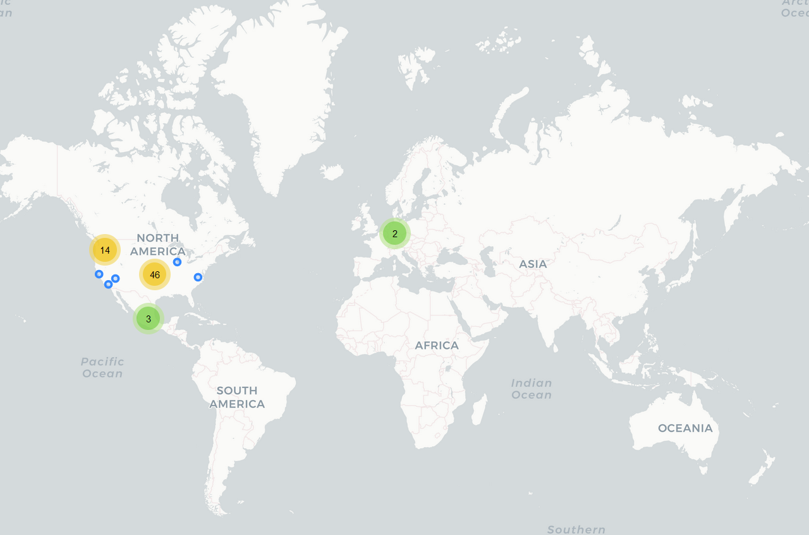

# Tala

## Fecha de análisis

- **Análisis estático (mediante Exodus Privacy/MobFS):** 07/11/2022
- **Análisis dinámico (mediante análisis de tráfico de red):** 07/11/2022
- **Análisis Posteriores:** 

## Links a archivos analizados

- [Apk versión 7.122.0](https://cloud.datavoros.org/index.php/s/ZTfWGxawQL64Yde)
- [Pcap versión 7.122.0](https://cloud.datavoros.org/index.php/s/4ne4fbzBG24zTCX)

## Descripción de la aplicación
- **Tipo:** Préstamos rápidos
- **Costo:** Gratis  
- **Link de descarga:** https://play.google.com/store/apps/details?id=mx.com.tala
- **Descargas:** 5M+
- **Ultima fecha de actualización:** 03/10/2022
- **Versión:** 7.122.0
- **Desarrollador:** [Tala Mobile](https://talamobile.mx)
- **Firma:** Inventure
- **Contacto:** hola@talamobile.mx
- **Condiciones de uso y Política de privacidad:** https://talamobile.mx/aviso-de-privacidad-mx/?bypass=true
    
- **Descripción en PlayStore:**
~~~
Obtén préstamos de hasta $5,000 en solo 10 minutos.

Somos la app de préstamos móviles en línea más confiable de México, con más de 5 millones de descargas. ¡Descárgala ahora!

Comisiones bajas
Paga una comisión única desde 13% y evita intereses que siguen creciendo.

Préstamos a tu manera
Elige tu propia fecha de pago. ¡Te la respetamos siempre!

Rápido y seguro
Solicita en 10 minutos sin papeleo, filas ni aval. Solo necesitas tu teléfono y tu INE.

Aumenta tu límite
Paga a tiempo y aumenta la cantidad de tu siguiente préstamo… ¡hasta $5,000! (Aplican restricciones).

Tus datos están protegidos
Tala mantiene tu información segura usando encriptación SSL.

Recompensas
Refiere Tala y gana $100 de descuento en tu siguiente préstamo.*

¿Cómo lo obtengo?

✔ Descarga la app y regístrate
✔ Contesta las preguntas y sube tu INE
✔ Confirma el monto del préstamo y elige cuándo quieres pagarlo
✔ Ingresa tu cuenta para que te depositemos

¿Cómo pago mi préstamo?

Haz una transferencia interbancaria (SPEI), o bien, deposita en tiendas de la Red Paynet u OXXO.

¿Qué necesito para solicitar?

✔ ️ Ser ciudadano residente en México
✔ Tener más de 18 años
✔ ️ Contar con tu INE vigente y un número de celular

Términos de préstamos recurrentes

Podrás acceder a otro préstamo al liquidar tu préstamo actual a tiempo (aplican restricciones).

Consulta siempre los términos y condiciones antes de efectuar cualquier transacción.

Acerca del préstamo

• Límites de préstamo: $500 - $5,000.
• Tasa de interés fija: 11.21% - 50.86% más IVA.
• Tasa Porcentual Anual Máxima (APR): 152.59% - 351.72%
• Según el monto del préstamo para el que hayas sido aprobado, puedes elegir entre diferentes plazos para pagar.
• Crece tu límite hasta $5,000 usando la app y haciendo tus pagos a tiempo.
• Los clientes de Tala pueden elegir un plazo de hasta 120 días.
• No existe un periodo mínimo de pago para el repago del préstamo; los clientes pueden hacer pagos parciales en cualquier momento después del desembolso.

Para un préstamo de $1,000 con un plazo de 120 días:

•La comisión única total será de $508.6 (50.86%*)
•Un IVA de $81.4 para un total a pagar de $1,590.00
•CAT informativo: 320.54%**
•Tasa de interés anual: 152.59%
•Periodo máximo de repago: 120 días
•Periodo mínimo de repago: 120 días

*Un cargo único de 10% del monto total adeudado puede ser aplicado a préstamos cuyo periodo de pago haya vencido. Otros Términos y Condiciones pueden aplicar.
**CAT informativo inicial de 320.5%; tasa de interés anual inicial de 152.6%. Tala nunca hará cargos adicionales al cargo por servicio (más el cargo por reestructuración del préstamo en caso de que no realices tu pago a tiempo).
***Usted debe cuidar su capacidad de pago, generalmente no debe exceder el 35% de sus ingresos periódicos, los costos por incumplimiento de pago son muy elevados.

Privacidad

Todos los datos recopilados son para verificar tu identidad y construir tu perfil de crédito. Nunca divulgaremos ninguna información personal con nadie que no seas tú, sin tu permiso ni venderemos tus datos a terceros. (Política de Privacidad: talamobile.mx/aviso-de-privacidad-mx/)

Contáctanos

Correo electrónico: hola@talamobile.mx
Sitio web: talamobile.mx/
Facebook: www.facebook.com/talamobilemx
Dirección: Colima 161 piso 4 | Colonia Roma Norte | Delegación Cuauhtémoc | CP 06700 | Ciudad de México.

* Términos y condiciones del programa de referidos: talamobile.mx/programadereferidos/

TALA está regulada por la CONDUSEF, así, cualquier proceso que inicies con nosotros es 100% confiable y seguro.

Puedes consultar su página oficial en www.condusef.org.mx o llamar a su centro de atención telefónica al 55-40-09-99.
~~~

## Trackers identificados (mediante Exodus Privacy)

|Tracker|Tipo|
|---|---| 
|[Adjust](https://www.adjust.com/)|Analítica y Retargeting|
|[Braze](https://www.braze.com/)|Analítica, Ubicación, Publicidad|
|[Google AdMob](https://admob.google.com/home/)|Publicidad|
|[Google Crashlytics](https://firebase.google.com/docs/crashlytics/)|Rastreo de crashes|
|[Google Firebase Analytics](https://firebase.google.com/)|Analítica|
|[Split](https://www.split.io/)|Analítica|
|[Uxcam](https://uxcam.com/)|Analítica, Perfilamiento|

- Detectamos conexiones al dominio googletagmanager.com que pertenece al tracker Google Tag Manager
- Detectamos conexiones al dominio clarity.ms que pertence al tracker de [Clarity](https://clarity.microsoft.com/) de Microsoft. Este tracker no está listado en Exodus Privacy.
- Detectamos conexiones al dominio data-emb.api que, podría pertenecer a un tracker de [Embrace](https://embrace.io/), pero es una suposición. En todo caso, existen actividades relacionadas con un SDK de Embrace dentro del código. Este tracker no está listado en Exodus Privacy.   

Enlace al [reporte](https://reports.exodus-privacy.eu.org/es/reports/309357/) de Exodus Privacy   

## Empresas relacionadas con esta aplicación
TALA Mobile, S.A.P.I. de C.V., S.O.F.O.M., E.N.R --> [Inventure Capital Corporation](https://www.bloomberg.com/profile/company/1277050D:US)   
[LOkalise](https://lokalise.com/) --> "Traduce una app para proveer de experiencias locales al usuario   
[Adjust](https://www.adjust.com/) --> [AppLovin](https://www.applovin.com/) - Analítica, Publicidad   
[Braze](https://www.braze.com/) - Analítica, Publicidad   
[Google](https://about.google/intl/ALL_mx/) --> [Alphabet](https://abc.xyz/)   
[Split](https://www.split.io/) - Analítica   
[Uxcam](https://uxcam.com/) - Analítica y Perfilamiento   
[Lokalise](https://lokalise.com/) - Traducción de aplicaciones   
[Amplitude](https://amplitude.com/) - Analytics --> Integrado con Adjust   
[Zendesk](https://www.zendesk.com.mx/) - Atención al cliente   
[Wordpress](https://wordpress.com/es/) - CMS --> [Auttomatic](https://automattic.com/)   
[Microsoft](https://www.microsoft.com/es-mx/) - Data Storage y Analítica   
[Fastly](https://www.fastly.com/es/) - CDN   
[CloudFlare](https://www.cloudflare.com/] - CDN, Data Storage   
[ProspectOne](https://prospectone.iohttps://prospectone.io/) - [jsdeliver](https://www.jsdelivr.com/) - Diseño de Software, Opensource CDN   
[Cdnjs](https://cdnjs.com/about) - OpenSource CDN   
[Embrace](https://embrace.io/) - Analítica   

### Provedores de servicios de terceros para pagos, identificación y redes sociales

- Sin nada que reportar

### Dominios integrados al código de la app que no pertecen directamente a los trackers y que son de interés
- atlas-antelope.com (35.164.145.38). Se encuentra en http y solicita: Versión Android, Tipo de red, Idioma.
- https://coins.ph/
- https://prod-mx-api.inventureaccess.com 
- https://prod.mx.atlas-antelope.com
- https://www.openpay.mx/
- https://www.eonbankph.com (Banca de Filipinas. Curiosamente dirige a servidores en Morelos México: 189.247.197.24)
- https://www.consusef.gob.mx
- https://www.7-eleven.com.ph
- https://www.vmoney.com
- htpps://www.unionbankph.com
- https://www.paynet.com.mx

## Permisos   

- **Según Exodus Privacy:** 24
- **Según prueba de uso:** 5

### Permisos según Exodus Privacy

- :exclamation:
ACCESS_COARSE_LOCATION    
 _Acces approximate location only in the foregorund_

- ACCES_COARSE_UPDATES

- :exclamation:
ACCESS_FINE_LOCATION    
 _Access precise location (GPS and network-based)_

- ACCESS_NETWORK_STATE
_View network connections_

- ACCESS_WIFI_STATE
_View Wi-Fi connections_

- :exclamation:
CAMERA    
_Take pictures and videos_

- CHANGE_NETWORK_STATE
_Change network connectivity_

- FOREGROUND_SERVICE
_run foregorund services_

- :exclamation:
GET_ACCOUNTS   
_Find accounts on the device_

- GET_TASKS
_Retrieve running apps_

- INTERNET
_Have full network access_

- QUERY_ALL_PACKAGES
_Query all packages_

- :calendar::exclamation:READ_CALENDAR
_Read calendar events and details_

- :exclamation:
READ_CONTACTS    
_Read your contacts_

- :exclamation:READ_EXTERNAL_STORAGE
_Read the contents of your shared storage_

- :exclamation:
READ_PHONE_STATE   
_Read phone status and identity_

- :page_facing_up::exclamation:READ_SMS
_Read text messages (SMS or MMS)_

- RECEIVE_BOOT_COMPLETED
_Run at startup_

- :page_facing_up::exclamation:RECEIVE_SMS
_Rceive text messages (SMS)_

- :exclamation:SYSTEM_ALERT_WINDOW
_This app can appear on top of other apps_

- WAKE_LOCK
_Prevent phone from sleeping_

- :exclamation:WRITE_EXTERNAL_STORAGE
_Modify or delete the contents of your shared storage_

- RECEIVE

- BIND_GET_INSTALL_REFERRER_SERVICE

El icono :exclamation: indica un nivel 'Peligroso' o 'Especial' de acuerdo a los [niveles de protección de Google](https://developer.android.com/guide/topics/permissions/overview). 

### Permisos según la Playstore

- 
Contactos
    - Consultar tus contactos
    - Buscar cuentas en el dispositivo

- 
Teléfono
    - Consultar la identidad y el estado del teléfono

- 
Almacenamiento
    - Leer el contenido de tu almacenamiento USB
    - Modificar o eliminar contenido del almacenamiento USB

- 
Cámara
    -Realizar fotografías y vídeos

- 
Fotos/multimedia/archivos
    - Leer el contenido de tu almacenamiento USB
    - Modoficar o eliminar contenido del almacenamiento USB

- :iphone:ID de dispositivo e información de llamada
    - Consultar la identidad y el estado del teléfono

- :arrows_counterclockwise:Historial de aplicaciones y del dispositivo
    - Consultar tu historial y tus marcadores web
    - Recuperar aplicaciones en ejecución

- :page_facing_up:SMS
    - Recibir mensajes de texto (SMS)
    - Leer tus mensajes de texto (SMS o MMS)

- Ubicación
    - Ubicación aproximada (basada en red)
    - Ubicación precisa (basada en red y GPS)

- :bust_in_silhouette:Identidad
    - Buscar cuentas en el dispositivo

- :calendar:Calendar
    - Leer eventos de calendario e información confidencial

- Informacipon sobre la conexión Wi-Fi
    - Ver conexiones Wi-Fi

- :grey_question:Otro motivo
    - Recibir datos de internet
    - Controlar vibración (en la última versión ya no)
    - Ejecutarse al inicio
    - Acceso completo a red
    - Mostrar sobre otras aplicaciones
    - Cambiar la conectividad de red
    - Crear cuentas y establecer contraseñas
    - Ver conexiones de red
    - Emparejar con dispositivos de Bluetooth (en la última versión ya no)
    - Usar cuentas del dispositivo
    - Impedir que el dispositivo entre en modo de suspensión

### Permisos solicitados durante el uso de la aplicación
- :red_circle:Acceso a ubicación
- :red_circle:Acceso a contactos
- :red_circle:Acceso a SMS
- :large_blue_circle:Acceso a cámara
- :red_circle:Acceso a llamadas telefónicas

:red_circle: Este ícono indica un permiso obligatorio
:large_blue_circle: Este ícono indica un permiso opcional pero se pierde una funcionalidad particular

## Datos

### Datos solicitados al usuario durante el uso de la aplicación

- Número de teléfono
- Nombre
- Apellidos
- Fecha de nacimiento
- CURP
- Sexo
- Correo Electrónico
- Calle, Número, Número interior, Colonia, Delegación, Ciudad y Estado. 
- Si el celular es propio o prestado
- Si el celular es nuevo o usado y tiempo de uso
- ¿Cómo te enteraste de Tal Mobile?
- Máximo nivel de estudios
- Si uno es:
    - Estudiante
    - Tiene un empleo
    - Trabajador independiente
    - No tiene ingresos
- Uso del préstamo
- Si se tienen otros préstamos pendientes de pago
- Fuente de ingresos principal
- Inicio en el trabajo o negocio que es la fuente de ingresos
- Total de ingresos mensuales

### Tabla de conexiones realizadas durante el uso de la aplicación

| Dirección       | Número de paquetes | País          | Ciudad            | Número AS | Organización AS             | Dominios o trackers contactados |
|-----------------|--------------------|---------------|-------------------|-----------|-----------------------------|---------------------------------|
| 13.107.246.57   |                134 | United States |                   |      8068 | MICROSOFT-CORP-MSN-AS-BLOCK | Clarity                         |
| 20.96.88.162    |                358 | United States | Boydton           |      8075 | MICROSOFT-CORP-MSN-AS-BLOCK | Clarity                         |
| 20.221.206.60   |                 51 | United States | Chicago           |      8075 | MICROSOFT-CORP-MSN-AS-BLOCK | Clarity                         |
| 31.13.89.35     |                 27 | Mexico        | Querétaro City    |     32934 | FACEBOOK                    |                                 |
| 35.81.44.244    |                 87 | United States | Boardman          |     16509 | AMAZON-02                   | Amplitud/Adjust                 |
| 35.156.175.20   |                 62 | Germany       | Frankfurt am Main |     16509 | AMAZON-02                   | Lokalise                        |
| 35.160.86.63    |                 42 | United States | Boardman          |     16509 | AMAZON-02                   | Split                           |
| 35.164.145.38   |                523 | United States | Boardman          |     16509 | AMAZON-02                   | prod.mx.atlas-antelope.com      |
| 35.167.186.221  |                183 | United States | Boardman          |     16509 | AMAZON-02                   | Amplitud/Adjust                 |
| 44.224.15.164   |                 97 | United States | Boardman          |     16509 | AMAZON-02                   | emb-api.com                     |
| 44.224.175.73   |                117 | United States | Boardman          |     16509 | AMAZON-02                   | emb-api.com                     |
| 44.231.212.92   |                 24 | United States | Boardman          |     16509 | AMAZON-02                   | Split                           |
| 52.35.35.29     |                 36 | United States | Boardman          |     16509 | AMAZON-02                   | Split                           |
| 52.37.22.146    |                 76 | United States | Boardman          |     16509 | AMAZON-02                   | Split                           |
| 52.41.41.193    |                 23 | United States | Boardman          |     16509 | AMAZON-02                   | emb-api.com                     |
| 52.41.51.11     |                 74 | United States | Boardman          |     16509 | AMAZON-02                   | prod.mx.atlas-antelope.com      |
| 54.188.233.96   |                141 | United States | Boardman          |     16509 | AMAZON-02                   | emb-api.com                     |
| 54.189.248.226  |                527 | United States | Boardman          |     16509 | AMAZON-02                   | prod.mx.atlas-antelope.com      |
| 54.200.117.167  |                 20 | United States | Boardman          |     16509 | AMAZON-02                   | emb-api.com                     |
| 64.233.162.94   |                 76 | United States |                   |     15169 | GOOGLE                      |                                 |
| 65.9.149.5      |                 36 | United States |                   |     16509 | AMAZON-02                   |                                 |
| 104.16.51.111   |                106 |               |                   |     13335 | CLOUDFLARENET               | talamexico/zendesk              |
| 104.16.53.111   |                 45 |               |                   |     13335 | CLOUDFLARENET               | talamexico/zendesk              |
| 104.16.89.20    |                 96 |               |                   |     13335 | CLOUDFLARENET               | jsdeliver                       |
| 104.17.25.14    |                 55 |               |                   |     13335 | CLOUDFLARENET               | Cdnjs                           |
| 104.17.50.4     |                 27 |               |                   |     13335 | CLOUDFLARENET               | Braze                           |
| 104.18.70.113   |                347 |               |                   |     13335 | CLOUDFLARENET               | Zendesk                         |
| 104.18.72.113   |                188 |               |                   |     13335 | CLOUDFLARENET               | Zendesk                         |
| 104.19.152.69   |                 99 |               |                   |     13335 | CLOUDFLARENET               | Braze                           |
| 142.250.65.99   |                 91 | United States |                   |     15169 | GOOGLE                      |                                 |
| 142.250.65.106  |                  1 | United States |                   |     15169 | GOOGLE                      | Firebase                        |
| 142.250.65.138  |                 57 | United States |                   |     15169 | GOOGLE                      | Firebase                        |
| 142.250.65.142  |                140 | United States |                   |     15169 | GOOGLE                      | Firebase                        |
| 142.250.69.8    |                330 | United States |                   |     15169 | GOOGLE                      | Google Tag Manager              |
| 142.250.69.10   |                 29 | United States |                   |     15169 | GOOGLE                      |                                 |
| 142.250.69.35   |                 11 | United States |                   |     15169 | GOOGLE                      |                                 |
| 142.250.69.42   |                 32 | United States |                   |     15169 | GOOGLE                      |                                 |
| 142.250.69.46   |                 14 | United States |                   |     15169 | GOOGLE                      | Youtube                         |
| 142.250.115.157 |                 45 | United States |                   |     15169 | GOOGLE                      | AdMob                           |
| 142.251.33.227  |                 73 | United States |                   |     15169 | GOOGLE                      |                                 |
| 142.251.33.228  |                 71 | United States |                   |     15169 | GOOGLE                      |                                 |
| 142.251.34.2    |                 47 | United States |                   |     15169 | GOOGLE                      |                                 |
| 142.251.34.3    |                 55 | United States |                   |     15169 | GOOGLE                      |                                 |
| 142.251.34.10   |                163 | United States |                   |     15169 | GOOGLE                      | Firebase                        |
| 142.251.34.35   |                214 | United States |                   |     15169 | GOOGLE                      |                                 |
| 142.251.34.42   |                 95 | United States |                   |     15169 | GOOGLE                      | Firebase                        |
| 142.251.34.65   |                 58 | United States |                   |     15169 | GOOGLE                      |                                 |
| 142.251.34.67   |                 34 | United States |                   |     15169 | GOOGLE                      |                                 |
| 142.251.34.74   |                 26 | United States |                   |     15169 | GOOGLE                      | Firebase                        |
| 142.251.34.99   |                 34 | United States |                   |     15169 | GOOGLE                      | Crahslytics                     |
| 142.251.34.132  |                 31 | United States |                   |     15169 | GOOGLE                      |                                 |
| 142.251.34.142  |                105 | United States |                   |     15169 | GOOGLE                      | Firebase                        |
| 142.251.34.170  |                 21 | United States |                   |     15169 | GOOGLE                      | Firebase                        |
| 142.251.34.195  |                 49 | United States |                   |     15169 | GOOGLE                      |                                 |
| 142.251.34.202  |                 22 | United States |                   |     15169 | GOOGLE                      | Firebase                        |
| 142.251.34.214  |                 53 | United States |                   |     15169 | GOOGLE                      | i.ytimg.com (Publicidad Google) |
| 142.251.116.157 |                 32 | United States |                   |     15169 | GOOGLE                      | AdMob                           |
| 151.101.1.208   |                601 | United States |                   |     54113 | FASTLY                      | Braze                           |
| 151.101.2.132   |               1497 | United States |                   |     54113 | FASTLY                      | Tala                            |
| 151.101.3.9     |                151 | United States |                   |     54113 | FASTLY                      | Split                           |
| 157.240.25.13   |                101 | Mexico        | Querétaro City    |     32934 | FACEBOOK                    |                                 |
| 157.240.25.35   |                 27 | Mexico        | Querétaro City    |     32934 | FACEBOOK                    |                                 |
| 162.159.200.1   |                  2 |               |                   |     13335 | CLOUDFLARENET               |                                 |
| 172.64.133.15   |                225 | United States |                   |     13335 | CLOUDFLARENET               |                                 |
| 172.217.2.138   |                127 | United States |                   |     15169 | GOOGLE                      | Firebase                        |
| 172.217.2.142   |               2758 | United States |                   |     15169 | GOOGLE                      | Youtube                         |
| 172.217.3.134   |                 26 | United States |                   |     15169 | GOOGLE                      |                                 |
| 172.217.3.138   |                  8 | United States |                   |     15169 | GOOGLE                      | Firebase                        |
| 172.217.3.142   |                 91 | United States |                   |     15169 | GOOGLE                      | Youtube                         |
| 172.217.15.3    |                  4 | United States |                   |     15169 | GOOGLE                      |                                 |
| 172.253.62.188  |                  9 | United States |                   |     15169 | GOOGLE                      |                                 |
| 185.151.204.9   |                 57 | United States |                   |     61273 | Adjust GmbH                 | Adjust                          |
| 192.0.76.3      |                 88 | United States | San Francisco     |      2635 | AUTOMATTIC                  | Wordpress                       |
| 204.79.197.200  |                 54 | United States |                   |      8068 | MICROSOFT-CORP-MSN-AS-BLOCK | Bing                            |
| 216.58.208.99   |                 83 | United States |                   |     15169 | GOOGLE                      |                                 |
| 216.239.34.178  |                 89 | United States |                   |     15169 | GOOGLE                      | Firebase                        |

- No pudimos identificar de quién es o para qué sirve el dominio data-emb-api.com. Según un usuario de [Reddit](https://www.reddit.com/r/pihole/comments/r9ztzd/what_is_dataembapicom_and_what_does_it_do/), es una herramienta de analítica relacionada con la empresa de analítica [Embrace](https://embrace.io/)
- No pudimos identificar de quién es o para qué sirve el dominio prod.mx.atlas-antelope.com (Por la cantidad de paquetes enviados, probablemente pertence a Tala, pero es una suposición)

**Los dominios o trackers contactados son solicitudes de conexión de la aplicación establecidas a través del DNS. Conocer esto no siempre es posible, ya que muchas veces dichas comunicaciones están cifradas. Sólo ennumeramos aquellas que tienen un interés puntual para este proyecto, a saber, trackers y empresas no relacionadas con los trackers.**

### Mapa de conexiones realizadas durante el uso de la aplicación

### Datos compartidos y uso según la Playstore:

- No se comparten datos con terceros

### Datos recopilados y uso según la Playstore

|Datos|Uso|
|---|---|
|Ubicación aproximada y precisa| Funciones de la app, Estadísticas, Comunicaciones del desarrollador, Publicidad o marketing, Seguridad, cumplimiento y prevención de fraudes, Personalización y Administración de la cuenta|
|Información personal: Nombre, email, ID de usuario, Dirección, Teléfono,Orientación sexual, Otra|Funciones de la app, Estadísticas, Comunicaciones del desarrollador, Publicidad o marketing, Seguridad, cumplimiento y prevención de fraudes, Personalización y Administración de la cuenta|
|Información financiera|Funciones de la app, Estadísticas, Personalización, Administración de la cuenta, Seguridad, cumplimiento y prevención de fraudes y Personalización|
|SMS o MMS y mensajes desde la apliacación|Funciones de la app, Estadísticas, Seguridad, cumplimiento y prevención de fraudes, Personalización y Comunicaciones del desarrollador|
|Fotos|Funciones de la app, Estadísticas, Personalización y Administración de la cuenta|
|Archivos y documentos|Funciones de la app|
|Contactos|Funciones de la app, Estadísticas, Seguridad, cumplimiento y prevención de fraudes y Personalización|
|Actividad en apps y otro contenido generado por usuarios|Funciones de la app, Estadísticas, Personalización, Seguridad,  y cumplimiento y prevención de fraudes|
|Apps instaladas|Funciones de la app, Estadísticas, Seguridad, cumplimiento y prevención de fraudes y Personalización|
|Regustro de fallas, Diagnóstico y otros datos de rendimiento|Funciones de la app, Estadísticas y Comunicaciones del desarrollador|
|Dispositivo u otros ID|Funciones de la app, Estadísticas, Publicidad o marketing, Seguridad, cumplimiento y prevención de fraudes, Personalización y Administración de la cuenta|

### Prácticas de seguridad

- Los datos están encriptados en tránsito
- Puedes solicitar que se borren tus datos

### Datos recopilados y uso según la Política de privacidad

|Datos|
|---|
|Datos de contacto: número de teléfono celular, correo electrónico, domicilio personal|
|Datos de identificación: nombre, fecha de nacimiento, captura de imagen, identificación oficial, género asignado|
|Datos biométricos|
|Datos de localización y geolocalización: Ubicación aproximada, ubicación precisa, huso horario|
|Datos laborales y educativos|
|Datos de comunicación con Tala: solicitudes de atención al cliente, respuestas a aclaraciones u otras comunicaciones a través de mensajes SMS, correo electrónico o grabación de llamadas|
|Datos del teléfono: información del hardware, IMEI, dirección IP, dirección MAC, GPS ADID o identificación de otro dispositivo, operador móvil|
|Datos de uso del dispositivo: lista de aplicaciones instaladas, datos de cuentas|
|Datos de SMS: la marca de tiempo, el número de teléfono y el contenido del SMS|
|Lista de contactos, mensajes de texto que envías, registro y frecuencia de llamada de tu teléfono móvi|
|Datos patrimoniales y financieros: ingresos o datos o documentos de tu empleo, grado de escolaridad, propósito o uso que se le dará al préstamo|
|Datos que proporciones en tu solicitud de préstamo|
|Datos transaccionales de las operaciones que realizas con nosotros o a través de nosotros, así como de las operaciones que realizas con transmisores de dinero, instituciones de fondos de pago electrónico, instituciones de financiamiento colectivo, instituciones de crédito y otras instituciones financieras o comercios electrónicos|
|Datos de uso de la aplicación de Tala Mobile y de otras aplicaciones: detalles de instalación, tráfico, navegación|

**Tala Mobile no solicita directamente datos raciales o de origen étnico, de salud, creencias filosóficas o religiosas, afiliación sindical, opiniones políticas, preferencias sexuales (salvo por tu género asignado que se requiere para temas de prevención de lavado de dinero). Sin embargo, recabamos información relacionada con tu lista de contactos, mensajes de texto, registro de llamadas, registro de mensajes de texto e imágenes que incidentalmente puede tener datos personales sensibles.**

- Uso: Tala te informa que los datos personales y personales sensibles (recolectados incidentalmente) que te solicita, de conformidad con el presente Aviso de Privacidad, son necesarios y suficientes para que Tala realice un proceso de evaluación de riesgo de crédito y probabilidad de pago (scoring crediticio) en base a tu perfil y así poder determinar tu capacidad crediticia, lo cual es la base fundamental de la determinación de Tala para aprobar o rechazar el otorgamiento de tu solicitud de crédito y dar inicio a la relación jurídica contigo, así como para las demás finalidades primarias y secundarias que se señalan en el presente Aviso de Privacidad. **Cabe resaltar que, la decisión final al respecto no es tomada de forma manual por un oficial o empleado de Tala, sino que, dicha decisión es tomada por los sistemas automatizados de Tala de conformidad con lo señalado en la sección “Decisiones Automatizadas” del presente Aviso de Privacidad**

- Los usos específicos de los datos incluyen: 
    - Verificar la identidad
    - Prevenir fraudes 
    - Crear perfil crediticio y asignar calificación
    - Incorporar datos personales en instrumentos jurídicos como el contrato con Tala Mobile
    - Originar, gestionar, dar servicio, mantener y exigir las deudas del titular
    - Soporte
    - Enviar información de transacciones, recordatorios de pago y anuncios
    - **Ceder o transmitir a un tercero los derechos y/u obligaciones derivadas de los contratos con Tala Mobile**
    - **Utilizar los datos personales en cualquier tipo de acto o diligencia de cobranza judicial o extra judicial**
    - Cumplir con leyes, disposiciones y reglamentos
    - Mejora de los modelos de datos y otros servicios de Tala Mobile
    - **Analizar el comportamiento del cliente** y mantener claidad en los servicios
    - Envío de noticias e invitaciones
    - Encuestas
    - Uso de imágenes y testimonios (voluntarios) para fines publicitarios
    - Mercadotecnia

### Datos compartidos según la Política de privacidad
|Datos|Uso|¿Con quién?|
|---|---|---|
|Todos los anteriores|Identificación, cobranza, prevención de fraudes, perfil credicitio|Otras sociedades controladoras, subsidiarias o afiliadas, o a una sociedad matriz o a cualquier sociedad del mismo grupo de Tala Mobile, que operen bajo los mismos procesos y políticas internas|
|Todos los anteriores|Cumplimiento de la ley|Autoridades nacionales o extranjeras|
|Todos los anteriores|Obtención de recursos|Terceros que adquieran la cartera creditica de Tala Mobile o que otorguen financiamiento|
|Todos los anteriores|Prospección comercial y servicios relacionados|Socios comerciales|
|Datos personales|Varios|Prestadores de servicios relacionados con los desembolsos, la transferencia de fondos, servicios de pagos, proveedores de seguridad de información, aseguradoras, despachos de cobranza, asesores contables y legales, proveedores de software para análisis de datos, transferencias y servicios de almacenamiento y otros prestadores de servicios que procesan tus datos personales por cuenta de Tala Mobile|

*El ícono :bangbang: denota, lo que creemos que es algo importante a tomar en cuenta sobre la privacidad del usuario.*
        

### Notas importantes sobre seguridad y privacidad:
 - La aplicación permite confiar en los certificados instalados por el usuario.

## Conclusiones
- El aviso de privacidad es excelente especificando con detalle los datos recolectados y su uso. Además explica los permisos que solicita y para qué se usan.
- La infraestructura no tiene relación con China y es una empresa que trabaja a nivel global perteneciente a un fondo de inversiones que ofrece servicios financieros basados en data science.

