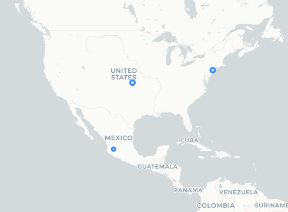

# Botón Auxilio Escudo Urbano

## Fecha de análisis

- **Análisis estático (mediante Exodus Privacy/MobFS):** 24/10/2023
- **Análisis dinámico (mediante análisis de tráfico de red):** 23/10/2023
- **Análisis Posteriores:** 

## Enlaces a los archivos analizados

- [boton-auxilio-escudo-urbano.pcap](https://cloud.datavoros.org/index.php/s/LKDsyCAKqZq4pAK)
- [boton-auxilio-escudo-urbano.apk](https://cloud.datavoros.org/index.php/s/XTgc9daoedPztdE)
- [Capturas de pantalla](https://cloud.datavoros.org/index.php/s/nscon6MDdX4jmtG)

## Descripción de la aplicación
- **Tipo:** Botón de pánico
- **Costo:** Gratis
- **Enlace de descarga:** [https://play.google.com/store/apps/details?id=com.c5.boton_auxilio_jalisco_flutter](https://play.google.com/store/apps/details?id=com.c5.boton_auxilio_jalisco_flutter)
- **Descargas:** 1k+
- **Ultima fecha de actualización:** 16/10/2023
- **Versión:** 2.1.2
- **Desarrollador:** Gobierno del Estado de Jalisco 2022
- **Firma:** No disponible
- **Contacto:** botondeauxilio@c5jalisco.gob.mx
- **Condiciones de uso y Política de privacidad:** [https://web.archive.org/web/20231024110742/https://botondeauxilio.c5jalisco.gob.mx/api/usuarios/getAllTerminos?id_aplicacion=1](https://web.archive.org/web/20231024110742/https://botondeauxilio.c5jalisco.gob.mx/api/usuarios/getAllTerminos?id_aplicacion=1)

    
- **Descripción en PlayStore:**
~~~
Esta nueva aplicación te permitirá generar alertas de ayuda con múltiples indoles.
~~~

## Rastreadores identificados (mediante Exodus Privacy)

|Rastreador|Tipo|
|---|---| 
|[Google Firebase Analytics](https://firebase.google.com/)|Analítica|

**NOTA**: No pudimos analizar esta aplicación en el portal de Exodus Privacy, así que nos guiamos con el resultado del análisis de [MobSF](https://cloud.datavoros.org/index.php/s/4RKLfWNeaRC5sya).

## Empresas relacionadas con esta aplicación:

- [Alphabet](https://abc.xyz/) --> Google - Crashes, Analítica
- [Coeficiente Comunicaciones](https://coeficientemx.com/) - Almacenamiento de archivos

### Dominios integrados al código de la aplicación que no pertecen directamente a los rastreador

- Nada que reportar

## Permisos   

- **Según MobFS/Exodus Privacy:** 11
- **Según prueba de uso:** 2

### Permisos según MobSF

- :pushpin::exclamation:ACCESS_COARSE_LOCATION
_access approximate location only in the foreground_

- :pushpin::exclamation:ACCESS_FINE_LOCATION
_access precise location only in the foreground_

- ACCESS_NETWORK_STATE
_view network connections_

- ACCESS_WIFI_STATE
_view Wi-Fi connections_

- INTERNET
_have full network access_

- :busts_in_silhouette::exclamation:READ_CONTACTS
_read your contacts_

- :telephone_receiver::exclamation:READ_PHONE_STATE
_read phone status and identity_

- VIBRATE
_control vibration_

- WAKE_LOCK
_prevent phone from sleeping_

- DYNAMIC_RECEIVER_NOT_EXPORTED_PERMISSION

- BIND_GET_INSTALL_REFERRER_SERVICE

El icono :exclamation: indica un nivel 'Peligroso' o 'Especial' de acuerdo a los [niveles de protección de Google](https://developer.android.com/guide/topics/permissions/overview). 

### Permisos solicitados durante el uso de la aplicación

- :red_circle: Ubicación
- :blue_circle: Acceso a contactos

:red_circle: Este ícono indica un permiso obligatorio   
:blue_circle: Este ícono indica un permiso opcional pero se pierde una funcionalidad particular

## Datos

### Datos solicitados al usuario durante el uso de la aplicación

- :red_circle: Nombre y apellido paterno
- :blue_circle: Apellido materno
- :red_circle: Fecha de nacimiento
- :red_circle: Sexo (Masculino, Femenino, Otros)
- :red_circle: Correo Electrónico
- :red_circle: Número de Teléfono
- :red_circle: Contacto de emergencia
- :blue_circle: Padecimientos (Anemia, asma, cáncer, diabetes, dificultad respiratoria, discapacidad auditiva, epoc, ets, hipertensión, insuficiencia renal, neumonía, obesidad, obstrucción intestinal, paro cardíaco, piedras en los riñones, preeclampsia, quistes, taquicardia, úlceras)
- :blue_circle: Perfiles (Ciudadano, Código Violeta, Ganadero)

:red_circle: Este ícono indica un dato obligatorio   
:blue_circle: Este ícono indica un dato opcional pero se pierde una funcionalidad particular

### Tabla de conexiones realizadas durante el uso de la aplicación

| Dirección IP    | País          | Ciudad               | Número AS | Organización AS            | Dominio             |
|-----------------|---------------|----------------------|-----------|----------------------------|-------------------------------------|
| 131.196.248.243 | Mexico        | Tlajomulco de Zuniga |    265524 | COEFICIENTE COMUNICACIONES | botondeauxilio.c5jalisco.gob.mx     |
| 142.251.34.46   | United States | Queens               |     15169 | GOOGLE                     | clients4.google.com                 |
| 192.178.52.202  | United States |                      |     15169 | GOOGLE                     | firebaseinstallation.googleapis.com |

**La columna de Dominio son solicitudes de conexión de la aplicación establecidas a través del DNS. Conocer esto no siempre es posible, ya que muchas veces dichas comunicaciones están cifradas. Sólo ennumeramos aquellas que tienen un interés puntual para este proyecto, a saber, rastreadores y empresas no relacionadas con los rastreadores.**

### Mapa de conexiones realizadas durante el uso de la aplicación

### Datos compartidos y uso según la Playstore:

- No se comparten datos con terceros

### Datos recopilados y uso según la Playstore

|Datos|Uso|
|---|---|
|Ubicación precisa|Funciones de la aplicación|

### Prácticas de seguridad

- Los datos están cifrados en tránsito
- Puedes solicitar que se borren los datos

### Datos recopilados y uso según la Política de privacidad

|Datos|
|---|
|**Información identificativa recolectada a través del botón de pánico**: Calle, número, cruces de calle, colonia, localidad, municipio, fecha y hora del reporte, nombre completo, tipo de teléfono, número de teléfono del reportante, sexo, edad, nacionalidad|
|**Información sensible recolectada a través del botón de pánico**: Características fisiológicas, media afiliación, timbre de voz, padecimientos, incapacidades médicas, información de la vida sexual, geolocalización, coordenadas, ubicación de incidentes, referencia del lugar del incidente, rasgos de personalidad.|
|**Información del protocolo del incidente**: Condición de la persona (viva o muerta), rol de la persona involucrada en el incidente, presencia de alcohol, droga, armas involucradas, placa de vehículos|
|**Información recolectada a través de cámaras de videovigilancia**: Imagen de personas en el espacio público y bienes inmuebles|

- #### El uso general que le dan a la información incluye:
    - **Fines administrativos**:
        - Operar los servicios de llamadas de emergencia
        - Establecer un banco de información para ayudar a la toma oportuna de decisiones de las autoridades municipales, estatales y federales.
        - Coordinar y coadyuvar con instancias federales, estatales y municipales además de organismos privados en la atención de emergencias.
        - Remitir a la fiscalía del Estado de Jalisco información para la prevención, investigación y persecución de delitos.
        - Generar estadísticas de reportes y llamados de auxilio falsos.
        - Generar estadísticas para definir zonas de riesgo en el estado de Jalisco
   

- #### La información que se comparte con terceros y con subsidiarias puede incluir:
    - No se comparte información con terceros.

*El ícono :exclamation: denota, lo que creemos que es algo importante a tomar en cuenta sobre la privacidad de la persona usuaria.*   
        

### Notas importantes sobre seguridad y privacidad:

- :exclamation:El enlace del aviso de privacidad de la Playstore redirige a un aviso de privacidad que es en realidad parte de la API de la aplicación. Lo que lo vuelve bastante ilegible.
- Además de los perfiles "Ciudadano", "Código Violeta" y "Perfil ganaderos", existe el perfil "Adultos Mayores" y el perfil "Personas con discapacidad auditiva". Estos últimos dos se activan automáticamente si se cumple el requerimiento en el registro.
- En esta [página](https://c5jalisco.gob.mx/avisos-de-privacidad) se pueden encontrar los avisos de privacidad de varios servicios ofrecidos por el C5 Jalisco. Hay dos que corresponden a botón de pánico y no sabemos cuál corresponde a la aplicación analizada, de todos modos, son idénticos entre ellos. Cada uno tiene tres versiones del aviso de privacidad:
1. [Aviso de privacidad corto](https://cloud.datavoros.org/index.php/s/p22GTkdR7w5kcfA)
2. [Aviso de privacidad simplificado](https://cloud.datavoros.org/index.php/s/5Nnqps6WiMP9dyQ)
3. [Aviso de privacidad integral](https://cloud.datavoros.org/index.php/s/RJHEB3TMJ3f2e37)
- Hay un bug: si no se selecciona el sexo en el registro antes que la fecha de nacimiento, entonces no se puede agregar.
- La aplicación manda muchas veces error en distintas instancias de la misma. Si se vuelve a intentar, el error deja de aparecer.
- A diferencia de la versión pasada (Botón Auxlio Jalisco), esta aplicación exige generar una contraseña segura.
- A diferencia de la versión pasada (Botón Auxilio Jalisco), esta aplicación no permite borrar la cuenta creada.
- Es importante mencionar que esta aplicación es muy distintas a las demás analizadas para el 25N. Esta no permite el monitoreo entre pares, sino que es un botón de auxilio. 
- En la PlayStore no se especifican los datos recolectados a la hora de generar una cuenta, ni tampoco los datos de analítica que se recaban a través del rastreador Firebase de Google. 
- Si bien se puede solicitar que los datos se borren según la PlayStore, dentro de la aplicación no encontramos esta función. 
- En el aviso de privacidad no se menciona la recolección de información a través de rastreadores de terceros (Google).

## Conclusiones

- La aplicación está plagada de pequeños errores o *bugs* que la hacen poco consistente para usarse como botón de pánico.
- Tiene un rastreador de Google y esto no es mencionado nunca en el aviso de privacidad ni en la PlayStore, lo cual nos genera desconfianza.
- La función de borrar la cuenta de la versión anterior de la aplicación nos parecía importante para salvaguardar la privacidad de las personas usuarias y decidieron eliminarla.
- Los avisos de privacidad siguen siendo confusos y no hay enlaces a ellos en la PlayStore.
- Los permisos son congruentes con la funcionalidad de la aplicación, lo mismo que la información recabada.
- Consideramos que es una mejor aplicación que Botón de Auxilio Jalisco y apoyamos el avance y el desarrollo de estas tecnologías, pero todavía necesitan pulirla muchísimo para que pueda ser considerada una opción viable de seguridad. 