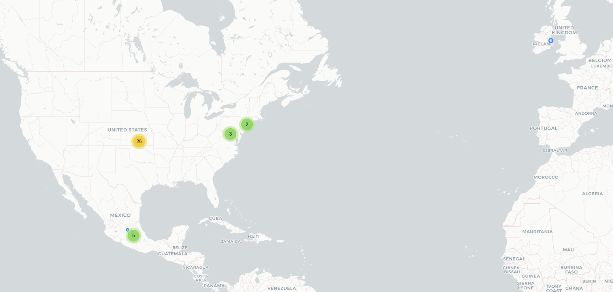

# BSafe

## Fecha de análisis

- **Análisis estático (mediante Exodus Privacy/MobFS):** 16/10/2023
- **Análisis dinámico (mediante análisis de tráfico de red):** 16/10/2023
- **Análisis Posteriores:** 

## Links a los archivos analizados

- [bsafe.pcap](https://cloud.datavoros.org/index.php/s/HgBJXYZdQDSLQrS)
- [bsafe.apk](https://cloud.datavoros.org/index.php/s/NYf4QJLsgCK7BAW)

## Descripción de la aplicación
- **Tipo:** Localizador
- **Costo:** De paga   
- **Link de descarga:** [https://play.google.com/store/apps/details?id=com.bipper.app.bsafe&hl=es&gl=US](https://play.google.com/store/apps/details?id=com.bipper.app.bsafe&hl=es&gl=US)
- **Descargas:** 1M+
- **Ultima fecha de actualización:** 08/09/2023
- **Versión:** 4.0.0
- **Desarrollador:** Mobile Software AS
- **Firma:** Bipper Communication
- **Contacto:** support@getbsafe.com
- **Condiciones de uso y Política de privacidad:** [https://web.archive.org/web/20231016174103/https://www.getbsafe.com/privacy-policy](https://web.archive.org/web/20231016174103/https://www.getbsafe.com/privacy-policy)

    
- **Descripción en PlayStore:**
~~~
Después de un incidente de agresión sexual, Charlen y su padre desarrollaron bSafe, una de las aplicaciones de seguridad personal más avanzadas y confiables del mundo.

Expuesto en 125 países con millones de descargas y más de 100.000 artículos en medios como ABC, CNN, NBC, BBC, Fox News y Forbes.

"bSafe es un servicio de seguridad que puede ser utilizado fácilmente por cualquier persona. Veo el potencial para resolver problemas reales para los niños y los padres y para cualquiera que busque soluciones para aumentar su seguridad. Todos necesitan un servicio como este". - Jada Pinkett Smith

APLICACIÓN DE SEGURIDAD PERSONAL MEJOR CLASIFICADA

bSafe previene delitos como la violencia, las agresiones sexuales y la violación, además de crear pruebas en los casos en los que ya ha ocurrido.
bSafe le brinda tecnología innovadora que previene y documenta la violencia y las amenazas para sus seres queridos, empleados, estudiantes y su comunidad.
Activación por voz, Transmisión en vivo, Grabación de audio / video, Llamada falsa y Sígueme en combinación con la ubicación y el seguimiento son algunas de las funciones que pueden ayudarlo a mantenerse seguro.

ASÍ ES COMO FUNCIONA BSAFE

Activación de voz:
Habilite la alarma SOS mediante el tacto o la voz, incluso si su teléfono celular está dentro de su chaqueta, bolsillo o bolso. No es necesario presionar el botón SOS para activarlo.

Transmisión en vivo: cuando se activa el SOS, sus tutores obtendrán su ubicación y podrán rastrearlo. Los guardianes podrán ver y escuchar todo lo que está sucediendo en tiempo real a través de transmisión en vivo y pueden rastrear su ubicación al mismo tiempo.

Grabación automática: cuando se activa la alarma SOS, su teléfono comenzará a grabar automáticamente tanto audio como video. Los archivos grabados se enviarán al teléfono celular de su tutor.

Llamada falsa:
Haz que tu teléfono te llame y salga de situaciones desagradables o amenazantes.

Guardianes:
Configure su propia red de seguridad social y personal de amigos y familiares (tutores). Invita a todos los que quieras.

Sígueme:
Pide a tus tutores que te sigan a casa con el seguimiento GPS en vivo Sígueme. Podrán verte en vivo a través del mapa en su móvil. Una vez que haya llegado a casa de manera segura, sus tutores recibirán un mensaje al respecto.
~~~

## Rastreadores identificados (mediante Exodus Privacy)

|Tracker|Tipo|
|---|---| 
|[Branch](https://branch.io)|Analítica|
|[Facebook Analytics](https://developers.facebook.com/docs/android)|Analítica|
|[Facebook Flipper](https://fbflipper.com/)|Analítica|
|[Facebook Login](https://developers.facebook.com/docs/android)|Identificación|
|[Facebook Share](https://developers.facebook.com/docs/android)|Compartir|
|[Google Crashlytics](https://firebase.google.com/)|Reporte de fallos|
|[Google Firebase Analytics](https://firebase.google.com/)|Analítica|

Enlace al [reporte](https://reports.exodus-privacy.eu.org/es/reports/com.bipper.app.bsafe/latest/) de Exodus Privacy. 

## Empresas relacionadas con esta aplicación:

- [Mobile Software AS](https://www.getbsafe.com/)
- [Alphabet](https://abc.xyz/) --> Google - Crashes, Analítica
- [Amazon](https://aws.amazon.com/) - Almacenamiiento de datos
- [Meta](https://about.meta.com/ltam/)
- [Twilio](https://twilio.com)

### Dominios integrados al código de la app que no pertecen directamente a los trackers
 Nada que reportar

## Permisos   

- **Según MobFS/Exodus Privacy:** 25
- **Según prueba de uso:** 3

### Permisos según Exodus Privacy

- :pushpin::exclamation:ACCESS_BACKGROUND_LOCATION
_access location in the background_

- :pushpin::exclamation:ACCESS_COARSE_LOCATION
_access approximate location only in the foreground_

- :pushpin::exclamation:ACCESS_FINE_LOCATION
_access precise location only in the foreground_

- ACCESS_NETWORK_STATE
_view network connections_

- ACCESS_WIFI_STATE
_view Wi-Fi connections_

- BLUETOOTH
_pair with Bluetooth devices_

- :telephone_receiver::exclamation:CALL_PHONE
_directly cal phone numbers_

- :camera::exclamation:CAMERA
_take pictures and videos_

- FOREGROUND_SERVICE
_run foreground service_

- INTERNET
_have full network access_

- MODIFY_AUDIO_SETTINGS
_change your audio settings_

- NOTIFICATION_POLICY

- POST_NOTIFICATIONS

- :busts_in_silhouette::exclamation:READ_CONTACTS
_read your contacts_

- RECEIVE_BOOT_COMPLETED
_run at startup_

- :speaker::exclamation:RECORD_AUDIO
_record audio_

- REORDER_TASKS
_rorder running apps_

- VIBRATE
_control vibration_

- WAKE_LOCK
_prevent phone from sleeping_

- :file_folder::exclamation:WRITE_EXTERNAL_STORAGE
_modify or delete the contents of your shared storage_

- BILLING

- DYNAMIC_RECEIVER_NOT_EXPORTED_PREMISSION

- RECEIVE

- BIND_GET_INSTALL_REFERRER_SERVICE

- AD_ID

El icono :exclamation: indica un nivel 'Peligroso' o 'Especial' de acuerdo a los [niveles de protección de Google](https://developer.android.com/guide/topics/permissions/overview). 

### Permisos solicitados durante el uso de la aplicación

- :red_circle:Localización
- :red_circle:Contactos
- :red_circle:Acceso a grabar audio

:red_circle: Este ícono indica un permiso obligatorio   
:large_blue_circle: Este ícono indica un permiso opcional pero se pierde una funcionalidad particular

## Datos

### Datos solicitados al usuario durante el uso de la aplicación

- :red_circle:Número de teléfono
- :red_circle:Correo Electrónico
- :red_circle:Nombre y Apellido
- :blue_circle: Foto
- :red_circle: Datos de contactos de emergencia

**NOTA**:    
    - Recordar que si se accede con Google o con Facebook, todos los datos almacenados en Google o Facebook podrán ser compartidos con Bsafe.   
    - Como existe la función de pago, probablemente (no lo probamos) los datos que se necesitan para ello son de una tarjeta o forma de pago y dirección de facturación.
    
:red_circle: Este ícono indica un dato obligatorio   
:blue_circle: Este ícono indica un dato opcional pero se pierde una funcionalidad particular

### Tabla de conexiones realizadas durante el uso de la aplicación

| Dirección IP    | País          | Ciudad         | Número AS | Organización AS | Rastreadores o dominio               |
|-----------------|---------------|----------------|-----------|-----------------|--------------------------------------|
| 3.161.4.20      | United States |                |     16509 | AMAZON-02       | cdn.branch.io                        |
| 18.160.109.2    | United States |                |     16509 | AMAZON-02       | cdn.branch.io                        |
| 34.245.247.31   | Ireland       | Dublin         |     16509 | AMAZON-02       |                                      |
| 52.54.210.54    | United States | Ashburn        |     14618 | AMAZON-AES      | bsafe.bipper.com                     |
|  52.217.173.153 | United States | Ashburn        |     16509 | AMAZON-02       | bsafe                                |
| 54.174.39.113   | United States | Ashburn        |     14618 | AMAZON-AES      | bsafe.bipper.com                     |
| 142.250.115.188 | United States |                |     15169 | GOOGLE          | mtalk.google.com                     |
| 142.250.138.188 | United States |                |     15169 | GOOGLE          | mtalk.google.com                     |
| 142.250.177.10  | United States |                |     15169 | GOOGLE          | googleapis.com                       |
| 142.250.177.14  | United States |                |     15169 | GOOGLE          | app-measurement.com                  |
| 142.251.34.10   | United States | Queens         |     15169 | GOOGLE          | googleapis.com                       |
| 142.251.34.42   | United States | Queens         |     15169 | GOOGLE          | googleapis.com                       |
| 142.251.218.132 | United States |                |     15169 | GOOGLE          | google.com                           |
| 142.251.218.138 | United States |                |     15169 | GOOGLE          | firebaseinstallations.googleapis.com |
| 157.240.25.1    | Mexico        | Querétaro City |     32934 | FACEBOOK        | graph.facebook.com                   |
| 172.217.2.138   | United States |                |     15169 | GOOGLE          | googleapis.com                       |
| 172.217.2.142   | United States |                |     15169 | GOOGLE          | app-measurement.com                  |
| 172.217.3.138   | United States |                |     15169 | GOOGLE          | googleapis.com                       |
| 172.217.3.142   | United States |                |     15169 | GOOGLE          | apis.google.com                      |
| 172.217.3.150   | United States |                |     15169 | GOOGLE          | googleusercontent.com                |
| 172.217.4.163   | United States |                |     15169 | GOOGLE          | gstatic.com                          |
| 172.217.4.170   | United States |                |     15169 | GOOGLE          | googleapis.com                       |
| 172.217.15.10   | United States |                |     15169 | GOOGLE          | googleapis.com                       |
| 189.247.22.13   | Mexico        |                |      8151 | UNINET          | gvt1.com (google)                    |
| 189.247.22.15   | Mexico        |                |      8151 | UNINET          | gvt1.com (google)                    |
| 189.247.22.17   | Mexico        |                |      8151 | UNINET          | gvt1.com (google)                    |
| 189.247.22.79   | Mexico        |                |      8151 | UNINET          | gvt1.com (google)                    |
| 189.247.22.80   | Mexico        |                |      8151 | UNINET          | gvt1.com (google)                    |
| 192.178.52.138  | United States |                |     15169 | GOOGLE          | googleapis.com                       |
| 192.178.52.163  | United States |                |     15169 | GOOGLE          | gstatic.com                          |
| 192.178.52.170  | United States |                |     15169 | GOOGLE          | googleapis.com                       |
| 192.178.52.174  | United States |                |     15169 | GOOGLE          | googleapis.com                       |
| 192.178.52.202  | United States |                |     15169 | GOOGLE          | googleapis.com                       |
| 192.178.52.206  | United States |                |     15169 | GOOGLE          | clients4.google.com                  |
| 192.178.52.227  | United States |                |     15169 | GOOGLE          | crashlytics.com                      |
| 192.178.52.234  | United States |                |     15169 | GOOGLE          | firebaseinstallations.googleapis.com |
| 192.178.52.238  | United States |                |     15169 | GOOGLE          | google.com                           |
| 216.58.195.234  | United States |                |     15169 | GOOGLE          | googleapis.com                       |

**Los dominios o rastreadores contactados son solicitudes de conexión de la aplicación establecidas a través del DNS. Conocer esto no siempre es posible, ya que muchas veces dichas comunicaciones están cifradas.**

### Mapa de conexiones realizadas durante el uso de la aplicación

### Datos compartidos y uso según la Playstore:

Es posible que se compartan datos con terceros de:
- Ubicación aproximada y ubicación precisa para funcionalidades de la aplicación
- Información personal para funcionalidades de la aplicación y gestión de cuentas
    - Nombre
    - Número de teléfono
- Contactos para funcionalidades de la aplicación

### Datos recopilados y uso según la Playstore

No se recopilan datos

### Prácticas de seguridad

- Los datos están encriptados en tránsito
- Puedes solicitar que se borren los datos

### Datos recopilados y uso según la Política de privacidad

|Datos|
|---|
|**Información de cuenta**: Nombre, username, número de teléfono, direcciones sms, fotos, dirección de email y año de nacimiento.|
|**Información generada por el uso de los servicios**: ubicaciones, información de emergencias o incidentes y los detalles de contactos.|
|**Información de terceros**: datos de terceros obtenidos por interacciones con la aplicación como comunicaciones y datos de los contactos**|
|**Información técnica**: tipo de explorador, plataforma móvil, ubicación, dirección IP e historial de páginas visitadas|
|**Información financiera**: información derivada de los pagos realizados|
|**Información derivada del uso de Facebook o Google**|
|**Información obtenida via rastreadores, web beacons y cookie**: es anonimizada|

#### El uso general que le dan a la información incluye:

- Información anonimizada de tráfico, uso, demografía y más puede ser utiilizada y vendida a terceros con fines de análisis, marketing, publicidad, desarrollo y mantenimiento de los productos.
- La información personal no se vende y sólo es usada para intereses de la propia empresa como: contactar al cliente, ofrecer los servicios y cumplir con las disposiciones de la ley.
- La información personal puede ser compartida con terceros con fines de ofrecer los servicios como en una emergencia o cumplir con la ley o cuando estos provean de un servicio, por ejemplo webhosting. 

    

**NOTA**: 
    - En la Playstore se afirma que no se comparten datos con terceros, mientras que en el aviso de privacidad se estipula de manera clara que toda la información anonimizada se puede compartir con terceros. Lo mismo sucede con cierta información personal.
  
        

### Notas importantes sobre seguridad y privacidad:

- Empresa basada en Noruega pero sus servidores se encuentran en Estados Unidos. 
- Todas las funciones son de pago

## Conclusiones

- Si bien no probamos la aplicación en su versión de pago, de tal manera que no pudimos probar la mayoría de sus funciones, simpldmente por los rastreadores presentes y la política de privacidad, podemos concluir que no es una aplicación que respete la privacidad de las personas usuarias. Los datos recolectados, probablemente son vendidos y/o utilizados para campañas de marketing y publicidad.
- Los permisos solicitados son pocos con respecto a otras aplicaciones similares y son congruentes con las funcionalidades. Asimismolos datos solicitados también son congruentes con las funcionalidades de la aplicación.

