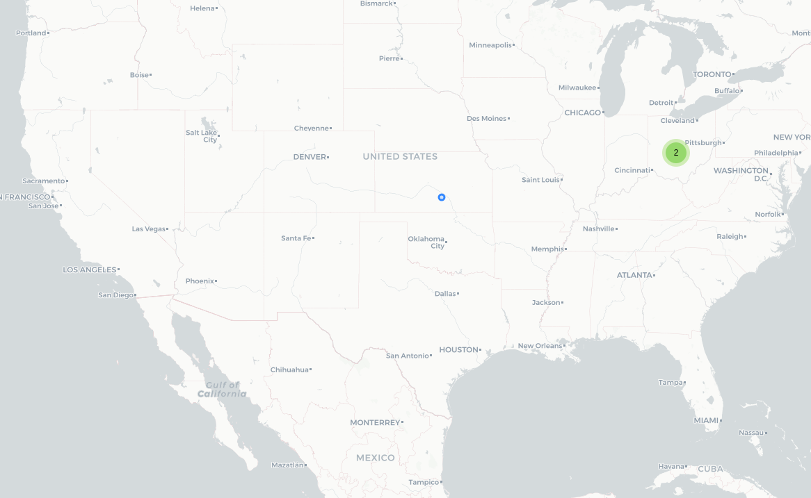

# Círculo 2.0

## Fecha de análisis

- **Análisis estático (mediante Exodus Privacy/MobFS):** 24/10/2023
- **Análisis dinámico (mediante análisis de tráfico de red):** 24/10/2023
- **Análisis Posteriores:** 

## Archivos analizados

- [apk versión 2.1.1-BETA-2](https://cloud.datavoros.org/index.php/s/SNktYMYHEEtMkHq)
- [pcap version 2.1.1-BETA-2](https://cloud.datavoros.org/index.php/s/FMRaA9mjYLp2Xwb)
- [Capturas de pantalla](https://cloud.datavoros.org/index.php/s/JierRyKiiZtg468)
- [Reporte MobSF](https://cloud.datavoros.org/index.php/s/DRq3XMjkocfdzjK)

## Descripción de la aplicación
- **Tipo:** Localizador
- **Costo:** Gratis  
- **Enlace de descarga:** [https://play.google.com/store/apps/details?id=org.article19.circulo.next](https://play.google.com/store/apps/details?id=org.article19.circulo.next)
- **Descargas:** 1k+
- **Ultima fecha de actualización:** 1/08/2023
- **Versión:** 2.1.1-BETA-2
- **Desarrollador:** Guardian Project: Apps You Can Trust
- **Firma:** Article 19
- **Contacto:** support@guardianproject.info
- **Condiciones de uso y Política de privacidad:** El enlace en la PlayStore está caído y en la [página](https://encirculo.org/es/) del proyecto no encontramos ningún aviso de privacidad.

    
- **Descripción en PlayStore:**
~~~
Círculo es una aplicación que ofrece un canal seguro de comunicación entre tú y tus contactos, para que -al enfrentar situaciones de riesgo- sea tu red de apoyo quien implemente los protocolos de seguridad pertinentes.
~~~

## Rastreadores identificados (mediante Exodus Privacy)

|Rastreador|Tipo|
|---|---| 
|[Google Firebase Analytics](https://firebase.google.com/)|Analítica|

Enlace al [reporte](https://reports.exodus-privacy.eu.org/es/reports/385052/) de Exodus Privacy. 

## Empresas relacionadas con esta aplicación:

- [Alphabet](https://abc.xyz/) --> Google - Analítica
- [Amazon](https://www.aboutamazon.mx/quienes-somos) - Almacenamiento de archivos

### Dominios integrados al código de la aplicación que no pertecen directamente a los rastreadores

|Dominios|
|---|   
|https://api.giphy.com|   
|https://docs.mongodb.com|   
|https://scalar.vector.im/ --> [Element](https://element.io/about)|   
|https://realm.io/|   
|https://matrix.org|   

## Permisos   

- **Según MobFS/Exodus Privacy:** 27
- **Según prueba de uso:** 3

### Permisos según Exodus Privacy

- :pushpin::exclamation:ACCESS_COARSE_LOCATION
_access approximate location only in the foreground_

- :pushpin::exclamation:ACCESS_FINE_LOCATION
_access precise location only in the foreground_

- ACCESS_NETWORK_STATE
_view network connections_

- ACCESS_WIFI_STATE
_view Wi-Fi connections_

- BLUETOOTH
_pair with Bluetooth devices_

- BLUETOOTH_ADMIN
_access bluetooth settings_

- :telephone_receiver::exclamation:CALL_PHONE
_directly call phone numbers_

- :camera::exclamation:CAMERA
_take pictures and videos_

- CHANGE_WIFI_STATE
_connect and disconnect from Wi-Fi_

- FOREGROUND_SERVICE
_run foreground service_

- INTERNET
_have full network access_

- MODIFY_AUDIO_SETTINGS
_change your audio settings_

- POST_NOTIFICATIONS

- :file_folder::exclamation:READ_EXTERNAL_STORAGE
_read the contents of your shared storage_

- READ_MEDIA_AUDIO

- READ_MEDIA_IMAGES

- READ_MEDIA_VIDEO

- :telephone_receiver::exclamation:READ_PHONE_STATE
_read phone status and identity_

- RECEIVE_BOOT_COMPLETED
_run at startup_

- :speaker::exclamation:RECORD_AUDIO
_record audio_

- REQUEST_IGNORE_BATTERY_OPTIMIZATIONS
_ask to ignore battery optimizations_

- :blue_heart:USE_BIOMETRIC
_use biometric hardware_

- :blue_heart:USE_FINGERPRINT
_use fingerprint hardware_

- VIBRATE
_control vibration_

- WAKE_LOCK
_prevent phone from sleeping_

- :file_folder::exclamation:WRITE_EXTERNAL_STORAGE
_modify or delete the contents of your shared storage_

- RECEIVE

- DYNAMIC_RECEIVER_NOT_EXPORTED_PERMISSION

El icono :exclamation: indica un nivel 'Peligroso' o 'Especial' de acuerdo a los [niveles de protección de Google](https://developer.android.com/guide/topics/permissions/overview). 

### Permisos solicitados durante el uso de la aplicación

- :blue_circle: Ubicación
- :blue_circle: Grabar Audio
- :blue_circle: Tomar fotos y grabar video
- :red_circle: Ejecutar en segundo plano

:red_circle: Este ícono indica un permiso obligatorio   
:blue_circle: Este ícono indica un permiso opcional pero se pierde una funcionalidad particular

## Datos

### Datos solicitados al usuario durante el uso de la aplicación

- :blue_circle:Nombre

    
:red_circle: Este ícono indica un dato obligatorio   
:blue_circle: Este ícono indica un dato opcional pero se pierde una funcionalidad particular

### Tabla de conexiones realizadas durante el uso de la aplicación

| Dirección IP   | País          | Ciudad   | Número AS | Organización AS | Dominio |
|----------------|---------------|----------|-----------|-----------------|----------------------|
| 3.12.45.222    | United States | Columbus |     16509 | AMAZON-02       | casa.encirculo.org   |
| 3.128.136.76   | United States | Columbus |     16509 | AMAZON-02       | casa.encirculo.org   |
| 18.161.156.128 | United States |          |     16509 | AMAZON-02       | encirculo.org        |

**Los dominios o rastreadores contactados son solicitudes de conexión de la aplicación establecidas a través del DNS. Conocer esto no siempre es posible, ya que muchas veces dichas comunicaciones están cifradas. En este caso las llamadas a DNS están cifradas, por eso no hay más datos.**

### Mapa de conexiones realizadas durante el uso de la aplicación

### Datos compartidos y uso según la Playstore:

- No se comparten datos con terceros

### Datos recopilados y uso según la Playstore

- No se recopilan datos

### Prácticas de seguridad

- No se especifican

### Datos recopilados y uso según la Política de privacidad

- No tuvimos acceso al aviso de privacidad

### Notas importantes sobre seguridad y privacidad:

- No tenemos acceso al aviso de privacidad desde la PlayStore
- No marcan en la PlayStore sus prácticas de seguridad
- Dicen no recopilar datos en la PlayStore pero tienen el rastreador de Google Firebase Analytics
- Hace hincapié en la posibilidad de conectarse con un alias
- Se puede evitar la captura de pantallas
- Se puede generar un respaldo de seguridad por si la persona usuaria pierde las claves de acceso.
- Se puede bloquear la aplicación con un PIN
- Se puede cambiar el ícono de la aplicación para poder esconderla
- La pestaña recursos en en la sección Acerca de de, hace que la aplicación se cierre.
- Se permite elegir entre mandar registros para depurar la aplicación
- Se permite elegir entre mandar datos anónimos de uso
- En la sección Contribuir, después de haber aceptado mandar datos anónimos de uso, se puede elegir la opción Sí y la opción No al mismo tiempo.
- Cualquiera que tenga un vínculo se puede unir al "círculo"
- El nombre de usuario es muy complejo
- Función mostrar QR para unirse al círculo no funciona
- En nuestro Motoral G8, se trabó varias veces la aplicación de manera aleatoria
- Para la ubicación se utiliza un servicio externo (en nuestro caso Google Maps) y se tiene que tener instalada esta aplicación
- La aplicación es de código abierto

## Conclusiones

- La aplicación tiene un grado alto de privacidad ya que sólo pide un alias para poder funcionar. 
- Los permisos solicitados son congruentes con las funciones de la aplicación.
- Incluso aceptando la recolección de datos de métricas, no hubo conexiones al rastreador Firebase de Google.
- Aunque la aplicación es excelente en términos de privacidad hay elementos de usabilidad que la vuelven compleja de utilizar:
    - el nombre de usuario que se asigna es largo y difícil de memorizar
    - en nuestra prueba, la aplicación se trabó de manera aleatoria algunas veces
    - hay otros problemas mencionados en la sección anterior
- Nos preocupa que no hayamos tenido acceso al Aviso de Privacidad, eso nos parece fundamental. 
- Las tecnologías utilizadas para construir la aplicación son de código abierto y libres como Matrix, Element o MongoDB. Esto es una excelente práctica, sin contar que la propia aplicación es libre y de código abierto. 