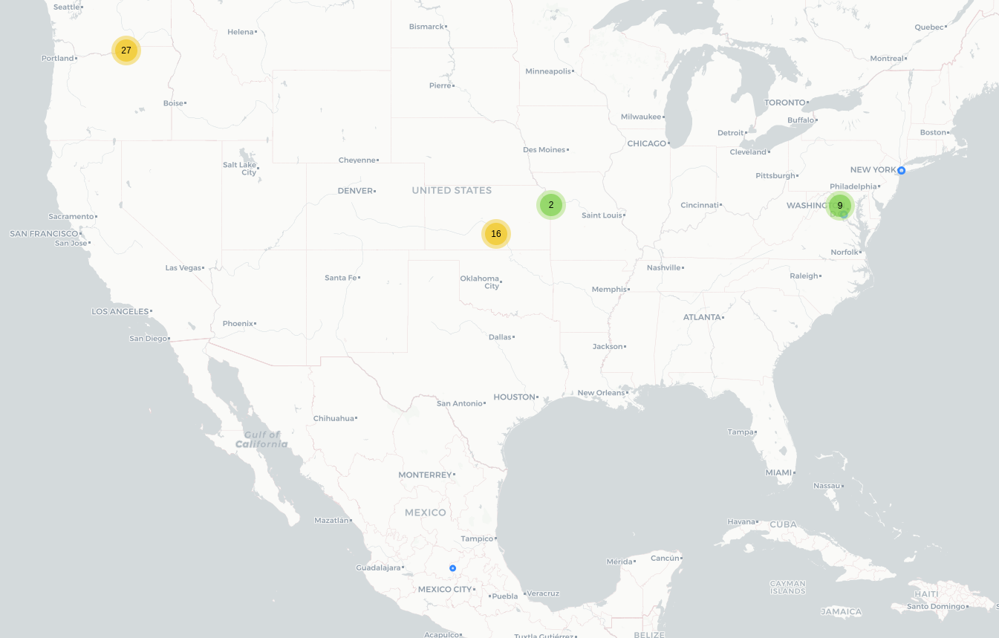

# Donna

## Fecha de análisis

- **Análisis estático (mediante Exodus Privacy/MobFS):** 11/10/2023
- **Análisis dinámico (mediante análisis de tráfico de red):** 11/10/2023
- **Análisis Posteriores:** 

## Links a los archivos analizados

- [donna.pcap](https://cloud.datavoros.org/index.php/s/2Lmd2FRs3WwXFPM)
- [donna.apk](https://cloud.datavoros.org/index.php/s/Ct2KP5F6La2JFGW)

## Descripción de la aplicación
- **Tipo:** Localizador
- **Costo:** Freemium  
- **Link de descarga:** [https://play.google.com/store/apps/details?id=com.somosdonna&hl=es_MX&gl=US](https://play.google.com/store/apps/details?id=com.somosdonna&hl=es_MX&gl=US)
- **Descargas:** 10K+
- **Ultima fecha de actualización:** 02/10/2023
- **Versión:** 1.1.8.4
- **Desarrollador:** WeHelp Security
- **Firma:** No disponible
- **Contacto:** services@lovewehelp.com
- **Condiciones de uso y Política de privacidad:** [https://web.archive.org/web/20231012164359/https://s3-us-west-2.amazonaws.com/lovewehelp.com/media/privacy_policy_flat.html](https://web.archive.org/web/20231012164359/https://s3-us-west-2.amazonaws.com/lovewehelp.com/media/privacy_policy_flat.html)
    
- **Descripción en PlayStore:**
~~~
Donna es la compañera perfecta para las mujeres que viven en América Latina, brindándoles las herramientas y los recursos que necesitan para mantenerse seguras y proteger sus derechos. Donna está diseñada para asegurarse de que las mujeres se sientan seguras y conectadas, sin importar dónde se encuentren.

ALGUNAS DE NUESTRAS CARACTERÍSTICAS:

Agentes Capacitados 24/7: Nuestras agentes están listas para ayudar en cualquier momento, estés donde estés.

Monitoreo en tiempo real: Nuestras agentes pueden monitorear cualquier situación en tiempo real, brindando orientación y apoyo cuando más se necesita. Es perfecta para salir de noche, viajar en taxi o salir con tus amigas.

Botón de pánico SOS: activa el botón SOS durante 3 segundos para alertar instantáneamente a tus contactos de confianza, al equipo de seguridad de Donna y a los primeros respondientes de ser necesario.

NUESTROS AGENTES: Nuestros agentes son profesionales altamente capacitados dedicados a brindarte asistencia en situaciones de emergencia.

- Paramédicos certificados
- Capacitación rigurosa
- Examenes psicológicos y psicométricos
- Protocolos de emergencia
- Habilidades de comunicación
- Competencia tecnológica

Funciones de seguridad integrales: Donna proporciona funciones de seguridad integrales, como seguimiento de ubicación, alertas en tiempo real, y monitoreo en vivo.

Donna es da herramientas de seguridad a las mujeres que viven en América Latina. Nuestra aplicación te ayuda a mantenerte segura y conectada.

Donna = Monitoreo + SOS + Protección + Seguridad + Comunidad. Tienes el poder de un botón SOS, la protección de agentes entrenados, las herramientas de seguridad más avanzadas y el apoyo y poder de una comunidad.

Con Donna, las mujeres pueden disfrutar de una completa protección y tranquilidad en su día a día, sabiendo que cuentan con las herramientas más avanzadas disponibles para mantenerse a salvo.

PLANES:
Oro: $49MXN al mes
Platinpo: $149MXN al mes
Diamante: $399MXN al mes

Donna está disponible en español e inglés.

Descarga Donna y mantente segura y conectada.

Disclaimer: el uso continuo de los servicios de ubicación mientras la aplicación está en segundo plano puede agotar excesivamente la batería. Pero no se preocupe, nuestra tecnología de ubicación y nuestros algoritmos siempre mantienen el uso de la batería al mínimo, ¡incluso mientras está en movimiento!
~~~

## Rastreadores identificados (mediante Exodus Privacy)

|Tracker|Tipo|
|---|---| 
|[Facebook Analytics](https://developers.facebook.com/docs/android)|Analítica|
|[Facebook Login](https://developers.facebook.com/docs/android)|Identificación|
|[Facebook Share](https://developers.facebook.com/docs/android)|Compartir|
|[Google Firebase Analytics](https://firebase.google.com/)|Analítica|
|[Huawei Mobile Services (HMS) Core](https://developer.huawei.com/consumer/en/hms)|Analítica, Publicidad, Ubicación|
|[Microsoft Visual Studio App Center Analytics](https://appcenter.ms/)|Analítica|
|[Microsoft Visual Studio App Center Crashes](https://appcenter.ms/)|Reporte de fallos|
|[OneSignal](https://onesignal.com/)|Maximizador de *engagement*|

Enlace al [reporte](https://reports.exodus-privacy.eu.org/es/reports/391532/) de Exodus Privacy. 

## Empresas relacionadas con esta aplicación:

- [LoveWeHelp] --> Empresa listada en su aviso de privacidad, tiene su página [https://lovewehelp.com/](https://lovewehelp.com/) que redirige a Rino App. La empresa que desarrolla Donna tiene una [página](https://www.linkedin.com/showcase/somosdonna/) en LinkedIn que hace referencia a una empresa llamada *somosdonna*
- [Alphabet](https://abc.xyz/) --> Google - Crashes, Analítica
- [Amazon](https://aws.amazon.com/) - Almacenamiiento de datos
- [Huawei](https://www.huawei.com/mx/corporate-information) - Analítica
- [Meta](https://about.meta.com/ltam/)
- [Microsoft](https://www.microsoft.com/es-mx/about)
- [Stripe](https://stripe.com) - Procesamiento de pagos
- [Cloudflare](https://www.cloudflare.com/) - Almacenamiento de datos
- [Intercom](https://www.intercom.com/) - Servicio al cliente y Chatbot hecho con inteligencia artificial
- [Segment](https://segment.com/) - Plataforma de análisis de datos de clientes
- [Gist](https://gist.build/) - Mensajería dentro de las aplicaciones
- [Customer](https://customer.io/) - Push notifications e emails de manera automática
- [Sentry](https://sentry.io/welcome/) - Plataforma que revisa y repara código

### Dominios integrados al código de la app que no pertecen directamente a los trackers

- https://pinterest.com
- https://link.com
- https://logback.qos.ch
- https://react-native-vision-camera.com

## Permisos   

- **Según MobFS/Exodus Privacy:** 45
- **Según prueba de uso:** 3

### Permisos según Exodus Privacy

- :pushpin::exclamation:ACCESS_BACKGROUND_LOCATION
_access location in the background_

- :pushpin::exclamation:ACCESS_COARSE_LOCATION
_access approximate location only in the foreground_

- :pushpin::exclamation:ACCESS_FINE_LOCATION
_access precise location only in the foreground_

- ACCESS_NETWORK_STATE
_view network connections_

- ACCESS_WIFI_STATE
_view Wi-Fi connections_

- :running::exclamation: ACTIVITY_RECOGNITION
_recognize physical activity_

- BLUETOOTH
_pair with Bluetooth devices_

- BLUETOOTH_ADMIN
_access Bluetooth settings_

- :camera::exclamation:CAMERA
_take pictures and videos_

- CHANGE_WIFI_STATE
_connect and disconnect from Wi-Fi_

- FOREGROUND_SERVICE
_run foreground service_

- INTERNET
_have full network access_

- MODIFY_AUDIO_SETTINGS
_change your audio settings_

- POST_NOTIFICATIONS

- READ_APP_BADGE

- :busts_in_silhouette::exclamation:READ_CONTACTS
_read your contacts_

- :file_folder::exclamation:READ_EXTERNAL_STORAGE
_read the contents of your shared storage_

- :telephone_receiver::exclamation:READ_PHONE_STATE
_read phone status and identity_

- RECEIVE_BOOT_COMPLETED
_run at startup_

- :speaker::exclamation:RECORD_AUDIO
_record audio_

- SCHEDULE_EXACT_ALARM

- VIBRATE
_control vibration_

- WAKE_LOCK
_prevent phone from sleeping_

- :busts_in_silhouette::exclamation:WRITE_CONTACTS
_modify your contacts_

- :file_folder::exclamation:WRITE_EXTERNAL_STORAGE
_modify or delete the contents of your shared storage_

- UPDATE_COUNT

- CHECK_LICENSE

- RECEIVE

- BIND_GET_INSTALL_REFERRER_SERVICE

- ACTIVITY_RECOGNITION

- READ_SETTINGS

- UPDATE_SHORTCUT

- CHANGE_BADGE

- WRITE_SETTINGS

- USE_COMPONENT

- UPDATE_BADGE

- READ

- WRITE

- DYNAMIC_RECEIVER_NOT_EXPORTED_PERMISSION

- C2D_MESSAGE

- BROADCAST_BADGE

- PROVIDER_INSERT_BADGE

- BADGE_COUNT_READ

- BADGE_COUNT_WRITE

- OPPO_COMPONENT_SAFE

El icono :exclamation: indica un nivel 'Peligroso' o 'Especial' de acuerdo a los [niveles de protección de Google](https://developer.android.com/guide/topics/permissions/overview). 

### Permisos solicitados durante el uso de la aplicación

- :red_circle:Localización
- :red_circle:Contactos
- :red_circle:Notificaciones
- :red_circle:Acceso a la actividad física
- :red_circle:Acceso a Fotos y Multimedia (en caso de una emergencia)
- :red_circle:Acceso a grabar audio (en caso de una emergencia)

:red_circle: Este ícono indica un permiso obligatorio   
:large_blue_circle: Este ícono indica un permiso opcional pero se pierde una funcionalidad particular

## Datos

### Datos solicitados al usuario durante el uso de la aplicación

- :red_circle:Número de teléfono
- :red_circle:Correo Electrónico
- :red_circle:Género
- :red_circle:Mayor de edad o no de 13 años
- :blue_circle: Lugares que se frecuentan como casa, trabajo, escuela, etc. 
- :blue_circle: Datos de contactos de emergencia

**NOTA**:    
    - Recordar que si se accede con Google, todos los datos de google podrán ser compartidos con Donna.   
    - Como existe la función de pago, probablemente (no lo probamos) los datos que se necesitan para ello son de una tarjeta o forma de pago y dirección de facturación.
    
:red_circle: Este ícono indica un dato obligatorio   
:blue_circle: Este ícono indica un dato opcional pero se pierde una funcionalidad particular

### Tabla de conexiones realizadas durante el uso de la aplicación

| Dirección IP    | País          | Ciudad         | Número AS | Organización AS       | Dominio o rastreador contactado |
|-----------------|---------------|----------------|-----------|-----------------------|---------------------------------|
| 3.5.82.157      | United States | Boardman       | 16509     | AMAZON-02             | amazonaws.com                   |
| 3.33.152.127    | United States |                | 16509     | AMAZON-02             | intercomcdn.com                 |
| 3.209.253.121   | United States | Ashburn        | 14618     | AMAZON-AES            | intercom.com                    |
| 3.234.19.185    | United States | Ashburn        | 14618     | AMAZON-AES            | intercom.com                    |
| 3.234.98.194    | United States | Ashburn        | 14618     | AMAZON-AES            | lovewehelp.com                  |
| 18.160.115.168  | United States |                | 16509     | AMAZON-02             | segment.com                     |
| 34.120.32.134   | United States | Kansas City    | 396982    | GOOGLE-CLOUD-PLATFORM | gist.build                      |
| 34.232.196.74   | United States | Ashburn        | 14618     | AMAZON-AES            | intercom.com                    |
| 34.237.73.95    | United States | Ashburn        | 14618     | AMAZON-AES            | intercom.io                     |
| 35.155.246.37   | United States | Boardman       | 16509     | AMAZON-02             | segment.io                      |
| 35.160.35.184   | United States | Boardman       | 16509     | AMAZON-02             | segment.io                      |
| 35.166.226.67   | United States | Boardman       | 16509     | AMAZON-02             | segment.io                      |
| 35.174.127.31   | United States | Ashburn        | 14618     | AMAZON-AES            | intercom.io                     |
| 35.227.225.220  | United States | Kansas City    | 15169     | GOOGLE                | customer.io                     |
| 44.207.2.89     | United States | Ashburn        | 14618     | AMAZON-AES            | sentry.onpy.ru                  |
| 44.234.198.184  | United States | Boardman       | 16509     | AMAZON-02             | segment.io                      |
| 44.235.66.234   | United States | Boardman       | 16509     | AMAZON-02             | stripe.com                      |
| 52.92.128.48    | United States | Boardman       | 16509     | AMAZON-02             | amazonaws.com                   |
| 52.92.160.104   | United States | Boardman       | 16509     | AMAZON-02             | amazonaws.com                   |
| 52.92.160.136   | United States | Boardman       | 16509     | AMAZON-02             | amazonaws.com                   |
| 52.92.164.200   | United States | Boardman       | 16509     | AMAZON-02             | amazonaws.com                   |
| 52.92.180.32    | United States | Boardman       | 16509     | AMAZON-02             | amazonaws.com                   |
| 52.92.180.96    | United States | Boardman       | 16509     | AMAZON-02             | amazonaws.com                   |
| 52.92.193.184   | United States | Boardman       | 16509     | AMAZON-02             | amazonaws.com                   |
| 52.92.196.88    | United States | Boardman       | 16509     | AMAZON-02             | amazonaws.com                   |
| 52.92.196.136   | United States | Boardman       | 16509     | AMAZON-02             | amazonaws.com                   |
| 52.92.208.48    | United States | Boardman       | 16509     | AMAZON-02             | amazonaws.com                   |
| 52.92.211.224   | United States | Boardman       | 16509     | AMAZON-02             | amazonaws.com                   |
| 52.92.228.112   | United States | Boardman       | 16509     | AMAZON-02             | amazonaws.com                   |
| 52.92.242.16    | United States | Boardman       | 16509     | AMAZON-02             | amazonaws.com                   |
| 52.92.248.40    | United States | Boardman       | 16509     | AMAZON-02             | amazonaws.com                   |
| 52.218.153.216  | United States | Boardman       | 16509     | AMAZON-02             | amazonaws.com                   |
| 52.218.218.192  | United States | Boardman       | 16509     | AMAZON-02             | amazonaws.com                   |
| 52.218.232.240  | United States | Boardman       | 16509     | AMAZON-02             | amazonaws.com                   |
| 52.218.243.16   | United States | Boardman       | 16509     | AMAZON-02             | amazonaws.com                   |
| 54.69.251.6     | United States | Boardman       | 16509     | AMAZON-02             | segment.io                      |
| 54.163.113.119  | United States |                | 14618     | AMAZON-AES            | api.lovewehelp.com              |
| 54.186.23.98    | United States | Boardman       | 16509     | AMAZON-02             | stripe.com                      |
| 54.187.119.242  | United States | Boardman       | 16509     | AMAZON-02             | stripe.com                      |
| 54.209.224.87   | United States | Ashburn        | 14618     | AMAZON-AES            | api.lovewehelp.com              |
| 65.9.121.84     | United States |                | 16509     | AMAZON-02             | intercomassets.com              |
| 65.9.153.137    | United States |                | 16509     | AMAZON-02             | segment.com                     |
| 104.18.214.59   |               |                | 13335     | CLOUDFLARENET         | onesignal.com                   |
| 104.18.215.59   |               |                | 13335     | CLOUDFLARENET         | onesignal.com                   |
| 107.21.171.52   | United States | Ashburn        | 14618     | AMAZON-AES            | lovewehelp.com                  |
| 142.250.115.188 | United States |                | 15169     | GOOGLE                |                                 |
| 142.250.177.10  | United States |                | 15169     | GOOGLE                | googleapis.com                  |
| 142.251.34.42   | United States | Queens         | 15169     | GOOGLE                | googleapis.com                  |
| 142.251.116.188 | United States |                | 15169     | GOOGLE                | l.google.com                    |
| 142.251.218.138 | United States |                | 15169     | GOOGLE                | googleapis.com                  |
| 157.240.25.1    | Mexico        | Querétaro City | 32934     | FACEBOOK              | facebook.com                    |
| 172.67.69.25    | United States |                | 13335     | CLOUDFLARENET         | gist.build                      |
| 172.217.2.138   | United States |                | 15169     | GOOGLE                | googleapis.com                  |
| 172.217.2.142   | United States |                | 15169     | GOOGLE                | clients.google.com              |
| 192.178.52.163  | United States |                | 15169     | GOOGLE                | gstatic.com                     |
| 192.178.52.206  | United States |                | 15169     | GOOGLE                | clients.l.google.com            |
| 192.178.52.234  | United States |                | 15169     | GOOGLE                | maps.googleapis.com             |
| 192.178.52.238  | United States |                | 15169     | GOOGLE                | clients.google.com              |
| 216.58.195.234  | United States |                | 15169     | GOOGLE                | googleapis.com                  |

**Los dominios o rastreadores contactados son solicitudes de conexión de la aplicación establecidas a través del DNS. Conocer esto no siempre es posible, ya que muchas veces dichas comunicaciones están cifradas.**

### Mapa de conexiones realizadas durante el uso de la aplicación

### Datos compartidos y uso según la Playstore:

- No se comparten datos con terceros

### Datos recopilados y uso según la Playstore

|Datos|Uso|
|---|---|
|Ubicación aproximada|Funciones de la aplicación y personalización|
|Ubicación precisa|Funciones de la aplicación y personalización|
|Nombre|Personalización y administración de la cuenta| 
|Correo electrónico|Administración de cuentas| 
|ID de usuario|Administración de cuentas|
|Número de teléfono|Administración de cuentas|
|Otra información(opcional)|Administración de cuentas|
|Información sanitaria (opcional)|Funcionalidades de la aplicación|
|Correos electrónicos (opcional)|Personalización y administración de cuentas|
|Fotos (opcional)|Funcionalidades de la aplicación|
|Videos (opcional)|Funcionalidades de la aplicación|
|Grabaciones de voz o sonido (opcional)|Funcionalidades de la aplicación|
|Otros archivos de audio|Funcionalidades de la aplicación|
|Interacciones de la aplicación|Estadística|
|Registro de fallas|Estadística|
|Diagnóstico|Estadística|
|Dispositivos u otros ID|Estadística|

### Prácticas de seguridad

- Los datos están encriptados en tránsito
- Puedes solicitar que se borren los datos

### Datos recopilados y uso según la Política de privacidad

|Datos|
|---|
|**Información de la cuenta**: nombre, apellido, fecha de nacimiento, número de teléfono, dirección, email, género, país, ciudad y ubicación precisa.|
|**Información opcional de la cuenta**: tipo de sangre, enfermedades crónicas, alergias, peso, estatura, y otros datos entregados de manera voluntaria por la persona usuaria|
|**Información recolectada de manera automática**: información del dispositivo como modelo, sistema operativo, identificadores únicos, dirección IP, datos de los sensores, tipo de navegador, idioma, WiFi y nombre del dispositivo, datos a través de cookies, identificador único de publicidad e información de Web Beacons. Asimismo, a través de push notifications pueden recolectar páginas visitadas con anterioridad y después de la interacción; páginas vistas, búsquedas realizadas, preferencias comerciales, etc.|

- #### El uso general que le dan a la información incluye:
    - **Fines administrativos**:
        - Tomar decisiones particulares con referencia a una persona usuaria
        - Contacto con las personas usuarias
    - **Investigación y desarrollo**:
        - Datos anonimizados para el mantenimiento y desarrollo de los servicios, ya sean estos propios o desarrollados por terceros.
        - Datos de analítica para desarrollar nuevos productos
    - **Proveer los servicios**:
        - La ubicación recopilada sólo se comparte con servicios de emergencia, contactos de emergencia y terceros que les provean servicios.
        - Los contactos no son recopilados
    

**NOTA**: 
    - El aviso de privacidad es confuso. En una sección afirma no compartir datos con terceros, pero luego afirman que sí los comparten cuando estos les otorgan algún servicio (como rastreadores de analítica).
  
        

### Notas importantes sobre seguridad y privacidad:

- Empresa basada en México
- Cuando no se tiene un plan de pago mensual y se pide ayuda a un agente (que tiene un costo de 30 pesos), la aplicación se bloquea hasta que uno pague.

## Conclusiones

- La aplicación parece funcionar de manera correcta (aunque no probamos sus funcionalidades de manera cabal. Le recordamos a la persona lectora que nuestras pruebas no son sobre la usabilidad y efectividad de las aplicaciones) y tiene funciones que probablemente sean muy útiles para salvaguardar la seguridad de las personas usuarias. 
- No podemos afirmar si es un aplicación extremadamente intrusiva en términos de privacidad ya que su aviso de Privacidad es por lo menos ambiguo. En todo caso, tiene acceso a muchísimos datos sensibles de las personas usuarias lo que la vuelve una aplicación crítica en términos de privacidad. 
- Los rastreadores de Facebook, por supuesto son un problema mayúsculo, al igual que los de Microsoft, Huawei y Google. En definitiva podría ser mucho más amigable con la privacidad.
- Nos parece un problema enorme que no exista la manera de tener una alerta de seguridad de prueba para poder probar las funciones y poder comprobar el servicio al cliente. Nosotros hicimos una alerta de prueba y la aplicación se bloqueó exigiéndonos pagar $30 pesos. Contactamos al servicio al cliente y tardamos días poniéndonos en contacto y el problema nunca se solucionó hasta que nos cansamos y desinstalamos la aplicación. 
