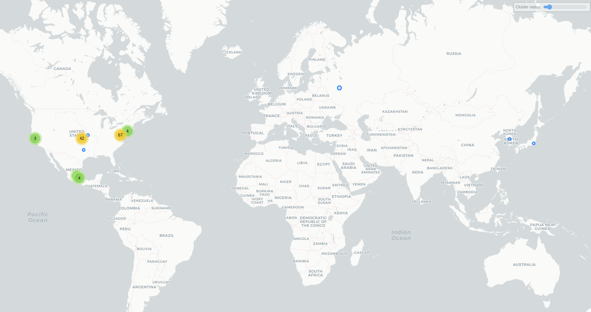

# iSharing

## Fecha de análisis

- **Análisis estático (mediante Exodus Privacy/MobFS):** 11/10/2023
- **Análisis dinámico (mediante análisis de tráfico de red):** 11/10/2023
- **Análisis Posteriores:** 

## Archivos analizados

- [isharing.pcap](https://cloud.datavoros.org/index.php/s/QE75dSeejewcbEA)
- [isharing.apk](https://cloud.datavoros.org/index.php/s/qHYN35D4s8rmjyA)
- [Capturas de pantalla](./captura-de-pantalla/)

## Descripción de la aplicación
- **Tipo:** Localizador
- **Costo:** Freemium  
- **Enlace de descarga:** [https://play.google.com/store/apps/details?id=com.isharing.isharing&hl=es&gl=US](https://play.google.com/store/apps/details?id=com.isharing.isharing&hl=es&gl=US)
- **Descargas:** 10M+
- **Ultima fecha de actualización:** 15/10/2023
- **Versión:** 11.12.1.4
- **Desarrollador:** iSharingSoft, Inc.
- **Firma:** yongjae
- **Contacto:** contact@isharingsoft.com
- **Condiciones de uso y Política de privacidad:** [https://isharingsoft.com/privacy_policy/](https://isharingsoft.com/privacy_policy/)
- **Aviso de privacidad WayBackMachine**: [https://web.archive.org/web/20231016204655/https://isharingsoft.com/privacy_policy/](https://web.archive.org/web/20231016204655/https://isharingsoft.com/privacy_policy/)
    
- **Descripción en PlayStore:**
~~~
iSharing es un localizador GPS familiar diseñado para la seguridad de los niños y la tranquilidad de los padres.

La aplicación de localización familiar proporciona un servicio de localización compartida en tiempo real que permite a padres e hijos compartir de forma privada su información de localización y comunicarse fácilmente. Encuentre teléfonos, dispositivos y familiares para su control de seguridad.

Con iSharing puedes
- Ver la ubicación en tiempo real de los miembros de la familia en un mapa privado
- Recibir alertas en tiempo real cuando un miembro de la familia llega a un destino o lo abandona - Eliminar los molestos mensajes de texto de Dónde estás
- Recibir notificaciones automáticas cuando un miembro de la familia esté cerca (diseñado para evitar la desaparición de niños)
- Localizador de teléfonos robados o perdidos con la función Encuentra mi teléfono
- Agite el teléfono para enviar la alerta de pánico en una situación de emergencia
- Convierte tu teléfono en un walkie-talkie con el buscador iSharing y disfruta de mensajes de voz gratuitos
- Consulta el historial del paradero de los miembros de tu familia durante un máximo de 90 días

* La aplicación iSharing debe utilizarse con el consentimiento de los demás.
~~~

## Rastreadores identificados (mediante Exodus Privacy)

|Rastreador|Tipo|
|---|---| 
|[Appsflyer](https://www.appsflyer.com/)|Analítica|
|[Didomi](https://www.didomi.io/)|Consentimiento de privacidad y analítica|
|[Facebook Login](https://developers.facebook.com/docs/android)|Identificación|
|[Facebook Share](https://developers.facebook.com/docs/android)|Compartir|
|[Google AdMob](https://admob.google.com/home/)|Publicidad1
|[Google Crashlytics](https://firebase.google.com/products/crashlytics?hl=es-419)|Reporte de fallos|
|[Google Firebase Analytics](https://firebase.google.com/)|Analítica|
|[Huq Sourcekit](https://huq.io/)|Monitoreo de ubicación y Analítica|

Enlace al [reporte](https://reports.exodus-privacy.eu.org/es/reports/391532/) de Exodus Privacy. 

## Empresas relacionadas con esta aplicación:

- [iSharingSoft](https://isharingsoft.com/es/)
- [RevenueCat](https://www.revenuecat.com/) - Manager de suscripciones
- [Kommunicate](kommunicate.io) - Chatbots basados en IA
- [Mapbox](https://www.mapbox.com/) - Inteligencia de ubicaciones basada en IA
- [Naver](https://map.naver.com/p/) - Mapas --> [NaverCorp](https://www.navercorp.com/)
- [Umlaut](https://www.umlaut.com/) - Proveedora de muchos tipos de servicios. Pertenece a [Accenture](https://www.accenture.com/us-en)
- [Didomi](https://www.didomi.io/about) - Servicios de consultoría en privacidad
- [ZenDesk](https://zendesk.com) - Atención al cliente
- [Zetetic](https://www.zetetic.net/) - Seguridad en aplicaciones móviles
- [Yalantis](https://yalantis.com/) - Desarrollo de software
- [Amazon](https://aws.amazon.com/) - Almacenamiiento de datos
- [Applozic](https://www.linkedin.com/company/applozic/) - Diseño de chats
- [Alphabet](https://abc.xyz/) --> Google - Fallos, Analítica, identificación
- [Meta](https://about.meta.com/ltam/) --> Facebook - Identificación
- [Huq Industries](https://huq.io/company/) - Analítica de demografía y lugares
- [Appsflyer](https://www.appsflyer.com/es/company/sobre-nosotros/) - Analítica y marketing
- [Cloudflare](https://www.cloudflare.com/) - Almacenamiento de datos
- [Twitter](https://twitter.com) - Red social, analítica y anuncios.
- [Yandex](https://yandex.com/) - Buscador 
- [Fastly](https://www.fastly.com/es/) - Almacenamiento de datos
- [Yahoo](https://yahoo.com) --> probablemente relacionada con Naver, ya que el dominio es Yahoo Japón
- [Uninet](https://telmex.com/web/acerca-de-telmex/uninet) - Almacenamiento de datos
- [Automattic](https://automattic.com/) - Empresa detrás de muchos proyectos, entre ellos wordpress. aquí almacenan seguramnte el blog que tiene la aplicación.

### Empresas identificadas a través del Aviso de Privacidad con que se comparten los datos:

- [Outlogic](https://outlogic.io/)
- [Accenture](https://www.accenture.com/us-en)
- [Hug industries](https://huq.io/)
- [OneMata](https://www.onemata.com/)
- [Venpath](https://www.venpath.net/)
- [Placer.ai](https://www.placer.ai/)
- [Veraset](https://www.veraset.com/)

### Proveedores de autenticación para la aplicación
Además de Facebook y Google. Cuando la persona usuaria descarga esta aplicación en regiones asiáticas, se puede utilizar:
- [Kakao](https://www.kakaocorp.com/page/service/service/KakaoTalk?lang=en) --> [KakaoTalk](https://play.google.com/store/apps/details?id=com.kakao.talk&hl=es_MX&gl=US)
- [LineCorp](https://linecorp.com/en/) -->  [LINE](https://line.me/en/) --> Naver Corporation

### Dominios integrados al código de la aplicación que no pertecen directamente a los rastreador

|Dominios|
|---|
|https://iabeurope.eu/|
|https://iabtcf.com/#/|
|https://iceportal.de/|
|https://itunes.apple.com|
|https://www.privacy-center.org/|
|https://www.imice.de/|
|https://pstatic.net --> Naver|
|https://www.youtube.com|
|https://www.zetetic.net|
|https://www.mobitexter.net|

## Permisos   

- **Según MobFS/Exodus Privacy:** 45
- **Según prueba de uso:** 3

### Permisos según Exodus Privacy

- :pushpin::exclamation:ACCESS_BACKGROUND_LOCATION
_access location in the background_

- :pushpin::exclamation:ACCESS_COARSE_LOCATION
_access approximate location only in the foreground_

- :pushpin::exclamation:ACCESS_FINE_LOCATION
_access precise location only in the foreground_

- ACCESS_NETWORK_STATE
_view network connections_

- ACCESS_WIFI_STATE
_view Wi-Fi connections_

- :running::exclamation: ACTIVITY_RECOGNITION
_recognize physical activity_

- BLUETOOTH
_pair with Bluetooth devices_

- BLUETOOTH_ADMIN
_access Bluetooth settings_

- BROADCAST_STICKY
_send sticky broadcast_

- :camera::exclamation:CAMERA
_take pictures and videos_

- CHANGE_WIFI_STATE
_connect and disconnect from Wi-Fi_

- DISABLE_KEYGUARD
_disable your screen lock_

- FOREGROUND_SERVICE
_run foreground service_

- :busts_in_silhouette::exclamation:GET_ACCOUNTS
_find accounts on the device_

- INTERNET
_have full network access_

- POST_NOTIFICATIONS

- :busts_in_silhouette::exclamation:READ_CONTACTS
_read your contacts_

- :file_folder::exclamation:READ_EXTERNAL_STORAGE
_read the contents of your shared storage_

- READ_MEDIA_IMAGES

- :telephone_receiver::exclamation:READ_PHONE_STATE
_read phone status and identity_

- RECEIVE_BOOT_COMPLETED
_run at startup_

- :speaker::exclamation:RECORD_AUDIO
_record audio_

- REQUEST_IGNORE_BATTERY_OPTIMIZATIONS
_ask to ignore battery optimizations_

- :exclamation:SYSTEM_ALERT_WINDOW
_This app can appear on top of other apps_

- USE_CREDENTIALS

- VIBRATE
_control vibration_

- WAKE_LOCK
_prevent phone from sleeping_

- :file_folder::exclamation:WRITE_EXTERNAL_STORAGE
_modify or delete the contents of your shared storage_

- BILLING

- CHECK_LICENSE

- RECEIVE

- BIND_GET_INSTALL_REFERRER_SERVICE

- ACTIVITY_RECOGNITION

- AD_ID

- READ_GSERVICES

El icono :exclamation: indica un nivel 'Peligroso' o 'Especial' de acuerdo a los [niveles de protección de Google](https://developer.android.com/guide/topics/permissions/overview). 

### Permisos solicitados durante el uso de la aplicación

- :red_circle:Localización
- :red_circle:Contactos
- :red_circle:Acceso a la actividad física
- :blue_circle:Acceso a Fotos y Multimedia 
- :blue_circle:Acceso a video y audio 
- :blue_circle:Acceso a grabar audio

:red_circle: Este ícono indica un permiso obligatorio   
:large_blue_circle: Este ícono indica un permiso opcional pero se pierde una funcionalidad particular

## Datos

### Datos solicitados al usuario durante el uso de la aplicación
- :red_circle:El inicio de sesión es obligatorio con Google o Facebook
- :red_circle:Número de teléfono
- :red_circle:Correo Electrónico
- :red_circle:Nombre y apellido
- :red_circle:Fecha de nacimiento
- :blue_circle:Datos de contactos de emergencia

**NOTA**:    
    - Recordar que al estar obligado a acceder con Google o con Facebook, muchos de los datos de de estas dos plataformas podrán ser compartidos con iSharing.   
    - Como existe la función de pago, probablemente (no lo probamos) los datos que se necesitan para ello son de una tarjeta o forma de pago y dirección de facturación.
    
:red_circle: Este ícono indica un dato obligatorio   
:blue_circle: Este ícono indica un dato opcional pero se pierde una funcionalidad particular

### Tabla de conexiones realizadas durante el uso de la aplicación

| Dirección IP    | País          | Ciudad         | Número AS | Organización AS                                | Dominio              |
|-----------------|---------------|----------------|-----------|------------------------------------------------|--------------------------------------|
| 3.5.11.155      | United States | Ashburn        | 14618     | AMAZON-AES                                     | isharing-message.s3.amazonaws.com    |
| 3.5.25.209      | United States | Ashburn        | 14618     | AMAZON-AES                                     | isharing-message.s3.amazonaws.com    |
| 3.161.55.38     | United States |                | 16509     | AMAZON-02                                      | appsflyersdk.com                     |
| 3.161.55.70     | United States |                | 16509     | AMAZON-02                                      | map.isharing-gps.com                 |
| 3.161.55.75     | United States |                | 16509     | AMAZON-02                                      | appsflyersdk.com                     |
| 3.224.155.239   | United States | Ashburn        | 14618     | AMAZON-AES                                     | revenuecat.com                       |
| 3.232.116.213   | United States | Ashburn        | 14618     | AMAZON-AES                                     | amazonaws.com                        |
| 16.182.41.41    | United States | Ashburn        | 16509     | AMAZON-02                                      | isharing-message.s3.amazonaws.com    |
| 16.182.65.96    | United States | Ashburn        | 16509     | AMAZON-02                                      | amazonaws.com                        |
| 16.182.66.25    | United States | Ashburn        | 16509     | AMAZON-02                                      | isharing-message.s3.amazonaws.com    |
| 16.182.67.248   | United States | Ashburn        | 16509     | AMAZON-02                                      | amazonaws.com                        |
| 16.182.100.0    | United States | Ashburn        | 16509     | AMAZON-02                                      | amazonaws.com                        |
| 16.182.105.176  | United States | Ashburn        | 16509     | AMAZON-02                                      | amazonaws.com                        |
| 18.160.123.38   | United States |                | 16509     | AMAZON-02                                      | cloudfront.net                       |
| 18.160.123.51   | United States |                | 16509     | AMAZON-02                                      | cloudfront.net                       |
| 18.160.123.205  | United States |                | 16509     | AMAZON-02                                      | cloudfront.net                       |
| 18.160.124.93   | United States |                | 16509     | AMAZON-02                                      | impressions.onelink.me               |
| 23.22.87.0      | United States | Ashburn        | 14618     | AMAZON-AES                                     | isharingapp.com                      |
| 34.120.160.131  | United States | Kansas City    | 396982    | GOOGLE-CLOUD-PLATFORM                          | firebase.io                          |
| 34.231.212.93   | United States | Ashburn        | 14618     | AMAZON-AES                                     | revenuecat.com                       |
| 44.208.104.200  | United States | Ashburn        | 14618     | AMAZON-AES                                     | revenuecat.com                       |
| 52.7.236.38     | United States | Ashburn        | 14618     | AMAZON-AES                                     | isharingapp.com                      |
| 52.216.40.72    | United States | Ashburn        | 16509     | AMAZON-02                                      | amazonaws.com                        |
| 52.216.40.88    | United States | Ashburn        | 16509     | AMAZON-02                                      | amazonaws.com                        |
| 52.216.52.8     | United States | Ashburn        | 16509     | AMAZON-02                                      | amazonaws.com                        |
| 52.216.58.248   | United States | Ashburn        | 16509     | AMAZON-02                                      | amazonaws.com                        |
| 52.216.60.80    | United States | Ashburn        | 16509     | AMAZON-02                                      | amazonaws.com                        |
| 52.216.60.112   | United States | Ashburn        | 16509     | AMAZON-02                                      | amazonaws.com                        |
| 52.216.100.125  | United States | Ashburn        | 16509     | AMAZON-02                                      | amazonaws.com                        |
| 52.216.115.53   | United States | Ashburn        | 16509     | AMAZON-02                                      | amazonaws.com                        |
| 52.216.152.6    | United States | Ashburn        | 16509     | AMAZON-02                                      | amazonaws.com                        |
| 52.216.161.197  | United States | Ashburn        | 16509     | AMAZON-02                                      | amazonaws.com                        |
| 52.216.164.21   | United States | Ashburn        | 16509     | AMAZON-02                                      | amazonaws.com                        |
| 52.216.176.157  | United States | Ashburn        | 16509     | AMAZON-02                                      | amazonaws.com                        |
| 52.216.222.120  | United States | Ashburn        | 16509     | AMAZON-02                                      | amazonaws.com                        |
| 52.217.44.198   | United States | Ashburn        | 16509     | AMAZON-02                                      | amazonaws.com                        |
| 52.217.68.86    | United States | Ashburn        | 16509     | AMAZON-02                                      | amazonaws.com                        |
| 52.217.71.62    | United States | Ashburn        | 16509     | AMAZON-02                                      | amazonaws.com                        |
| 52.217.88.6     | United States | Ashburn        | 16509     | AMAZON-02                                      | amazonaws.com                        |
| 52.217.97.118   | United States | Ashburn        | 16509     | AMAZON-02                                      | amazonaws.com                        |
| 52.217.98.222   | United States | Ashburn        | 16509     | AMAZON-02                                      | amazonaws.com                        |
| 52.217.123.128  | United States | Ashburn        | 16509     | AMAZON-02                                      | amazonaws.com                        |
| 52.217.125.248  | United States | Ashburn        | 16509     | AMAZON-02                                      | amazonaws.com                        |
| 52.217.134.136  | United States | Ashburn        | 16509     | AMAZON-02                                      | amazonaws.com                        |
| 52.217.134.192  | United States | Ashburn        | 16509     | AMAZON-02                                      | amazonaws.com                        |
| 52.217.139.25   | United States | Ashburn        | 16509     | AMAZON-02                                      | isharing-message.s3.amazonaws.com    |
| 52.217.140.184  | United States | Ashburn        | 16509     | AMAZON-02                                      | amazonaws.com                        |
| 52.217.161.224  | United States | Ashburn        | 16509     | AMAZON-02                                      | amazonaws.com                        |
| 52.217.168.24   | United States | Ashburn        | 16509     | AMAZON-02                                      | isharing-message.s3.amazonaws.com    |
| 52.217.173.56   | United States | Ashburn        | 16509     | AMAZON-02                                      | amazonaws.com                        |
| 52.217.174.233  | United States | Ashburn        | 16509     | AMAZON-02                                      | isharing-message.s3.amazonaws.com    |
| 52.217.195.48   | United States | Ashburn        | 16509     | AMAZON-02                                      | amazonaws.com                        |
| 52.217.224.24   | United States | Ashburn        | 16509     | AMAZON-02                                      | amazonaws.com                        |
| 52.217.224.200  | United States | Ashburn        | 16509     | AMAZON-02                                      | amazonaws.com                        |
| 52.217.226.248  | United States | Ashburn        | 16509     | AMAZON-02                                      | amazonaws.com                        |
| 52.217.231.248  | United States | Ashburn        | 16509     | AMAZON-02                                      | amazonaws.com                        |
| 52.217.234.8    | United States | Ashburn        | 16509     | AMAZON-02                                      | amazonaws.com                        |
| 54.92.158.15    | United States | Ashburn        | 14618     | AMAZON-AES                                     | revenuecat.com                       |
| 54.163.86.122   | United States |                | 14618     | AMAZON-AES                                     | isharingapp.com                      |
| 54.225.192.169  | United States | Ashburn        | 14618     | AMAZON-AES                                     | isharingapp.com                      |
| 54.231.130.240  | United States | Ashburn        | 16509     | AMAZON-02                                      | amazonaws.com                        |
| 54.231.134.96   | United States | Ashburn        | 16509     | AMAZON-02                                      | amazonaws.com                        |
| 54.231.136.136  | United States | Ashburn        | 16509     | AMAZON-02                                      | amazonaws.com                        |
| 54.231.159.8    | United States | Ashburn        | 16509     | AMAZON-02                                      | amazonaws.com                        |
| 54.231.163.72   | United States | Ashburn        | 16509     | AMAZON-02                                      | amazonaws.com                        |
| 54.231.165.208  | United States | Ashburn        | 16509     | AMAZON-02                                      | amazonaws.com                        |
| 54.231.168.216  | United States | Ashburn        | 16509     | AMAZON-02                                      | amazonaws.com                        |
| 54.231.170.112  | United States | Ashburn        | 16509     | AMAZON-02                                      | amazonaws.com                        |
| 54.231.172.248  | United States | Ashburn        | 16509     | AMAZON-02                                      | amazonaws.com                        |
| 54.231.195.9    | United States | Ashburn        | 16509     | AMAZON-02                                      | isharing-message.s3.amazonaws.com    |
| 54.231.204.80   | United States | Ashburn        | 16509     | AMAZON-02                                      | amazonaws.com                        |
| 54.231.224.176  | United States | Ashburn        | 16509     | AMAZON-02                                      | amazonaws.com                        |
| 54.231.224.192  | United States | Ashburn        | 16509     | AMAZON-02                                      | amazonaws.com                        |
| 54.231.234.160  | United States | Ashburn        | 16509     | AMAZON-02                                      | amazonaws.com                        |
| 54.237.51.41    | United States | Ashburn        | 14618     | AMAZON-AES                                     | revenuecat.com                       |
| 65.9.121.95     | United States |                | 16509     | AMAZON-02                                      | appsflyer.com                        |
| 93.158.134.119  | Russia        |                | 13238     | YANDEX LLC                                     | mc.yandex.ru                         |
| 104.16.51.111   |               |                | 13335     | CLOUDFLARENET                                  | help.isharinghelp.com                |
| 104.18.23.136   |               |                | 13335     | CLOUDFLARENET                                  | appsflyer.com                        |
| 104.18.72.113   |               |                | 13335     | CLOUDFLARENET                                  | static.zdassets.com                  |
| 104.244.42.5    | United States |                | 13414     | TWITTER                                        | t.co                                 |
| 104.244.42.67   | United States |                | 13414     | TWITTER                                        | analytics.twitter.com                |
| 110.234.4.8     | United States |                | 135354    | NAVER BUSINESS PLATFORM ASIA PACIFIC PTE. LTD. | naveropenapi.apigw.ntruss.com        |
| 125.209.254.208 | South Korea   |                | 23576     | NAVER Cloud Corp.                              | map.pstatic.net                      |
| 142.250.113.188 | United States |                | 15169     | GOOGLE                                         | mtalk.google.com                     |
| 142.250.115.155 | United States |                | 15169     | GOOGLE                                         | stats.g.doubleclick.net              |
| 142.250.115.188 | United States |                | 15169     | GOOGLE                                         |                                      |
| 142.250.177.10  | United States |                | 15169     | GOOGLE                                         | googleapis.com                       |
| 142.251.34.3    | United States | Queens         | 15169     | GOOGLE                                         | fonts.gstatic.com                    |
| 142.251.34.10   | United States | Queens         | 15169     | GOOGLE                                         | googleapis.com                       |
| 142.251.34.14   | United States | Queens         | 15169     | GOOGLE                                         | support.google.com                   |
| 142.251.34.42   | United States | Queens         | 15169     | GOOGLE                                         | firebaseremoteconfig.googleapis.com  |
| 142.251.218.130 | United States |                | 15169     | GOOGLE                                         | googleads.g.doubleclick.net          |
| 142.251.218.132 | United States |                | 15169     | GOOGLE                                         | google.com                           |
| 142.251.218.138 | United States |                | 15169     | GOOGLE                                         | googleapis.com                       |
| 146.75.104.157  | United States | Dallas         | 54113     | FASTLY                                         | ads-twitter.com                      |
| 157.240.25.1    | Mexico        | Querétaro City | 32934     | FACEBOOK                                       | facebook.net                         |
| 157.240.25.13   | Mexico        | Querétaro City | 32934     | FACEBOOK                                       | facebook.net                         |
| 172.217.2.130   | United States |                | 15169     | GOOGLE                                         | googleads.g.doubleclick.net          |
| 172.217.2.131   | United States |                | 15169     | GOOGLE                                         | crashlyticsreports-pa.googleapis.com |
| 172.217.2.138   | United States |                | 15169     | GOOGLE                                         | nearbysharing-pa.googleapis.com      |
| 172.217.2.142   | United States |                | 15169     | GOOGLE                                         | clients.google.com                   |
| 172.217.3.129   | United States |                | 15169     | GOOGLE                                         | googleusercontent.com                |
| 172.217.3.136   | United States |                | 15169     | GOOGLE                                         | google-analytics.com                 |
| 172.217.3.138   | United States |                | 15169     | GOOGLE                                         | googleapis.com                       |
| 172.217.3.142   | United States |                | 15169     | GOOGLE                                         | android.clients.google.com           |
| 172.217.15.3    | United States |                | 15169     | GOOGLE                                         | crashlyticsreports-pa.googleapis.com |
| 182.22.16.251   | Japan         |                | 23816     | Yahoo Japan Corporation                        | s.yimg.jp                            |
| 189.247.197.8   | Mexico        |                | 8151      | UNINET                                         | appsflyersdk.com                     |
| 189.247.197.17  | Mexico        |                | 8151      | UNINET                                         | appsflyersdk.com                     |
| 189.247.217.163 | Mexico        |                | 8151      | UNINET                                         | appsflyersdk.com                     |
| 189.247.217.216 | Mexico        |                | 8151      | UNINET                                         | appsflyersdk.com                     |
| 192.0.76.3      | United States | San Francisco  | 2635      | AUTOMATTIC                                     | stats.wp.com                         |
| 192.0.77.32     | United States | San Francisco  | 2635      | AUTOMATTIC                                     | s0.wp.com                            |
| 192.0.78.129    | United States | San Francisco  | 2635      | AUTOMATTIC                                     | isharingsoft.com                     |
| 192.178.52.138  | United States |                | 15169     | GOOGLE                                         | googleapis.com                       |
| 192.178.52.142  | United States |                | 15169     | GOOGLE                                         | android.clients.google.com           |
| 192.178.52.170  | United States |                | 15169     | GOOGLE                                         | googleapis.com                       |
| 192.178.52.174  | United States |                | 15169     | GOOGLE                                         | google.com                           |
| 192.178.52.196  | United States |                | 15169     | GOOGLE                                         | google.com                           |
| 192.178.52.200  | United States |                | 15169     | GOOGLE                                         | googletagmanager.com                 |
| 192.178.52.202  | United States |                | 15169     | GOOGLE                                         | googleapis.com                       |
| 192.178.52.206  | United States |                | 15169     | GOOGLE                                         | clients4.google.com                  |
| 192.178.52.225  | United States |                | 15169     | GOOGLE                                         | googleusercontent.com                |
| 192.178.52.227  | United States |                | 15169     | GOOGLE                                         | google.com.mx                        |
| 192.178.52.234  | United States |                | 15169     | GOOGLE                                         | googleapis.com                       |
| 203.104.167.128 | United States |                | 23576     | NAVER Cloud Corp.                              | apis.naver.com                       |
| 216.58.195.226  | United States |                | 15169     | GOOGLE                                         | googleads.g.doubleclick.net          |
| 216.58.195.234  | United States |                | 15169     | GOOGLE                                         | googleapis.com                       |
| 216.58.195.251  | United States |                | 15169     | GOOGLE                                         | storage.googleapis.com               |

**La columna de Dominio son solicitudes de conexión de la aplicación establecidas a través del DNS. Conocer esto no siempre es posible, ya que muchas veces dichas comunicaciones están cifradas. Sólo ennumeramos aquellas que tienen un interés puntual para este proyecto, a saber, rastreadores y empresas no relacionadas con los rastreadores.**

### Mapa de conexiones realizadas durante el uso de la aplicación

### Datos compartidos y uso según la Playstore:

Es posible que se compartan datos con terceros de:   
    - Ubicación aproximada para funciones de la aplicación y publicidad o marketing   
    - Ubicación precisa para funciones de la aplicación y publicidad o marketing   
    - ID's de usuario para análisis y publicidad o marketing    
    - Interacciones con la aplicación para análisis   
    - Registro de fallos para análisis   
    - Diagnóstico para análisis   
    - ID's de dispositivo u otro tipo para análisis y publicidad o marketing   

### Datos recopilados y uso según la Playstore

|Datos|Uso|
|---|---|
|Ubicación aproximada (opcional)|Funciones de la aplicación y publicidad o marketing|
|Ubicación precisa (opcional)|Funciones de la aplicación y publicidad o marketing|
|Nombre (opcional)|Funciones de la aplicación| 
|Correo electrónico|Funciones de la aplicación| 
|ID de usuario|Análisis y publicidad o marketing|
|Número de teléfono (opcional)|Funciones de la aplicación|
|Fotos (opcional)|Funciones de la aplicación|
|Interacciones de la aplicación|Análisis|
|Otro contenido generado por usuarios (opcional)|Funciones de la aplicación|
|ID's de dispositivo o de otro tipo|Análisis y publicidad o marketing|

### Prácticas de seguridad

- Los datos están cifrados en tránsito
- Puedes solicitar que se borren los datos
- Compromiso con el cumplimiento de la Política de [Familias de Play](https://support.google.com/googleplay/android-developer/answer/9893335)

### Datos recopilados y uso según la Política de privacidad

|Datos|
|---|
|**Información de la cuenta**: nombre, apellido, fecha de nacimiento, número de teléfono, dirección, email, foto (opcional)|
|**Información de terceros**: nombre, dirección de correo electrónico y número de teléfofno|
|**Información de facturación (opcional)**: dirección de facturación, nomre y datos de la tarjeta utilizada|
|**Información de geolocalización**: identificador único de usuario y ubicación a través de GPS, WiFi y red. También los lugares que se marcan como casa, trabajo, etc (opcional)|
|**Información de contactos**: sólo la información necesaria para avisar a la persona usuaria quién más usa iSharing|
|**Mensajes**: se recaba la información necesaria para poder mandar los mensajes|
|**Información recabada por terceros**: información que Facebook, Google u otras pueda proveerle como: foto de perfil, ID de usuario, género, edad, lengua, país, lista de amigos, etc.|
|**Información recolectada de manera automática por iSharing y socios de negocios**: información del dispositivo como modelo, sistema operativo, identificadores únicos, dirección IP, datos de los sensores, tipo de navegador, idioma, WiFi y nombre del dispositivo, geolocalización, datos a través de cookies, identificador único de publicidad e información de Web Beacons. Asimismo, a través de push notifications pueden recolectar páginas visitadas con anterioridad y después de la interacción; páginas vistas, búsquedas realizadas, preferencias comerciales, etc.|

- #### El uso general que le dan a la información incluye:
    - **Información personal**: información de cuenta, terceros, facturación, geolocalización y de contactos, es utilizada para brindar el servicio y es borrada apenas se cancela la cuenta.
    - **Fines de marketing y publicidad**:
        - Anuncios dirigidos
        - Analíticas de efectividad de publicidad y marketing
    - **Investigación y desarrollo**:
        - Datos anonimizados para el mantenimiento y desarrollo de los servicios
        - Detección de fallos en los servicios
        - Anlítica de uso para el mejoramiento
    - **Proveer los servicios**:
        - La información de geolocalización interna de la aplicación no se comparte con terceros, pero las tecnologías que automáticamente recolectan información sí guardan la geolocalización (de manera anónima).
- #### Información compartida con terceros
    - Se comparte información personal con otras personas usuarias del mismo círculo
    - Se puede compartir información personal con socios comerciales para servicios de contabilidad, gerencia, técnicos, marketing y analítica.
    - Se puede anonimizar toda la información recolectada y compartida con terceros. Ofrecen la lista:
        - Outlogic
        - Accenture
        - Huq
        - Onemata
        - VenPath
        - Placer.io
        - Veraset
    - Si uno opta por no compartir datos personales, entonces la geolocalización y los datos personales no se comparten con terceros para fines de publicidad y marketing. 
  
        

### Notas importantes sobre seguridad y privacidad:

- El aviso de privacidad lista con qué empresas se comparten datos. Fuera de una, ninguna de estas empresas aparece en nuestros análisis técnicos. Nos parece una excelente práctica y algo por lo que deberíamos avogar que estuviera presente en todos los avisos de privacidad. 
- Permite evitar copartir datos personales para fines de marketing y publicidad.

## Conclusiones

- Esta aplicación, tiene la mayor cantidad de permisos de todas las aplicaciones analizadas. Si bien son congruentes con las funcionalidades, la realidad es que hay maneras de desarrollar aplicaciones menos intrusivas. Esta aplicación tiene acceso a casi todo dentro del teléfono. 
- Si bien el Aviso de Privacidad lista las empresas con las que se comparten datos de las personas usuarias (una excelente práctica), nos gustaría que eso no pasara. La realidad es que los datos de las personas usuarias se comparten con demasiadas empresas y el uso de marketing y publicidad no es amigable con la privacidad.
- 
