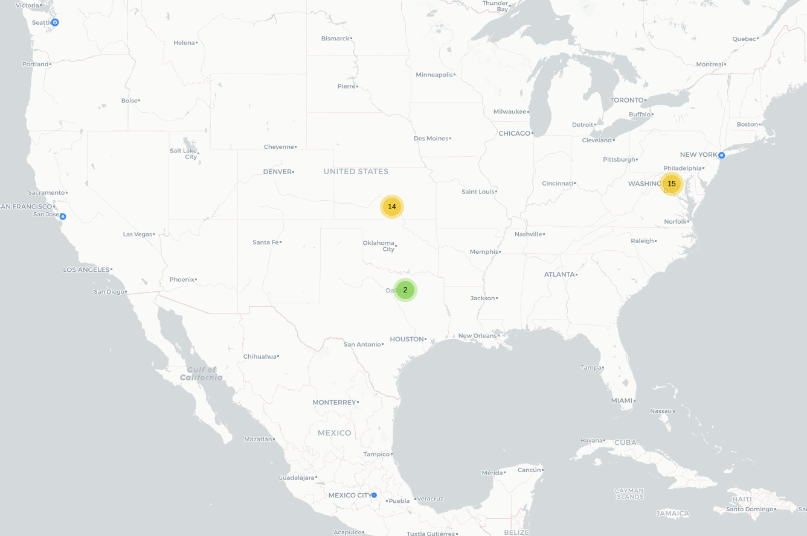

# Life360

## Fecha de análisis

- **Análisis estático (mediante Exodus Privacy/MobFS):** 10/10/2023
- **Análisis dinámico (mediante análisis de tráfico de red):** 10/10/2023
- **Análisis Posteriores:** 

## Links a los archivos analizados

- [life360.pcap](https://cloud.datavoros.org/index.php/s/qxP48yxaZX27rQJ)
- [life360.apk](https://cloud.datavoros.org/index.php/s/B783bJQs3LyHAXp)

## Descripción de la aplicación
- **Tipo:** Localizador
- **Costo:** Freemium  
- **Link de descarga:** [https://play.google.com/store/apps/details?id=com.life360.android.safetymapd&hl=es_MX&gl=US](https://play.google.com/store/apps/details?id=com.life360.android.safetymapd&hl=es_MX&gl=US)
- **Descargas:** 100M+
- **Ultima fecha de actualización:** 02/10/2023
- **Versión:** 29.39.0
- **Desarrollador:** Life360 Inc.
- **Firma:** No disponible
- **Contacto:** feedback@life360.com
- **Condiciones de uso y Política de privacidad:** [https://life360-legal.zendesk.com/hc/en-us/articles/16038777217175-Life360-Privacy-Cookie-Policy](https://life360-legal.zendesk.com/hc/en-us/articles/16038777217175-Life360-Privacy-Cookie-Policy)
- **Aviso de privacidad PDF**: [https://cloud.datavoros.org/index.php/s/XYFMcDYrJ9JBMSY](https://cloud.datavoros.org/index.php/s/XYFMcDYrJ9JBMSY)
    
- **Descripción en PlayStore:**
~~~
Life360 simplifica la vida en el mundo digital haciendo más fácil que te mantengas conectado con tus amigos y familiares, las personas que más te importan, tu "Círculo". Con el localizador de familiares y amigos de Life360, puedes:

• Ver fácilmente la ubicación en tiempo real de tus amigos y familiares en un mapa privado.
• Recibir alertas cuando tus seres queridos lleguen o salgan de casa, trabajo o escuela.
• Compartir fotos y mensajes de texto con nuestra función de chat seguro y privado.
• Rastrear el historial de ubicaciones pasadas de tu Círculo.
• Mejorar la seguridad al conducir con información después de cada viaje.
• Detectar una colisión de un automóvil y notificar a tu Círculo para obtener ayuda.

El localizador de amigos y familiares de Life360 utiliza datos de ubicación del GPS para rastrear dónde están tus amigos y familiares en tiempo real. Simplemente instala Life360 en el teléfono de todos; funciona con iOS y con Android. Cada miembro aparecerá como un ícono único en tu mapa, para que siempre sepas dónde están tus seres queridos. Saber dónde están todos es fácil y confiable con Life360.

¿Te preocupa que la batería se agote? Life360 tiene el consumo de batería más bajo de todas las aplicaciones de localización del mercado. Nuestro avanzado algoritmo nos ayuda a decidir cuándo actualizar tu ubicación, por lo que nunca dejamos tu GPS encendido sin necesidad.

Estas son algunas de nuestras características clave que puedes usar cuando te registras en Life360:

Alertas de lugar: ve cuándo tus amigos y familiares regresan a casa de la escuela, salen del trabajo o empiezan a calentar en el campo de práctica. Cuando estés ocupado haciendo lo tuyo, las alertas de lugar te mantendrán informado.

Historial de ubicaciones: ve una cronología continua de las idas y venidas de tus amigos y familiares, organizada por día. Revisa fácilmente los viajes pasados e incluso ve cuánto tiempo pasan en lugares específicos los miembros de tu familia y tú.

Alerta de SOS: si alguna vez te sientes inseguro o estás en una emergencia, SOS envía una alerta de ayuda silenciosa con tu ubicación a tu Círculo y a tus contactos de emergencia.

Detección de colisiones: la detección de colisiones Life360 puede detectar colisiones de más de 25 mph. Nuestra función de seguridad utiliza los sensores de tu dispositivo para detectar si has tenido un accidente automovilístico y envía una alerta a tus contactos de emergencia con tu ubicación.

Notificación de batería baja: Life360 puede mostrar el nivel de batería de cada miembro del Círculo y enviar una alerta cuando el nivel de batería de un miembro del Círculo es bajo, para que puedas descansar con tranquilidad.

Informes del conductor: tranquilidad cuando tú no participas del viaje. Ve cómo les fue a los conductores de tu círculo en sus viajes esta semana. El informe del conductor de Life360 incluye una evaluación para cada conducción que cubre: alta velocidad, uso del teléfono, frenado brusco y aceleración rápida, así como una puntuación del conductor, para que puedas ver quién es un conductor seguro en la familia.

Burbujas: todos necesitamos ocuparnos de nuestras cosas de vez en cuando. Una Burbuja te permite mostrar temporalmente solo tu ubicación general durante un periodo determinado para que tengas un poco de privacidad. Tu Círculo solo verá tu paradero general, mientras que todas las funciones de seguridad permanecerán activadas.

Life360 hace que sea fácil mantenerte conectado, informado y seguro. Regístrate hoy y mantén a tus seres queridos cerca.
~~~

## Rastreadores identificados (mediante Exodus Privacy)

|Tracker|Tipo|
|---|---| 
|[AppsFlyer](https://support.appsflyer.com/hc/es/categories/201114756-Integraci%C3%B3n-de-SDK-)|Analítica|
|[Braze](https://braze.com)|Analísitca, Publicidad, Ubicación|
|[Google Crashlytics](https://firebase.google.com/products/crashlytics)|Reporte de fallos|
|[Google Firebase Analytics](https://firebase.google.com/)|Analítica|

Enlace al [reporte](https://reports.exodus-privacy.eu.org/es/reports/386491/) de Exodus Privacy. OJO: este reporte es para una versión anterior, la 29.37.0, pero se puede ver en las diferentes versiones de análisis de esta aplicación en [Exodus](https://reports.exodus-privacy.eu.org/es/reports/search/com.life360.android.safetymapd/) que no hay cambios en los rastreadores. Además comparamos esta lista con el análisis de MobSF.

## Empresas relacionadas con esta aplicación:

- [Life360](https://www.life360.com/intl/)
- [Appsflyer](https://www.appsflyer.com/es/) - Marketing
- [Alphabet](https://abc.xyz/) --> Google - Crashes, Analítica
- [Braze](https://braze.com) - Marketing y Analytics
- [Branch](https://branch.io) - Marketing y Analytics
- [Amazon](https://aws.amazon.com/) - Almacenamiiento de datos
- [Cloudflare](https://www.cloudflare.com/) - Almacenamiento de datos
- [Fastly](https://www.fastly.com/) - CDN, Almacenamiento de datos
- [LaunchDarkly](https://launchdarkly.com/) - Desarrollo de software
- [PubNub](https://pubnub.com) - Escalamiento de aplicaciones de tiempo real

### Dominios integrados al código de la app que no pertecen directamente a los trackers

- https://www.zendesk.com/ - Servicio a cliente
- https://www.tile.com/ - Sirve para la funcionalidad de encontrar objetos
- https://slf4j.org/ - Parte de las funcionalidades de Java
- https://eclipse.org/ - Fundación para el desarrollo de software de código abierto
- https://amplitude.com/ - Plataforma de analítica
- https://netty.io/ - Desarrollo de aplicaciones
- https://www.typeform.com/ - Desarrollo de formatos de acceso (signup)
- https://www.atlassian.com/es - Empresa que genera soluciones de desarrollo de software entre varias otras
- https://facebook.com/
- https://github.com/
- https://bit.ly/ - Acortador de URL
- https://www.mapbox.com/ - Empresa que permite geolocalización a través de inteligencia Artificial
- https://berbix.com/ - Identificación de documentos de identificación
- https://arity.com/ - Empresa dedicada, entre otras cosas, a detección de mobilidad en automóviles
- https://chromium.org/ - Organización desarrolladora de Chromium OS y el navegador Chromium

## Permisos   

- **Según MobFS/Exodus Privacy:** 36
- **Según prueba de uso:** 3

### Permisos según Exodus Privacy

- :pushpin::exclamation:ACCESS_BACKGROUND_LOCATION
_access location in the background_

- :pushpin::exclamation:ACCESS_COARSE_LOCATION
_access approximate location only in the foreground_

- :pushpin::exclamation:ACCESS_FINE_LOCATION
_access precise location only in the foreground_

- ACCESS_NETWORK_STATE
_view network connections_

- ACCESS_NOTIFICATION_POLICY
_access Do Not Disturb_

- ACCESS_WIFI_STATE
_view Wi-Fi connections_

- :running::exclamation: ACTIVITY_RECOGNITION
_recognize physical activity_

- BLUETOOTH
_pair with Bluetooth devices_

- BLUETOOTH_ADMIN
_access Bluetooth settings_

- :large_blue_diamond::exclamation:BLUETOOTH_ADVERTISE
_advertise to nearby Bluetooth devices_

- :large_blue_diamond::exclamation:BLUETOOTH_CONNECT
_connect to paired Bluetooth devices_

- :large_blue_diamond::exclamation:BLUETOOTH_SCAN
_discover and pair nearby Bluetooth devices_

- :telephone_receiver::exclamation:CALL_PHONE
_directly call phone numbers_

- :camera::exclamation:CAMERA
_take pictures and videos_

- CHANGE_WIFI_STATE
_connect and disconnect from Wi-Fi_

- FOREGROUND_SERVICE
_run foreground service_

- INTERNET
_have full network access_

- NFC
_control Near Field Communication_

- POST_NOTIFICATIONS

- :file_folder::exclamation:READ_EXTERNAL_STORAGE
_read the contents of your shared storage_

- READ_MEDIA_AUDIO

- READ_MEDIA_IMAGES

- READ_MEDIA_VIDEO

- READ_USER_DICTIONARY

- RECEIVE_BOOT_COMPLETED
_run at startup_

- REQUEST_IGNORE_BATTERY_OPTIMIZATIONS
_ask to ignore battery optimizations_

- SCHEDULE_EXACT_ALARM

- VIBRATE
_control vibration_

- WAKE_LOCK
_prevent phone from sleeping_

- :file_folder::exclamation:WRITE_EXTERNAL_STORAGE
_modify or delete the contents of your shared storage_

- BILLING

- RECEIVE

- BIND_GET_INSTALL_REFERRER_SERVICE

- ACTIVITY_RECOGNITION

- AD_ID

- DYNAMIC_RECEIVER_NOT_EXPORTED_PERMISSION

El icono :exclamation: indica un nivel 'Peligroso' o 'Especial' de acuerdo a los [niveles de protección de Google](https://developer.android.com/guide/topics/permissions/overview). 

### Permisos solicitados durante el uso de la aplicación

- :red_circle: Acceso a Fotos y Multimedia 
- :blue_circle: Acceso a tomar fotos y grabar video
- :red_circle:Localización permanente en segundo plano
- :red_circle:Acceso a actividad física
- :blue_circle:Acceso a Bluetooth
- :red_circle:Ejecución en segundo plano de manera permanente

:red_circle: Este ícono indica un permiso obligatorio   
:blue_circle: Este ícono indica un permiso opcional pero se pierde una funcionalidad particular

## Datos

### Datos solicitados al usuario durante el uso de la aplicación

- :red_circle:Número de teléfono
- :red_circle:Nombre y apellido
- :red_circle:Correo Electrónico
- :red_circle:Cumpleaños
- :blue_circle:Foto
- :blue_circle: Lugares que se frecuentan como casa, trabajo, escuela, etc.
- :blue_circle: Datos de contactos de emergencia (deben ser externos al círculo)

*Nota: Como existe la función de pago, probablemente (no lo probamos) los datos que se necesitan para ello son de una tarjeta o forma de pago y dirección de facturación.*
    
:red_circle: Este ícono indica un dato obligatorio   
:blue_circle: Este ícono indica un dato opcional pero se pierde una funcionalidad particular

### Tabla de conexiones realizadas durante el uso de la aplicación

| Dirección  IP     | País          | Ciudad      | Número AS | Organización AS | Dominio o rastreador contactado |
|-----------------|---------------|-------------|-----------|-----------------|---------------------------------|
| 3.5.29.41       | United States | Ashburn     |     14618 | AMAZON-AES      | amazonaws.com                   |
| 3.232.253.57    | United States | Ashburn     |     14618 | AMAZON-AES      | mobile.launchdarkly.com         |
| 3.233.199.232   | United States | Ashburn     |     14618 | AMAZON-AES      | mobile.launchdarkly.com         |
| 18.160.109.45   | United States |             |     16509 | AMAZON-02       | cdn.branch.io                   |
| 23.36.185.226   | Mexico        | Mexico City |     16625 | AKAMAI-AS       | appsflyersdk.com                |
| 34.199.149.172  | United States | Ashburn     |     14618 | AMAZON-AES      | mobile.launchdarkly.com         |
| 34.224.131.120  | United States | Ashburn     |     14618 | AMAZON-AES      | life360.com                     |
| 34.233.157.61   | United States | Ashburn     |     14618 | AMAZON-AES      | mobile.launchdarkly.com         |
| 52.9.63.135     | United States | San Jose    |     16509 | AMAZON-02       | pndsn.com pertenece a PubNub    |
| 52.54.188.240   | United States | Ashburn     |     14618 | AMAZON-AES      | life360.com                     |
| 52.71.168.113   | United States | Ashburn     |     14618 | AMAZON-AES      | mobile.launchdarkly.com         |
| 52.73.9.51      | United States | Ashburn     |     14618 | AMAZON-AES      |                                 |
| 52.201.175.122  | United States | Ashburn     |     14618 | AMAZON-AES      | life360.com                     |
| 52.217.228.121  | United States | Ashburn     |     16509 | AMAZON-02       | life360.com                     |
| 52.217.234.33   | United States | Ashburn     |     16509 | AMAZON-02       | life360.com                     |
| 54.90.94.6      | United States | Ashburn     |     14618 | AMAZON-AES      | mobile.launchdarkly.com         |
| 54.145.86.201   | United States | Ashburn     |     14618 | AMAZON-AES      | mobile.launchdarkly.com         |
| 54.231.226.185  | United States | Ashburn     |     16509 | AMAZON-02       | life360.com                     |
| 65.9.121.56     | United States |             |     16509 | AMAZON-02       | life360.com                     |
| 76.223.31.44    | United States | Seattle     |     16509 | AMAZON-02       |                                 |
| 104.18.33.150   |               |             |     13335 | CLOUDFLARENET   |                                 |
| 142.250.114.188 | United States |             |     15169 | GOOGLE          | mtalk.google.com                |
| 142.250.115.188 | United States |             |     15169 | GOOGLE          |                                 |
| 142.250.177.10  | United States |             |     15169 | GOOGLE          | googleapis.com                  |
| 142.251.34.10   | United States | Queens      |     15169 | GOOGLE          | googleapis.com                  |
| 142.251.218.138 | United States |             |     15169 | GOOGLE          | googleapis.com                  |
| 146.75.105.208  | United States | Dallas      |     54113 | FASTLY          |                                 |
| 146.75.106.217  | United States | Dallas      |     54113 | FASTLY          |                                 |
| 172.64.150.16   | United States |             |     13335 | CLOUDFLARENET   | life360.com                     |
| 172.217.2.131   | United States |             |     15169 | GOOGLE          | gstatic.com                     |
| 172.217.2.138   | United States |             |     15169 | GOOGLE          | googleapis.com                  |
| 172.217.15.3    | United States |             |     15169 | GOOGLE          |                                 |
| 192.178.52.138  | United States |             |     15169 | GOOGLE          | googleapis.com                  |
| 192.178.52.170  | United States |             |     15169 | GOOGLE          | googleapis.com                  |
| 192.178.52.174  | United States |             |     15169 | GOOGLE          | googleapis.com                  |
| 192.178.52.206  | United States |             |     15169 | GOOGLE          | clients.l.google.com            |

**Los dominios o rastreadores contactados son solicitudes de conexión de la aplicación establecidas a través del DNS. Conocer esto no siempre es posible, ya que muchas veces dichas comunicaciones están cifradas.**

### Mapa de conexiones realizadas durante el uso de la aplicación

### Datos compartidos y uso según la Playstore:

- Es posible que se compartan datos con terceros de
    - Ubicación aproximada para funciones de la aplicación y estadística
    - Ubicación precisa para funciones de la aplicación y estadística
    - Información de estado físico para funciones de la aplicación y estadística 

### Datos recopilados y uso según la Playstore

|Datos|Uso|
|---|---|
|Nombre|Funciones de la aplicación| 
|Correo electrónico|Funcionalidades de la aplicación y administración de cuentas| 
|ID de usuario|Funcionalidad de la aplicación y estadística|
|Dirección (opcional)|Funcionalidades de la aplicación y administración de cuentas|  
|Número de teléfono|Funcionalidades de la aplicación y Administración de cuentas|
|Otra información|Funcionalidades de la aplicación y administración de cuentas|
|Otros mensajes desde la aplicación|Funcionalidades de la aplicación|
|Fotos (opcional)|Funcionalidades de la aplicación|
|Contactos (opcional)|Funcionalidades de la aplicación|
|Interacciones de la aplicación|Estadística|
|Historial de búsquedas en la aplicación|Estadísticas, publicidad o marketing y personalización|
|Otro contenido generado por usuarios|Funcionalidades de la aplicación y estadística|
|Otras acciones|Estadística|
|Registro de fallas|estadística|
|Diagnóstico|Estadística|
|Otros datos de rendimiento de la aplicación|Estadística|
|Dispositivos u otros ID|Estadística|

### Prácticas de seguridad

- Los datos están encriptados en tránsito
- Puedes solicitar que se borren los datos

### Datos recopilados y uso según la Política de privacidad

|Datos|
|---|
|**Información de la cuenta**: nombre, apellido, nombre de usuario, fecha de nacimiento, número de teléfono, dirección, email y contraseña generada.|
|**Información de las personas invitadas a formar parte del círculo**: nombre, dirección de email, número de teléfono y foto (opcional)|
|**Verificación de identidad**: cuando sea el caso, los datos para verificar que el progenitor o tutor permitió el uso de la aplicación por parte de la persona menor como identificación oficial y foto|
|**Información de pago**|
|**Información opcional**: direcciones de trabajo, casa, etc.|
|**Información del dispositivo**: ID's, dirección IP, navegadores|
|**Geolocalización**: a través de dirección IP, WiFi, Bluetooth y GPS|
|**Información de manejo**: velocidad, tipo de actividad (caminata, ciclismo, etc.), aceleración y desaceleración); además de otros datos que proveen los sensores como el giroscopio, el acelerómetro, la bŕujula y el bluetooth.|
|:exclamation:**Mensajes y contenido de las personas usuarias**: mensajes entre los usuarios, fotos y video|
|**Información proporcionada por terceros sobre las personas usuarias**: cuando se ligan los servicios a otras plataformas como redes sociales|
|**Información generada a través de rastreadores y cookies**: datos del celular (tipo, modelo, etc.), dirección IP, tipo de navegador, ISP, plataforma, AdID y otros identificadores únicos, estado de la batería, conexión WiFi|
|**Información generada por el uso de tecnologías de analítica, mercadotecnia, publicidad y anti-fraude de terceros**: número de veces que se accede a un servicio; clicks en links de emails; si los emails fueron abiertos; si se accede desde distintos dispositivos; qué características usa la persona usuaria; qué anuncios se ven; información de compras; ubicación; información técnica de los dispositivos; información sobre el *engagement* con ciertas características de los productos; estadísticas de uso|

- #### El uso general que le dan a la información incluye:
    - **Fines administrativos**:
        - Compartir esta información con terceros con el fin de mantener, mejorar y desarrollar el producto. Y anonimizar dicha información cuando sea necesario.
        - Proveer el servicio
        - Medir el interés en sus productos
        - Asegurar la integridad, seguridad, *performance* y optimización de sus productos
        - Cambiar políticas de privacidad
        - Mandar mensajes para verificar la dirección de email
        - Para fines informativos, transaccionales, de marketing y operativos
        - Procesar pagos
        - Evitar actos delictivos
        - Aplicar los términos y condiciones de uso   
    - **Marketing**:
        - Informar a la persona usuaria de nuevos productos
        - Notificar a la persona usuaria de nuevas ofertas y eventos
        - Realizar investigación de mercado
        - Realizar y mejorar analíticas de marketing
        - Personalizar contenido, publicidad y ofertas a la persona usuaria
        - Agregar características a los productos
        - Generar Nuevos productos
    - **Investigación y desarrollo**:
        - Entre otros, poder identificar las características de la audiencia que utiliza sus productos
    - **Características gracias a la recolección automática de información a través de rastreadores**
        - Recordar inicios de sesión
        - Autenticar inicios de sesión
        - Recordar personalizaciones hechas por la persona usuaria
        - Mostrar historial
        - Mostrar contenido personalizado, incluyendo anuncios
        - Monitorear la efectividad de los servicios y de las campañas de marketing
        - Generar perfiles demográficos
        - Generar perfiles de geolocalización
        - Proveer de soporte técnico
        - Actualizar la aplicación de manera automática
        - Mejorar y planear los servicios ofrecidos

- #### La información que se comparte con terceros y con subsidiarias puede incluir:
    - **Información de manejo y ubicación para**:
        - Detección de coliciones y llamadas de emergencia
        - Asistencia en el camino
        - Evitar robo de identidad
        - Servicios de analítica de manejo
    -**Información personal con vendedores y consultores para**:
        - Manejo de cuenta
        - Servicios de administración, email, marketing o analítica
        - Servicio técnico
        - Prevención de fraude
        - detección de bots
        - Web Hosting
        - :exclamation: Comerciar y monetizar con datos analíticos de las personas usuarias. *Se puede optar por no compartir información con [Arity](https://arity.com/) y [Placer](https://www.placer.ai/)*.  

**NOTA**:   
- Al día de hoy no comparten información personal de las personas usuarias residentes en la UE, Suiza, Korea y el Reino Unido.    
- El número de teléfono de ninguna persona usuaria es compartido.   
- Tienen una sección sobre información de personas usuarias menores de edad.   
- El aviso de privacidad incluye otros dos servicios además de Life360, a saber, Tile y Jiobit. Es por eso que no hemos agregado aquí toda aquella información que se refiere a esos servicios.    

*El ícono :exclamation: denota, lo que creemos que es algo importante a tomar en cuenta sobre la privacidad de la persona usuaria.*   
        

### Notas importantes sobre seguridad y privacidad:

- La aplicación no es amigable con la privacidad de las personas usuarias. Recopila una enorme cantidad de datos, tanto analíticos como personales y sensibles. El problema es que la recopilación de datos hecha es acorde a sus funcionalidades, si bien es cierto que la presencia de los rastreadores de Appsflyer y Braze podrían no estar.
- En el aviso de privacidad se especifica que comercian con los datos de las personas usuarias y que comparten estos datos con otras empresas que también están en el ecosistema del minado de datos.
- Es importante recalcar que es una aplicación que no se puede instalar para espiar a otras personas usuarias porque requiere que se le permita el acceso. 

## Conclusiones

- La aplicación parece funcionar de manera correcta (aunque no probamos sus funcionalidades de manera cabal. Le recordamos a la persona lectora que nuestras pruebas no son sobre la usabilidad y efectividad de las aplicaciones) y tiene muchas funciones que probablemente sean muy útiles para salvaguardar la seguridad de las personas usuarias. Sin embargo, no existe ningún atisbo de que esta aplicación intente ser amigable con la privacidad de las personas usuarias. Al mismo tiempo, ha habido [escándalos](https://themarkup.org/privacy/2023/06/01/life360-sued-for-selling-location-data#:~:text=The%20Popular%20Family%20Safety%20App,Tens%20of%20Millions%20of%20Users&text=Life360%20disclosed%20the%20lawsuit%20in,12.) sobre cómo esta empresa ha vendido información de localización precisa de las personas usuarias.

