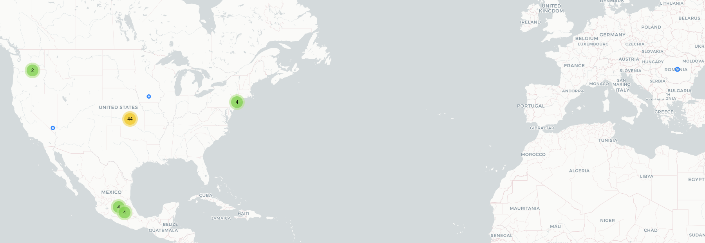

# Red Panic Button

## Fecha de análisis

- **Análisis estático (mediante Exodus Privacy/MobFS):** 17/10/2023
- **Análisis dinámico (mediante análisis de tráfico de red):** 17/10/2023
- **Análisis Posteriores:** 

## Enlaces a los archivos analizados

- [isharing.pcap](https://cloud.datavoros.org/index.php/s/T46HeCbbRmppwLm)
- [isharing.apk](https://cloud.datavoros.org/index.php/s/dQXTA63R7nxfLTo)
- [Capturas de pantalla](./captura-de-pantalla/)

## Descripción de la aplicación
- **Tipo:** Localizador
- **Costo:** Freemium  
- **Enlace de descarga:** [https://play.google.com/store/apps/details?id=uk.ucsoftware.panicbuttonpro&hl=es_MX&gl=US](https://play.google.com/store/apps/details?id=uk.ucsoftware.panicbuttonpro&hl=es_MX&gl=US)
- **Descargas:** 100k+
- **Ultima fecha de actualización:** 30/08/2023
- **Versión:** 4.0.8
- **Desarrollador:** Ultimate Communication Software Ltd
- **Firma:** No disponible
- **Contacto:** contact@isharingsoft.com
- **Condiciones de uso y Política de privacidad:** [https://web.archive.org/web/20231017184449/https://www.redpanicbutton.com/mobile-applications-privacy-policy/](https://web.archive.org/web/20231017184449/https://www.redpanicbutton.com/mobile-applications-privacy-policy/)
    
- **Descripción en PlayStore:**
~~~
***En honor a los Juegos Paralímpicos de Londres 2012 (29 agosto-9 septiembre) obtienen botón rojo de pánico en un descuento!***
** Enviar correo pánico automático **
** Ahora, con contraste dinámico **
** Compatible con el servicio de TalkBack accesibilidad **
** Obtener todas las funciones utilizando la tienda Botón Pánico Rojo**
** Destacado como Deal SmartApps del Día **

Cuando usted está en dificultad pulse el botón rojo de pánico! Sólo tienes que establecer un número de pánico y el teléfono envía un SMS que contiene un enlace a Google Maps con el GPS fino o GSM ordinario basado coordenadas.

Funciones gratuitas:
-Enviar SMS pánico
-Enviar e-mail de pánico
-Un toque de pánico a través de Widgets
-Compartir el pánico en Twitter

Funciones pagadas:
-Acceso remoto a la ubicación del teléfono
-Llamada de emergencia
-Respuesta Rápida SMS
-Dirección de SMS pánico
-El pánico mensaje de voz
-Unlimited números de pánico
-Sin publicidad
~~~

## Rastreadores identificados (mediante Exodus Privacy)

|Rastreador|Tipo|
|---|---| 
|[Facebook Login](https://developers.facebook.com/docs/android)|Identificación|
|[Google AdMob](https://admob.google.com/home/)|Publicidad|

Enlace al [reporte](https://reports.exodus-privacy.eu.org/es/reports/uk.ucsoftware.panicbuttonpro/latest/) de Exodus Privacy. 

## Empresas relacionadas con esta aplicación:

- [Ultimate Communication Software LTD](https://www.redpanicbutton.com/)
- [Alphabet](https://abc.xyz/) --> Google - Publicidad
- [Meta](https://about.meta.com/ltam/) --> Facebook - Identificación
- [Twitter](https://twitter.com) - Analítica. 
- [Sendgrid](https://sendgrid.com/) - envío de emails
- [Amazon](https://aws.amazon.com/) - Almacenamiiento de datos
- [Uninet](https://telmex.com/web/acerca-de-telmex/uninet) - Almacenamiento de datos
- [Microsoft](https://www.microsoft.com/es-mx/about) - Alamcenamiento de datos
- [GTS Telecom SRL](https://www.gts.ro/en) - Almacenamiento de datos
- [Edgecast](https://edg.io/) --> Ahora Edge.io es, entre otras cosas, un CDN.

### Proveedores de autenticación para la aplicación

- Si bien aparece el rastreador de Facebook login, no encontramos cómo identificarnos a través de Facebook.

### Dominios integrados al código de la aplicación que no pertecen directamente a los rastreadores

- Nada que reportar

## Permisos   

- **Según MobFS/Exodus Privacy:** 27
- **Según prueba de uso:** 6

### Permisos según Exodus Privacy

- :pushpin::exclamation:ACCESS_BACKGROUND_LOCATION
_access location in the background_

- :pushpin::exclamation:ACCESS_COARSE_LOCATION
_access approximate location only in the foreground_

- :pushpin::exclamation:ACCESS_FINE_LOCATION
_access precise location only in the foreground_

- ACCESS_NETWORK_STATE
_view network connections_

- BLUETOOTH
_pair with Bluetooth devices_

- BLUETOOTH_ADMIN
_access Bluetooth settings_

- :large_blue_diamond::exclamation:BLUETOOTH_CONNECT
_connect to paired Bluetooth devices_
    
- :large_blue_diamond::exclamation:BLUETOOTH_SCAN
_discover and pair nearby Bluetooth devices_

- :camera::exclamation:CAMERA
_take pictures and videos_

- FOREGROUND_SERVICE
_run foreground service_

- INTERNET
_have full network access_

- POST_NOTIFICATIONS

- :busts_in_silhouette::exclamation:READ_CONTACTS
_read your contacts_

- :telephone_receiver::exclamation:READ_PHONE_STATE
_read phone status and identity_

- RECEIVE_BOOT_COMPLETED
_run at startup_

- :speaker::exclamation:RECORD_AUDIO
_record audio_

- REQUEST_IGNORE_BATTERY_OPTIMIZATIONS
_ask to ignore battery optimizations_

- SCHEDULE_EXACT_ALARM

- :page_with_curl::exclamation:SEND_SMS
_send and view SMS messages_

- USE_FULL_SCREEN_INTENT

- VIBRATE
_control vibration_

- WAKE_LOCK
_prevent phone from sleeping_

- BILLING

- RECEIVE

- BIND_GET_INSTALL_REFERRER_SERVICE

- AD_ID

- DYNAMIC_RECEIVER_NOT_EXPORTED_PERMISSION

El icono :exclamation: indica un nivel 'Peligroso' o 'Especial' de acuerdo a los [niveles de protección de Google](https://developer.android.com/guide/topics/permissions/overview). 

### Permisos solicitados durante el uso de la aplicación

- :red_circle: Localización
- :red_circle: Envío y lectura de SMS
- :red_circle: Tomar fotos y grabar videos 
- :red_circle: Grabar audio
- :blue_circle: Acceso a contactos
- :blue_circle: Administar llamadas telefónicas

:red_circle: Este ícono indica un permiso obligatorio   
:blue_circle: Este ícono indica un permiso opcional pero se pierde una funcionalidad particular

## Datos

### Datos solicitados al usuario durante el uso de la aplicación
- :blue_circle: Nombre y apellido
- :blue_circle: Dirección
- :blue_circle: Datos de contactos de emergencia

    
:red_circle: Este ícono indica un dato obligatorio   
:blue_circle: Este ícono indica un dato opcional pero se pierde una funcionalidad particular

### Tabla de conexiones realizadas durante el uso de la aplicación

| Dirección IP    | País          | Ciudad         | Número AS | Organización AS             | Rastreador o dominio                       |
|-----------------|---------------|----------------|-----------|-----------------------------|--------------------------------------------|
| 13.89.172.1     | United States | Des Moines     |      8075 | MICROSOFT-CORP-MSN-AS-BLOCK | redpanicdevapi.azurewebsites.net           |
|  44.233.221.190 | United States | Boardman       |     16509 | AMAZON-02                   | api.sendgrid.com                           |
| 45.82.28.86     | Romania       |                |      5606 | GTS Telecom SRL             | redpanicbutton.com                         |
| 54.213.76.12    | United States | Boardman       |     16509 | AMAZON-02                   | api.sendgrid.com                           |
| 72.21.91.70     | United States |                |     15133 | EDGECAST                    | abs.twimg.com                              |
| 104.244.42.1    | United States |                |     13414 | TWITTER                     | analytics.twitter.com                      |
| 104.244.42.3    | United States |                |     13414 | TWITTER                     | analytics.twitter.com                      |
| 104.244.42.70   | United States |                |     13414 | TWITTER                     | mobile.twitter.com                         |
| 104.244.42.130  | United States |                |     13414 | TWITTER                     | api.twitter.com                            |
| 104.244.42.197  | United States |                |     13414 | TWITTER                     | t.co                                       |
| 142.250.114.188 | United States |                |     15169 | GOOGLE                      | mtalk.google.com                           |
| 142.250.138.155 | United States |                |     15169 | GOOGLE                      | stats.g.doubleclick.net                    |
| 142.250.138.157 | United States |                |     15169 | GOOGLE                      | stats.g.doubleclick.net                    |
| 142.250.177.1   | United States |                |     15169 | GOOGLE                      | contactsui-pa.googleapis.com               |
| 142.250.177.3   | United States |                |     15169 | GOOGLE                      | fonts.gstatic.com                          |
| 142.250.177.10  | United States |                |     15169 | GOOGLE                      | googleapis.com                             |
| 142.250.177.14  | United States |                |     15169 | GOOGLE                      | analytics.google.com                       |
| 142.251.34.1    | United States | Queens         |     15169 | GOOGLE                      | contactsui-pa.googleapis.com               |
| 142.251.34.10   | United States | Queens         |     15169 | GOOGLE                      | googleapis.com                             |
| 142.251.34.35   | United States | Queens         |     15169 | GOOGLE                      |                                            |
| 142.251.34.42   | United States | Queens         |     15169 | GOOGLE                      | diallercallinginfolookup-pa.googleapis.com |
| 142.251.218.130 | United States |                |     15169 | GOOGLE                      | www.googletagservices.com                  |
| 142.251.218.132 | United States |                |     15169 | GOOGLE                      | www.google.com                             |
| 142.251.218.138 | United States |                |     15169 | GOOGLE                      | contactsui-pa.googleapis.com               |
| 146.75.80.157   | United States |                |     54113 | FASTLY                      | static.ads-twitter.com                     |
| 152.199.24.185  | United States |                |     15133 | EDGECAST                    | abs.twimg.com                              |
| 157.240.25.1    | Mexico        | Querétaro City |     32934 | FACEBOOK                    | static.xx.fbcdn.net                        |
| 157.240.25.2    | Mexico        | Querétaro City |     32934 | FACEBOOK                    | kaios-d.facebook.com                       |
| 157.240.25.13   | Mexico        | Querétaro City |     32934 | FACEBOOK                    | static.xx.fbcdn.net                        |
| 157.240.25.35   | Mexico        | Querétaro City |     32934 | FACEBOOK                    | www.facebook.com                           |
| 167.89.118.114  | United States | Las Vegas      |     11377 | SENDGRID                    | api.sendgrid.com                           |
| 172.217.2.138   | United States |                |     15169 | GOOGLE                      | contactsui-pa.googleapis.com               |
| 172.217.3.129   | United States |                |     15169 | GOOGLE                      | googleusercontent.com                      |
| 172.217.3.130   | United States |                |     15169 | GOOGLE                      | googleads.g.doubleclick.net                |
| 172.217.3.131   | United States |                |     15169 | GOOGLE                      | gstatic.com                                |
| 172.217.3.138   | United States |                |     15169 | GOOGLE                      | googleapis.com                             |
| 172.217.4.170   | United States |                |     15169 | GOOGLE                      | googleapis.com                             |
| 172.217.15.10   | United States |                |     15169 | GOOGLE                      | googleapis.com                             |
| 189.247.22.14   | Mexico        |                |      8151 | UNINET                      |                                            |
| 189.247.22.17   | Mexico        |                |      8151 | UNINET                      |                                            |
| 189.247.22.77   | Mexico        |                |      8151 | UNINET                      |                                            |
| 189.247.40.18   | Mexico        |                |      8151 | UNINET                      | fna.fbcdn.net                              |
| 192.178.52.138  | United States |                |     15169 | GOOGLE                      | contactsui-pa.googleapis.com               |
| 192.178.52.142  | United States |                |     15169 | GOOGLE                      | googleapis.com                             |
| 192.178.52.163  | United States |                |     15169 | GOOGLE                      | gstatic.com                                |
| 192.178.52.170  | United States |                |     15169 | GOOGLE                      | googleapis.com                             |
| 192.178.52.174  | United States |                |     15169 | GOOGLE                      | googleapis.com                             |
| 192.178.52.194  | United States |                |     15169 | GOOGLE                      | pagead2.googlesyndication.com              |
| 192.178.52.195  | United States |                |     15169 | GOOGLE                      | fonts.gstatic.com                          |
| 192.178.52.202  | United States |                |     15169 | GOOGLE                      | googleapis.com                             |
| 192.178.52.205  | United States |                |     15169 | GOOGLE                      | accounts.google.com                        |
| 192.178.52.206  | United States |                |     15169 | GOOGLE                      | google.com                                 |
| 192.178.52.226  | United States |                |     15169 | GOOGLE                      | googleads.g.doubleclick.net                |
| 192.178.52.227  | United States |                |     15169 | GOOGLE                      | google.com.mx                              |
| 192.178.52.232  | United States |                |     15169 | GOOGLE                      | googletagmanager.com                       |
| 192.178.52.234  | United States |                |     15169 | GOOGLE                      | contactsui-pa.googleapis.com               |
| 192.229.210.163 | United States |                |     15133 | EDGECAST                    | video.twimg.com                            |
| 216.58.195.226  | United States |                |     15169 | GOOGLE                      | googletagservices.com                      |
| 216.58.195.232  | United States |                |     15169 | GOOGLE                      | google-analytics.com                       |
| 216.58.195.234  | United States |                |     15169 | GOOGLE                      | googleapis.com                             |
| 216.58.195.246  | United States |                |     15169 | GOOGLE                      | googleusercontent.com                      |

**Los dominios o rastreadores contactados son solicitudes de conexión de la aplicación establecidas a través del DNS. Conocer esto no siempre es posible, ya que muchas veces dichas comunicaciones están cifradas.**

### Mapa de conexiones realizadas durante el uso de la aplicación

### Datos compartidos y uso según la Playstore:

- No se comparten datos con terceros

### Datos recopilados y uso según la Playstore

- No se recopilan datos

### Prácticas de seguridad

- Los datos están cifrados en tránsito

### Datos recopilados y uso según la Política de privacidad

|Datos|
|---|
|**Información de la cuenta(opcional)**: nombre, apellido, fecha de nacimiento, número de teléfono, dirección, email, información de pago|
|**Información de contactos**: nombre y número de teléfono|
|**Información recolectada de manera automática**: información del dispositivo como modelo, sistema operativo, identificadores únicos, tipo de navegador y estadística de uso de la aplicación, dirección IP|
|**Información de geolocalización**|

- #### El uso general que le dan a la información incluye:
    - La información de geolocalización no se comparte con nadie
    - La información recolectada es compartida sólo en el caso de que tenga un uso legal (como en todas las aplicaciones); por seguridad de los esarrolladores o las personas usuarias (como en todas las aplicaciones) y con terceros que ofrezcan un servicio, sin embargo estos últimos no pueden utilizar la información recibida de manera independiente. 
    - Información proporcionada por la persona usuaria no se transmite a ningún servidor externo y se queda en el teléfono. 
  
        

### Notas importantes sobre seguridad y privacidad:

- Esta aplicación recopila lo mínimo necesario para funcionar.
- La información que la persona usuaria otorga de manera opcional como datos personales (nombre, dirección) se procesa en el teléfono, no en un servidor externo.
- La información de geolocalización no se transmite a nadie.
- Los medios de contacto de emergencia de esta aplicación son emails, llamadas y sms. Los tres son suceptibles de ser interceptados por un ataque de "[hombre en el medio](https://www.bitdefender.es/consumer/support/answer/79602/)", de tal manera que no provee un medio seguro de transmisión de la información de emergencia.
- Las conexiones a Twitter tienen que ver con que se puede visitar la página de Twitter de la aplicación desde la misma aplicación.
- Las conexiones a Facebook tienen que ver con la misma razón anteriormente expuesta y con el rastreador de Facebook login (nunca pudimos autenticarnos en la aplicación a través de Facebook, no se entiende qué hace ahí dicho rastreador).

## Conclusiones
 - Esta es una aplicación que tiene los permisos mínimos para funcionar y recopila la menor cantidad de datos posibles y sólo tiene un rastreador que recopila datos de analítica. Además mucha de la información que necesita para funcionar se procesa directamente en el teléfono, de tal manera que no llega a ningún servidor. 
 - Hay que decir que los medios de comunicación para alertar a otras personas sobre un peligro no son seguros porque no están cifrados. Aún así, en una situación de emergencia, tal vez esto no sea problemático para personas usuarias con un perfil bajo.
 - Junto con la aplicación Círculo 2.0, es la que más salvaguarda la privacidad de las personas usuarias.