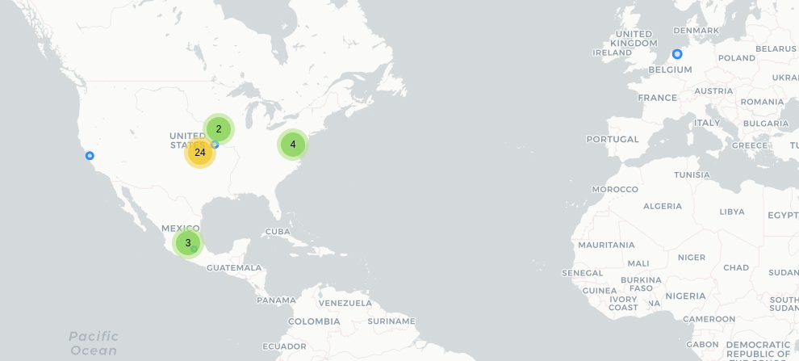

# SosFeM

## Fecha de análisis

- **Análisis estático (mediante Exodus Privacy/MobFS):** 22/10/2023
- **Análisis dinámico (mediante análisis de tráfico de red):** 22/10/2023
- **Análisis Posteriores:** 

## Archivos analizados

- [sosfem.pcap](https://cloud.datavoros.org/index.php/s/k7Jczxaqs2FyLcn)
- [sosfem.apk](https://cloud.datavoros.org/index.php/s/5F6JnekPrbRzSfX)
- [Capturas de pantalla](./captura-de-pantalla/)

## Descripción de la aplicación
- **Tipo:** Localizador
- **Costo:** Freemium  
- **Enlace de descarga:** [https://play.google.com/store/apps/details?id=com.aboolean.sosmex&hl=es_419&gl=US](https://play.google.com/store/apps/details?id=com.aboolean.sosmex&hl=es_419&gl=US)
- **Descargas:** 100k+
- **Ultima fecha de actualización:** 14/09/2023
- **Versión:** 3.9.3
- **Desarrollador:** Kizara Labs SAS de CV
- **Firma:** boolean
- **Contacto:** oscar@sosmex.online, soporte@sosmex.online
- **Condiciones de uso y Política de privacidad:** [https://web.archive.org/web/20231022141233/https://sosmex-niunamenos.com/avisoprivacidad/](https://web.archive.org/web/20231022141233/https://sosmex-niunamenos.com/avisoprivacidad/)

    
- **Descripción en PlayStore:**
~~~
SOSFem antes SOSMex

Si necesitas ayuda en caso de emergencia, con SOSfem solo necesitas agitar tu celular y podrás solicitar ayuda a tus contactos de emergencia.

Llamada de emergencia personalizada al activar el botón de pánico SOS

Enviar una alerta con tu ubicación GPS a contactos previamente seleccionados en caso de una emergencia
~~~

## Rastreadores identificados (mediante Exodus Privacy)

|Rastreador|Tipo|
|---|---| 
|[Facebook Analytics](https://developers.facebook.com/docs/android)|Analítica|
|[Facebook Flipper](https://fbflipper.com/)|Analítica|
|[Facebook Login](https://developers.facebook.com/docs/android)|Identificación|
|[Google Crashlytics](https://firebase.google.com/products/crashlytics)|Reporte de fallos|
|[Google Firebase Analytics](https://firebase.google.com/)|Analítica|
|[Google Analytics](https://marketingplatform.google.com/about/analytics/)|Analítica|
|[Google AdMob](https://admob.google.com/home/)|Publicidad|
|[Google Tag Manager](https://marketingplatform.google.com/about/tag-manager/)|Analítica|
|[Huawei Mobile Services (HMS) Core](https://developer.huawei.com/consumer/en/hms)|Analítica, Publicidad, Ubicación|
|[Mapbox](https://www.mapbox.com/)|Ubicación|
|[OneSignal](https://onesignal.com/)|Maximizador de *engagement*|

**NOTA**: Existe un rastreador WePlanSDK, perteneciente a esta empresa: [https://www.weplananalytics.com/es](https://www.weplananalytics.com/es), no registrado por Exodus.

Enlace al [reporte](https://reports.exodus-privacy.eu.org/es/reports/388372/) de Exodus Privacy. 

## Empresas relacionadas con esta aplicación:

- [Kizara Labs S.A.S de C.V.](https://sosmex-niunamenos.com/)
- [Alphabet](https://abc.xyz/) --> Google - Crashes, Analítica
- [Amazon](https://aws.amazon.com/) - Almacenamiiento de datos
- [Meta](https://about.meta.com/ltam/) --> Facebook - Identificación, Analítica
- [Huawei](https://www.huawei.com/mx/corporate-information) - Analítica
- [Mapbox](https://www.mapbox.com/) - Ubicación
- [OneSignal](https://onesignal.com/) - Maximizador de *engagement*
- [WePlanAnalytics](https://www.weplananalytics.com/es)
- [Hostinger International Limited](https://www.hostinger.com/)
- [Cloudflare](https://www.cloudflare.com/) - Almacenamiento de datos
- [Uninet](https://telmex.com/web/acerca-de-telmex/uninet) - CDN
- [Microsoft](https://www.microsoft.com/es-mx/about) - Almacenamiento de datos
- [Imagekit.io](https://imagekit.io/) - Procesamiento de imágenes

### Dominios integrados al código de la aplicación que no pertecen directamente a los rastreadores

|Dominios|
|---|
|https://api.weplan-app.com|
|https://instagramcom|
|https://ktor.io/|
|https://1link.io/|
|https://linked.in/|

## Permisos   

- **Según MobFS/Exodus Privacy:** 43
- **Según prueba de uso:** 7

### Permisos según Exodus Privacy

- :pushpin::exclamation:ACCESS_BACKGROUND_LOCATION
_access location in the background_

- :pushpin::exclamation:ACCESS_COARSE_LOCATION
_access approximate location only in the foreground_

- :pushpin::exclamation:ACCESS_FINE_LOCATION
_access precise location only in the foreground_

- ACCESS_NETWORK_STATE
_view network connections_

- ACCESS_WIFI_STATE
_view Wi-Fi connections_

- :telephone_receiver::exclamation:CALL_PHONE
_directly call phone numbers_

- :camera::exclamation:CAMERA
_take pictures and videos_

- FOREGROUND_SERVICE
_run foreground service_

- GET_TASKS
_retrieve running apps_

- :blue_heart:HIGH_SAMPLING_RATE_SENSORS
_access sensor data at a high sampling rate_

- INTERNET
_have full network access_

- POST_NOTIFICATIONS

- READ_APP_BADGE

- :busts_in_silhouette::exclamation:READ_CONTACTS
_read your contacts_

- :file_folder::exclamation:READ_EXTERNAL_STORAGE
_read the contents of your shared storage_

- READ_MEDIA_AUDIO

- READ_MEDIA_IMAGES

- READ_MEDIA_VIDEO

- :telephone_receiver::exclamation:READ_PHONE_STATE
_read phone status and identity_

- RECEIVE_BOOT_COMPLETED
_run at startup_

- :speaker::exclamation:RECORD_AUDIO
_record audio_

- :page_with_curl::exclamation:SEND_SMS
_send and view SMS messages_

- :exclamation:SYSTEM_ALERT_WINDOW
This app can appear on top of other apps

- VIBRATE
_control vibration_

- WAKE_LOCK
_prevent phone from sleeping_

- C2D_MESSAGE

- UPDATE_COUNT

- BILLING

- RECEIVE

- BIND_GET_INSTALL_REFERRER_SERVICE

- AD_ID

- UPDATE_SHORTCUT

- CHANGE_BADGE

- READ_SETTINGS

- :exclamation:WRITE_SETTINGS

- GET_COMMON_DATA

- UPDATE_BADGE

- READ

- WRITE

- BROADCAST_BADGE

- PROVIDER_INSERT_BADGE

- BADGE_COUNT_READ

- BADGE_COUNT_WRITE

El icono :exclamation: indica un nivel 'Peligroso' o 'Especial' de acuerdo a los [niveles de protección de Google](https://developer.android.com/guide/topics/permissions/overview). 

### Permisos solicitados durante el uso de la aplicación

- :red_circle: Contactos
- :red_circle: Llamadas telefónicas
- :red_circle: Ubicación
- :red_circle: Enviar mensajes SMS
- :blue_circle: Grabar Audio
- :blue_circle: Mostrar sobre otras aplicaciones
- :blue_circle: Tomar fotos y grabar video
- :blue_circle: Acceso a notificación permanente (sirve para activar el botón de pánico agitando el celular o apretando varias veces el botón de bloqueo)

:red_circle: Este ícono indica un permiso obligatorio   
:blue_circle: Este ícono indica un permiso opcional pero se pierde una funcionalidad particular

## Datos

### Datos solicitados al usuario durante el uso de la aplicación

- :red_circle: Género 
- :red_circle:Nombre y apellido
- :red_circle:Correo Electrónico
- :red_circle: País de residencia
- :blue_circle: Lugares que se frecuentan como casa, trabajo, escuela, etc.
- :blue_circle: Datos de contactos de emergencia

*Nota: Como existe la función de pago, probablemente (no lo probamos) los datos que se necesitan para ello son de una tarjeta o forma de pago y dirección de facturación.*
    
:red_circle: Este ícono indica un dato obligatorio   
:blue_circle: Este ícono indica un dato opcional pero se pierde una funcionalidad particular

### Tabla de conexiones realizadas durante el uso de la aplicación

| Dirección IP    | País          | Ciudad         | Número AS | Organización AS                 | Rastreador o dominio                                                                                 |
|-----------------|---------------|----------------|-----------|---------------------------------|------------------------------------------------------------------------------------------------------|
| 3.161.55.26     | United States |                |     16509 | AMAZON-02                       | api.mapbox.com                                                                                       |
| 3.161.55.49     | United States |                |     16509 | AMAZON-02                       | api.mapbox.com                                                                                       |
| 3.161.55.60     | United States |                |     16509 | AMAZON-02                       | api.mapbox.com                                                                                       |
| 3.161.55.83     | United States |                |     16509 | AMAZON-02                       | api.mapbox.com                                                                                       |
| 18.160.124.92   | United States |                |     16509 | AMAZON-02                       | ik.imagekit.io                                                                                       |
|  18.160.124.107 | United States |                |     16509 | AMAZON-02                       | ik.imagekit.io                                                                                       |
| 20.150.77.36    | United States | Des Moines     |      8075 | MICROSOFT-CORP-MSN-AS-BLOCK     | sosmex.blob.core.windows.net                                                                         |
|  34.160.111.145 | United States | Kansas City    |     15169 | GOOGLE                          | ifconfig.me                                                                                          |
| 44.215.41.60    | United States | Ashburn        |     14618 | AMAZON-AES                      | events.mapbox.com                                                                                    |
| 52.0.110.39     | United States | Ashburn        |     14618 | AMAZON-AES                      | events.mapbox.com                                                                                    |
| 52.0.138.61     | United States | Ashburn        |     14618 | AMAZON-AES                      | api.mapbox.com                                                                                       |
| 52.9.63.135     | United States | San Jose       |     16509 | AMAZON-02                       | ps.pndsn.com                                                                                         |
| 52.173.76.33    | United States | Des Moines     |      8075 | MICROSOFT-CORP-MSN-AS-BLOCK     | sosmex-api-v2.azurewebsites.net, sosmex-api.azurewebsites.net, appsosfem-community.azurewebsites.net |
| 81.16.28.134    | Netherlands   | Meppel         |     47583 | Hostinger International Limited | sosmex-niunamenos.com                                                                                |
| 104.18.214.59   |               |                |     13335 | CLOUDFLARENET                   | api.onesignal.com                                                                                    |
| 104.18.215.59   |               |                |     13335 | CLOUDFLARENET                   | img.onesignal.com                                                                                    |
| 107.20.234.131  | United States | Ashburn        |     14618 | AMAZON-AES                      | events.mapbox.com                                                                                    |
| 142.250.177.2   | United States |                |     15169 | GOOGLE                          | www.googletagservices.com                                                                            |
| 142.250.177.3   | United States |                |     15169 | GOOGLE                          | fonts.gstatic.com                                                                                    |
| 142.250.177.10  | United States |                |     15169 | GOOGLE                          | www.googleapis.com                                                                                   |
| 142.250.177.14  | United States |                |     15169 | GOOGLE                          | www.youtube.com                                                                                      |
| 142.251.218.131 | United States |                |     15169 | GOOGLE                          | crashlyticsreports-pa.googleapis.com                                                                 |
| 142.251.218.138 | United States |                |     15169 | GOOGLE                          | content-autofill.googleapis.com                                                                      |
| 157.240.25.1    | Mexico        | Querétaro City |     32934 | FACEBOOK                        | graph.facebook.com                                                                                   |
| 157.240.25.13   | Mexico        | Querétaro City |     32934 | FACEBOOK                        | static.xx.fbcdn.net                                                                                  |
| 157.240.25.35   | Mexico        | Querétaro City |     32934 | FACEBOOK                        | m.facebook.com                                                                                       |
| 159.138.85.244  | Singapore     |                |    136907 | HUAWEI CLOUDS                   | upfile-dra.platform.hicloud.com                                                                      |
| 172.67.197.122  | United States |                |     13335 | CLOUDFLARENET                   | api.weplan-app.com                                                                                   |
| 172.217.2.129   | United States |                |     15169 | GOOGLE                          | lh3.googlesyndication.com y tpc.googlesyndication.com                                                |
| 172.217.3.131   | United States |                |     15169 | GOOGLE                          | firebase-settings.crashlytics.com                                                                    |
| 172.217.3.138   | United States |                |     15169 | GOOGLE                          | fonts.googleapis.com                                                                                 |
| 172.217.4.163   | United States |                |     15169 | GOOGLE                          | fonts.gstatic.com                                                                                    |
| 172.217.30.163  | United States |                |     15169 | GOOGLE                          | csi.gstatic.com                                                                                      |
| 189.247.40.18   | Mexico        |                |      8151 | UNINET                          | scontent.fmex15-1.fna.fbcdn.com                                                                      |
| 192.178.52.130  | United States |                |     15169 | GOOGLE                          | googleads.g.doubleclick.com                                                                          |
| 192.178.52.131  | United States |                |     15169 | GOOGLE                          | fonts.gtstatic.com                                                                                   |
| 192.178.52.194  | United States |                |     15169 | GOOGLE                          | pagead2.googleadservices.com y pagead2.googlesyndication.com                                         |
| 192.178.52.195  | United States |                |     15169 | GOOGLE                          | www.gstatic.com                                                                                      |
| 192.178.52.202  | United States |                |     15169 | GOOGLE                          | firebaseremoteconfig.googleapis.com                                                                  |
| 192.178.52.234  | United States |                |     15169 | GOOGLE                          | firebaseinappmessaging.googleapis.com                                                                |

**Los dominios o rastreadores contactados son solicitudes de conexión de la aplicación establecidas a través del DNS. Conocer esto no siempre es posible, ya que muchas veces dichas comunicaciones están cifradas. En este caso las llamadas a DNS están cifradas, por eso no hay más datos.**

### Mapa de conexiones realizadas durante el uso de la aplicación

### Datos compartidos y uso según la Playstore:

- Es posible que se compartan datos con terceros de
    - Ubicación aproximada para funciones de la aplicación y estadística y seguridad, cumplimiento y prevención de fraudes
    - Ubicación precisa para funciones de la aplicación y estadística y seguridad, cumplimiento y prevención de fraudes y personalización
    - ID de usuario para funciones de la aplicación, estadística y publicidad y marketing
    - Diagnótico para estadísticas
    - Otros datos de rendimiento de la aplicación para estadísticas
    - Dispositivo u otros ID para estadísticas

### Datos recopilados y uso según la Playstore

|Datos|Uso|
|---|---|
|Ubicación aproximada|Funciones de la aplicación, Estadísticas, Seguridad, cumplimiento y prevención de fraudes y Personalización|
|Nombre|Funciones de la aplicación, Estadísticas y Personalización| 
|Correo electrónico|Funciones de la aplicación, Comunicaciones del desarrollador, Seguridad, cumplimiento y prevención de fraudes, Personalización y Administración de la cuenta| 
|ID de usuario|Funciones de la aplicación, Estadísticas, Publicidad o marketing, Seguridad, cumplimiento y prevención de fraudes y Personalización|
|Interacciones de la aplicación|Estadística|
|Otro contenido generado por usuarios|Funcionalidades de la aplicación|
|Otras acciones|Estadística|
|Registro de fallas|Funciones de la aplicación y Estadísticas|
|Diagnóstico|Estadística|
|Dispositivos u otros ID|Funciones de la aplicación, Estadísticas, Publicidad o marketing y Seguridad, cumplimiento y prevención de fraudes|

### Prácticas de seguridad

- Los datos están cifrados en tránsito
- Puedes solicitar que se borren los datos

### Datos recopilados y uso según la Política de privacidad

|Datos|
|---|
|**Información de la cuenta (personal)**: nombre, apellido, fecha de nacimiento, número de teléfono, dirección, email y dirección completa.|
|**Información del dispositivo**: ID's, dirección IP, navegadores|
|**Geolocalización**: a través de dirección IP, WiFi, Bluetooth y GPS|
|**Información generada a través de rastreadores y cookies**: horario de navegación, tiempo de navegación en la aplicación y lugares visitados|

- #### El uso general que le dan a la información incluye:
    - **Fines administrativos**:
        - Realizar registro en SOSFEM
    - **Comunicados y noticias relacionados al activismo de empoderamiento de mujeres**:
    - **Investigación y desarrollo**:
        - Para ofrecer, mejorar, poner a prueba y controlar la eficacia de la aplicación
        - Para diagnosticar o solucionar problemas tecnológicos
    - **Características gracias a la recolección automática de información a través de rastreadores**
        - Número total de visitantes, el tráfico y los patrones de uso demográfico

- #### La información que se comparte con terceros y con subsidiarias puede incluir:
    - Total o parcialmente los datos anteriormente mencionados para poder ofrecer el servicio que provean terceras partes.
    - En el caso de la función "Ayudante", se pueden compartir los datos personales para que estas personas puedan ayudar cuando se activa el botón de pańico.

*El ícono :exclamation: denota, lo que creemos que es algo importante a tomar en cuenta sobre la privacidad de la persona usuaria.*   
        

### Notas importantes sobre seguridad y privacidad:

- Empresa mexicana
- Cifra sus llamadas al DNS (lo cual es una buena práctica de privacidad y seguridad)
- Tiene un foro donde se pueden compartir experiencias y, pedir consejos y se puede utilizar para denunciar desapariciones
- Se puede alterar el ícono de la aplicación para que pareza una calculadora, un calendario o una cámara
- Las funciones de girar el dispositivo móvil o apretar el botón de bloqueo para generar una alerta SOS no funcionaron en nuestro Motorla g7
- Existe una función que se llama **Ayudante**. En esta, una persona que use la aplicación puede ser volunataria para ayudar en caso de emergencia a otras personas usuarias. Para esto, los desarrolladores de la aplicación contactan a la persona voluntaria antes de aceptar su solicitud. No sabemos cuáles son los criterios. Pero la información personal de una persona usuaria se podría compartir con estas personas volunatrias.
- Hay versión de paga y versión gratuita. En esta última, para tener acceso a las funciones de paga, la persona usuaria está obligada a ver anuncios. El anuncio que nos tocó tres veces ver fue una aplicación de préstamos pequeños We Crédito que está retirada de la PlayStore y actualmente es su página está caída: [https://allinfuture.tech/](https://allinfuture.tech/). Según [reseñas](https://burodeservicios.com/index.php/2023/02/15/we-credito/) en Internet pareciera ser una aplicación de Montadeudas. Aquí los enlaces a nuestro [reporte](https://datavoros.org/montadeudas/) sobre este tipo de aplicaciones y los reportes [individuales](https://docs.datavoros.org/aplicaciones/) 

## Conclusiones

- Según los datos recolectados, esta aplicación es relativamnete amigable con la privacidad, en particular porque no los venden para campañas de marketing, perfilamiento o publicidad. Sin embargo, hay un exceso de rastreadores que no se justifica. 
- Nos gusta la idea de que sea una aplicación enfocada a mujeres y el foro es una excelente adición. Sin embargo, por mejor que suene la idea del "Ayudante", nos quedan dudas sobre la seguridad de que compartan datos personales con terceros: ¿cómo deciden quién es y quién puede ser un ayudante?
- Por último, nos parece inaceptable que, como anuncio, pongan una aplicación de Montadeudas, ya que esto podría hacer que personas usuarias caigan en esa trampa. Entendemos que es a través de los rastreadores se "decide" qué tipo de anuncios se muestran, en este caso probablemente el causante sea el rastreador Google AdMob.

