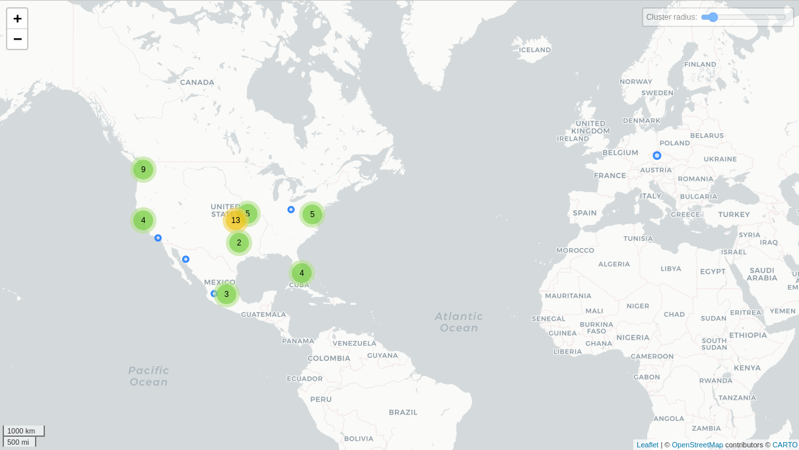

# Grindr

## Fechas de análisis

- **Análisis estático (mediante Exodus Privacy/MobFS):** 11 de febrero, 2025
- **Análisis dinámico (mediante análisis de tráfico de red):** 10 de febrero, 2025
- **Análisis Posteriores:**

## Archivos analizados

- [apk versión 5.403.0](https://cloud.datavoros.org/index.php/s/j5sTmPq7KLcG2GR)
- [pcap versión 1](https://cloud.datavoros.org/index.php/s/JmGqnpYirBkxWS2)
- [Capturas de pantalla](https://cloud.datavoros.org/index.php/s/9LbSc4cSLXSpDpW)
- [Reporte MobSF](https://cloud.datavoros.org/index.php/s/cF43ptKTyAFyip3)

## Descripción de la aplicación
- **Tipo:** Aplicación de citas    
- **Costo:** gratuito  
- **Enlace de descarga:** https://play.google.com/store/apps/details?id=com.badoo.mobile&hl=es_MX
- **Descargas:** *100M+*
- **Última fecha de actualización:** 07 de febrero, 2025
- **Versión:** 5.403.0
- **Desarrollador:** [Badoo](https://badoo.com/es-mx/)
- **Firma:** [Badoo](https://badoo.com/es-mx/)
- **Contacto:** android.support@badoo.com
- **Condiciones de uso y Política de privacidad:**
    - **Términos del servicio:** https://badoo.com/privacy/#terms
    - **Política de privacidad:** https://badoo.com/privacy/#privacy
    
- **Descripción en PlayStore:**
~~~
Badoo es la app de citas para ligar y conocer gente nueva cerca de ti 💜
¡Se acabaron las citas aburridas! ¡Conoce a la comunidad de dating más activa del mundo, en donde encontrarás miles de usuarios que comparten las mismas aficiones y gustos que tú, conocerás a personas interesantes cerca de ti y encontrarás a la que encienda tu pasión 🔥!
Badoo es la aplicación de citas que te permite ligar, chatear y tener tu primera cita con alguien especial afín a ti. Olvida todo lo que sabes sobre las aplicaciones para ligar y redescubre el dating.

~~~

## Rastreadores identificados (mediante Exodus Privacy)

|Rastreador|Tipo|
|---|---| 
|[Amazon Advertisement](https://developer.amazon.com/public/apis/earn/mobile-ads/docs/quick-start)|Anuncios|
|[AppsFlyer](http://appsflyer.com/)|Analítica|
|[Facebook Ads](https://developers.facebook.com/docs/android)|Anuncios|
|[Facebook Analytics](https://developers.facebook.com/docs/android)|Analítica|
|[Facebook Login](https://developers.facebook.com/docs/android)|Identificación|
|[Facebook Share](https://developers.facebook.com/docs/android)||
|[Google AdMob](https://admob.google.com/)|Anuncios|
|[Google Firebase Analytics](https://firebase.google.com/)|Analítica|
|[IAB Open Measurement](https://iabtechlab.com/)|Anuncios, identificación|
|[Mintegral](https://www.mintegral.com/en/)|Anuncios, analítica|
|[Pangle](https://www.pangleglobal.com/)|Anuncios|
|[Sentry](https://sentry.io/)|Informe de fallos|
|[Unity3d Ads](https://unity3d.com/)|Anuncios|

[Enlace al reporte de Exodus Privacy](https://reports.exodus-privacy.eu.org/en/reports/com.badoo.mobile/latest/)   

## Empresas relacionadas con esta aplicación:

|Empresa|Servicios que ofrecen|
|---|---| 
| Amazon Web Services (AWS)   | Infraestructura en la nube, almacenamiento, servidores y cómputo escalable |
| Akamai International B.V.   | CDN, optimización de tráfico, seguridad web y servicios en la nube |
| Greysom Limited             | Servicios de telecomunicaciones y hosting en la nube        |
| Google Cloud Platform       | Infraestructura en la nube, almacenamiento, servidores y análisis de datos |
| Fastly                      | CDN, seguridad web y optimización de entrega de contenido   |
| Facebook (Meta)             | Publicidad, autenticación de usuarios y servicios de marketing |
| Alibaba US Technology Co., Ltd. | Infraestructura en la nube y servicios tecnológicos en EE.UU. |

### Empresas identificadas a través del Aviso de Privacidad con que se comparten datos:

- [Facebook](https://www.facebook.com)
- [Instagram](https://www.instagram.com)
- [Google](https://www.google.com)
- [Apple](https://www.apple.com)
- [Twilio](https://www.twilio.com)
- [AppsFlyer](https://www.appsflyer.com)
- [Typeform](https://www.typeform.com)
- [Kantar](https://www.kantar.com)
- [Khoros](https://khoros.com)

### Dominios integrados al código de la aplicación que no pertenecen directamente a los rastreadores

|Dominios|
|---|
|https://api-project-72268322300.firebaseio.com/|
|https://play.google.com/|
|https://www.slf4j.org/|
|https://smonitorsdk.s/|
|https://ns.adobe.com/|
|https://g.tenor.com/|
|https://badoo.com/|
|https://172.100.1.5/|
|https://docs.sentry.io/|
|https://sf16-static.i18n-pglstatp.com/|
|https://tizen.org/|
|https://exoplayer.dev/|
|https://lf3-cdn-tos.bytegoofy.com/|
|https://api.giphy.com/|
|https://xmlpull.org/|
|https://goo.gle/|
|https://schemas.android.com/|
|https://youtrack.jetbrains.com/|
|https://www.pangleglobal.com/|
|https://m.badoo.com/|
|https://sapp.s/|
|https://client-api.arkoselabs.com/|
|https://192.168.11.216/|
|https://webapps.globalcharge.com/|
|https://issuetracker.google.com/|
|https://github.com/|
|https://firebase.google.com/|
|https://unity.com/|

## Permisos   

- **Según Exodus Privacy/MobFS:** 62
- **Según prueba de uso:** 5

### Permisos según Exodus Privacy

- ACCESS_ADSERVICES_AD_ID
- ACCESS_ADSERVICES_ATTRIBUTION
- ACCESS_ADSERVICES_TOPICS
- :exclamation: ACCESS_COARSE_LOCATION
- :exclamation: ACCESS_FINE_LOCATION
- ACCESS_NETWORK_STATE
- ACCESS_WIFI_STATE
- BLUETOOTH
- :exclamation: BLUETOOTH_CONNECT
- :exclamation: CAMERA
- CHANGE_NETWORK_STATE
- CHANGE_WIFI_STATE
- DISABLE_KEYGUARD
- FOREGROUND_SERVICE
- FOREGROUND_SERVICE_CAMERA
- FOREGROUND_SERVICE_DATA_SYNC
- FOREGROUND_SERVICE_MICROPHONE
- :exclamation: GET_ACCOUNTS
- INTERNET
- MODIFY_AUDIO_SETTINGS
- POST_NOTIFICATIONS
- READ_APP_BADGE
- READ_BASIC_PHONE_STATE
- :exclamation: READ_EXTERNAL_STORAGE
- READ_MEDIA_IMAGES
- READ_MEDIA_VIDEO
- READ_MEDIA_VISUAL_USER_SELECTED
- :exclamation: READ_PHONE_NUMBERS
- :exclamation: READ_PHONE_STATE
- :exclamation: RECORD_AUDIO
- REORDER_TASKS
- USE_BIOMETRIC
- USE_CREDENTIALS
- USE_FINGERPRINT
- USE_FULL_SCREEN_INTENT
- VIBRATE
- WAKE_LOCK
- :exclamation: WRITE_EXTERNAL_STORAGE
- UPDATE_COUNT
- INSTALL_SHORTCUT
- READ_SETTINGS
- BILLING
- CHECK_LICENSE
- DYNAMIC_RECEIVER_NOT_EXPORTED_PERMISSION
- SignaturePrivileged
- RECEIVE
- BIND_GET_INSTALL_REFERRER_SERVICE
- ACTIVITY_RECOGNITION
- AD_ID
- READ_GSERVICES
- READ_SETTINGS
- UPDATE_SHORTCUT
- CHANGE_BADGE
- READ_SETTINGS
- :exclamation: WRITE_SETTINGS
- UPDATE_BADGE
- READ_SETTINGS
- :exclamation: WRITE_SETTINGS
- READ
- WRITE
- BROADCAST_BADGE
- PROVIDER_INSERT_BADGE 

El icono :exclamation: indica un nivel 'Peligroso' o 'Especial' de acuerdo a los [niveles de protección de Google](https://developer.android.com/guide/topics/permissions/overview).

### Permisos solicitados durante el uso de la aplicación

- :red_circle: Ubicación
- :blue_circle: Cámara
- :blue_circle: Galería
- :blue_circle: Microfono
- :blue_circle: Notificaciones

:red_circle: Este ícono indica un permiso obligatorio   
:blue_circle: Este ícono indica un permiso opcional pero se pierde una funcionalidad particular

## Datos

### Datos solicitados al usuario 

#### Datos solicitados durante el registro

- :red_circle: Correo electrónico
- :blue_circle: Nombre
- :red_circle: ¿Qué tipo de relación se busca?
- :red_circle: Género
- :red_circle: Edad
- :red_circle: ¿ A quien te gustaría conocer (hombres/mujeres/todo el mundo)?

#### Datos solicitados durante el uso de la aplicación

- :blue_circle: Orientación sexual
- :blue_circle: Situación sentimental
- :blue_circle: Intereses
- :blue_circle: Biografia
- :blue_circle: Estatura
- :blue_circle: ¿A dondé fuiste a la escuela?
- :blue_circle: ¿A qué te dedicas?
- :blue_circle: ¿Fumas?
- :blue_circle: ¿Eres extrovertido o introvertido
- :blue_circle: Signo zodiacal
- :blue_circle: Biométricos (verificación de foto)
    

:red_circle: Este ícono indica que se debe ingresar este dato de manera obligatoria.   
:blue_circle: Este ícono indica que estos datos son opcionales.

### Tabla de conexiones realizadas durante el uso de la aplicación

| Dirección IP     | Número de paquetes | País          | Ciudad/Zona        | Organización                               |
|-----------------|-------------------|--------------|--------------------|-------------------------------------------|
| 3.161.41.115   | 46                | United States |                    | AMAZON-02                                 |
| 3.161.57.191   | 58                | United States |                    | AMAZON-02                                 |
| 3.226.181.61   | 31                | United States | Ashburn            | AMAZON-AES                                |
| 3.231.83.229   | 32                | United States | Ashburn            | AMAZON-AES                                |
| 10.1.10.1      | 86668             |               |                    |                                           |
| 18.160.114.68  | 29                | United States | Seattle            | AMAZON-02                                 |
| 18.160.114.203 | 64                | United States | Seattle            | AMAZON-02                                 |
| 18.160.123.130 | 25                | United States | Seattle            | AMAZON-02                                 |
| 18.160.124.5   | 94                | United States | Seattle            | AMAZON-02                                 |
| 18.160.124.30  | 41                | United States | Seattle            | AMAZON-02                                 |
| 23.223.26.177  | 41                | Mexico       | Querétaro          | Akamai International B.V.                 |
| 31.222.67.112  | 2903              | Czechia      | Prague             | Greysom Limited                           |
| 31.222.75.65   | 246               | United States | Miami              | Greysom Limited                           |
| 31.222.75.112  | 256               | United States | Miami              | Greysom Limited                           |
| 31.222.75.183  | 761               | United States | Miami              | Greysom Limited                           |
| 31.222.75.227  | 9125              | United States | Miami              | Greysom Limited                           |
| 34.54.248.71   | 61                | United States | Kansas City        | GOOGLE-CLOUD-PLATFORM                     |
| 34.107.172.168 | 82                | United States | Kansas City        | GOOGLE-CLOUD-PLATFORM                     |
| 34.110.229.214 | 76                | United States | Kansas City        | GOOGLE-CLOUD-PLATFORM                     |
| 34.120.195.249 | 341               | United States | Kansas City        | GOOGLE-CLOUD-PLATFORM                     |
| 151.101.1.91   | 32521             | United States | San Francisco      | FASTLY                                    |
| 151.101.65.91  | 8150              | United States | San Francisco      | FASTLY                                    |
| 151.101.129.91 | 22502             | United States | San Francisco      | FASTLY                                    |
| 151.101.193.91 | 3275              | United States | San Francisco      | FASTLY                                    |
| 157.240.25.1   | 203               | Mexico       | Querétaro City     | FACEBOOK                                  |
| 157.240.25.35  | 389               | Mexico       | Querétaro City     | FACEBOOK                                  |
| 172.217.3.138  | 23                | United States |                    | GOOGLE                                    |
| 192.178.52.162 | 21                | United States |                    | GOOGLE                                    |
| 192.178.56.196 | 673               | United States |                    | GOOGLE                                    |
| 192.178.56.234 | 24                | United States |                    | GOOGLE                                    |
| 192.178.57.14  | 1063              | United States |                    | GOOGLE                                    ||

### Mapa de conexiones realizadas durante el uso de la aplicación

### Datos recopilados y uso según la Play Store

Google PlayStore declara los siguientes datos recopilados por Badoo:

|Datos|Uso|
|---|---|
|Nombre|Funciones de la app, Comunicaciones del desarrollador, Publicidad o marketing y Seguridad, cumplimiento y prevención de fraudes|
|Dirección de correo electrónico (Opcional)|Funciones de la app, Comunicaciones del desarrollador, Publicidad o marketing, Seguridad, cumplimiento y prevención de fraudes y Administración de la cuenta|
|IDs de usuario|Funciones de la app, Estadísticas, Publicidad o marketing, Seguridad, cumplimiento y prevención de fraudes y Administración de la cuenta|
|Número de teléfono|Funciones de la app, Publicidad o marketing y Seguridad, cumplimiento y prevención de fraudes|
|Raza y etnia (Opcional)|Funciones de la app y Personalización|
|Creencias políticas o religiosas (Opcional)|Funciones de la app y Personalización|
|Orientación sexual|Funciones de la app y Personalización|
|Otra información|Funciones de la app, Publicidad o marketing, Seguridad, cumplimiento y prevención de fraudes, Personalización y Administración de la cuenta|
|Interacciones en la app|Estadísticas, Publicidad o marketing y Seguridad, cumplimiento y prevención de fraudes|
|Historial de búsqueda en la app|Funciones de la app y Personalización|
|Apps instaladas|Funciones de la app y Administración de la cuenta|
|Otro contenido generado por usuarios|Funciones de la app y Personalización|
|Otras acciones|Funciones de la app y Estadísticas|
|Correos electrónicos|Funciones de la app, Comunicaciones del desarrollador, Publicidad o marketing, Seguridad, cumplimiento y prevención de fraudes y Administración de la cuenta|
|Otros mensajes desde la app|Funciones de la app, Publicidad o marketing y Seguridad, cumplimiento y prevención de fraudes|
|Dispositivo u otros IDs|Funciones de la app, Estadísticas, Publicidad o marketing, Seguridad, cumplimiento y prevención de fraudes y Administración de la cuenta|
|Fotos|Funciones de la app y Seguridad, cumplimiento y prevención de fraudes|
|Videos (Opcional)|Funciones de la app|
|Grabaciones de voz o sonido (Opcional)|Funciones de la app|
|Contactos (Opcional)|Funciones de la app|
|Ubicación aproximada|Publicidad o marketing|
|Ubicación precisa|Funciones de la app, Seguridad, cumplimiento y prevención de fraudes y Personalización|
|Información de pago del usuario|Funciones de la app, Publicidad o marketing y Seguridad, cumplimiento y prevención de fraudes|
|Historial de compras|Funciones de la app y Seguridad, cumplimiento y prevención de fraudes|
|Registros de fallas|Estadísticas|
|Diagnóstico|Estadísticas|
|Otros datos de rendimiento de la app|Estadísticas|

### Datos compartidos y uso según la PLayStore

|Datos|Uso|
|---|---|
|Nombre|Seguridad, cumplimiento y prevención de fraudes y Administración de la cuenta|
|Dirección de correo electrónico|Publicidad o marketing y Seguridad, cumplimiento y prevención de fraudes|
|IDs de usuario|Publicidad o marketing y Seguridad, cumplimiento y prevención de fraudes|
|Número de teléfono|Administración de la cuenta|
|Otra información|Publicidad o marketing|
|Interacciones en la app|Publicidad o marketing|
|Otros mensajes desde la app|Seguridad, cumplimiento y prevención de fraudes|
|Dispositivo u otros IDs|Publicidad o marketing|
|Ubicación aproximada|Publicidad o marketing|
|Información de pago del usuario|Seguridad, cumplimiento y prevención de fraudes|
|Historial de compras|Administración de la cuenta|
|Registros de fallas|Estadísticas|

### Prácticas de seguridad

- Los datos están cifrados en tránsito
- Puedes solicitar que se borren los datos

### Datos recopilados y uso según la Política de privacidad

|Datos|
|---|
|**Información de registro:** Nombre, Nombre de usuario, Dirección de correo electrónico, Número móvil, Identidad de género, Fecha de nacimiento, Preferencia sexual, Fotografías, Ubicación, Información de cuentas de redes sociales (Facebook, Instagram).|
|**Información de autenticación:** Contraseña creada para la cuenta.|
|**Información pública del perfil:** Preferencia sexual, Nombre, Nombre de usuario.|
|**Información de perfil y visibilidad:** Información que los usuarios deciden compartir en su perfil, con advertencias sobre información sensible (correo, URLs, mensajería instantánea, números de teléfono, tarjetas de crédito, identidad nacional, licencias de conducir).|
|**Información de verificación de perfiles:** Número de teléfono, Verificación fotográfica (posible uso de reconocimiento facial).|
|**Información de compras:** Información de pago y transacciones realizadas en la plataforma.|
|**Información de seguridad y fraude:** Datos relacionados con bloqueos de cuentas, actividad sospechosa y procedimientos anti-fraude.|
|**Información de geolocalización:** Puntos de acceso WiFi, Longitud y latitud del dispositivo, Coordenadas de ubicación.|
|**Información del dispositivo:** Identificador de dispositivo único, Modelo de dispositivo, Sistema operativo, Acceso a la libreta de direcciones del dispositivo.|
|**Interacciones con enlaces y terceros:** Seguimiento de interacciones con enlaces dentro de la plataforma, incluidos enlaces de terceros.|
|**Datos de encuestas y campañas de marketing:** Información recopilada voluntariamente en encuestas o campañas publicitarias.|
|**Información de contacto con soporte al cliente:** Dirección de correo electrónico, Dirección IP, Información enviada en consultas y quejas, Registros de comunicaciones con soporte.|
|**Cookies y tecnologías de rastreo:** Datos recopilados automáticamente mediante cookies y tecnologías similares.|

### Uso general de la información según la Política de privacidad

- Proporcionar a los usuarios el servicio de redes sociales de Badoo
- Facilitar las oportunidades de networking en el sitio de Badoo
- Verificar la identidad de los usuarios y prevenir fraude y garantizar la seguridad de los usuarios
- Recibir el pago por servicios premium (no aplicables a los usuarios que realizan pagos a través de la App Store de Apple)
-  Permitir que los socios publicitarios sirvan anuncios especificos en la aplicación y sitios (esto incluye anuncios de video recompensados)
- Para servir anuncios a UUsuarios de los sitios/app en redes de terceros y medir la eficacia de dichos anuncios
- Para servir tarjetas promocionales y anuncios en la aplicación
- Para enviar información a los usuarios de marketing sobre los eventos, ofertas o servicios de Badoo
- COntactar con los usuarios para ejecutar encuestas con fines de investigación y para obtener retroalimentación, y para investigar si desea participar en campañas de marketing
- Permitir a los usuarios crear y mejorar su perfil de Badoo e inicar sesion en la aplicación a traves de cuentas de terceros
- Llevar a cabo investigación y análisis que ayude a Badoo a mejorar la aplicación y probar nuevas tecnologías y procesos diseñados para mejorar y mejorar la App/Sites
- Para responder a la correspondencia y las consultas de los usuarios, incluidas las consultas en las redes sociales
- Investigar y bloquear a los Usuarios por infracciones denunciadas de los Términos y Condiciones de Uso de Badoo
- Bloquear las transacciones de pago como parte de nuestros procedimientos antifraude
- Para habilitar las funciones de video y audiollamadas y el envío de imágenes y vídeo
- Construir un perfil más preciso de los usuarios, que ayude a Badoo con las coincidencias y a personalizar el servicio
- Defender las reclamaciones legales, proteger los derechos legales y proteger a las personas del daño

#### Información compartida con terceros

|Receptores|Motivo|
|---|---|
|Proveedores de Servicios|Para realizar funciones y proporcionar servicios a Badoo, como facturación, autenticación, redes sociales, mejora de productos e investigación de mercado.|
|Moderadores|Para monitorear la actividad en la app y aprobar contenido publicado por los usuarios.|
|Socios Publicitarios|Para mostrar anuncios dirigidos dentro de la aplicación y en sitios web de Badoo, incluyendo anuncios en video con recompensa.|
|Cumplimiento Legal y Aplicación de la Ley|Para cooperar con la aplicación de la ley en investigaciones criminales o para proteger derechos e intereses legales.|
|Proveedores de Servicios de Marketing|Para ayudar a Badoo con marketing y publicidad en sitios web y aplicaciones de terceros, así como medir la efectividad de sus campañas publicitarias.|
|Procesadores de Pago y Empresas de Telecomunicaciones|Para procesar pagos y facilitar servicios premium en la aplicación.|
|Transferencias Empresariales|Para compartir datos en caso de fusiones, adquisiciones o ventas de la empresa.|
|Sistemas Anti-Spam y Anti-Fraude|Para prevenir fraudes, bloquear cuentas sospechosas y evitar transacciones fraudulentas dentro de la aplicación.|
|Compartición de Datos Agregados|Para compartir datos anonimizados con fines de análisis de la industria y elaboración de perfiles demográficos.|
|Facebook (Proveedor de Servicios de Marketing)|Para publicidad personalizada utilizando herramientas de Facebook, como la función “Me gusta” y audiencias personalizadas.|
|Servicio reCAPTCHA de Google|Para proteger la aplicación contra spam y abusos automatizados (bots).|

## Notas

### Permisos y recopilación de datos
- Badoo no requiere acceso obligatorio a la ubicación para funcionar.
-  Algunos permisos como READ_SETTINGS y WRITE_SETTINGS se mencionan varias veces, lo que podría indicar errores en la documentación o configuraciones heredadas de versiones anteriores.

### Puntos finales
- Las direcciones IP de infraestructura detectadas en AWS, Google Cloud y Fastly, indican que parte de la infraestructura de Badoo está distribuida en estos servicios en la nube.

### Trackers y terceros involucrados
- Badoo usa al menos 13 trackers conocidos, según Exodus Privacy, siendo una de las aplicaciones de este tipo con menos trackers.

### Empresas con las que comparte datos
- Las empresas con las que Badoo comparte datos, son en su mayoria, empresas con las que BUmble tambien lo hace: 
    - AppsFlyer y Kantar
    - Khoros 
- Badoo comparte datos con procesadores de pago, lo que significa que las compras dentro de la aplicación pueden estar vinculadas con identificadores personales.

### Política de Badoo y privacidad
- Menciona compartir datos con autoridades en caso de investigaciones legales, lo que puede significar que el historial de mensajes y otras interacciones pueden ser entregados en casos judiciales.
- Analisis de datos mediante inteligencia artificial y machine learning.
- No se menciona explícitamente qué datos específicos se comparten con moderadores.

### Tiempos
- No menciona cuanto tiempo pasa para que se eliminen los datos de los suuarios cuando eliminan su cuenta.

## Conclusiones

### Congruencia entre la Política de Privacidad y Google Play Store
Badoo es explicito en mencionar los permisos que pide y como los usa en su política de privacidad. Si bien, la cantidad de permisos entre exodus y Google Play Store es inconsistente, esto puede estar justificado por la automatización de permisos que hacen referencia a la experiencia de los usuarios en la aplicación, la personalización, las configuraciones de la aplicación para funcionar y los estados de conexiones de red. En este caso, Se ha demostrado mediante exodus y el informe con mbsf, que existe **redundancia** de permisos, esto debido a la identificación de permisos repetidos, lo que puede ser causado por errores de documentación o incluso configuraciones que quedaron heredadas.
La política de privacidad menciona el uso de Machine Learning e inteligencia artificial para mejorar recomendaciones, pero no detalla si estos datos se usan con terceros o solo internamente.

### Ubicación
La ubicación en Badoo es aproximada y no es **vital** en el funcionamiento de la aplicación a comparación de otras aplicaciones que requieren la ubicación encendida en todo momento y que muestran la ubicación aproximada o que a demas de requerir la ubicación encendida, informan a los demas usuarios de la distancia con exactitud.

### Almacenamiento de datos en Badoo
Badoo menciona cuales datos son recopilados y cuales son sus objetivos, siendo basicamente los objetivos principales:
    - Emparejamiento basado en algoritmos de Machine Learning
    - Publicidad y marketing dirigido
    - Moderación de contenido y seguridad
    - Prevención de fraudes

Sin embargo, Badoo **no** especifica claramente los períodos de tiempo en el que se queda con la información de los usuarios en los casos:
    - Cuenta activa
    - Cuenta inactiva
    - Eliminación de la cuenta
    - Baneo
    - Pagos
    - Datos compartidos con terceros

Bado unicamente menciona que se queda durante 6 años con el soporte  alos clientes.

### Compartición de Datos con Terceros
Badoo comparte datos con múltiples empresas y algunos de los mismos terceros que usa Bumble:

    - AppsFlyer y Kantar (Publicidad y marketing)
    - Khoros (Gestión de comunidad y soporte)
    - Google, Apple, Facebook, Instagram (Integraciones y autenticación)

Esto significa un convenio de comparticion de datos, ya que Baddo es parte de Bumble Group (Bumble Holding Limited, Badoo Trading Limited y Bumble Trading LLC).  

Además, Badoo comparte información con proveedores de pago, lo que significa que las compras dentro de la app pueden estar vinculadas con identificadores personales.

Aunque Badoo menciona alguno d elos terceros con los que comparte información, carece de información de otros terceros de infraestructura, marketing o anuncion con quienes comaprte información y que tipo de información se comparte con estas empresas.

### Trackers y Publicidad
Según Exodus, Badoo tiene 13 trackers conocidos, lo que lo convierte en una de las aplicaciones con menos rastreadores en las aplicaciones de citas mas usadas en México. La mayoría de estos trackers están relacionados con publicidad, analítica y monitoreo de fallos. El número reducido de trackers podría indicar que Badoo depende menos de empresas externas para recopilar y procesar información de sus usuarios.

En general Badoo presenta en gran medida consistencia en sus declaraciones de Política de privacidad y la información que comparte en la Google Play Store. Sin embargo, es claro que Badoo puede mejorar la transparencia en el tema de la compartición de información con terceros y el objetivo de compartir esta información. Así mismo, Badoo tiene una área de oportunidad en ser transparente con el tiempo de almacenamiento de datos de los usuarios en diferentes escenarios para darle una correcta interpretación al almacenamiento y objetivos historicos del uso de esta información.
En esta ocación, Badoo tiene una cantidad de rastreadores moderada en comparacion con algunas aplicaciones similares, siendo estos rastreadores en su mayoria, de anuncios y analítica, siendo cohente con la información presentada en su política de privacidad.
En comparación con otras apps de citas, bado tiene una cantidad de permisos elevada (62), aunque la mayoria estan jsutificados como funcionamiento de la app, Badoo podría reducir y alcarar los permisos que solicita, en especial los que no son escenciales para el funcionamiento de la aplicación. Así mismo, Badoo es una aplicación que no requiere de la ubicación encendida en todo momento como si lo solicitan apps similares, reduciendo el impacto de seguridad, invación de la privacidad o incluso el espionaje.

Podemos concluir que Badoo jsutifica coreectamente el uso de datos y es consistente en sus declaraciones en su política de privacidad y en la Google Play Store, sin embargo, se deben destacar las areas de oportunidad que tiene en materia de transparencia y en la consistencia de permisos excesivos.