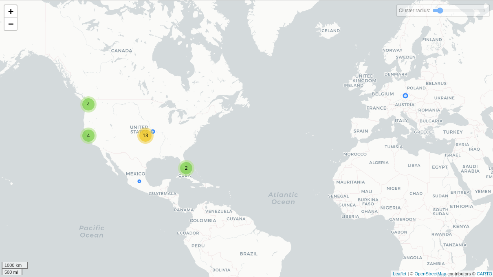

# Bumble

## Fechas de análisis

- **Análisis estático (mediante Exodus Privacy/MobFS):** 10 de febrero, 2025
- **Análisis dinámico (mediante análisis de tráfico de red):** 10 de febrero, 2025
- **Análisis Posteriores:**

## Archivos analizados

- [apk versión 25.0.1](https://cloud.datavoros.org/index.php/s/FCjYEaPqmeJgG9K)
- [pcap versión 1](https://cloud.datavoros.org/index.php/s/P5e3ErgmoaonyMf)
- [Capturas de pantalla](https://cloud.datavoros.org/index.php/s/iJ5dfSFFaDPsC49)
- [Reporte MobSF](https://cloud.datavoros.org/index.php/s/qjLoDcGHSZYrJ2Y)

## Descripción de la aplicación
- **Tipo:** Aplicación de citas    
- **Costo:** gratuito  
- **Enlace de descarga:** https://play.google.com/store/apps/details?id=com.bumble.app&hl=es_MX
- **Descargas:** *50M+*
- **Última fecha de actualización:** 07 de febrero, 2025
- **Versión:** 5.404.0
- **Desarrollador:** [Bumble LLC](https://bumble.com/)
- **Firma:** [Bumble LLC](https://bumble.com/)
- **Contacto:** android.support@bumble.com
- **Condiciones de uso y Política de privacidad:**
    - **Términos del servicio:** https://bumble.com/en/terms
    - **Política de privacidad:** https://bumble.com/privacy/
    
- **Descripción en PlayStore:**
~~~
Bumble es la dating app con millones de personas para tener ligar, chatear y citas, donde las mujeres siempre dan el primer paso. Pero, ¿en un mar de apps para conocer gente, sabes qué nos destaca? ✨ Nuestro enfoque inquebrantable en la amabilidad, el respeto y la igualdad, donde las personas de todas las orientaciones - heterosexuales, gays, lesbianas y más allá - no solo son bienvenidos, sino celebrados.
¡Haz match con la persona ideal, ten citas o haz amigos!
Bumble es una aplicación de citas gratis, para personas solteras que desean ligar o hacer nuevos amigos; es el lugar perfecto para chatear y conocer gente nueva, al instante.
~~~

## Rastreadores identificados (mediante Exodus Privacy)

|Rastreador|Tipo|
|---|---| 
|[AppsFlyer](http://appsflyer.com/)|Analítica|
|[Facebook Analytics](https://developers.facebook.com/docs/android)|Analítica|
|[Facebook Login](https://developers.facebook.com/docs/android)|Identificación|
|[Facebook Share](https://developers.facebook.com/docs/android)||
|[Google AdMob](https://admob.google.com/)|Anuncios|
|[Google Firebase Analytics](https://firebase.google.com/)|Analítica|
|[Sentry](https://sentry.io/)|Informe de fallas|

[Enlace al reporte de Exodus Privacy](https://reports.exodus-privacy.eu.org/en/reports/com.bumble.app/latest/#trackers)   

## Empresas relacionadas con esta aplicación:

|Empresa|Servicios que ofrecen|
|---|---| 
|[Amazon Web Services (AWS)](https://aws.amazon.com/es/)|Infraestructura en la nube, almacenamiento, servidores y cómputo escalable|
|[Greysom Limited](https://www.greysom.com/)|Servicios de telecomunicaciones y hosting en la nube|
|[Google Cloud Platform](https://cloud.google.com/)|Infraestructura en la nube, almacenamiento, servidores y análisis de datos|
|[Fastly](https://www.fastly.com/)|CDN, seguridad web y optimización de entrega de contenido|
|[Facebook (Meta)](https://about.meta.com/)|Publicidad, autenticación de usuarios y servicios de marketing|

### Empresas identificadas a través del Aviso de Privacidad con que se comparten datos:

- [Facebook (Meta)](https://about.meta.com/)
- [Google](https://about.google/intl/es/)
- [Kantar](https://www.kantar.com/)
- [Khoros](https://khoros.com/)
- [Spotify](https://www.spotify.com/)
- [Twilio](https://www.twilio.com/)
- [Typeform](https://www.typeform.com/)

### Dominios integrados al código de la aplicación que no pertenecen directamente a los rastreadores

|Dominios|
|---|
|https://docs.sentry.io/|
|https://listener-wa.logz.io/|
|https://c.paypal.com/|
|https://checkoutshopper-live.adyen.com/|
|https://fclcdn.com/|
|https://success-m.badoo.com/|
|https://api.paypal.com/|
|https://magic.veriff.me/|
|https://checkout.paypal.com/|
|https://giphy-analytics.giphy.com/|
|https://handshake.probity.io/|
|https://ktor.io/|
|https://bumbcdn.com/|
|https://www.example.com/|
|https://goo.gle/|
|https://api.sandbox.paypal.com/|
|https://youtrack.jetbrains.com/|
|https://instagram.com/|
|https://api.sandbox.braintreegateway.com/|
|https://o1118521.ingest.us.sentry.io/|
|https://browser-info-collector.dlocal.com/|
|https://www.paypalobjects.com/|

## Permisos   

- **Según Exodus Privacy/MobFS:** 57
- **Según prueba de uso:** 9

### Permisos según Exodus Privacy

- ACCESS_ADSERVICES_AD_ID
- ACCESS_ADSERVICES_ATTRIBUTION
- ACCESS_ADSERVICES_TOPICS
- :exclamation: ACCESS_COARSE_LOCATION
- :exclamation: ACCESS_FINE_LOCATION
- ACCESS_NETWORK_STATE
- ACCESS_WIFI_STATE
- BLUETOOTH
- :exclamation: BLUETOOTH_CONNECT
- :exclamation: CAMERA
- CHANGE_NETWORK_STATE
- CHANGE_WIFI_STATE
- DISABLE_KEYGUARD
- FOREGROUND_SERVICE
- FOREGROUND_SERVICE_CAMERA
- FOREGROUND_SERVICE_DATA_SYNC
- FOREGROUND_SERVICE_MICROPHONE
- :exclamation: GET_ACCOUNTS
- INTERNET
- MODIFY_AUDIO_SETTINGS
- NFC
- POST_NOTIFICATIONS
- READ_APP_BADGE
- READ_BASIC_PHONE_STATE
- :exclamation: READ_EXTERNAL_STORAGE
- READ_MEDIA_IMAGES
- READ_MEDIA_VIDEO
- READ_MEDIA_VISUAL_USER_SELECTED
- :exclamation: READ_PHONE_NUMBERS
- :exclamation: READ_PHONE_STATE
- RECORD_AUDIO
- USE_BIOMETRIC
- USE_FINGERPRINT
- USE_FULL_SCREEN_INTENT
- VIBRATE
- WAKE_LOCK
- :exclamation: WRITE_EXTERNAL_STORAGE
- UPDATE_COUNT
- BILLING
- SignaturePrivileged
- DYNAMIC_RECEIVER_NOT_EXPORTED_PERMISSION
- RECEIVE
- BIND_GET_INSTALL_REFERRER_SERVICE
- AD_ID
- READ_GSERVICES
- READ_SETTINGS
- UPDATE_SHORTCUT
- CHANGE_BADGE
- READ_SETTINGS
- :exclamation: WRITE_SETTINGS
- READ_SETTINGS
- :exclamation: WRITE_SETTINGS
- UPDATE_BADGE
- READ
- WRITE
- BROADCAST_BADGE
- PROVIDER_INSERT_BADGE

El icono :exclamation: indica un nivel 'Peligroso' o 'Especial' de acuerdo a los [niveles de protección de Google](https://developer.android.com/guide/topics/permissions/overview).

### Permisos solicitados durante el uso de la aplicación

- :red_circle: Ubicación
- :blue_circle: Contactos
- :blue_circle: Teléfono
- :blue_circle: Cámara
- :blue_circle: Galería
- :blue_circle: Microfono
- :blue_circle: Almacenamiento
- :blue_circle: Notificaciones

:red_circle: Este ícono indica un permiso obligatorio   
:blue_circle: Este ícono indica un permiso opcional pero se pierde una funcionalidad particular

## Datos

### Datos solicitados al usuario 

#### Datos solicitados durante el registro

- :red_circle: Correo electrónico
- :blue_circle: Nombre
- :red_circle: Edad
- :red_circle: Género
- :red_circle: ¿Qué buscas en Bumble?
- :red_circle: ¿ A quien te gustaría conocert (hombres/mujeres)
- :red_circle: ¿Qué tipo de relacion busca?
- :blue_circle: Altura
- :blue_circle: Intereses/hobbies
- :blue_circle: ¿Qué cualidades busco?
- :blue_circle: Estilo de vida
- :blue_circle: Planes familiares
- :blue_circle: Religión
- :blue_circle: Causas y comunidades
- :blue_circle: Preguntas a otros
- :blue_circle: Fotos

#### Datos solicitados durante el uso de la aplicación

- :blue_circle: Trabajo
- :blue_circle: Educación
- :blue_circle: Ubicación
- :blue_circle: Ciudad natal
- :blue_circle: Actividad fisica
- :blue_circle: Nivel educativo
- :blue_circle: Bebida
- :blue_circle: Tabaco
- :blue_circle: Signo sodiacal
- :blue_circle: Política
- :blue_circle: Ingles
- :blue_circle: Biografia 

:red_circle: Este ícono indica que se debe ingresar este dato de manera obligatoria.   
:blue_circle: Este ícono indica que estos datos son opcionales.

### Tabla de conexiones realizadas durante el uso de la aplicación

|Dirección IP|Número de paquetes|País|Ciudad/Zona|Organización|
|---|---|---|---|---|
|3.161.41.150|92|United States||AMAZON-02|
|3.161.57.55|23|United States||AMAZON-02|
|3.161.57.191|27|United States||AMAZON-02|
|10.1.10.1|56026|||||
|18.160.114.203|46|United States|Seattle|AMAZON-02|
|18.160.123.89|17|United States|Seattle|AMAZON-02|
|18.160.123.130|23|United States|Seattle|AMAZON-02|
|18.160.124.60|144|United States|Seattle|AMAZON-02|
|31.222.67.113|2417|Czechia|Prague|Greysom Limited|
|31.222.75.64|42|United States|Miami|Greysom Limited|
|31.222.75.198|8432|United States|Miami|Greysom Limited|
|34.120.195.249|527|United States|Kansas City|GOOGLE-CLOUD-PLATFORM|
|65.9.121.123|211|United States||AMAZON-02|
|65.9.124.79|91|United States||AMAZON-02|
|65.9.124.180|29|United States||AMAZON-02|
|65.9.156.63|48|United States||AMAZON-02|
|65.9.156.146|31|United States||AMAZON-02|
|65.9.156.147|64|United States||AMAZON-02|
|65.9.156.162|62|United States||AMAZON-02|
|151.101.1.91|7661|United States|San Francisco|FASTLY|
|151.101.65.91|6902|United States|San Francisco|FASTLY|
|151.101.129.91|16751|United States|San Francisco|FASTLY|
|151.101.193.91|12216|United States|San Francisco|FASTLY|
|157.240.25.1|100|Mexico|Querétaro City|FACEBOOK|
|192.178.56.106|26|United States||GOOGLE|
|192.178.56.202|25|United States||GOOGLE|
|192.178.56.234|19|United States||GOOGLE|

### Mapa de conexiones realizadas durante el uso de la aplicación

### Datos recopilados y uso según la Play Store

Google PlayStore declara los siguientes datos recopilados por Bumble:

Datos|Uso|
|---|---|
|Datos|Uso|
|---|---|
|Nombre|Funciones de la app, Comunicaciones del desarrollador, Publicidad o marketing y Seguridad, cumplimiento y prevención de fraudes|
|Dirección de correo electrónico · Opcional|Funciones de la app, Comunicaciones del desarrollador, Publicidad o marketing, Seguridad, cumplimiento y prevención de fraudes y Administración de la cuenta|
|IDs de usuario|Funciones de la app, Estadísticas, Publicidad o marketing, Seguridad, cumplimiento y prevención de fraudes y Administración de la cuenta|
|Número de teléfono|Funciones de la app, Publicidad o marketing y Seguridad, cumplimiento y prevención de fraudes|
|Raza y etnia · Opcional|Funciones de la app y Personalización|
|Creencias políticas o religiosas · Opcional|Funciones de la app y Personalización|
|Orientación sexual|Funciones de la app y Personalización|
|Otra información|Funciones de la app, Publicidad o marketing, Seguridad, cumplimiento y prevención de fraudes, Personalización y Administración de la cuenta|
|Interacciones en la app|Estadísticas, Publicidad o marketing y Seguridad, cumplimiento y prevención de fraudes|
|Historial de búsqueda en la app|Funciones de la app y Personalización|
|Apps instaladas|Funciones de la app y Administración de la cuenta|
|Otro contenido generado por usuarios|Funciones de la app y Personalización|
|Otras acciones|Funciones de la app y Estadísticas|
|Información de pago del usuario|Funciones de la app, Publicidad o marketing y Seguridad, cumplimiento y prevención de fraudes|
|Historial de compras|Funciones de la app, Publicidad o marketing y Seguridad, cumplimiento y prevención de fraudes|
|Registros de fallas|Estadísticas|
|Contactos · Opcional|Funciones de la app, Diagnóstico|
|Ubicación aproximada|Publicidad o marketing|
|Ubicación precisa|Funciones de la app, Seguridad, cumplimiento y prevención de fraudes y Personalización, Estadísticas|
|Grabaciones de voz o sonido · Opcional|Funciones de la app|
|Dispositivo u otros IDs|Funciones de la app, Estadísticas, Publicidad o marketing, Seguridad, cumplimiento y prevención de fraudes y Administración de la cuenta|
|Otros datos de rendimiento de la app|Funciones de la app, Estadísticas, Publicidad o marketing, Seguridad, cumplimiento y prevención de fraudes y Administración de la cuenta|
|Correos electrónicos|Funciones de la app, Comunicaciones del desarrollador, Publicidad o marketing, Seguridad, cumplimiento y prevención de fraudes y Administración de la cuenta|
|Otros mensajes desde la app|Funciones de la app, Publicidad o marketing y Seguridad, cumplimiento y prevención de fraudes, Estadísticas|
|Fotos|Funciones de la app y Seguridad, cumplimiento y prevención de fraudes|
|Videos · Opcional|Funciones de la app|

### Datos compartidos y uso según la Play Store

Google PlayStore declara los siguientes datos compartidos por Bumble:

|Datos|Uso|
|---|---|
|Nombre|Seguridad, cumplimiento y prevención de fraudes y Administración de la cuenta|
|Dirección de correo electrónico|Publicidad o marketing y Seguridad, cumplimiento y prevención de fraudes|
|IDs de usuario|Publicidad o marketing y Seguridad, cumplimiento y prevención de fraudes|
|Número de teléfono|Administración de la cuenta|
|Otra información|Publicidad o marketing|
|Interacciones en la app|Publicidad o marketing|
|Registros de fallas|Estadísticas|
|Ubicación aproximada|Funciones de la app, Estadísticas y Personalización|
|Dispositivo u otros IDs|Publicidad o marketing|
|Otros mensajes desde la app|Seguridad, cumplimiento y prevención de fraudes|

### Prácticas de seguridad

- Los datos están cifrados en tránsito
- Puedes solicitar que se borren los datos

### Datos recopilados y uso según la Política de privacidad

|Datos|
|---|
|**Información de registro:** nombre, nombre de usuario, dirección de correo electrónico, número móvil, identidad de género, fecha, hora y lugar de nacimiento, preferencia sexual, fotografías, ubicación, inicio de sesión en redes sociales conectadas.|
|**Datos de perfil:** detalles adicionales que el usuario elige compartir en su perfil, incluyendo intereses, orientación sexual, ubicación aproximada y otras preferencias personales.|
|**Verificación de perfil (incluyendo datos biométricos):** número de teléfono, verificación de foto con tecnología de reconocimiento facial, almacenamiento de escaneos por hasta tres años.|
|**Información de compras:** datos de pago, prevención de fraudes, auditoría e impuestos.|
|**Información de geolocalización:** datos de puntos de acceso WiFi, longitud y latitud del dispositivo, utilizados para mejorar la experiencia de usuario y mostrar perfiles cercanos.|
|**Datos del dispositivo:** identificador de dispositivo, modelo, sistema operativo, acceso a la libreta de direcciones si es permitido por el usuario.|
|**Datos de fotos:** análisis del tiempo de visualización de fotos, iluminación, reordenamiento de fotos de perfil basado en interacción.|
|**Interacciones con enlaces:** seguimiento de clics en enlaces dentro de la aplicación, estadísticas agregadas de interacciones.|
|**Cuentas de éxito y encuestas:** testimonios, campañas de marketing opcionales, participación en encuestas de investigación.|
|**Soporte al cliente:** dirección de correo electrónico, dirección IP, historial de comunicación con el soporte, registros de quejas mantenidos por seis años tras la eliminación de la cuenta.|
|**Cookies y tecnologías similares:** recopilación automática de datos personales a través de cookies, seguimiento de actividad en la aplicación y el sitio web.|

### Uso general de la información según la Política de privacidad

- Para ofrecerle nuestros servicios y características, incluyendo:
    - Crear y mantener la cuenta y el perfil en la aplicación.
    - Personalizar la aplicación y el contenido que se entrega a los usuarios.
    - Facilitar las oportunidades de networking dentro de la aplicación.
    - Recomendar perfiles basados en compatibilidad y preferencias.

- Para contactar con información sobre la aplicación, incluyendo:
    - Notificaciones sobre actualizaciones y nuevas funciones.
    - Comunicaciones sobre cambios en los términos de servicio y políticas de privacidad.

- Para mejorar y optimizar la aplicación mediante:
    - Investigación y análisis sobre el uso e interacción con la aplicación.
    - Pruebas de nuevas tecnologías y procesos para mejorar la experiencia del usuario.
    - Recopilación de métricas sobre el comportamiento en la aplicación para la optimización del servicio.

- Para resolver disputas, investigar fraude y hacer cumplir términos, incluyendo:
    - Prevención y detección de fraudes y otras actividades maliciosas.
    - Bloqueo de transacciones de pago sospechosas como parte de procedimientos antifraude.
    - Investigación de cuentas sospechosas y aplicación de restricciones o bloqueos si se detecta incumplimiento de términos.

- Para enviar información sobre promociones y ofertas, incluyendo:
    - Envío de comunicaciones de marketing directo si el usuario ha dado su consentimiento.
    - Personalización de anuncios y promociones dentro y fuera de la aplicación.
    - Inclusión en audiencias segmentadas para recibir contenido relevante en plataformas de terceros.

- Para garantizar la seguridad de los usuarios y la integridad de la plataforma mediante:
    - Moderación de contenido en perfiles y mensajes utilizando sistemas automatizados y moderadores humanos.
    - Verificación de identidad a través de número de teléfono y en algunos casos, verificación con foto.
    - Implementación de medidas de seguridad para la protección de datos y la prevención de accesos no autorizados.

- Para mejorar la experiencia en la aplicación mediante:
    - Algoritmos de coincidencia que predicen compatibilidad entre usuarios basados en su perfil e interacciones.
    - Análisis de comportamiento en la aplicación para mejorar la relevancia de recomendaciones.
    - Procesamiento de datos de ubicación para conectar usuarios con perfiles cercanos.

- Para llevar a cabo investigación y análisis, incluyendo:
    - Pruebas de nuevas funciones y optimización de la interfaz de usuario.
    - Análisis del impacto de eventos y promociones dentro de la plataforma.
    - Estudio del comportamiento de usuarios para la mejora del servicio.

- Para procesar pagos de servicios premium y garantizar la seguridad financiera mediante:
    - Gestión de transacciones y validación de métodos de pago.
    - Prevención de fraudes financieros y disputas de transacciones.
    - Aplicación de medidas de seguridad en compras dentro de la aplicación.

- Para habilitar funciones de comunicación y multimedia en la aplicación mediante:
    - Implementación de llamadas de voz y video entre usuarios.
    - Envío y recepción de imágenes y videos dentro de los chats.
    - Optimización del uso de fotos en los perfiles para mejorar la experiencia del usuario.

- Para defender derechos legales y proteger a los usuarios mediante:
    - Respuesta a solicitudes legales y cooperación con autoridades.
    - Preservación de datos relevantes para disputas legales o requerimientos judiciales.
    - Implementación de medidas para evitar que usuarios bloqueados creen nuevas cuentas.

- Para mejorar la experiencia de estudiantes en la aplicación mediante:
    - Análisis de datos de ubicación para identificar usuarios en entornos universitarios.
    - Optimización de eventos y promociones dirigidas a la comunidad estudiantil.
    - Personalización de la experiencia en la aplicación basada en hábitos de uso de estudiantes.

#### Información compartida con terceros

|Receptores|Motivo|
|---|---|
|Proveedores de servicios|Operación, mejora y promoción de la plataforma (alojamiento, soporte, seguridad, marketing, procesamiento de pagos).|
|Moderadores|Supervisión de la actividad en la app y aprobación de contenidos.|
|Empresas de procesamiento de pagos y telecomunicaciones|Facilitación del pago de servicios premium.|
|Autoridades legales|Cumplimiento de requerimientos legales, prevención de delitos y protección de la seguridad.|
|Proveedores de servicios de marketing|Publicidad en páginas web y aplicaciones de terceros, medición de la eficacia de campañas publicitarias.|
|Sistemas antispam y antifraude|Prevención de fraudes y bloqueo de cuentas sospechosas.|
|Transferencia de empresas|Transferencia de datos en caso de fusión, adquisición o reestructuración empresarial.|
|Proveedores de redes sociales|Permitir la creación/conexión de cuentas con plataformas como Facebook, Instagram o Spotify.|
|Plataformas de encuestas y agencias de investigación|Realización de estudios de mercado y mejora de productos y servicios.|
|Facebook|Compartición de datos para marketing y segmentación de audiencias.|

## Notas

### Política de privacidad, recolección

- Bumble detalla en su política de privacidad qué información recopila, justificando su recolección en materia de funcionalidad, seguridad y marketing.  
- La aplicación solicita datos sensibles como la verificación biométrica, los cuales pueden ser utilizados para personalización y seguridad.  
- Se indica que los datos de verificación facial pueden ser almacenados por hasta 3 años.  

### Uso y compartición de datos

- Bumble menciona algunas de las empresas (**terceros**) con los que comparte datos, mencionando nombres específicos como Facebook, Google, Twilio, Spotify y Kantar, pero no detalla completamente las condiciones exactas de la transferencia de datos.  
- Se menciona que ciertos datos pueden ser utilizados para publicidad personalizada y segmentación de audiencia, incluyendo el uso de identificadores de publicidad, ubicación estimada y datos de interacción en la aplicación.  
- El sistema de moderación revisa de forma automatizada y manual (humana), y los criterios de bloqueo de cuentas pueden involucrar algoritmos para detección de fraude y abuso.  
- No se especifica claramente el tiempo de retención de datos para usuarios que eliminan su cuenta voluntariamente.  
- Bumble usa sistemas antispam y antifraude, incluyendo el bloqueo de cuentas vinculadas a actividades sospechosas en otras apps del Bumble Group (Bumble Holding Limited, Badoo Trading Limited y Bumble Trading LLC).  

### Puntos finales
  
- Existen conexiones a Facebook e Instagram desde la aplicación, incluso sin que el usuario inicie sesión con esas plataformas.  

## Conclusiones

### **Congruencia entre la Política de Privacidad y Google Play Store**
Bumble mantiene una congruencia clara entre lo declarado en su política de privacidad y la información proporcionada en Google Play Store. A diferencia de otras aplicaciones de citas, no se detectan contradicciones en la forma en que declara la recopilación, uso y compartición de datos. 

Tanto en Play Store como en la política de privacidad, Bumble es **explícito** en que recopila datos de ubicación, datos biométricos, preferencias personales, información de dispositivos y datos de interacciones dentro de la app. Además, menciona el uso de estos datos para mejorar la seguridad, personalizar la experiencia y para publicidad y marketing.

### Número de Permisos Solicitados
En el reporte de Exodus, Bumble solicita 57 permisos (misma cifra ue el analisis de mobsf). Entre estos, algunos tienen un nivel peligroso o especial según la clasificación de Android, incluyendo:
- Ubicación precisa
- Acceso a la cámara
- Acceso al micrófono
- Lectura de contactos
- Acceso a almacenamiento externo

Bumble menciona que almacena información sobre la ubicación exacta de los usuarios.
Bumble también hace uso de ubicaciones aproximadas de usuaries medidas en kilómetros/millas, siendo este modelo de ubicación aproximada, el que utiliza Bumble para su algoritmo de emparejamiento,y aunque el permiso a la ubicación en Bumble es **vital** para el uso eficaz de la aplicación, las ubicaciones que presenta Bumble a otros usuarios, carecen de exactitud en metros, omitiendo la revelación de ubicación exacta entre usuarios, siendo una **mejor práctica de seguridad** para los usuarios de la aplicación en comparación con otras apps similares.

### Retención y Uso de Datos
Bumble detalla en su política de privacidad que la información recopilada se usa para:
- Verificación de identidad
- personalización del contenido mostrado a los usuarios
- Publicidad y marketing
- Prevención de fraudes y seguridad

Uno de los puntos que podría mejorarse es la claridad en los **períodos exactos de retención de datos**, ya que no se especifica cuánto tiempo se guardan algunos tipos de información.

### Compartición de Datos con Terceros
Bumble es explícito y claro sobre los terceros con los que comparte datos, si bien esta información es clara, no se especifican detalles sobre el tiempo que estos terceros almacenan la información de los usuarios.

En general, Bumble es congruente con lo declarado en su política de privacidad y en Google Play Store. No hay contradicciones notables en la recopilación, uso y compartición de datos. Sin embargo, el uso de ubicación precisa y la retención de datos biométricos hasta por tres años podría representar un riesgo si no se es mas explicito y amigable con las opciones de control para los usuarios.
Aunque Bumble es transparente sobre los terceros con los que comparte información, sería recomendable que detallara los períodos exactos de retención de datos para mayor claridad en su política de privacidad. 
En términos de permisos, 57 es una cifra alta en comparación con otras aplicaciones de citas, aunque la mayoría de estos están justificados dentro del funcionamiento de la app.
