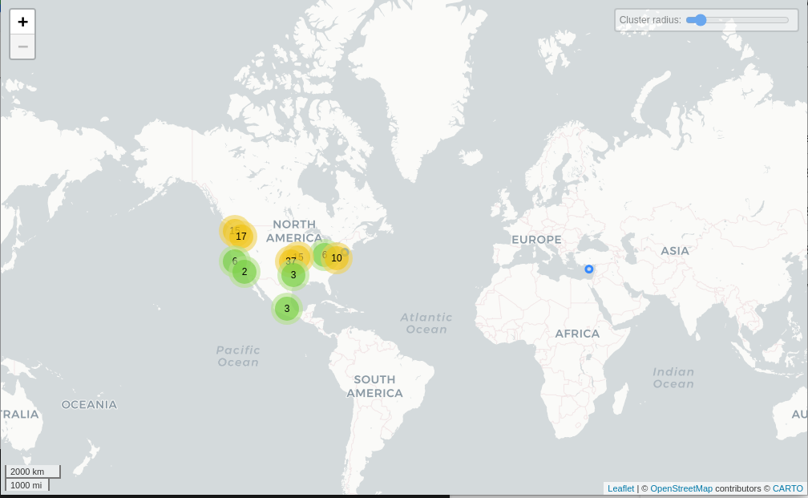

# Grindr

## Fechas de análisis

- **Análisis estático (mediante Exodus Privacy/MobFS):** 4 de febrero, 2025
- **Análisis dinámico (mediante análisis de tráfico de red):** 5 de febrero, 2025
- **Análisis Posteriores:**

## Archivos analizados

- [apk versión 25.0.1](https://cloud.datavoros.org/index.php/s/L9rtKsnzi8EoLQa)
- [pcap versión 1](https://cloud.datavoros.org/index.php/s/eQmCKrpPpQoL2XB)
- [Capturas de pantalla](https://cloud.datavoros.org/index.php/s/aRSG2PbAbs4eo4T)
- [Reporte MobSF](https://cloud.datavoros.org/index.php/s/2EXnCPYMsHxfgfp)

## Descripción de la aplicación
- **Tipo:** Aplicación de citas gay   
- **Costo:** gratuito  
- **Enlace de descarga:** https://play.google.com/store/apps/details?id=com.grindrapp.android&hl=es_MX&pli=1
- **Descargas:** *50M+*
- **Ultima fecha de actualización:** 03 de febrero, 2025
- **Versión:** 25.0.1
- **Desarrollador:** [Grindr LLC](https://www.grindr.com/)
- **Firma:** [Grindr LLC](https://www.grindr.com/)
- **Contacto:** help-android@grindr.com
- **Condiciones de uso y Política de privacidad:**
    - **Términos del servicio:** www.grindr.com/terms-of-service/
    - **Política de privacidad:** www.grindr.com/privacy-policy/
    
- **Descripción en PlayStore:**
~~~
Grindr es la aplicación de citas gratuita al servicio de la comunidad LGBTQ líder en el mundo. Si eres gay, bisexual, transexual, queer o simplemente tienes curiosidad, Grindr es la mejor forma y la más fácil de conocer personas nuevas para tener amistades, encuentros, citas o lo que sea que estés buscando.
¿Estás de viaje? Grindr es una herramienta indispensable para los viajeros LGBTQ: inicia sesión para conocer personas locales y obtener recomendaciones de bares, restaurantes, eventos y mucho más. Con Grindr en tu teléfono móvil, siempre estarás conectado con otras personas LGBTQ a tu alrededor y estarás al tanto de lo que está sucediendo.
~~~

## Rastreadores identificados (mediante Exodus Privacy)

|Rastreador|Tipo|
|---|---| 
|[Amazon Advertisement](https://developer.amazon.com/public/apis/earn/mobile-ads/docs/quick-start)|Anuncios|
|[AMplitude](http://www.amplitude.com/)|Perfilamiento, analítica|
|[AppLovin (MAX and SparkLabs)](https://www.applovin.com/)|Anuncios, identificación, perfilamiento, analítica|
|[AppsFlyer](http://appsflyer.com/)|Analítica|
|[Braze(formerly Appboy)](https://www.braze.com/)|UBicación, anuncios, analítica|
|[Facebook Ads](https://developers.facebook.com/docs/android)|Anuncios|
|[Facebook Analytics](https://developers.facebook.com/docs/android)|Analítica|
|[Facebook Login](https://developers.facebook.com/docs/android)|Identificación|
|[Facebook Share](https://developers.facebook.com/docs/android)||
|[Fyber](https://www.fyber.com/)|Auncios|
|[Google AdMob](https://admob.google.com/)|Anuncios|
|[Google CrashLytics](http://crashlytics.com/)|Informe de fallas|
|[Google Firebase Analytics](https://firebase.google.com/)|Analítica|
|[IAB Open Measurement](https://iabtechlab.com/)|Anuncios, identificación|
|[Inmobi](http://inmobi.com/)|Anuncios|
|[ironSource](https://www.ironsrc.com/)|Analítica|
|[Mintegral](https://www.mintegral.com/en/)|Anuncios, analítica|
|[PubNative](https://pubnative.net/)|Anuncios|
|[Unity3d Ads](https://unity3d.com/)|ANuncios|

[Enlace al reporte de Exodus Privacy](https://reports.exodus-privacy.eu.org/es/reports/com.grindrapp.android/latest/#trackers)   

## Empresas relacionadas con esta aplicación:

|EMpresa|Servicios que ofrecen|
|---|---| 
|[Akamai International B.V](https://www.akamai.com/es)| CDN, seguridad web, mitigación de DDoS|
|[Alibaba US Technology CO., Ltd.](https://www.alibabacloud.com/es?_p_lc=17&utm_key=se_1012411086&utm_content=se_1012411086&gad_source=1&gclid=Cj0KCQiA-5a9BhCBARIsACwMkJ5QEdarDZv_ICTKu1D2-du4KLHEKy6xEh2qht6xbWlEpd0JnQPNV7saAq6ZEALw_wcB)| Cloud computing, almacenamiento de datos|
|[Amazon](https://aws.amazon.com/es/free/?gclid=Cj0KCQiA-5a9BhCBARIsACwMkJ7LX3a8XRBWfQJiFXzBkcNEpBbrAPP2QTajuFn9f_2UGPwtBMvd3MgaAqAUEALw_wcB&trk=307cde03-1180-48b3-a852-0fd87ed68ac8&sc_channel=ps&ef_id=Cj0KCQiA-5a9BhCBARIsACwMkJ7LX3a8XRBWfQJiFXzBkcNEpBbrAPP2QTajuFn9f_2UGPwtBMvd3MgaAqAUEALw_wcB:G:s&s_kwcid=AL!4422!3!646924982332!e!!g!!amazon%20aws!19636893789!147195440353)| Publicidad, servicios en la nube (AWS)|
|[Cloudflare](https://www.cloudflare.com/es-es/lp/ppc/overview-x/?utm_source=google&utm_medium=cpc&utm_campaign=ao-fy-acq-latam_spa_casa-umbrella-ge-ge-prospecting-sch_g_brand_alpha&utm_content=Alpha_Brand_Umbrella_Core&utm_term=cloudflare&campaignid=71700000112174150&adgroupid=58700008470909005&creativeid=666168093577&&_bt=666168093577&_bk=cloudflare&_bm=p&_bn=g&_bg=150333947985&_placement=&_target=&_loc=9136619&_dv=c&awsearchcpc=1&gad_source=1&gclid=Cj0KCQiA-5a9BhCBARIsACwMkJ6TaWlTrDMwyjcF0urw9hXewqXL5-Z2BQU8EVzyVIHklrEqXW3bPDQaAjbYEALw_wcB&gclsrc=aw.ds)| CDN, seguridad web, protección DDoS|
|[Datacamp Limited](https://www.datacamp.co.uk/)| Provisión de red, hosting|
|[Digital Ocean](https://www.digitalocean.com/)| Infraestructura en la nube, hosting VPS|
|[Facebook (Meta)](https://business.facebook.com/business/loginpage/?next=https%3A%2F%2Fbusiness.facebook.com%2F%3Fnav_ref%3Dbiz_unified_f3_login_page_to_mbs&login_options%5B0%5D=FB&login_options%5B1%5D=IG&login_options%5B2%5D=SSO&config_ref=biz_login_tool_flavor_mbs)| Publicidad, integración de APIs sociales|
|[Fastly](https://www.fastly.com/es/)| CDN, aceleración de contenido|
|[Google](https://support.google.com/analytics/answer/10607798?hl=en#zippy=%2Cin-this-article)| Publicidad (Ads), analíticas (Google Analytics)|
|[Google Cloud Platform](https://cloud.google.com/?utm_source=google&utm_medium=cpc&utm_campaign=latam-MX-all-es-dr-BKWS-all-all-trial-e-dr-1710136-LUAC0010195&utm_content=text-ad-none-any-DEV_c-CRE_512379899402-ADGP_Hybrid+%7C+BKWS+-+EXA+%7C+Txt_GCP-General-KWID_43700081372025797-kwd-301173107504&utm_term=KW_google%20cloud%20platform-ST_Google+Cloud+Platform&gad_source=1&gclid=Cj0KCQiA-5a9BhCBARIsACwMkJ5DX5rIsA0zpRpx7n6ukmZSuOoXQaAnYN0dm0yTQd-yZA91F0g5bSsaAoK0EALw_wcB&gclsrc=aw.ds)| Servicios en la nube, Big Data, ML|
|[Microsoft Corp](https://azure.microsoft.com/es-mx/pricing/purchase-options/azure-account/search?icid=free-search&ef_id=_k_Cj0KCQiA-5a9BhCBARIsACwMkJ5yWQi9jk5GbSute1k4U882A0MG_kPRZAew6q40EcEoa56y9GNqT-IaAsBCEALw_wcB_k_&OCID=AIDcmmxotgtm93_SEM__k_Cj0KCQiA-5a9BhCBARIsACwMkJ5yWQi9jk5GbSute1k4U882A0MG_kPRZAew6q40EcEoa56y9GNqT-IaAsBCEALw_wcB_k_&gad_source=1&gclid=Cj0KCQiA-5a9BhCBARIsACwMkJ5yWQi9jk5GbSute1k4U882A0MG_kPRZAew6q40EcEoa56y9GNqT-IaAsBCEALw_wcB)| Servicios en la nube (Azure), integración de datos|

### Empresas identificadas a través del Aviso de Privacidad con que se comparten datos:

- [ActiveFence](https://activefence.com/privacy-policy)
- [Agora](https://www.agora.io/en/privacy-policy/)
- [Amazon Web Services](https://aws.amazon.com/privacy/)
- [Amplitude](https://amplitude.com/privacy)
- [AppLovin](https://www.applovin.com/privacy/)
- [AppsFlyer](https://www.appsflyer.com/privacy-policy/)
- [Braze](https://www.braze.com/privacy)
- [Bucksense](https://www.bucksense.com/privacy-policy/)
- [Cloudflare](https://www.cloudflare.com/privacypolicy/)
- [Criteo](https://www.criteo.com/privacy/)
- [Databricks](https://databricks.com/privacy-policy)
- [Digital Turbine](https://www.digitalturbine.com/privacy-policy/)
- [DoubleVerify](https://www.doubleverify.com/privacy/)
- [Firebase Crashlytics](https://firebase.google.com/support/privacy)
- [Google Ad Manager](https://privacy.google.com/businesses/adsservices/)
- [Google AdMob](https://admob.google.com/home/privacy)
- [Google Analytics](https://policies.google.com/privacy)
- [InMobi](https://www.inmobi.com/privacy-policy/)
- [Kodex](https://www.kodex.com/privacy-policy)
- [Liftoff (Vungle)](https://liftoff.io/privacy-policy/)
- [Looker](https://looker.com/privacy)
- [Mapbox](https://www.mapbox.com/legal/privacy)
- [Meta](https://www.facebook.com/policy.php)
- [Mintegral](https://www.mintegral.com/en/privacy)
- [Musubi](https://musubi.io/privacy-policy)
- [Nimbus](https://nimbus.com/privacy-policy)
- [PartnerHero](https://partnerhero.com/privacy-policy)
- [Portkey](https://portkey.com/privacy-policy)
- [Pubmatic](https://pubmatic.com/privacy-policy/)
- [Rubrik](https://www.rubrik.com/en/legal/privacy-policy)
- [Sentry](https://sentry.io/privacy/)
- [Sift](https://sift.com/service-privacy)
- [Snowflake](https://www.snowflake.com/privacy-policy/)
- [StatSig](https://www.statsig.com/privacy)
- [Stripe](https://stripe.com/privacy)
- [SurveyMonkey](https://www.surveymonkey.com/mp/legal/privacy-policy/)
- [Terminal](https://terminal.io/privacy-policy)
- [Tribe](https://tribe.so/privacy-policy)
- [Twilio](https://www.twilio.com/legal/privacy)
- [UserTesting](https://www.usertesting.com/privacy-policy)
- [UserVoice](https://www.uservoice.com/privacy/)
- [Verve Group](https://verve.com/privacy-policy/)
- [ZenDesk](https://www.zendesk.com/company/customers-partners/privacy-policy/)

### Dominios integrados al código de la aplicación que no pertecen directamente a los rastreadores

|Dominios|
|---|
|https://sapp.s/|
|https://twitter.com/|
|https://global.ketchcdn.com/|
|https://www.zendesk.com/|
|https://a.applvn.com/|
|https://www.linkedin.com/|
|https://events.ads.vungle.com/|
|https://dummyimage.com/|
|https://scdn-ssettings.s/|
|https://cdns.grindr.com/|
|https://adx.ads.vungle.com/|
|https://www.w3.org/|
|https://tools.android.com/|
|https://rt.applvn.com/|
|https://spotify.com/|
|https://www.serveroute.com/|
|https://together.takemehome.org/|
|https://sattr.s/|
|https://api.spotify.com/|
|https://cdn2.inner-active.mobi/|
|https://via.placeholder.com/|
|https://developer.apple.com/|
|https://cdn.cookielaw.org/|
|https://supply.inmobicdn.net/|
|https://github.com/|
|https://developer.android.com/|
|https://slaunches.s/|
|https://captcha-prod.grindr.com/|
|https://d.applvn.com/|
|https://sgcdsdk.s/|
|https://spotify.com/|
|https://sars.s/|
|https://sviap.s/|
|https://grindr.zendesk.com/|
|https://verve.com/|
|https://web.grindr.com/|
|https://api.giphy.com/|
|https://grindr.mobi/|
|https://api3.siftscience.com/|
|https://feedback.verve.com/|
|https://privacy.vungle.com/|
|https://grindr.atlassian.net/|
|https://whatwg.org/|
|https://scdn-stestsettings.s/|
|https://example.com/|
|https://viivhealthcare.com/|
|https://cookies2-ds.dev.otdev.org/|
|https://www.samsungapps.com/|
|https://geolocation.1trust.app/|
|https://ms.applvn.com/|
|https://svalidate-and-log.s/|
|https://www.instagram.com/|
|https://sinapps.s/|
|https://www.googletagmanager.com/|
|https://help.grindr.com/|
|https://ns.adobe.com/|
|https://ssdk-services.s/|
|https://www.surveymonkey.com/|
|https://xmlpull.org/|
|https://aomedia.org/|
|https://api.photoeditorsdk.com/|
|https://schemas.android.com/|
|https://www.grindr.com/|
|https://sconversions.s/|
|https://spadsync.com/|
|https://config.safedk.com/|
|https://mobile-data.onetrust.io/|
|https://xml.org/|
|https://mobile-data.onetrust.dev/|
|https://www.twitter.com/|
|https://datatracker.ietf.org/|
|https://gist.github.com/|
|https://telemetry.grindr.mobi/|
|https://www.youtube.com/|
|https://exoplayer.dev/|
|https://simpression.s/|
|https://sadrevenue.s/|
|https://schemas.microsoft.com/|
|https://googleads.g.doubleclick.net/|
|https://svalidate.s/|
|https://nsfw.grindr.com/|
|https://www.grindrbloop.com/|
|https://www.supersonicads.com/|
|https://accounts.spotify.com/|
|https://img.ly/|
|https://cdn.doubleverify.com/|
|https://compliance.iabtechnologylab.com/|
|https://grindr.uservoice.com/|
|https://outrightinternational.org/|
|https://dashboard.agora.io/|
|https://tools.ietf.org/|
|https://sonelink.s/|
|https://config.ads.vungle.com/|
|https://edge.safedk.com/|
|https://sdlsdk.s/|
|https://pubnative-assets.s3.amazonaws.com/|
|https://sregister.s/|
|https://www.photoeditorsdk.com/|
|https://ads.com/|
|https://tizen.org/|
|https://www.trevorspace.org/|

## Permisos   

- **Según Exodus Privacy/MobFS:** 35
- **Según prueba de uso:** 9

### Permisos según Exodus Privacy

- ACCESS_ADSERVICES_AD_ID
- ACCESS_ADSERVICES_ATTRIBUTION
- ACCESS_ADSERVICES_TOPICS
- :exclamation: ACCESS_COARSE_LOCATION
- :exclamation: ACCESS_FINE_LOCATION
- ACCESS_NETWORK_STATE
- ACCESS_WIFI_STATE
- AD_ID
- android
- BILLING
- BIND_APPHUB_SERVICE
- BIND_GET_INSTALL_REFERRER_SERVICE
- :exclamation: CAMERA
- CHANGE_NETWORK_STATE
- DYNAMIC_RECEIVER_NOT_EXPORTED_PERMISSION
- FOREGROUND_SERVICE
- GET_COMMON_DATA
- INTERNET
- KILL_BACKGROUND_PROCESSES
- MODIFY_AUDIO_SETTINGS
- POST_NOTIFICATIONS
- :exclamation: READ_EXTERNAL_STORAGE
- READ_MEDIA_AUDIO
- READ_MEDIA_IMAGES
- READ_MEDIA_VIDEO
- :exclamation: READ_PHONE_STATE
- :exclamation: RECORD_AUDIO
- RECEIVE
- SCHEDULE_EXACT_ALARM
- :exclamation: SYSTEM_ALERT_WINDOW
- USE_BIOMETRIC
- USE_FINGERPRINT
- VIBRATE
- WAKE_LOCK
- :exclamation: WRITE_EXTERNAL_STORAGE

El icono :exclamation: indica un nivel 'Peligroso' o 'Especial' de acuerdo a los [niveles de protección de Google](https://developer.android.com/guide/topics/permissions/overview).

### Permisos solicitados durante el uso de la aplicación

- :red_circle: Google drive
- :red_circle: Ubicación
- :blue_circle: Camara
- :blue_circle: Galeria
- :blue_circle: Microfono
- :blue_circle: Almacenamineto
- :blue_circle: Notificaciones

:red_circle: Este ícono indica un permiso obligatorio   
:blue_circle: Este ícono indica un permiso opcional pero se pierde una funcionalidad particular

## Datos

### Datos solicitados al usuario 

#### Datos solicitados durante el registro

- :red_circle: Correo electronico
- :blue_circle: Nombre
- :red_circle: Edad

#### Datos solicitados durante el uso de la aplicación

- :blue_circle: Descripción
- :blue_circle: Altura
- :blue_circle: Peso
- :blue_circle: Origen étnico
- :blue_circle: Complexión física
- :blue_circle: Rol
- :blue_circle: Tribes
- :blue_circle: Situación amorosa
- :blue_circle: Mis etiquetas
- :blue_circle: En busca de
- :blue_circle: Encuentro en
- :blue_circle: Aceptar fotos no apropiadas para el trabajo
- :blue_circle: Género
- :blue_circle: Pronombres
- :blue_circle: Estado de VIH
    - :blue_circle: Ultimo análisis
- :blue_circle: Redes sociales
    
    

:red_circle: Este ícono indica que se debe ingresar este dato de manera obligatoria.   
:blue_circle: Este ícono indica que estos datos son opcionales.

### Tabla de conexiones realizadas durante el uso de la aplicación

| Dirección IP      | Número de Paquetes | País         | Ciudad/Zona | Organización AS                 | Dominio |
|--------------------|-------------------|-------------|-------------|-----------------------------------|---------|
| 3.15.112.62       | 199               | United States | Columbus  | AMAZON-02                     |       |
| 3.140.102.218     | 3                 | United States |           | AMAZON-02                     |       |
| 3.161.10.33       | 62                | United States |           | AMAZON-02                     |       |
| 3.161.10.212      | 124               | United States |           | AMAZON-02                     |       |
| 3.161.41.115      | 31                | United States |           | AMAZON-02                     |       |
| 3.161.41.150      | 63                | United States |           | AMAZON-02                     |       |
| 3.161.44.79       | 41                | United States |           | AMAZON-02                     |       |
| 3.161.44.95       | 84                | United States |           | AMAZON-02                     |       |
| 3.161.57.55       | 57                | United States |           | AMAZON-02                     |       |
| 3.161.57.138      | 28                | United States |           | AMAZON-02                     |       |
| 18.116.124.191    | 170               | United States | Columbus  | AMAZON-02                     |       |
| 18.160.109.45     | 71                | United States | Seattle   | AMAZON-02                     |       |
| 18.160.109.88     | 29                | United States | Seattle   | AMAZON-02                     |       |
| 18.160.114.227    | 33                | United States | Seattle   | AMAZON-02                     |       |
| 18.160.122.74     | 211               | United States | Seattle   | AMAZON-02                     |       |
| 18.160.123.106    | 33                | United States | Seattle   | AMAZON-02                     |       |
| 18.160.123.165    | 7853              | United States | Seattle   | AMAZON-02                     |       |
| 18.160.124.24     | 481               | United States | Seattle   | AMAZON-02                     |       |
| 18.160.124.39     | 64                | United States | Seattle   | AMAZON-02                     |       |
| 18.160.124.44     | 52                | United States | Seattle   | AMAZON-02                     |       |
| 18.160.124.49     | 194               | United States | Seattle   | AMAZON-02                     |       |
| 18.160.124.78     | 60                | United States | Seattle   | AMAZON-02                     |       |
| 18.160.124.84     | 2978              | United States | Seattle   | AMAZON-02                     |       |
| 18.160.124.107    | 3238              | United States | Seattle   | AMAZON-02                     |       |
| 18.160.124.111    | 27                | United States | Seattle   | AMAZON-02                     |       |
| 18.160.124.115    | 66                | United States | Seattle   | AMAZON-02                     |       |
| 18.189.127.149    | 85                | United States | Columbus  | AMAZON-02                     |       |
| 18.190.2.108      | 67                | United States | Columbus  | AMAZON-02                     |       |
| 18.218.142.25     | 471               | United States | Columbus  | AMAZON-02                     |       |
| 18.233.11.176     | 6                 | United States | Ashburn   | AMAZON-AES                    |       |
| 20.39.59.149      | 33                | United States | Washington  | MICROSOFT-CORP-MSN-AS-BLOCK     |       |
| 23.47.50.42       | 184               | United States | Dallas    | Akamai International B.V.     |       |
| 23.47.50.184      | 1209              | United States | Dallas    | Akamai International B.V.     |       |
| 34.36.58.58       | 88                | United States | Kansas City | GOOGLE-CLOUD-PLATFORM           |       |
| 34.49.167.148     | 60                | United States | Kansas City | GOOGLE-CLOUD-PLATFORM           |       |
| 34.54.248.71      | 52                | United States | Kansas City | GOOGLE-CLOUD-PLATFORM           |       |
| 34.102.162.219    | 24773             | United States | Kansas City | GOOGLE-CLOUD-PLATFORM           |       |
| 34.107.172.168    | 56                | United States | Kansas City | GOOGLE-CLOUD-PLATFORM           |       |
| 34.110.179.88     | 68                | United States | Kansas City | GOOGLE-CLOUD-PLATFORM           |       |
| 34.110.229.214    | 108               | United States | Kansas City | GOOGLE-CLOUD-PLATFORM           |       |
| 34.111.80.193     | 1269              | United States | Kansas City | GOOGLE-CLOUD-PLATFORM           |       |
| 34.117.123.243    | 108               | United States | Kansas City | GOOGLE-CLOUD-PLATFORM           |       |
| 34.117.147.68     | 640               | United States | Kansas City | GOOGLE-CLOUD-PLATFORM           |       |
| 34.120.33.51      | 582               | United States | Kansas City | GOOGLE-CLOUD-PLATFORM           |       |
| 34.128.182.103    | 13175             | United States | Kansas City | GOOGLE-CLOUD-PLATFORM           |       |
| 34.144.246.101    | 65                | United States | Kansas City | GOOGLE-CLOUD-PLATFORM           |       |
| 34.160.136.185    | 28                | United States | Kansas City | GOOGLE-CLOUD-PLATFORM           |       |
| 35.186.224.24     | 104               | United States |           | GOOGLE                        |       |
| 35.201.109.103    | 50                | United States | Kansas City | GOOGLE-CLOUD-PLATFORM           |       |
| 44.227.78.140     | 28                | United States | Boardman  | AMAZON-02                     |       |
| 47.252.25.16      | 51                | United States |           | Alibaba US Technology Co., Ltd.  |        |
| 104.16.89.83      | 10770             |           |           | CLOUDFLARENET                 |       |
| 104.18.32.25      | 57                |           |           | CLOUDFLARENET                 |       |
| 144.126.251.233   | 115               | United States | Clifton   | DIGITALOCEAN-ASN              |       |
| 146.75.105.155    | 7503              | United States | Dallas    | FASTLY                            |       |
| 157.240.25.1      | 593               | Mexico    | Querétaro   | FACEBOOK                        |       |

### Mapa de conexiones realizadas durante el uso de la aplicación

### Datos recopilados y uso según la PLayStore

Google PlayStore declara los sigueintes datos recopilados por Grindr:

Datos|Uso|
|---|---|
|Dirección de correo electrónico|Funciones de la aplicación|
|IDs de usuario|Funciones de la aplicación|
|Raza y etnia (opcional)|Funciones de la aplicación|
|Orientación sexual (opcional)|Funciones de la aplicación|
|Otra información (funcionalidades de la app) (opcional)|Funciones de la aplicación|
|Audio (grabaciones de voz o sonido) (opcional)|Funciones de la aplicación|
|Fotos o video (opcional)|Funciones de la aplicación|
|Actividad en la app (interacciones)|Funciones de la aplicación y mejora de la experiencia del usuario|
|Dispositivo u otros IDs|Funciones de la aplicación y seguridad|
|Salud y fitness (opcional)|Funciones de la aplicación|
|Información financiera (compras dentro de la app)|Funciones de la aplicación y procesamiento de pagos|
|Ubicación aproximada (opcional)|Funciones de la aplicación y publicidad o marketing|
|Ubicación precisa (opcional)|Funciones de la aplicación y publicidad o marketing|
|Información y rendimiento de la app|Mejora del rendimiento y análisis|
|Mensajes (opcional)|Funciones de la aplicación y comunicación entre usuarios|

**NOTA**:    
    Aunque Grindr mediante Google Play Store menciona que la ubicación aproximada y precisa son opcionales, el uso de la ubicaciń es **vital** para el funcionamiento de la interfáz principal *"Navegación"*, ya que limita la interacción si esta funcionalidad esta desactivada o si la app no tiene permisos sobre la ubicación.

### Datos compartidos y uso según la PLayStore

La sección de **Seguridad de los datos** de la aplicación Grindr dice lo siguiente sobre compartir datos con terceros:
~~~
No se comparten datos con terceros
El desarrollador indica que esta app no comparte datos del usuario con otras organizaciones o empresas. 
~~~

Sin embargo, la sección **Acerca de esta app** de la aplicación Grindr dice lo siguiente:
~~~
Grindr (sin incluir las cuentas de los planes XTRA y Unlimited) incluye publicidad de terceros, lo que implica compartir una cantidad limitada de datos con nuestros socios de publicidad/marketing, tal como se describe en nuestra política de privacidad. Grindr no comparte ninguna información de tu perfil con socios publicitarios o de marketing. Puedes ajustar la configuración de privacidad con respecto a la publicidad de terceros dentro de la aplicación en cualquier momento. 
~~~

### Prácticas de seguridad

- Los datos están cifrados en tránsito
- Puedes solicitar que se borren los datos

### Datos recopilados y uso según la Política de privacidad
|Datos|
|---|
|**Información personal que se exige proveer:** Correo electrónico o número de teléfono y fecha de nacimiento|
|**Información personal (opcional):** ubicación, estado de VIH, estado de vacunación, fotos y vedos|
|**Información sensible personal:** origen racial o etnico, salud, sexo u orientación sexual, etc.|
|**Información de la ubicación:** ubicación precisa|
|**Información personal recibida del dispositivo:** actividad del usuario, información de hardware y software, cookies, bailizas web, kits de desarrollo (SDKs), almacenamiento local y archivos de registro|
|**Iformación de terceros:** procesadores de pagos, uso de aplicaciones y socios de información de seguimiento de sitios web, autenticación (Google y Meta), socios de aprendizaje automático, proveedor d plataforma de gestion de consentimientos|

#### Uso general de la información:

- Porporcionar a los usuarios servicios asociados con su cuenta de Grindr.
- Responder a las consultas y brindar soporte.
- Mejorar sus Propiedades y garantizar la seguridad del usuario dentro de los Servicios (incluyendo aprendizaje automático/inteligencia artificial ("IA") y toma de decisiones automatizada).
- Proteger sus intereses como empresa.
- Permitir al usuario disfrutar y potenciar ciertas funciones de los Servicios y Propiedades (incluyendo el entrenamiento de IA y los procesos automatizados de toma de decisiones).
- Permitir que socios publicitarios y de marketing de terceros utilicen cookies y otras tecnologías con el fin de mostrar anuncios a los usuarios gratuitos de los Servicios.
- Realizar encuestas u obtener la opinión voluntaria de los usuarios sobre sus Propiedades.
- Responder a solicitudes legales de agencias del orden público, reguladores y otros terceros para cumplir con "Obligaciones Legales".

#### **Información compartida con terceros**
- Se comparte información personal con proveedores de servicio esenciales para la funcionalidad de la aplicación, como soporte técnico, almacenamiento y moderación.
- Se puede compartir información personal con socios publicitarios y de marketing para la entrega de anuncios y campañas promocionales.
- Se puede compartir información con terceros para análisis y mejora de la plataforma, incluyendo machine learning e inteligencia artificial.
- Se permite la integración con redes sociales y proveedores de sistemas operativos para autenticación y conexión de cuentas.
- Se puede anonimizar toda la información recolectada y compartirla con terceros. Ofrecen la lista:
    - **Amazon Web Services** (Infraestructura y soporte de moderación)
    - **Cloudflare** (Seguridad y rendimiento)
    - **Snowflake** (Almacén de datos)
    - **Databricks** (Machine learning)
    - **Amplitude** (Análisis de usuarios)
    - **Google Analytics** (Tendencias del sitio web)
    - **Meta (Facebook)** (Publicidad y autenticación)
    - **AppLovin** (Publicidad)
    - **Braze** (Tendencias de uso de la app)
    - **PartnerHero** (Atención al cliente y moderación)
    - **Twilio** (Autenticación de cuentas)
    - **ZenDesk** (Gestión de casos y soporte)
- Si uno opta por no compartir datos personales, la geolocalización y los datos personales no se comparten con terceros para fines de publicidad y marketing.

## Funciones particulares de la aplicación:

### 1. Registro mediante cuenta de google

EL registro a la aplicación mediante una cuenta de **Google** requiere **forzosamente** que el usuario acepte permisos sobre **Google Drive**, los cuales son los siguientes:

- Asociar el perfil con la infomación personal
- Permitir ver la información personal, incluidos los datos peronales que se hayan hecho públicos
    - Nombre completo
    - Foto de perfil
    - Género
    - Idiomas preferidos
    - Cualquier tipo de información pública
- Ver la dirección de corre electrónico.
- Ver y cambiar sus propios datos de configuración en la unidad de Google Drive
    - EL tema y los colores de fondo
    - La configuración de idioma para esta app
- Cear archivos nuevos o cambiar los exitentes que se abran con ella, lo que implica
    - Ver estos archivos
    - SUirlos y descargarlos
    - Borrarlos
    - Ver los nombres y las direcciones de correo electrónico de las personas con las que los compartes
    - Compartirlos con otras personas o dejar de hacerlo
    - Organizarlos
 
**Nota**
    Grindr informa que es posible que la unidad de Google Drive contenga información privada, como registros financieros, informes médicos, fotos o información fiscal.

    Así mismo, Grindr al solicitar estos permisos, afirma que al Consultar la Politica de Privacidad y las Condiciones del Servicios se podrán encontrar detalles de qué manera Grindr procesará y protegerá datos de Google Drive.

### 2. Ubicación

Durante los primeros usos de Grindr, el permiso de ubicación es **esencial**, ya que sin otorgarlo, la aplicación no muestra la interfaz principal de interacción. Además, la ubicación se solicita de manera continua durante toda la sesión activa para actualizar en tiempo real los perfiles cercanos. Sin embargo, la aplicación utiliza una ubicación precisa, mostrando la distancia exacta en metros (pies) entre los perfiles.

## Notas

- Las descripciones que Grindr tiene en Google PlayStore son incongruentes
    - Por un lado, menciona en la Información de la aplicación que comparte *"información limitada"* con terceros para publicidad y anuncios.
    - En la sección de seguridad de datos, menciona que ningun tipo de información del usuario es compartido con otras organizaciones o empresas.
- La política de privacidad menciona que grindr utiliza datos para fines internos y justifica la información compartida con terceros para fines de marketing, publicidad e infraestructura.
- No hay información clara de permisos a Google Drive
    - La política de privacidad (Información recopilada y Uso de datos) y en la información de Google PlayStore, no esta justificada la solicitud de permisos de Google Drive.
    - No es clara la información recopilada mediante este permiso, ya que se otorga acceso a lectura, escritura, consulta y borrado.

## Conclusiones

### Contradicciones en la declaración de uso de datos de PlayStores
Grindr presenta inconsistencias entre lo que muestra en las secciones Acerca de la app y Seguridad de los datos. Aunque en PlayStore **afirma** no compartir datos con terceros, la política de privacidad y los rastreadores detectados indican que si lo hace a niveles de marketing, anuncios e infraestructura. Grindr podría estar utilizando tecnisismos para evitar declarar explicitamente que comparte datos.

### Permisos omitidos
Grindr es una apliación con 35 permisos que estan justificados (en su mayoria) en la politica de privacidad, si enmbargo, si se realiza un registro con una cuenta de **Google**, solicita permisos importantes y referentes a un control amplio (lectura, rescritura, consulta y borrado) de información en las unidades de **Google drive**, situación que segun Grindr, esta justificada en la politica de privacidad y protección de datos. Dentro de la política de privacidad, no hay ningun referente a permisos de acceso a **Google drive** ni a la recopilación de datos mediante ese permiso y tampoco del uso de esa información recopilada, lo que puede significar un riesgo, dado que sin otrogar este permiso, Grindr no creara la cuenta con este método.

### Amplia Recolección de Datos Personales
La aplicación solicita múltiples permisos y recopila información sensible, incluyendo ubicación precisa, orientación sexual (opcional), identificadores de dispositivo y hábitos de uso. Estos datos pueden ser utilizados para segmentación de anuncios y aprendizaje automático.

### Uso Extensivo de Terceros para Servicios y Publicidad
Se detectó la integración de numerosos servicios de terceros, como Amazon Web Services, Google Analytics, Cloudflare y AppLovin, utilizados para hosting, seguridad, publicidad y análisis. Esto sugiere que la aplicación depende en gran medida de infraestructuras externas.

### Ubicación Precisa y Riesgos de Exposición
Grindr muestra la distancia exacta en metros entre usuarios, lo que puede exponer la ubicación de las personas a terceros mediante trabajos de investigación con fines especificos que pueden ser malintencionados. Esto deriva a riesgos de privacidad y seguridad, especialmente en contextos donde la orientación sexual puede ser motivo de discriminación, odio o incluso espionaje.

Grindr deberia proporcionar **información más claray accesible**, especialmente sobre cómo maneja los datos y permitir configuraipones mas precisas para que los usuarios puedan gestionar su privacidad eficazmente.

En esta ocación podemos confirmar que Grindr es una aplicación es **DATAVOREZCAAA**