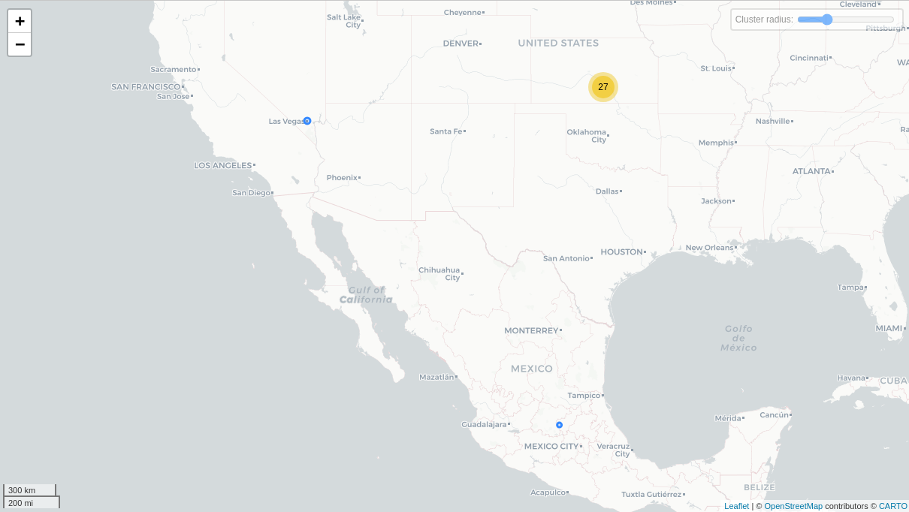

# Happn

## Fechas de análisis

- **Análisis estático (mediante Exodus Privacy/MobFS):** 11 de febrero, 2025
- **Análisis dinámico (mediante análisis de tráfico de red):** 11 de febrero, 2025
- **Análisis Posteriores:**

## Archivos analizados

- [apk versión 25.0.1](https://cloud.datavoros.org/index.php/s/fQCgPm5f7TtLG56)
- [pcap versión 1](https://cloud.datavoros.org/index.php/s/jsfxq6dgy9xdiw2)
- [Capturas de pantalla](https://cloud.datavoros.org/index.php/s/eNjD4Cd7zamT4aZ)
- [Reporte MobSF](https://cloud.datavoros.org/index.php/s/7HA7z9itGTFjgt3)

## Descripción de la aplicación
- **Tipo:** Aplicación de citas   
- **Costo:** gratuito  
- **Enlace de descarga:** https://play.google.com/store/apps/details?id=com.ftw_and_co.happn&hl=es_MX
- **Descargas:** *100M+*
- **Última fecha de actualización:** 11 de febrero, 2025
- **Versión:** 2025.1.0
- **Desarrollador:** [happn](https://www.happn.com/es/)
- **Firma:** [happn](https://www.happn.com/es/)
- **Contacto:** support@happn.fr
- **Condiciones de uso y Política de privacidad:**
    - **Términos del servicio:** https://support.happn.fr/hc/en-us/p/terms
    - **Política de privacidad:** https://support.happn.fr/hc/en-us/p/privacy
    
- **Descripción en PlayStore:**
~~~
Bienvenido al mundo de happn, la primera aplicación de citas de la vida cotidiana. Con más de 140 millones de usuarios en todo el mundo, happn es la aplicación de citas que se convertirá en tu aliado para conocer gente en los lugares que frecuentas. Te podes encontrar y conectar con personas en distintos lugares que frecuentas día a día: en el trabajo, en su cafetería favorita o simplemente dando un paseo, se encuentra con alguien que te gusta pero a quien no pudiste acercarte... gracias a happn, podes encontrar a esa persona, charlar y organizar una cita en tu lugar favorito que elijas.
Encontrá a tu crush en tus lugares favoritos
La verdadera ventaja de happn es que la aplicación de citas te permite conocer a personas que ya forman parte de tu vida cotidiana. Basándose en la proximidad geográfica y en los lugares que sueles frecuentar, la aplicación de citas gratuita fomenta encuentros más espontáneos y auténticos.
~~~

## Rastreadores identificados (mediante Exodus Privacy)

|Rastreador|Tipo|
|---|---| 
|[Adjust](https://www.adjust.com/)|Analítica|
|[Didomi](https://www.didomi.io/)|Analítica|
|[Facebook Analytics](https://developers.facebook.com/docs/android)|Analítica|
|[Facebook Login](https://developers.facebook.com/docs/android)|Identificación|
|[Facebook Share](https://developers.facebook.com/docs/android)||
|[Google AdMob](https://admob.google.com/)|Anuncios|
|[Google CrashLytics](http://crashlytics.com/)|Informe de fallas|
|[Google Firebase Analytics](https://firebase.google.com/)|Analítica|

[Enlace al reporte de Exodus Privacy](https://reports.exodus-privacy.eu.org/en/reports/com.ftw_and_co.happn/latest/#trackers)   

## Empresas relacionadas con esta aplicación:

|Empresa|Servicios que ofrecen|
|---|---| 
|[Amazon Web Services (AWS)](https://aws.amazon.com/)| Infraestructura en la nube, almacenamiento y hosting |
|[Cloudflare](https://www.cloudflare.com/)| CDN, seguridad web, mitigación de DDoS, optimización de tráfico |
|[Google Cloud Platform (GCP)](https://cloud.google.com/)| Infraestructura en la nube, almacenamiento, inteligencia artificial, análisis de datos |
|[Facebook (Meta)](https://www.facebook.com/)| Publicidad, redes sociales, identificación de usuarios |
|[Adjust GmbH](https://www.adjust.com/)| Analítica de marketing, atribución de usuarios, optimización de campañas publicitarias |

### Empresas identificadas a través del Aviso de Privacidad con que se comparten datos:

- [Google Cloud Platform](https://cloud.google.com/)
- [Amazon Web Services](https://aws.amazon.com/)
- [Google Workspace](https://workspace.google.com/)
- [Zendesk](https://www.zendesk.com/)
- [Amplitude](https://amplitude.com/)
- [Braze](https://www.braze.com/)
- [Outsourcia](https://www.outsourcia.com/)
- [Adjust](https://www.adjust.com/)
- [Facebook (Meta)](https://www.facebook.com/)
- [TikTok](https://www.tiktok.com/)
- [Google Ads](https://ads.google.com/)
- [Unity](https://unity.com/)
- [Google Ad Manager](https://admanager.google.com/)
- [Agora](https://www.agora.io/)
- [Google Firebase](https://firebase.google.com/)
- [Cloudflare](https://www.cloudflare.com/)
- [Nexmo - Vonage](https://www.vonage.com/)
- [Twilio](https://www.twilio.com/)
- [Stripe](https://stripe.com/)
- [Realytics](https://realytics.io/)

### Dominios integrados al código de la aplicación que no pertenecen directamente a los rastreadores

|Dominios|
|---|
|sdk.fra-01.braze.eu|
|github.com|
|api-project-1036899618040.firebaseio.com|

## Permisos   

- **Según Exodus Privacy/MobFS:** 24
- **Según prueba de uso:** 5

### Permisos según Exodus Privacy

- ACCESS_ADSERVICES_AD_ID
- ACCESS_ADSERVICES_ATTRIBUTION
- ACCESS_ADSERVICES_TOPICS
- :exclamation: ACCESS_BACKGROUND_LOCATION
- :exclamation: ACCESS_COARSE_LOCATION
- :exclamation: ACCESS_FINE_LOCATION
- ACCESS_NETWORK_STATE
- ACCESS_WIFI_STATE
- :exclamation: CAMERA
- FOREGROUND_SERVICE
- INTERNET
- MODIFY_AUDIO_SETTINGS
- POST_NOTIFICATIONS
- :exclamation: READ_EXTERNAL_STORAGE
- RECEIVE_BOOT_COMPLETED
- VIBRATE
- WAKE_LOCK
- :exclamation: WRITE_EXTERNAL_STORAGE
- BILLING
- DYNAMIC_RECEIVER_NOT_EXPORTED_PERMISSION
- RECEIVE
- BIND_GET_INSTALL_REFERRER_SERVICE
- AD_ID
- READ_GSERVICES 

El icono :exclamation: indica un nivel 'Peligroso' o 'Especial' de acuerdo a los [niveles de protección de Google](https://developer.android.com/guide/topics/permissions/overview).

### Permisos solicitados durante el uso de la aplicación

- :red_circle: Ubicación
- :blue_circle: Cámara
- :blue_circle: Galería
- :blue_circle: Microfono
- :blue_circle: Notificaciones

:red_circle: Este ícono indica un permiso obligatorio   
:blue_circle: Este ícono indica un permiso opcional pero se pierde una funcionalidad particular

## Datos

### Datos solicitados al usuario 

#### Datos solicitados durante el registro

- :red_circle: Correo electrónico
- :blue_circle: Nombre
- :red_circle: Edad

#### Datos solicitados durante el uso de la aplicación

- :red_circle: Definición de género
- :blue_circle: Altura
- :blue_circle: Signo zodiacal
- :blue_circle: Sexo de interes (hombre/mujer)
- :blue_circle: Tipo de relación deseada
- :blue_circle: Biométricos (fotos/al menos 2)
- :red_circle: Ciudad
- :blue_circle: Hobbies (en la ciudad, deportes, geek, música, películas y series, viajes, alimentos y bebidad, excentricidades, en casa)
- :blue_circle: Frase *gancho*
- :blue_circle: Rutina de ejrcicio
- :blue_circle: Plan familiar
    
    

:red_circle: Este ícono indica que se debe ingresar este dato de manera obligatoria.   
:blue_circle: Este ícono indica que estos datos son opcionales.

### Tabla de conexiones realizadas durante el uso de la aplicación

|Dirección IP|Número de Paquetes|País|Ciudad/Zona|Organización AS|
|---|---|---|---|---|
|3.161.44.125|48|United States||AMAZON-02|
|3.161.55.32|80|United States||AMAZON-02|
|10.1.10.1|31685|||||
|104.16.33.190|136||||CLOUDFLARENET|
|104.16.34.190|96||||CLOUDFLARENET|
|104.16.35.190|52||||CLOUDFLARENET|
|104.16.36.190|54||||CLOUDFLARENET|
|104.16.65.21|7492||||CLOUDFLARENET|
|104.17.152.77|4493||||CLOUDFLARENET|
|104.17.227.168|2166||||CLOUDFLARENET|
|104.17.228.168|448||||CLOUDFLARENET|
|104.17.229.168|1453||||CLOUDFLARENET|
|104.17.230.168|6076||||CLOUDFLARENET|
|104.17.231.168|201||||CLOUDFLARENET|
|104.18.35.7|318||||CLOUDFLARENET|
|142.250.177.2|32|United States||GOOGLE|
|142.251.34.2|89|United States||GOOGLE|
|142.251.34.34|19|United States||GOOGLE|
|142.251.34.42|30|United States||GOOGLE|
|157.240.25.1|151|Mexico|Querétaro City|FACEBOOK|
|172.64.152.249|411||||CLOUDFLARENET|
|172.217.3.138|32|United States||GOOGLE|
|172.217.15.10|25|United States||GOOGLE|
|185.151.204.13|154|United States||Adjust GmbH|
|192.178.52.225|2380|United States||GOOGLE|
|192.178.52.228|142|United States||GOOGLE|
|192.178.52.234|54|United States||GOOGLE|
|192.178.52.238|27|United States||GOOGLE|
|192.178.56.34|52|United States||GOOGLE|
|192.178.56.35|31|United States||GOOGLE|
|192.178.56.42|37|United States||GOOGLE|
|192.178.56.66|53|United States||GOOGLE|
|192.178.56.68|1568|United States||GOOGLE|
|192.178.56.78|856|United States||GOOGLE|
|192.178.56.98|299|United States||GOOGLE|
|192.178.56.106|53|United States||GOOGLE|
|192.178.56.142|32|United States||GOOGLE|
|192.178.56.170|32|United States||GOOGLE|
|192.178.56.196|1642|United States||GOOGLE|
|192.178.56.202|60|United States||GOOGLE|
|192.178.57.14|215|United States||GOOGLE|
|192.178.57.34|25|United States||GOOGLE|
|192.178.57.42|71|United States||GOOGLE|

### Mapa de conexiones realizadas durante el uso de la aplicación

### Datos recopilados y uso según la Play Store

Google PlayStore declara los siguientes datos recopilados por happn:

Datos|Uso|
|---|---|
| Nombre | Funciones de la app, Comunicaciones del desarrollador, Seguridad, cumplimiento y prevención de fraudes y Administración de la cuenta |
| Dirección de correo electrónico | Funciones de la app, Comunicaciones del desarrollador, Publicidad o marketing, Seguridad, cumplimiento y prevención de fraudes y Administración de la cuenta |
| IDs de usuario | Funciones de la app, Estadísticas, Comunicaciones del desarrollador, Publicidad o marketing, Seguridad, cumplimiento y prevención de fraudes, Personalización y Administración de la cuenta |
| Número de teléfono (Opcional) | Funciones de la app, Publicidad o marketing y Administración de la cuenta |
| Orientación sexual | Funciones de la app, Estadísticas, Comunicaciones del desarrollador, Seguridad, cumplimiento y prevención de fraudes y Personalización |
| Otra información | Funciones de la app, Estadísticas, Comunicaciones del desarrollador, Publicidad o marketing, Seguridad, cumplimiento y prevención de fraudes, Personalización y Administración de la cuenta |
| Interacciones en la app | Funciones de la app, Estadísticas, Comunicaciones del desarrollador, Seguridad, cumplimiento y prevención de fraudes, Personalización y Administración de la cuenta |
| Otro contenido generado por usuarios (Opcional) | Funciones de la app, Estadísticas y Seguridad, cumplimiento y prevención de fraudes |
| Otras acciones | Funciones de la app, Estadísticas, Comunicaciones del desarrollador, Seguridad, cumplimiento y prevención de fraudes y Personalización |
| Otros mensajes desde la app | Funciones de la app |
| Fotos | Funciones de la app, Estadísticas, Comunicaciones del desarrollador, Seguridad, cumplimiento y prevención de fraudes y Administración de la cuenta |
| Registros de fallas | Estadísticas |
| Diagnóstico | Estadísticas |
| Ubicación aproximada | Funciones de la app, Estadísticas, Comunicaciones del desarrollador, Publicidad o marketing, Seguridad, cumplimiento y prevención de fraudes y Personalización |
| Ubicación precisa (Opcional) | Funciones de la app, Estadísticas y Personalización |
| Dispositivo u otros IDs | Estadísticas, Publicidad o marketing, Seguridad, cumplimiento y prevención de fraudes y Administración de la cuenta |
| Historial de compras | Funciones de la app, Estadísticas y Administración de la cuenta |
| Información de entrenamiento (Opcional) | Funciones de la app y Personalización |

### Datos compartidos y uso según la Play Store

Google PlayStore declara los siguientes datos compartidos por happn:

| Datos | Uso |
|---|---|
| Dirección de correo electrónico | Publicidad o marketing |
| IDs de usuario | Publicidad o marketing |
| Número de teléfono | Publicidad o marketing |
| Otra información | Publicidad o marketing |
| Ubicación aproximada | Publicidad o marketing |
| Dispositivo u otros IDs | Estadísticas y Publicidad o marketing |

### Prácticas de seguridad

- Los datos están cifrados en tránsito
- Puedes solicitar que se borren los datos

### Datos recopilados según la Política de privacidad

| Datos |
|---|
| **Datos obligatorios:** Datos de identificación, dirección de correo electrónico/número de teléfono, actividad en la aplicación, datos técnicos del teléfono, ciudad (si se niega la función de geolocalización) |
|**Datos necesarios para determinados fines:** participación en juegos y competiciones, experiencia y satisfacción, posición geográfica o ciudad, puntos de cruce con otros miembros, preferencias de búsqueda (edad y género), mensajes de la aplicación y mensajes de voz, datos sobre llamadas de vídeo (sin contenido), informes y solicitudes al servicio de atención al cliente, compras y pagos, datos biométricos para verificación del perfil (con consentimiento)|
|**Datos opcionales:** carrera profesional y educación, intereses, estilo de vida, características de los miembros, dirección de correo electrónico y/o número de teléfono (según método de inscripción), descripción|
|**Datos de registro:** nombre (público), edad (público), fecha de nacimiento (privado), género, foto de perfil (pública), número de teléfono, dirección de correo electrónico, apellido (si se registra con Facebook, Apple o Google), nombre de ciudad (si se rechaza la geolocalización)|
|**Información opcional para completar el perfil:** carrera profesional y educación, profesión o estudios, intereses y hábitos (preferencias personales, actividades de ocio, preferencias musicales, estilo de vida, características de los miembros), altura, descripción del perfil (incluyendo respuestas sobre estilo de vida, personalidad, deportes, viajes, tipo de reunión esperada)|
|**Datos relativos a las interacciones con HAPPN:** informes y solicitudes enviadas al servicio de atención al cliente (fecha y hora del informe, naturaleza y razón del informe, datos del usuario informado, prueba de identidad), participación en juegos y competiciones, respuestas, nivel de satisfacción, sugerencias, experiencia|
|**Datos de actividad recopilados automáticamente:** fecha de registro, fechas de inicio de sesión, estado de sesión (conectado o desconectado), interacciones con otros miembros y cuentas de terceros (Spotify, Instagram), número de transacciones, notificaciones recibidas, preferencias de notificación|
|**Posiciones geográficas y puntos de cruce con otros Miembros:** ubicación geográfica con consentimiento expreso, puntos de cruce con otros usuarios dentro de un radio definido, historial de cruces almacenado en el perfil, posibilidad de mostrar u ocultar puntos de cruce en el mapa o feed de noticias, opción de desactivar geolocalización para evitar actualizaciones de cruces|
|**Mensajes de texto y mensajes de voz enviados y recibidos:** almacenados en servidores de HAPPN, utilizados para conversaciones entre miembros con Crush o función FlashNote, estrictamente privados, no accesibles por otros miembros o terceros, excepto en casos de solicitudes judiciales o conforme a regulaciones legales|
|**Información relativa a las videoconferencias:** hora de inicio y finalización, fecha de las videollamadas; recopilados para establecer la comunicación, pero no se almacena el contenido de las llamadas, ya que son instantáneas|
|**Preferencias de búsqueda:** edad, género y características de los miembros con los que se desea cruzar caminos; usados para filtrar y mostrar perfiles compatibles en el feed de noticias|
|**Datos técnicos del dispositivo:** dirección IP, ID móvil, versión de la aplicación, versión del dispositivo y modelo, idioma, sistema operativo, fallos de aplicación e identificación de publicidad; recopilados mediante registros de servidores, cookies y herramientas de seguimiento|
|**Datos de transacción:** número de transacción, historial de compras y suscripciones; no se almacenan datos bancarios ni métodos de pago, procesados por Apple App Store y Google Play Store|

### Uso general de la información según la Política de privacidad

- Para la creación y gestión de su cuenta como Miembro, incluyendo:
    - Creación de su perfil.
    - Registro, desregistro y desactivación de su perfil de Miembro.
    - Gestión de parámetros y preferencias.
    - Administración de suscripciones.
    - Gestión del acceso a los servicios proporcionados por HAPPN.
- Para la gestión y almacenamiento de interacciones en la aplicación, incluyendo:
    - Mensajes intercambiados entre los miembros (Mensajes, FlashNotes, Hellos, Crushes, Likes).
    - Gestión de videollamadas entre miembros.
    - Administración de suscripciones y servicios de pago comprados (Holas, FlashNotes, crédito de llamada, etc.).
    - Envío de mensajes de información relacionados con los servicios o interacciones con otros miembros (notificaciones).
- Sugeriendo perfiles que tienes caminos cruzados o puedes cruzar caminos con
    - Geolocalización para sugerir perfiles de Miembros con los que tiene caminos cruzados o puede cruzarse caminos. 
- Para la identificación y recomendación de perfiles en la aplicación, incluyendo:
    - Mostrar perfiles de Miembros con los que has cruzado caminos o podrías cruzarte.
    - Recomendar perfiles basados en tu actividad en la aplicación, tu ubicación y la información de tu perfil.
    - Sugerir perfiles cuando utilizas la función Boost.
- Para la recomendación de perfiles por correo electrónico, incluyendo:
    - Enviar sugerencias de perfiles con los que has cruzado caminos o podrías cruzarte.
- Para la personalización de la experiencia en la aplicación, incluyendo:
    - Sugerir miembros en función de sus lugares favoritos.
    - Sugerir lugares de reunión basados en sus preferencias.
- Sugerencia de ofertas y contenidos pertinentes (comercialización y anuncios)
    - Enviar el boletín editorial de HAPPN por correo electrónico.
    - Dejar de enviar el boletín a los miembros que no lo hayan abierto en más de un año.
    - Enviar un boletín de noticias con recomendaciones de perfil.
    - Distribuir contenidos de marketing y anuncios sobre ofertas y servicios de HAPPN en la aplicación y por correo electrónico.
    - Ofrecer a los miembros promociones y ofertas personalizadas o no personalizadas en los servicios de HAPPN.
    - Realizar campañas de marketing y publicidad fuera de la aplicación en sitios de terceros, redes sociales y otras aplicaciones.
    - Excluir a los miembros actuales de las campañas de marketing en otras plataformas.
    - Mostrar anuncios personalizados dentro de la aplicación basados en edad, género y ubicación.
    - Limitar anuncios repetidos o irrelevantes para mejorar la experiencia del usuario.
    - Mostrar anuncios no personalizados en la aplicación basados únicamente en el país del usuario.
- Mejorar y optimizar los servicios de HAPPN
    - Realizar estudios estadísticos sobre el uso de la aplicación.
    - Implementar encuestas de satisfacción para mejorar la experiencia del usuario.
    - Analizar el uso de la aplicación y sus funcionalidades.
    - Mejorar la aplicación, ofertas y características.
    - Comprender mejor las necesidades y preferencias de los usuarios.
    - Proporcionar a los miembros consejos sobre qué fotos de perfil publicar para mejorar la presentación de su perfil.
- Garantizar la seguridad de los datos personales
    - Detectar y prevenir infracciones a la seguridad de los servicios mediante la identificación de conductas fraudulentas.
- Prevención y lucha contra actividades ilegales o no autorizadas
    - Analizar y procesar reportes sobre comportamientos fraudulentos o inadecuados.
    - Gestionar el comportamiento inadecuado, incluyendo advertencias, suspensiones, bloqueos o eliminación de cuentas.
    - Gestionar las solicitudes de ejercicio de los derechos de los usuarios sobre sus datos personales.
    - Detectar y prevenir actividades fraudulentas mediante el análisis automatizado de perfiles y actividad en la aplicación.
    - Asegurar la calidad de los perfiles a través del análisis de fotos de perfil para detectar rostros y excluir perfiles falsos.
    - Reforzar la seguridad excluyendo automáticamente perfiles de usuarios con antecedentes de conducta fraudulenta.
    - Implementar la certificación de perfiles a través del reconocimiento facial, comparando datos biométricos con fotos de perfil.
- Proporcionar ayuda y soporte técnico a los usuarios
    - Responder a las solicitudes de soporte técnico enviadas por los miembros de la aplicación.

#### Información compartida con terceros
- Se comparte información personal con proveedores de servicio esenciales para la funcionalidad de la aplicación, como soporte técnico, almacenamiento y moderación.
- Se puede compartir información personal con socios publicitarios y de marketing para la entrega de anuncios y campañas promocionales.
- Se puede compartir información con terceros para análisis y mejora de la plataforma, incluyendo machine learning e inteligencia artificial.
- Se permite la integración con redes sociales y proveedores de sistemas operativos para autenticación y conexión de cuentas.
- Se puede compartir información con entidades gubernamentales y judiciales en caso de requerimientos legales o investigaciones.
- Se puede compartir información con terceros en caso de reestructuración empresarial, adquisición o cambio de control de la empresa.
- Proveedores y socios de servicios confiables pueden acceder y/o procesar datos personales de los usuarios bajo estrictas medidas de seguridad.
- Si el usuario lo permite, se pueden compartir datos con redes sociales para excluirlos de campañas de marketing o realizar anuncios dirigidos.
- Lista de proveedores y socios:
    - **Google Cloud Platform** (Almacenamiento y hosting)
    - **Amazon Web Services** (Almacenamiento y hosting)
    - **Google Suite (Workspace)** (Mensajería y gestión de solicitudes)
    - **Zendesk** (Soporte al cliente)
    - **Amplitude** (Análisis de datos)
    - **Braze** (Gestión de notificaciones y boletines)
    - **Outsourcia** (Atención al cliente)
    - **Adjust** (Medición de audiencia)
    - **Facebook** (Marketing y exclusión de campañas)
    - **TikTok** (Medición de audiencia y campañas publicitarias)
    - **Google Ads** (Publicidad y medición de audiencia)
    - **Unity** (Medición de audiencia)
    - **Google Ad Manager** (Gestión de anuncios en la aplicación)
    - **Agora** (Llamadas de video)
    - **Google Firebase** (Notificaciones y detección de errores)
    - **Cloudflare** (Entrega de contenido y seguridad)
    - **Nexmo - Vonage** (Autenticación de cuentas vía SMS)
    - **Twilio** (Autenticación de cuentas vía SMS)
    - **Stripe** (Gestión de pagos)
    - **Realytics** (Medición de audiencia en el sitio web)

## Notas

### **Política de privacidad, recolección**  

- Happn detalla en su política de privacidad qué información recopila, justificando su recolección (funcionalidad, experiencia del usuario, seguridad y publicidad).  
- Happn guarda mensajes enviados (solo son accesibles en casos de requerimientos legales).
- Se permite el registro con Facebook, Apple o Google. 

### **Uso y compartición de datos**  

- Nse detallan las condiciones exactas bajo las cuales se transfieren los datos.  
- Se menciona que algunos datos pueden ser utilizados para publicidad personalizada**, incluyendo identificadores de usuario, ubicación estimada.
- El sistema de moderación sigue el modelo *tipo combinación de detección automatizada y revisión manual* pero no se especifica con claridad cómo funcionan estos sistemas para prevenir abusos o fraudes.   

### **Tiempos de retención de datos**  

- Cuentas activas Mientras el usuario tenga su cuenta activa, sus datos serán almacenados.  
-Cuentas inactivas  
  - Después de 24 meses de inactividad, la cuenta se eliminará.  
  - Los datos se conservarán por un año adicional antes de ser eliminados o anonimizados de forma irreversible.  
  - Las cuentas premium no se consideran **.  
- Cuentas baneadas  
  - Los datos de una cuenta baneada se almacenan durante 24 meses en una base de datos activa para cotejarla con nuevas inscripciones y evitar que el usuario regrese.  
  - Posteriormente, se archivan por un año adicional antes de ser eliminados o anonimizados.  
-Cuentas eliminadas por el usuario  
  - Si el usuario elimina su cuenta, esta se eliminará de la aplicación, pero sus datos se mantendrán durante un año en un archivo separado antes de ser eliminados permanentemente o anonimizados.  
- Datos de contacto (email y teléfono  
  - Se conservanpor un año después de que la cuenta haya estado inactiva durante 24 meses para fines de prospección comercial y optimización de servicios.  
  - Si el usuario elimina su cuenta, estos datos no serán utilizados para marketing  
- Ubicación y puntos de cruce  
  - La última posición geográfica se almacena por un mes  
  - Los puntos de cruce con otros usuarios se almacenan por seis meses  

### Rastreadores y privacidad
- Happn unicmante utiliza 8 rastreadores identificados por Exodus, siendo la mayoría de analítica y publicidad.
Happn no cuenta con rastreadores de seguridad o protección contra fraudes dedicados en su listado, lo que deja dudas sobre cómo gestiona abusos dentro de la plataforma.

### Empresas con las que Happn comparte datos
- Happn es claro con quienes comparte información (empresas externas)
- No se menciona explícitamente si Happn anonimiza los datos antes de compartirlos con terceros o sus aliados.

### Dominios externos dentro del código
- api-project-1036899618040.firebaseio.com esta presente en el código, lo que sugiere que Firebase está almacenando datos directamente relacionados con eventos de la aplicación.

### Ubicación
- Happn, no reuqiere la ubicación como permiso **vital** dentro de la usabilidad de la aplicación. La app puede usarse sin necesidad de tener encendida la ubicación.

## Conclusiones

### Información a los usuarios
Happn revela a sus usuarios desde el momento del registro toda la información que recopila de los usuarios y de los dispositivos, el uso que le da y también menciona los socios con los que comparte esta información. Esta acción es considerada como una buena práctica de transparencia con sus usuarios a comparación de otras aplicaciones de este tipo.
Dentro de la breve introducción a los socios de Happn, se menciona explicitamente algunos socios **no piden consentimiento para procesar datos de usuarios y únicamente se amparan en el legítimo interés comercial**. Así mismo, Happn menciona que se puede retirar el consentimiento u opornerse al procesamiento de los datos según el interés legitimo.

### Congruencia de información declarada
Happn, ademas de mencionar la información que recopila en Google Play Store y su Política de Privacidad, hace conocimeinto a sus usuarios en el moemnto del registro y primer uso de esta aplicación hacerca de esta información recopilada. Además, Happn menciona explicitamente con que terceros comerciales (trackers) son con los que comparte datos y sede al usuario la posibilidad de marcar o desmarcar alguno de estos trackers sin modificar el funcionamiento de la aplicación o afectar el registro.

### Tiempo de almcenamiento de datos 
Happn es explicito y claro con el tiempo que almacena los datos de los usuarios según la actividad del usuario.
En general, los datos de los miembros se conservan mientras la cuenta esté activa y en caso de inactividad por 24 meses. Si la cuenta es eliminada, manteniéndose ciertos datos por un año adicional antes de ser destruidos o anonimizados de manera irreversible. 
En caso de prohibición de una cuenta, los datos permanecen accesibles por 24 meses para evitar nuevas inscripciones y luego se archivan por otro año antes de su eliminación definitiva. Cuando un usuario elimina su cuenta de manera voluntaria, sus datos son almacenados por un año adicional en cumplimiento con regulaciones legales. Además, la información de contacto.

### Rastreadores
Happn cuenta con una cantidad de permisos baja en comparación con aplicaciones de estos tipos como Grindr, Tinder o BUmble, situación 

### Ubicación
Happn demostró que para el funcionamiento pleno de la aplicación no es compeltamente necesario tener la ubicación, encendida ya que al momento del registro, solicita al usuario la ciudad en la que vive, tomando eso como puno de referencia principal para sus algoritmos de emparejamiento.

No obstante, al permitir a la aplicación el acceso a la ubicación, la funcion **cruces** permite conocer con que usuarios te has topado en la vida real mediante el despligue de un mapa (uso de google maps) y, aunque estos **cruces** no muestran la ubicación exacta de los usuarios, esta funcion puede revelar puntos que otros usuarios frecuentan, prepresentando un posible riesgo de triangulación de ubicación.

En general Happn es una aplicación con una buena transparencia en comparación con aplicaciones de este tipo. La congruencia en entre lo declarado en su política de privacidad y lo declarado en Google Play store es congruente.
La cantidad de permisos son promedio, además, no hay permisos invasivos para los usuarios, siendo estos lo que eligen la dinámica de funcionalidad de la aplicación. Happn tiene una tabla completa de empresas de terceros con los que comparte información y el proposito de compartir la informacipon. 
Los tiempos de retención de información son claros y se explican los contextos de retención. Además, en comparación con otras aplicaciones, Happn ampliamente dice que **anonimiza** la información de los usuarios al compartirla y en comparación con otras aplicaciones ismilares, los tiempos de retención de información de usuarios es consideramente corta.