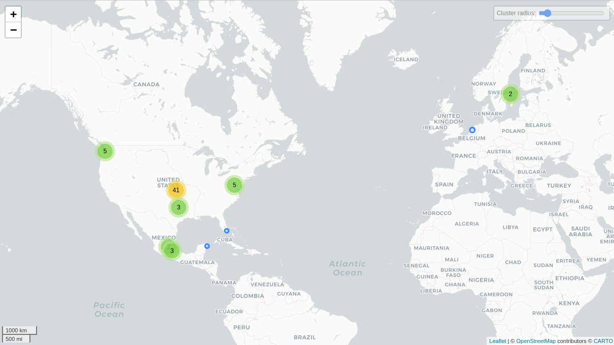

# Tinder

## Fechas de análisis

- **Análisis estático (mediante Exodus Privacy/MobFS):** 10 de febrero, 2025
- **Análisis dinámico (mediante análisis de tráfico de red):** 10 de febrero, 2025
- **Análisis Posteriores:**

## Archivos analizados

- [apk versión 25.0.1](https://cloud.datavoros.org/index.php/s/k534JCNX72rbopg)
- [pcap versión 1](https://cloud.datavoros.org/index.php/s/SYeCDAS2b63QM3N)
- [Capturas de pantalla](https://cloud.datavoros.org/index.php/s/42tdPy66BYXrciH)
- [Reporte MobSF](https://cloud.datavoros.org/index.php/s/NTNigRrzrBFeMFX)

## Descripción de la aplicación
- **Tipo:** Aplicación de citas y amigos   
- **Costo:** gratuito  
- **Enlace de descarga:** https://play.google.com/store/apps/details?id=com.tinder&hl=es_MX
- **Descargas:** *100M+*
- **Última fecha de actualización:** 05 de febrero, 2025
- **Versión:** 16.1.0
- **Desarrollador:** [Tinder LLC](https://tinder.com/)
- **Firma:** [Tinder LLC](https://tinder.com/)
- **Contacto:** help@gotinder.com
- **Condiciones de uso y Política de privacidad:**
    - **Términos del servicio:** https://www.gotinder.com/terms
    - **Política de privacidad:** https://www.gotinder.com/privacy
    
- **Descripción en PlayStore:**
~~~
Con más de 70 mil millones de matches hasta la fecha, Tinder® es la mejor app de citas gratuita y el mejor lugar para conocer gente nueva. ¿Buscas encontrar pareja? ¿Una relación abierta? ¿Quieres dar el paso y encontrar una cita, o simplemente quieres hacer nuevos amigos y chatear? Con Tinder, puedes conocer gente cerca de ti en todas partes y tener la mejor experiencia de citas:
Tinder es para todxs. Seas heterosexual, gay, bisexual o tu propia mezcla, Tinder te permite ser quien eres y encontrar a quién quieres.
Comparte tus intereses y conoce más a tus matches para empezar a chatear y prender la llama entre lxs dos.
Perfiles verificados con foto: la única sorpresa que queremos es un ramo de flores en la primera cita
Chat de video: ¡prueba tu química en citas virtuales y conoce a tus matches desde casa!
¿Estás de viaje? Conoce personas en tu destino y únete a una comunidad global. Sal de fiesta en Santiago, conoce a nuevos amigos en Medellín o ten una cita en Lima: donde quiera que vayas, estaremos contigo.
~~~

## Rastreadores identificados (mediante Exodus Privacy)

|Rastreador|Tipo|
|---|---|
|[AppsFlyer](http://appsflyer.com/)|Analítica|
|[Branch](https://branch.io/)|Analítica|
|[Bugsnag](https://www.bugsnag.com/)|Informe de fallas|
|[Facebook Analytics](https://developers.facebook.com/docs/android)|Analítica|
|[Facebook Login](https://developers.facebook.com/docs/android)|Identificación|
|[Facebook Share](https://developers.facebook.com/docs/android)||
|[Google AdMob](https://admob.google.com/)|Anuncios|
|[Google CrashLytics](http://crashlytics.com/)|Informe de fallas|
|[Google Firebase Analytics](https://firebase.google.com/)|Analítica|
|[IAB Open Measurement](https://iabtechlab.com/)|Anuncios, identificación|
|[Tinder Analytics](http://tinder.com/)|Analítica|
|[Unity3d Ads](https://unity3d.com/)|Anuncios|

[Enlace al reporte de Exodus Privacy](https://reports.exodus-privacy.eu.org/en/reports/com.tinder/latest/#trackers)   

## Empresas relacionadas con esta aplicación:

|Empresa|Servicios que ofrecen|
|---|---|
|[Akamai International B.V](https://www.akamai.com/es)|CDN, seguridad web, mitigación de DDoS|
|[Amazon Web Services (AWS)](https://aws.amazon.com/es/)|Infraestructura en la nube, almacenamiento, servidores y cómputo escalable|
|[AS-VULTR](https://www.vultr.com/)|Hosting en la nube y servidores VPS|
|[Castor Networks Mexico](https://www.castornetworks.com/)|Servicios de telecomunicaciones y conectividad satelital|
|[Facebook (Meta)](https://about.meta.com/)|Publicidad, autenticación de usuarios y servicios de marketing|
|[GigNet, S.A. de C.V.](https://www.gignet.mx/)|Provisión de servicios de Internet en México|
|[Google](https://about.google/intl/es/)|Servicios de análisis, infraestructura en la nube, hosting, APIs y publicidad|
|[Svensk Teleutveckling & Produktinnovation (STUPI AB)](https://stupi.se/)|Servicios de telecomunicaciones en Suecia|
|[Universidad Nacional Autónoma de México (UNAM)](https://www.unam.mx/)|Institución académica con infraestructura de red propia|

### Empresas identificadas a través del Aviso de Privacidad con que se comparten datos:

- [Hnge](https://hinge.co/)
- [Match](https://www.match.com/)
- [Meetric](https://www.meetic.fr/)
- [okcupid](https://www.okcupid.com/)
- [paris](https://www.pairs.lv/)
- [Plenty of Fish](https://www.pof.com/)
- [zar](https://azarlive.com/)
- [chispa](https://www.chispa-app.com/masp/en-us/chispa)
- [BLK](https://www.blk-app.com/masp/en-us/blk)
- [The league](https://www.theleague.com/#are-you-in)

### Dominios integrados al código de la aplicación que no pertenecen directamente a los rastreadores

|Dominios|
|---|
|[policies.tinder.com](https://policies.tinder.com)|
|[square.github.io](https://square.github.io)|
|[www.emergetools.com](https://www.emergetools.com)|
|[findbugs.sourceforge.net](https://findbugs.sourceforge.net)|
|[checkerframework.org](https://checkerframework.org)|
|[tools.android.com](https://tools.android.com)|
|[www.joda.org](https://www.joda.org)|
|[uwaterloo.ca](https://uwaterloo.ca)|
|[protobuf.dev](https://protobuf.dev)|
|[code.google.com](https://code.google.com)|
|[bugsnag.com](https://www.bugsnag.com)|
|[www.reactive-streams.org](https://www.reactive-streams.org)|
|[kryo.googlecode.com](https://code.google.com/archive/p/kryo)|
|[cs.android.com](https://cs.android.com)|
|[jcp.org](https://jcp.org)|
|[opensource.org](https://opensource.org)|
|[objenesis.org](https://objenesis.org)|
|[facebook.github.io](https://facebook.github.io)|
|[rtyley.github.io](https://rtyley.github.io)|
|[source.android.com](https://source.android.com)|
|[gotinder-com-api-project-465293127427.firebaseio.com](https://console.firebase.google.com/)|
|[tensorflow.org](https://tensorflow.org)|
|[tokbox.com](https://tokbox.com)|

## Permisos   

- **Según Exodus Privacy/MobFS:** 37
- **Según prueba de uso:** 8

### Permisos según Exodus Privacy

- ACCESS_ADSERVICES_AD_ID
- ACCESS_ADSERVICES_ATTRIBUTION
- ACCESS_ADSERVICES_TOPICS
- :exclamation: ACCESS_COARSE_LOCATION
- :exclamation: ACCESS_FINE_LOCATION
- ACCESS_NETWORK_STATE
- ACCESS_WIFI_STATE
- AD_SERVICES_CONFIG
- BLUETOOTH
- :exclamation: BLUETOOTH_CONNECT
- :exclamation: CAMERA
- CHANGE_WIFI_STATE
- FOREGROUND_SERVICE
- INTERNET
- MODIFY_AUDIO_SETTINGS
- POST_NOTIFICATIONS
- :exclamation: READ_CONTACTS
- :exclamation: READ_EXTERNAL_STORAGE
- READ_MEDIA_IMAGES
- READ_MEDIA_VIDEO
- READ_MEDIA_VISUAL_USER_SELECTED
- :exclamation: READ_PHONE_STATE
- RECEIVE_BOOT_COMPLETED
- :exclamation: RECORD_AUDIO
- STORAGE
- USE_BIOMETRIC
- USE_FINGERPRINT
- VIBRATE
- WAKE_LOCK
- :exclamation: WRITE_EXTERNAL_STORAGE
- BILLING
- RECEIVE
- BIND_GET_INSTALL_REFERRER_SERVICE
- AD_ID
- READ_GSERVICES
- DYNAMIC_RECEIVER_NOT_EXPORTED_PERMISSION
- MAPS_RECEIVE

El icono :exclamation: indica un nivel 'Peligroso' o 'Especial' de acuerdo a los [niveles de protección de Google](https://developer.android.com/guide/topics/permissions/overview).

### Permisos solicitados durante el uso de la aplicación

- :red_circle: Ubicación
- :blue_circle: Contactos
- :blue_circle: Teléfono
- :blue_circle: Cámara
- :blue_circle: Galería
- :blue_circle: Microfono
- :blue_circle: Almacenamiento
- :blue_circle: Notificaciones

:red_circle: Este ícono indica un permiso obligatorio   
:blue_circle: Este ícono indica un permiso opcional pero se pierde una funcionalidad particular

## Datos

### Datos solicitados durante el registro

- :red_circle: Correo electrónico
- :red_circle: Número de teléfono
- :blue_circle: Nombre
- :red_circle: Edad
- :red_circle: genero
- :blue_circle: orientación sexual
- :red_circle: intereses personales
- :red_circle: ¿que tipo de relación se busca en Tinder?
- :red_circle: ¿Qué distancia se busca?

### Datos solicitados durante el uso de la aplicación

- :blue_circle: Descripción
- :blue_circle: Intereses
- :blue_circle: Pronombres
- :blue_circle: Altura
- :blue_circle: Tipo de relación
- :blue_circle: Idiomas que hablo
- :blue_circle: Zodiaco
- :blue_circle: Educación
- :blue_circle: Planes familiares
- :blue_circle: Vacunación contra COVID
- :blue_circle: Tipo de personalidad
- :blue_circle: Estilo de comunicación
- :blue_circle:Estilo de amor
- :blue_circle: Mascotas
- :blue_circle: Beber
- :blue_circle: ¿Cada cuánto fumas?
- :blue_circle: Hacer ejercicio
- :blue_circle: Preferencias dietéticas
- :blue_circle: Redes sociales
- :blue_circle: Hábitos de sueño
- :blue_circle: Puesto
- :blue_circle: Compañía
- :blue_circle: Escuela
- :blue_circle: Vivo en
- :blue_circle: Mi himno musical
- :blue_circle: Artistas favoritos en spotify    

:red_circle: Este ícono indica que se debe ingresar este dato de manera obligatoria.   
:blue_circle: Este ícono indica que estos datos son opcionales.

### Tabla de conexiones realizadas durante el uso de la aplicación

|Dirección IP|Número de paquetes|País|Ciudad/Zona|Organización|
|---|---|---|---|---|
|3.5.0.75|33|United States||AMAZON-AES|
|3.5.2.219|639|United States||AMAZON-AES|
|3.5.21.197|35|United States||AMAZON-AES|
|3.5.29.31|84|United States||AMAZON-AES|
|3.5.29.101|94|United States||AMAZON-AES|
|3.5.31.110|44|United States||AMAZON-AES|
|3.161.10.29|62|United States||AMAZON-02|
|3.161.10.33|28|United States||AMAZON-02|
|3.161.55.30|208|United States||AMAZON-02|
|3.161.55.31|21|United States||AMAZON-02|
|3.161.55.72|65268|United States||AMAZON-02|
|3.161.57.55|30|United States||AMAZON-02|
|3.161.57.191|134|United States||AMAZON-02|
|16.182.65.209|153|United States|Ashburn|AMAZON-02|
|18.160.109.45|28|United States|Seattle|AMAZON-02|
|18.160.109.71|132|United States|Seattle|AMAZON-02|
|18.160.124.12|147|United States|Seattle|AMAZON-02|
|18.160.124.18|9583|United States|Seattle|AMAZON-02|
|18.160.124.24|89|United States|Seattle|AMAZON-02|
|23.47.51.7|265|United States|Dallas|Akamai International B.V.|
|23.47.51.27|1267|United States|Dallas|Akamai International B.V.|
|23.196.11.37|166|United States|Irving|Akamai International B.V.|
|35.190.88.7|90|United States||GOOGLE|
|45.183.178.129|14|Mexico||Castor Networks Mexico|
|45.231.168.6|18|Mexico|Juárez|GigNet, S.A. de C.V.|
|54.157.131.181|46|United States|Ashburn|AMAZON-AES|
|65.9.121.2|2947|United States||AMAZON-02|
|65.9.121.83|1830|United States||AMAZON-02|
|65.9.121.113|204|United States||AMAZON-02|
|65.9.149.47|8526|United States||AMAZON-02|
|132.248.3.29|2|Mexico|Coyoacán|Universidad Nacional Autonoma de Mexico|
|132.248.30.3|20|Mexico|Tlalpan|Universidad Nacional Autonoma de Mexico|
|142.251.34.2|56|United States||GOOGLE|
|157.240.25.1|98|Mexico|Querétaro City|FACEBOOK|
|172.217.2.130|242|United States||GOOGLE|
|192.36.143.130|68|Sweden||Svensk Teleutveckling & Produktinnovation, STUPI AB|
|192.178.52.194|127|United States||GOOGLE|
|216.238.66.57|44|Mexico|Querétaro City|AS-VULTR|

### Mapa de conexiones realizadas durante el uso de la aplicación

### Datos recopilados y uso según la Play Store

Google Play Store declara los siguientes datos recopilados por Tinder:

Datos|Uso|
|---|---|
|Nombre|Seguridad, cumplimiento y prevención de fraudes|
|Dirección de correo electrónico|Seguridad, cumplimiento y prevención de fraudes|
|IDs de usuario|Seguridad, cumplimiento y prevención de fraudes|
|Número de teléfono| Seguridad, cumplimiento y prevención de fraudes|
|Otra información|Seguridad, cumplimiento y prevención de fraudes|
|Orientación sexual (opcional)|Funciones de la app Estadísticas, Comunicaciones del desarrollador, Publicidad o marketing, Seguridad, cumplimiento y prevención de fraudes, Personalización y Administración de la cuenta|
|Contactos|Funciones de la aplicación|
|Registros de fallas|Funciones de la app y estadísticas|
|Diagnóstico|Funciones de la app, Estadísticas y Seguridad, cumplimiento y prevención de fraudes|
|Otros datos de rendimiento de la app|Funciones de la app, Estadísticas y Seguridad, cumplimiento y prevención de fraudes|
|Fotos o video|Funciones de la app y Seguridad, cumplimiento y prevención de fraudes|
|Información de pago del usuario|Funciones de la app, Seguridad, cumplimiento y prevención de fraudes y Administración de la cuenta|
|Historial de compras|Funciones de la app, Estadísticas, Comunicaciones del desarrollador, Publicidad o marketing, Seguridad, cumplimiento y prevención de fraudes y Administración de la cuenta|
|Interacciones en la app|Funciones de la app, Estadísticas, Comunicaciones del desarrollador, Publicidad o marketing, Seguridad, cumplimiento y prevención de fraudes y Personalización|
|Otro contenido generado por usuarios|Funciones de la app, Estadísticas, Seguridad, cumplimiento y prevención de fraudes y Personalización|
|Ubicación aproximada|Funciones de la app, Estadísticas, Comunicaciones del desarrollador, Publicidad o marketing, Seguridad, cumplimiento y prevención de fraudes y Administración de la cuenta|
|Ubicación precisa|Funciones de la app|
|Otros mensajes desde la app|Funciones de la app y Seguridad, cumplimiento y prevención de fraudes|

**NOTA**:    
    Aunque Tinder mediante Google Play Store menciona que la ubicación aproximada y precisa son opcionales, el uso de la ubicaciń es **vital** para el funcionamiento de la interfaz principal *"Gente"*, ya que limita la interacción si está funcionalidad está desactivada o si la app no tiene permisos sobre la ubicación.

### Datos compartidos y uso según la Play Store

Google Play Store declara los siguientes datos compartidos por Tinder:

Datos|Uso|
|---|---|
|Otros datos de rendimiento de la app|Funciones de la app y Estadísticas|
|Fotos|Seguridad, cumplimiento y prevención de fraudes|
|Interacciones en la app|Publicidad o marketing y Seguridad, cumplimiento y prevención de fraudes|
|Dispositivo u otros IDs|Publicidad o marketing|
|Ubicación aproximada|Seguridad, cumplimiento y prevención de fraudes|
|Nombre|Funciones de la app|
|Dirección de correo electrónico|Seguridad, cumplimiento y prevención de fraudes|
|IDs de usuario|Seguridad, cumplimiento y prevención de fraudes|
|Número de teléfono| Seguridad, cumplimiento y prevención de fraudes|

### Prácticas de seguridad

- Los datos están cifrados en tránsito
- Puedes solicitar que se borren los datos

### Datos recopilados según la Política de privacidad

#### Datos que proporciona el usuario
|Datos|
|---|
|**Datos de cuenta:**  número de teléfono, dirección de correo electrónico y fecha de nacimiento.|
|**Perfil Datos Cuando completas tu perfil:**  detalles adicionales sobre el usuario, como género, intereses, preferencias, ubicación aproximada, orientación sexual, vida sexual, salud o creencias políticas|
|**Contenido Cuando utilice el servicio:**,fotos, videos, audio, texto y otros tipos de contenido, como sus chats con otros miembros.|
|**Datos de compra Cuando el usuario hace una compra:**, detalles de la transacción ( lo que compró, la fecha de la transacción y el precio). Los datos exactos dependen del método de pago elegido. Cuando pagas directamente con Tinder (en lugar de a través de una plataforma como iOS o Android), proporcionas tu número de débito o tarjeta de crédito u otra información financiera.|
|**Dádeos de comercialización:** encuestas, grupos focales o estudios de mercado con fines de investigación y promociones, eventos o concursos con fines de marketing. Cuando el usuario participa, nos proporciona información para procesar su entrada y participación, así como sus respuestas a nuestras preguntas y sus comentarios.|
|**Datos de terceros Cuando eliges compartir información sobre otras personas:** datos de contacto de alguien que conoces para una función dada o si presentas una consulta o informe que involucra a un miembro.|
|**Datos de soporte al cliente:** información que sea necesaria para ayudar a dirigir una consulta.Las herramientas de moderación y equipos pueden recopilar datos adicionales como parte de sus investigaciones.|
|**Datos de redes sociales Usted puede decidir compartir datos con nosotros a través de sus cuentas en otras plataformas:** Facebook, Instagram, Spotify, Apple.|

#### Datos generados o recopilados automáticamente
|Datos|
|---|
|**Datos de uso El uso del servicio genera datos sobre tu actividad:** cuando se conectó el usuario, características que has estado usando, acciones tomadas, información mostrada, páginas web de referencia, anuncios con los que interactuabas y cómo interactúas con otros. También se reciben datos relacionados con las interacciones que tuvo con anuncios en sitios web o aplicaciones de terceros.
|**Datos técnicos Utilizar el servicio implica la recopilación de datos de y sobre los dispositivos que utiliza para acceder a nuestro servicio:** información de hardware y software como dirección IP, ID y tipo de dispositivos, configuraciones y características de aplicaciones, fallos de aplicaciones, identificaciones de publicidad e identificadores asociados con cookies u otras tecnologías que pueden identificar de manera única un dispositivo o navegador.|

#### Otros datos que se recopilan con su permiso/consentimiento
|Datos|
|---|
|**Datos de geolocalización:** geolocalización (latitud y longitud) del dispositivo.|
|**Datos de geometría facialData:** geometría facial, que pueden considerarse datos biométricos en algunas jurisdicciones.|
|**Datos de identificación:** copia de su identificación emitida por el gobierno para ayudarnos a comprobar que usted es quien usted dice que es.|

### Uso general de la información según la Política de privacidad

- Para permitirle utilizar el servicio, incluyendo:
    - Crear y mantener la cuenta y perfil en nuestro servicio
    - Funcionamiento y mantenimiento de las diversas características de nuestro servicio
    - Recomendar a otros miembros a los usuarios y viceversa
    - Organizar sorteos y concursos
    - En respuesta a peticiones y preguntas de usuarios
    - Supervisar el buen funcionamiento del servicio y solucionar problemas y arreglar los problemas que sean necesarios
    - Procesando solicitudes de usuarios para unirse a uno de nuestros servicios de estreno/VIP
- Para activar las compras de usuarios en el servicio, incluyendo:
    - Retratamiento de pagos
    - Ofreciendo descuentos y promociones, personalizando precios
- Operar campañas de publicidad y marketing, incluyendo:
    - Realización y medición de la eficacia de las campañas publicitarias que se ejecutan en el servicio.
    - Realización y medición de la eficacia de las campañas de marketing que promueven el servicio de Tinder en plataformas de terceros
    - Comunicarse con usuarios sobre productos y servicios que creemos que pueden ser de interés
- Mejorar el servicio y crear nuevas características y servicios, incluyendo:
    - Grupos focales, estudios de mercado y encuestas
    - Analizando cómo se usa nuestro servicio
    - Revisión de interacciones con los equipos de atención al cliente para mejorar la calidad del servicio
    - Desarrollo y mejora de nuevas características y servicios, incluso a través del aprendizaje automático y otras tecnologías, y probándolos
    - Realización de trabajos de investigación y publicación de trabajos de investigación
- Para mantenerte a los usuarios y a otros miembros a salvo en nuestro servicio y a través de Match Group, incluyendo:
    - Prevención, detección y lucha contra violaciones de nuestros Términos fraude y otras actividades ilegales o no autorizadas
    - Desarrollo y mejora de herramientas para prevenir, detectar y combatir las violaciones de nuestros Términos, fraude y otras actividades ilegales o no autorizadas
    - Evitar recurrencias, especialmente impidiendo que las personas que violan nuestros Términos creen una nueva cuenta
    - Dejando que las personas que presenten un informe sepan lo que hemos hecho al respecto
    - Verificando tu identidad
    - Asegurar pagos y luchar contra el fraude financiero
    - Para obtener más información sobre seguridad, integridad y seguridad en general, visite nuestros consejos de seguridad y las Directrices comunitarias.
- Para cumplir con la ley aplicable, establecer, ejercer y defender reclamos y derechos legales, incluyendo:
    - Preservar los datos para cumplir el cumplimiento de la legislación aplicable y de pruebas
    - Apoyo a las investigaciones y defensa de litigios potenciales o en curso, medidas reglamentarias o disputas
    - En respuesta a las solicitudes legítimas de las fuerzas del orden, los tribunales, los reguladores y otros terceros
    - Denunciar contenido ilegal o infractor a las fuerzas del orden, autoridades gubernamentales u otras autoridades
    - Establecer, hacer o defender reclamaciones en curso o amenazadas
    - Compartir datos con las fuerzas del orden o socios para combatir conductas abusivas o ilegales

#### Información compartida con terceros

|Receptores|Motivo|
|---|---|
|Otros miembros|Interacción entre usuarios y reportes de conducta.|
|Proveedores de servicios y socios|Operación, mejora y promoción de la plataforma (alojamiento, soporte, seguridad, marketing, procesamiento de pagos).|
|Socios publicitarios|Personalización de anuncios en Tinder y en plataformas de terceros.|
|Afiliados|Intercambio de datos para mejorar servicios y productos dentro del grupo de empresas de Tinder.|
|Autoridades legales|Cumplimiento de requerimientos legales, prevención de delitos y protección de la seguridad.|
|Nuevos propietarios en caso de fusión o adquisición|Transferencia de datos en caso de cambio de propiedad o reestructuración empresarial.|
|Función de compartir perfiles|Usuarios pueden compartir perfiles de otros miembros fuera de la plataforma.|

## Notas

### Política de privacidad, recolección
- Tinder en su política de privacidad y en los permisos que solicita en Google Play Store, explica por qué recopila información, qué tipo de información y las justificación clara.
- Tinder mantiene un nivel coherente en la justificación de recolección y uso de datos personales, de la interacción con la aplicación y del dispositivo.

### Uso y compartición de datos
- Tinder es explícito en decir que comparte datos con terceros justificando cada uno de los datos compartidos, sin embargo, **No** es claro con qué terceros se comparte información
- Tinder es transparente en los tiempos almacenamiento de datos a excepción de:
    - Datos de usuarios baneados almacenados *por el tiempo necesario*

### Puntos finales
- Hay puntos finales en Suecia
- Punto final presente en la UNAM

## Conclusiones

### Transparencia en uso y recolección de datos
Tinder tiene una política de privacidad con una estructura clara sobre los datos que recopila. Así mismo, esta política es explícita sobre los fines de uso de los datos y también los escenarios y contextos en los que comparte información con terceros. A diferencia de otras aplicaciones de citas, Tinder **es coherente** entre su declaración de uso y compartimiento de datos en Google Play Store y su política de privacidad, evitando contradicciones o uso de tecnicismos para no mencionar compartición de datos.

### Almacenamiento de datos
Tinder detalla los periodos en que almacena la información de los usuarios en su política de privacidad, explicando ampliamente los periodos de tiempo en que almacena información de usuarios y la justificación con que lo hace. Sin embargo, en el caso de **usuarios baneados** Tinder no es claro con los plazos de tiempos exactos en que contiene esta información y tampoco cuenta con alguna sección explicativa sobre el proceso de baneo de cuentas.

### Compartición de datos
Si bien, Tinder es claro y explícito con el uso de datos, menciona que comparte información con terceros para mejorar la productividad de la aplicación, mejorar el performance, ayudar con marketing, ventas y infraestructura, sin embargo, su política de privacidad carece de la presentación de estas empresas con las que se tienen los cruces antes mencionados.
Tinder menciona que es parte de Match Group family of businesses, lo que significa que los datos de los usuarios pueden ser compartidos dentro de esta red de aplicaciones de citas en busca de beneficios para las aplicaciones y la seguridad de los usuarios.

### Ubicación
Tinder menciona que almacena información sobre la ubicación exacta de los usuarios con fines de marketing, anuncios o ventas.
Tinder también hace uso de ubicaciones aproximadas de usuaries medidas en kilómetros/millas, siendo este modelo de ubicación aproximada, el que utiliza Tinder para su algoritmo de emparejamiento,y aunque el permiso a la ubicación en tinder es **vital** para el uso eficaz de la aplicación, las ubicaciones que presenta Tinder a otros usuarios, carecen de exactitud en metros, omitiendo la revelación de ubicación exacta entre usuarios, siendo una **mejor práctica de seguridad** para los usuarios de la aplicación en comparación con otras apps similares.

### Puntos finales
Uno de los puntos finales de conexión destacado se encuentra en Suecia, lo que sugiere que existe infraestructura en una red externa que no está presente en la política de privacidad. Además, en este análisis, presentó tráfico tráfico relacionado con la UNAM, lo cual podría estar relacionado a pruebas o infraestructura de investigación presente en la recolección o procesamiento de datos de Tinder.

Como conclusión general, se puede decir que Tinder es en su mayoría transparente y explícito con la recolección y uso de datos. Sin embargo, debería ser más explícito con los terceros con los que comparte información.