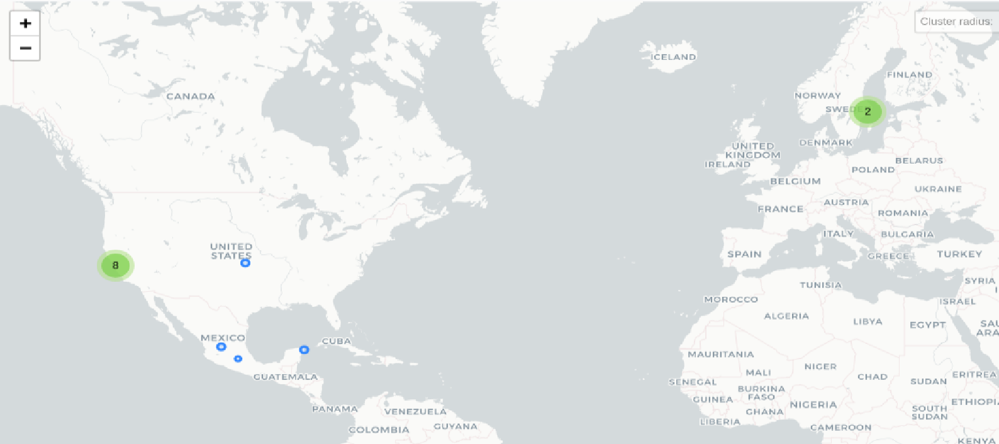

# AirDroid Kids Wizard Parental Control

## Fechas de análisis

- **Análisis estático (mediante Exodus Privacy/MobFS):** 02 de abril 2025
- **Análisis dinámico (mediante análisis de tráfico de red):**  04 de abril 2025
- **Análisis Posteriores:** 
## Resumen de la aplicación

La aplicación AirDroid Wizard Parental Control presenta múltiples señales de alertas criticas que pueden comprometer tanto la seguridad digital como la protección de los derechos digitales de la infancia. La aplicación presenta una combinación de prácticas riesgosas, opacidad técnica y posibles intenciones maliciosas que deben ser consideradas.

Entre los hallazgos más relevantes destacan:

- La aplicación **no está disponible en Google Play Store** y solo puede descargarse desde un enlace externo en formato .apk, evitando los controles de seguridad estándar.

- Se identificó la presencia de **al menos 19 permisos sensibles no declarados** en su política de privacidad, incluyendo acceso a notificaciones, lectura del almacenamiento interno, entre otros, lo cual representa una **violación directa a principios de transparencia y consentimiento informado**.

- La app **no posee dominio asociado conocido**, dificultando su trazabilidad y fiscalización.

- Su funcionalidad se limita a **reenviar datos a una app secundaria**, sin ofrecer herramientas útiles al usuario primario (infancias), lo cual **refuerza su carácter de software de control encubierto**.

- La posibilidad de **ocultar tanto notificaciones como el ícono de la aplicación** evidencia intenciones de operar de forma invisible, comportamiento característico de **stalkerware o spyware**.

- Se detectó además una fuerte presencia de **Tencent, empresa tecnológica china**, dentro de la arquitectura técnica de la aplicación, lo cual puede tener implicaciones en los datos, especialmente tratándose de información sensible de menores.

## Archivos analizados

- [apk versión 2.4.0.1](https://cloud.datavoros.org/index.php/s/d89aLYTXFggAAdS)
- [pcap versión 1](https://cloud.datavoros.org/index.php/s/x77jZp4oAMtFLkJ)
- [Capturas de pantalla](https://cloud.datavoros.org/index.php/s/LZgsogRNLpRLBBq)
- [Reporte MobSF](https://cloud.datavoros.org/index.php/s/8Gdo52yWpgcMeFL)

## Descripción de la aplicación
- **Tipo:**   Aplicación de control parental
- **Costo:**   Descarga gratuita
- **Enlace de descarga:** https://www.airdroid.com/es/download/airdroid-parental-control/?type=kid
- **Descargas:** N/A
- **Ultima fecha de actualización:** 02 de abril 2025
- **Versión:** 2.4.0.1
- **Desarrollador:** [Sand Studio](https://sandstudio.co/)
- **Firma:** [SAND STUDIO CORPORATION LIMITED](https://sandstudio.co/)
- **Contacto:** support@airdroid.com
- **Condiciones de uso y Política de privacidad:** 
	- Términos de servicio: https://kids.airdroid.info/#/Terms
	- Política de privacidad: https://kids.airdroid.info/#/Privacy
    
- **Descripción en la página oficial:**
~~~
Descripción de la página oficial:
AirDroid Parental Control es su herramienta definitiva para monitorear los dispositivos de sus hijos. Desde el seguimiento de su ubicación hasta el monitoreo de sus actividades digitales, permanecerá al tanto y en control. Establezca límites de tiempo de pantalla, verifique el uso de la aplicación e incluso vea su historial de rutas— todo en una aplicación.

~~~

## Rastreadores identificados (mediante MobSF)

**No fue posible detectar los rastreadores en la aplicación.**

## Empresas relacionadas con esta aplicación:

| Empresa                                                                     | Servicios que ofrecen                           |
| --------------------------------------------------------------------------- | ----------------------------------------------- |
| [Tencent](https://www.tencent.com/en-us/)                                   | Telecomunicaciones                              |
| [GigNet S.A. de C.V.](https://gignet.mx/)                                   | Telecomunicaciones                              |
| [Universidad Autonoma de México](https://www.unam.mx/)                      | Estudios universitarios                         |
| [Svensk Teleutveckling & Produktinnovation, STUPI AB](http://www.stupi.se/) | Telecomunicaciones                              |
| [Google](https://marketingplatform.google.com/about/analytics/)             | Publicidad (Ads), analíticas (Google Analytics) |
| [Obehosting AB](https://www.obe.net/)                                       | Servicios en la nube                            |

- En el análisis identificamos diversos tipos de empresas que se relacionan directamente con la aplicación, entre las que destacan son empresas dedicadas a los servicios de telecomunicaciones, servicios de resguardo de información en la nube y puntos de conexión web. 

### Empresas identificadas a través del Aviso de Privacidad con que se comparten datos:

No se mencionan explícitamente otras empresas como parte del procesamiento de datos, pero se dentro de su aviso de privacidad y dentro de la página web, se hace alusión a terceros y proveedores de servicios, además de la empresa desarrolladora de la aplicación que es [Sand Studio](https://sandstudio.co/)
### Dominios integrados al código de la aplicación que no pertenecen directamente a los rastreadores

**No se encontraron dominios integrados en el código.**

## Permisos   

- **Según Exodus Privacy/MobFS:** 19
- **Según prueba de uso:** 13

### Permisos según Exodus Privacy

- ACCESS_NETWORK_STATE
- ACCESS_ADSERVICES_AD_ID
- ACCESS_ADSERVICES_ATRIBUTION
- ACCESS_WIFI_STATE
- CHANGE_NETWORK_SATATE
- CHANGE_WIFI_SATATE
- DID.ACCESS
- DYNAMIC_RECEIVER_NOT_EXPORTED_PERMISSION
- FOREGRAUND_SERVICE
- INTERNET
- KILL_BACKGROUND_PROCESSES
- MODIFY_AUIDIO_SETTINGS
- msa
- :exclamation: POST_NOTIFICATIONS
- QUERY_ALL_PACKAGES
- :exclamation: READ_EXTERNAL_STORAGE
- RECEIVE_BOOT_COMPLETED
- :exclamation: REQUEST_INSTALL_PACKAGES
- REQUEST_DELETE_PACKAGES

El icono :exclamation: indica un nivel 'Peligroso' o 'Especial' de acuerdo a los [niveles de protección de Google](https://developer.android.com/guide/topics/permissions/overview). 

- Tras el análisis con MobFS, se identificó que la aplicación solicita un conjunto amplio de permisos, varios de ellos se consideran sensibles desde una perspectiva de seguridad ya que solicita **permisos para la descarga e instalación de paquetes de terceros y leer el almacenamiento externo**, esto puede vulnerar la seguridad de dispositivo.

### Permisos solicitados durante el uso de la aplicación

- :red_circle: Accesibilidad/Lector de pantalla
- :red_circle: Visualizar sobre otras aplicaciones
- :red_circle: Cámara
- :red_circle: Micrófono
- :red_circle: Uso de usuario
- :red_circle: Notificaciones
- :red_circle: Administrador de dispositivo
- :red_circle: Ubicación
- :red_circle: Permiso de contactos
- :red_circle: Control de llamadas
- :red_circle: Permiso SMS
- :red_circle: Optimización de la batería
- :red_circle: Instalación de aplicaciones de terceros

:red_circle: Este ícono indica un permiso obligatorio   
:blue_circle: Este ícono indica un permiso opcional pero se pierde una funcionalidad particular

- Durante el uso de la aplicación se solicitaron más permisos que los declarados por la aplicación, esto señala una incongruencia entre los permisos que solicita y los que realmente usa al momento de acceder a la aplicación.
## Datos

### Datos solicitados al usuario 

#### Datos solicitados durante el registro

- :red_circle: Nombre de la persona a vigilar
- :red_circle: Fecha de nacimiento

### Datos solicitados al usuario durante el uso de la aplicación

**La aplicación no solicita datos durante su uso.**

:red_circle: Este ícono indica que se debe ingresar este dato de manera obligatoria.   
:blue_circle: Este ícono indica que estos datos son opcionales.

### Tabla de conexiones realizadas durante el uso de la aplicación

| Dirección IP    | Número de Paquetes | País          | Ciudad/Zona | Organización AS                                      | Dominio |
| --------------- | ------------------ | ------------- | ----------- | ---------------------------------------------------- | ------- |
| 43.130.4.190    | 83                 | United States | Santa Clara | Tencent Building, Khejizhingyi Avenue                |         |
| 49.51.35.72     | 66                 | United States | Santa Clara | Tencent Building, Khejizhongyi Avenue                |         |
| 49.51.42.41     | 126                | United States | Santa Clara | Tencent Building, Khejizhongyi Avenue                |         |
| 49.51.181.88    | 927                | United States | Santa Clara | Tencent Building, Khejizhongyi Avenue                |         |
| 49.51.199.235   | 234                | United States | Santa Clara | Tencent Building, Khejizhongyi Avenue                |         |
| 49.51.200.225   | 7,194              | United States | Santa Clara | Tencent Building, Khejizhongyi Avenue                |         |
| 49.51.229.63    | 84                 | United States | Santa Clara | Tencent Building, Khejizhongyi Avenue                |         |
| 170.106.197.185 | 307                | United States | Santa Clara | Tencent Building, Khejizhongyi Avenue                |         |
| 132.248.30.3    | 6                  | México        | Coyoacán    | Universidad Autónoma de México                       |         |
| 192.36.143.130  | 10                 | Sweden        |             | Svensk Teleutveckling & Producktinnovation, STUPI AB |         |
| 192.178.52.138  | 22                 | United States |             | GOOGLE                                               |         |
| 193.182.111.13  | 5                  | Sweden        |             | Obehosting AB                                        |         |

- La tabla de conexiones muestra los servidores remotos que se identificaron mediante el análisis de tráfico de red, se detectó que la aplicación estable conexiones constantes y de gran volumen con la empresa china Tencent alojada en Estados Unidos, además de tener algunos servidores en Suecia que operan como nodos de conexión y servicios de hosting.

### Mapa de conexiones realizadas durante el uso de la aplicación

*Mediante Wireshark*

## Datos recopilados y uso según la página oficial

Al no encontrarse la aplicación en Google PlayStore, la página oficial indica que los datos recopilados por la aplicación son los enlistados:

| Datos                                                          | Uso                                                                                                      |
| -------------------------------------------------------------- | -------------------------------------------------------------------------------------------------------- |
| Dirección de correo electrónico                                | Funciones de la aplicación, estadísticas, comunicaciones del desarrollador y administración de la cuenta |
| Interacciones de la aplicación                                 | Funciones de la aplicación y estadísticas                                                                |
| Historial de búsqueda en la aplicación                         | Funciones de la aplicación y estadísticas                                                                |
| Otras acciones (no especificadas)                              | Funciones de la aplicación y estadísticas                                                                |
| Registros de fallas                                            | Funciones de la aplicación y estadísticas                                                                |
| Diagnóstico                                                    | Funciones de la aplicación y estadísticas                                                                |
| Otros datos de rendimiento de la aplicación (no especificadas) | Funciones de la aplicación y estadísticas                                                                |
| Dispositivo u otros IDs (no especificados)                     | Estadísticas                                                                                             |

### Prácticas de seguridad

- No se pudieron encontrar recomendaciones de practicas de seguridad en la página oficial de la aplicación.

### Datos recopilados y uso según la Política de privacidad

| Datos                                                                                      |
| ------------------------------------------------------------------------------------------ |
| Información personal: Nombre, dirección de correo electrónico, información de la cuneta.   |
| Información del dispositivo: Modelo, sistema operativo, identificadores únicos, red móvil. |
| Datos de uso: Actividad en la aplicación, eventos, funciones utilizadas.                   |
| Datos de ubicación: GPS y señales para la ubicación de la infancia.                        |
| Información de diagnóstico: Registro de errores y rendimiento.                             |

- El análisis revela que los tipos de datos que la aplicación hace una recopilación bastante amplia del comportamiento de la persona usuaria dentro de la aplicación, esto puede contribuir a crear un perfil detallado de la persona usuaria. 

### Uso general de la información según la Política de privacidad

El uso general que desde la política de privacidad se declara es:

- Proveer y operar los servicios de control parental.

- Monitorear la actividad de la infancia y el estado del dispositivo.

- Mejorar el rendimiento, calidad y funcionalidad del producto.

- Proveer soporte técnico y gestionar solicitudes de la persona usuaria.

- Cumplir con obligaciones legales y regulatorias.

- Detectar, prevenir y abordar incidentes de seguridad o fraude.

#### Información compartida con terceros

La aplicación declara que puede compartir la información de las personas usuarias con:

- Proveedores de servicios como almacenamiento en la nube, análisis de datos, atención al cliente.

- Autoridades legales o reguladoras, cuando es requerido por la ley.

- Filiales o subsidiarias dentro del mismo grupo empresarial.

- Terceros en caso de fusión, adquisición o venta de activos.

## Funciones particulares de la aplicación:

Las funciones particulares que se encontraron en la aplicación tras el análisis son: 

- **Supervisión de aplicaciones espía ocultas**  
    AirDroid permite a las madres, padres y personas cuidadoras visualizar todas las aplicaciones instaladas en el dispositivo del menor, incluyendo aquellas que podrían estar ocultas o disfrazadas. Esta función ayuda a identificar y eliminar posibles aplicaciones que podrían comprometer la seguridad del menor.

- **Monitoreo de actividades en redes sociales sin acceso directo**  
    La aplicación ofrece la capacidad de supervisar la actividad del menor en plataformas como Instagram sin necesidad de acceder directamente a sus cuentas. Esto permite a las madres, padres y personas cuidadoras mantenerse informados sobre las interacciones sociales de sus hijos "sin invadir" su privacidad.

- **Alertas instantáneas de contenido sensible**  
    AirDroid envía notificaciones en tiempo real cuando detecta palabras clave o contenidos específicos que podrían ser inapropiados o peligrosos, permitiendo a los padres, madres y personas cuidadoras actuar de manera oportuna.

- **Detección de rastreo y amenazas de seguridad**  
    La aplicación incluye herramientas para identificar si en el dispositivo del menor hay intentos de acceso no autorizados, fortaleciendo así la seguridad digital de la persona usuaria.

- **Historial y seguimiento de ubicación en tiempo real**  
    AirDroid proporciona un historial detallado de las ubicaciones visitadas por el menor y permite a los padres rastrear su ubicación en tiempo real, ofreciendo una capa adicional de seguridad

## Notas

- Al investigar las empresas relacionadas se identifico que *Obehosting* tiene una reputación asociada con el desarrollo de herramientas fraudulentas.

- Esta aplicación en especifico, **no se encuentra en la Google PlayStore**, solamente se encuentra en un enlace de descarga externo, como .apk lo cual es una práctica negativa en el desarrollo de aplicaciones.

- Dentro de la aplicación, no se puede realizar nada, la aplicación solamente funciona como vinculo que envía datos a la aplicación de las personas cuidadoras.

- Además, la aplicación permite ocultar las notificaciones y el icono de la misma en el dispositivo de la infancia.

## Conclusiones

- **Asociación con prácticas fraudulentas :**  
    Se identificó que la empresa vinculada con la aplicación, _Obehosting_, posee una **reputación asociada con el desarrollo de herramientas fraudulentas**, lo que genera **alertas en cuanto a su confiabilidad** y posible incumplimiento de normativas legales y éticas.

- **Distribución por canales no oficiales el cual representa un riesgo de seguridad:**  
    La aplicación **no se encuentra disponible en la Google Play Store**, lo cual impide cualquier tipo de verificación o revisión de seguridad por parte de plataformas oficiales. Solo es accesible a través de un **enlace externo en formato .apk**, práctica considerada riesgosa y fuera de los estándares recomendados en desarrollo de aplicaciones móviles.

- **Ausencia de infraestructura identificable:**  
    Durante el análisis técnico **no se identificó ningún dominio asociado a la aplicación**, lo cual es inusual y preocupante. Esto indica una **falta de trazabilidad de su infraestructura digital**, dificultando la auditoría de sus servidores, responsables técnicos o canales de comunicación de datos.

- **Funcionalidad mínima con enfoque unidireccional:**  
    La aplicación **no ofrece funcionalidades reales al usuario principal**, sino que actúa como un simple **puente de envío de datos hacia otra aplicación controlada por personas cuidadoras**. Esto plantea serias dudas sobre la finalidad legítima del software y **refuerza la hipótesis de que se trata de una herramienta de vigilancia**.

- **Capacidad de operar encubiertamente:**  
    La aplicación permite **ocultar notificaciones y el propio icono en el dispositivo**, lo cual es una funcionalidad característica de aplicaciones diseñadas para operar sin el conocimiento del usuario objetivo, en este caso, las infancias. Este comportamiento **es consistente con herramientas de stalkerware o spyware**, especialmente preocupante en contextos donde el usuario es una persona menor de edad.
### Conclusión especifica

Esta aplicación presenta múltiples indicadores de **riesgos técnicos, éticos y legales.** Por su distribución, su diseño centrado en la **vigilancia encubierta**, la ausencia de infraestructura identificable y su asociación con actores de reputación dudosa configuran un escenario **altamente preocupante para la seguridad digital y los derechos de la infancia**.