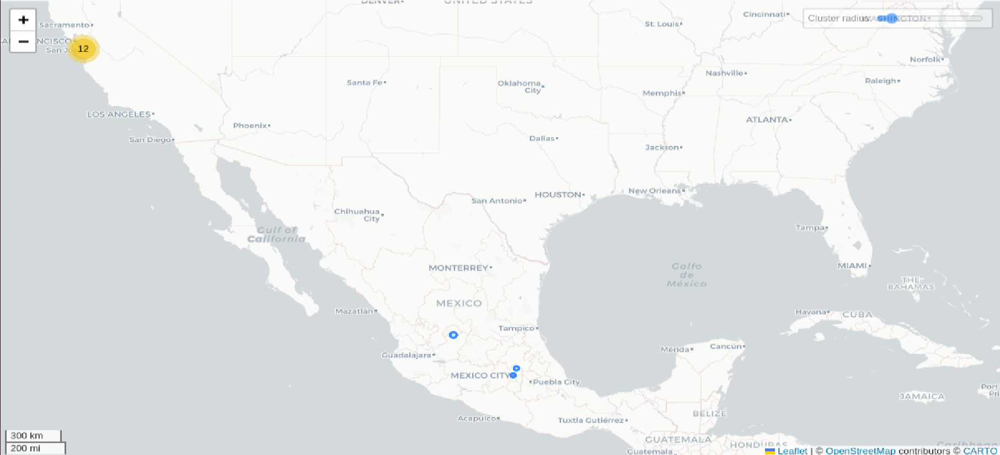

# AirDroid Parental Control

## Fechas de análisis

- **Análisis estático (mediante Exodus Privacy/MobFS):** 02 de abril 2025
- **Análisis dinámico (mediante análisis de tráfico de red):**  04 de abril 2025
- **Análisis Posteriores:** 

## Archivos analizados

- [apk versión ###]()
- [pcap versión ###]()
- [Capturas de pantalla]()
- [Reporte MobSF]()

## Descripción de la aplicación
- **Tipo:**   Aplicación de control parental
- **Costo:**   Descarga gratuita con compras directas desde la aplicación
- **Enlace de descarga:** <https://play.google.com/store/apps/details?id=com.sand.airdroidkidp&hl=es_MX
- **Descargas:** Más de 5 millones de descargas
- **Ultima fecha de actualización:** 02 de abril 2025
- **Versión:** 2.4.0.1
- **Desarrollador:** [Sand Studio](https://sandstudio.co/)
- **Firma:** [SAND STUDIO CORPORATION LIMITED](https://sandstudio.co/)
- **Contacto:** support@airdroid.com
- **Condiciones de uso y Política de privacidad:**
	- Términos de servicio: https://kids.airdroid.info/#/Terms
	- Política de privacidad: https://kids.airdroid.info/#/Privacy
    
- **Descripción en PlayStore:**
~~~
Descripción de la PlayStore
La aplicación AirDroid Parental Control está diseñada para que la seguridad de sus hijos sea una prioridad. Gracias a las funciones de alta seguridad que ofrece AirDroid Parental Control, podrá ponerse fácilmente en contacto con ellos cuando no estén cerca o no puedan responderle a tiempo. Localícelos en un toque, ¡es sumamente fácil!
~~~

## Rastreadores identificados (mediante MobSF)

| Rastreador                                                                     | Tipo              |
| ------------------------------------------------------------------------------ | ----------------- |
| [AutoNavi/Amap](https://reports.exodus-privacy.eu.org/trackers/361)            | Ubicación         |
| [Facebook Analytics](https://reports.exodus-privacy.eu.org/trackers/66)        | Analítica         |
| [Facebook Login](https://reports.exodus-privacy.eu.org/trackers/67)            | Identificación    |
| [Facebook Share](https://reports.exodus-privacy.eu.org/trackers/70)            |                   |
| [Google CrashLytics](https://reports.exodus-privacy.eu.org/trackers/27)        | Informe de fallas |
| [Google Firebase Analytics](https://reports.exodus-privacy.eu.org/trackers/49) | Analítica         |

## Empresas relacionadas con esta aplicación:

| Empresa                                                | Servicios que ofrecen   |
| ------------------------------------------------------ | ----------------------- |
| [IENTC A DE RL DE CV](https://ientc.com/)              | Telecomunicaciones      |
| [Tencent](https://www.tencent.com/en-us/)              | Telecomunicaciones      |
| [Universidad Autónoma de México](https://www.unam.mx/) | Estudios universitarios |

### Empresas identificadas a través del Aviso de Privacidad con que se comparten datos:

- [Sand Studio](https://sandstudio.co/)
- Nota: No se mencionan explícitamente otras empresas como parte del procesamiento de datos, pero se hace alusión a terceros y proveedores de servicios.

### Dominios integrados al código de la aplicación que no pertenecen directamente a los rastreadores

| Dominios                                |
| --------------------------------------- |
| https://192.168.40.201/                 |
| https://airdroid-parent.firebaseio.com/ |
| https://firebase.google.com/            |
| https://issuetracker.google.com/        |

## Permisos   

- **Según Exodus Privacy/MobFS:** 30
- **Según prueba de uso:** 4

### Permisos según Exodus Privacy

- ACCESS
- ACCESS_ADSERVICES_AD_ID
- ACCESS_ADSERVICES_ATRIBUTION
- :exclamation: ACCESS_COARSE_LOCATION
- :exclamation: ACCESS_FINE_LOCATION
- ACCESS_WIFI_STATE
- BILLING
- :exclamation: CAMERA
- CHANGE_NETWORK_SATATE
- CHANGE_RECEIVER_NOT_EXPORTED_PERMISSION
- FOREGRAUND_SERVICE_MICROPHONE
- INTERNET
- MODIFY_AUIDIO_SETTINGS
- msa
- POST_NOTIFICATION
- :exclamation: READ_EXTERNAL_STORAGE
- READ_MEDIA_IMAGES
- READ_MEDIA_VIDEO
- READ_MEDIA_VISUAL_USER_SELECTED
- RECEIVE_BOOT_COMPLETED
- :exclamation: RECORD_AUDIO
- :exclamation: SYSTEM_ALERT_WINDOW
- VIBRATE
- WAKE_LOCK

El icono :exclamation: indica un nivel 'Peligroso' o 'Especial' de acuerdo a los [niveles de protección de Google](https://developer.android.com/guide/topics/permissions/overview). 

### Permisos solicitados durante el uso de la aplicación

- :red_circle: Ubicación
- :red_circle: Optimización de la batería
- :red_circle: Notificaciones
- :red_circle: Accesibilidad

:red_circle: Este ícono indica un permiso obligatorio   
:blue_circle: Este ícono indica un permiso opcional pero se pierde una funcionalidad particular

## Datos

### Datos solicitados al usuario 

#### Datos solicitados durante el registro

- :red_circle: Correo electrónico
- :blue_circle: Nombre

### Datos solicitados al usuario durante el uso de la aplicación

- :red_circle: Nombre
- :red_circle: Correo electrónico

:red_circle: Este ícono indica que se debe ingresar este dato de manera obligatoria.   
:blue_circle: Este ícono indica que estos datos son opcionales.

### Tabla de conexiones realizadas durante el uso de la aplicación
*Ejemplo*

| Dirección IP    | Número de Paquetes | País          | Ciudad/Zona | Organización AS                       | Dominio |
| --------------- | ------------------ | ------------- | ----------- | ------------------------------------- | ------- |
| 10.1.10.1       | 10,777             |               |             |                                       |         |
| 38.194.232.102  | 909                | México        | Tizayaca    | IENTC S DE RL DE CV                   |         |
| 43.130.4.190    | 169                | United States | Santa Clara | Tencent Building, Khejizhingyi Avenue |         |
| 49.51.35.72     | 244                | United States | Santa Clara | Tencent Building, Khejizhongyi Avenue |         |
| 49.51.42.151    | 120                | United States | Santa Clara | Tencent Building, Khejizhongyi Avenue |         |
| 49.51.42.41     | 861                | United States | Santa Clara | Tencent Building, Khejizhongyi Avenue |         |
| 49.51.177.82    | 149                | United States | Santa Clara | Tencent Building, Khejizhongyi Avenue |         |
| 49.51.181.88    | 1,634              | United States | Santa Clara | Tencent Building, Khejizhongyi Avenue |         |
| 49.51.199.235   | 171                | United States | Santa Clara | Tencent Building, Khejizhongyi Avenue |         |
| 49.51.200.225   | 5,923              | United States | Santa Clara | Tencent Building, Khejizhongyi Avenue |         |
| 49.51.229.63    | 282                | United States | Santa Clara | Tencent Building, Khejizhongyi Avenue |         |
| 49.51.230.180   | 181                | United States | Santa Clara | Tencent Building, Khejizhongyi Avenue |         |
| 132.248.3.29    | 2                  | México        | Mexico City | Universidad Autónoma de México        |         |
| 170.106.112.204 | 73                 | United States | Santa Clara | Tencent Building, Khejizhongyi Avenue |         |
| 170.106.197.185 | 49                 | United States | Santa Clara | Tencent Building, Khejizhongyi Avenue |         |

### Mapa de conexiones realizadas durante el uso de la aplicación

*Mediante Wireshark*

### Datos recopilados y uso según la PlayStore

| Datos                                                          | Uso                                                                                           |
| -------------------------------------------------------------- | --------------------------------------------------------------------------------------------- |
| Registros de fallas                                            | Funciones de la aplicación y análisis                                                         |
| Diagnóstico                                                    | Funciones de la aplicación y análisis                                                         |
| Otros datos de rendimiento de la aplicación (no especificadas) | Funciones de la aplicación y análisis                                                         |
| Interacciones de la aplicación                                 | Funciones de la aplicación y análisis                                                         |
| Historial de búsqueda en la aplicación                         | Funciones de la aplicación y análisis                                                         |
| Otras acciones (no especificadas)                              | Funciones de la aplicación y análisis                                                         |
| Dirección de correo electrónico                                | Funciones de la aplicación, análisis, comunicaciones del desarrollador y gestión de la cuenta |
| ID de dispositivo u otros IDs (no especificados)               | Análisis                                                                                      |

### Datos compartidos y uso según la PlayStore

### Prácticas de seguridad

- Cifrado de datos en tránsito: La aplicación indica que cifra los datos durante su transmisión.
- Mecanismo de eliminación de datos: La aplicación señala que los datos no pueden ser borrados por el usuario

### Datos recopilados y uso según la Política de privacidad

| Datos                                                                                      |
| ------------------------------------------------------------------------------------------ |
| Información personal: Nombre, dirección de correo electrónico, información de la cuenta.   |
| Información del dispositivo: Modelo, sistema operativo, identificadores únicos, red móvil. |
| Datos de uso: Actividad en la aplicación, eventos, funciones utilizadas.                   |
| Datos de ubicación: GPS y señales para la ubicación de la infancia.                        |
| Información de diagnóstico: Registro de errores y rendimiento.                             |

### Uso general de la información según la Política de privacidad

- Proveer y operar los servicios de control parental.
- Monitorear la actividad de la infancia y el estado del dispositivo.
- Mejorar el rendimiento, calidad y funcionalidad del producto.
- Proveer soporte técnico y gestionar solicitudes de la persona usuaria.
- Cumplir con obligaciones legales y regulatorias.
- Detectar, prevenir y abordar incidentes de seguridad o fraude.

#### Información compartida con terceros

- Proveedores de servicios como almacenamiento en la nube, análisis de datos, atención al cliente.
- Autoridades legales o reguladoras, cuando es requerido por la ley.
- Filiales o subsidiarias dentro del mismo grupo empresarial.
- Terceros en caso de fusión, adquisición o venta de activos.

## Funciones particulares de la aplicación:
- **Supervisión de aplicaciones espía ocultas**  
    AirDroid permite a las madres, padres y personas cuidadoras visualizar todas las aplicaciones instaladas en el dispositivo del menor, incluyendo aquellas que podrían estar ocultas o disfrazadas. Esta función ayuda a identificar y eliminar posibles aplicaciones espía que podrían comprometer la seguridad del menor.
- **Monitoreo de actividades en redes sociales sin acceso directo**  
    La aplicación ofrece la capacidad de supervisar la actividad del menor en plataformas como Snapchat sin necesidad de acceder directamente a sus cuentas. Esto permite a las madres, padres y personas cuidadoras mantenerse informados sobre las interacciones sociales de sus hijos sin invadir su privacidad.
- **Alertas instantáneas de contenido sensible**  
    AirDroid envía notificaciones en tiempo real cuando detecta palabras clave o contenidos específicos que podrían ser inapropiados o peligrosos, permitiendo a los padres actuar de manera oportuna.
- **Detección de rastreo y amenazas de seguridad**  
    La aplicación incluye herramientas para identificar si el dispositivo del menor está siendo rastreado o si hay intentos de acceso no autorizados, fortaleciendo así la seguridad digital del usuario.
- **Historial y seguimiento de ubicación en tiempo real**  
    AirDroid proporciona un historial detallado de las ubicaciones visitadas por el menor y permite a los padres rastrear su ubicación en tiempo real, ofreciendo una capa adicional de seguridad
## Notas

- La aplicación al momento de la descarga no notifica que tiene un periodo de prueba, al pasar 10 días, esta prueba termina y comienza a negar la posibilidad de uso de algunos servicios de la aplicación.
- La aplicación es muy intuitiva y fácil de usar para las personas cuidadoras, tiene una interfaz amigable y de sencillo uso.
- La aplicación de la persona cuidadora es la que mantiene el control de la aplicación de la infancia, en ella pueden acceder de manera remota servicios del dispositivo de la infancia como la cámara, el micrófono, la pantalla total del dispositivo así como recibir en tiempo real todas las notificaciones del dispositivo de la infancia.

## Conclusiones

La aplicación, aunque es funcional y aparentemente amigable para las personas cuidadoras, tiene un diseño intrusivo que plantea serias dudas en términos de protección de datos personales, transparencia, consentimiento informado y derechos de la infancia.
### Conclusión especifica
- **Falta de trasparencia en la activación del periodo de prueba**: 
	- Hay una **falla de transparencia** que puede ser considerada una mala práctica según estándares de protección de datos.
- **Capacidades remotas intrusivas desde el dispositivo de la persona cuidadora**
	- Cámara, micrófono, pantalla, notificaciones: en tiempo real y sin presencia física.
	- Implicación directa: La aplicación permite una **vigilancia constante**, lo que la coloca peligrosamente cerca del territorio del **control excesivo o potencial vigilancia encubierta**.
	- Según su propia política de privacidad, **se recolectan datos sensibles**, incluyendo contenidos generados por la persona usuaria, datos de dispositivos y redes, y comportamientos de uso.
- **Uso de datos personales y consentimiento infantil**
	- La app recopila **información personal de menores**, lo cual **exige el consentimiento explícito de los tutores legales**.
	- Aunque en su política mencionan que **los datos del menor son controlados por la cuenta del padre, madre o persona cuidadora**, no queda claro cómo y cuándo se solicita ese consentimiento informado ni si se valida la edad.
	- Desde un enfoque de **privacidad por diseño**, esto es insuficiente y roza una **violación potencial de los derechos de la infancia** al no garantizar mecanismos claros de protección.
- **Compatibilidad entre funcionalidad y principios de minimización de datos**
	- El nivel de acceso remoto que se ofrece **no guarda proporción con la función declarada** de acompañamiento o seguridad infantil. Grabar audio, video y pantalla completa en tiempo real puede **exceder con lo necesario** para fines de supervisión legítimos.
	- El diseño actual de la aplicación parece estar **orientado al control total, no al acompañamiento respetuoso**.
