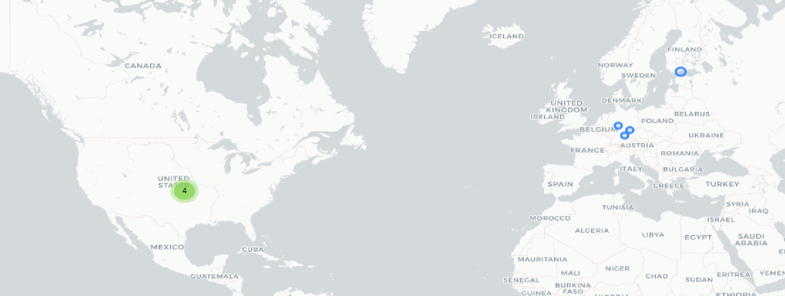

# Alli360 by Kids360

## Fechas de análisis

- **Análisis estático (mediante Exodus Privacy/MobFS):** 02 de abril 2025
- **Análisis dinámico (mediante análisis de tráfico de red):**  04 de abril 2025
- **Análisis Posteriores:** 
## Resumen de la aplicación

La aplicación Alli360, dirigida a dispositivos utilizados por niños, niñas y adolescentes, presenta una serie de funcionalidades que podrían enmarcarse dentro del discurso del control parental, pero **superan ampliamente los límites aceptables desde una perspectiva de derechos digitales, privacidad y autonomía de la infancia**.

Entre los principales hallazgos encontramos: 

- **Control total del dispositivo**: Alli360 bloquea completamente la descarga y la desinstalación de aplicaciones, eliminando toda posibilidad de gestión autónoma del entorno digital por parte de la infancia.

- **Censura y restricciones absolutas**: La aplicación impide el ingreso a cualquier aplicación que haya sido bloqueada por la persona cuidadora, sin permitir excepciones, moderación o participación del menor en dichas decisiones.

- **Vigilancia en tiempo real**: La aplicación **transmite todas las notificaciones del dispositivo de la infancia al dispositivo de la persona cuidadora**, generando una intercepción constante de la vida digital.

- **Gamificación del acceso a derechos digitales**: El diseño de la aplicación condiciona el uso de aplicaciones a la realización de tareas impuestas por la persona adulta, generando un sistema de “tiempo ganado” que **refuerza dinámicas de obediencia sin agencia propia**, desdibujando la línea entre educación digital y castigo conductual.

- **Permisos intrusivos no declarados:** Se identificó que la aplicación solicita permisos críticos que no están declarados en su ficha de Google Play Store, incluyendo:
    - Lectura del estado y la identidad del teléfono
    - Grabación de audio
    - Acceso al almacenamiento externo  
        Estos permisos amplían las capacidades de recolección de datos personales sin el consentimiento informado de la persona usuaria.
    
- **Infraestructura cuestionable**: El principal actor identificado en la infraestructura digital es **Hetzner Online GmbH**, empresa alemana de hosting. Aunque esta legalmente establecida, **su historial en el alojamiento de servicios sin suficiente control de uso ha sido cuestionado en contextos de aplicaciones de vigilancia**. Esto refuerza el riesgo de falta de auditoría y supervisión sobre los datos almacenados y transmitidos.

## Archivos analizados

- [apk versión 2.47.1](https://cloud.datavoros.org/index.php/s/CzFPKmYrNNxtEL2)
- [pcap versión 1](https://cloud.datavoros.org/index.php/s/yLc4Dk3jciKW6Pb)
- [Capturas de pantalla](https://cloud.datavoros.org/index.php/s/CGzPzpzsiK3amdE)
- [Reporte MobSF](https://cloud.datavoros.org/index.php/s/KHPXEXHdpkmmzin)

## Descripción de la aplicación
- **Tipo:**   Aplicación de control parental
- **Costo:**   Descarga gratuita
- **Enlace de descarga:** https://play.google.com/store/apps/details?id=app.kids360.kid&hl=es_MX
- **Descargas:** Más de 1 millón de descargas
- **Ultima fecha de actualización:** 01 de abril 2025
- **Versión:** 2.47.1
- **Desarrollador:** [ANKO Solutions LLC](https://www.anko.solutions/)
- **Firma:** [ANKO Solutions L.L.C.](https://www.anko.solutions/)
- **Contacto:** support@kids360.app
- **Condiciones de uso y Política de privacidad:**
	- Términos de servicio: https://kids360.app/term-of-use
	- Política de privacidad: https://kids360.app/privacy-policy
    
- **Descripción en PlayStore:**
~~~
Descripción de la PlayStore
Alli360 — es un servicio que ayuda a los padres a establecer límites de tiempo para los niños en aplicaciones de entretenimiento y juegos  
  
**La aplicación Alli360 complementa la aplicación "Kids360 para padres" y debe instalarse en el dispositivo que usa el adolescente**
~~~

## Rastreadores identificados (mediante Exodus Privacy)

| Rastreador                                                                        | Tipo                           |
| --------------------------------------------------------------------------------- | ------------------------------ |
| [AppsFlyer](http://appsflyer.com/)                                                | Analítica                      |
| [Google CrashLytics](http://crashlytics.com/)                                     | Informe de fallas              |
| [Google Firebase Analytics](https://firebase.google.com/)                         | Analítica                      |
| [Huawei Mobile Sevicies (HMS) Core](https://developer.huawei.com/consumer/en/hms) | Ubicación, Anuncios, Analítica |

[Enlace al reporte de Exodus Privacy](https://reports.exodus-privacy.eu.org/es/reports/app.kids360.kid/latest/#trackers)

- El reporte de Exodus Privacy indica que la aplicación utiliza diversas herramientas de analítica, informe de fallas y para tener un publicidad personalizada, esto se declara para mejorar la experiencia de uso de la persona usuaria.
## Empresas relacionadas con esta aplicación:

| Empresa                                                         | Servicios que ofrecen                                    |
| --------------------------------------------------------------- | -------------------------------------------------------- |
| [Amazon](https://aws.amazon.com/es/?nc2=h_lgl)                  | Publicidad, servicios en la nube (AWS)                   |
| [Hetzner Online GmbH](https://www.hetzner.com/)                 | Servicios de almacenamiento e infraestructura en la nube |
| [Google](https://marketingplatform.google.com/about/analytics/) | Publicidad (Ads), analíticas (Google Analytics)          |
| [Anko Solution LLC](https://www.anko.solutions/)                | Empresa desarrolladora                                   |

- En el análisis identificamos diversos tipos de empresas que se relacionan directamente con la aplicación, entre las que destacan son empresas dedicadas a los servicios de publicidad, resguardo de información en la nube y la empresa desarrolladora de la aplicación. 

### Empresas identificadas a través del Aviso de Privacidad con que se comparten datos:

- [ANKO SOLUTION LCC](https://www.anko.solutions/)

Nota: Tras el análisis de la política de privacidad de Kids360, no se mencionan otras empresas específicas, sin embargo, hay referencias al uso de herramientas de análisis de terceros para recopilar datos analíticos, también hace referencia a socios comerciales. Esto no concuerda con lo encontrado en el análisis.

### Dominios integrados al código de la aplicación que no pertenecen directamente a los rastreadores

| Dominios                                 |
| ---------------------------------------- |
| https://kids360kid.page.link             |
| https://play.google.com/                 |
| https://www.slf4j.org/                   |
| https://issuetracker.google.com/         |
| https://kids360.app                      |
| https://kids-360-parental.firebaseio.com |
| https://developer.android.com            |
| https://github.com                       |
| https://developer.apple.com              |
| https://af-alli360.kids360.app           |
| https://aomedia.org                      |
| https://logiclike.com                    |

- Los dominios encontrados pertenecen mayormente a servicios de terceros para la analítica, la gestión de los datos, el desarrollo del código de la aplicación y mejoras dentro de la misma.

## Permisos   
- **Según Exodus Privacy/MobFS:** 36
- **Según prueba de uso:** 4
### Permisos según Exodus Privacy

- ACCESS_ADSERVICES_AD_ID
- ACCESS_ADSERVICES_ATTRIBUTION
- :exclamation: ACCESS_BACKGROUND_LOCATION
- :exclamation: ACCESS_COARSE_LOCATION
- :exclamation: ACCESS_FINE_LOCATION
- ACCESS_NETWORK_STATE
- ACCESS_WIFI_STATE
- :exclamation: ACTIVITY_RECOGNITION
- CHANGE_WIFI_STATE
- FOREGROUND_SERVICE
- FOREGROUND_SERVICE_LOCATION
- FOREGROUND_SERVICE_SPECIAL_USE
- INTERNET
- PACKAGE_USAGE_STATS
- POST_NOTIFICATIONS
- QUERY_ALL_PACKAGES
- :exclamation: READ_EXTERNAL_STORAGE
- :exclamation: READ_PHONE_STATE
- RECEIVE_BOOT_COMPLETED
- :exclamation: RECORD_AUDIO
- REQUEST_DELETE_PACKAGES
- REQUEST_IGNORE_BATTERY_OPTIMIZATIONS
- SCHEDULE_EXACT_ALARM
- :exclamation: SYSTEM_ALERT_WINDOW
- USE_FINGERPRINT
- USE_FULL_SCREEN_INTENT
- VIBRATE
- WAKE_LOCK
- :exclamation: WRITE_EXTERNAL_STORAGE
- DYNAMIC_RECEIVER_NOT_EXPORTED_PERMISSION
- RECEIVE
- BIND_GET_INSTALL_REFERRER_SERVICE
- AD_ID
- GET_COMMON_DATA
- ACCESS_INTERFACE

El icono :exclamation: indica un nivel 'Peligroso' o 'Especial' de acuerdo a los [niveles de protección de Google](https://developer.android.com/guide/topics/permissions/overview). 

- Tras el análisis se identificó que la aplicación solicita un conjunto amplio de permisos, varios de ellos se consideran sensibles desde una perspectiva de privacidad ya que solicita **permisos a la ubicación precisa, grabar audio o leer el estado total del dispositivo**, además de la capacidad de mostrar ventanas sobre otras aplicaciones.
### Permisos solicitados durante el uso de la aplicación

- :red_circle: Acceso a datos
- :red_circle: Accesibilidad
- :red_circle: Mostrar sobre otras aplicaciones
- :red_circle: Optimización de batería 

:red_circle: Este ícono indica un permiso obligatorio   
:blue_circle: Este ícono indica un permiso opcional pero se pierde una funcionalidad particular

- Durante el uso de la aplicación se solicitaron los permisos enlistados, esto señala una congruencia entre algunos de los permisos que solicita y los que realmente usa al momento de acceder a la aplicación.
## Datos

### Datos solicitados al usuario 

#### Datos solicitados durante el registro

- :red_circle: Correo electrónico
- :blue_circle: Nombre

### Datos solicitados al usuario durante el uso de la aplicación

- Durante el uso de la aplicación no se solicitan más datos de la persona usuaria.

:red_circle: Este ícono indica que se debe ingresar este dato de manera obligatoria.   
:blue_circle: Este ícono indica que estos datos son opcionales.

### Tabla de conexiones realizadas durante el uso de la aplicación

| Dirección IP    | Número de Paquetes | País          | Ciudad/Zona | Organización AS     | Dominio |
| --------------- | ------------------ | ------------- | ----------- | ------------------- | ------- |
| 3.161.10.68     | 31                 | United States |             | AMAZON-02           |         |
| 49.13.202.210   | 76                 | Germany       | Numberg     | Hetzner Online GmbH |         |
| 66.23.231.30    | 28                 | United States |             | IS-AS-1             |         |
| 95.216.209      | 553                | Finland       | Helsinki    | Hetzner Online GmbH |         |
| 116.202.117.176 | 40                 | Germany       | Falkenstein | Hetzner Online GmbH |         |
| 167.235.81.130  | 24                 | Germany       |             | Hetzner Online GmbH |         |
| 192.178.56.10   | 24                 | United States |             | GOOGLE              |         |
| 192.178.56.132  | 192                | United States |             | GOOGLE              |         |

- La tabla de conexiones muestra los servidores remotos que se identificaron mediante el análisis de tráfico de red, se detectó que la aplicación establece conexiones constantes y de gran volumen con la empresa alemana *Hetzener Online GmbH* la cual es una empresa especializada en centros de datos.

### Mapa de conexiones realizadas durante el uso de la aplicación

*Mediante Wireshark*

### Datos recopilados y uso según la PlayStore

Google PlayStore indica que los datos recopilados por la aplicación son los enlistados:

| Datos                                                         | Uso                                       |
| ------------------------------------------------------------- | ----------------------------------------- |
| Registro de fallas                                            | Estadísticas                              |
| Diagnostico                                                   | Estadísticas                              |
| Otros datos de rendimiento de la aplicación (No especificado) | Estadísticas                              |
| Historial de navegación en la Web                             | Funciones de la aplicación                |
| Interacciones en la aplicación                                | Funciones de la aplicación y estadísticas |
| Aplicaciones de instaladas                                    | Funciones de la aplicación                |
| Otro contenido generado por usuarios (No especificado)        | Funciones de la aplicación                |
| Otras acciones (No especificado)                              | Estadísticas                              |

- El análisis revela que la aplicación recopila gran cantidad de datos con una descripción ambigua, recolecta datos desde fallas técnicas hasta el historial de la persona usuaria, esto puede crear un perfilamiento de la persona usuaria.
### Datos compartidos y uso según la PlayStore

### Prácticas de seguridad

- La aplicación indica que "*Cifrado de datos en tránsito:* La aplicación indica que cifra los datos durante su transmisión." lo cual según nuestro análisis es correcto.

- La aplicación indica que "*Mecanismo de eliminación de datos:* La aplicación señala que los datos pueden ser borrados por el usuario." lo cual no fue posible de probar en este análisis y queda sin confirmar.

### Datos recopilados y uso según la Política de privacidad

| Datos                                                                          |
| ------------------------------------------------------------------------------ |
| Datos de registro: Nombre, correo electrónico                                  |
| Ubicación del dispositivo de la persona menor                                  |
| Datos del dispositivo: Modelo, Sistema operativo, identificadores              |
| Datos de uso de la aplicación: Acciones dentro de la aplicación, tiempo de uso |
| Análisis estadístico                                                           |

- La aplicación recopila una **amplia lista de datos personales, técnicos y de comportamiento de la persona usuaria** como identificadores personales, información del dispositivo usado y la ubicación. Esto **concuerda con lo declarado en la PlayStore** además de lo dicho anteriormente, puede **construir un perfil detallado de la persona usuaria**.
### Uso general de la información según la Política de privacidad

El uso general que desde la política de privacidad se declara es:

- Ayudar a los padres, madres y personas cuidadoras a monitorear y garantizar la seguridad de la persona menor en su entorno digital y físico.

- Seguimiento de la persona menor en tiempo real.

- Notificaciones sobre el movimiento de la persona menor o salidas de zonas seguras.

- Recopilación de datos de uso del dispositivo de la persona menor.

- Soporte técnico y mejora continua de la experiencia de usuario.

#### Información compartida con terceros

La aplicación declara que puede compartir la información de las personas usuarias con:

- La aplicación indica que en casi de ser requeridos de manera legal o por parte de autoridades, los datos que se soliciten se compartirán con estos organismos.

- La aplicación señala que los datos técnicos y de uso, como el uso de la aplicación e interacciones con funciones de la aplicación, se compartirán con fines comerciales.

- La aplicación señala que los datos proporcionados por la persona usuaria se comparten directamente con los servicios de la aplicación.

## Funciones particulares de la aplicación:

Las funciones particulares que se encontraron en la aplicación tras el análisis son: 

-  Acceso amplio a datos del dispositivo de la persona menor:
	- Recopilan datos técnicos y del uso del dispositivo.
	- No esta claro hasta que punto acceden a estos datos como historial de navegación, contactos o mensajes.

-  Herramientas de análisis de terceros no identificadas:
	- Mencionan que usan herramientas analíticas pero no se especifican quienes son estas empresas ni que datos exactamente recopilan.

-  Recopilación de datos con la aplicación en segundo plano o sin uso activo:
	- La política no aclara este uso de la aplicación, sin embargo, la aplicación si se ejecuta en segundo plano.

-  Uso genérico de "socios comerciales":
	- Aunque en la política de privacidad dice que no comparte datos salvo bajo obligación legal, hacen referencia a "partners" y servicios vinculados no especificados.

-  Retención de datos sin plazos concretos
	- No se especifica con claridad cuánto tiempo retienen los datos ni bajo que criterios los eliminan.

## Notas

- La aplicación bloquea de manera total la descarga y la desinstalación de aplicaciones en el dispositivo de la infancia.

- La aplicación bloquea de manera total el ingreso a las aplicaciones bloqueadas por la persona cuidadora.

- La aplicación manda en tiempo real las notificaciones del dispositivo de la infancia al dispositivo de la persona cuidadora.

## Conclusiones

- **Diseñada para el control absoluto, no el acompañamiento digital:**  
    La aplicación implementa un modelo de **control total** sobre el dispositivo de la infancia, sin espacio para la mediación o el consentimiento. El bloqueo completo de descargas, desinstalaciones y acceso a aplicaciones, convierte el dispositivo en un entorno cerrado y rígido.

- **Vigilancia intrusiva y en tiempo real:**  
    La transmisión continua de notificaciones desde el dispositivo de la infancia al dispositivo de la persona cuidadora constituye una forma de **vigilancia persistente**, incompatible con los principios de proporcionalidad y privacidad. Esta lógica reproduce prácticas más cercanas al espionaje que al cuidado.

- **Mecanismo de control conductual gamificado:**  
    La aplicación impone un sistema de recompensas donde las infancias deben cumplir tareas impuestas por la persona adulta para "ganar" tiempo de uso. Esto genera una **relación transaccional con el acceso a derechos digitales**, que puede afectar negativamente el desarrollo de la autonomía, la autoestima y la confianza.

- **Incumplimiento de transparencia y políticas de privacidad:**  
    Alli360 **solicita permisos altamente sensibles** (como lectura del estado del teléfono y del almacenamiento externo) **sin declararlos en la Play Store ni en su política de privacidad**, violando estándares mínimos de transparencia y consentimiento informado.

- **Riesgo elevado por infraestructura opaca:**  
    La aplicación utiliza servidores alojados en **Hetzner Online GmbH**, una empresa que, aunque legítima, ha sido señalada por alojar servicios sin suficiente supervisión. Esto **plantea dudas sobre la custodia, seguridad y jurisdicción de los datos recolectados**, especialmente considerando que se trata de datos de menores.

- **Inadecuación para contextos de crianza respetuosa o educativos:**  
    Las dinámicas que impone esta aplicación no solo obstaculizan el desarrollo digital de la infancia, sino que también **consolidan un modelo autoritario** de relación adulto-niño, lo cual la hace incompatible con enfoques de crianza respetuosa, educación basada en derechos o metodologías participativas.

### Conclusión especifica

La aplicación Alli360 representa un riesgo para la seguridad digital, la privacidad y el desarrollo de las infancias. No puede considerarse una herramienta ética ni apropiada de acompañamiento parental. Se sugiere **evitar su uso e investigar sus prácticas de tratamiento de datos personales**.