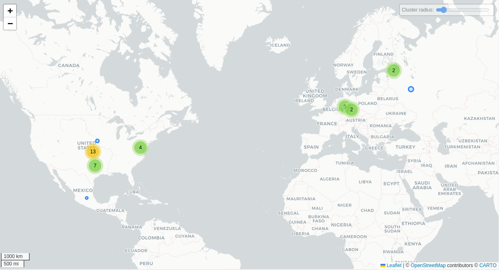

# Find my Kids (padres)

## Fechas de análisis

- **Análisis estático (mediante Exodus Privacy/MobFS):** 07/04/2025
- **Análisis dinámico (mediante análisis de tráfico de red):** 10/04/2025
- **Análisis Posteriores:** 

## Archivos analizados

- [apk versión 2.8.91]()
- [pcap versión 2.7.1]()
- [Capturas de pantalla]()
- [Reporte MobSF]()

## Descripción de la aplicación
- **Tipo:**   Aplicación de control parental (Parenting)
- **Costo:**  Freemium
- **Enlace de descarga:** https://play.google.com/store/apps/details?id=org.findmykids.app&hl=es_MX
- **Descargas:** 50,000,000
- **Ultima fecha de actualización:** 03/04/2025
- **Versión:** 2.8.91
- **Desarrollador:** LETEM LTD
- **Firma:** LETEM LTD
- **Contacto:** support@findmykids.org
- **Condiciones de uso y Política de privacidad:**
    
- **Descripción en PlayStore:**
~~~
**Con esta app de seguimiento de la ubicación de persona por su teléfono, puedes consultar tanto la ubicación de un móvil como su ubicación en tiempo real. Si alguna vez te has preguntado: “¿Es posible permitir que mi familia conozca mi ubicación? ¿Puedo ubicar mi dispositivo para rastreo de ubicación con GPS?” La respuesta es sí: con nuestra app, tu familia estará siempre conectada.**  
  
**Conecta un reloj GPS o instala una app especial como localizador en el teléfono de tu hijo para usarla como localizador familiar. ¿Te has preguntado: “¿Cómo saber mi ubicación? ¿O cómo ubicar mi dispositivo para rastreo de ubicación con GPS?” La solución está a un clic de distancia. Find My Kids permite a los padres no preocuparse cuando sus hijos no contestan llamadas o están lejos.**  
  
**Funciones principales:**  
  
**Localizador GPS** – Consulta la ubicación de un móvil y la ubicación en tiempo real de tu hijo en el mapa. Revisa su historial de movimientos durante el día y asegúrate de que no visite lugares peligrosos.  
  
**Sonidos alrededor** – Verifica lo que ocurre cerca de tu hijo para asegurarte de que está bien y en buena compañía.  
  
**Sonido fuerte** – Envía una señal acústica al móvil de tu hijo si está en modo silencioso o perdido.  
  
**Control de apps** – Descubre qué apps usa y asegúrate de que presta atención en clase.  
  
**Seguridad** – Recibe alertas cuando tu hijo llegue a la escuela, casa u otros lugares configurados.  
  
**Supervisa el nivel de batería** – Haz un seguimiento del nivel de batería del móvil de tu hijo y recuérdale cargarlo cuando sea necesario. La app te avisará si el nivel es bajo.  
  
**Chat familiar** – Comunícate mediante un chat privado con stickers divertidos.

**Reacciones positivas** – Hazle saber que estás orgulloso enviando corazones y otras reacciones.  
  
**Control parental y localizador familiar**  
  
Find My Kids tiene como único objetivo garantizar la seguridad de tu familia. Funciona como un localizador familiar, facilitando el control parental mediante su sistema de rastreo GPS. La app de seguimiento de la ubicación de persona por su teléfono no puede instalarse de manera secreta y su uso requiere el consentimiento explícito del menor. Además, los datos personales se almacenan siguiendo estrictamente las legislaciones y políticas del RGPD.  

**Si tu hijo tiene un smartphone:**  
  
Instala la app Pingo! en el móvil de tu hijo con GPS. A diferencia de otras aplicaciones similares, nuestro servicio utiliza el localizador GPS en un modo de ahorro de energía.  
  
~~~

## Rastreadores identificados (mediante Exodus Privacy)
| Rastreador                                                                                  | Tipo                                          |
| ------------------------------------------------------------------------------------------- | --------------------------------------------- |
| [AppsFlyer](https://reports.exodus-privacy.eu.org/en/trackers/12/)                          | Analíticas                                    |
| [Google CrashLytics](https://reports.exodus-privacy.eu.org/en/trackers/27/)                 | Reporte de fallos                             |
| [Google Firebase Analytics](https://reports.exodus-privacy.eu.org/en/trackers/49/)          | Analíticas                                    |
| [Huawei Mobile Services (HMS) Core](https://reports.exodus-privacy.eu.org/en/trackers/333/) | Ubicación, Publicidad y marketing, Analíticas |

[Leer el reporte de Exodus Privacy](https://reports.exodus-privacy.eu.org/en/reports/org.findmykids.app/latest/)

## Empresas relacionadas con esta aplicación:

| Empresa                                                             | Servicios que ofrecen                                                       |
| ------------------------------------------------------------------- | --------------------------------------------------------------------------- |
| [Hetzner Online GmbH](https://www.hetzner.com/legal/privacy-policy) | Infraestructura en la nube, almacenamiento, servidores y cómputo escalable. |
| [Google](https://google.com)                                        | Publicidad (Ads), analíticas (Google Analytics).                            |
| [Amazon Web Services (AWS)](https://aws.amazon.com)                 | Infraestructura en la nube, almacenamiento, servidores y cómputo escalable. |
| [Akamai International](https://www.akamai.com/)                     | Infraestructura en la nube, almacenamiento, servidores y cómputo escalable. |
| [DoubleGIS LLC]()                                                   | Desarrollo de Mapas, herramientas de geoanálisis.                           |
| [JSC Selectel](https://selectel.ru/en/)                             | Infraestructura en la nube, almacenamiento, servidores y cómputo escalable. |
| [Facebook](https://facebook.com)                                    | Publicidad (Ads), redes sociales, analíticas, servicios de mensajería.      |
| [Cloudflare](https://www.cloudflare.com/)                           | Infraestructura en la nube, almacenamiento, servidores y cómputo escalable. |

### Empresas identificadas a través del Aviso de Privacidad con que se comparten datos:

- [Selectel Ltd](https://selectel.ru/en/about/documents/)
- [Hetzner Online GmbH](https://www.hetzner.com/legal/privacy-policy)
- [Google Cloud Platform](https://policies.google.com/privacy?hl=en)
- [Intercom, Inc.](https://www.intercom.com/legal/privacy)
- [Rocket Science Group LLC (“Mailchimp”)](https://www.intuit.com/privacy/statement/)
- [eSputnik Inc.](https://www.esputnik.com/)
- [Facebook Inc.](https://www.facebook.com/privacy/policy/)
- [UserX Analytics -BUMPIN L.L.C-FZ. ](https://userx.pro/privacy)

### Dominios integrados al código de la aplicación que no pertecen directamente a los rastreadores

| Dominios                                    |
| ------------------------------------------- |
| https://apache.org                          |
| https://nav2-cn.ronghub.com                 |
| https://sviap.s                             |
| https://graph-video.s                       |
| https://analytics.us.tiktok.com             |
| https://feedback.cn.ronghub.com             |
| https://ns.adobe.com                        |
| https://youtrack.jetbrains.com              |
| https://cdn.apkmonk.com                     |
| https://webview.findmykids.org              |
| https://schemas.android.com                 |
| https://sadrevenue.s                        |
| https://www.slf4j.org                       |
| https://scdn-ssettings.s                    |
| https://sdlsdk.s                            |
| https://developer.android.com               |
| https://github.com                          |
| https://www.baidu.com                       |
| https://billing.findmykids.org              |
| https://goo.gle                             |
| https://offer.gdemoideti.ru                 |
| https://sars.s                              |
| https://sconversions.s                      |
| https://shop.gdemoideti.ru                  |
| https://www.w3.org                          |
| https://fundingchoicesmessages.google.com   |
| https://firebase-settings.crashlytics.com   |
| https://webview.kidstracker.pro             |
| https://svalidate.s                         |
| https://facebook.com                        |
| https://ya.ru                               |
| https://sgcdsdk.s                           |
| https://simpression.s                       |
| https://sinapps.s                           |
| https://developers.facebook.com             |
| https://play.google.com                     |
| https://app.resubscribe.ai                  |
| https://ssdk-services.s                     |
| https://sregister.s                         |
| https://privacy-sandbox.appsflyersdk.com    |
| https://form.typeform.com                   |
| https://scdn-stestsettings.s                |
| https://smonitorsdk.s                       |
| https://where-is-my-children.firebaseio.com |
| https://webview.gdemoideti.ru               |
| https://l.gdemoideti.ru                     |
| https://gdemoideti.onelink.me               |
| https://gdemoideti.ru                       |
| https://graph.s                             |
| https://api.resubscribe.ai                  |
| https://offer.findmykids.org                |
| https://sapp.s                              |
| https://sattr.s                             |
| https://slaunches.s                         |
| https://junior.mts.ru                       |
| https://tile.openstreetmap.org              |
| https://issuetracker.google.com             |
| https://findmykids.org                      |
| https://developer.apple.com                 |
| https://svalidate-and-log.s                 |
| https://spia.s                              |
| https://ktor.io                             |
| https://javax.xml.xmlconstants              |
| https://firebase.google.com                 |
| https://52.83.240.50                        |
| https://gps-watch.findmykids.org            |
| https://app-measurement.com                 |
| https://l.findmykids.org                    |
| https://www.openstreetmap.org               |
| https://aomedia.org                         |
| https://www.google.ru                       |
| https://api.findmykids.org                  |
| https://nav.cn.ronghub.com                  |
| https://stats.cn.ronghub.com                |
| https://sonelink.s                          |

## Permisos   

- **Según Exodus Privacy/MobFS:** 33
- **Según prueba de uso:** 3

### Permisos según Exodus Privacy

- ACCESS_ADSERVICES_AD_ID
- ACCESS_ADSERVICES_ATTRIBUTION
- ACCESS_ADSERVICES_CUSTOM_AUDIENCE
- :exclamation: ACCESS_COARSE_LOCATION: access approximate location only in the foreground
- :exclamation: ACCESS_FINE_LOCATION: access precise location only in the foreground
- ACCESS_NETWORK_STATE: view network connections
- ACCESS_WIFI_STATE: view Wi-Fi connections
- BLUETOOTH: pair with Bluetooth devices
- :exclamation: CAMERA: take pictures and videos
- CHANGE_WIFI_STATE: connect and disconnect from Wi-Fi
- FOREGROUND_SERVICE: run foreground service
- FOREGROUND_SERVICE_DATA_SYNC
- FOREGROUND_SERVICE_MEDIA_PLAYBACK
- INTERNET: have full network access
- MODIFY_AUDIO_SETTINGS: change your audio settings
- POST_NOTIFICATION
- :exclamation:  READ_CONTACTS: read your contacts
- :exclamation: READ_EXTERNAL_STORAGE: read the contents of your shared storage
- RECEIVE_BOOT_COMPLETED: run at startup
- :exclamation: RECORD_AUDIO: record audio
- :exclamation: SYSTEM_ALERT_WINDOW: This app can appear on top of other apps
- VIBRATE: control vibration
- WAKE_LOCK: prevent phone from sleeping
- :exclamation: WRITE_EXTERNAL_STORAGE: modify or delete the contents of your shared storage
- BILLING
- RECEIVE
- BIND_GET_INSTALL_REFERRER_SERVICE
- AD_ID
- GET_COMMON_DATA
- READ_APP_INFO
- READ
- WRITE
- DYNAMIC_RECEIVER_NOT_EXPORTED_PERMISSION

El icono :exclamation: indica un nivel 'Peligroso' o 'Especial' de acuerdo a los [niveles de protección de Google](https://developer.android.com/guide/topics/permissions/overview). 

### Permisos solicitados durante el uso de la aplicación

- :red_circle: Ubicación
- :red_circle: Notificaciones
- :red_circle: Acceso a contactos

:red_circle: Este ícono indica un permiso obligatorio   
:blue_circle: Este ícono indica un permiso opcional pero se pierde una funcionalidad particular

## Datos

### Datos solicitados al usuario 

#### Datos solicitados durante el registro

- :red_circle: Correo electrónico
- :red_circle: Nombre del tutor
- :blue_circle: Nombre del hijo (puede ser un alias)
### Datos solicitados al usuario durante el uso de la aplicación

- :blue_circle:  Teléfono  de contacto para el botón de pánico    
- :blue_circle: Cuenta de otras personas adultas de confianza

:red_circle: Este ícono indica que se debe ingresar este dato de manera obligatoria. 
:blue_circle: Este ícono indica que estos datos son opcionales.

### Tabla de conexiones realizadas durante el uso de la aplicación

| Dirección IP   | Número de Paquetes | País          | Ciudad/Zona    | Organización AS           | Dominio |
| -------------- | ------------------ | ------------- | -------------- | ------------------------- | ------- |
| 3.161.44.27    | 171                | United States |                | AMAZON-02                 |         |
| 3.161.44.43    | 119                | United States |                | AMAZON-02                 |         |
| 3.220.27.242   | 167                | United States | Ashburn        | AMAZON-AES                |         |
| 13.218.7.32    | 58                 | United States | Ashburn        | AMAZON-AES                |         |
| 15.197.143.135 | 61                 | United States |                | AMAZON-02                 |         |
| 23.2.18.232.89 | 59                 | United States | Irving         | Akamai International      |         |
| 34.56.35.108   | 264                | United States | Council Bluffs | GOOGLE-CLOUD-PLATFORM     |         |
| 34.237.73.95   | 175                | United States | Ashburn        | AMAZON-AES                |         |
| 54.83.110.225  | 60                 | United States | Ashburn        | AMAZON-AES                |         |
| 65.9.121.31    | 172                | United States |                | AMAZON-02                 |         |
| 65.9.149.23    | 60                 | United States |                | AMAZON-02                 |         |
| 65.9.149.71    | 172                | United States |                | AMAZON-02                 |         |
| 65.9.149.95    | 79                 | United States |                | AMAZON-02                 |         |
| 91.236.51.150  | 726                | Russia        |                | DoubleGIS LLC             |         |
| 92.53.68.16    | 52                 | Russia        | St Petersburg  | JSC Selectel              |         |
| 95.213.211.138 | 279                | Russia        | St Petersburg  | JSC Selectel              |         |
| 138.199.255.74 | 884                | Germany       | Falkenstein    | Hetzner Online GmbH       |         |
| 142.251.34.10  | 24                 | United States |                | Hetzner Online GmbH       |         |
| 142.251.34.46  | 1498               | United States |                | Hetzner Online GmbH       |         |
| 157.240.25.1   | 211                | Mexico        | Queretaro      | FACEBOOK                  |         |
| 167.235.81.130 | 9566               | Germany       |                | Hetzner Online GmbH       |         |
| 167.235.81.131 | 373                | Germany       |                | Hetzner Online GmbH       |         |
| 167.235.232.60 | 48                 | Germany       |                | Hetzner Online GmbH       |         |
| 167.235.23.158 | 1499               | Germany       | Falkenstein    | Hetzner Online GmbH       |         |
| 172.67.23.158  | 18                 |               |                | CLOUDFLARENET             |         |
| 184.28.41.5    | 172                | United States | Dallas         | Akamai International B.V. |         |
| 184.28.41.20   | 37                 | United States | Dallas         | Akamai International B.V. |         |
| 184.28.41.28   | 43                 | United States | Dallas         | Akamai International B.V. |         |
| 184.28.41.31   | 19                 | United States | Dallas         | Akamai International B.V. |         |
| 184.28.41.29   | 44                 | United States | Dallas         | Akamai International B.V. |         |
| 184.28.41.36   | 54                 | United States | Dallas         | Akamai International B.V. |         |
| 192.178.52.202 | 19                 | United States |                | GOOGLE                    |         |
| 192.178.57.36  | 2267               | United States |                | GOOGLE                    |         |
| 216.58.195.238 | 49                 | United States |                | GOOGLE                    |         |

### Mapa de conexiones realizadas durante el uso de la aplicación

*Mediante Wireshark*

### Otros datos recolectados:

*Datos extras recolectados. Descripción de los datos recolectados y su relación con las empresas. Por ejemplo: dónde está guardada la aplicación, tal cuál servidor para qué sriven, etc.* 

### Datos recopilados y uso según la PlayStore

| Datos                                   | Uso                                                                          |
| --------------------------------------- | ---------------------------------------------------------------------------- |
| Interacciones en la app                 | Estadísticas                                                                 |
| Apps instaladas                         | Apps instaladas                                                              |
| Fotos (Opcional)                        | Funciones de la app y Personalización                                        |
| Dispositivo u otros IDs                 | Estadísticas y Publicidad o marketing                                        |
| Audio                                   | Grabaciones de voz o sonido                                               |
| Mensajes                                | Otros mensajes desde la app                                                  |
| Información financiera                  | Historial de compras                                                         |
| Contactos                               | Contactos                                                                    |
| Información personal                    | Nombre, Dirección de correo electrónico, IDs de usuario y Número de teléfono |
| Información y rendimiento de la app  | Registros de fallas y Diagnóstico                                            |

### Datos compartidos y uso según la PlayStore

### Prácticas de seguridad

- Los datos están cifrados en tránsito
- :exclamation: **No se pueden borrar los datos**

### Datos recopilados y uso según la Política de privacidad

| Datos                                                                                                                                                                                                                                                                                                                                                                                                                                                                                                                                                                                                                                                                                                                                                                                                                                                                                                                                                                                                                                                                                                                                                                                                                                                                                                                                                                                                                                                                                                                                                                                                                                                                                                                                                                                                                                                                                                                                                                                                                                                                                          |
| ---------------------------------------------------------------------------------------------------------------------------------------------------------------------------------------------------------------------------------------------------------------------------------------------------------------------------------------------------------------------------------------------------------------------------------------------------------------------------------------------------------------------------------------------------------------------------------------------------------------------------------------------------------------------------------------------------------------------------------------------------------------------------------------------------------------------------------------------------------------------------------------------------------------------------------------------------------------------------------------------------------------------------------------------------------------------------------------------------------------------------------------------------------------------------------------------------------------------------------------------------------------------------------------------------------------------------------------------------------------------------------------------------------------------------------------------------------------------------------------------------------------------------------------------------------------------------------------------------------------------------------------------------------------------------------------------------------------------------------------------------------------------------------------------------------------------------------------------------------------------------------------------------------------------------------------------------------------------------------------------------------------------------------------------------------------------------------------------- |
| **Registro y datos de la cuenta**  La aplicación "Findmykids", dirigida exclusivamente a adultos, permite a los usuarios crear un perfil. Al crearlo, podemos recopilar información personal, como su correo electrónico, sexo o número de teléfono móvil. También podemos recopilar datos generales sobre su ubicación, como país o región (no recopilamos su geolocalización precisa).  - Apodo del niño. Este apodo no se muestra públicamente. - Imagen de avatar. Solo se puede usar una imagen que no identifique al niño. La empresa no almacena fotos del niño en su servidor, y solo los padres pueden acceder a esta información. - Fotos del reloj GPS. La empresa no almacena fotos del niño en su servidor, y solo los padres pueden acceder a estos datos. - También recopilan información de la lista de contactos con el fin de configurar una opción de lista blanca y completar una lista de contactos, elegir números para controlar los relojes y números SOS.                                                                                                                                                                                                                                                                                                                                                                                                                                                                                                                                                                                                                                                                                                                                                                                                                                                                                                                                                                                                                                                                                           |
| **Datos de comunicación** Comunicaciones con el equipo desarrollador sobre problemas con los Servicios, publica contenido o mensajes, o proporciona cualquier otra información dentro de los Servicios, podemos procesar toda esta información. Estos datos pueden incluir: - datos que la persona usuaria publique en los Servicios; - datos enviados a través de “Pingo: Chat con Padres”; - datos que se proporcionan a través de nuestros canales de soporte. Los niños no tienen la posibilidad de comunicarse con la empresa desde la aplicación “Pingo: Chatea con tus padres”.                                                                                                                                                                                                                                                                                                                                                                                                                                                                                                                                                                                                                                                                                                                                                                                                                                                                                                                                                                                                                                                                                                                                                                                                                                                                                                                                                                                                                                                                                          |
| **Datos recopilados mediante el uso de los Servicios** - datos generales de ubicación, que incluyen su país, región, ciudad (incluye sus datos de ubicación precisos); - idioma configurado en su dispositivo; - datos sobre su uso de los Servicios; - datos de pago, al adquirir cualquiera de nuestros Servicios, incluyendo la información necesaria para procesar sus pedidos con el proveedor de pagos correspondiente, que puede incluir el importe de cualquier transacción, pero NO INCLUIRÁ su nombre, información financiera ni datos del titular de la tarjeta, que solo se enviarán directamente al proveedor de servicios de pago mediante protocolos seguros.                                                                                                                                                                                                                                                                                                                                                                                                                                                                                                                                                                                                                                                                                                                                                                                                                                                                                                                                                                                                                                                                                                                                                                                                                                                                                                                                                                                                       |
| **Datos personales sobre las infancias** - Geolocalización precisa mediante GPS, wifi o triangulación inalámbrica para obtener la ubicación del dispositivo y prestar nuestros Servicios. - Sonido alrededor del dispositivo del niño a petición del padre/madre. - Datos sobre las aplicaciones instaladas (nombre de la aplicación, ID del paquete, fecha de instalación y tiempo de uso). - Datos de fitness o datos de reconocimiento de actividad. - Datos sobre las funciones que utilizan los usuarios en la aplicación. - Datos sobre los toques y deslizamientos que los usuarios realizan en la aplicación al interactuar con la interfaz de la aplicación. - Capturas de pantalla capturadas durante el uso de la aplicación. - Identificador de dispositivo virtual.                                                                                                                                                                                                                                                                                                                                                                                                                                                                                                                                                                                                                                                                                                                                                                                                                                                                                                                                                                                                                                                                                                                                                                                                                                                                                       |
| **Datos recopilados automáticamente mediante cookies y tecnologías relacionadas** - Recibir o recopilar y almacenar números de identificación únicos asociados con su dispositivo o nuestra aplicación móvil (incluido, por ejemplo, UDID, un identificador único para anunciantes ("IDFA")), tipo de dispositivo, modelo y fabricante, marca y modelo del sistema operativo móvil. - Marketing. Podemos utilizar cookies o tecnologías similares para ofrecer campañas de marketing y monitorizar su rendimiento. Asimismo, nuestros socios pueden utilizar cookies para proporcionarnos información sobre sus interacciones con sus servicios y etiquetas de acción para medir la eficacia de la publicidad y permitir una publicidad dirigida más eficaz. - **Rendimiento, análisis e investigación.** Las cookies o tecnologías similares nos ayudan a conocer el rendimiento de nuestros Sitios y Servicios, así como a diagnosticar o solucionar problemas tecnológicos reportados por usuarios o desarrolladores. - Paymentwall (EE. UU.): Utilizamos los servicios mencionados para procesar transacciones. - Firebase nos ayuda a comprender claramente el comportamiento de los usuarios, lo que le permite tomar decisiones informadas sobre el marketing de la aplicación y la optimización del rendimiento. - Google Analytics recopila información como la frecuencia con la que los usuarios visitan este sitio, las páginas que visitan y los sitios que usaron antes de visitarlo. - **Facebook Analytics (el país del propietario de este servicio depende de su país).**  Solución de análisis que ayuda a comprender cómo utiliza nuestros Servicios. - AppsFlyer (EE. UU.), Adjust (el país del propietario de este servicio depende de su país). Utilizamos los servicios mencionados para la atribución y el análisis de marketing, lo que nos permite medir y analizar la eficacia de nuestras campañas de marketing, entendiendo qué campañas contribuyeron a la instalación de nuestras aplicaciones móviles y otras métricas de conversión. |
| **Datos anónimos** También recopilaremos información anónima sobre los visitantes y el uso de nuestros Servicios para crear estadísticas agregadas o elaborar informes. Sin embargo, ninguna persona podrá ser identificada a partir de la información anónima que recopilemos para estos fines.                                                                                                                                                                                                                                                                                                                                                                                                                                                                                                                                                                                                                                                                                                                                                                                                                                                                                                                                                                                                                                                                                                                                                                                                                                                                                                                                                                                                                                                                                                                                                                                                                                                                                                                                                                                            |
| **Información sensible** No recopilamos ni procesamos ninguna información confidencial, como información relacionada con el origen racial o étnico, opiniones políticas, creencias religiosas, salud o condición física o mental, antecedentes penales o judiciales, etc.                                                                                                                                                                                                                                                                                                                                                                                                                                                                                                                                                                                                                                                                                                                                                                                                                                                                                                                                                                                                                                                                                                                                                                                                                                                                                                                                                                                                                                                                                                                                                                                                                                                                                                                                                                                                                   |

### Uso general de la información según la Política de privacidad

- Monitoreo de las actividades y ubicación de la infancia a través de su teléfono.
- Proporcionar y mejorar los servicios ofrecidos, incluyendo la creación de perfiles y la personalización de la experiencia del usuario.

#### Información compartida con terceros

- Proveedores de servicios: Los datos pueden ser compartidos con terceros que prestan servicios como procesamiento de pagos, análisis de datos y servicios al cliente. ​
- Publicidad y análisis: Terceros pueden usar cookies para medir el rendimiento de las campañas publicitarias.

## Funciones particulares de la aplicación

### Widget de botón SOS en la patalla de inicio

Esta función permite colocar un acceso rápido en la pantalla principal del dispositivo del niño.Al tocar el botón SOS, el niño puede enviar una alerta inmediata a sus padres en caso de emergencia. La alerta suele incluir la ubicación actual y puede activar funciones como la **escucha del entorno** del dispositivo.

### Lista de tareas con recompensas

Los padres pueden crear una lista de tareas diarias o semanales para sus hijos (por ejemplo: hacer la tarea, recoger la habitación, etc.). Al completar cada tarea, la infancia puede recibir recompensas virtuales, lo que de la aplicación una experiencia positiva, porque su recompensa (estrellas) se ven reflejadas en la aplicación Pingo!.

### La infancia / adolescencia puede bloquear funciones del padre

El niño tiene la posibilidad de bloquear el acceso a la escucha del entorno (impedir que se active el micrófono del dispositivo para escuchar lo que ocurre alrededor). También es posible ocultar las estadísticas de uso de aplicaciones, es decir, el padre no podrá ver qué apps usa, cuánto tiempo pasa en ellas, etc.

La aplicación le sugiere lecturas a los padres para llegar a acuerdos en lugar de imponer las medidas de control impositivas, que es incongruente respecto a las características de la aplicación y la cantidad de datos que captura.

### Envio de una señal fuerte

El tutor puede enviar una señal fuerte que mostrará una ventana emergente para indicarle al niño que debe llamar a sus padres.

### Chat 

La aplicación tiene un chat directo con la infancia. Es posible que la infancia se comunique con otros contactos de confianza.

### Funciones premium

Las funciones  premium tienen un costo de  $69 mx (mensual) $549 mx (anual) $999 mx (de por vida). Estas funciones incluyen:

- Rastreo GPS en tiempo real: Permite a los padres ver la ubicación actual de sus hijos en un mapa. 
- Historial de ubicación: Mantiene un registro de los lugares donde han estado los hijos a lo largo del día. 
- Notificaciones de seguridad: Recibe alertas cuando los hijos llegan o salen de lugares específicos, como el colegio o la casa. 
- Escucha de entorno: Permite escuchar los sonidos alrededor de los hijos para asegurarse de que están bien. 
- Control parental: Facilita la gestión de aplicaciones, tiempos de uso y acceso a contenido en línea. 
- Chat familiar: Permite comunicarse con los hijos a través de la aplicación. 
- Alertas de batería baja: Notifica a los padres cuando la batería del dispositivo del hijo está baja. 

Es posible usar la aplicación sin las funciones de pago. Si ves anuncios la aplicación te permite desbloquear tiempo o intentos de prueba de las funciones de paga.

## Notas

- Inconsistencia en la solicitud de permisos de ubicación: Aunque la aplicación inicialmente solicita el permiso de ubicación “Mientras la app está en uso”, conforme a lo indicado en sus políticas de privacidad, luego requiere al usuario configurar manualmente el permiso como “Permitir siempre”. Esta situación implica un riesgo de uso indebido y un incumplimiento a la política de privacidad.

- La aplicación también vende relojes GPS para infancias. Esto cae en un procesamiento intensivo de datos sensibles (ubicación en tiempo real, micrófono, etc.) que requiere especial atención en cuanto a privacidad y seguridad de la información.

- La app funciona bajo un modelo freemium, con funciones limitadas sin pago que te permite probarlas al principio. El acceso completo depende de una suscripción mensual, anual o de por vida.

- Según la PlayStore, Find my Kids no comparte datos del usuario con otras organizaciones o empresas, pero en la política de privacidad si declara compartir los datos con fines publicitarios o con sus proveedores de servicios.

## Conclusiones

### Privacidad y datos recolectados

La aplicación solicita más de 30 permisos, varios de ellos considerados peligrosos o especiales por Android (como acceso al micrófono, cámara, contactos, ubicación precisa y almacenamiento externo). Lo que no tiene sentido ya que este teléfono no es el que se está monitoreando.

La app no ofrece la opción de borrar los datos personales recopilados y la política de privacidad admite compartirlos con múltiples terceros para fines como publicidad, estadísticas, soporte, etc.

Se identificaron conexiones activas con más de 30 dominios de terceros, muchos de ellos asociados a publicidad, analítica o almacenamiento en la nube. La app se conecta a servidores en Estados Unidos, Alemania y Rusia.
### Funcionalidades  contradictorias

Usar la gamificación como estategia normaliza el monitoreo invasivo desde edades tempranas, lo cual puede impactar negativamente la percepción que las infancias tienen sobre su autonomía y privacidad.

La aplicación solicita tantos permisos como la que se instala en los dispositivos a monitorear, los cuales no son necesarios ni congruentes con las funciones que tiene el panel de control de la app.

### Permisos y Nivel de Acceso

Según Exodus Privacy se identificaron 33 permisos en la aplicación, solicitan un conjunto amplio de permisos considerados peligrosos por Android, que les permite tener un control profundo del sistema. 

El conjunto de permisos en Find My Kids y Pingo! otorga a la aplicación un nivel de acceso desproporcionado al dispositivo del niño, lo cual es riesgoso desde una perspectiva de privacidad, derechos de la infancia y seguridad digital. Si bien algunas funciones lo justifican desde el enfoque de control parental, la cantidad y el tipo de permisos exceden lo razonable, es po

### Conclusión final
Consideramos que el nivel de efectividad de esta app es preocupante ya que las funciones que promociona realmente se llevan a cabo, sin embargo no incentivamos su uso ya que es muy invasivo, vulnera principios fundamentales de privacidad y uso ético de la tecnología recopilando información sensible de las infancias que posteriormente se comparte con terceros y no ofrece la eliminación de los datos. Contradiciendo el discurso de la protección familiar.

Esta aplicación recopila una exagerada cantidad de datos del teléfono con el objetivo de compartirla con terceros. Instalar esta aplicación implica que el dispositivo del padre será monitoreado por la empresa al mismo nivel que monitorea a la infancia, con fines de marketing y publicidad. Por lo tanto, esta aplicación es sumamente Datavorezca.