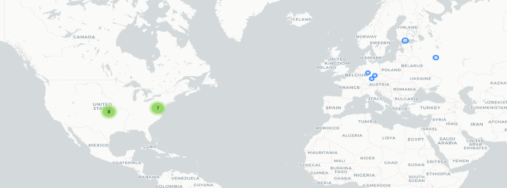

# Kids360

## Fechas de análisis

- **Análisis estático (mediante Exodus Privacy/MobFS):** 02 de abril 2025
- **Análisis dinámico (mediante análisis de tráfico de red):**  04 de abril 2025
- **Análisis Posteriores:** 
## Resumen de la aplicación

La aplicación Kids360, dirigida al control parental de dispositivos utilizados por niños, niñas y adolescentes, presenta un ecosistema altamente centralizado en el **control unidireccional, la vigilancia constante y la gamificación del acceso digital**. Lejos de fomentar un acompañamiento respetuoso y educativo, la app establece una lógica de supervisión total, donde la infancia **no tiene agencia sobre su propio entorno digital**.

El análisis técnico y funcional permitió identificar una serie de características que, en conjunto, **vulneran principios básicos de privacidad, proporcionalidad y transparencia** de las personas menores de edad. Además, algunas funciones clave están **restringidas a versiones pagas**, lo cual **refuerza la mercantilización de prácticas de vigilancia**.

 Los principales hallazgos al realizar el análisis fueron: 
 - **Control total sobre el dispositivo infantil:**  
    La aplicación permite bloquear la descarga, desinstalación e ingreso a cualquier aplicación del dispositivo de la infancia, sin ofrecer mecanismos de mediación ni opciones de desbloqueo temporal o justificado.
- **Vigilancia en tiempo real:**  
    La aplicación **transfiere en tiempo real todas las notificaciones recibidas**, registra el historial de navegación (incluido YouTube) y **monitorea el uso de cada aplicación y el tiempo de pantalla total**, configurando un escenario de **vigilancia total**.
- **Interacción mínima desde la infancia:**  
    La única participación activa de los niños y niñas es **marcar como realizadas las tareas impuestas por la persona adulta**, las cuales otorgan como recompensa tiempo para usar determinadas aplicaciones. Esto implica una **lógica conductista**, que transforma el uso del dispositivo en una **dinámica de obediencia-recompensa**.
- **Gamificación del acceso digital:**  
    Las tareas asignadas desde la aplicación de la persona cuidadora permiten otorgar tiempo de uso de aplicaciones como “premio”, institucionalizando una lógica de **acceso condicional** al juego, al ocio y al desarrollo digital.
- **Funciones ampliadas bajo modelo de pago:**  
    Varias de las funciones de control más profundas están disponibles solo en la versión de paga, lo que plantea preocupaciones adicionales sobre la **monetización de la vigilancia** y la ética en el diseño de este tipo de herramientas.
## Archivos analizados

- [apk versión 2.47.0](https://cloud.datavoros.org/index.php/s/cm7zoY63Fkb2xxP)
- [pcap versión 1](https://cloud.datavoros.org/index.php/s/2DBZwmsKT3GZbLs)
- [Capturas de pantalla](https://cloud.datavoros.org/index.php/s/Jwd93DTcWHkDMEM)
- [Reporte MobSF](https://cloud.datavoros.org/index.php/s/nJeicpNbe2ELSTc)

## Descripción de la aplicación
- **Tipo:**   Aplicación de control parental
- **Costo:**   Descarga gratuita con compras directas desde la aplicación
- **Enlace de descarga:** <https://play.google.com/store/apps/details?id=app.kids360.parent&hl=es_MX
- **Descargas:** Más de 5 millones de descargas
- **Ultima fecha de actualización:** 04 de abril 2025
- **Versión:** 2.47.0
- **Desarrollador:** [ANKO Solutions LLC](https://www.anko.solutions/)
- **Firma:** [ANKO Solutions L.L.C.](https://www.anko.solutions/)
- **Contacto:** support@kids360.app
- **Condiciones de uso y Política de privacidad:**
	- Términos de servicio: https://kids360.app/term-of-use
	- Política de privacidad: https://kids360.app/privacy-policy
    
- **Descripción en PlayStore:**
~~~
Descripción de la PlayStore
Kids360 es una app de control parental diseñada para la seguridad infantil que ayuda a padres y madres a supervisar el tiempo de pantalla de sus hijos. Con nuestro rastreador de aplicaciones móviles, siempre sabrá cuánto tiempo pasa su hijo con el teléfono, a qué juegos juega y qué aplicaciones usa con más frecuencia...
~~~

## Rastreadores identificados (mediante Exodus Privacy)

| Rastreador                                                                        | Tipo                           |
| --------------------------------------------------------------------------------- | ------------------------------ |
| [AppsFlyer](http://appsflyer.com/)                                                | Analítica                      |
| [Google CrashLytics](http://crashlytics.com/)                                     | Informe de fallas              |
| [Google Firebase Analytics](https://firebase.google.com/)                         | Analítica                      |
| [Huawei Mobile Sevicies (HMS) Core](https://developer.huawei.com/consumer/en/hms) | Ubicación, Anuncios, Analítica |

[Enlace al reporte de Exodus Privacy](https://reports.exodus-privacy.eu.org/es/reports/app.kids360.parent/latest/)

## Empresas relacionadas con esta aplicación:

| Empresa                                                         | Servicios que ofrecen                                    |
| --------------------------------------------------------------- | -------------------------------------------------------- |
| [Amazon](https://aws.amazon.com/es/?nc2=h_lgl)                  | Publicidad, servicios en la nube (AWS)                   |
| [Hetzner Online GmbH](https://www.hetzner.com/)                 | Servicios de almacenamiento e infraestructura en la nube |
| [DoubleGIS LLC](https://dev.2gis.com/)                          | Servicios de búsqueda local y navegación                 |
| [Google](https://marketingplatform.google.com/about/analytics/) | Publicidad (Ads), analíticas (Google Analytics)          |
| [Anko Solution LLC](https://www.anko.solutions/)                | Empresa desarrolladora                                   |

### Empresas identificadas a través del Aviso de Privacidad con que se comparten datos:

- [ANKO SOLUTION LCC](https://www.anko.solutions/)
- Nota: Tras el análisis de la política de privacidad de Kids360, no se mencionan otras empresas específicas, sin embargo, hay referencias al uso de herramientas de análisis de terceros para recopilar datos analíticos, también hace referencia a socios comerciales. 

### Dominios integrados al código de la aplicación que no pertecen directamente a los rastreadores

| Dominios                                  |
| ----------------------------------------- |
| https://megafon.findmykids.org/           |
| https://deeplink.kids360.app              |
| https://play.google.com                   |
| https://www.slf4j.org                     |
| https://xml.org                           |
| https://helpcenter.kids360.app            |
| https://tile.openstreetmap.org            |
| https://www.google.com                    |
| https://issuetracker.google.com           |
| https://www.openstreetmap.org             |
| https://www.facebook.com                  |
| https://docs.google.com                   |
| https://elk.kids360.app                   |
| https://developers.facebook.com           |
| https://kids360.app                       |
| https://ktor.io                           |
| https://kids360kid.page.link              |
| https://kids-360-parental.firebaseio.com  |
| https://developer.android.com             |
| https://github.com                        |
| http://www.youtube.com                    |
| https://developer.apple.com               |
| https://af-alli360.kids360.app            |
| https://aomedia.org                       |
| https://firebase-settings.crashlytics.com |
| https://xmlpull.org                       |
| https://www.w3.org                        |

## Permisos   

- **Según Exodus Privacy/MobFS:** 21
- **Según prueba de uso:** 6
### Permisos según Exodus Privacy

- ACCESS_ADSERVICES_AD_ID
- ACCESS_ADSERVICES_ATTRIBUTION
- ACCESS_NETWORK_STATE
- ACCESS_WIFI_STATE
- FOREGROUND_SERVICE
- FOREGROUND_SERVICE_DATA_SYNC
- INTERNET
- PACKAGE_USAGE_STATS
- POST_NOTIFICATIONS
- QUERY_ALL_PACKAGES
- :exclamation: READ_EXTERNAL_STORAGE
- RECEIVE_BOOT_COMPLETED
- :exclamation: RECORD_AUDIO
- :exclamation: SYSTEM_ALERT_WINDOW
- WAKE_LOCK
- :exclamation: WRITE_EXTERNAL_STORAGE
- DYNAMIC_RECEIVER_NOT_EXPORTED_PERMISSION
- BILLING
- RECEIVE
- BIND_GET_INSTALL_REFERRER_SERVICE
- AD_ID
- GET_COMMON_DATA

El icono :exclamation: indica un nivel 'Peligroso' o 'Especial' de acuerdo a los [niveles de protección de Google](https://developer.android.com/guide/topics/permissions/overview). 

### Permisos solicitados durante el uso de la aplicación

- :red_circle: Ubicación
- :red_circle: Optimización de la batería
- :red_circle: Cámara
- :red_circle: Micrófono 
- :red_circle: Notificaciones
- :red_circle: Accesibilidad

:red_circle: Este ícono indica un permiso obligatorio   
:blue_circle: Este ícono indica un permiso opcional pero se pierde una funcionalidad particular

## Datos

### Datos solicitados al usuario 

#### Datos solicitados durante el registro

- :red_circle: Correo electrónico
- :blue_circle: Nombre

### Datos solicitados al usuario durante el uso de la aplicación

- :blue_circle: Nombre de la infancia 

:red_circle: Este ícono indica que se debe ingresar este dato de manera obligatoria.   
:blue_circle: Este ícono indica que estos datos son opcionales.

### Tabla de conexiones realizadas durante el uso de la aplicación

| Dirección IP    | Número de Paquetes | País          | Ciudad/Zona | Organización AS     | Dominio |
| --------------- | ------------------ | ------------- | ----------- | ------------------- | ------- |
| 18.215.79.230   | 87                 | United States | Ashburn     | AMAZON-AES          |         |
| 34.236.137.99   | 29                 | United States | Ashburn     | AMAZON-AES          |         |
| 34.237.73.95    | 44                 | United States | Ashburn     | AMAZON-AES          |         |
| 35.174.127.31   | 140                | United States | Ashburn     | AMAZON-AES          |         |
| 44.207.238.37   | 35                 | United States | Ashburn     | AMAZON-AES          |         |
| 65.9.149.23     | 29                 | United States |             | AMAZON-02           |         |
| 65.9.149.71     | 30                 | United States |             | AMAZON-02           |         |
| 66.23.231.30    | 72                 | United States |             | IS-AS-1             |         |
| 78.47.35.154    | 261                | Germany       | Nuremberg   | Hetzner Online GmbH |         |
| 91.236.51.150   | 151                | Russia        |             | DoubleGIS LLC       |         |
| 95.216.209.140  | 66                 | Finland       | Helsinki    | Hetzner Online GmbH |         |
| 100.28.93.223   | 31                 | United States | Ashburn     | AMAZON-AES          |         |
| 107.23.182.247  | 45                 | United States | Ashburn     | AMAZON-AES          |         |
| 116.202.117.176 | 270                | Germany       | Falkenstein | Hetzner Online GmbH |         |
| 167.235.81.131  | 315                | Germany       |             | Hetzner Online GmbH |         |
| 173.214.170.246 | 10                 | United States |             | IS-AS-1             |         |
| 192.178.56.206  | 1,287              | United States |             | GOOGLE              |         |
| 192.178.57.36   | 998                | United States |             | GOOGLE              |         |
| 216.219.92.10   | 41                 | United States |             | IS-AS-1             |         |
| 216.219.92.253  | 1,109              | United States |             | IS-AS-1             |         |

### Mapa de conexiones realizadas durante el uso de la aplicación

*Mediante Wireshark*

### Datos recopilados y uso según la PlayStore

| Datos                                                         | Uso                                                           |
| ------------------------------------------------------------- | ------------------------------------------------------------- |
| Nombre                                                        | Funciones de la aplicación                                    |
| Dirección de correo electrónico                               | Funciones de la aplicación                                    |
| Registro de fallas                                            | Estadísticas                                                  |
| Otros datos de rendimiento de la aplicación (No especificado) | Estadísticas y seguridad, cumplimiento y prevención de fallas |
| Interacciones de la aplicación                                | Estadísticas                                                  |
| Historial de búsqueda en la aplicación                        | Estadísticas                                                  |
| Aplicaciones de instaladas                                    | Estadísticas                                                  |

### Datos compartidos y uso según la PlayStore

### Prácticas de seguridad

- La aplicación indica que "*Cifrado de datos en tránsito: La aplicación indica que cifra los datos durante su transmisión.*" lo cual según nuestro análisis es correcto.
- La aplicación indica que "*Mecanismo de eliminación de datos:* La aplicación señala que los datos pueden ser borrados por el usuario." lo cual no fue posible de probar en este análisis y queda sin confirmar

### Datos recopilados y uso según la Política de privacidad

| Datos                                                                          |
| ------------------------------------------------------------------------------ |
| Datos de registro: Nombre, correo electrónico                                  |
| Ubicación del dispositivo de la persona menor                                  |
| Datos del dispositivo: Modelo, Sistema operativo, identificadores              |
| Datos de uso de la aplicación: Acciones dentro de la aplicación, tiempo de uso |
| Análisis estadístico                                                           |

### Uso general de la información según la Política de privacidad

- Ayudar a los padres, madres y personas cuidadoras a monitorear y garantizar la seguridad de la persona menor en su entorno digital y físico.
- Seguimiento de la persona menor en tiempo real.
- Notificaciones sobre el movimiento de la persona menor o salidas de zonas seguras.
- Recopilación de datos de uso del dispositivo de la persona menor.
- Soporte técnico y mejora continua de la experiencia de usuario.

#### Información compartida con terceros

- La aplicación indica que en casi de ser requeridos de manera legal o por parte de autoridades, los datos que se soliciten se compartirán con estos organismos.
- La aplicación señala que los datos técnicos y de uso, como el uso de la aplicación e interacciones con funciones de la aplicación, se compartirán con fines comerciales.
- La aplicación señala que los datos proporcionados por la persona usuaria se comparten directamente con los servicios de la aplicación.

## Funciones particulares de la aplicación:
1. Acceso amplio a datos del dispositivo de la persona menor
	- Recopilan datos técnicos y del uso del dispositivo.
	- No esta claro hasta que punto acceden a estos datos como historial de navegación, contactos o mensajes.
2. Herramientas de análisis de terceros no identificadas.
	- Mencionan que usan herramientas analíticas pero no se especifican quienes son estas empresas ni que datos exactamente recopilan
3. Recopilación de datos con la aplicación en segundo plano o sin uso activo
	- La política no aclara este uso de la aplicación, sin embargo, la aplicación si se ejecuta en segundo plano.
4. Uso genérico de "socios comerciales"
	- Aunque en la política de privacidad dice que no comparte datos salvo bajo obligación legal, hacen referencia a "partners" y servicios vinculados no especificados
5. Retención de datos sin plazos concretos
	- No se especifica con claridad cuánto tiempo retienen los datos ni bajo que criterios los eliminan.

## Notas
- La aplicación contiene funciones especificas que se desbloquean al momento de acceder a la versión de paga de la aplicación.
- Dentro de aplicación de las personas cuidadoras se ofrecen varios servicios de control hacia la aplicación de las infancias, la única interacción que tienen las infancias con la aplicación es el realizar tareas que conforme van marcando como realizadas, la aplicación de la persona cuidadora las registra y va aumentando la cantidad de minutos que la infancia puede pasar en las aplicaciones que la persona cuidadora de autorización.
- Desde la aplicación se pude bloquear de manera total la descarga y la desinstalación de aplicaciones en el dispositivo de la infancia.
- La aplicación puede bloquear de manera total el ingreso a las aplicaciones seleccionadas.
- La aplicación recibe en tiempo real las notificaciones del dispositivo de la infancia al dispositivo de la persona cuidadora.
- La aplicación tiene un registro total del historial de búsqueda en el navegador así como aplicaciones como YouTube.
- La aplicación permite medir el tiempo que pasa la infancia en su dispositivo y controlar el tiempo que pasa en cada aplicación.
- Desde la aplicación se pueden crear tareas o pequeños deberes, donde la persona cuidadora puede dar de recompensa cierta cantidad de minutos para el uso de diversas aplicaciones en el dispositivo de la infancia.
## Conclusiones

- **La aplicación está centrada en el control, no en el cuidado:**  
    Su arquitectura está diseñada para el **seguimiento permanente, unilateral y sin mediación**, sin ofrecer alternativas de diálogo, autonomía progresiva o participación de la infancia.
- **Ausencia de principios de privacidad y proporcionalidad:**  
    La aplicación accede a datos sensibles como el historial de navegación, notificaciones y hábitos de uso, **sin limitar el alcance ni justificar su necesidad**, vulnerando principios de minimización de datos y proporcionalidad.
- **Gamificación del control refuerza dinámicas de poder verticales:**  
    El uso de tareas para desbloquear funciones convierte el uso del dispositivo en una dinámica de “premio-castigo”, en lugar de una oportunidad educativa y de co-construcción de reglas.
- **El modelo de negocio se sostiene sobre la comercialización del control:**  
    Al reservar funciones críticas para su versión paga, se **lucrativiza el acceso a prácticas de vigilancia extrema**, lo cual es éticamente cuestionable cuando se trata de infancias.
### Conclusión especifica

Esta aplicación **no puede considerarse una herramienta de acompañamiento digital responsable**. Sus funcionalidades, diseño y lógica de uso la posicionan como un sistema de **vigilancia encubierta, control conductual y monitoreo constante**, en clara contradicción con los principios de los derechos de la niñez y de la protección de datos.
La app Kids360 presenta un **modelo altamente intrusivo**, que prioriza el control total sobre el acompañamiento respetuoso. A pesar de estar pensada para “proteger”, **termina vulnerando derechos fundamentales de la infancia**, entre ellos:
- El derecho a la privacidad.
- El derecho a la participación digital.
- El derecho al desarrollo de la autonomía.
Desde un enfoque de seguridad digital con principios éticos, **esta aplicación no cumple con los estándares mínimos recomendables para un entorno seguro y respetuoso para las infancias.** Incluso si se alinea formalmente con políticas de privacidad básicas, en la práctica **su diseño funcional vulnera derechos clave.**
