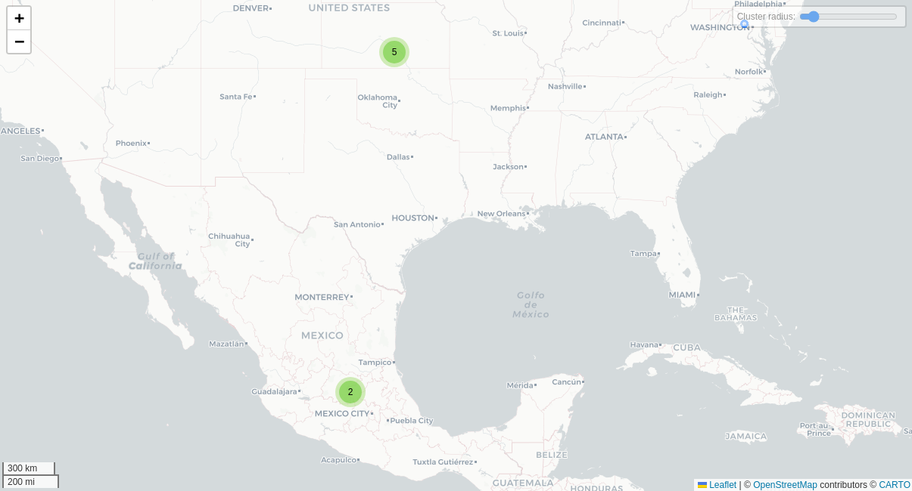

# Logsense

## Fechas de análisis

- **Análisis estático (mediante Exodus Privacy/MobFS):** 7/04/2025
- **Análisis dinámico (mediante análisis de tráfico de red):**  10/04/2025
- **Análisis Posteriores:** 

## Resumen de la aplicación
La aplicación LogSense, se presenta como una herramienta para el monitoreo de la actividad digital de una persona (no especifica que aplicaciones analiza ni como realiza el monitoreo). Esta app es una de las aplicaciones con mayor recaudación en la categoría de Paternidad y Maternidad en la PlayStore. Bajo una apariencia de monitoreo, ofrece una interfaz de Whatsapp falsa y solicita dinero a cambio de descifrar los chats.

El análisis técnico reveló múltiples irregularidades en el comportamiento de la app y su manejo de datos personales. Entre los principales hallazgos se destacan:

- **Simulación de funciones inexistentes:** La aplicación muestra una interfaz falsa de WhatsApp, con mensajes cifrados y opacos que no provienen de un dispositivo real. Se solicita un pago para “descifrarlos”.
- **Recolección encubierta de datos sensibles:** Aunque la Play Store indica que la app no recopila información personal, el análisis identificó tráfico hacia dominios de terceros (como Facebook, Google, RevenueCat y TikTok), además del requerimiento obligatorio de datos sensibles como nombre y número telefónico de la persona a rastrear.
- **Política de privacidad poco confiable:** La política está publicada en Google Sites, es genérica y contradictoria respecto al tratamiento de datos y la presencia de terceros. No especifica con claridad qué empresas tienen acceso a la información recolectada.
- **Modelo de monetización engañoso:** Se detectaron tácticas abusivas y fraudulentas para presionar al usuario a pagar suscripciones semanales o mensuales, mediante notificaciones que simulan actividad falsa en la cuenta monitoreada.
- **Ausencia de funcionalidades reales:** No se crea ninguna cuenta de usuario ni se otorgan permisos durante el uso, aunque en la interfaz se simulan opciones para eliminar cuentas o gestionar configuraciones que en realidad no existen.
- **Adquisición de nuevas personas usuarias con engaños:** La aplicación solicita una reseña positiva de al menos 500 caracteres para poder "adelantar el proceso de descifrado", es por este motivo que en la PlayStore tiene buenas reseñas y una calificación alta.
## Archivos analizados

- [apk versión 1.0.6](https://cloud.datavoros.org/index.php/s/8gfMcAk6jB38H6F)
- [pcap versión 2.7.1](https://cloud.datavoros.org/index.php/s/KXiGQXJbBAggtSk)
- [Capturas de pantalla](https://cloud.datavoros.org/index.php/s/SWZg8jTKeQS4TQQ)
- [Reporte MobSF](https://cloud.datavoros.org/index.php/s/AyzXY3MXnb8jfy9)

## Descripción de la aplicación
- **Tipo:** Maternidad y Paternidad
- **Costo:**  Premium
- **Enlace de descarga:** https://play.google.com/store/apps/details?id=com.app.logsense&hl=es_MX
- **Descargas:** 100,000
- **Ultima fecha de actualización:** 08/01/2025
- **Versión:** 1.0.6
- **Desarrollador:** LogSense LTD
- **Firma:** RAPID DIJITAL HIZMETLER LIMITED SIRKETI
- **Contacto:** https://sites.google.com/view/logsense/support?authuser=0 o info@rapid-mobile.net
- **Condiciones de uso y Política de privacidad:** https://sites.google.com/view/logsense/terms https://sites.google.com/view/logsense/privacy?authuser=0
    
- **Descripción en PlayStore:**
~~~
LogSense supervisa de forma inteligente sus actividades en línea y le notifica al instante cuando ocurre un evento significativo. Con su diseño moderno y su interfaz fácil de usar, puede realizar un seguimiento sin esfuerzo de su presencia digital y acceder a análisis e informes detallados. Las alertas en tiempo real garantizan que nunca se pierda una actualización importante, lo que le brinda un control total sobre sus actividades en línea. ¡Gestione su mundo digital de forma segura y manténgase a la vanguardia en todo momento con LogSense!
~~~

## Rastreadores identificados (mediante Exodus Privacy)

| Rastreador                                                                         | Tipo           |
| ---------------------------------------------------------------------------------- | -------------- |
| [Facebook Analytics](https://reports.exodus-privacy.eu.org/en/trackers/66/)        | Analítica      |
| [Facebook Login](https://reports.exodus-privacy.eu.org/en/trackers/67/)            | Identificación |
| [Facebook Share](https://reports.exodus-privacy.eu.org/en/trackers/70/)            | Identificación |
| [Google AdMob](https://reports.exodus-privacy.eu.org/en/trackers/312/)             | Publicidad     |
| [Google Firebase Analytics](https://reports.exodus-privacy.eu.org/en/trackers/49/) | Analítica      |
Los rastreadores de esta aplicación sirven para medir y analizar el uso que le da la persona usuaria a la aplicación, para iniciar sesión con Facebook, vincular identidades y recopilar datos de perfiles. También para mostrar publicidad dentro de la app, personalizar anuncios y compartir datos personales con terceros.
[Leer el reporte de Exodus Privacy](https://reports.exodus-privacy.eu.org/en/reports/591395/)

## Empresas relacionadas con esta aplicación:

El análisis de tráfico de red indica que estas empresas están relacionadas con la recolección de datos de la aplicación con fines de despliegue de infraestructura y almacenamiento de datos o de publicidad y marketing.

| Empresa                                             | Servicios que ofrecen                                                                |
| --------------------------------------------------- | ------------------------------------------------------------------------------------ |
| [Amazon Web Services (AWS)](https://aws.amazon.com) | Infraestructura en la nube, almacenamiento, servidores y cómputo escalable.          |
| [Google Cloud Platform](https://cloud.google.com/)  | Infraestructura en la nube, almacenamiento, servidores y cómputo escalable.          |
| [Google](https://google.com)                        | Publicidad (Ads), analíticas (Google Analytics).                                     |
| [Cloudflare](https://www.cloudflare.com/)           | Infraestructura en la nube, almacenamiento, servidores y cómputo escalable.          |
| [Facebook](https://facebook.com)                    | Publicidad (Ads), redes sociales, analíticas, servicios de mensajería.               |
| [Webnx](http://www.webnex.net/)                     | Servidores dedicados, colocation, hosting personalizado, infraestructura en la nube. |

### Empresas identificadas a través del Aviso de Privacidad con que se comparten datos:

No se mencionan explícitamente empresas con quienes comparte datos, unicamente hace referencia al compartimiento de datos con "proveedores de servicio" y "socios comerciales".  La falta de transparencia de empresas colaboradoras con esta aplicación es un indicador de desconfianza, pues ademas de impedir que los usuarios conozcan con claridad quienes (organizaciones) tienen acceso a su información personal, puede resultar en que esta aplicación tiene una Política de Privacidad **genérica** con la única finalidad de cumplir el requisito establecido para estar en la Google Play Store.

### Dominios integrados al código de la aplicación que no pertecen directamente a los rastreadores

| Dominios                               |
| -------------------------------------- |
| https://api-diagnostics.revenuecat.com |
| https://api64.ipify.org                |
| https://rev.cat                        |
| https://github.com                     |
| https://docs.revenuecat.com            |
| https://play.google.com                |
| https://sites.google.com               |
| https://ipapi.co                       |
| https://tiktok.com                     |
| https://web.whatsapp.com               |
| https://flagcdn.com                    |
| https://api.revenuecat.com             |
| https://errors.rev.cat                 |
Estos dominios indican que la aplicación se conecta a servicios de magnetización y suscripciones para funciones premium, también se conecta a servicios de analítica, redes sociales (Instagram y WhatsApp) y a repositorios de documentación, es decir el sitio donde se encuentra su Política de privacidad y términos de uso.
## Permisos   

- **Según Exodus Privacy/MobFS:** 14
- **Según prueba de uso:** Ninguno

### Permisos según Exodus Privacy

- ACCESS_ADSERVICES_AD_ID
- ACCESS_ADSERVICES_ATTRIBUTION
- ACCESS_ADSERVICES_TOPICS
- ACCESS_NETWORK_STATE: view network connections
- FOREGROUND: SERVICE: run foreground service
- INTERNET: have full network access
- POST: NOTIFICATIONS
- VIBRATE: control vibration
- WAKE_LOCK: prevent phone from sleeping
- BILLING
- CHECK_LICENSE
- DYNAMIC_RECEIVER_NOT_EXPORTED_PERMISSION
- BIND_GET_INSTALL_REFERRER_SERVICE
- AD_ID

El icono :exclamation: indica un nivel 'Peligroso' o 'Especial' de acuerdo a los [niveles de protección de Google](https://developer.android.com/guide/topics/permissions/overview). 

En este caso, Exodus Privacy no detecta permisos considerados peligrosos, los permisos listados anteriormente hacen referencia a rastreo publicitario, compras dentro de la aplicación, permisos para conectarse a Internet, mostrar notificaciones y de usabilidad como vibrar cuando hayan notificaciones.
### Permisos solicitados durante el uso de la aplicación

Esta aplicación no solicitó permisos en ningún momento.

## Datos

### Datos solicitados durante el registro

- 🔴 Nombre de la persona a espiar
- 🔴 Número de teléfono de la persona a espiar

### Datos solicitados durante el uso de la aplicación

Esta aplicación no solicita a los usuarios ningún dato extra durante el uso de la aplicación.

:red_circle: Este ícono indica que se debe ingresar este dato de manera obligatoria.   
:blue_circle: Este ícono indica que estos datos son opcionales.

### Tabla de conexiones realizadas durante el uso de la aplicación

| Dirección IP   | Número de Paquetes | País          | Ciudad/Zona | Organización AS |
| -------------- | ------------------ | ------------- | ----------- | --------------- |
| 34.234.25.174  | 59                 | United States | Ashburn     | AMAZON-AES      |
| 204.21.31.228  | 722                |               |             | CLOUDFLARENET   |
| 104.26.8.44    | 33                 |               |             | CLOUDFLARENET   |
| 104.26.8.44    | 17                 | United States |             | GOOGLE          |
| 157.240.25.1   | 175                | United States |             | FACEBOOK        |
| 157.240.25.60  | 2940               | Mexico        | Querétaro   | FACEBOOK        |
| 172.217.3.138  | 50                 | Mexico        | Querétaro   | GOOGLE          |
| 173.231.16.77  | 26                 | United States |             | WEBNX           |
| 192.178.56.74  | 23                 | United States |             | GOOGLE          |
| 192.178.56.138 | 25                 | United States |             | GOOGLE          |

### Mapa de conexiones realizadas durante el uso de la aplicación

*Mediante Wireshark*
El análisis de conexiones nos indica que la infraestructura de esta aplicación está en Estados Unidos, la infraestructura que está en México pertenece a Meta y Google que proveen servicios de analíticas.
### Datos recopilados y uso según la PlayStore
El desarrollador indica que esta app no recopila ni comparte datos del usuario. Sin embargo la política de privacidad si expresa una recopilación de datos.

### Datos compartidos y uso según la PlayStore
El desarrollador indica que esta app no comparte datos del usuario con otras organizaciones o empresas. Sin embargo, en los Rastreadores identificados previamente, podemos ver que Logsense comparte información de usuarios con Meta y Google, lo que representa una inconsistencia entre la información declarada y lo que realmente sucede durante el uso de la aplicación, situación que se considera un riesgo para la privacidad de los datos personales de los usuarios.

### Prácticas de seguridad

- Los datos están cifrados en tránsito
- Puedes solicitar que se borren los datos
- :exclamation: El desarrollador indica que esta app no recopila datos del usuario. 

Estas practicas de seguridad indican que existen medidas para mantener cifrados (ilegibles) los datos de los usuarios en el momento en que se mueven, lo que proporciona seguridad, ademas de que puede solicitar directamente a la aplicación, eliminar tus datos.
**Nota**: NO existe información adicional sobre el proceso de eliminación de datos de la aplicación en Google Play Store ni en al Política de Privacidad
El análisis de Exodus Privacy indica que la aplicación si recopila datos del usuario.
### Datos recopilados y uso según la Política de privacidad

| Datos                      | Uso                                                                                                                                                                                                                    |
| -------------------------- | ---------------------------------------------------------------------------------------------------------------------------------------------------------------------------------------------------------------------- |
| Datos personales        | Nombre y apellido Número de teléfono Datos de uso                                                                                                                                                                |
| Datos de uso            | Dirección IP, Tipo y versión del navegador, Páginas visitadas, Fecha y hora de visita, Tiempo en cada página, Identificadores únicos del dispositivo, Tipo de dispositivo móvil, Sistema operativo, Datos diagnósticos |
| Datos desde redes sociales | Nombre, Correo electrónico, Lista de contactos, Actividades, Foto de perfil, Descripción de actividad (si se comparte o se interactúa públicamente)                                                                    |

### Uso general de la información según la Política de privacidad

- Para proporcionar y mantener nuestro Servicio , incluido el monitoreo del uso del mismo.
- Para gestionar su cuenta: para gestionar su registro como usuario del Servicio. Los datos personales que proporcione pueden darle acceso a diferentes funcionalidades del Servicio disponibles como usuario registrado.
- Para la ejecución de un contrato: el desarrollo, cumplimiento y ejecución del contrato de compra de los productos, artículos o servicios que Usted ha adquirido o de cualquier otro contrato con Nosotros a través del Servicio.
- Para contactarte: Para contactarte por correo electrónico, llamadas telefónicas, SMS u otras formas equivalentes de comunicación electrónica, como las notificaciones push de una aplicación móvil sobre actualizaciones o comunicaciones informativas relacionadas con las funcionalidades, productos o servicios contratados, incluidas las actualizaciones de seguridad, cuando sea necesario o razonable para su implementación.
- Para brindarle noticias, ofertas especiales e información general sobre otros bienes, servicios y eventos que ofrecemos y que sean similares a los que ya ha comprado o consultado, a menos que haya optado por no recibir dicha información.
- Para gestionar sus solicitudes: Para atender y gestionar las solicitudes que nos envíe.
- Para transferencias comerciales: Podemos utilizar su información para evaluar o llevar a cabo una fusión, desinversión, reestructuración, reorganización, disolución u otra venta o transferencia de algunos o todos nuestros activos, ya sea como un negocio en marcha o como parte de una quiebra, liquidación o procedimiento similar, en el que los datos personales que tenemos sobre los usuarios de nuestro Servicio se encuentran entre los activos transferidos.
- Para otros fines : Podemos utilizar su información para otros fines, como análisis de datos, identificar tendencias de uso, determinar la efectividad de nuestras campañas promocionales y para evaluar y mejorar nuestro Servicio, productos, servicios, marketing y su experiencia.

#### Información compartida con terceros
- Se comparte información personal con proveedores de servicios que ayudan a analizar el uso del servicio y contactar al usuario.
- La información puede ser compartida o transferida durante procesos comerciales como fusiones, adquisiciones, financiamiento o ventas de activos.
- Se puede compartir información personal con afiliados bajo el control de la misma empresa matriz o grupo empresarial, quienes deben cumplir esta misma política de privacidad.
- Se puede compartir información con socios comerciales para ofrecer productos, servicios o promociones relacionados.
- Cuando el usuario interactúa en áreas públicas de la app o mediante redes sociales, su nombre, perfil y actividad pueden ser visibles para otros usuarios.
- Se puede divulgar información personal para cumplir con obligaciones legales o responder a solicitudes de autoridades públicas.
- Se puede divulgar información personal para proteger derechos legales, investigar actividades indebidas o salvaguardar la seguridad de los usuarios.
- La información puede transferirse a otros países donde las leyes de protección de datos difieran, siempre bajo medidas razonables de seguridad.
- Se puede divulgar información con el consentimiento explícito del usuario para cualquier otro propósito.

**Nota:** La política **no proporciona una lista específica de empresas o proveedores terceros** como AWS, Google Analytics, Meta, etc.

## Funciones particulares de la aplicación

### Muestra un clon del Whatsapp rastreado
En la interfaz muestra un clon de la interfaz de whatsapp con las fotos de los chats opacas y el texto está cifrado. Solicita un pago para descifrar el contenido.

Esta función es falsa ya que la cuenta de whatsapp que usamos para el análisis no tiene más de un chat. 

La aplicación te envia notificaciones constantemente para avisarte que a la persona que rastreas le han llegado mensajes, audios o videollamadas. (La aplicación nunca solicitó permiso para enviar notificaciones).

### Funciones falsas como la gestión de una cuenta
La aplicación muestra en su interfaz funciones para eliminar la cuenta, sin embargo, en ningún momento se crea una cuenta.

### Adquisición de nuevas personas usuarias con engaños
La aplicación solicita una reseña positiva de al menos 500 caracteres para poder "adelantar el proceso de descifrado", es por este motivo que en la PlayStore tiene buenas reseñas y una calificación alta.

## Notas

- Antes de instalar, la aplicación tiene un mensaje de advertencia en la Playstore que dice "Esta app se desinstala con frecuencia en comparación con otras apps de Play".
- Sección de la Política de Privacidad: [Privacidad de los niños](https://sites.google.com/view/logsense/privacy?authuser=0#h.9meg4q4udvo3)
	Nuestro Servicio no está dirigido a menores de 13 años. No recopilamos intencionalmente información personal identificable de menores de 13 años. Si usted es padre, madre o tutor y sabe que su hijo nos ha proporcionado datos personales, póngase en contacto con nosotros. Si detectamos que hemos recopilado datos personales de menores de 13 años sin verificar el consentimiento parental, tomaremos medidas para eliminar dicha información de nuestros servidores.
- La Política de privacidad parece ser una política genérica y está publicada en un google sites.
- La aplicación cobra $119 semanal, $239 mensual para "descifrar" los chats, pero nunca los descifra.

## Conclusiones

### Actividad Fraudulenta
La aplicación LogSense simula funcionalidades inexistentes con fines fraudulentos. Durante el análisis dinámico se evidenció que la app muestra una supuesta interfaz de WhatsApp rastreado, pero el contenido es completamente falso y generado sin ninguna relación real con el dispositivo objetivo. A pesar de mostrar chats, estos se presentan de forma opaca y cifrada, solicitando un pago para “descifrarlos”, sin que exista ninguna evidencia de que esa información provenga realmente de WhatsApp.

Además, esta aplicación está planeada para ser instalada en el dispositivo de la persona que realiza el monitoreo, nunca tiene contacto con el dispositivo monitoreado. Esto confirma que la app no realiza funciones de espionaje real, sino que simula comportamientos para convencer al usuario de pagar.

### Política de Privacidad genérica y poco confiable
La política de privacidad es genérica y poco confiable. Está alojada en Google Sites y no especifica claramente con qué terceros se comparten los datos, pese a que la app establece múltiples conexiones con empresas externas. 

En su política tiene una sección donde especifica que el servicio no está dirigido a personas menores de 13 años, a pesar de ser una de las aplicaciones con mayor recaudación en la categoría de Maternidad y Paternidad.

### Monetización Agresiva
Presenta prácticas de diseño y monetización que son engañosas. Las notificaciones constantes que simulan recibir mensajes o videollamadas de la persona rastreada, buscan presionar emocionalmente al usuario para que pague. 

### Privacidad y datos recolectados
Aunque en la Play Store afirma no recopilar ni compartir datos, durante el uso se observó tráfico de red hacia múltiples dominios asociados con empresas de rastreo y análisis, incluyendo Facebook, Google, RevenueCat y TikTok. Además, se solicitan datos sensibles como el nombre y número de la persona que se desea rastrear. Esta aplicación sí es Datavorezca.

## Conclusión específica

La aplicación LogSense simula funciones de rastreo que en realidad no existen. Muestra una interfaz falsa de WhatsApp y solicita pagos para “descifrar” chats que no provienen del dispositivo objetivo. Su propósito principal es engañar al usuario para obtener beneficios económicos, sin ofrecer ninguna funcionalidad real.

A pesar de declarar que no recolecta datos, el análisis revela conexiones con múltiples servicios de rastreo y publicidad como Facebook, Google y RevenueCat. Además, solicita datos sensibles como el nombre y número de teléfono de la persona a rastrear, lo cual representa un serio riesgo a la privacidad.

Los hallazgos confirman que LogSense es una aplicación **datavora** diseñada para lucrar a partir del engaño, utilizando prácticas que vulneran principios fundamentales de privacidad, transparencia y consentimiento informado.

