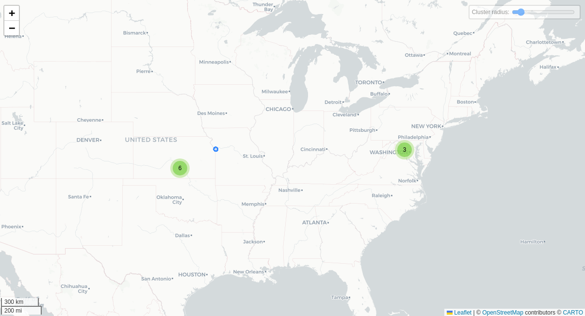

# Qustodio Kids (infancias y adolescencias)

---
## Funciones particulares de la aplicación
La aplicación instalada en el teléfono de la infancia solo muestra un temporizador con tu tiempo en pantalla y un botón para activar una alerta a un contacto de confianza.

### Captura de red mediante VPN
**Esta función solo se activa en la versión de Android 10 o menores, en las versiones posteriores Android prohibió la instalación de certificados web y captura de tráfico de red por temas de seguridad.** 

Instalación de un certificado web y una conexión VPN para realizar el monitoreo y captura del tráfico de red del dispositivo monitoreado. Si este permiso no se da el tráfico de red las funciones de la aplicación no funcionan correctamente.
### Botón de pánico
Botón de pánico que envía un mensaje o correo electrónico a un contacto de emergencia.
### Monitoreo de llamadas y mensajes
Instalación de un certificado web y una conexión VPN para realizar el monitoreo y captura del tráfico de red del dispositivo monitoreado.

## Notas
- La aplicación de padres no pide ningún permiso.
- El monitoreo de llamadas y mensajes de texto no funciona a pesar de haber dado los permisos para hacer y administrar llamadas telefónicas y leer mensajes de texto.
- El seguimiento de redes sociales es el seguimiento normal que le da a cualquier aplicación (tiempo de uso), no se monitorean mensajes como da a entender la aplicación.
- No se puede desinstalar la aplicación sin que se elimine el control del  dispositivo desde la aplicación del padre/madre.

## Conclusiones

### Permisos y Nivel de Acceso
La aplicación para niños solicita una cantidad significativa de permisos considerados peligrosos o especiales por Android, incluyendo ubicación precisa, lectura de notificaciones, administración del dispositivo, y la capacidad de instalar certificados y crear una VPN. Esto le otorga un alto nivel de control sobre el dispositivo monitoreado, que incluso no permite desinstalar la aplicación.

Algunos permisos como la actividad de pantalla, administración de llamadas y permisos de administrador, implican riesgos importantes de privacidad y seguridad, especialmente en dispositivos de infancias.

### Rastreo y Análisis de Datos
A pesar de que es común ver rastreadores como Google Analytics y Firebase, usados principalmente para analítica y publicidad, su presencia en una herramienta que tiene la intención de ser instalada en los dispositivos de las infancias no parece una práctica ética.

### Privacidad y datos recolectados
Se recolectan datos sensibles como  mensajes, historial de navegación, llamadas, contactos y geolocalización, lo que implica un monitoreo de nivel profundo del dispositivo del menor. Estos datos no solo son procesados por Qustodio, sino también potencialmente compartidos con terceros con fines de soporte, analítica, pagos y otros servicios de publicidad.

### Funcionalidad
Algunas funciones no funcionan como se anuncian, como el monitoreo de llamadas y mensajes, que no se ejecutan correctamente, incluso tras otorgar los permisos correspondientes.

El supuesto “monitoreo de redes sociales” se limita al tiempo de uso de las apps, y no accede a contenidos ni mensajes, a pesar de que la publicidad de la app sugiere una funcionalidad más intrusiva hacia las aplicaciones de mensajería como Instagram, Whatsapp y Line.

### Transparencia
La política de privacidad de Qustodio explica qué datos se recopilan, pero no especifica de forma granular qué datos se comparten con cada proveedor.

A pesar de usar cifrado, el hecho de recopilar el tráfico completo de red y todo el uso del dispositivo es un monitoreo desmedido especialmente cuando se trata de infancias y adolescencias.

### Conclusión final
Identificamos que anteriormente esta aplicación abusaba de configuraciones de seguridad para obtener todo el tráfico de red del dispositivo. Una vez cubierta esta vulnerabilidad por los desarrolladores de Android la aplicación no logra cumplir con la espectativa de las funciones.

A pesar de que los resultados del monitoreo no son tan invasivos no incentivamos su uso ya que los permisos y rastreadores son abusivos, vulnerando los principios fundamentales de privacidad y uso ético de la tecnología.

La aplicación recopila información sensible de las infancias que posteriormente se comparte con terceros, por lo tanto, esta aplicación es Datavorezca.

___

## Fechas de análisis

- **Análisis estático (mediante Exodus Privacy/MobFS):**  01/04/2025
- **Análisis dinámico (mediante análisis de tráfico de red):** 07/04/2025
- **Análisis Posteriores:** 

## Archivos analizados

- [apk versión 180.73.1.2](https://cloud.datavoros.org/index.php/s/KCziSCYiPT7AwkY)
- [pcap versión 2.7.1](https://cloud.datavoros.org/index.php/s/QJ87fW8NwKtzZSe)
- [Capturas de pantalla](https://cloud.datavoros.org/index.php/s/m74SffJapwb8kr7)
- [Reporte MobSF](https://cloud.datavoros.org/index.php/s/2S2g7gmikFcdc5M)

## Descripción de la aplicación
- **Tipo:**   Aplicación de control parental (Parenting)
- **Costo:** Premium (prueba gratuita)
- **Enlace de descarga:**  https://play.google.com/store/apps/details?id=com.qustodio.family.parental.control.app.screentime&pcampaignid=web_share
- **Descargas:** 1,000,000
- **Ultima fecha de actualización:** 13/02/2025
- **Versión:** 182.27.2
- **Desarrollador:** [Qustodio LLC](https://www.qustodio.com/en/)
- **Firma:** [Qustodio LLC](https://www.qustodio.com/en/)
- **Contacto:** [support@qustodio.com](mailto:support@qustodio.com)
- **Condiciones de uso y Política de privacidad:** https://www.qustodio.com/family/privacy/
    
- **Descripción en PlayStore:**
~~~
**Qustodio para niños** es la app complementaria de **Qustodio - Control parental**, la app de Qustodio para los dispositivos de los padres. Descárgala únicamente en los dispositivos de tus hijos.  
  
Primero, descarga **Qustodio - Control parental** en tu dispositivo (normalmente, tu teléfono móvil o tu ordenador). A continuación, descarga **Qustodio para niños** en los dispositivos de tus hijos. Una vez configuradas, podrás gestionar y supervisar fácilmente la actividad de tus hijos en los dispositivos móviles, tabletas y ordenadores vinculados a tu cuenta en Android, iOS, macOS y los principales sistemas operativos.  
  
**Qustodio para niños**  
  
• Gratis  
• Instálala en los dispositivos que desees supervisar  
• App complementaria de Qustodio - Control parental  
  
Versión gratuita de Qustodio (supervisa 1 dispositivo)  
  
✓ Configura y gaestiona límites de uso diarios  
✓ Supervisa la actividad online, las búsquedas y el uso de las apps  
✓ Bloquea sitios web y categorías (juegos, contenidos pornográficos, juegos de azar o contenidos indeseados)  
✓ Búsqueda segura  
✓ Bloquea los navegadores no compatibles  
✓ Informes de actividad avanzados (incluido el historial de los últimos 7 días)  
✓ Alertas  
  
Para disfrutar de funciones como el bloqueo de apps, el seguimiento de geolocalización, las estadísticas de uso avanzadas y los permisos de tiempo, pásate a Qustodio Premium.  
  
Qustodio Premium (supervisa 5, 10 o 15 dispositivos)
~~~

## Rastreadores identificados (mediante Exodus Privacy)

| Rastreador                                                                           | Tipo                     |
| ------------------------------------------------------------------------------------ | ------------------------ |
| [Segment](https://reports.exodus-privacy.eu.org/en/trackers/62/)                     | Perfilamiento, Analítica |
| [Google CrashLytics](https://reports.exodus-privacy.eu.org/en/trackers/27/)          | Reporte de fallos        |
| [Análisis de Google Firebase](https://reports.exodus-privacy.eu.org/en/trackers/49/) | Analítica                |

[Leer el reporte de Exodus Privacy](https://reports.exodus-privacy.eu.org/en/reports/com.qustodio.qustodioapp/latest/)

## Empresas relacionadas con esta aplicación:

| Empresa                                             | Servicios que ofrecen                                                       |
| --------------------------------------------------- | --------------------------------------------------------------------------- |
| [Amazon Web Services (AWS)](https://aws.amazon.com) | Infraestructura en la nube, almacenamiento, servidores y cómputo escalable. |
| [Google Cloud Platform](https://cloud.google.com/)  | Infraestructura en la nube, almacenamiento, servidores y cómputo escalable. |
| [Google](https://google.com)                        | Publicidad (Ads), analíticas (Google Analytics).                            |

### Empresas identificadas a través del Aviso de Privacidad con que se comparten datos:

- [Amazon.com, Inc.](https://aws.amazon.com/)
- [Braze, Inc.](https://www.braze.com/)
- [CHARGEBEE INC.](https://www.chargebee.com/)
- [Chart.io](https://chartio.com/)
- [Cleverbridge, Inc.](https://www.cleverbridge.com/)
- [Mailchimp](https://mailchimp.com/es/)
- [PayPal, Inc.](https://www.braintreepayments.com/)
- [Segment.io, Inc.](https://segment.com/)
- [Stripe, Inc.](https://stripe.com/)
- [Zendesk Inc.](https://www.zendesk.com/)

### Dominios integrados al código de la aplicación que no pertenecen directamente a los rastreadores

| Dominios                                             |
| ---------------------------------------------------- |
| https://x-api.rollout.io                             |
| https://www.qustodio.com                             |
| https://www.w3.org                                   |
| https://www.bing.com                                 |
| https://jsoup.org                                    |
| https://vwww.google.com                              |
| https://crashpad.chromium.org                        |
| https://console.firebase.google.com                  |
| https://www.youtube.com                              |
| https://rollout.io                                   |
| https://issuetracker.google.com                      |
| https://github.com                                   |
| https://segment.com                                  |
| https://qustodio.com                                 |
| https://qustodio-com-fair-hallway-795.firebaseio.com |
| https://notify.bugsnag.com                           |
| https://crashlytics.com                              |
## Permisos   

- **Según Exodus Privacy/MobFS:** 28
- **Según prueba de uso:** 14

### Permisos según Exodus Privacy

- ACCESS_ADSERVICES_AD_ID
- ACCESS_ADSERVICES_ATTRIBUTION
- :exclamation: ACCESS_FINE_LOCATION: access precise location only in the foreground
- ACCESS_NETWORK_STATE: view network connections
- ACCESS_NOTIFICATION_POLICY: access Do Not Disturb
- ACCESS_WIFI_STATE: view Wi-Fi connections
- :exclamation: CALL_PHONE: directly call phone numbers
- CHANGE_NETWORK_STATE: change network connectivity
- FOREGROUND_SERVICE: run foreground service
- FOREGROUND_SERVICE_SYSTEM_EXEMPTED
- INTERNET: have full network access
- KILL_BACKGROUND_PROCESSES: close other apps
- PACKAGE_USAGE_STATS
- POST_NOTIFICATIONS
- RECEIVE_BOOT_COMPLETED_run at startup_
- REQUEST_IGNORE_BATTERY_OPTIMIZATIONS: ask to ignore battery optimizations
- :exclamation: SYSTEM_ALERT_WINDOW: This app can appear on top of other apps
- USE_EXACT_ALARM
- VIBRATE: control vibration
- WAKE_LOCK: prevent phone from sleeping
- READ_HISTORY_BOOKMARKS
- WRITE_HISTORY_BOOKMARKS
- RECEIVE
- BIND_GET_INSTALL_REFERRER_SERVICE
- DYNAMIC_RECEIVER_NOT_EXPORTED_PERMISSION

El icono :exclamation: indica un nivel 'Peligroso' o 'Especial' de acuerdo a los [niveles de protección de Google](https://developer.android.com/guide/topics/permissions/overview). 

### Permisos solicitados durante el uso de la aplicación

- :red_circle: Actividad del dispositivo
- :red_circle: Ver y controlar la pantalla
- :red_circle: Ver y realizar acciones
- :red_circle: Seguimiento de uso
- :red_circle: Aparecer encima
- :red_circle: Leer notificaciones
- :red_circle: Responder mensajes
- :red_circle: Cambiar parámetros de configuración
- :red_circle: Dejar de optimizar el uso de batería
- :red_circle: Hacer y administrar llamadas telefónicas
- :red_circle: Ejecución en segundo plano
- :red_circle: Ubicación
- :red_circle: Permisos de administrador
- :blue_circle: Instalación de una conexión VPN
- :blue_circle: Instalación de certificado web

:red_circle: Este ícono indica un permiso obligatorio   
:blue_circle: Este ícono indica un permiso opcional pero se pierde una funcionalidad particular

## Datos

### Datos solicitados al usuario 

#### Datos solicitados para iniciar sesión en la cuenta del padre

- :red_circle: Correo electrónico
- :red_circle: Contraseña

### Datos solicitados al usuario durante el uso de la aplicación

- :red_circle: Tipo de dispositivo a monitorear (sistema operativo)
- :blue_circle:  Teléfono o correo electrónico para el botón de pánico

:red_circle: Este ícono indica que se debe ingresar este dato de manera obligatoria.   
:blue_circle: Este ícono indica que estos datos son opcionales.

### Tabla de conexiones realizadas durante el uso de la aplicación

| Dirección IP   | Número de Paquetes | País          | Ciudad/Zona | Organización AS       | Dominio |
| -------------- | ------------------ | ------------- | ----------- | --------------------- | ------- |
| 34.117.132.3   | 86                 | United States | Kansas City | GOOGLE-CLOUD-PLATFORM |         |
| 34.199.63.39   | 189                | United States | Ashburn     | AMAZON-AES            |         |
| 44.205.80.224  | 363                | United States | Ashburn     | AMAZON-AES            |         |
| 54.144.48.80   | 336                | United States | Ashburn     | AMAZON-02             |         |
| 192.178.52.234 | 73                 | United States |             | GOOGLE                |         |
| 192.178.56.234 | 50                 | United States |             | GOOGLE                |         |
| 216.239.35.0   | 20                 | United States |             | GOOGLE                |         |
| 216.239.35.4   | 20                 | United States |             | GOOGLE                |         |
| 216.239.35.8   | 21                 | United States |             | GOOGLE                |         |
| 216.239.35.12  | 20                 | United States |             | GOOGLE                |         |

### Mapa de conexiones realizadas durante el uso de la aplicación

*Mediante Wireshark*

### Otros datos recolectados:
El análisis de conexiones nos indica que la infraestructura de esta aplicación está en Estados Unidos.

### Datos recopilados y uso según la PlayStore

| Datos               | Uso                               |
| ------------------- | --------------------------------- |
| Actividad de apps   | Estadísticas y funciones          |
| Ubicación           | Ubicación precisa                 |
| Navegación web      | Historial de navegación en la Web |
| Nombre              | Administración de la cuenta       |
| Dirección de correo | Administración de la cuenta       |

### Datos compartidos y uso según la PlayStore
| Datos                   | Uso                                                   |
| ----------------------- | ----------------------------------------------------- |
| Registro de fallas      | Estadísticas                                          |
| Diagnóstico             | Estadísticas                                          |
| Interacciones en la app | Estadísticas, Publicidad o marketing, Personalización |
| Dispositivo u otros IDs | Estadísticas                                          |

### Prácticas de seguridad
- Los datos están cifrados cuando viajan a través de Internet.
- Puedes solicitar a los desarrolladores que se borren los datos asociados a tu cuenta.

### Datos recopilados y uso según la Política de privacidad

| Datos                                                                                                                                                                                                                                                                                                         |
| ------------------------------------------------------------------------------------------------------------------------------------------------------------------------------------------------------------------------------------------------------------------------------------------------------------- |
| **Datos de Registro:** nombre, apellidos, correo electrónico y teléfono. (obligatorios, es información de contacto asociada a la cuenta). Cualquier información personal que determinemos, a nuestro exclusivo criterio, que es suficiente para verificar su identidad con un grado razonable de certeza.  |
| **Pagos:**  Proveedores de pago (PayPal, Braintree, Cleverbridge, Chargebee y Stripe) recopilan datos de pago.                                                                                                                                                                                                |
| **Información del dispositivo:**  ID del modelo, número de serie, código IMEI, sistema operativo.                                                                                                                                                                                                             |
| **Información recolectada:**  todo el tráfico de red del dispositivo, nombres de dominio, direcciones URL de los motores de búsqueda y sitios web visitados, información de las aplicaciones, usuarios, contactos, conexiones, pagos, mensajes y otras comunicaciones, contenido publicado y recibido.        |

### Uso general de la información según la Política de privacidad

- **Registro de cuenta**
	- Estos incluyen información que proporcionas al crear y gestionar tu cuenta, como tu nombre y dirección de correo electrónico. Qustodio utiliza estos datos para administrar la relación contigo, lo que abarca la activación del servicio, soporte técnico, facturación y posibles mejoras o ventas adicionales de sus servicios.
- **Datos de usuario y dispositivos monitoreados**
	- Información recopilada de los dispositivos que se supervisan mediante Qustodio. Esto puede incluir detalles sobre el uso de aplicaciones, sitios web visitados, mensajes y otras comunicaciones. Qustodio procesa estos datos en tu nombre para proporcionarte servicios de control parental y monitoreo a través de su panel de control.
#### Información compartida con terceros
- Datos personales
	- Proveedores de soporte al cliente (Zendesk).
	- Servicios de facturación y pagos.
	- Herramientas de analíticas.
- Qustodio podría compartir ciertos datos con terceros para otros fines específicos.