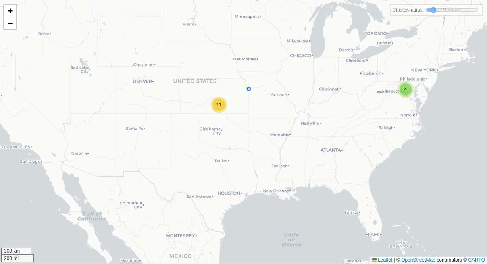

# Qustodio (madres y padres)
___
## Funciones particulares de la aplicación:

La aplicación tiene un costo de $730 mx (básico) $1290 mx (premium) al año, con el cual desbloqueas todas las funciones.
### Panel de control
La aplicación tiene secciones del panel de control donde muestra las apps monitoreadas y el tiempo de uso, sitios web y búsquedas en internet, tiempo en redes sociales y resumen de búsquedas (historial) de Youtube.
### Listas de bloqueo y advertencia de sitios web
La aplicación tiene una configuración donde se pueden bloquear sitios web por categoría o por su dirección. Se envía una notificación de advertencia al padre o no permitir cargar el sitio web. 
Esta función solo funciona en Android 10 y versiones anteriores.
### Rutinas
Se pueden establecer horarios y un limite de tiempo de uso de aplicaciones y del dispositivo.
### Botón de pánico
Botón de pánico que envía un mensaje o correo electrónico a un contacto de emergencia.
### Monitoreo de llamadas y mensajes
Instalación de un certificado web y una conexión VPN para realizar el monitoreo y captura del tráfico de red del dispositivo monitoreado.

## Notas
- La aplicación no solicita ningún permiso al instalarse sin embargo, el reporte de Exodus Privacy indica que la aplicación accede a 34 permisos que son muy invasivos para el tipo de funciones que realiza el panel de control de monitoreo.
- El monitoreo de llamadas y mensajes de texto no funciona a pesar de haber dado los permisos para hacer y administrar llamadas telefónicas y leer mensajes de texto.
- El seguimiento de redes sociales es el seguimiento normal que le da a cualquier aplicación (tiempo de uso), no se monitorean mensajes como da a entender la aplicación.
- La aplicación no funciona correctamente ya que en Android 11 y versiones posteriores el sistema operativo no permite hacer una captura de red por temas de seguridad. Es decir, Qustodio se aprovechaba de esta vulnerabilidad. Sin esta característica la aplicación solo monitorea el tiempo que pasas en las aplicaciones y conocer la ubicación de tu infancia, es posible bloquear por tiempo las aplicaciones y hacer rutinas.

## Conclusiones

### Permisos y Nivel de Acceso
Aunque la app no solicita permisos directamente al usuario durante su instalación, el análisis con herramientas como Exodus Privacy revela que accede a 34 permisos, muchos de ellos de tipo peligroso o especial para Android, como acceso a ubicación, configuraciones del sistema y uso de biométricos. Esta cantidad de permisos no son congruentes con las funciones de la aplicación ya que este teléfono no es el teléfono monitoreado.

### Rastreo y Análisis de Datos
El análisis de tráfico de red indica que  la app se comunica con múltiples servidores y servicios de terceros, incluyendo Amazon, Google, Cloudflare, PayPal, Stripe, Mailchimp, Segment y Zendesk, entre otros. También se identificaron rastreadores de Google, Adjust y Firebase, lo cual contradice parcialmente su promesa de “protección y privacidad” publicada en su política de privacidad.

### Privacidad y datos recolectados
Se recolectan datos sensibles como  mensajes, historial de navegación, llamadas, contactos y geolocalización, lo que implica un monitoreo de nivel profundo del dispositivo del menor. Estos datos no solo son procesados por Qustodio, sino también potencialmente compartidos con terceros con fines de soporte, analítica, pagos y otros servicios de publicidad.

### Funcionalidad
Algunas funciones no son como se anuncian, como el monitoreo de llamadas y mensajes, que no se ejecutan correctamente, incluso tras otorgar los permisos correspondientes.

El supuesto “monitoreo de redes sociales” se limita al tiempo de uso de las apps, y no accede a contenidos ni mensajes, a pesar de que la publicidad de la app sugiere una funcionalidad más intrusiva hacia las aplicaciones de mensajería como Instagram, Whatsapp y Line.

### Transparencia
La política de privacidad de Qustodio explica qué datos se recopilan, pero no especifica de forma granular qué datos se comparten con cada proveedor.

A pesar de usar cifrado, el hecho de recopilar el tráfico completo de red y todo el uso del dispositivo es un monitoreo desmedido especialmente cuando se trata de infancias y adolescencias.

### Conclusión final
La aplicación es muy invasiva y a pesar de acceder a toda la información no logra funcionar correctamente. Incluso en la versión premium las funciones no cumplen la espectativa generada con la descripción de la PlayStore.

En resumen, además de que esta aplicación no funciona, sí recopila una exagerada cantidad de datos del teléfono con el objetivo de compartirla con terceros. Instalar esta aplicación implica que el dispositivo del padre será monitoreado por la empresa de la misma manera que monitorea a la infancia, con fines de marketing y publicidad. Por lo tanto, esta aplicación es sumamente Datavora.
____

## Fechas de análisis

- **Análisis estático (mediante Exodus Privacy/MobFS):**  01/04/2025
- **Análisis dinámico (mediante análisis de tráfico de red):** 07/04/2025
- **Análisis Posteriores:** 

## Archivos analizados

- [apk versión 182.27.2]()
- [pcap versión 2.7.1]()
- [Capturas de pantalla]()
- [Reporte MobSF]()

## Descripción de la aplicación
- **Tipo:**   Aplicación de control parental (Parenting)
- **Costo:**   Premium (prueba gratuita)
- **Enlace de descarga:**  https://play.google.com/store/apps/details?id=com.qustodio.family.parental.control.app.screentime
- **Descargas:** 5,000,000
- **Ultima fecha de actualización:** 7/03/2025
- **Versión:** 182.27.2
- **Desarrollador:** [Qustodio LLC](https://www.qustodio.com/en/)
- **Firma:** [Qustodio LLC](https://www.qustodio.com/en/)
- **Contacto:** [support@qustodio.com](mailto:support@qustodio.com)
- **Condiciones de uso y Política de privacidad:** https://www.qustodio.com/family/privacy/
    
- **Descripción en PlayStore:**
~~~
Galardonada con el premio Editors’ Choice de PC Mag, **Qustodio - Control parental facilita la vida a los padres** > con funciones como los controles de tiempo diarios, la monitorización y el bloqueo de aplicaciones —incluidas Facebook y YouTube—, el seguimiento de geolocalización, el modo infantil, el bloqueo de pornografía, etc.
- **Bloqueo de dispositivos**: bloquea automáticamente el dispositivo cuando se agota el tiempo  
- **Control parental y modo para niños**: supervisa y controla el contenido al que acceden tus hijos y filtra el contenido para adultos  
- **Localizador familiar con GPS**: localiza el teléfono de tus hijos y te envía su localización  
  
Primero, descarga **Qustodio - Control parental** en tu dispositivo. Después, descarga **Qustodio para niños** en los dispositivos de tus hijos. Una vez configuradas, podrás gestionar y supervisar la actividad de sus dispositivos móviles, tabletas y ordenadores en Android, iOS y los principales sistemas operativos.  
  
**Versión gratuita (1 dispositivo)**  
  
✓ Configura y gestiona los límites de uso diarios  
✓ Bloquea sitios web y categorías (videojuegos, juegos de azar o pornografía)  
✓ Supervisa la actividad online, las búsquedas y el uso de las apps  
✓ Búsqueda segura para bloquear los sitios web para adultos o pornográficos  
✓ Bloquea los navegadores no compatibles  
✓ Función Pausar Internet  
✓ Informes de actividad avanzados (incluido el historial de los últimos 7 días)  
✓ Recibe notificaciones del Localizador familiar, el rastreador GPS y los controles de tiempo

**Versión Premium (5 dispositivos o ilimitado)  
  
Disfruta de las funciones gratuitas más:  
  
✓ Monitorización de YouTube  
✓ Localizador familiar con geolocalización GPS  
✓ Alertas de los sitios guardados  
✓ Bloqueador de aplicaciones (bloquea apps y categorías)  
✓ Límites de tiempo en los juegos y las aplicaciones  
✓ Seguimiento de llamadas y mensajes  
✓ Historial de actividad de los últimos 30 días  
✓ Botón de SOS  
✓ Alertas de búsqueda basadas en IA  
✓ Alertas de mensaje basadas en IA  
✓ Rutinas personalizadas  
✓ Soporte prioritario  
✓ Acceso prioritario a nuevas funciones  
✓ Protección multidispositivo para activar todas las funciones del modo infantil y el Localizador familiar  
✓ Compatible con dispositivos iOS, Windows, Mac, Android o Kindle  
✓ Protege un número ilimitado de dispositivos  
**
~~~

## Rastreadores identificados (mediante Exodus Privacy)

| Rastreador                                                                                     | Tipo                  |
| ---------------------------------------------------------------------------------------------- | --------------------- |
| [Adjust](https://www.adjust.com/product/adjust-audience-builder/)                              | Retargeting móvil     |
| [Google Analytics](https://reports.exodus-privacy.eu.org/en/trackers/48/)                      | Analítica             |
| [Google CrashLytics](https://reports.exodus-privacy.eu.org/en/trackers/27/)                    | Reporte de fallos     |
| [Análisis de Google Firebase](https://reports.exodus-privacy.eu.org/en/trackers/49/)           | Analítica             |
| [Administrador de etiquetas de Google](https://reports.exodus-privacy.eu.org/en/trackers/105/) | Analítica, Publicidad |

[Leer el reporte de Exodus Privacy](https://reports.exodus-privacy.eu.org/en/reports/555581/#trackers)

## Empresas relacionadas con esta aplicación:

| Empresa                                             | Servicios que ofrecen                                                       |
| --------------------------------------------------- | --------------------------------------------------------------------------- |
| [Amazon Web Services (AWS)](https://aws.amazon.com) | Infraestructura en la nube, almacenamiento, servidores y cómputo escalable. |
| [Google Cloud Platform](https://cloud.google.com/)  | Infraestructura en la nube, almacenamiento, servidores y cómputo escalable. |
| [Google](https://google.com)                        | Publicidad (Ads), analíticas (Google Analytics).                            |
| [Cloudflare](https://www.cloudflare.com/)           | Infraestructura en la nube, almacenamiento, servidores y cómputo escalable. |

### Empresas identificadas a través del Aviso de Privacidad con que se comparten datos:

- [Amazon.com, Inc.](https://aws.amazon.com/)
- [Braze, Inc.](https://www.braze.com/)
- [CHARGEBEE INC.](https://www.chargebee.com/)
- [Chart.io](https://chartio.com/)
- [Cleverbridge, Inc.](https://www.cleverbridge.com/)
- [Mailchimp](https://mailchimp.com/es/)
- [PayPal, Inc.](https://www.braintreepayments.com/)
- [Segment.io, Inc.](https://segment.com/)
- [Stripe, Inc.](https://stripe.com/)
- [Zendesk Inc.](https://www.zendesk.com/)
- | [Cloudflare](https://www.cloudflare.com/)
### Dominios integrados al código de la aplicación que no pertenecen directamente a los rastreadores

| Dominios                                             |
| ---------------------------------------------------- |
| https://x-api.rollout.io                             |
| https://www.qustodio.com                             |
| https://www.w3.org                                   |
| https://www.bing.com                                 |
| https://jsoup.org                                    |
| https://crashlytics.com                              |
| https://rollout.io                                   |
| https://www.qstodio.com                              |
| https://vwww.google.com                              |
| https://crashpad.chromium.org                        |
| https://console.firebase.google.com                  |
| https://www.youtube.com                              |
| https://issuetracker.google.com                      |
| https://github.com                                   |
| https://segment.com                                  |
| https://qustodio.com                                 |
| https://qustodio-com-fair-hallway-795.firebaseio.com |
| https://notify.bugsnag.com                           |
## Permisos   

- **Según Exodus Privacy/MobFS:** 34
- **Según prueba de uso:** 2

### Permisos según Exodus Privacy

- ACCESS_ADSERVICES_AD_ID
- ACCESS_ADSERVICES_ATTRIBUTION
- :exclamation: ACCESS_COARSE_LOCATION: access approximate location only in the foreground
- :exclamation: ACCESS_FINE_LOCATION: access precise location only in the foreground
- ACCESS_NETWORK_STATE: view network connections
- INTERNET: have full network access
- POST_NOTIFICATIONS
- READ_APP_BADGE
- USE_BIOMETRIC: use biometric hardware
- USE_FINGERPRINT: use fingerprint hardware
- VIBRATE: control vibration
-  WAKE_LOCK:prevent phone from sleeping
- UPDATE_COUNT
- BILLING
- RECEIVE
- BIND_GET_INSTALL_REFERRER_SERVICE
- AD_ID
- READ_GSERVICES
- READ_SETTINGS
- UPDATE_SHORTCUT
- CHANGE_BADGE
- READ_SETTINGS
- :exclamation: WRITE_SETTINGS
- UPDATE_BADGE
- READ_SETTINGS
- :exclamation: WRITE_SETTINGS
- DYNAMIC_RECEIVER_NOT_EXPORTED_PERMISSION
- PushHandlerActivity
- READ
- WRITE
- BROADCAST_BADGE
- PROVIDER_INSERT_BADGE
- BADGE_COUNT_READ
- BADGE_COUNT_WRITE

El icono :exclamation: indica un nivel 'Peligroso' o 'Especial' de acuerdo a los [niveles de protección de Google](https://developer.android.com/guide/topics/permissions/overview). 

### Permisos solicitados durante el uso de la aplicación

La aplicación no solicita ningún permiso.
## Datos

### Datos solicitados al usuario 

#### Datos solicitados durante el registro

- :red_circle: Correo electrónico
- :red_circle: Nombre del tutor
- :red_circle: Nombre del hijo

### Datos solicitados al usuario durante el uso de la aplicación

- :red_circle: Tipo de dispositivo a monitorear (sistema operativo, modelo)
- :blue_circle:  Teléfono o correo electrónico para el botón de pánico

:red_circle: Este ícono indica que se debe ingresar este dato de manera obligatoria.   
:blue_circle: Este ícono indica que estos datos son opcionales.

### Tabla de conexiones realizadas durante el uso de la aplicación

| Dirección IP   | Número de Paquetes | País          | Ciudad/Zona | Organización AS       | Dominio |
| -------------- | ------------------ | ------------- | ----------- | --------------------- | ------- |
| 3.161.44.59    | 476                | United States |             | AMAZON-02             |         |
| 3.161.44.102   | 244                | United States |             | AMAZON-02             |         |
| 9.9.9.9        | 144                | United States | Berkeley    | QUAD9-AS-1            |         |
| 34.120.195.249 | 352                | United States | Kansas City | GOOGLE-CLOUD-PLATFORM |         |
| 34.199.63.39   | 710                | United States | Ashburn     | AMAZON-AES            |         |
| 44.205.80.224  | 528                | United States | Ashburn     | AMAZON-AES            |         |
| 44.209.27.27   | 122                | United States | Ashburn     | AMAZON-AES            |         |
| 54.144.48.80   | 620                | United States | Ashburn     | AMAZON-AES            |         |
| 65.9.149.79    | 37                 | United States |             | AMAZON-02             |         |
| 104.18.35.7    | 100                | United States |             | CLOUDFLARENET         |         |
| 172.64.152.249 | 80                 | United States |             | CLOUDFLARENET         |         |
| 172.217.3.138  | 30                 | United States |             | GOOGLE                |         |
| 192.178.52.170 | 26                 | United States |             | GOOGLE                |         |
| 192.178.52.234 | 42                 | United States |             | GOOGLE                |         |
| 192.178.56.74  | 29                 | United States |             | GOOGLE                |         |
| 192.178.56.106 | 28                 | United States |             | GOOGLE                |         |
| 192.178.56.202 | 129                | United States |             | GOOGLE                |         |
| 192.178.57.42  | 73                 | United States |             | GOOGLE                |         |
| 192.178.57.46  | 309                | United States |             | GOOGLE                |         |

### Mapa de conexiones realizadas durante el uso de la aplicación

*Mediante Wireshark*

### Otros datos recolectados:
El análisis de conexiones nos indica que la infraestructura de esta aplicación está en Estados Unidos.

### Datos recopilados y uso según la PlayStore

| Datos                               | Uso                         |
| ----------------------------------- | --------------------------- |
| Información y rendimiento de la app | Diagnostico                 |
| Nombre                              | Administración de la cuenta |
| Correo electrónico                  | Administración de la cuenta |
| Número de teléfono                  | Administración de la cuenta |

### Datos compartidos y uso según la PlayStore
| Datos                   | Uso                                                   |
| ----------------------- | ----------------------------------------------------- |
| Registro de fallas      | Estadísticas                                          |
| Diagnóstico             | Estadísticas                                          |
| Interacciones en la app | Estadísticas, Publicidad o marketing, Personalización |
| Dispositivo u otros IDs | Estadísticas                                          |

### Prácticas de seguridad
 - Los datos están cifrados cuando viajan a través de Internet.
 - Puedes solicitar a los desarrolladores que se borren los datos asociados a tu cuenta.

### Datos recopilados y uso según la Política de privacidad

| Datos                                                                                                                                                                                                                                                                                                         |
| ------------------------------------------------------------------------------------------------------------------------------------------------------------------------------------------------------------------------------------------------------------------------------------------------------------- |
| **Datos de Registro:** nombre, apellidos, correo electrónico y teléfono. (obligatorios, es información de contacto asociada a la cuenta). Cualquier información personal que determinemos, a nuestro exclusivo criterio, que es suficiente para verificar su identidad con un grado razonable de certeza.  |
| **Pagos:**  Proveedores de pago (PayPal, Braintree, Cleverbridge, Chargebee y Stripe) recopilan datos de pago.                                                                                                                                                                                                |
| **Información del dispositivo:**  ID del modelo, número de serie, código IMEI, sistema operativo.                                                                                                                                                                                                             |
| **Información recolectada:**  todo el tráfico de red del dispositivo, nombres de dominio, direcciones URL de los motores de búsqueda y sitios web visitados, información de las aplicaciones, usuarios, contactos, conexiones, pagos, mensajes y otras comunicaciones, contenido publicado y recibido.        |

### Uso general de la información según la Política de privacidad

- **Registro de cuenta**
	- Estos incluyen información que proporcionas al crear y gestionar tu cuenta, como tu nombre y dirección de correo electrónico. Qustodio utiliza estos datos para administrar la relación contigo, lo que abarca la activación del servicio, soporte técnico, facturación y posibles mejoras o ventas adicionales de sus servicios.
- **Datos de usuario y dispositivos monitoreados**
	- Información recopilada de los dispositivos que se supervisan mediante Qustodio. Esto puede incluir detalles sobre el uso de aplicaciones, sitios web visitados, mensajes y otras comunicaciones. Qustodio procesa estos datos en tu nombre para proporcionarte servicios de control parental y monitoreo a través de su panel de control.
#### Información compartida con terceros
- Datos personales
	- Proveedores de soporte al cliente (Zendesk).
	- Servicios de facturación y pagos.
	- Herramientas de analíticas.
- Qustodio podría compartir ciertos datos con terceros para otros fines específicos.

