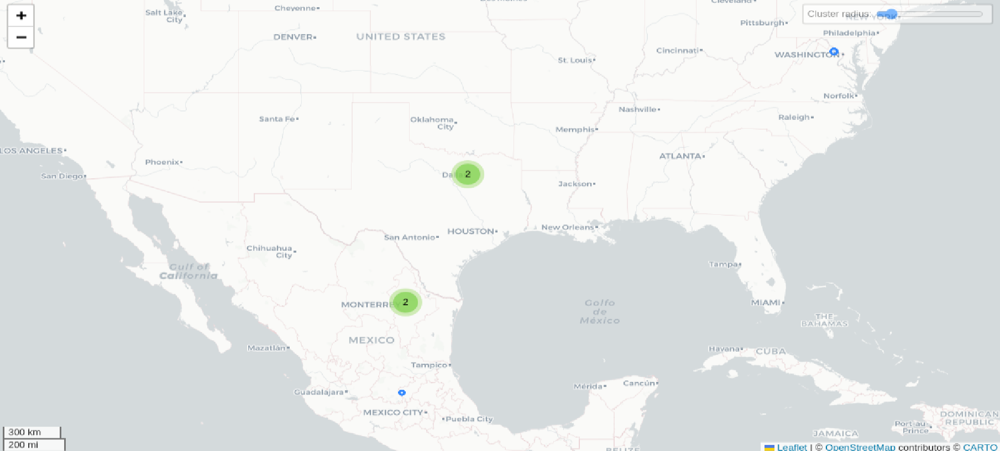

# SeenLog

## Fechas de análisis

- **Análisis estático (mediante Exodus Privacy/MobFS):** 03 de abril 2025
- **Análisis dinámico (mediante análisis de tráfico de red):**  04 de abril 2025
- **Análisis Posteriores:** 
## Resumen de la aplicación

La aplicación SeenLog, ha generado **numerosas quejas de usuarios** que indican que no cumple con lo prometido. Entre los problemas más destacados se encuentran **funciones bloqueadas**, **falta de visibilidad real del dispositivo objetivo** y constantes **requerimientos de pago** para acceder a funcionalidades adicionales. Estas quejas sugieren que la app podría estar **engañando a los usuarios**, lo que la coloca en una situación de desconfianza y posibles prácticas fraudulentas.

Desde una perspectiva de **protección de datos**, la aplicación presenta **graves deficiencias**. Su **política de privacidad es vaga, ambigua y mal estructurada**, lo que es particularmente preocupante dado que la aplicación **monitorea ubicación en tiempo real** y otros datos sensibles. No se especifica qué tipo de **datos se recogen**, **con qué base legal se procesan**, ni qué **derechos tienen las personas usuarias**, especialmente en el caso de **menores**.

El **consentimiento** mencionado en la política es confuso, y no queda claro cómo se obtiene **ni si se cumple con las normativas de privacidad**, lo que podría implicar una **violación del derecho a la privacidad**, especialmente si se está monitoreando a personas sin su consentimiento explícito. Además, la aplicación **no explica cómo protege los datos** ni cuánto tiempo los retiene, ni si se implementan medidas de seguridad adecuadas, como **cifrado o anonimización**.

## Archivos analizados

- [apk versión 1.2.8](https://cloud.datavoros.org/index.php/s/5ZBRJfy5okELbjD)
- [pcap versión 1](https://cloud.datavoros.org/index.php/s/iCr7sNRQDPpSMFw)
- [Capturas de pantalla](https://cloud.datavoros.org/index.php/s/3cTPM7LFG2s3xQN)
- [Reporte MobSF](https://cloud.datavoros.org/index.php/s/9XAEDLTCAA5WqDE)

## Descripción de la aplicación

- **Tipo:**   Aplicación de control parental
- **Costo:**   Descarga gratuita con compras directas desde la aplicación
- **Enlace de descarga:** <https://play.google.com/store/apps/details?id=com.app.seenlog
- **Descargas:** Más de 1 millón de descargas
- **Ultima fecha de actualización:** 05 de noviembre 2024
- **Versión:** 1.2.8
- **Desarrollador:** [AppSense Limited](https://www.ivanti.com/)
- **Firma:** [AppSense Limited](https://www.ivanti.com/)
- **Contacto:** 
- **Condiciones de uso y Política de privacidad:**
	- Términos de servicio: https://sites.google.com/view/seenlogapp/terms
	- Política de privacidad: https://sites.google.com/view/seenlogapp/privacy
- **Descripción en PlayStore:**
~~~
Descripción de la PlayStore
SeenLog analiza sus actividades en línea y le envía notificaciones instantáneas cuando hay actualizaciones importantes. Con una interfaz intuitiva, análisis avanzados y notificaciones en tiempo real, ¡realizar un seguimiento de su presencia digital nunca ha sido tan fácil!
~~~

## Rastreadores identificados (mediante Exodus Privacy)

| Rastreador                                                                        | Tipo                           |
| --------------------------------------------------------------------------------- | ------------------------------ |
| [AppsFlyer](http://appsflyer.com/)                                                | Analítica                      |
| [Google CrashLytics](http://crashlytics.com/)                                     | Informe de fallas              |
| [Google Firebase Analytics](https://firebase.google.com/)                         | Analítica                      |
| [Huawei Mobile Sevicies (HMS) Core](https://developer.huawei.com/consumer/en/hms) | Ubicación, Anuncios, Analítica |

[Enlace al reporte de Exodus Privacy](https://reports.exodus-privacy.eu.org/es/reports/com.app.seenlog/latest/)

## Empresas relacionadas con esta aplicación:

| Empresa                                                | Servicios que ofrecen                    |
| ------------------------------------------------------ | ---------------------------------------- |
| [Amazon](https://aws.amazon.com/es/?nc2=h_lg)          | Publicidad, servicios en la nube (AWS)   |
| [Facebook](https://about.meta.com/ltam/)               | Publicidad, integración de APIs sociales |
| [Akamai International B.V.](https://www.akamai.com/es) | Servicios de la nube                     |

### Empresas identificadas a través del Aviso de Privacidad con que se comparten datos:

-  **Google Analytics**: Utilizado para monitorear y analizar el uso de la aplicación.
- **Google AdSense y DoubleClick**: Proveen servicios de publicidad y remarketing mediante cookies.
- **AdMob by Google**: Plataforma de publicidad móvil que muestra anuncios dentro de la aplicación. 
- **Google Ads (AdWords)**: Servicio de remarketing para mostrar anuncios personalizados. 
- **Twitter**: Utilizado para servicios de remarketing y publicidad basada en intereses. 
- **Facebook**: Emplea servicios de remarketing y publicidad personalizada.

### Dominios integrados al código de la aplicación que no pertenecen directamente a los rastreadores

| Dominios                                |
| --------------------------------------- |
| https://play.google.com                 |
| https://api-diagnostics.revenuecat.com/ |
| https://sites.google.com                |
| https://ipapi.co                        |
| https://api.revenuecat.com              |
| https://errors.rev.cat                  |
| https://selenium.dev                    |
| https://apache.org                      |
| https://rev.cat                         |
| https://www.mozilla.org                 |
| https://github.com                      |
| https://flagcdn.com                     |
| https://docs.revenuecat.com             |
| https://web.whatsapp.com                |
| www.w3.org                              |

## Permisos   

- **Según Exodus Privacy/MobFS:** 15
- **Según prueba de uso:** 0
### Permisos según Exodus Privacy

- ACCESS_ADSERVICES_AD_ID
- ACCESS_ADSERVICES_ATTRIBUTION
- ACCESS_NETWORK_STATE
- FOREGROUND_SERVICE
- INTERNET
- POST_NOTIFICATIONS
- :exclamation: READ_EXTERNAL_STORAGE
- RECEIVE_BOOT_COMPLETED
- SCHEDULE_EXACT_ALARM
- USE_EXACT_ALARM
- WAKE_LOCK
- :exclamation: WRITE_EXTERNAL_STORAGE
- DYNAMIC_RECEIVER_NOT_EXPORTED_PERMISSION
- BILLING
- BIND_GET_INSTALL_REFERRER_SERVICE
- AD_ID
- READ_GSERVICES

El icono :exclamation: indica un nivel 'Peligroso' o 'Especial' de acuerdo a los [niveles de protección de Google](https://developer.android.com/guide/topics/permissions/overview). 

### Permisos solicitados durante el uso de la aplicación

- No solicita ningún permiso para el uso de esta aplicación

:red_circle: Este ícono indica un permiso obligatorio   
:blue_circle: Este ícono indica un permiso opcional pero se pierde una funcionalidad particular

## Datos

### Datos solicitados al usuario 

#### Datos solicitados durante el registro

- :red_circle: Número de teléfono de la persona espiada

### Datos solicitados al usuario durante el uso de la aplicación

- :No solicita ningún dato durante el uso de esta aplicación.

:red_circle: Este ícono indica que se debe ingresar este dato de manera obligatoria.   
:blue_circle: Este ícono indica que estos datos son opcionales.

### Tabla de conexiones realizadas durante el uso de la aplicación

| Dirección IP   | Número de Paquetes | País          | Ciudad/Zona    | Organización AS            | Dominio |
| -------------- | ------------------ | ------------- | -------------- | -------------------------- | ------- |
| 23.218.232.88  | 28                 | United States | Irving         | Akamaki International B.V. |         |
| 98.84.146.18   | 23                 | United States | Ashburn        | AMAZON-AES                 |         |
| 157.240.25.60  | 104                | México        | Querétaro City | Facebook                   |         |
| 157.240.244.14 | 21                 | México        | Apodaca        | Facebook                   |         |
| 157.240.244.60 | 105                | México        | Apodaca        | Facebook                   |         |
| 184.28.41.82   | 28                 | United States | Dallas         | Akamaki International B.V. |         |

### Mapa de conexiones realizadas durante el uso de la aplicación

*Mediante Wireshark*

### Datos recopilados y uso según la PlayStore

| Datos                                                         | Uso                                                           |
| ------------------------------------------------------------- | ------------------------------------------------------------- |
| Número de teléfono                                            | Funciones de la aplicación y gestión de cuenta                |
| IDs de dispositivo o de otro tipo                             | Funciones de la aplicación, análisis y gestión de la cuenta   |

### Datos compartidos y uso según la PlayStore

### Prácticas de seguridad

- La aplicación indica que "*Cifrado de datos en tránsito:* La aplicación indica que cifra los datos durante su transmisión." lo cual según nuestro análisis es correcto.
- La aplicación indica que "*Mecanismo de eliminación de datos:* La aplicación señala que los datos pueden ser borrados por el usuario." lo cual no fue posible de probar en este análisis y queda sin confirmar.

### Datos recopilados y uso según la Política de privacidad

| Datos                                                                                                                      |
| -------------------------------------------------------------------------------------------------------------------------- |
| Datos de registro: Nombre, correo electrónico, información de la cuenta                                                    |
| Datos recopilados automáticamente: Dirección IP, Tipo y versión del navegador, páginas vistadas                            |
| Información del dispositivo: Modelo, sistema operativo, resolución de pantalla, país, idioma, zona horaria, operador móvil |
| Información de la aplicación: nombre, versión, SDK, etc.                                                                   |

### Uso general de la información según la Política de privacidad

- Operación y mantenimiento de la aplicación y sus funcionalidades.
- Gestión de cuentas de usuario, incluyendo registro, inicio de sesión y sincronización.
- Análisis de uso para mejorar el servicio y la experiencia del usuario.
- Comunicación directa con el usuario (emails, notificaciones).
- Cumplimiento de obligaciones contractuales, como compras dentro de la aplicación.
- Publicidad y marketing personalizado a través de plataformas de terceros.
- Integración con servicios de salud, si el usuario lo autoriza.

#### Información compartida con terceros

- Dirección IP
- Datos del dispositivo (modelo, sistema operativo, idioma, zona horaria)
- Identificadores únicos del dispositivo o publicidad (como ID de anuncios)
- Datos de uso de la app (funciones utilizadas, frecuencia, duración)
- Ubicación aproximada
- Datos de cuenta (como nombre y correo electrónico)
- Información recopilada mediante cookies y tecnologías similares

## Funciones particulares de la aplicación:

- Recordatorios inteligentes: La aplicación puede enviar notificaciones personalizadas para alentar al usuario a registrar sus emociones o eventos importantes, basándose en patrones de uso y preferencias.
- **Sincronización contextual con el estado del dispositivo**: La aplicación puede adaptarse al estado del dispositivo, como el modo silencio, para ofrecer una experiencia más personalizada y menos intrusiva.

## Notas

- Los comentarios de la Google PlayStore señalan que es un tipo de estafa, ya que no pueden ver realmente lo que la aplicación dice que hará, así como requerimiento de pagos constantemente para el "funcionamiento de la aplicación"
## Conclusiones

- **Quejas de los usuarios en Google PlayStore**
	- Los comentarios indican que **la app no cumple lo que promete**: funciones bloqueadas, falta de visibilidad real del dispositivo objetivo, y constantes requerimientos de pago.
- **Falta de compromiso con los derechos de protección de datos**
	- La política es **genérica, ambigua y mal estructurada**, lo cual es preocupante cuando se trata de servicios que implican **ubicación en tiempo real** y monitoreo personal.
	- No se detalla:
	    - Qué datos exactamente se recogen.
	    - Con qué base legal se procesan.
	    - Qué derechos tienen los usuarios (y mucho menos si hay menores involucrados).
	    - Si hay transferencia de datos a terceros
-**Consentimiento confuso e incompleto**
	- Se menciona el consentimiento como base legal para recopilar datos, pero **no hay claridad sobre cómo se obtiene**, especialmente si hablamos de monitorear a otra persona.
	- Si se usa para vigilar a menores u otros adultos sin consentimiento explícito, esto puede **vulnerar derechos fundamentales y representar una violación directa del derecho a la privacidad.**
	- Esta aplicación **no especifica cómo protege estos datos**, ni cuánto tiempo los almacena, ni si hay medidas de seguridad activas como cifrado o anonimización.
### Conclusión especifica
SeenLog se presenta como una aplicación de localización familiar, pero tanto su diseño como sus prácticas parecen estar más orientadas a explotar la preocupación parental para capturar datos y generar ingresos. No sólo falla en términos de usabilidad según sus propios usuarios, sino que incumple estándares básicos de privacidad, transparencia y legalidad.
- Esta aplicación **no es recomendable bajo ningún escenario**.
