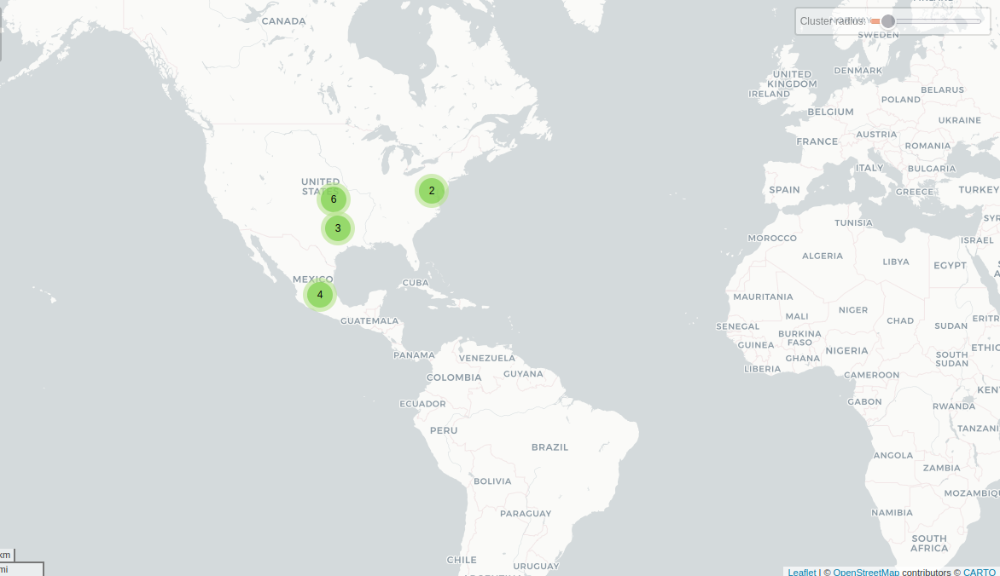

# NextLog

## Fechas de análisis

- **Análisis estático (mediante Exodus Privacy/MobFS):** 07 de abril, 2025
- **Análisis dinámico (mediante análisis de tráfico de red):** 08 de abril, 2025
- **Análisis Posteriores:**

## Archivos analizados

- [apk versión 25.0.1]()
- [pcap versión 1]()
- [Capturas de pantalla]()
- [Reporte MobSF]()

## Descripción de la aplicación
- **Tipo:** Rastreador de actividades en linea
- **Costo:** gratuito
- **Enlace de descarga:** https://play.google.com/store/apps/details?id=com.app.nextlog&hl=es_MX
- **Descargas:** *100K+*
- **Última fecha de actualización:** 09 de abril, 2025
- **Versión:** 1.1.1
- **Desarrollador:** [CODERWALL](https://coderwall.com/)
- **Firma:** [CODEWALL DIJITAL HIZMETLER LIMITED SIRKETI](https://coderwall.com/)
- **Contacto:** info@code-wall.com
- **Condiciones de uso y Política de privacidad:**
    - **Términos del servicio:** https://sites.google.com/view/nextlog/terms
    - **Política de privacidad:** https://sites.google.com/view/nextlog/privacy-policy?authuser=0

- **Descripción en Play Store:**
~~~
NextLog rastrea sus actividades en línea sin interrupciones y le informa al instante sobre los acontecimientos importantes. Le permite gestionar su presencia digital de forma eficaz con análisis inteligentes e informes detallados. Gracias a su interfaz fácil de usar, puede acceder fácilmente a sus datos y no perderse ningún evento crítico con alertas en tiempo real. Manténgase seguro en el mundo digital y siempre en control: ¡esté preparado para el futuro con NextLog!
~~~

## Rastreadores identificados (mediante Exodus Privacy)

|Rastreador|Tipo|
|---|---|
|[Facebook Analytics](https://developers.facebook.com/docs/android)|Analítica|
|[Facebook Login](https://developers.facebook.com/docs/android)|Identificación|
|[Facebook Share](https://developers.facebook.com/docs/android)||
|[Google Firebase Analytics](https://firebase.google.com/)|Analítica|

[Enlace al reporte de Exodus Privacy](https://reports.exodus-privacy.eu.org/en/reports/com.app.nextlog/latest/#trackers)

## Empresas relacionadas con esta aplicación:

|Empresa|Servicios que ofrecen|
|---|---|
|[Akamai International B.V](https://www.akamai.com/es)| CDN, seguridad web, mitigación de DDoS|
|[Amazon](https://aws.amazon.com/es/free/?gclid=Cj0KCQjw2N2_BhCAARIsAK4pEkVOdWeVisgnbhKtNKlE-pdkh3GFex4AoSUfRibjCCwGVYdDRtUiDK0aAn1CEALw_wcB&trk=307cde03-1180-48b3-a852-0fd87ed68ac8&sc_channel=ps&ef_id=Cj0KCQjw2N2_BhCAARIsAK4pEkVOdWeVisgnbhKtNKlE-pdkh3GFex4AoSUfRibjCCwGVYdDRtUiDK0aAn1CEALw_wcB:G:s&s_kwcid=AL!4422!3!646924982326!e!!g!!aws!19636893789!147195440153&all-free-tier.sort-by=item.additionalFields.SortRank&all-free-tier.sort-order=asc&awsf.Free%20Tier%20Types=*all&awsf.Free%20Tier%20Categories=*all)| Publicidad, servicios en la nube (AWS)|
|[Facebook (Meta)](https://about.meta.com/ltam/)| Publicidad, integración de APIs sociales|
|[Google](https://support.google.com/analytics/answer/10607798?hl=en#zippy=%2Cin-this-article)| Publicidad (Ads), analíticas (Google Analytics)|
|[WEBNX](https://webnx.com/)| Infraestructura de internet, servidores dedicados|

### Empresas identificadas a través del Aviso de Privacidad con que se comparten datos:

No se mencionan explícitamente empresas con quienes NextLog comparte datos, unicamente hace referencia al compartimiento de datos con "proveedores de servicio" y "socios comerciales".

### Dominios integrados al código de la aplicación que no pertenecen directamente a los rastreadores

|Dominios|
|---|
|https://github.com/|
|https://docs.revenuecat.com|
|https://ip-api.com/|
|https://instagram.com/|
|https://api64.ipify.org/|
|https://api-diagnostics.revenuecat.com/|
|https://play.google.com/|
|https://errors.rev.cat/|
|https://sites.google.com/|
|https://api.revenuecat.com/|
|https://analytics.us.tiktok.com/|
|https://web.whatsapp.com/|
|https://rev.cat/|

## Permisos

- **Según Exodus Privacy/MobFS:** 15
- **Según prueba de uso:** 1

### Permisos según Exodus Privacy

- ACCESS_ADSERVICES_AD_ID
- ACCESS_ADSERVICES_ATTRIBUTION
- ACCESS_ADSERVICES_CUSTOM_AUDIENCE
- ACCESS_NETWORK_STATE
- AD_ID
- BILLING
- BIND_GET_INSTALL_REFERRER_SERVICE
- CHECK_LICENSE
- DYNAMIC_RECEIVER_NOT_EPORTED_PERMISSION
- FOREGROUND_SERVICE
- INTERNET
- POST_NOTIFICATIONS
- RECEIVE_BOOT_COMPLETED
- VIBRATE
- WAKE_LOCK

El icono :exclamation: indica un nivel 'Peligroso' o 'Especial' de acuerdo a los [niveles de protección de Google](https://developer.android.com/guide/topics/permissions/overview).

### Permisos solicitados durante el uso de la aplicación

- :blue_circle: Notificaciones

:red_circle: Este ícono indica un permiso obligatorio
:blue_circle: Este ícono indica un permiso opcional pero se pierde una funcionalidad particular

## Datos

### Datos solicitados al usuario

#### Datos solicitados durante el registro

- :red_circle: Nombre de la persona a espiar
- :red_circle: Número de teléfono de la persona a espiar

#### Datos solicitados durante el uso de la aplicación

Esta aplicación no solicita a los usuarios ningún dato extra durante el uso de la aplicación

### Tabla de conexiones realizadas durante el uso de la aplicación

| Dirección IP   | Número de Paquetes | País          | Ciudad/Zona    | Organización AS           | Dominio |
| -------------- | ------------------ | ------------- | -------------- | ------------------------- | ------- |
|                |                    |               |                |                           |         |
| 23.205.110.208 | 193                | United States | Irving         | Akamai International B.V. |         |
| 23.218.232.70  | 23                 | United States | Irving         | Akamai International B.V. |         |
| 31.13.93.63    | 21                 | United States | Dallas         | FACEBOOK                  |         |
| 52.2.187.151   | 26                 | United States | Ashburn        | AMAZON-AES                |         |
| 52.204.111.199 | 46                 | United States | Ashburn        | AMAZON-AES                |         |
| 157.240.25.1   | 165                | Mexico        | Querétaro City | FACEBOOK                  |         |
| 157.240.25.60  | 1524               | Mexico        | Querétaro City | FACEBOOK                  |         |
| 157.240.25.174 | 78                 | Mexico        | Querétaro City | FACEBOOK                  |         |
| 173.231.16.77  | 47                 | United States |                | WEBNX                     |         |
| 189.233.214.97 | 26                 | Mexico        | Irapuato       | UNINET                    |         |
| 192.178.52.138 | 21                 | United States |                | GOOGLE                    |         |
| 192.178.52.170 | 60                 | United States |                | GOOGLE                    |         |
| 192.178.52.234 | 27                 | United States |                | GOOGLE                    |         |
| 192.178.56.202 | 25                 | United States |                | GOOGLE                    |         |
| 208.95.112.1   | 17                 | United States |                | TUT-AS                    |         |

### Mapa de conexiones realizadas durante el uso de la aplicación

### Datos recopilados y uso según la Play Store

Google Play Store declara los siguientes datos recopilados por NextLog:

La sección de **Seguridad de los datos** de la aplicación NextLog dice lo siguiente sobre recopilación de datos:
~~~
No se recopilan datos
El desarrollador indica que esta app no recopila datos del usuario.
~~~
Sin embargo, la sección **Acerca de esta app** de la aplicación NextLog dice lo siguiente:
~~~
Gracias a su interfaz fácil de usar, puede acceder fácilmente a sus datos y no perderse ningún evento crítico con alertas en tiempo real.
~~~

### Datos compartidos y uso según la Play Store

La sección de **Seguridad de los datos** de la aplicación NextLog dice lo siguiente sobre compartir datos con terceros:
~~~
No se comparten datos con terceros
El desarrollador indica que esta app no comparte datos del usuario con otras organizaciones o empresas.
~~~

### Prácticas de seguridad

- Los datos están cifrados en tránsito
- Puedes solicitar que se borren los datos

### Datos recopilados según la Política de privacidad
| Datos                                                                                                                                                                                                                                    |
| ---------------------------------------------------------------------------------------------------------------------------------------------------------------------------------------------------------------------------------------- |
| **Información personal:** Nombre, Apellido, Número de teléfono, Dirección de correo electrónico (si se proporciona o se extrae de redes sociales)                                                                                        |
| **Datos de uso:** Dirección IP, Tipo y versión del navegador, Páginas visitadas, Fecha y hora de visita, Tiempo en cada página, Identificadores únicos del dispositivo, Tipo de dispositivo móvil, Sistema operativo, Datos diagnósticos |
| **Datos desde redes sociales:** Nombre, Correo electrónico, Lista de contactos, Actividades, Foto de perfil, Descripción de actividad (si se comparte o se interactúa públicamente)                                                      |

### Uso general de la información según la Política de privacidad

- Proporcionar y mantener el servicio, incluyendo el monitoreo de su uso.
- Gestionar el registro y acceso del usuario a su cuenta.
- Cumplir con obligaciones contractuales relacionadas con productos o servicios adquiridos.
- Contactar al usuario mediante correo electrónico, llamadas, SMS o notificaciones push sobre actualizaciones, seguridad o información relevante del servicio.
- Proporcionar noticias, ofertas especiales e información sobre productos, servicios o eventos similares a los previamente adquiridos o consultados por el usuario.
- Atender y gestionar solicitudes hechas por el usuario.
- Evaluar o llevar a cabo transferencias comerciales como fusiones, adquisiciones o ventas de activos que incluyan datos personales de los usuarios.
- Realizar análisis de datos, identificar tendencias de uso y evaluar la efectividad de campañas promocionales.
- Mejorar el servicio, productos, marketing y experiencia del usuario.

#### Información compartida con terceros

- Se comparte información personal con proveedores de servicios que ayudan a analizar el uso del servicio y contactar al usuario.
- La información puede ser compartida o transferida durante procesos comerciales como fusiones, adquisiciones, financiamiento o ventas de activos.
- Se puede compartir información personal con afiliados bajo el control de la misma empresa matriz o grupo empresarial, quienes deben cumplir esta misma política de privacidad.
- Se puede compartir información con socios comerciales para ofrecer productos, servicios o promociones relacionados.
- Cuando el usuario interactúa en áreas públicas de la app o mediante redes sociales, su nombre, perfil y actividad pueden ser visibles para otros usuarios.
- Se puede divulgar información personal para cumplir con obligaciones legales o responder a solicitudes de autoridades públicas.
- Se puede divulgar información personal para proteger derechos legales, investigar actividades indebidas o salvaguardar la seguridad de los usuarios.
- La información puede transferirse a otros países donde las leyes de protección de datos difieran, siempre bajo medidas razonables de seguridad.
- Se puede divulgar información con el consentimiento explícito del usuario para cualquier otro propósito.

**Nota:** La política **no proporciona una lista específica de empresas o proveedores terceros** como AWS, Google Analytics, Meta, etc.

## Funciones particulares de la aplicación:

### 1. Registro para espionaje
Durante el registro a esta aplicación, se solicitó un *username* (usuario) de una cuenta de instagram o un número de teléfono vinculado a una cuenta de whatsapp con la finalidad de obtener el contenido de los mensajes pertenecientes a este usuario o cuenta de whatsapp.

### 2. Pago por "funciones especiales"

Cuando el interesado en **espiar** los chats y conversaciones de un usuario de instagram o cuenta de whatsapp ingresa la información solicitada, la aplicación muestra una pantalla que contiene una interfaz parecida a whatsapp o instagram con una lista de mensajes y chats que son ilegibles en previsualización, sin embargo, se muestra un botón que ofrece *desencriptar* los mensajes de la/las cuentas, función que al día 10 de abril de 2025 cuesta 119 pesos mexicanos, equivalente a 5.79 dólares estadounidenses.

**Nota**
    - NextLog no informa sobre esta función en su descripción que declara en Google Play Store
    - NextLog no menciona el tiempo que demora *desencriptar* los mensajes del usuario espiado.

## Notas

- De una breve lectura en los comentarios de esta aplicación en Google Play Store se puede destacar que:
  - Esta aplicación solicita un pago por 8 días de uso *premium*
  - La función de *desencriptar* tarda de 240 a 260 horas, lo que representa entre 10 y 11 días, por lo que, solicita al usuario realizar un nuevo pago debido a que primer pago realizado únicamente es por usar la función  durante 8 días.
  - La aplicación no muestra algún tutorial de uso

## Conclusiones

### Contradicciones en la declaración de recolección uso de datos en Google Play Store

Aunque la información declarada por NextLog en Google Play Store indica que la aplicación NextLog no recopila ni comparte datos, la política de privacidad revela lo contrario. La aplicación integra rastreadores de Facebook y Google Firebase Analytics, y solicita datos personales durante el registro, como nombre y número de teléfono. Estas acciones contradicen directamente las declaraciones de NextLog en Google Play Store.

### Permisos omitidos

Exodus Privacy identificó que la aplicación solicita al menos 15 permisos, algunos de ellos relacionados con servicios de anuncios, funcionamiento en segundo plano y red. Sin embargo, durante el uso visible de la aplicación solo se solicita permiso para mostrar notificaciones. Esta situación demuestra que otras funciones se ejecutan sin consentimiento explícito ni transparente hacia los usuarios.

Así mismo, en al declaración de permisos de Google Play Store, NextLog no menciona que permisos son solicitados al usuario durante la ejecución.

### Recolección de datos personales

Durante el proceso de registro, la aplicación solicita el nombre y número de teléfono de la persona que se desea espiar. Esta acción es una clara representación de la recolección intencionada de información personal y sensible de terceras persinas con fines de **vigilancia no autorizada**, lo que implica una acción ilegal y no consensuada.

A nivel de usuario, la aplicación también hace una recolección de datos excesiva, como nombre, dirección IP, version del navegador y paginas visitadas por el usuario.

### Falta de declaraciones de terceros en la política de privacidad

La política de privacidad de NextLog menciona unicamente que los datos pueden ser compartidos con proveedores de servicios y socios comerciales, pero no especifica con qué empresas. El análisis de tráfico revela conexiones  con dominios y servicios de Meta, Google, Amazon, Akamai y RevenueCat, lo cual deja en claro la falta de transparencia en la política de privacidad.

### Función premium sospechosa

NextLog ofrece una supuesta función de *desencriptación* de mensajes tras registrar una cuenta de instagram o un número de whatsapp. El acceso tiene un costo de 119 pesos mexicanos por 8 días, pero el proceso de desencriptación tarda entre 10 y 11 días, lo que obliga al usuario a pagar nuevamente. No se proporcionan explicaciones técnicas, tutoriales ni garantías de funcionamiento.

En general, NextLog demuestra ser una aplicación que carece de coherencia entre lo declarado y lo que se aplica en realidad durante la ejecución de la aplicación.
NextLog es una aplicación altamente invasiva en los siguientes niveles:
  - NextLog es vendida como una aplicación que *"permitirá"* conocer y espiar los chats y conversaciones de terceros justificándolo como **buena practica de control digital**, lo cual, recae en **espionaje y vigilancia** que involucra posibles daños a terceros tanto digitales, psicológicos y físicos.
  - Esta aplicación es una **estafa digital**, ya que solicita un pago inicial y posteriormente solicita mas pagos para la ejecución de una función premium de *desencriptado* que ni siquiera funciona según las experiencias de los usuarios y las experiencias del análisis .
  - La información que recolecta y los permisos que que contiene son en **extremo invasivos** y carecen de una explicación explicita y detallada en la Política de Privacidad  y en Google Play Store

En esta ocasión podemos confirmar que NextLog es una aplicación **DATAVOREZCAAA**
