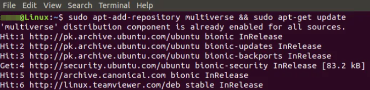
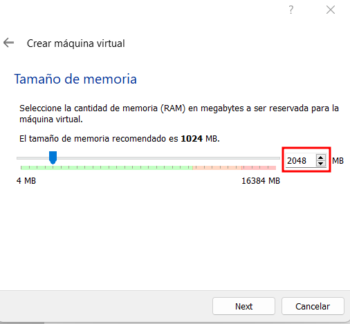
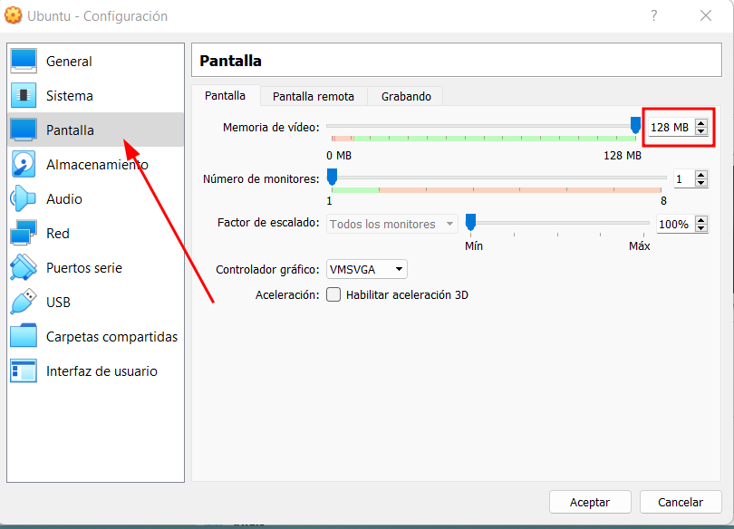
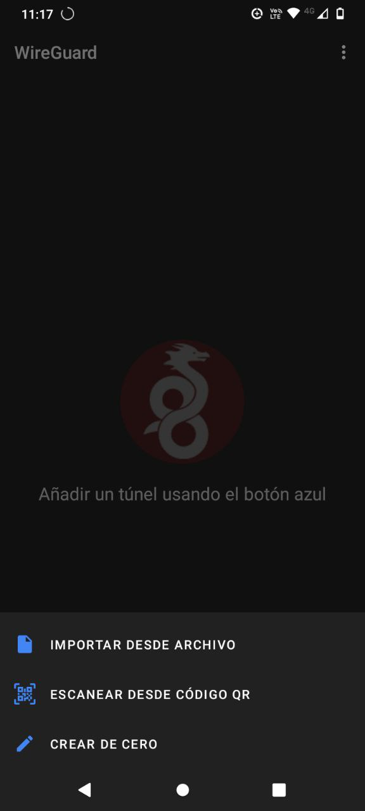

# Tutorial: Instalación de laboratorio para analisis de aplicaciones moviles.

## **Introducción**

En este tutorial vamos a configurar un laboratorio para el analisis de aplicaciones móviles utilizando las herramientas de virtualización VirtualBox y VMWare, así como tambien las herrameintas de captura de tráfico de red Wireshark y Tshark.

El siguiente diagrama representa el proceso a seguir con la diferencia que usaremos la herramienta Wireguard en vez de OpenVPN:


> **Importante**: Si utilizas la aplicacion Draeneg para capturar tráfico de red, gran parte de la preparación de este laboratorio no será necesario. Te sugerimos visitar la sección para instalar Wireshark en este tutorial. Adicionalmente, te sugerimos consultar [el tutorial de Draeneg](https://docs.datavoros.org/tutoriales/02-1-captura-de-trafico-draeneg/).

## **Pasos a realizar**

- Instalar software de virtualización
    - Crear una máquina virtual con Ubuntu 
- Instalar Wireguard en nuestro teléfono
- Instalar WireGuard en Ubuntu
- Instalar Wireshark y Tshark


## Instalación de software de virtualización

### **Software de virtualización a instalar**
* **Virtualbox**
* **VMWare**

VirtualBox y VMWare son gratuitos y pueden ser instalados en sistemas Windows, Linux y MacOS, aunque VMWare ofrece una versión de pago.

> **Iportante**: Tanto VirtualBox como VMWare funcionan para el laboratorio de análisis de aplicaciones, sin embargo, te recomendamos utilizar VirtualBox en linux y VMWare en Windows.

### **Instalación de VirtualBox en Linux (Ubuntu)**
> **Nota**: *Esta instalación también funciona para sistemas basados en Ubuntu*.

#### **Paso 1: Actualizar sistema y preparar repositorio**

- Abre la terminal y ejecuta el sigueinte comando
   ``` 
    sudo add-apt-repository multiverse && sudo apt-get update
    ```
    
#### **Paso 2: Instalación de VirtualBox**
- Ejecuta el siguiente comando para instalar virtualbox
    ```
    $ sudo apt install virtualbox
    ```
    * Si se solicita confirmación, presiona Y y luego Enter.

     

#### **Paso 3: Iniciar VirtualBox**    
- Una vez instalado VirtualBox, puedes ejecutarlo de las sigueintes maneras:
    - Abre tu terminal y ejecuta la sigueinte linea:
        ~~~
        $ virtualbox
        ~~~
    - Busca el icono de VirtualBox en la lista de aplicaciones.


Alternativamente, se puede instalar VirtualBox desde la *Ubuntu Software App*.

### **Creación y configuración de una máquina virtual Ubuntu en VirtualBox**

Dejamos aquí el [enlace al tutorial oficial de Ubuntu](https://ubuntu.com/tutorials/how-to-run-ubuntu-desktop-on-a-virtual-machine-using-virtualbox#2-create-a-new-virtual-machine) para crear una maquina virtual. Este tutorial es valido para Linux y para Windows

#### **Resumen de los pasos presentados en el tutorial oficial de Ubuntu**

1. Descargar una imagen ISO de ubuntu
2. Crear una maquina virtual
3. Agregar la imagen ISO de UBuntu
4. COnfigurar la maquina virtual
5. Ejecutar la maquina virtual

#### Alternativa: Descargar un disco virtual preconfigurado

Puedes descargar un disco virtual con Ubuntu preinstalado desde [este enlace](https://www.osboxes.org/ubuntu/) (recomendamos la versión 20.04). Este disco virtual es compatible tanto con VirtualBox como con VMWare. 


#### Pasos a seguir

1. **Descargar el archivo VDI**  
   - El archivo está comprimido en formato `.7z`. Extraerlo con [WinRAR](https://www.rarlab.com/download.htm) o [7zip](https://www.7-zip.org/).  
   - En Linux, no necesitas instalar estos programas, ya que la extracción puede hacerse desde la terminal.

2. **Abrir VirtualBox y crear una nueva máquina virtual**  
   - Hacer clic en **Nueva**.  
   

3. **Configurar la máquina virtual**  
   - Asignar un nombre y seleccionar la carpeta donde se guardará.  
   - Tipo de sistema operativo: **Linux**.  
   - Versión: **Ubuntu (64-bit)**.  
   - Hacer clic en **Next**.  
   

   *La interfaz puede variar ligeramente entre Linux y Windows, pero el proceso es similar.*

4. **Asignar memoria RAM**  
   - Sugerimos 2GB si tu computadora tiene al menos 8GB de RAM.  
   - Si tienes menos de 8GB de RAM, selecciona 1GB; si tienes más de 8GB de RAM, selecciona 4GB.  
   - Haz clic en **Next**.  
   

5. **Seleccionar el disco duro virtual**  
   - Escoge la opción **Usar un archivo de disco duro virtual existente**.  
   - Hacer clic en la carpeta para explorar archivos.  
   

6. **Añadir el disco descargado**  
   - Haz clic en **Añadir** y seleccionar el archivo VDI extraído.  
   

7. **Configurar recursos de hardware**  
   - Ve a la sección **Sistema -> Procesador** y asigna dos núcleos de CPU.  
   

   - En **Pantalla**, asigna 128MB de memoria de video. Si tu computadora tiene una tarjeta de video dedicada, activa la casilla de **Aceleración**.  
   

8. **Configurar la red**  
   - Ve a **Red -> Adaptador 1 -> Conectado a:** y selecciona **Adaptador Puente**. Esto permite que la máquina virtual se conecte a la red local y obtenga su propia dirección IP.  
   

9. **Finalizar la configuración y encender la máquina virtual**  
   - Haz clic en **Crear** y luego en **Iniciar**.  
   - Selecciona la máquina virtual desde el panel izquierdo.  
   

   La máquina puede tardar unos minutos en iniciarse. Finalmente, deberías ver la pantalla de bienvenida de Ubuntu.  
   

### **Instalación de VMWare en Windows**   

#### Paso 1: Descarga del instalador

- Descarga el archivo ejectuable desde este [enlace](https://customerconnect.vmware.com/en/downloads/details?downloadGroup=WKST-PLAYER-1623-NEW&productId=1039&rPId=85399).


#### Paso 2: Instalación
- Dirígete a la carpeta de descargas y haz doble clic en el archivo.  
   * Sigue las instrucciones del instalador.


### **Creación y configuración de una máquina virtual Ubuntu en VMWare**

1. **Descargar la imagen ISO de Ubuntu**:  
   Descarga la imagen de [Ubuntu](https://releases.ubuntu.com/20.04.4/).  

2. **Crear una nueva máquina virtual**:  
   - Abre VMWare y selecciona **Create a New Virtual Machine**.  
   

3. **Seleccionar la imagen ISO**:  
   - Elige **Installer disc image (iso)** y haz clic en **Browse** para seleccionar la imagen descargada. Haz clic en **Next**.  
   

4. **Configurar Easy Install**:  
   VMWare soporta la función *Easy Install*, que automatiza el proceso de instalación si el sistema operativo es compatible.

   - Completa los campos de **Full Name**, **Username**, **Password** y **Confirm Password**. Haz clic en **Next**.  
   

5. **Asignar recursos y almacenamiento**:  
   - Nombra la máquina virtual y elige una ubicación para guardarla. Haz clic en **Next**.  
   

   - Selecciona el tamaño del disco. Se recomienda un mínimo de 25GB. Haz clic en **Next**.  
   

6. **Finalizar configuración**:  
   - Haz clic en **Finish**.  
   - Aparecerá un mensaje de advertencia. Haz clic en **OK**:  
     ```
     You are running this virtual machine [...]
     ```

7. **Instalación automática de Ubuntu**:  
   - El proceso de instalación comenzará automáticamente y puede tomar tiempo.  
   - Al finalizar, aparecerá la pantalla de bienvenida de Ubuntu. Selecciona el usuario y escribe la contraseña configurada.  
   

8. **Ajustes finales**:  
   - Expande la ventana de la máquina virtual y aplica las configuraciones recomendadas por Ubuntu.  

>**Importante**: No se cubrirá la importación de imágenes de disco de OSBoxes en este tutorial, pero puedes consultar la guía en [este enlace](https://www.osboxes.org/guide/).

### Configuración de red de la máquina virtual

1. **Apagar la máquina virtual**  
   - En VMWare, ve a **Player -> Power -> Shut Down Guest** y acepta el diálogo que aparece.

2. **Editar configuración de red**  
   - Inicia VMWare nuevamente y selecciona la máquina virtual desde el panel izquierdo.  
   - Haz clic en **Edit virtual machine settings**.  
   

3. **Cambiar a adaptador puente (Bridged)**  
   - En **Network Adapter**, selecciona la opción **Bridged** bajo **Network Connection** y haz clic en **OK**.  
   

   >**Nota**: Esta configuración permite que la máquina virtual se conecte a la red local como si fuera un dispositivo independiente, lo que es requerido para este laboratorio.

4. **Reiniciar la máquina virtual**  
   - Inicia nuevamente la máquina virtual.  
   - Aparecerá una advertencia al reiniciar:  
       
     Haz clic en **Aceptar** para continuar.

5. **Recomendación para apagar la máquina**  
   - Para futuras ocasiones, utiliza **Player -> Power -> Suspend** para apagar la máquina virtual de manera más rápida y eficiente.  
   - La razón de haber apagado la máquina completamente en este paso es que no se pueden modificar las configuraciones de red mientras la máquina está suspendida o en ejecución.


## Instalación de Wireguard

### Instalación en nuestro dispositivo Android

1. **Descargar e instalar WireGuard desde Play Store**
    - Busca "WIreGuard" en la Play Store y presiona **Instalar**
    
    

2. **Abrir aplicación**
    - Cuando finalice la instalación, presiona **Abrir**
    - Deja la aplicación abierta para configurarla mas tarde.
    
    
    

### Instalación en la maquina virtual Ubuntu

1. **Abre una temrinal en Ubuntu**

    

2. **Identifica las interfaces de red**
    - Escribe el sigueinte comando:
        ~~~
        ip a
        ~~~
    - Identifica la segunda interfaz (por ejemplo, `ens33`) y toma nota de la dirección IP local asignada (por ejemplo, `192.168.37.133`).

    

3. **Instalar Git**
    - Escribe el sigueinte comando en la terminal para instalar git
        ~~~
        sudo apt update && sudo apt install git
        ~~~
    - Introduce tu contraseña cuando se te solicite y presiona **Enter** para continuar.

4. **Dscargar el script de instalación para wireguard**
    - Descarga el script con el comando:
        ~~~ 
        git clone https://github.com/angristan/wireguard-install
        ~~~

5. **Acceder al directorio del script**
    - Cambia al directorio descargado
        ~~~
        cd wireguard-install
        ~~~
6. **Dar permisos de ejecución al script**  
   - Ejecuta el siguiente comando para habilitar permisos de ejecución:  
        ~~~
        chmod +x wireguard-install.sh
        ~~~
7. **Ejecutar el script como administrador**  
   - Inicia el script con privilegios de superusuario: 
        ~~~
        sudo ./wireguard-install.sh
        ~~~
8. **Configurar WireGuard paso a paso**  
   Responde a las preguntas del script siguiendo las recomendaciones:  
   - **Dirección IP pública**: Confirma la dirección IP local identificada anteriormente.  
      ~~~
     IPv4 or IPv6 public address: 192.168.37.133
      ~~~ 
   - **Interfaz pública**: Confirma el nombre de la interfaz.  
      ~~~
     Public interface: ens33
      ~~~ 
   - **Nombre de la interfaz de WireGuard**: Usa el valor predeterminado `wg0`.  
      ~~~
     WireGuard interface name: wg0
      ~~~  
   - **Dirección IPv4 del servidor**: Usa el valor predeterminado.  
      ~~~
     Server's WireGuard IPv4: 10.66.66.1
      ~~~  
   - **Dirección IPv6 del servidor**: Usa el valor predeterminado.  
      ~~~
     Server's WireGuard IPv6: fd42:42:42::1
      ~~~  
   - **Puerto del servidor**: Usa el valor predeterminado.  
      ~~~
     Server's WireGuard port [1-65535]: 49259
      ~~~  
   - **Resolver DNS para clientes**: Acepta los valores sugeridos.  
      ~~~
     First DNS resolver to use for the clients: 94.140.14.14  
     Second DNS resolver to use for the clients (optional): 94.140.15.15
      ~~~  
   - **Nombre del cliente**: Asigna un nombre, por ejemplo, `socialtic`.  
      ~~~
     Client name: socialtic
      ~~~  
   - **Dirección IPv4 del cliente**: Usa el valor predeterminado.  
      ~~~
     Client's WireGuard IPv4: 10.66.66.2
      ~~~  
   - **Dirección IPv6 del cliente**: Usa el valor predeterminado.  
      ~~~
     Client's WireGuard IPv6: fd42:42:42::2
      ~~~
9. **Conectar con el dispositivo Android (Cliente)**
    - Ahora nos aparecerá un código QR en la pantalla. (Si no se ve completo, expandir la terminal).
        
        
    
    - Toma el celular con la aplicación abierta
        - Haz click en el signo de **+** y selecciona **Escanear desde código QR**. 
        
        
    
    - Aceptar el permiso de Fotos y Videos
    - Rellenar nombre 
    - Haz click en **Crear Tunel**
    - Conectar apretando en el círculo 
    - Aceptar la **Solicitud de conexión**

Listo, Ahora estás conectado a tu servidor de WireGuard. Toto el trafico de red que envíes o recibas, pasará a través del servidor, permitiéndote capturar y analizar datos de manera segura.

## Instalación de Wireshark y Tshark

### Pasos a seguir

1. **Instalar Wireshark**  
   Abre la terminal en tu máquina virtual y ejecuta el siguiente comando:  
   ~~~
   sudo apt install wireshark
   ~~~
   Como ya sabemos, esto instalará el programa de Wireshark. 
   A la mitad de la instalación de Wireshark, aparecerá la siguiente pregunta:  

     
   
   Recomendamos seleccionar la configuración estándar y elegir **No**. Esto asegura que solo usuarios con privilegios elevados puedan capturar paquetes, manteniendo la seguridad del sistema.

2. **Instalación de Tshark**

   Una vez finalizada la instalación de Wireshark (que también puede realizarse desde la Ubuntu Software App), procede a instalar Tshark ejecutando el siguiente comando en la terminal:  
   ~~~
   sudo apt install tshark
   ~~~
   ¡Listo, ya terminamos de configurar nuestro laboratorio!
   


