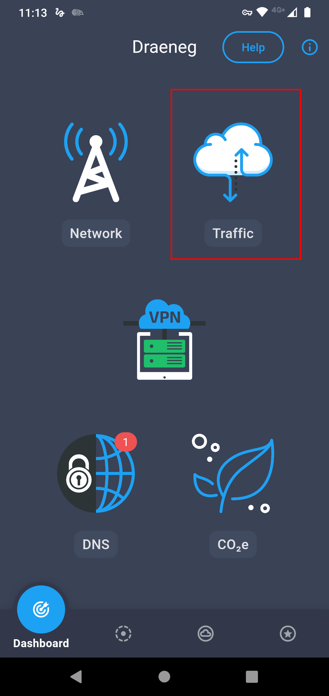
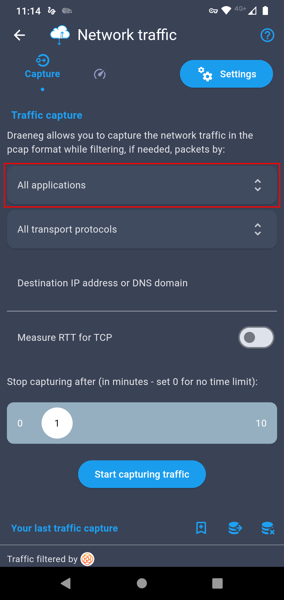
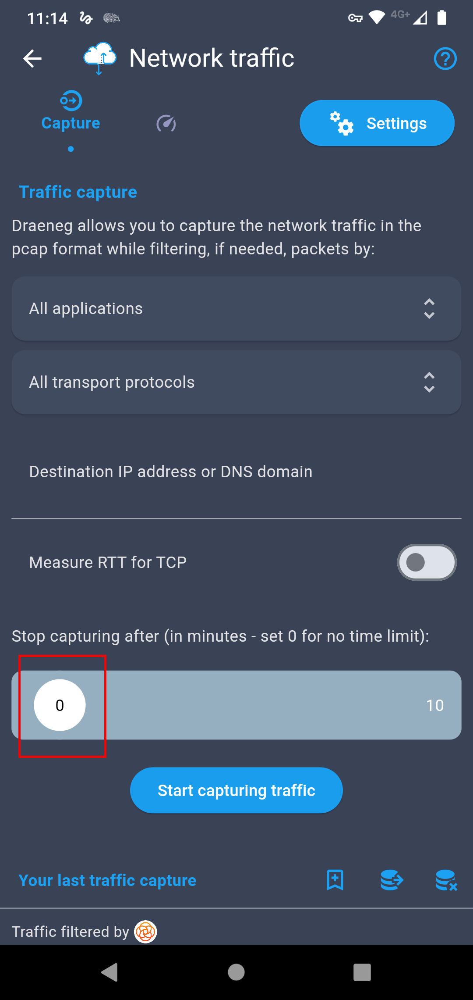
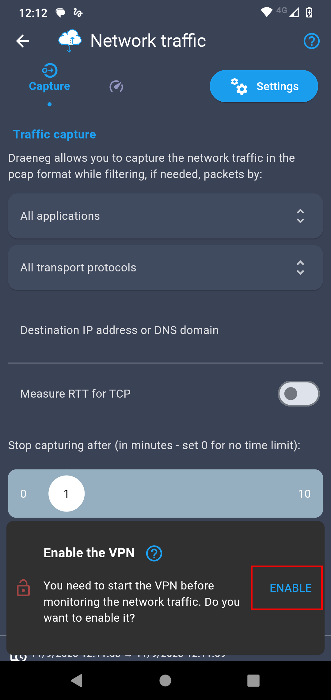
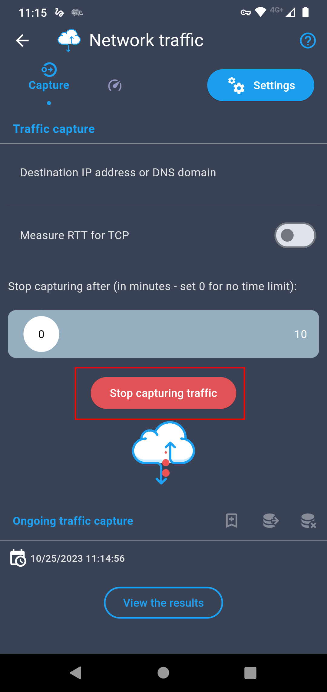
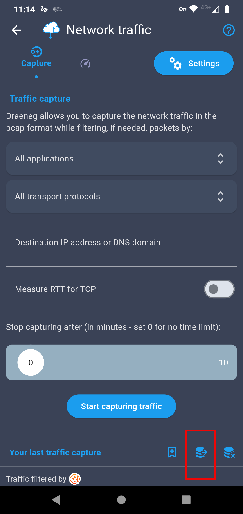
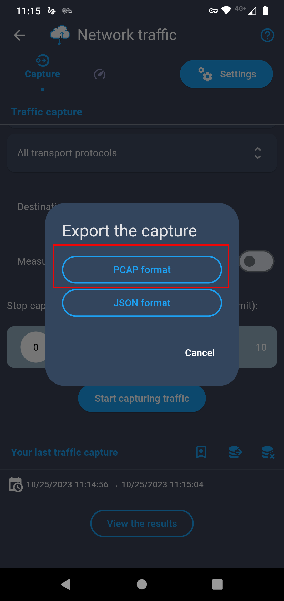

# Turotial: Captura de tráfico a través de la aplicación Draeneg

## Introducción
En este tutorial, aprenderás a capturar el tráfico de una aplicación en un dispositivo Android utilizando Draeneg, una herramienta intuitiva que emplea una VPN interna para registrar los paquetes de datos generados por cualquier aplicación en ejecución.

A lo largo de esta guía, se detallarán los pasos necesarios para instalar Draeneg, configurar la captura de tráfico y exportar los datos en formato PCAP, facilitando su posterior análisis con herramientas especializadas como Wireshark.

## Pasos

1. **Instalar la aplicación que se requiere analizar**
	- Asegurate de que la aplicación que deseas analizar esté instalada en tu dispositivo.

2. Instalar Draeneg
	- Descarga [Draeneg](https://play.google.com/store/apps/details?id=com.orange.labs.draeneg) desde la Google Play Store.

3. Abrir Draeneg y seleccionar **Traffic**
	- Abre Draeneg y en menú principal selecciona la opcion **Trafic**

	

4. **Seleccionar la aplicación a analizar**
	- En la pestaña **All Applications**, selecciona la aplicación que queremos analizar.
	
	

5. **Configurar el tiempo de captura**
	- En la sección **Stop Capturing After...**, configura el valor en **0** para desactivar el tiempo limite de captura.
	
	

6. **Iniciar la captura del trafico**
	- Haz click en **Start Capturing Traffic**
	
	

7. **Habilitar la VPN interna**
	- Aparecerá la leyenda solicitando habilitar la VPN haz click en **Enable**. 
	- Una vez habilitada la VPN, haz click en **Start Capturing Traffic**.

	

	> Draeneg creará una VPN interna en el teléfono para filtrar y capturar los paquetes de datos.

8. **Usar la aplicación analizada**	
	- Abre y utiliza normalmente la aplicación que se quiere analizar y utilizarla normalmente. Esto creará tráfico que será capturado por Draeneg.
	
9. **Finalizar la captura**
	- Una vez terminado, cierra la aplicación que estas analizando y regresa a Draeneg.
	- Haz click en **Stop capturing traffic** para deterner la captura.

	

10. **Exportar los datos capturados** 	
	- Haz click al ícono de **Exportar base de datos**

	

	- Selecciona el formato **PCAP**

	

11. **Guardar el archivo**

	- ELige una carpeta de destino y aigna un nombre al archvio.
	- Extrae el archivo del dispositivo a tu computadora.

Como **resultado**, el archivo generado estará en formato **PCAP** y podrá ser **analizado** posteriormente con herramientas como **Wireshark**

## Conclusión

	Ahora que has aprendido a realizar esta captura, el siguiente paso es interpretar la información obtenida y utilizarla para mejorar la seguridad y optimización de tus sistemas. ¡Buena suerte en tu análisis!
