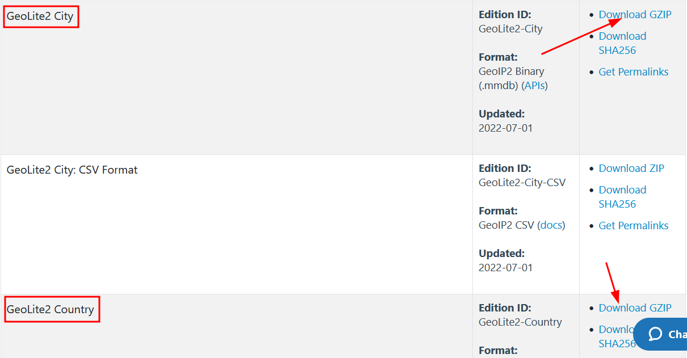

# Captura y análisis del tráfico de red de cualquier aplicación en Android
En esta sección mostraremos cómo capturar los paquetes de red de un celular desde una máquina virtual para luego analizarlos. Los prerrequisitos son:
   - Cliente de WireGuard instalado en el celular y configurado. 
   - Máquina virtual con el servidor VPN WireGuard instalado.
   - El cliente y el servidor deben estár los dos en la misma red local.
      
La idea es conectar el teléfono a nuestra red privada virtual (VPN) y en esa red correr otro programa que se llama Tshark, que nos permitirá capturar el tráfico de red (los datos que envía y recibe nuestro teléfono) para luego poder analizarlos con Wireshark.

Como última nota, Tshark es la versión de línea de comandos de Wireshark. Utilizamos este programa porque resulta más rápido y cómodo para la captura de paquetes.

## Otros requerimientos 

Android es un sistema operativo de Google utilizado en teléfonos y tabletas. La versión que normalmente viene de fábrica en los dispositivos, es una versión modificada de la versión original,  y está hecha por el fabricante del dispositivo físico (Samsung, Motorla, LG, Nokia, etc.) y ulteriormente modificada por nuestro proveedor de servicio de telefonía móvil. Se supone que Android es *Open-Source* (código abierto), lo que quiere decir que cualquiera puede tener acceso al código de Android y modificarlo a su gusto. 

Hay varias comunidades de desarrolladores que han modificado las versiones de Android para hacerlas más privadas, más seguras, más rápidas, más ligeras, con otro tipo de funcionalidades y muchas cosas más. Entre ellas, una de las más conocidas y utilizadas es [LineageOS](https://lineageos.org/). Soporta varias marcas y modelos de dispositivos y es gratis. Como es bastante utilizada, hay muchos foros donde uno puede encontrar soluciones si uno se encuentra con problemas. 

Para las pruebas de las aplicaciones, nosotros hemos utilizado un celular que justamente tiene esta versión de Android instalada. Sin embargo, no es tan sencillo instalarla e implica borrar todos los datos del teléfono, además de que existe el riesgo (mínimo) de *romper* nuestro celular y dejarlo inutilizable. Idealmente, las pruebas del tráfico de aplicaciones deberían hacerse con un celular que tenga LineageOS, esto, por la simple razón de que es una versión de Android desprovista de muchísimas de las funciones y aplicaciones que el fabricante, nuestro proveedor de telefonía y el propio Google agregan a nuestros celulares. De esto resulta que la captura del tráfico de red es más limpia y es más fácil controlar qué aplicaciones se están conectando a Internet. 

Sin embargo entendemos que tener un celular con LineageOS no siempre es factible o lo más sencillo. En este sentido, otra solución puede ser desinstalar la mayoría de apps presentes en el celular e [inhabilitar](https://support.google.com/android/answer/2521768?hl=es) las que no se pueden desinstalar. También entendemos que esto sea un probelma, así que nuestra tercera opción es sencillamente quitarle a todas las apps el permiso de acceso a internet. Dejamos aquí una [guía](https://www.digitalcitizen.life/how-block-internet-access-specific-apps-android/) para hacerlo cuando se tiene Android 10. Dejamos aquí una [guía](https://krispitech.com/how-to-prevent-android-apps-from-sending-and-receiving-data-in-background/) para Android 11. A partir de Android 12, esta opción de deshabilitar el acceso a Internet fue eliminada (o no la pudimos encontrar), y ahora sólo queda el acceso a datos en segundo plano. Esta opción también nos puede ser de utilidad, ya que, al eliminar este permiso, sólo la app que esté abierta se conectará a Internet. Ojo! Es importante, al hacerlo, marcar a cuáles apps se les quitó este permiso, para poder volver a dárselos. Hay muchas apps que necesitan acceder a datos en segundo plano para proporcionar ciertas funcionalidades, por ejemplo, Outlook o Gmail o Whatsapp, para avisar al usuario si tiene algún nuevo mensaje.  
Para quitar este permiso, ir a **Configuración** (el ícono con la rueda de engrane); **Apps**, dar click en la app deseada, luego **Wi-Fi y datos móviles** y eliminar el permiso de **Datos en segundo plano**.

## Captura de datos

- Instalar la aplicación que se quiere analizar
- Cerrar todas las aplicaciones que están corriendo
- Activar WireGuard
- En la máquina virtual, en la consola, inicializar el programa Tshark. Para esto, el comando es:
   
   ```
   sudo tshark -i enp0s3 -w /tmp/nombredelapp.pcap
   ```
El modificador -i, le dice a Tshark a qué interfaz (i viene de *interface*) conectarse. La que nos interesa siempre va a tener el prefijo "en", ya que esto hace referencia a Ethernet, que es la manera en la cual nuestra máquina virtual se conecta a nuestra red local. Los nombres más comunes son enp0s3 y ens33.  El modificador -w (write) le indica a Tshark dónde guardar el tráfico de red capturado. Aquí utilizamos la carpeta tmp (temporal) para evitar problemas con los permisos de escritura de Linux. Poner el nombre que se quiera al archivo, sugerimos el nombre de la aplicación, y poner la extensión del archivo en .pcap (que es la extensión de los archivos que puede abrir Wireshark).

- Abrir la aplicación que queremos analizar. Si todo está bien, veremos algo similar a esto en nuestra pantalla:


El número de hasta abajo irá aumentando. Estos son los paquetes de datos que estamos capturando. 

- Explorar la aplicación e intentar utilizar todas sus funciones. Esto es importante para poder saber a todos los servidores a los que se conecta. 

- Después de explorar la aplicación, cerrarla en el celular y en la consola apretar la tecla **ctrl + c**. Esto manda la señal al programa de Tshark de detenerse.

- Si estamos contentos con nuestro archivo, es decir, si no hubo mayores problemas en la captura, podemos moverlo a nuestro directorio de documentos en la máquina virtual. Es importante guardar este archivo incluso después del análisis, para tenerlo como referencia. Para hacer esto hay que poner el siguiente comando

sudo chmod 777 /tmp/nombredelapp.pcap

Este comando modifica (como habíamos hecho en el tutorial anterior) los permisos del archivo, de tal manera que lo podamos mover de lugar. No es la solución más elegante, pero para este tutorial nos sirve. 

- Una vez cambiados los permisos, podemos escribir este comando:
~~~
mv /tmp/nombredelapp.pcap /home/seguridad/Documentos
~~~
*seguridad* es el nombre de usuario que tenemos en nuestra instalación. 

## Análisis del tráfico de red

### Configuración de Wireshark 

[Wireshark](https://es.wikipedia.org/wiki/Wireshark) es un programa que permite analizar el tráfico de red. El análisis de este tipo de tráfico se puede hacer para detectar problemas en la configuración de una red, detectar malware y otras tantas cosas. En nuestro caso, hay dos cosas que nos interesan de sobre manera: uno, saber qué conexiones hace nuestra aplicación con el protocolo [HTTP](https://es.wikipedia.org/wiki/Protocolo_de_transferencia_de_hipertexto) (si las hay), y dos, conocer todos los servidores que contacta nuestra aplicación.

Un protocolo de red son una serie de reglas que permite que dos servidores se puedan comunicar entre ellos. En la actualidad, la mayoría de la información en internet viaja gracias al protocolo HTTP. Este protocolo, en un inicio, no estaba cifrado, de tal manera que un agente mal intencionado podía acceder a esta información haciendo algo similar a lo que nosotros hacemos en nuestro análisis, poniendo un programa (en este caso Tshark) entre dos servidores y capturando la información. Como esto suponía un problema de seguridad mayúsculo (imaginemos, por ejemplo, que los datos que se están transfiriendo son los datos de una tarjeta de crédito), se inventó el protocolo HTTPS, que es sencillamente el protoclo HTTP pero cifrado. Gracias a esto, si un tercero captura nuestros datos, no puede saber qué hay en ellos. Es por esto que nos interesa saber si nuestra aplicación todavía manda datos sin cifrar, es decir en HTTP. Es un análisis básico de seguridad. 

Segundo, como nuestro análisis está enfocado a la privacidad, queremos conocer a qué servidores manda información nuestra aplicación.

Para poder hacer este doble análisis, lo primero que tenemos que configurar nuestro programa Wireshark.

- Lo primero que haremos será agregar una base de datos donde están registradas una gran cantidad de direcciones IP, a quién pertenece esta dirección y dónde se localiza en el mundo. En otras palabras, saber a quién pertece y dónde está cualquiera de los servidores que contacta nuestra aplicación. Para poder descaragar esta base de datos, lo primero que hay que es registrarse en esta [página](https://www.maxmind.com/en/geolite2/signup?lang=en).

- Una vez registrados, hay que descargar los siguientes archivos (que son las bases de datos en cuestión):
    - Geolite2 ASN
    - GeoLite2 City 
    - GeoLite2 Country   
 

- Después de descargarlos, crearemos un directorio en donde guardarlos. En este caso le llamaremos MaxMind. 

- Vamos a la carpeta de descargas (o donde se hayan descargado estos archivos) y damos doble click. Veremos que adentro hay tres carpetas con un nombre similar a :
    - GeoLite2-ASN_20220614
    - GeoLite2-Country_20220614
    - GeoLite2-City_20220614   
Extraemos estas carpetas y las guardamos en la carpeta de MaxMind.     

- Ahora abrimos Wireshark, y ahí nos vamos a *Edición* --> *Preferencias* --> *Name Resolution* --> *MaxMind Database Directories* y *Edit*


- Damos click en el botón de **+**, luego **Browse** y seleccionamos cada una de las carpetas que copiamos en el paso anterior.
.

- Cerramos Wireshark y lo reiniciamos. 

Lo que acabamos de hacer nos permitirá visualizar las direcciones IP del tráfico de red que capturamos de una manera más cómoda y útil. 

### Análisis de los datos

- Vamos a **Archivo** en Wireshark y seleccionamos el archivo de captura de la aplicación *nombredelapp.pcap*. Veremos una pantalla similar a la siguiente:


   - La columna **No.** indica el número de orden en el que el paquete de datos fue capturado. Se empieza, naturalmente, con el número 1. 
   - **Time** se  refiere al momento en el que fue capturado dicho paquete.
   - **Source** es el origen del paquete, es decir la dirección IP. Aquí aparecerá muchas veces nuestra dirección IP local, porque es desde donde mandamos datos, pero también aparecerán otras direcciones desde donde nos enviaron datos. Si uno le da click a la barra de **Source**, los paquetes son arreglados en función de su origen.
   - **Destination** se refiere al lugar a donde se envió un paquete.
   - **Protocol** hace referencia a los diferentes protocolos gracias a los cuales se enviaron y recibieron estos paquetes.
   - **Length** es la cantidad de bytes del paquete.
   - **Info** nos muestra mucha información respecto del paquete.

De todas esta información, lo que nos interesan son las columnas de **Source**, de **Destination** y de **Protocol**.

#### **Análisis HTTP**

Analicemos primero la columna de **protocol**. Para hacer todo más sencillo, lo único que tenemos que hacer es escribir en la barra de búsqueda http y darle **enter**. Si hay conexiones con este protocolo, nos aparecerán en la parte de abajo, normalmente marcadas con el color verde. 
 
Si uno selecciona alguno de los paquetes, en la parte de abajo de Wireshark, apacerán una serie de número y letras, y a lado, el contenido del paquete. 
   
No es lo más fácil de leer, pero con un poco de paciencia uno puede descubir los datos que están siendo mandados o recibidos. Ponemos aquí un ejemplo de una app que ya analizamos:   

Como se ve, esta aplicación manda con el protoclo http datos de registro de la aplicación: Apellido Paterno, Apellido Materno, Email, Teléfono Fijo, etc. Esto, por supuesto, representa un problema mayúsculo de seguridad y de privacidad.

Dejamos aquí, una explicación de algunos otros protocolos que se pueden encontrar muy seguido:

- [ARP](https://es.wikipedia.org/wiki/Protocolo_de_resoluci%C3%B3n_de_direcciones) - Este protocolo sirve para identificar a qué aparato (router, computadora, celular, etc.) corresponde una cierta dirección IP local. En general, si nos fijamos en este protocolo, aparecerán los diferentes dispositivos que tenemos en nuestra red local y las diferentes direcciones IP locales. Estas direcciones, para el análisis que nos interesa, son superfluas. 
- DNS - Este protocolo sirve para convertir los nombres de las direcciones IP a formatos legibles por seres humanos. El uso más frecuente y famoso es el de traducir una dirección IP a un nombre de dominio como www.google.com
- [HTTP](https://es.wikipedia.org/wiki/Protocolo_de_transferencia_de_hipertexto) - Este protocolo sirve para enviar datos entre diferentes direcciones IP. Es uno de los que nos interesa en términos de seguridad, ya que, al no estar cifrado, es muy suceptible a ser abusado, de tal manera que un actor malintencionado pueda acceder a información sensible y privada.
 - [HTTPS](https://es.wikipedia.org/wiki/Protocolo_seguro_de_transferencia_de_hipertexto) - Es igual al protocolo anterior, pero está cifrado, de tal manera que los datos que se comparten entre diferentes direcciones IP viajan más seguros ya que es mucho más difícil acceder a ellos.
- OpenVPN - Este protocolo es el protocolo de comunicaciones de la Red Privada Virtual que estamos utilizando, WireGuard. En general aquí se encontrará la dirección IP local y nuestra dirección IP pública. La IP pública es la dirección asignada a nuestro módem. Es decir, como ya lo hemos dicho, cada dispositivo de nuestra casa tiene una dirección IP Local, pero todas se comunican al internet a través de una sola: la IP pública. Si se quieren publicar los datos capturados, recomendamos eliminar la IP pública de los mismos. Esto se puede hacer editando el paquete, proceso no muy sencillo, o simplemente reiniciando el Módem de la casa. Esto hará que nuestra IP pública sea distinta.
- [TCP](https://es.wikipedia.org/wiki/Protocolo_de_control_de_transmisi%C3%B3n) - Protocolo que está al nivel de la acpa de transporte en el modelo [OSI](https://es.wikipedia.org/wiki/Modelo_OSI). Gracias a este, otros protocolos, como HTTP, pueden funcionar. 
- [TLS] (https://es.wikipedia.org/wiki/Seguridad_de_la_capa_de_transporte) - Al igual que el TCP, se encuentra en la capa de transporte del modelo OSI. Es un protocolo criptográfico que permite establecer comunicaciones seguras. Probablemente aparezca en Wireshark como TLSv1.3, que hace referencia a la versión que se usa actualmente.
- [UDP](https://es.wikipedia.org/wiki/Protocolo_de_datagramas_de_usuario) - Protocolo similar a TCP y que tiene la misma función. La diferencia radica en que TCP tienen integrado un método para revisar que los paquetes llegaron al lugar correcto y de forma correcta, mientras que UDP no. De esta manera, TCP es más fiable, pero más lento. Dependiendo del tipo de datos que se estén enviando uno u otro será más efectivo. 

#### **Análisis direcciones IP**

Ahora bien, para analizar las diferentes direcciones IP que hay en nuestro archivo, haremos lo siguiente:


- Ir a *Estadísticas* --> *Puntos Finales* --> *IPv4*. 


Esto abrirá una ventana donde aparecerán filtradas la lista de direcciones IP contactadas y, además, datos sobre ellas. (Para esto pusimos las bases de datos de MaxMind). Aquí una explicación de las diferentes columnas:

- **Address**: dirección IP
- **Packets**: número total de paquetes enviados y recibidos
- **Bytes**: la cantidad de información enviada y recibida
- **Tx Packets**: número de paquetes enviados desde esa IP
- **Tx Bytes**: cantidad de datos enviados desde esa dirección IP
- **Rx Packets**: número paquetes recibidos por esa dirección IP
- **Rx Bytes**: cantidad de datos recibidos por esa IP
- **Country**: país donde está localizada la dirección IP
- **City**: ciudad donde está localizada la dirección IP
- **AS Number**: Número de sistema autónomo [ASN](https://es.wikipedia.org/wiki/Sistema_aut%C3%B3nomo) 
- **AS Organization**: Organización a la que pertenece esa dirección IP

Para nuestros análisis, lo que más nos importa es la geolocalización de las direcciones IP, lo que nos dice a dónde están yendo nuestros datos y la organización a la que pertencen (Google, Facebook, Uninet, etc.). 
Es importante, cuando aparecen otras organizaciones, buscarlas en Internet para saber a qué se dedican. 


Por ejemplo, [Akamai](https://www.akamai.com/es). Esta empresa, si bien proporciona productos de seguridad en la nube, es conocida por ser un [CDN](https://es.wikipedia.org/wiki/Red_de_distribuci%C3%B3n_de_contenidos)  (Content Distribution Network). Esto es importante recalcarlo ya que las organizaciones involucradas en una aplicación no tienen siempre la misma función. Algunas almacenan nuestros datos, otras sólo son proveedoras de contenido, otras sirven para proporcionar seguridad, otras son [DNS](https://es.wikipedia.org/wiki/Sistema_de_nombres_de_dominio), etc. Es decir que, a la hora de analizar a dónde van nuestros datos, también tenemos que saber quién los tiene, porque eso nos puede indicar qué hacen con ellos. Aparecerán también, como en nuestro ejemplo, otras que no nos interesan. 
 
Canonical Group Limited, por ejemplo, que es la empresa dueña de Ubuntu, de tal manera que nuestra aplicación no se está contactando con ellos, sino nuestro sistema operativo. AdGuard Software Limited. Ese es el DNS que elegimos para nuestra configuración de WireGuard. La dirección IP, que nosotros configuramos es como dicho, 94.140.14.14. Además, en este ejemplo, aparece Uninet S.A de C.V. Si nuestro proveedor de Internet es Telmex, esta empresa pudiera estar relacionada con nuestra IP pública. Para corroborar eso, basta acceder a esta [página](https://www.whatsmyip.org/) que nos dirá cuál es nuestra IP. Si las direcciones no corresponden, entonces es probable que nuestra aplicación contacte a Uninet.

Por último, podemos hacer un mapa para poder visualizar todo de manera más esqumática. Para ello hay que hacer click en **Map** y luego en **Open in Browser** y tendremos algo similar a esto:


Aquí concluimos nuestro tutorial de análisis de tráfico de red. Es importante remarcar que este análisis puede ser mucho más profundo, y dependerá de estar investigando activamente más empresas, otras opciones de Wireshark y la meta del mismo para hacerlo. Algunas veces, habrá direcciones IP que no aparezcan en Wireshark, recomendamos para ello utilizar esta página para buscar información sobre ellas. 


