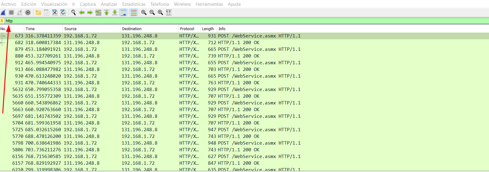
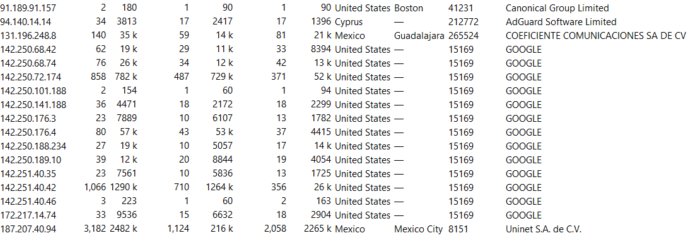
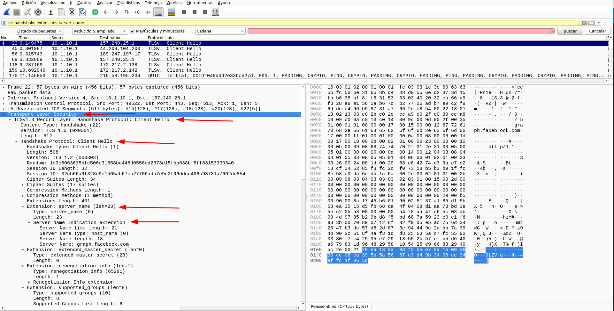
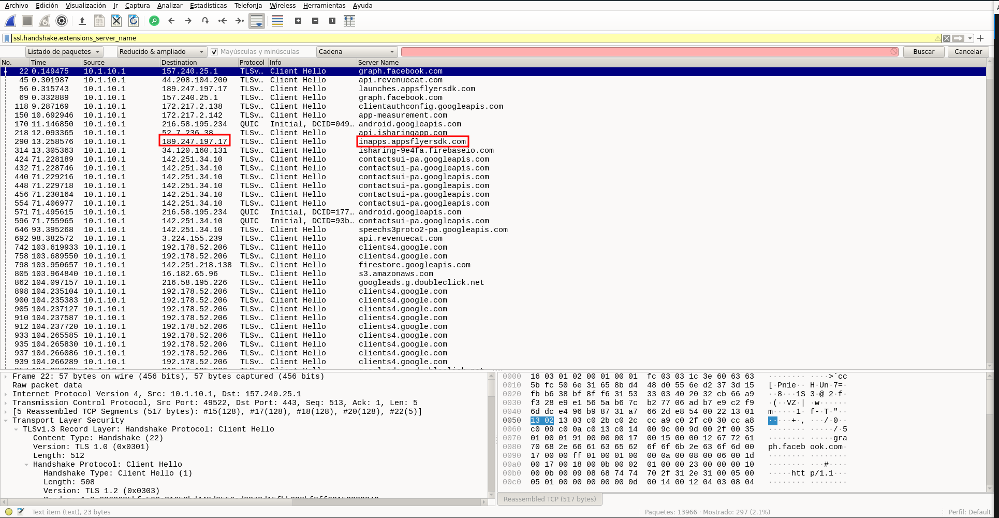

# Tutorial: Captura y análisis del tráfico de red de aplicaciones en Android

Este tutorial te guiará paso a paso para capturar y analizar el tráfico de red de aplicaciones Android, utilizando herramientas como WireGuard, Tshark y Wireshark. Aprenderáss a configurar el entorno necesario, realizar capturas de paquetes de red y analizar los datos obtenidos para identificar conexiones realizadas por las aplicaciones, dominio y riesgos de seguridad.

## Prerrequisitos
   - Cliente de WireGuard instalado en el celular y configurado. 
   - Máquina virtual con el servidor VPN WireGuard instalado.
   - El cliente y el servidor deben estar los dos en la misma red local.
      
## Pasos a seguir

1. Conecta el teléfono a la VPN configurada con WireGuard.
2. Ejecuta Tshark en la máquina virtual para capturar el tráfico de red.
3. Utiliza la aplicación que deseas analizar en el teléfono.
4. Terminar la captura de tráfico en Tshark cuando se termine de usar la aplicación.
5. Exporta los paquetes capturados en un archivo que pueda ser analizado con Wireshark.

> **Nota**: Recomendamos realizar la captura de tráfico de red de las aplicaciones a través de la aplicación Draeneg. Aquí el [tutorial](https://docs.datavoros.org/tutoriales/02-1-captura-de-trafico-draeneg/)

## Sugerencias y recomendaciones opcionales

### Sugerencias de optimización de análisis 

Para optimizar la captura y análisis del tráfico de red en dispositivos Android, considera las siguientes configuraciones:

1. **Utilizar LineageOS (opcional):**
   - Descarga e instala [LineageOS](https://lineageos.org/) en el dispositivo.
   - LineageOS elimina funciones innecesarias y aplicaciones preinstaladas, facilitando una captura más limpia de tráfico.

2. **Desinstalar o inhabilitar aplicaciones no esenciales:**
   - Desinstala la mayoría de las aplicaciones preinstaladas.
   - [Inhabilita aplicaciones](https://support.google.com/android/answer/2521768?hl=es) que no puedan ser desinstaladas.

3. **Restringir acceso a Internet para aplicaciones:**
   - Para Android 10, utiliza [esta guía](https://www.digitalcitizen.life/how-block-internet-access-specific-apps-android/).
   - Para Android 11, utiliza [esta guía](https://krispitech.com/how-to-prevent-android-apps-from-sending-and-receiving-data-in-background/).
   - En Android 12 o superior, elimina el permiso de **Datos en segundo plano**:
     - Ve a **Configuración** > **Apps**.
     - Selecciona la app deseada > **Wi-Fi y datos móviles**.
     - Desactiva el permiso de **Datos en segundo plano**.

4. **Registrar configuraciones alteradas:**
   - Marca las aplicaciones cuyos permisos se hayan modificado para restaurarlos después de la captura.

### Sugerencias para un Análisis Profundo de Protocolos

Al analizar el tráfico capturado, es útil explorar los siguientes protocolos para obtener información más detallada sobre las conexiones y datos transmitidos:

- [ARP](https://es.wikipedia.org/wiki/Protocolo_de_resoluci%C3%B3n_de_direcciones): Identifica dispositivos en la red local y sus direcciones IP.
- **DNS**: Traduce direcciones IP a nombres de dominio legibles por humanos, como `www.google.com`.
- [HTTP](https://es.wikipedia.org/wiki/Protocolo_de_transferencia_de_hipertexto): Protocolo utilizado para transferir datos entre direcciones IP. Es importante para identificar información no cifrada.
- [HTTPS](https://es.wikipedia.org/wiki/Protocolo_seguro_de_transferencia_de_hipertexto): Versión segura de HTTP, que cifra los datos transmitidos para proteger la privacidad.
- **OpenVPN**: Protocolo utilizado para redes privadas virtuales, como WireGuard. Proporciona datos sobre direcciones IP públicas y locales.
- [TCP](https://es.wikipedia.org/wiki/Protocolo_de_control_de_transmisi%C3%B3n): Protocolo en la capa de transporte que soporta otros protocolos, como HTTP.
- [TLS](https://es.wikipedia.org/wiki/Seguridad_de_la_capa_de_transporte): Protocolo criptográfico que garantiza comunicaciones seguras, apareciendo como **TLSv1.3** en Wireshark.
- [UDP](https://es.wikipedia.org/wiki/Protocolo_de_datagramas_de_usuario): Similar a TCP pero más rápido, aunque menos fiable, dependiendo del tipo de datos transmitidos.

> Estas configuraciones y sugerencias te ayudarán a capturar y analizar el tráfico de red de manera más precisa y efectiva, facilitando la identificación de riesgos de seguridad y conexiones importantes. Sin embargo, no es completamente necesario realizar estas configuraciones ni es requisito obligatorio para seguir este tutorial.


## Captura de datos

### Procedimiento 
1. **Preparar el dispositivo y entorno**
   - Instala la aplicación que se deseas analizar
   - Cierra todas las aplicaciones que están corriendo en el dispositivo
   - Activar WireGuard en el teléfono

2. **Inicializar Tshark**  
   - En la máquina virtual, abre la terminaly ejecuta el siguiente comando
      ```
      sudo tshark -i enp0s3 -w /tmp/nombredelapp.pcap
      ```
   > -i especifica la interfaz a utilizar, comúnmente es una interfaz Ethernet como `enp0s3` o `ens33`. -w define la ruta donde se guardará el archivo de captura. Utiliza `/tmp` para evitar problemas con permisos.

3. **Capturar tráfico de red**
   - Abre la aplicación que deseas analizar en el teléfono.
   - Verifica en la consola que el número de paquetes capturados aumenta.

4. **Utiliza la aplicación**
   - Utiliza todas las funciones de la aplicación para registrar el tráfico generado hacia diferentes servidores.

5. **Detener la captura**
   - Cierra la aplicación en el teléfono
   - En la terminal presiona **ctrl + c** para detener Tshark

6. **Guardar el archivo capturado**
   - Si el archivo es considerado como satisfactorio, debes ajustar sus permisos para moverlo a otro directorio con el siguiente comando:
      ```
      sudo chmod 777 /tmp/nombredelapp.pcap
      ```
   - Mueve el archivo al directorio de documentos
      ~~~
      mv /tmp/nombredelapp.pcap /home/seguridad/Documentos
      ~~~
   > Reemplaza *seguridad* con el nombre de usuario de tu máquina virtual.

## Análisis del tráfico de red

### Configuración de Wireshark 

1. **Registro y descarga de bases de datos Maxind**
   - Registrate en [Maxmind](https://www.maxmind.com/en/geolite2/signup?lang=en).
   - Descarga las siguientes bases de datos:
      - Geolite2 ASN
      - GeoLite2 City 
      - GeoLite2 Country 

   > **Importante** Para este análisis es requerido una base de datos con información referente a direcciones y localizaciones de direcciones IP

    

2. **Organizar las bases de datos**

   - Después de descargarlos, crea un directorio en donde guardarlos. En este caso le llamaremos MaxMind. 
   - Dirigete a la carpeta de descargas, identifica la carpeta de la descarga y descomprimela. 
   - Mueve las carpetas al directorio creado como MaxMind, el contenido debera quedar organizado de esta manera:
       - GeoLite2-ASN_20220614
       - GeoLite2-Country_20220614
       - GeoLite2-City_20220614   

3. **Configurar WireShark**
   - Abre Wireshark, y ve a *Edición* --> *Preferencias* --> *Name Resolution* --> *MaxMind Database Directories* y *Edit*

   

   - Haz click en el botón de **+**, luego **Browse** y selecciona cada una de las carpetas extraídas que movimos en el paso anterior.

   .

   - Cerramos Wireshark y lo reiniciamos. 

> Lo que acabamos de hacer nos permitirá visualizar las direcciones IP del tráfico de red que capturamos de una manera más cómoda y útil. 

### Análisis de los datos

Para realizar el analisis de los datos, tienes que seguir los siguientes pasos:

1. **Abrir el archivo de captura**
   - Ve a **Archivo** en Wireshark y selecciona el archivo de captura de la aplicación *nombredelapp.pcap*. Veremos una pantalla similar a la siguiente:

   

2. **Interpretar columnas clave**  
   - Verifica la información presentada en el archivo considerando las columnas: 
      - **No.**: indica el número de orden en el que el paquete de datos fue capturado. Se empieza, naturalmente, con el número 1. 
      - **Time**: se  refiere al momento en el que fue capturado dicho paquete.
      - **Source**: es el origen del paquete, es decir la dirección IP. Aparecerán otras direcciones desde donde se envían datos.
      - **Destination**: dirección IP a donde se envió el paquete.
      - **Protocol**: protocolo utilizado en la transmisión.
      - **Length**: cantidad de bytes del paquete.
      - **Info**: información respecto del paquete.

> De la información presentada en el archivo, lo relevante para nuestro analisis son las columnas **Source**, de **Destination** y de **Protocol**.

#### **Análisis HTTP**

Para este análisis es importante tener suficientemente claro la información que se te presenta en el anális anterior. Posterior a ello puedes realizar este análisis con más facilidad.

1. **Análisis de la columna protocol**
   - Escribe **http** en la barra de filtros de Wireshark y haz click en **enter**
   - Si hay conexiones con este protocolo, te aparecerán en la parte de abajo, normalmente marcadas con el color verde. 

    

2. **Revisar contenido de los paquetes**
   - Selecciona un paquete HTTP en la lista
   Observa los datos que fueron capturados en la parte inferior de WIreshark, donde se muestra el contenido del paquete.   
 
      

3. **Identificar problematicas**
   - Analiza los datos enviados y recibidos para detectar si es que se está incluyendo infomación sensible.
   - Verifica el protocolo de envio de los datos para confirmar si es que se está presentando un alto riesgo de la seguridad si es que se está omitiendo el cifrado.

   

   > En esta aplicación que utilizamos como ejemplo, la información Apellido Paterno, Apellido Materno, Email, Teléfono Fijo, etc. ha sido mandada con el protoclo http datos de registro de la aplicación:  Esto, por supuesto, representa un problema mayúsculo de seguridad y de privacidad.

4. **Revisar otros protocolos**
   Durante el análisis podrían aparecer otros protocolos relevantes que se encuentran frecuentemente en este tipo de análisis. Es recomendable que verifiques la integridad de la información que utilizan estos protocolos.

Dejamos aquí, una explicación de algunos otros protocolos que se pueden encontrar muy seguido:


#### **Análisis direcciones IP**

Ahora bien, para analizar las diferentes direcciones IP que hay en nuestro archivo, haremos lo siguiente:

1. **Acceder a las estadísiticas de puntos finales**
   - Ve a *Estadísticas* --> *Puntos Finales* --> *IPv4*. 
   - Esto abrirá una ventana donde aparecerán filtradas la lista de direcciones IP contactadas
   
   

2. **Interpretar las columnas clave**
   - **Address**: dirección IP
   - **Packets**: número total de paquetes enviados y recibidos
   - **Bytes**: la cantidad de información enviada y recibida
   - **Tx Packets**: número de paquetes enviados desde esa IP
   - **Tx Bytes**: cantidad de datos enviados desde esa dirección IP
   - **Rx Packets**: número paquetes recibidos por esa dirección IP
   - **Rx Bytes**: cantidad de datos recibidos por esa IP
   - **Country**: país donde está localizada la dirección IP
   - **City**: ciudad donde está localizada la dirección IP
   - **AS Number**: Número de sistema autónomo [ASN](https://es.wikipedia.org/wiki/Sistema_aut%C3%B3nomo) 
   - **AS Organization**: Organización a la que pertenece esa dirección IP

3. **Identificar a donde van los datos**
   -Investiga organizaciones desconocidas para identificar su rol o papel dentro de la transmisión de datos.

   > **Por ejemplo**: [Akamai](https://www.akamai.com/es) es una empresa empresa, que proporciona productos de seguridad en la nube, y es conocida por ser un [CDN](https://es.wikipedia.org/wiki/Red_de_distribuci%C3%B3n_de_contenidos)  y no necesariamente almacena datos sensibles.

    

4. **Visualizar mapa de conexiones**
   - Haz click en **Map** y luego en **Open in Browser**
   - Tendremos algo similar a esto:

   


Hasta este punto ha concluido el análisis de tráfico de red. Es importante remarcar que este análisis puede ser mucho más profundo, y dependerá de estar investigando activamente más empresas, otras opciones de Wireshark y la meta del mismo para hacerlo. Algunas veces, habrá direcciones IP que no aparezcan en Wireshark, recomendamos para ello utilizar esta página para buscar información sobre ellas. 

> :exclamation: Si tu navegador no te permite visualizar el mapa será necesario que descargues las librerías de javascript [Leaflet](https://leafletjs.com/download.html) y [Leaflet Market Cluster](https://github.com/Leaflet/Leaflet.markercluster)

**Pasos para corregir el error de visualización**

 1. Instala javascript si no lo tienes instalado con `sudo apt install npm`
 
 2. Crea un directorio para la librería sudo `mkdir /usr/share/javascript/leaflet`
 
 3. Descomprime la librería Leaflet en el directorio `unzip /Dowloads/leaflet.zip -d /usr/share/javascript/leaflet`
 
4. Crea un directorio para la librería sudo `mkdir /usr/share/javascript/leaflet/market-cluster`

5. Descomprime la librería Market Cluster en el directorio  `unzip Dowloads/leaflet-market-cluster.zip -d /usr/share/javascript/leaflet/market-cluster`

6. Copia del directorio *market-cluster/dist* los archivos *MarkerCluster.css, MarkerCluster.Default.css, leaflet.markercluster.js* al directorio de la librería *leaflet*.

`cd /usr/share/javascript/leaflet` 

`cp ./market-cluster/dist/MarkerCluster.css .` 

`cp ./market-cluster/dist/MarkerCluster.Default.css .` 

`cp ./market-cluster/dist/leaflet.markercluster.js .` 

#### **Análisis de registros DNS y SNI**

Esta sección del tutorial tiene el objetivo de profundizar en conocer qué servicios y dominios son los que contactan la aplicación móvil.   

Para hacer esto, existen dos maneras. 

#### Identificar dominios con DNS 
   
1. **Filtrar registros DNS**
   - Escriba **dns** en la barra de filtros de Wireshark y presiona **enter**
   -Analiza las llamadas DNS realizadas por la aplicación 

    

2. **Buscar registros A:**
   - En la lista de paquetes DNS, busca registros tipo **A** que vinculan un dominio con una dirección IP.
   - Identifica el dominio relacionado con las direcciones IP de los *endpoints* obtenidas previamente.

3. **Buscar dominios asociados a una IP especifica**
   - Haz click a la lupa verde para abrir una nueva linea de filtrado 

   

   - Configura los filtros de la siguiente manera:
      - **Listado de paquetes** en la primera sección
      - **Reducido y ampliado** en la segunda sección
      - **Cadena** en la tercera sección
      - **IP (endpoint)** en la cuarta sección 
   - Identifica el dominio asociado con esa direccion IP

   

#### Identificar dominios con DNS   

1. **Filtrar paquetes con SNI**
   - Escribe ssl.handshake.extensions_server_name en la barra de filtros de WIreshark y presiona **Enter**.
   - Esto va a filtrar todos los paquetes involucrados en el *handshake*. Como vemos, aparece nuestra dirección IP de origen y esta vez, la IP de destino sí es la dirección de nuestros *endpoints*.    

   

2. **Extraer información del SNI**
   - Selecciona el primer paquete filtrado.
   - En la parte inferior, expande los siguientes menús:
      - **Transport Layer Security**
      - **TLSv1.3 Record Layer: Handshake Protocol: Cliente Hello**
      - **Hanshake Protocl: Client Hello**
      - **Extension Server Name**
      - Y por último expandimos **Server Name Indication extension**   

   

3. **Agregar columna para dominios**
   - Haz click con el botón derecho al campo **Server Name Indication Extension** 
   - Haz click en **Aplicar como columna**. 
   - Esto nos generará una columna que se llama Server Name y que contiene el dominio contactado y la dirección IP del *endpoint*.   

   


## Conclusión
Este análisis permite identificar dominios específicos contactados por la aplicación, incluso cuando las direcciónes IP corresponden a servidores compartidos. Con esta información, es posible:
- Determinar la ubicación y función de los dominios.
- Identificar servicios específicos utilizados por la aplicación.
- Detectar rastreadores y servicios desconocidos.


