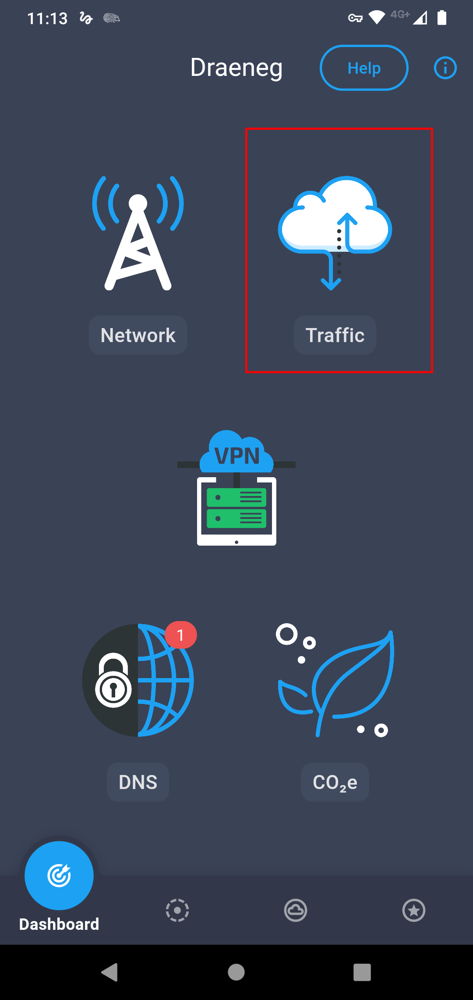
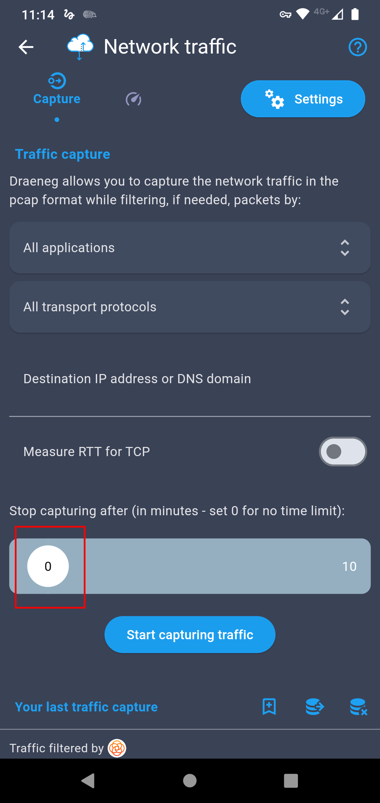
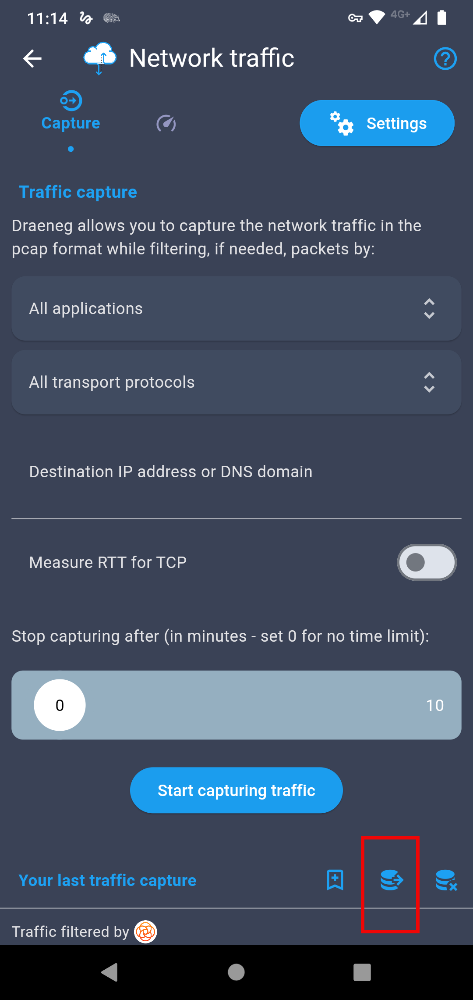
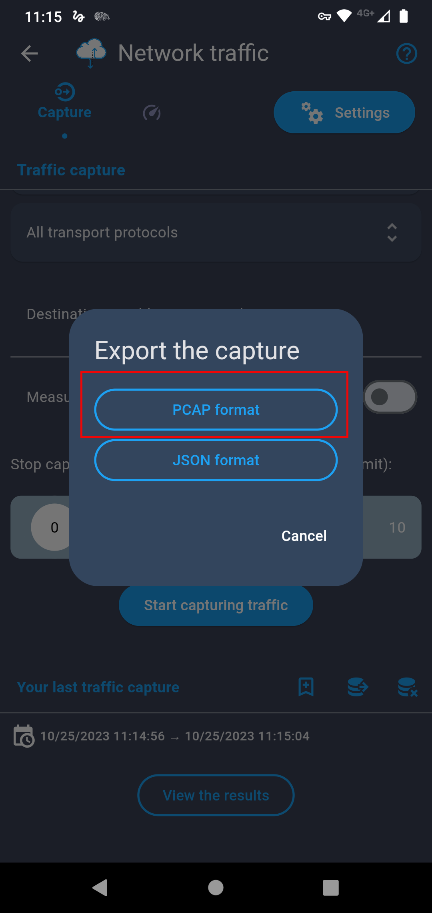

# Captura de tráfico a través de la aplicación Draeneg

- Instalar la aplicación que se quiere analizar.
- Instalar la aplicación [Draeneg](https://play.google.com/store/apps/details?id=com.orange.labs.draeneg)
- Abrir Draeneg y seleccionar **Traffic**

- Seleccionar en la pestaña **All Applications** la aplicación que queremos analizar.

- En la sección **Stop Capturing After...** ponerlo en 0.

- Dar click en **Start Capturing Traffic**

- Aparecerá la leyenda **Enable VPN**. Dar click en **Enable**. Y volver a  dar click en **Start Capturing Traffic**. Esto lo que hace es generar una VPN interna en el teléfono, de tal manera que puede filtrar y capturar los paquetes de datos.

- Abrir la aplicación que se quiere analizar y utilizarla normalmente.
- Cuando se termine de utilizar, cerrar la aplicación que se quiere analizar, y en Draeneg, darle click a **Stop capturing traffic**

- Darle click al ícono de **Exportar base de datos**

- Seleccionar **PCAP Format**

- Seleccionar la carpeta donde guardarlo y el nombre de archivo y luego extraer el archivo del celular.

¡Listo! Este archivo es el que analizaremos más adelante en Wireshark!
