# Tutorial: Identificación de permisos y rastreadores en aplicaciones Android

En este tutorial aprenderás, paso a paso, a verificar los permisos de una aplicación tanto desde la PlayStore de Google como mediante el servicio de Exodus Privacy. Además, descubrirás cómo identificar los rastreadores presentes en una aplicación y acceder a información detallada sobre ellos.

## Objetivos

- **Permisos en la PlayStore:** Aprender a encontrar y visualizar los permisos que solicita una aplicación a través de la PlayStore.
- **Permisos embebidos:** Utilizar Exodus Privacy para analizar los permisos que están integrados en el código de la aplicación.
- **Rastreadores:** Identificar y obtener detalles de los rastreadores que se detectan en una aplicación.

## Requisitos Previos

- Acceso a Internet y un navegador web.
- Conocer el enlace a la [PlayStore de Google](https://play.google.com/store/apps).
- Acceso al servicio [Exodus Privacy](https://exodus-privacy.eu.org/en/).

## Parte 1: Consultar permisos en la PlayStore

### Paso 1: Acceder a la PlayStore

1. Abre tu navegador y entra en la [PlayStore de Google](https://play.google.com/store/apps).

### Paso 2: Buscar la aplicación

1. Activa la opción de búsqueda haciendo clic en el ícono correspondiente.  
   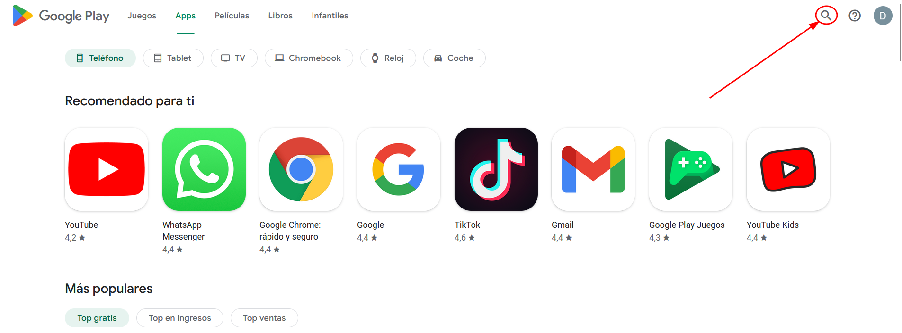
2. Escribe el nombre de la aplicación en la barra de búsqueda.  
   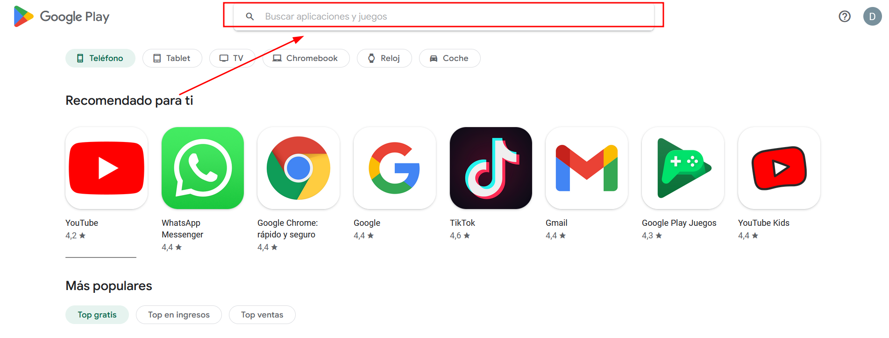

### Paso 3: Acceder a la información de la aplicación

1. Selecciona la aplicación de la lista de resultados.
2. Desplázate hasta la sección **"Información de la aplicación"**.  
   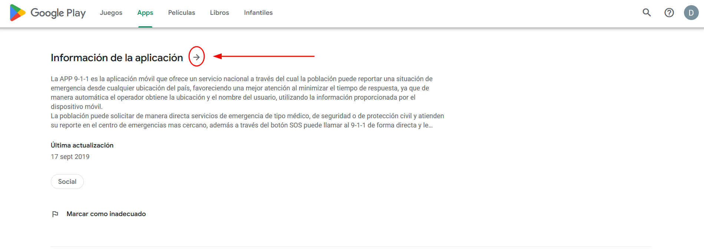

### Paso 4: Visualizar los permisos

1. Haz clic en **"detalles"** dentro de la sección de **"Permisos"**.  
   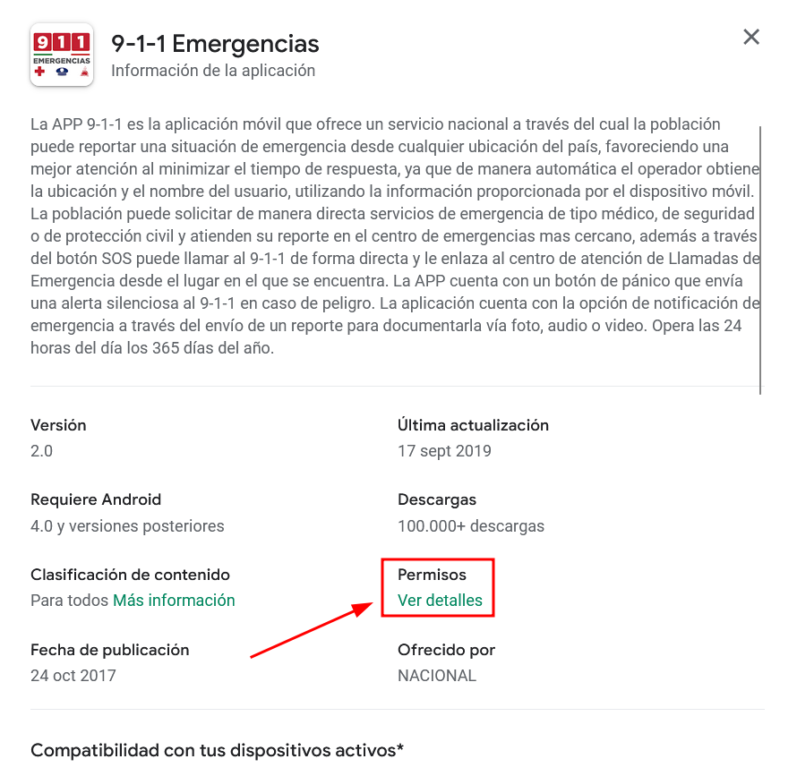
2. Se mostrará una lista con los permisos que la aplicación solicita.  
   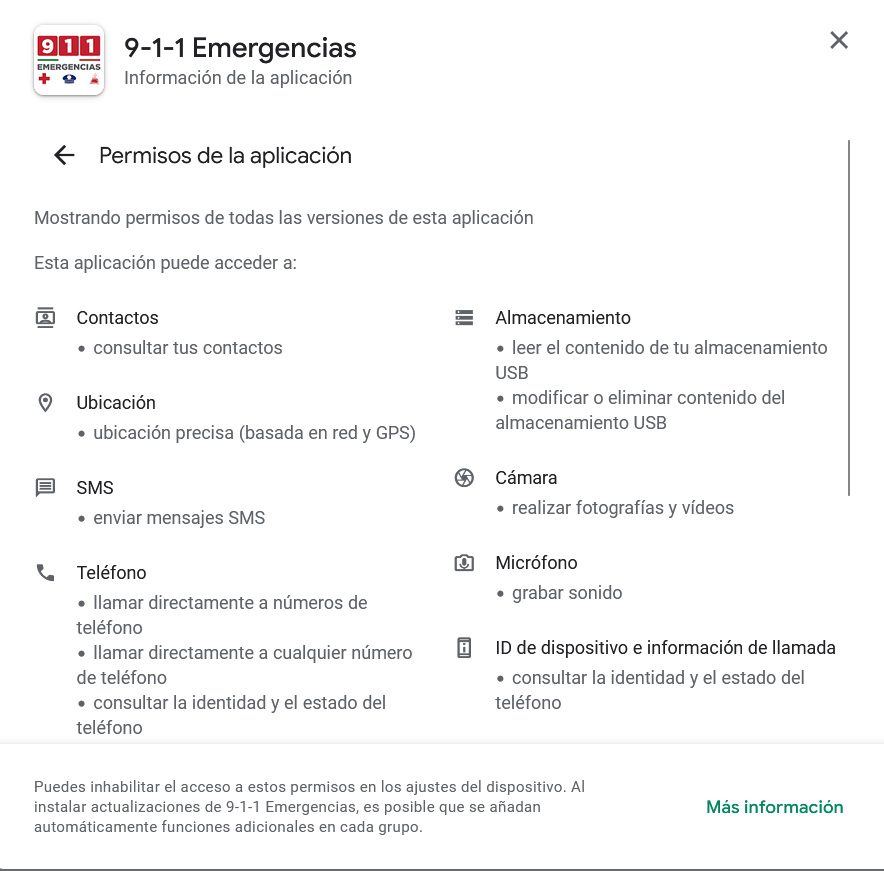

## Parte 2: Analizar permisos embebidos mediante Exodus Privacy

### Paso 1: Acceder a Exodus Privacy

1. Dirígete al [sitio de Exodus Privacy](https://exodus-privacy.eu.org/en/).

### Paso 2: Buscar la aplicación

1. Puedes buscar la aplicación por su nombre o utilizando la URL de la PlayStore (extrae el identificador que aparece después de `id=` en la URL).  
   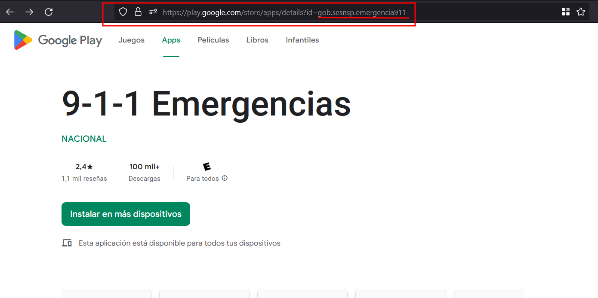

### Paso 3: Revisar resultados previos

1. Si la aplicación ya fue analizada, aparecerá en la lista de resultados.  
   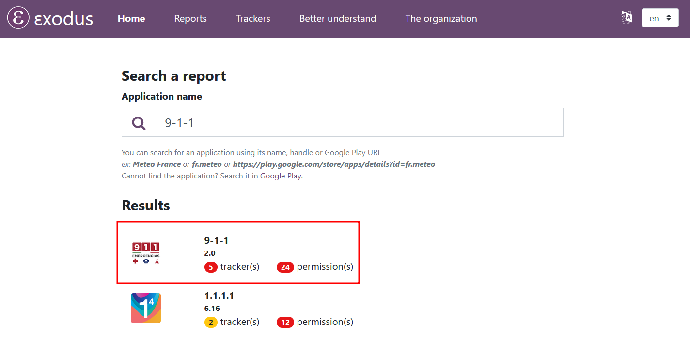

### Paso 4: Realizar un nuevo análisis (si es necesario)

1. Si la aplicación o la versión que deseas analizar no aparece, desplázate hasta **"Perform new analysis"**.  
   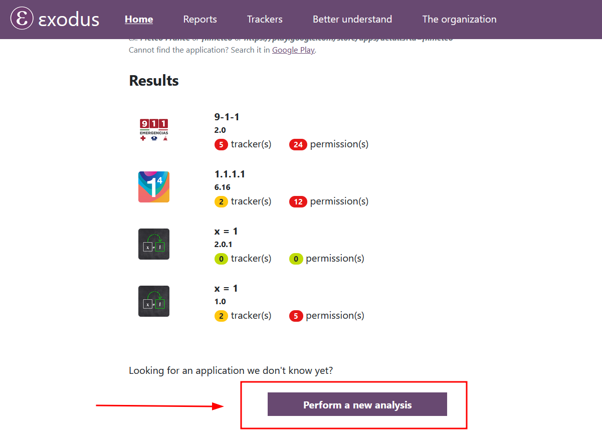
2. Ingresa la URL o el identificador de la aplicación y haz clic en **"Perform analysis"**.  
   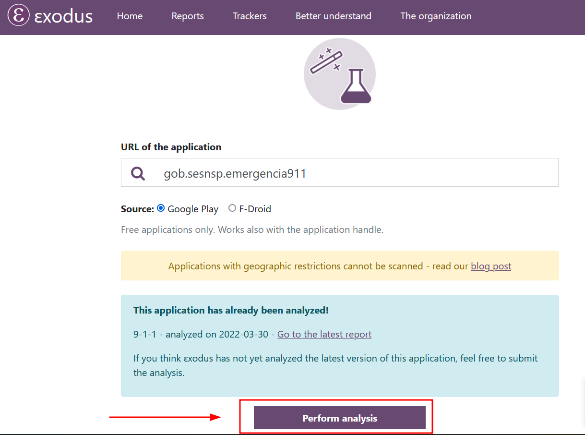
3. Espera a que se complete el análisis.  
   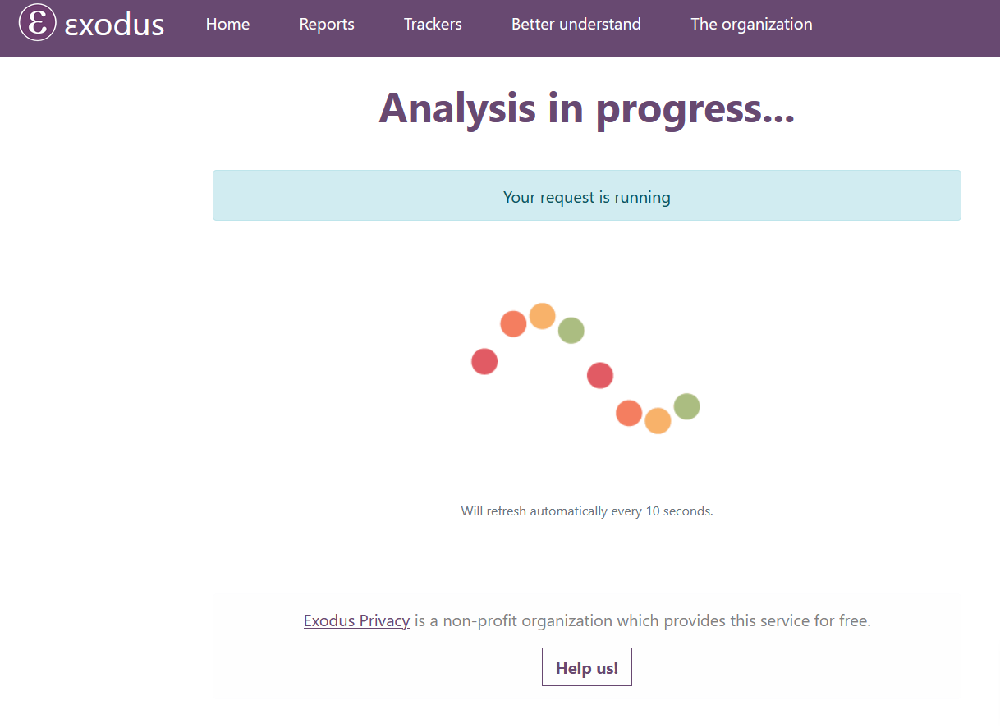

### Paso 5: Revisar el reporte de análisis

1. Una vez finalizado el análisis, haz clic en **"See the report"**.  
   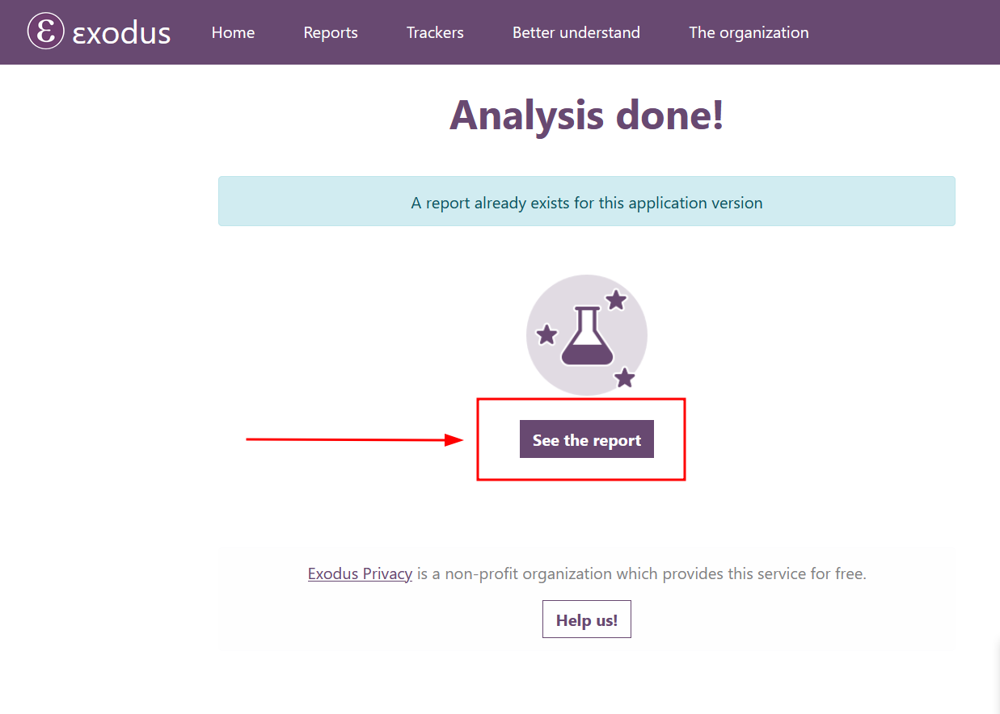
2. Se mostrará un resumen con el número de rastreadores y la cantidad de permisos.  
   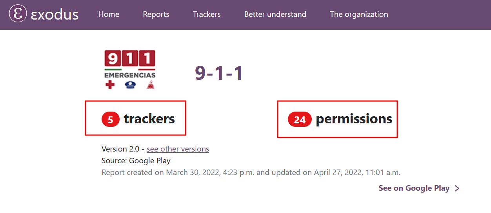
3. Desplázate hacia abajo para visualizar la sección de permisos, donde encontrarás:
   - Una lista de permisos embebidos.
   - Explicaciones adicionales para algunos permisos.
   - Indicadores (como un signo de exclamación en rojo) que señalan permisos considerados peligrosos por Google.  
   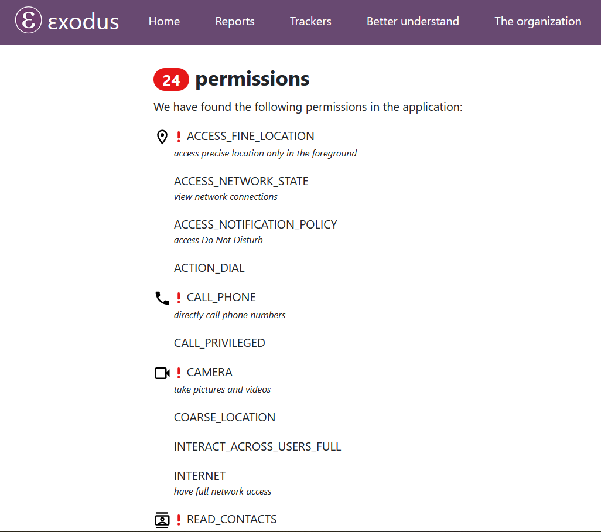

## Parte 3: Identificar rastreadores en la aplicación

### Paso 1: Acceder a la sección de rastreadores

1. Dentro del reporte de Exodus Privacy, ubica la sección dedicada a los rastreadores.  
   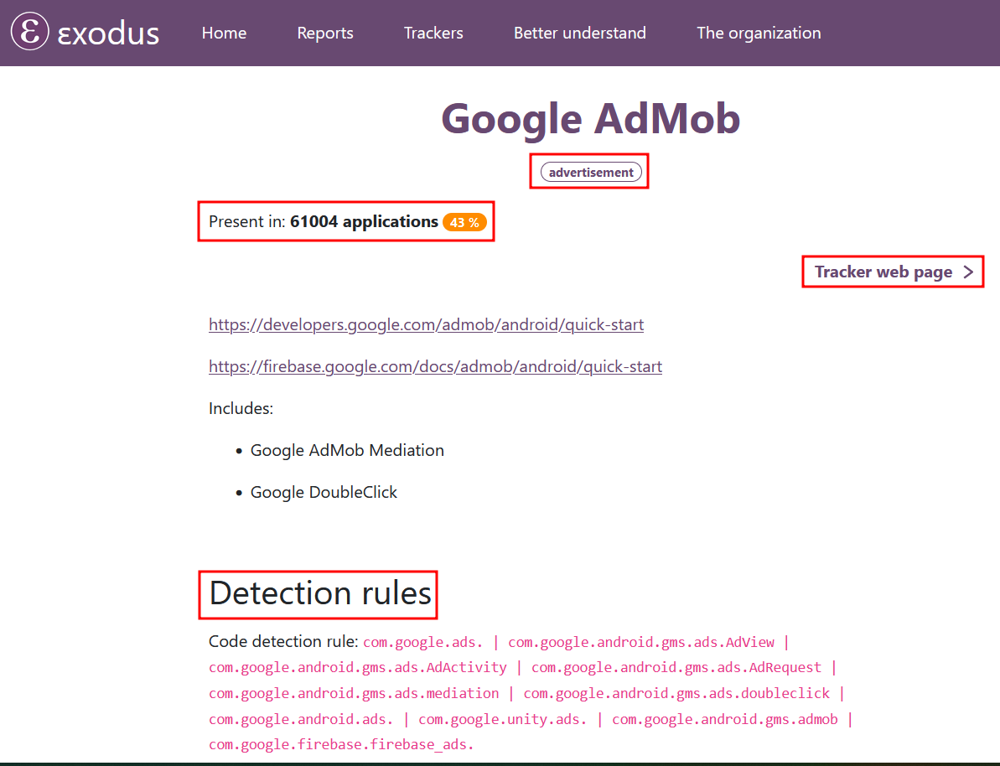

### Paso 2: Consultar información detallada del rastreador

1. Haz clic en cualquier rastreador para acceder a una página con información adicional.
2. En la página del rastreador encontrarás:
   - **Nombre del rastreador** y **tipo de rastreador** (por ejemplo, "Advertising" para publicidad).
   - La cantidad de aplicaciones en las que se ha detectado el rastreador.
   - Enlaces a la página para desarrolladores y, en algunos casos, un enlace a la página web general del rastreador.
   - **Detection Rules:** Reglas que explican cómo se identifica la presencia del rastreador en el código de la aplicación.

## Conclusión

   En este tutorial has aprendido a:

   - **Visualizar permisos en la PlayStore:** Mediante una búsqueda y exploración de la sección "Información de la aplicación".
   - **Analizar permisos embebidos:** Usando Exodus Privacy para obtener un informe detallado de los permisos integrados en el código.
   - **Identificar rastreadores:** Revisando el reporte de Exodus Privacy y consultando información detallada de cada rastreador.

   Con estos pasos, estarás mejor equipado para evaluar la seguridad y privacidad de las aplicaciones que utilizas. ¡Practica estos procedimientos y refuerza tu conocimiento sobre la protección de datos en el entorno móvil!
