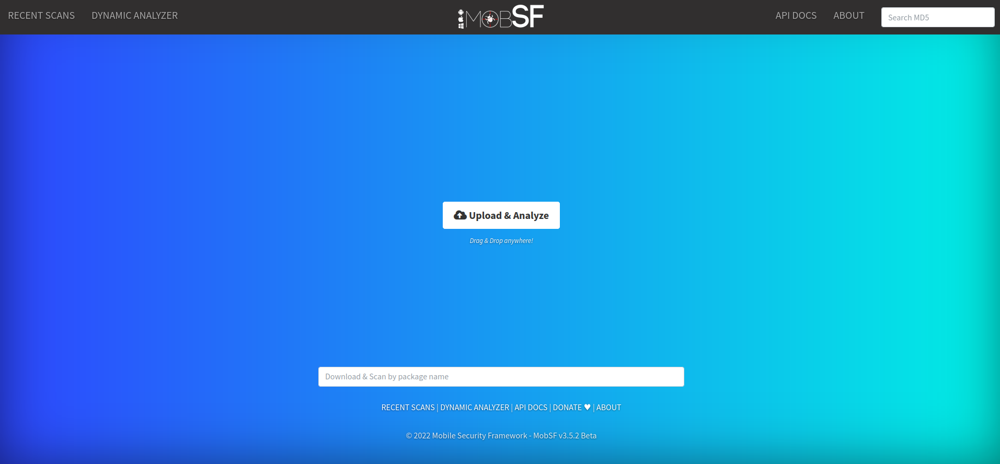
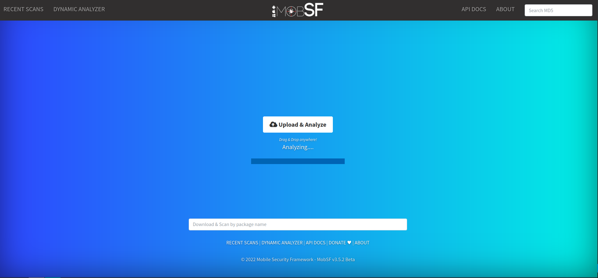
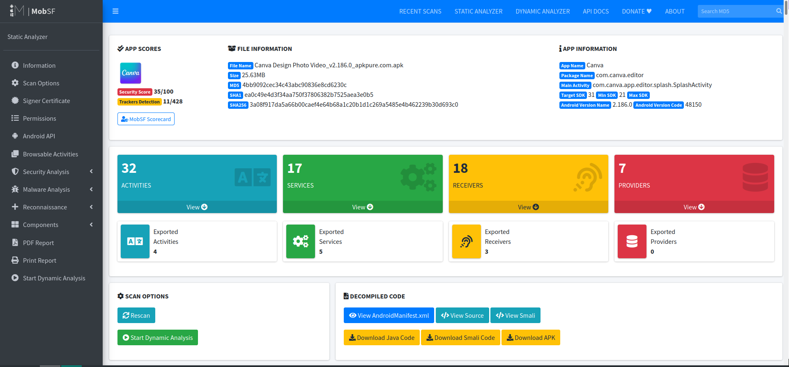
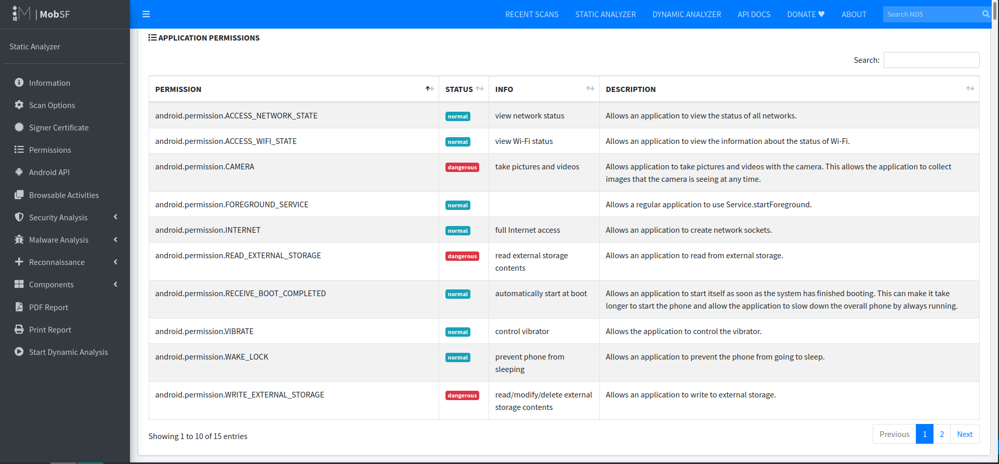
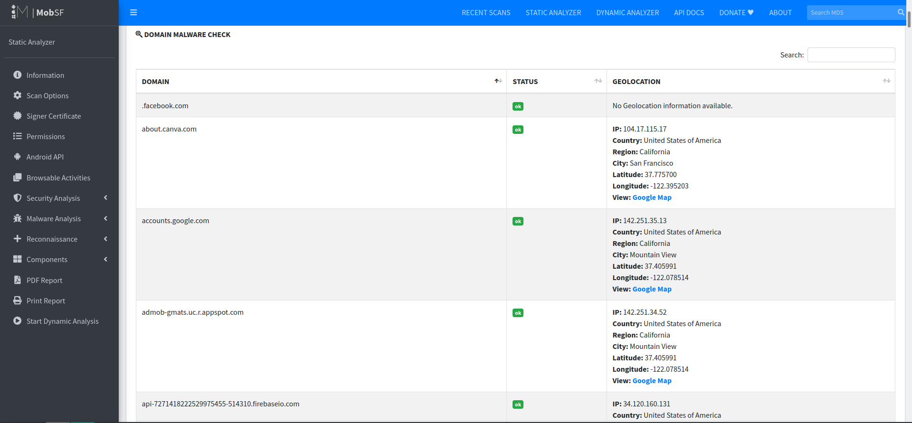
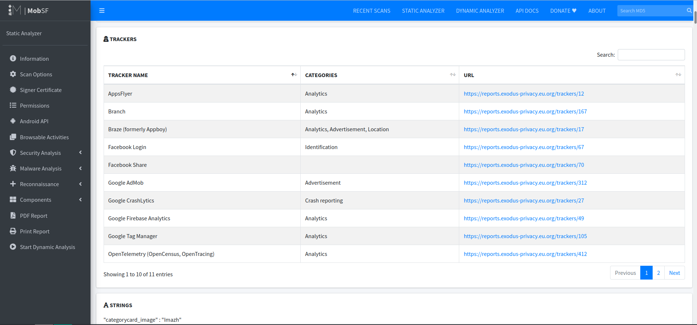
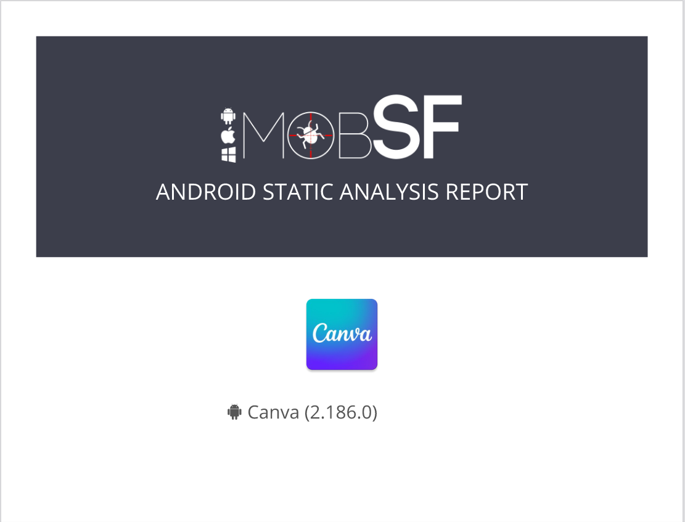

# Tutorial: Instalación y uso de MobSF

Este tutorial te guiará de manera práctica para conocer, instalar, ejecutar y utilizar MobSF (Mobile Security Framework) para realizar análisis estáticos y dinámicos en aplicaciones móviles. MobSF es una herramienta poderosa que automatiza el análisis de seguridad, identificando vulnerabilidades, posibles malwares, permisos y rastreadores en una aplicación.

## 1. Contexto y Objetivos

### Qué es MobSF

MobSF (Mobile Security Framework) es un programa que automatiza una serie de análisis estáticos y dinámicos de aplicaciones móviles. Con MobSF, puedes:
- Identificar los permisos que solicita una aplicación.
- Detectar rastreadores.
- Analizar vulnerabilidades, tipos de malware y problemas de privacidad.

MobSF ofrece otras funcionalidades avanzadas para enriquecer tus análisis de seguridad.

### Objetivos del Tutorial

- **Comprender la herramienta:** Conocer qué es MobSF y sus capacidades.
- **Instalar MobSF:** Cumplir con los requerimientos y realizar la instalación según las mejores prácticas.
- **Ejecutar MobSF:** Iniciar el entorno de MobSF y acceder a su interfaz web.
- **Realizar análisis estáticos:** Subir un archivo APK, visualizar permisos, analizar conexiones de red y rastreadores, y generar reportes PDF.


## 2. Instalación de MobSF

### Requerimientos Previos

Antes de instalar MobSF, asegúrate de cumplir con lo siguiente:
- Revisa los [Requerimientos de MobSF](https://mobsf.github.io/docs/#/running_mobsf_docker?id=static-analysis) para conocer las dependencias y configuraciones necesarias.
- Para análisis dinámico, MobSF **no debe ejecutarse en una máquina virtual**, ya que utiliza emuladores (Android Studio o GenyMotion) que requieren ejecutarse en un entorno sin virtualización anidada.

### Guía de Instalación y ejecución de MobSF usando Docker

#### Paso 1:  Descargar la última imagen de MobSF desde Docker Hub
```
sudo docker pull opensecurity/mobile-security-framework-mobsf:latest

```

#### Paso 2: Ejecutar MobSF
```
sudo docker run -it --rm -p 8000:8000 opensecurity/mobile-security-framework-mobsf:latest
```

#### Paso 3: Acceder a MobSF en el navegador
Abre tu navegador y escribe la siguiente dirección:
```
http://127.0.0.1:8000
```
   Credenciales por defecto
      - Usuario: 'mobsf'
      - Contraseña: 'mobsf'

**Opcional:**  Detener MobSF cuando se termine la interacción
Puedes detener MobSF con dos métodos 

- Primero:
	```
	Ctrl+C
	```
- Segundo:
	```
	docker ps 
	docker stop <container_id>
	```


**Nota:** Existe una versión en línea de [MobSF](https://mobsf.live/), pero:
> - Los análisis realizados son públicos.
> - Los datos se mantienen solo durante algunas horas antes de ser reemplazados.


## 3. Uso de MobSF para Análisis Estáticos

Una vez que MobSF esté en ejecución, sigue estos pasos para analizar un archivo APK:

### 3.1 Carga y Análisis del Archivo

1. **Carga del APK:**
   - Desde la pantalla de bienvenida, arrastra el archivo APK a la ventana o haz clic en "Upload & Analyze" para seleccionarlo.
   - Aparecerá una pantalla que indica que el análisis está en curso.
   
     
   

2. **Resultados del Análisis:**
   - Al finalizar, MobSF mostrará una pantalla con el resultado del análisis.
   
   

### 3.2 Visualización de Permisos y Otros Datos

1. **Sección de Permisos:**
   - Desplázate hacia abajo para ver la lista de permisos solicitados por la aplicación, junto con su descripción y categoría de riesgo.
   
   

2. **Análisis de Conexiones y Dominios:**
   - MobSF muestra un mapa con los posibles dominios a los que la aplicación se conecta. Esto no garantiza conexiones reales; se recomienda realizar un análisis de tráfico con herramientas como Wireshark.
   
   

3. **Verificación de Malware en Dominios:**
   - La sección "Domain Malware Check" analiza los dominios para determinar si alguno presenta riesgos maliciosos.
   
   

4. **Detección de Rastreadores:**
   - MobSF detecta los rastreadores presentes y ofrece enlaces a la página del rastreador en el proyecto Exodus Privacy.
   
   

### 3.3 Generación de Reportes PDF

5. **Reporte PDF:**
   - Para generar un reporte en PDF con todos los datos del análisis, haz clic en la sección "PDF Report" en el menú lateral.
   - **Requisito adicional:** Instala la herramienta necesaria ejecutando:
     ```
     sudo apt install wkhtmltopdf
     ```
   - Una vez instalada, genera el reporte. El PDF incluirá una carátula y toda la información recopilada.
   
   


## Conclusión

   En este tutorial aprendiste a instalar, ejecutar y comprender MobSF conocer las capacidades de MobSF para realizar análisis de seguridad en aplicaciones móviles.
   Realizar análisis estáticos: Subir un archivo APK, visualizar permisos, analizar conexiones de red y rastreadores, y generar reportes PDF.
   Esta guía te proporciona una visión completa para utilizar MobSF como una herramienta integral en tus análisis de seguridad en aplicaciones móviles. 